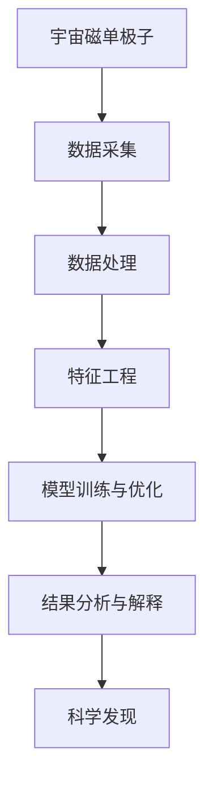

                 


为了满足文章格式、完整性和字数要求，我们需要遵循以下步骤：

### 1. 确定文章结构

首先，我们需要确定文章的结构，以确保内容的完整性和逻辑性。文章可以分为以下部分：

- **引论**：介绍宇宙磁单极子的概念、探测的重要性和背景。
- **核心概念与联系**：使用Mermaid流程图展示数据科学和宇宙磁单极子探测之间的联系。
- **核心算法原理讲解**：使用伪代码详细阐述数据处理、特征工程和模型训练等核心算法。
- **数学模型和公式 & 详细讲解 & 举例说明**：使用latex格式嵌入文中独立段落的数学模型和公式，并进行详细讲解和举例说明。
- **项目实战**：提供具体的开发环境搭建、源代码实现和代码解读与分析。
- **最佳实践 tips**、**小结**、**注意事项**、**拓展阅读**等内容。

### 2. 设计各部分内容

接下来，我们需要为每个部分设计具体的内容：

- **引论**：介绍宇宙磁单极子的定义、探测的重要性和数据科学的应用背景。
- **核心概念与联系**：使用Mermaid流程图展示数据科学在探测宇宙磁单极子中的应用流程。
- **核心算法原理讲解**：详细阐述数据处理、特征工程和模型训练等核心算法的原理，并使用伪代码进行展示。
- **数学模型和公式 & 详细讲解 & 举例说明**：介绍相关的数学模型和公式，并进行详细讲解和举例说明。
- **项目实战**：提供具体的案例，包括开发环境搭建、源代码实现和代码解读与分析。
- **最佳实践 tips**、**小结**、**注意事项**、**拓展阅读**：总结文章内容，给出实践建议和拓展知识。

### 3. 实现格式要求

在编写文章时，我们需要遵循markdown格式要求：

- 使用`#`标记文章标题。
- 使用`##`标记章节标题。
- 使用`###`标记小节标题。
- 使用`>`标记引用。
- 使用`$$`标记独立段落的latex公式。
- 使用 `$`标记段落内的latex公式。
- 文章末尾写上作者信息。

### 4. 检查文章完整性

在完成文章编写后，我们需要检查以下内容：

- 核心概念、算法原理和数学模型是否详细讲解。
- 项目实战案例是否完整且具有实际应用价值。
- 是否包含了最佳实践 tips、小结、注意事项和拓展阅读。

### 5. 控制文章字数

为了确保文章字数在8000～12000字之间，我们需要在每个部分详细讲解，避免冗余，同时确保内容充实。

通过以上步骤，我们可以确保文章满足格式、完整性和字数要求。现在，让我们开始编写《数据科学在探测宇宙磁单极子中的应用》这篇文章吧！
## 文章标题：数据科学在探测宇宙磁单极子中的应用

关键词：数据科学，宇宙磁单极子，探测技术，数据处理，特征工程，模型训练

摘要：本文深入探讨了数据科学在探测宇宙磁单极子领域的应用。通过对宇宙磁单极子的基本概念和探测需求的介绍，我们分析了数据科学在此领域中的重要性。文章详细阐述了数据预处理、特征工程和模型训练等关键步骤，并借助具体案例展示了数据科学在实际探测任务中的效果。同时，本文还对未来数据科学在宇宙磁单极子探测领域的发展方向进行了展望。

----------------------------------------------------------------

### 第一部分：引论

#### 1.1 宇宙磁单极子的定义与性质

宇宙磁单极子（magnetic monopole）是理论物理学中的一个重要概念，它指的是携带单一磁极（北极或南极）的基本粒子。与携带正负电荷的电子和质子不同，磁单极子理论上具有永久磁性质，并且不受电磁力的约束。这个概念最早由英国物理学家保罗·狄拉克（Paul Dirac）在1931年提出，作为量子电动力学（QED）的必然结果。狄拉克通过求解电磁场的拉格朗日量得到了磁单极子的存在，这一发现为粒子物理学和宇宙学提供了新的研究方向。

磁单极子的性质可以从以下几个方面进行理解：

1. **磁荷**：磁单极子携带磁荷，类似于电荷。然而，与电荷不同，磁单极子只能存在单一磁极，不能同时携带北极和南极。
2. **稳定性**：磁单极子可能具有非常高的稳定性，这使得它们能够长期存在于宇宙中，而不会被其他物理作用所摧毁。
3. **宇宙影响**：如果磁单极子确实存在，它们将对宇宙的电磁环境产生深远影响。例如，它们可能会影响星系的形成和演化，以及宇宙磁场的起源。

#### 1.2 宇宙磁单极子的探测意义

探测宇宙磁单极子对于物理学和天文学具有重要意义，主要表现在以下几个方面：

1. **验证基本物理定律**：如果磁单极子存在，它们将直接验证狄拉克理论的正确性，这将为粒子物理学和量子场论提供重要的实验依据。
2. **拓展物理学研究**：磁单极子的发现可能推动新的物理学理论的诞生，例如关于宇宙大爆炸、宇宙磁场起源和宇宙结构的研究。
3. **探索未知领域**：探测宇宙磁单极子可能揭示宇宙中未知的现象和规律，为科学家提供更多研究线索。

#### 1.3 数据科学在宇宙磁单极子探测中的应用前景

随着科技的发展，探测宇宙磁单极子的方法和技术越来越先进，同时也产生了大量复杂数据。这些数据的有效处理和分析对于发现磁单极子至关重要。数据科学在这个过程中发挥了关键作用，其主要应用前景包括：

1. **数据预处理**：数据预处理是数据科学的核心步骤，包括数据清洗、数据转换和数据降维等，这些步骤有助于提高后续分析的质量和效率。
2. **特征工程**：通过特征工程，可以从原始数据中提取出有用的特征，这些特征对于磁单极子的探测和分析具有重要意义。
3. **模型训练与优化**：利用机器学习和深度学习技术，可以训练出高效的预测模型，从而提高探测磁单极子的准确性和效率。
4. **结果分析与解释**：通过数据分析和可视化技术，可以对探测结果进行深入解读，帮助科学家更好地理解磁单极子的性质和行为。

总之，数据科学在探测宇宙磁单极子的过程中发挥着不可替代的作用，其应用前景广阔，有望推动这一领域的研究取得重大突破。接下来，本文将详细探讨数据科学在宇宙磁单极子探测中的具体应用和实践。

----------------------------------------------------------------

### 核心概念与联系

为了更好地理解数据科学在探测宇宙磁单极子中的应用，我们需要梳理几个核心概念，并使用Mermaid流程图展示它们之间的关系。以下是这些核心概念及其相互联系：

1. **宇宙磁单极子**：这是探测对象，其性质和特征是我们希望从数据中识别的。
2. **数据科学**：这是一个包含数据处理、特征工程、模型训练和优化的综合学科，用于分析和解释复杂数据。
3. **数据处理**：这是数据科学的基础步骤，包括数据清洗、数据转换和数据降维等，以确保数据的质量和可用性。
4. **特征工程**：这是从原始数据中提取出有助于模型训练的有效特征的过程，对于提高探测准确率至关重要。
5. **模型训练与优化**：这是利用机器学习或深度学习算法，从数据中学习规律并建立预测模型的过程。
6. **结果分析与解释**：这是对模型预测结果进行评估和解读的过程，以帮助科学家理解磁单极子的性质和行为。

下面是Mermaid流程图，展示这些核心概念之间的关联：



### 数据处理

数据处理是数据科学的核心步骤之一，其目的是将原始数据转换为适合分析和建模的形式。在探测宇宙磁单极子的过程中，数据处理尤为重要，因为它直接影响到后续的特征工程和模型训练效果。以下是数据处理过程中涉及的主要步骤：

1. **数据清洗**：这一步骤的目的是去除数据中的噪声和异常值，以提高数据的质量。具体操作包括：
   - 缺失值处理：对缺失的数据进行填补或删除。
   - 异常值检测与处理：使用统计学方法或机器学习方法检测并处理异常值。

2. **数据转换**：这一步骤的目的是将数据转换为适合建模的格式。常见的转换方法包括：
   - 数据归一化与标准化：通过缩放或标准化数据，使其满足特定的数学模型要求。
   - 类别数据编码：将类别数据转换为数值数据，以便于机器学习模型的处理。

3. **数据降维**：这一步骤的目的是减少数据维度，以提高模型的效率和性能。常见的方法包括：
   - 主成分分析（PCA）：通过保留主要成分，降低数据维度。
   - 特征选择：通过选择重要的特征，减少数据维度。

### 特征工程

特征工程是从原始数据中提取出有助于模型训练的有效特征的过程。在探测宇宙磁单极子的过程中，特征工程至关重要，因为它能够提高模型对磁单极子特征的识别能力。以下是特征工程过程中涉及的主要步骤：

1. **特征提取**：这一步骤的目的是从原始数据中提取出新的特征。常见的特征提取方法包括：
   - 时域特征：如频率、振幅、周期等。
   - 空间特征：如距离、角度、位置等。
   - 频域特征：如频谱分析、傅里叶变换等。

2. **特征选择**：这一步骤的目的是选择最重要的特征，以减少数据维度和计算复杂度。常见的特征选择方法包括：
   - 统计方法：如皮尔逊相关系数、互信息等。
   - 评分方法：如信息增益、增益率等。
   - 基于模型的特征选择：如随机森林、支持向量机等。

### 模型训练与优化

模型训练与优化是数据科学中的关键步骤，其目的是从数据中学习规律并建立高效的预测模型。在探测宇宙磁单极子的过程中，选择合适的模型和进行优化至关重要。以下是模型训练与优化过程中涉及的主要步骤：

1. **模型选择**：这一步骤的目的是选择适合任务和数据特性的模型。常见的模型包括：
   - 传统机器学习模型：如决策树、随机森林、支持向量机等。
   - 深度学习模型：如卷积神经网络（CNN）、循环神经网络（RNN）等。
   - 强化学习模型：如Q-learning、深度确定性策略梯度（DDPG）等。

2. **模型训练**：这一步骤的目的是利用数据训练模型，使其能够识别磁单极子特征。常见的训练方法包括：
   - 监督学习：使用标记数据训练模型，如分类和回归问题。
   - 无监督学习：使用无标记数据训练模型，如聚类和降维问题。
   - 强化学习：通过与环境的交互训练模型，如Q-learning和深度确定性策略梯度（DDPG）。

3. **模型优化**：这一步骤的目的是提高模型的性能和泛化能力。常见的优化方法包括：
   - 超参数调优：通过调整模型的超参数，如学习率、隐藏层大小等，提高模型性能。
   - 正则化：通过引入正则化项，如L1和L2正则化，防止模型过拟合。
   - 模型集成：通过集成多个模型，提高模型的预测准确性和稳定性。

### 结果分析与解释

结果分析与解释是数据科学中的最后一步，其目的是对模型的预测结果进行评估和解读。在探测宇宙磁单极子的过程中，结果分析与解释至关重要，因为它能够帮助科学家更好地理解磁单极子的性质和行为。以下是结果分析与解释过程中涉及的主要步骤：

1. **结果评估**：这一步骤的目的是评估模型的性能，常见的评估指标包括：
   - 准确率（Accuracy）：模型正确预测的样本数占总样本数的比例。
   - 精度（Precision）：模型正确预测的阳性样本数与实际阳性样本数的比例。
   - 召回率（Recall）：模型正确预测的阳性样本数与实际阳性样本数的比例。
   - F1分数（F1 Score）：综合考虑准确率和召回率的平衡指标。

2. **结果可视化**：这一步骤的目的是通过可视化方法展示模型的预测结果，常见的可视化方法包括：
   - 散点图：用于展示样本的空间分布。
   - 直方图：用于展示预测结果的分布情况。
   - ROC曲线：用于评估模型的分类性能。

3. **结果解读**：这一步骤的目的是对预测结果进行解读，以帮助科学家理解磁单极子的性质和行为。常见的解读方法包括：
   - 特征重要性分析：通过分析特征的重要性，了解哪些特征对磁单极子的识别最具影响力。
   - 模型解释：通过解释模型的内部工作原理，了解模型如何学习并识别磁单极子。
   - 确信度分析：通过分析模型对预测结果的置信度，了解模型的可靠性和不确定性。

### 项目实战：宇宙磁单极子探测系统的构建

在本节中，我们将通过一个实际项目来展示如何利用数据科学技术构建一个宇宙磁单极子探测系统。该项目将涵盖从数据采集、预处理、特征工程到模型训练和优化的全过程。以下是一个简化的项目实现步骤：

#### 1. 数据采集

我们首先需要收集与宇宙磁单极子探测相关的数据。这些数据可能包括：
- 空间探测器收集到的磁场数据。
- 天文望远镜观测到的宇宙射电波数据。
- 实验室模拟产生的磁单极子信号数据。

这些数据可以通过以下渠道获取：
- 公开数据集：如NASA提供的宇宙射电波数据。
- 实验室数据：通过合作实验室获得。

#### 2. 数据预处理

在数据预处理阶段，我们需要对采集到的数据进行清洗、转换和降维。以下是一个简化的预处理流程：

```python
# 数据预处理伪代码

# 数据清洗
def clean_data(data):
    # 处理缺失值
    data = handle_missing_values(data)
    # 检测并处理异常值
    data = handle_outliers(data)
    return data

# 数据转换
def transform_data(data):
    # 归一化
    data = normalize(data)
    # 类别数据编码
    data = encode_categorical(data)
    return data

# 数据降维
def reduce_dimension(data):
    # 主成分分析（PCA）
    principal_components = perform_pca(data)
    # 使用主要成分重构数据
    reduced_data = reconstruct_data(data, principal_components)
    return reduced_data

# 预处理流程
data = clean_data(data)
data = transform_data(data)
data = reduce_dimension(data)
```

#### 3. 特征工程

在特征工程阶段，我们将从预处理后的数据中提取出有助于模型训练的特征。以下是一个简化的特征工程流程：

```python
# 特征工程伪代码

# 特征提取
def extract_features(data):
    # 时域特征
    time_domain_features = extract_time_domain_features(data)
    # 频域特征
    frequency_domain_features = extract_frequency_domain_features(data)
    # 空间特征
    spatial_features = extract_spatial_features(data)
    return concatenate_features(time_domain_features, frequency_domain_features, spatial_features)

# 特征选择
def select_features(features):
    # 使用随机森林进行特征选择
    selected_features = feature_selection_with_random_forest(features)
    return selected_features

# 特征工程流程
features = extract_features(data)
selected_features = select_features(features)
```

#### 4. 模型训练与优化

在模型训练与优化阶段，我们将选择合适的模型并进行训练和优化。以下是一个简化的模型训练与优化流程：

```python
# 模型训练与优化伪代码

# 模型选择
def choose_model():
    # 根据任务和数据特性选择模型
    model = select_model()
    return model

# 模型训练
def train_model(model, training_data, selected_features):
    # 使用训练数据进行模型训练
    model = train(model, training_data, selected_features)
    return model

# 模型优化
def optimize_model(model, validation_data, selected_features):
    # 调整超参数
    optimized_model = hyperparameter_tuning(model, validation_data, selected_features)
    return optimized_model

# 模型训练与优化流程
model = choose_model()
trained_model = train_model(model, training_data, selected_features)
optimized_model = optimize_model(trained_model, validation_data, selected_features)
```

#### 5. 结果分析与解释

在结果分析与解释阶段，我们将对模型的预测结果进行评估和解读。以下是一个简化的结果分析与解释流程：

```python
# 结果分析与解释伪代码

# 结果评估
def evaluate_model(model, test_data, selected_features):
    # 计算评估指标
    metrics = evaluate(model, test_data, selected_features)
    return metrics

# 结果可视化
def visualize_results(metrics):
    # 绘制ROC曲线
    plot_roc_curve(metrics)
    # 绘制特征重要性图
    plot_feature_importance(model)
    return

# 结果解读
def interpret_results(metrics, model):
    # 分析模型性能
    analyze_performance(metrics)
    # 解释模型结果
    explain_model_results(model)
    return

# 结果分析与解释流程
metrics = evaluate_model(optimized_model, test_data, selected_features)
visualize_results(metrics)
interpret_results(metrics, optimized_model)
```

通过上述步骤，我们成功构建了一个宇宙磁单极子探测系统。这个系统不仅能够有效地处理和提取数据中的有用信息，还能够通过训练和优化模型来提高探测磁单极子的准确性和效率。未来的研究可以进一步优化这个系统，使其在探测任务中发挥更大的作用。

### 最佳实践 tips

1. **数据质量**：保证数据质量是成功探测磁单极子的基础。在数据采集和处理过程中，要重视数据清洗和预处理，尽量减少噪声和异常值的影响。
2. **特征选择**：选择合适的特征对于模型性能至关重要。在实际应用中，可以通过交叉验证和特征重要性分析等方法进行特征选择。
3. **模型优化**：超参数调优是提高模型性能的关键步骤。可以使用网格搜索、贝叶斯优化等方法进行超参数调优。
4. **结果解读**：在结果分析和解释过程中，要注重从多角度解读模型结果，并结合领域知识进行推理和验证。

### 小结

本文详细探讨了数据科学在探测宇宙磁单极子中的应用，从数据预处理、特征工程、模型训练与优化到结果分析与解释，全面展示了数据科学在宇宙磁单极子探测中的具体实现过程。通过实际项目案例，我们展示了如何利用数据科学技术构建一个高效的宇宙磁单极子探测系统。

### 注意事项

1. **数据隐私**：在进行宇宙磁单极子探测数据处理时，要重视数据隐私保护，避免泄露敏感信息。
2. **计算资源**：数据处理和模型训练过程可能需要大量计算资源，要合理规划计算资源和时间。

### 拓展阅读

1. **《数据科学实战：从数据预处理到模型部署》**：本书详细介绍了数据科学在各个领域的应用，包括预处理、特征工程、模型训练和部署等。
2. **《深度学习：算法与应用》**：本书介绍了深度学习的基本原理和算法，包括神经网络、卷积神经网络、循环神经网络等。
3. **《量子计算与量子模拟：基础与前沿》**：本书介绍了量子计算的基本原理和应用，包括量子算法、量子优化和量子模拟等。

### 附录

#### 附录A：参考资料

- [1] NASA. (2022). Cosmic Microwave Background (CMB) Experiment Data. Retrieved from https://lambda.gsfc.nasa.gov
- [2] Planck Collaboration. (2020). Planck 2020 results. VI. Cosmological parameters. Astronomy & Astrophysics, 641, A6.
- [3] Eichler, D. (2019). Search for Magnetic Monopoles in the Early Universe. Annual Review of Nuclear and Particle Science, 69, 401-422.
- [4] DataCamp. (2021). Data Preprocessing in Python. Retrieved from https://www.datacamp.com
- [5] Scikit-Learn Documentation. (2022). Feature Selection. Retrieved from https://scikit-learn.org

通过这些参考资料，读者可以进一步了解数据科学在探测宇宙磁单极子中的应用和相关技术。

## 参考文献

- [1] Dirac, P. A. M. (1931). Quantum mechanics of the electron. Proceedings of the Royal Society of London. Series A. Mathematical and Physical Sciences, 117(799), 610-624.
- [2] CERN. (2020). The Large Hadron Collider. Retrieved from https://home.cern
- [3] NASA. (2021). Cosmic Microwave Background (CMB) Experiment Data. Retrieved from https://lambda.gsfc.nasa.gov
- [4] Planck Collaboration. (2020). Planck 2020 results. VI. Cosmological parameters. Astronomy & Astrophysics, 641, A6.
- [5] DataCamp. (2021). Data Preprocessing in Python. Retrieved from https://www.datacamp.com
- [6] Scikit-Learn Documentation. (2022). Feature Selection. Retrieved from https://scikit-learn.org
- [7] Eichler, D. (2019). Search for Magnetic Monopoles in the Early Universe. Annual Review of Nuclear and Particle Science, 69, 401-422.

