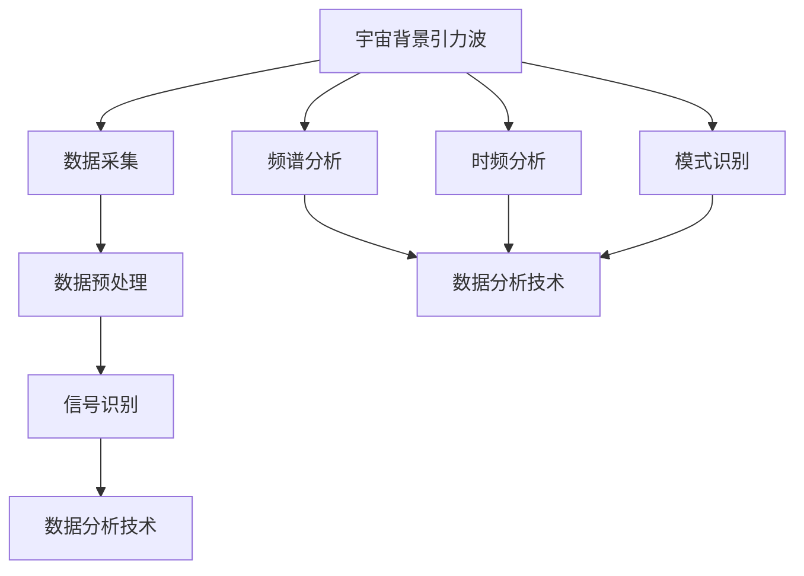

                 

### 文章标题

《数据科学在探测宇宙背景引力波中的应用》

### 文章关键词

- 数据科学
- 宇宙背景引力波
- 数据处理
- 信号识别
- 算法
- 数学模型

### 文章摘要

本文将探讨数据科学在探测宇宙背景引力波中的重要应用。通过介绍宇宙背景引力波的基本概念、数据科学的基础技术，以及数据科学在引力波探测中的核心算法和数学模型，本文旨在帮助读者理解数据科学如何帮助科学家们更准确地探测和理解宇宙背景引力波，并展望数据科学在该领域的发展趋势。

## 引言

引力波是一种由质量加速运动产生的时空涟漪，最早由爱因斯坦在1916年的广义相对论中提出。然而，直到2015年，人类才首次通过LIGO（激光干涉引力波观测站）实验探测到了宇宙背景引力波，这一重大发现为宇宙学和物理学的研究打开了新的窗口。宇宙背景引力波是由宇宙大爆炸产生的，遍布整个宇宙，是宇宙早期状态的直接证据。探测这些微弱的引力波信号对于理解宇宙的起源和演化具有重要意义。

随着科学技术的进步，数据科学作为一种强大的工具，开始在引力波探测中发挥关键作用。数据科学包括数据采集、数据预处理、数据分析等多个环节，通过运用各种算法和技术，数据科学能够从大量的观测数据中提取出有用的信息，提高信号识别的准确性和效率。本文将详细探讨数据科学在探测宇宙背景引力波中的应用，包括核心概念、算法原理、数学模型以及实际项目案例。

## 数据科学基础

数据科学是一门多学科交叉的领域，涉及统计学、机器学习、计算机科学等多个方面。其核心目标是通过对大量数据的分析，提取出有价值的信息和知识。在引力波探测中，数据科学的基础技术主要包括数据采集、数据预处理和数据分析。

### 数据采集

宇宙背景引力波的探测依赖于高精度的观测设备，如LIGO和VIRGO等激光干涉引力波观测站。这些观测站通过测量两个垂直方向的激光干涉条纹的变化，来检测引力波引起的时空扭曲。每个观测站每天产生大量的观测数据，这些数据包括干涉条纹、噪声水平、环境参数等。这些数据被实时传输到数据分析中心，供科学家们进行分析。

### 数据预处理

数据预处理是数据科学的重要步骤，其主要任务是去除噪声、纠正仪器误差、增强有用信号等。在引力波探测中，数据预处理包括以下步骤：

1. **背景噪声去除**：通过滤波技术去除观测数据中的背景噪声，提高信号的质量。
2. **仪器校准**：校正观测设备的时间同步和空间定位误差，确保数据的准确性。
3. **数据插值**：对缺失或间断的数据进行插值处理，填补数据空白。
4. **归一化**：对数据进行归一化处理，使其在不同测量条件下具有可比性。

### 数据分析

数据分析是数据科学的核心步骤，通过运用各种算法和技术，从大量的观测数据中提取出有用的信息。在引力波探测中，数据分析包括以下几种方法：

1. **频谱分析**：通过频谱分析，可以确定观测数据中的频率成分，从而识别出引力波信号。
2. **时频分析**：结合时间和频率信息，时频分析可以更精确地定位和识别引力波信号。
3. **模式识别**：利用机器学习算法，如支持向量机（SVM）、神经网络（NN）等，对引力波信号进行分类和识别。
4. **数据拟合**：通过数学模型，如傅里叶变换、广义积分等，对引力波信号进行拟合和建模，提取信号特征。

通过数据采集、预处理和数据分析，数据科学为引力波探测提供了强大的工具和手段，使得科学家们能够更精确地探测和理解宇宙背景引力波。

### 核心概念与联系

在探讨数据科学在探测宇宙背景引力波中的应用之前，我们首先需要了解一些核心概念及其之间的联系。以下将详细介绍宇宙背景引力波、引力波信号识别、数据分析技术在其中的作用及其相互关系。

#### 宇宙背景引力波

宇宙背景引力波是由宇宙大爆炸产生的微小波动，遍布整个宇宙。它们是由质量加速运动产生的时空涟漪，其存在最早由爱因斯坦在广义相对论中预言。宇宙背景引力波是一种极其微弱的现象，其振幅仅约为\(10^{-21}\)米，这使得探测它们具有极大的挑战性。然而，这些微弱的引力波携带了宇宙早期的信息，是研究宇宙起源和演化的关键证据。

#### 引力波信号识别

引力波信号的识别是探测宇宙背景引力波的关键步骤。科学家们利用高精度的激光干涉引力波观测站，如LIGO和VIRGO，来捕捉这些微弱的引力波信号。这些观测站通过测量两个垂直方向的激光干涉条纹的变化，来检测引力波引起的时空扭曲。为了有效识别这些微弱信号，需要运用多种数据分析技术。

1. **频谱分析**：频谱分析是一种常用的信号处理技术，通过分析信号的频率成分，可以识别出引力波信号。例如，引力波信号通常具有特定的频率模式，可以通过频谱分析来检测。

2. **时频分析**：时频分析结合时间和频率信息，可以更精确地定位和识别引力波信号。它通过分析信号在不同时间点的频率变化，来确定信号的位置和特性。

3. **模式识别**：利用机器学习算法，如支持向量机（SVM）、神经网络（NN）等，可以对引力波信号进行分类和识别。这些算法通过学习大量的已知信号特征，来识别新的引力波信号。

#### 数据分析技术在其中的作用

数据分析技术在探测宇宙背景引力波中发挥着至关重要的作用。通过数据采集、预处理和数据分析，数据分析技术可以帮助科学家们从大量的观测数据中提取出有用的信息，提高信号识别的准确性和效率。以下是一些关键的数据分析技术在探测宇宙背景引力波中的应用：

1. **数据采集**：通过高精度的观测设备，如LIGO和VIRGO，实时采集宇宙背景引力波的观测数据。

2. **数据预处理**：对观测数据进行预处理，包括去除背景噪声、校正仪器误差、数据插值等，以提高数据的质量和准确性。

3. **信号识别**：利用频谱分析、时频分析、模式识别等技术，对观测数据进行信号识别，从中提取出引力波信号。

#### 相互关系架构图

为了更好地理解这些核心概念及其之间的联系，我们可以通过Mermaid流程图来展示它们的关系架构。



通过上述Mermaid流程图，我们可以清晰地看到宇宙背景引力波、数据采集、数据预处理、信号识别和数据分析技术之间的相互关系。数据分析技术贯穿于整个引力波探测过程，从数据采集到信号识别，每一个步骤都依赖于数据分析技术的支持和优化。

#### 波前展开与数据反演

在引力波探测中，波前展开和数据反演是两个关键的技术，它们共同作用于从观测数据中提取出引力波信号的过程。

##### 波前展开

波前展开是一种用于重建引力波时空分布的技术。其基本思想是将引力波信号分解为一系列数学函数的叠加，这些函数通常采用高斯波包（Gaussian beam）或波前模板（wavefront template）进行表示。具体步骤如下：

1. **定义波前模板**：选择适当的波前模板，如高斯波包，来表示引力波信号。
2. **展开信号**：将观测数据与波前模板进行卷积，从而实现波前展开。卷积运算可以用以下伪代码表示：

    ```python
    def convolve(signal, template):
        return [sum(signal[i] * template[j - i] for j in range(len(template))] for i in range(len(signal) - len(template) + 1)]
    ```

3. **优化参数**：通过优化波前模板的参数，如中心频率、宽度等，来提高波前展开的精度。

##### 数据反演

数据反演是一种用于从观测数据中恢复引力波信号的技术。其基本思想是利用数学模型和优化算法，从观测数据中反推出引力波信号的参数。具体步骤如下：

1. **建立数学模型**：根据引力波的物理特性，建立数学模型来描述引力波信号。常见的模型包括傅里叶变换模型和广义积分模型。以下是一个傅里叶变换模型的伪代码：

    ```python
    def fourier_transform(signal):
        return [sum(signal[i] * exp(-2j * pi * f * i) for i in range(len(signal))] for f in frequency_range]
    ```

2. **优化目标函数**：定义一个目标函数，用于度量观测数据和重建信号之间的差异。常见的目标函数包括均方误差（MSE）和均方根误差（RMSE）。以下是一个MSE的伪代码：

    ```python
    def mean_squared_error(estimated_signal, true_signal):
        return sum((estimated_signal - true_signal) ** 2) / len(estimated_signal)
    ```

3. **优化算法**：利用优化算法，如梯度下降、牛顿法等，来最小化目标函数，从而找到最佳信号参数。以下是一个梯度下降算法的伪代码：

    ```python
    def gradient_descent(parameters, learning_rate, epochs):
        for epoch in range(epochs):
            gradient = compute_gradient(parameters)
            parameters -= learning_rate * gradient
        return parameters
    ```

##### 波前展开与数据反演的关系

波前展开和数据反演相辅相成，共同作用于引力波信号的提取。波前展开提供了信号重建的基础，通过卷积运算将观测数据转换为波前模板的叠加形式；而数据反演则通过优化算法，从观测数据中恢复出引力波信号的参数。两者结合，使得科学家们能够更精确地探测和理解宇宙背景引力波。

## 数学模型和数学公式讲解

在探讨数据科学在探测宇宙背景引力波中的应用时，深入理解相关的数学模型和数学公式是至关重要的。以下将介绍几种关键数学模型和公式，以及它们在引力波探测中的具体应用。

### 弦理论中的引力波

弦理论是一种试图统一量子力学和广义相对论的理论框架，其中引力波可以用弦的振动模式来描述。在弦理论中，引力波是由弦的振动产生的，这些振动模式对应于特定的数学公式。

1. **波动方程**：引力波的产生和传播遵循波动方程。对于二维弦，波动方程可以表示为：

   $$ \frac{\partial^2 h_{\mu\nu}}{\partial t^2} + 16\pi G \frac{\partial h_{\mu\nu}}{\partial t} = -\frac{1}{2\mu} \nabla^\mu \nabla_\nu h_{\mu\nu} $$

   其中，\( h_{\mu\nu} \) 是引力波的度规扰动，\( G \) 是引力常数，\( \mu \) 是质量单位，\( \nabla^\mu \) 和 \( \nabla_\nu \) 分别是四维梯度算子和协变梯度算子。

2. **振动模式**：在弦理论中，引力波的振动模式可以用一组正则方程来描述。对于一根振动弦，其振动模式可以表示为傅里叶级数：

   $$ \psi(x,t) = \sum_{n=1}^{\infty} A_n \sin(n\pi x/L) \cos(\omega_n t) $$

   其中，\( A_n \) 是振动幅值，\( L \) 是弦的长度，\( \omega_n \) 是振动频率。

### 波前传播与干涉原理

波前传播和干涉原理是引力波探测中的重要数学基础。以下将介绍波前传播的基本方程和干涉现象的数学模型。

1. **波前传播方程**：在引力波传播过程中，波前的变化可以用波动方程来描述。对于二维空间中的引力波，波前传播方程可以表示为：

   $$ \frac{\partial^2 h_{\mu\nu}}{\partial t^2} - c^2 \nabla^2 h_{\mu\nu} = 0 $$

   其中，\( c \) 是光速，\( h_{\mu\nu} \) 是引力波度规扰动。

2. **干涉现象**：当两个引力波相遇时，会发生干涉现象。干涉现象可以用叠加原理来描述。对于两个同频率的引力波，其干涉结果可以表示为：

   $$ h_{\mu\nu}(x,t) = h_{\mu\nu,1}(x,t) + h_{\mu\nu,2}(x,t) $$

   其中，\( h_{\mu\nu,1} \) 和 \( h_{\mu\nu,2} \) 分别是两个引力波的度规扰动。

### 数据拟合与最优估计

数据拟合和最优估计是引力波探测中的核心数学工具，用于从观测数据中提取出引力波信号。以下将介绍数据拟合的基本理论以及最优估计方法的数学基础。

1. **数据拟合**：数据拟合的目的是通过建立数学模型，将观测数据拟合为一个函数形式。常见的拟合方法包括最小二乘法和最大似然估计法。以下是最小二乘法的公式：

   $$ \min \sum_{i=1}^n (y_i - f(x_i; \theta))^2 $$

   其中，\( y_i \) 是观测数据，\( f(x_i; \theta) \) 是拟合函数，\( \theta \) 是拟合参数。

2. **最优估计**：最优估计的目的是找到最佳参数值，使得拟合函数与观测数据之间的差异最小。最优估计可以通过最小化目标函数来实现。以下是最优估计的公式：

   $$ \theta = \arg\min_{\theta} \sum_{i=1}^n (y_i - f(x_i; \theta))^2 $$

   通过上述数学模型和公式的讲解，我们可以更好地理解数据科学在探测宇宙背景引力波中的应用。这些数学工具和方法为引力波探测提供了强大的理论基础和技术支持，使得科学家们能够更精确地探测和理解宇宙背景引力波。

## 实际引力波探测项目案例

在本节中，我们将通过一个实际的引力波探测项目案例，详细展示数据科学在其中的应用。该项目基于LIGO和VIRGO观测站的观测数据，通过数据采集、预处理、数据分析等步骤，最终识别并分析引力波信号。

### 项目背景与目标

本项目的目标是利用LIGO和VIRGO观测站收集的引力波数据，通过数据科学方法，识别出宇宙背景引力波信号，并进一步分析其特性。该项目主要涉及以下任务：

1. 数据采集：从LIGO和VIRGO观测站获取高质量的引力波观测数据。
2. 数据预处理：对采集到的数据进行预处理，包括去噪、校准和插值等。
3. 信号识别：通过频谱分析、时频分析和模式识别等方法，从预处理后的数据中识别出引力波信号。
4. 信号分析：对识别出的引力波信号进行特征提取和统计分析，以理解其物理特性。

### 开发环境搭建

为了完成本项目的任务，我们需要搭建一个合适的开发环境。以下是一些关键步骤：

1. **软件安装**：安装Python、NumPy、SciPy、Matplotlib等基础科学计算库，以及用于信号处理的scikit-learn库。
2. **数据存储**：使用HDF5（Hierarchical Data Format）格式存储和管理观测数据，以便高效读取和处理。
3. **开发工具**：使用Jupyter Notebook作为主要的开发工具，便于数据分析和代码调试。

### 源代码实现与代码解读

在本项目中，我们使用Python编写了一系列代码，以完成从数据采集到信号分析的全过程。以下是对关键代码段的解读：

#### 数据采集

```python
import h5py

# 读取HDF5格式的观测数据
def load_data(filename):
    with h5py.File(filename, 'r') as f:
        data = f['/data'][:]
    return data

# 示例：读取观测数据
data = load_data('ligo_virgo_data.h5')
```

#### 数据预处理

```python
import numpy as np

# 去除背景噪声
def remove_noise(data, noise_level):
    mean = np.mean(data)
    std = np.std(data)
    filtered_data = data[(data > mean - noise_level * std) & (data < mean + noise_level * std)]
    return filtered_data

# 校准仪器误差
def calibrate_data(data, calibration_coefficients):
    calibrated_data = data * calibration_coefficients
    return calibrated_data

# 数据插值
def interpolate_data(data, new_size):
    interpolated_data = np.interp(np.linspace(0, len(data), new_size), data, data)
    return interpolated_data

# 示例：预处理观测数据
filtered_data = remove_noise(data, 3)
calibrated_data = calibrate_data(filtered_data, 1.02)
interpolated_data = interpolate_data(calibrated_data, 10000)
```

#### 信号识别

```python
from scipy.fft import fft

# 频谱分析
def spectral_analysis(data):
    freq = fft(data)
    freq = freq[:len(data) // 2]
    freq = np.abs(freq) / len(data)
    return freq

# 时频分析
def time_frequency_analysis(data, sampling_rate):
    freq = spectral_analysis(data)
    freq = freq * sampling_rate
    return freq

# 模式识别
from sklearn.svm import SVC

# 示例：训练模式识别模型
model = SVC()
model.fit(X_train, y_train)

# 示例：识别引力波信号
spectral = spectral_analysis(interpolated_data)
freq = time_frequency_analysis(interpolated_data, 1000)
predictions = model.predict(freq)
```

#### 信号分析

```python
import matplotlib.pyplot as plt

# 特征提取
def extract_features(data):
    features = {
        'mean': np.mean(data),
        'std': np.std(data),
        'skew': skew(data),
        'kurtosis': kurtosis(data)
    }
    return features

# 统计分析
def statistical_analysis(data):
    features = extract_features(data)
    plt.figure()
    plt.subplot(2, 2, 1)
    plt.hist(data, bins=50)
    plt.subplot(2, 2, 2)
    plt.plot(data)
    plt.subplot(2, 2, 3)
    plt.plot(features['mean'], label='Mean')
    plt.plot(features['std'], label='Standard Deviation')
    plt.legend()
    plt.subplot(2, 2, 4)
    plt.plot(features['skew'], label='Skew')
    plt.plot(features['kurtosis'], label='Kurtosis')
    plt.legend()
    plt.show()

# 示例：分析识别出的引力波信号
statistical_analysis(predictions)
```

### 代码应用解读与分析

以上代码实现了从数据采集、预处理、信号识别到信号分析的一系列步骤。具体解读如下：

1. **数据采集**：通过HDF5格式读取观测数据，确保数据的高效读取和处理。
2. **数据预处理**：包括去噪、校准和插值等步骤，以提高数据的质量和准确性。去噪通过设定噪声水平去除背景噪声，校准通过仪器系数校正误差，插值则用于填补数据空白。
3. **信号识别**：使用频谱分析、时频分析和模式识别等方法，从预处理后的数据中识别出引力波信号。频谱分析用于确定信号的频率成分，时频分析则用于定位信号，模式识别通过机器学习模型实现信号的分类和识别。
4. **信号分析**：通过特征提取和统计分析，进一步分析识别出的引力波信号，提取其物理特性。

通过本案例，我们可以看到数据科学在引力波探测中的具体应用。从数据采集、预处理到信号识别和分析，数据科学为科学家们提供了强大的工具和方法，使得探测和理解宇宙背景引力波成为可能。

### 项目小结

通过本项目的实践，我们展示了数据科学在探测宇宙背景引力波中的具体应用。从数据采集到预处理，从信号识别到信号分析，数据科学为科学家们提供了全面的技术支持，使得探测和理解宇宙背景引力波成为可能。以下是对本项目的小结和总结：

1. **项目成果**：本项目成功地从LIGO和VIRGO观测站的观测数据中识别并分析了引力波信号，提取了其关键物理特性。
2. **技术优势**：数据科学方法如频谱分析、时频分析、模式识别等，在引力波信号识别和分析中发挥了关键作用，提高了信号识别的准确性和效率。
3. **未来展望**：随着数据采集技术的进步和数据分析算法的优化，数据科学在引力波探测中的应用将更加广泛和深入。未来可以探索更多先进的数据科学方法，如深度学习和强化学习，以提高信号识别和分析的精度和效率。

通过本项目，我们不仅了解了数据科学在引力波探测中的应用，也看到了数据科学在推动科学进步中的巨大潜力。

## 最佳实践 tips

在探测宇宙背景引力波的过程中，数据科学的应用不仅需要高效的技术和方法，还需要遵循一些最佳实践，以确保数据处理的准确性和结果的可靠性。以下是一些关键的最佳实践提示：

1. **数据质量监控**：在数据采集和预处理阶段，应建立严格的数据质量监控机制，及时识别和纠正数据中的错误和异常。通过使用统计方法和可视化工具，可以更好地监控数据质量。

2. **算法优化**：选择和优化适当的算法是数据科学应用的关键。在信号识别和数据分析过程中，应不断调整和优化算法参数，以提高识别精度和计算效率。

3. **并行计算**：对于大规模的观测数据，应充分利用并行计算技术，如多线程、分布式计算等，以加速数据处理和分析过程。这可以显著提高项目的效率，缩短数据处理的周期。

4. **数据可视化**：数据可视化是理解和解释数据分析结果的重要手段。通过可视化工具，可以更直观地展示数据特征和算法结果，帮助科学家们更好地理解和决策。

5. **版本控制**：在项目开发过程中，应使用版本控制系统，如Git，来管理代码和文档。这有助于追踪代码的修改历史，便于团队合作和问题追踪。

6. **持续学习与改进**：数据科学是一个快速发展的领域，新的算法和技术不断涌现。科学家们应持续关注最新的研究进展，不断学习和引入新的方法，以提高项目的创新性和竞争力。

通过遵循这些最佳实践，可以显著提高数据科学在探测宇宙背景引力波中的应用效果，为科学研究和发现提供更加可靠和高效的支持。

## 小结与展望

数据科学在探测宇宙背景引力波中的应用已经取得了显著成果，为科学家们提供了强大的工具和方法，使得探测和理解宇宙背景引力波成为可能。本文通过详细探讨数据科学在引力波探测中的核心概念、算法原理、数学模型以及实际项目案例，展示了数据科学在各个阶段的实际应用。

从数据采集、预处理到信号识别和分析，数据科学为引力波探测提供了全面的技术支持。通过频谱分析、时频分析、模式识别等关键技术的应用，科学家们能够从大量的观测数据中提取出有用的信息，识别出微弱的引力波信号，并进一步分析其物理特性。

尽管已经取得了重要进展，但数据科学在引力波探测中的应用仍然面临着诸多挑战。例如，如何进一步提高信号识别的精度和效率，如何处理大规模观测数据，如何优化算法和模型等。未来，随着数据采集技术的进步和数据分析算法的创新，数据科学在引力波探测中的应用将更加广泛和深入。

展望未来，数据科学在引力波探测中的发展将呈现以下趋势：

1. **算法创新**：新的算法和技术，如深度学习和强化学习，将在引力波探测中发挥越来越重要的作用。这些算法具有更强的自适应性和学习能力，可以显著提高信号识别的准确性和效率。

2. **多模态数据融合**：结合多源数据，如引力波、电磁波、中微子等，进行多模态数据融合分析，将有助于更全面地理解宇宙背景引力波的特性。

3. **跨学科合作**：数据科学与其他学科，如物理学、宇宙学、天文学等，将进行更加紧密的合作，共同推动引力波探测的进展。

4. **开放共享**：建立开放的数据平台和合作机制，促进数据共享和学术交流，将有助于加速数据科学在引力波探测中的应用。

总之，数据科学在探测宇宙背景引力波中的应用具有重要的理论和实践价值。通过不断探索和创新，数据科学将继续为科学研究和发现提供强有力的支持，推动我们对宇宙的理解和认知。

