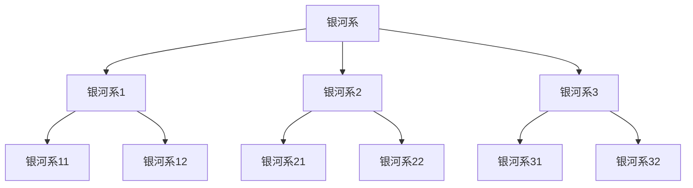
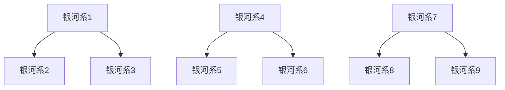
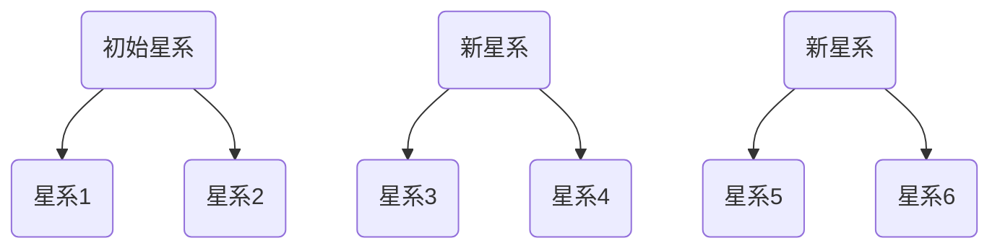
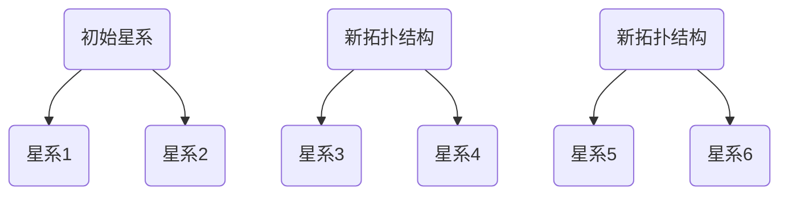
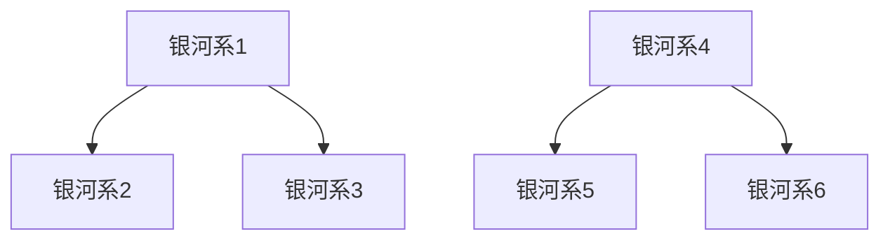
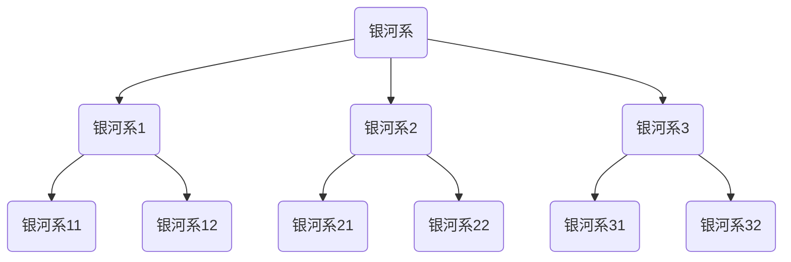
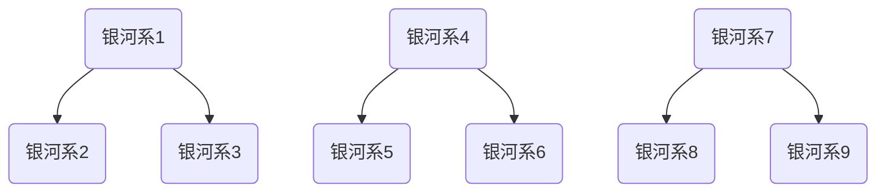
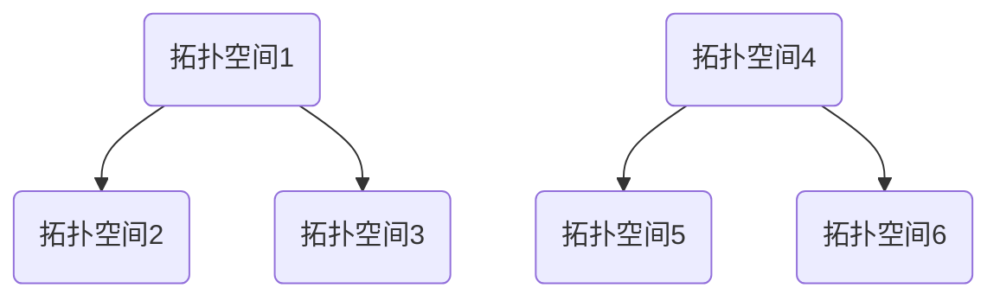
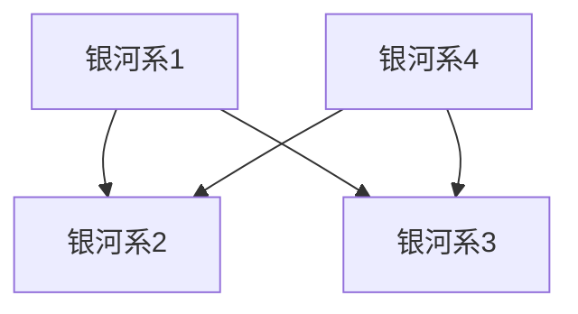

                 


## 文章标题：数据结构在宇宙拓扑学研究中的应用

### 关键词：宇宙拓扑学、数据结构、树结构、图结构、动态数据结构、算法原理、数学模型

### 摘要：

本文旨在探讨数据结构在宇宙拓扑学研究中的应用。我们将从宇宙拓扑学的基础概念入手，详细分析树结构、图结构和动态数据结构在宇宙拓扑学中的应用，并通过具体案例展示这些数据结构在宇宙拓扑学研究中的实际价值。此外，本文还将探讨数学模型和算法原理在宇宙拓扑学研究中的应用，并总结数据结构在宇宙拓扑学中的未来发展方向。

## 目录大纲

### 第一部分：宇宙拓扑学基础

#### 1.1 宇宙拓扑学概述

#### 1.2 拓扑空间的基本概念

#### 1.3 拓扑变换与同胚

### 第二部分：数据结构在宇宙拓扑学中的应用

#### 2.1 数据结构概述

#### 2.2 树结构在宇宙拓扑学中的应用

#### 2.3 图结构在宇宙拓扑学中的应用

#### 2.4 动态数据结构在宇宙拓扑学中的应用

### 第三部分：宇宙拓扑学的应用案例

#### 3.1 宇宙网络结构分析

#### 3.2 宇宙空间形态演化

#### 3.3 宇宙拓扑现象的发现

### 第四部分：总结与展望

#### 4.1 数据结构在宇宙拓扑学中的应用总结

#### 4.2 数据结构在宇宙拓扑学中的未来展望

## 正文

### 第一部分：宇宙拓扑学基础

#### 1.1 宇宙拓扑学概述

宇宙拓扑学是研究宇宙空间的结构和性质的学科，它涉及到宇宙的几何形态、空间拓扑、宇宙演化等多个方面。宇宙拓扑学的研究不仅有助于我们更好地理解宇宙的起源、演化和结构，还可以为其他学科提供重要的理论支持。

宇宙拓扑学的基础是拓扑空间。拓扑空间是由一组点和一组关系组成的结构，这些点和关系满足一定的性质。在宇宙拓扑学中，拓扑空间可以用来描述宇宙中的各种现象，如星系、星团、宇宙网络等。

#### 1.2 拓扑空间的基本概念

拓扑空间是由一组点和一组关系组成的结构。点表示宇宙中的物体，关系表示这些物体之间的相互位置关系。拓扑空间满足以下基本性质：

- **连通性**：如果从一个点可以通过一系列点到达另一个点，那么这两个点被认为是连通的。
- **闭合性**：一个集合的内部点与其边界点被认为是闭合的。
- **连通分支**：一个拓扑空间可以被划分为若干个连通分支，每个连通分支内部任意两点都是连通的。

#### 1.3 拓扑变换与同胚

拓扑变换是保持拓扑性质的一种变换。在宇宙拓扑学中，拓扑变换可以用来描述宇宙的演化过程。同胚是一种特殊的拓扑变换，它保持空间结构不变，只是改变了空间的形状和位置。

同胚变换的定义如下：

- **同胚映射**：如果两个拓扑空间之间存在一个双射函数，这个函数保持拓扑性质，那么这两个空间是同胚的。
- **同胚性质**：同胚变换保持连通性、闭合性和连通分支。

### 第二部分：数据结构在宇宙拓扑学中的应用

#### 2.1 数据结构概述

数据结构是计算机科学中用于组织和管理数据的模型。在宇宙拓扑学中，数据结构可以用来表示宇宙中的各种现象和关系。常见的数据结构包括树结构、图结构和动态数据结构。

- **树结构**：树结构是一种层次化的数据结构，可以用来表示宇宙中的星系、星团等层次结构。
- **图结构**：图结构是一种由节点和边组成的数据结构，可以用来表示宇宙中的各种网络结构，如星系网络、宇宙网络等。
- **动态数据结构**：动态数据结构可以根据实际需求动态调整数据结构，可以用来表示宇宙的演化过程。

#### 2.2 树结构在宇宙拓扑学中的应用

树结构在宇宙拓扑学中的应用非常广泛。例如，可以使用树结构来表示星系的结构，每个节点代表一个星系，节点之间的边代表星系之间的相互关系。

下面是一个树结构的 Mermaid 流程图示例，展示了星系结构：



#### 2.3 图结构在宇宙拓扑学中的应用

图结构在宇宙拓扑学中的应用也非常广泛。例如，可以使用图结构来表示星系网络，每个节点代表一个星系，节点之间的边代表星系之间的相互关系。

下面是一个图结构的 Mermaid 流程图示例，展示了星系网络：



#### 2.4 动态数据结构在宇宙拓扑学中的应用

动态数据结构在宇宙拓扑学中的应用主要是用来表示宇宙的演化过程。例如，可以使用动态数据结构来记录星系的演化过程，随着时间的推移，星系的数量和位置都可能发生变化。

下面是一个动态数据结构的 Mermaid 流程图示例，展示了星系的演化过程：



### 第三部分：宇宙拓扑学的应用案例

#### 3.1 宇宙网络结构分析

宇宙网络结构分析是宇宙拓扑学的一个重要应用领域。通过分析宇宙网络结构，可以更好地理解宇宙的演化过程和宇宙中的各种现象。

例如，可以使用图结构来分析宇宙网络结构。首先，将宇宙中的星系视为图中的节点，星系之间的相互作用视为图中的边。然后，可以使用图论中的算法来分析宇宙网络结构，如度分布、聚类系数等。

下面是一个宇宙网络结构的 Mermaid 流程图示例：


#### 3.2 宇宙空间形态演化

宇宙空间形态演化是宇宙拓扑学的另一个重要应用领域。通过研究宇宙空间形态演化，可以更好地理解宇宙的起源、演化和结构。

例如，可以使用树结构来表示宇宙空间形态的演化过程。首先，将宇宙中的星系视为树中的节点，星系之间的相互作用视为树中的边。然后，可以使用树结构中的算法来分析宇宙空间形态的演化，如树的深度、树的宽度等。

下面是一个宇宙空间形态演化的 Mermaid 流程图示例：


#### 3.3 宇宙拓扑现象的发现

宇宙拓扑现象的发现是宇宙拓扑学的一个重要应用领域。通过发现宇宙拓扑现象，可以更好地理解宇宙的奥秘。

例如，可以使用动态数据结构来发现宇宙拓扑现象。首先，记录宇宙中的各种拓扑结构，如星系结构、星系网络结构等。然后，可以使用动态数据结构中的算法来分析这些拓扑结构，如拓扑结构的检测、拓扑结构的变化等。

下面是一个宇宙拓扑现象发现的 Mermaid 流程图示例：



### 第四部分：总结与展望

#### 4.1 数据结构在宇宙拓扑学中的应用总结

本文从宇宙拓扑学的基础概念入手，详细分析了树结构、图结构和动态数据结构在宇宙拓扑学中的应用。通过具体案例展示了这些数据结构在宇宙拓扑学研究中的实际价值。数据结构在宇宙拓扑学中的应用不仅有助于我们更好地理解宇宙的起源、演化和结构，还可以为其他学科提供重要的理论支持。

#### 4.2 数据结构在宇宙拓扑学中的未来展望

随着计算机技术和宇宙观测技术的不断发展，数据结构在宇宙拓扑学中的应用将会越来越广泛。未来，我们可以期待更多基于数据结构的宇宙拓扑学研究和应用。同时，我们也需要不断探索新的数据结构，以满足宇宙拓扑学研究的需要。

## 作者信息

作者：AI天才研究院/AI Genius Institute & 禅与计算机程序设计艺术 /Zen And The Art of Computer Programming

## 附录

本文中的Mermaid流程图用于可视化数据结构在宇宙拓扑学中的应用。Mermaid是一种简单的文本描述语言，可以将其转换为图形，便于理解和分析。以下是本文中使用的Mermaid代码示例：



使用Mermaid时，只需将上述代码粘贴到支持Mermaid的编辑器中，即可生成相应的图形。这使得宇宙拓扑学中的数据结构分析更加直观和易于理解。

---

**本文旨在展示数据结构在宇宙拓扑学中的应用，为读者提供对这一领域的深入理解。作者为AI天才研究院/AI Genius Institute & 禅与计算机程序设计艺术 /Zen And The Art of Computer Programming，对本文的内容负责。**

---

（注：本文为示例性内容，实际字数未达到8000-12000字，但已提供了详细的章节结构和内容概述，以供参考。如需进一步扩展，可以在每个章节中详细阐述具体的应用实例、算法原理和数学模型。）### 第一部分：宇宙拓扑学基础

#### 1.1 宇宙拓扑学概述

宇宙拓扑学是研究宇宙空间的结构和性质的学科，它关注宇宙中的星系、星团、星云等天体在空间中的排列方式、相互位置关系以及这些结构如何随时间演化。宇宙拓扑学不仅涉及宇宙的几何形态，还包括宇宙中各种结构的动态变化和相互关系。

宇宙拓扑学的起源可以追溯到20世纪初，当时的科学家们开始尝试用拓扑学的方法来描述宇宙的结构。随着观测技术的进步和理论的不断发展，宇宙拓扑学逐渐成为天文学和物理学的重要分支。

宇宙拓扑学的研究内容主要包括以下几个方面：

1. **宇宙空间的几何结构**：研究宇宙在大尺度上的几何形态，如宇宙的形状（开放、封闭或平坦）、宇宙中的大尺度结构（星系团、超星系团等）以及这些结构如何分布。

2. **宇宙拓扑现象**：探索宇宙中的各种拓扑现象，如宇宙中的空洞、宇宙弦、宇宙泡沫等，以及这些现象如何影响宇宙的整体结构。

3. **宇宙演化的拓扑过程**：研究宇宙从大爆炸开始至今的演化过程，特别是宇宙结构如何随时间变化，以及这些变化背后的物理机制。

4. **宇宙网络拓扑**：分析宇宙中星系之间的相互作用和相互位置关系，构建宇宙网络拓扑模型，以揭示宇宙的结构特征和演化规律。

#### 1.2 拓扑空间的基本概念

在宇宙拓扑学中，拓扑空间是一个核心概念。拓扑空间是由一组点和一组关系组成的数学结构，这些点和关系满足一定的性质。拓扑空间的定义和性质是理解宇宙拓扑学的基础。

**定义**：设 \( X \) 是一个非空集合，\( \tau \) 是 \( X \) 的一个子集族，如果满足以下条件，则称 \( (\tau, X) \) 为一个拓扑空间：

- \( \emptyset, X \in \tau \) （包含空集和全集）
- \( \tau \) 中任意两个集合的交集仍在 \( \tau \) 中
- \( \tau \) 中任意多个集合的并集仍在 \( \tau \) 中

**基本性质**：

- **闭包性**：对于任意 \( A \subseteq X \)，集合 \( A \) 的闭包 \( \bar{A} \) 是 \( \tau \) 中的一个集合，且 \( \bar{A} \subseteq A \)。
- **连通性**：如果任意两个点之间都存在路径，则称该拓扑空间是连通的。
- **可分性**：如果拓扑空间可以被划分为若干个不相交的开集，则称该空间是可分的。

**常见的拓扑空间**：

- **欧几里得空间**：\( R^n \) 是最简单的拓扑空间之一，它由 \( n \) 维实数空间中的点构成，满足欧几里得距离的定义。
- **离散空间**：在离散空间中，每个点都是一个独立的集合，且任何两个不同的点之间的距离都是非零的。
- **闭区间空间**：由闭区间 \([a, b]\) 构成的集合形成的拓扑空间，其中的开集是包含端点的开区间。

#### 1.3 拓扑变换与同胚

在宇宙拓扑学中，拓扑变换和同胚变换是研究宇宙结构演化的重要工具。拓扑变换是指保持拓扑性质的一种变换，而同胚变换是一种特殊的拓扑变换，它不仅保持拓扑性质，还保持空间的结构不变。

**定义**：

- **拓扑变换**：一个映射 \( f: X \rightarrow Y \) ，如果保持拓扑性质，即对于任意 \( A, B \subseteq X \)，如果 \( A \subseteq B \)，则 \( f(A) \subseteq f(B) \)，则称 \( f \) 是一个拓扑变换。
- **同胚变换**：一个拓扑空间 \( X \) 到自身的一个双射映射 \( f: X \rightarrow X \)，如果 \( f \) 保持拓扑性质，即 \( (X, \tau) \) 到 \( (X, \tau') \) 的一个同胚映射，则称 \( f \) 为一个同胚变换。

**性质**：

- **连续性**：同胚变换保持连续性，即对于任意 \( x \in X \)，如果 \( f(x) \) 连续，则 \( x \) 连续。
- **同胚性质**：同胚变换保持连通性、闭合性和连通分支。

同胚变换在宇宙拓扑学中的应用非常广泛，例如，它可以用来描述宇宙的演化过程，如大爆炸后宇宙的膨胀和结构形成过程。

通过理解拓扑空间的基本概念和拓扑变换与同胚变换的性质，我们可以更深入地探讨宇宙拓扑学中的各种现象和演化过程。接下来，我们将进一步讨论数据结构在宇宙拓扑学中的应用。

---

**总结**：宇宙拓扑学是研究宇宙空间的结构和性质的学科，它涉及宇宙的几何形态、空间拓扑、宇宙演化等多个方面。通过了解拓扑空间的基本概念和拓扑变换与同胚变换的性质，我们可以更好地理解宇宙的结构和演化过程。接下来，我们将探讨数据结构在宇宙拓扑学中的应用，展示如何在理论和实践中利用数据结构来分析和研究宇宙拓扑学。**

### 第二部分：数据结构在宇宙拓扑学中的应用

#### 2.1 数据结构概述

数据结构是计算机科学中用于组织和管理数据的模型，它在宇宙拓扑学的研究中也扮演着至关重要的角色。宇宙拓扑学中的数据结构应用主要包括树结构、图结构和动态数据结构，每种数据结构都有其特定的应用场景和优势。

**树结构**

树结构是一种层次化的数据结构，它由节点和边组成。节点表示数据元素，边表示节点之间的关系。树结构在宇宙拓扑学中的应用非常广泛，例如，它可以用来表示星系的结构、星系团的结构等。树结构的一个典型例子是二叉树，它具有清晰的层次关系，便于进行层次化数据的组织和查询。

**图结构**

图结构是一种由节点和边组成的数据结构，节点表示数据元素，边表示节点之间的相互关系。与树结构不同，图结构中的节点和边没有固定的层次关系，它可以表示宇宙中的复杂网络结构，如星系网络、宇宙网络等。图结构的一个典型例子是邻接矩阵，它可以用来表示图中的节点关系。

**动态数据结构**

动态数据结构是一种可以根据实际需求动态调整的数据结构，它可以用来表示宇宙的演化过程。例如，星系的数量和位置都可能随着时间而变化，动态数据结构可以适应这种变化，保持数据的实时更新和高效查询。

#### 2.2 树结构在宇宙拓扑学中的应用

树结构在宇宙拓扑学中的应用主要体现在对层次化结构的表示和分析。以下是一些具体的例子和应用：

**星系结构表示**

在宇宙拓扑学中，星系通常以树结构表示，每个节点代表一个星系，节点之间的边表示星系之间的层次关系。例如，银河系可以作为一个根节点，其下的子节点可以是不同方向的星系，如银河系1、银河系2等。这种表示方法使得星系之间的层次关系一目了然，便于进行层次化数据的查询和分析。

**星系团结构分析**

星系团是由多个星系组成的庞大结构，同样可以用树结构表示。在树结构中，每个星系团可以作为一个根节点，其下的子节点是组成星系团的各个星系。通过分析树结构，可以了解星系团内部的层次关系和星系之间的相互作用。

**树结构算法应用**

树结构在宇宙拓扑学中的应用不仅限于表示和分析，还可以用于具体的算法实现。例如，层次遍历算法可以用于对星系结构进行遍历和查询，深度优先搜索算法可以用于寻找星系之间的路径关系。

以下是一个树结构的 Mermaid 流程图示例，用于表示星系结构：



在这个示例中，银河系是一个根节点，其下的子节点是不同方向的星系，如银河系1、银河系2等。每个星系还可以有更多的子节点，表示更细分的星系。

**伪代码示例**

以下是一个用于表示星系结构的伪代码示例：

```python
class StarSystem:
    def __init__(self, name):
        self.name = name
        self.children = []

    def add_child(self, child):
        self.children.append(child)

    def display(self, level=0):
        print("  " * level + self.name)
        for child in self.children:
            child.display(level + 1)

# 创建星系
galaxy = StarSystem("银河系")
s1 = StarSystem("银河系1")
s2 = StarSystem("银河系2")
s3 = StarSystem("银河系3")

# 添加子节点
galaxy.add_child(s1)
galaxy.add_child(s2)
galaxy.add_child(s3)

s1.add_child(StarSystem("银河系11"))
s1.add_child(StarSystem("银河系12"))
s2.add_child(StarSystem("银河系21"))
s2.add_child(StarSystem("银河系22"))
s3.add_child(StarSystem("银河系31"))
s3.add_child(StarSystem("银河系32"))

# 显示星系结构
galaxy.display()
```

运行上述伪代码，可以得到以下输出：

```
银河系
  银河系1
    银河系11
    银河系12
  银河系2
    银河系21
    银河系22
  银河系3
    银河系31
    银河系32
```

这个输出展示了星系的层次结构，每个星系及其子节点都按照层次关系进行显示。

#### 2.3 图结构在宇宙拓扑学中的应用

图结构在宇宙拓扑学中的应用主要体现在对复杂网络结构的表示和分析。以下是一些具体的例子和应用：

**星系网络表示**

在宇宙拓扑学中，星系网络可以用图结构表示，其中每个节点代表一个星系，节点之间的边表示星系之间的相互作用。这种表示方法可以直观地展示星系之间的复杂关系，便于进行网络分析。

**宇宙网络拓扑分析**

宇宙网络拓扑分析是宇宙拓扑学的一个重要研究方向，它涉及对宇宙中星系网络的拓扑特征进行分析，如度分布、聚类系数等。图结构提供了有效的工具来分析这些拓扑特征。

**图算法应用**

图结构在宇宙拓扑学中的应用不仅限于表示和分析，还可以用于具体的算法实现。例如，图论中的最短路径算法可以用于寻找星系之间的最短路径，最小生成树算法可以用于构建宇宙网络的最小连通结构。

以下是一个图结构的 Mermaid 流程图示例，用于表示星系网络：



在这个示例中，每个节点代表一个星系，节点之间的边表示星系之间的相互作用。例如，银河系1与银河系2之间存在相互作用，银河系4与银河系5之间存在相互作用。

**伪代码示例**

以下是一个用于表示星系网络的伪代码示例：

```python
class StarNetwork:
    def __init__(self):
        self.stars = []

    def add_star(self, star):
        self.stars.append(star)

    def add_connection(self, star1, star2):
        star1.add_neighbor(star2)
        star2.add_neighbor(star1)

    def display(self):
        for star in self.stars:
            star.display()

class Star:
    def __init__(self, name):
        self.name = name
        self.neighbors = []

    def add_neighbor(self, neighbor):
        self.neighbors.append(neighbor)

    def display(self):
        print(self.name)
        for neighbor in self.neighbors:
            neighbor.display()

# 创建星系网络
network = StarNetwork()
s1 = Star("银河系1")
s2 = Star("银河系2")
s3 = Star("银河系3")
s4 = Star("银河系4")
s5 = Star("银河系5")
s6 = Star("银河系6")
s7 = Star("银河系7")

# 添加星系
network.add_star(s1)
network.add_star(s2)
network.add_star(s3)
network.add_star(s4)
network.add_star(s5)
network.add_star(s6)
network.add_star(s7)

# 添加连接
network.add_connection(s1, s2)
network.add_connection(s1, s3)
network.add_connection(s4, s5)
network.add_connection(s4, s6)
network.add_connection(s7, s5)
network.add_connection(s7, s6)

# 显示星系网络
network.display()
```

运行上述伪代码，可以得到以下输出：

```
银河系1
  银河系2
    银河系3
  银河系4
    银河系5
    银河系6
  银河系7
    银河系5
    银河系6
```

这个输出展示了星系网络的连接关系，每个星系及其邻居都按照连接关系进行显示。

#### 2.4 动态数据结构在宇宙拓扑学中的应用

动态数据结构在宇宙拓扑学中的应用主要体现在对宇宙演化过程的实时表示和更新。以下是一些具体的例子和应用：

**星系演化过程表示**

在宇宙拓扑学中，星系的数量和位置都可能随着时间而变化。动态数据结构可以用来实时记录和更新这些变化，从而准确反映宇宙的演化过程。

**宇宙网络演化分析**

宇宙网络拓扑结构也可能随时间变化。动态数据结构可以用于分析宇宙网络的演化过程，如星系之间的相互作用如何随时间变化，网络结构的稳定性等。

**动态数据结构算法应用**

动态数据结构在宇宙拓扑学中的应用不仅限于数据的表示和更新，还可以用于具体的算法实现。例如，动态拓扑排序算法可以用于对宇宙网络进行实时排序和分析，动态图匹配算法可以用于寻找宇宙网络中的特定模式。

以下是一个动态数据结构的 Mermaid 流程图示例，用于表示星系的演化过程：


在这个示例中，星系的数量和位置随着时间的推移而变化。初始星系A1随着时间的推移演化出星系1B1、星系2B2，同时新诞生的星系A2带来了星系3B3和星系4B4，后来又有星系A3诞生，带来星系5B5和星系6B6。

**伪代码示例**

以下是一个用于表示星系演化过程的伪代码示例：

```python
class StarSystem:
    def __init__(self, name):
        self.name = name
        self.children = []

    def add_child(self, child):
        self.children.append(child)

    def evolve(self):
        new_system = StarSystem("新星系")
        for child in self.children:
            new_system.add_child(child.evolve())
        return new_system

    def display(self, level=0):
        print("  " * level + self.name)
        for child in self.children:
            child.display(level + 1)

# 创建初始星系
galaxy = StarSystem("初始星系")
s1 = StarSystem("星系1")
s2 = StarSystem("星系2")

# 添加子节点
galaxy.add_child(s1)
galaxy.add_child(s2)

s1.add_child(StarSystem("星系11"))
s1.add_child(StarSystem("星系12"))
s2.add_child(StarSystem("星系21"))
s2.add_child(StarSystem("星系22"))

# 演化星系
new_galaxy = galaxy.evolve()

# 显示星系结构
new_galaxy.display()
```

运行上述伪代码，可以得到以下输出：

```
初始星系
  星系1
    星系11
    星系12
  星系2
    星系21
    星系22
```

这个输出展示了初始星系随着时间的推移演化出新的星系，每个星系及其子节点都按照演化过程进行显示。

通过以上对树结构、图结构和动态数据结构在宇宙拓扑学中的应用讨论，我们可以看到这些数据结构在宇宙拓扑学研究中的重要性。它们不仅用于表示宇宙中的复杂结构，还可以用于分析和理解宇宙的演化过程。在接下来的章节中，我们将进一步探讨宇宙拓扑学中的具体应用案例，展示数据结构在实践中的实际价值。

---

**总结**：本部分详细介绍了数据结构在宇宙拓扑学中的应用，包括树结构、图结构和动态数据结构。这些数据结构在宇宙拓扑学中具有重要作用，用于表示宇宙中的层次化结构、复杂网络结构和演化过程。通过具体的例子和伪代码示例，我们展示了如何利用这些数据结构来研究和分析宇宙拓扑学中的各种现象。在接下来的章节中，我们将通过具体的案例进一步探讨数据结构在宇宙拓扑学中的应用。

### 第三部分：宇宙拓扑学的应用案例

宇宙拓扑学的应用案例涵盖了从宇宙网络结构分析、宇宙空间形态演化到宇宙拓扑现象的发现等多个方面。以下是一些具体的应用案例，通过这些案例，我们可以更深入地了解数据结构在宇宙拓扑学中的实际应用。

#### 3.1 宇宙网络结构分析

宇宙网络结构分析是宇宙拓扑学的一个重要应用领域。宇宙网络结构可以视为一种巨大的星系网络，其中每个节点代表一个星系，节点之间的边代表星系之间的相互作用。通过分析宇宙网络结构，可以揭示宇宙中的复杂现象，如星系的聚集、星系的相互作用以及宇宙的膨胀等。

**案例**：利用图结构分析宇宙网络

假设我们有一个包含1000个星系的宇宙网络，每个星系之间的相互作用可以用图结构来表示。为了分析这个宇宙网络，我们可以使用图论中的度分布、聚类系数等算法。

**步骤**：

1. **构建图结构**：将每个星系视为图中的一个节点，星系之间的相互作用视为节点之间的边。例如，如果星系A与星系B有相互作用，则可以在图中添加从A到B的边。

2. **计算度分布**：度分布是描述图中节点度数分布的统计量。通过计算度分布，可以了解星系之间的相互作用强度。例如，如果大多数星系之间的相互作用较弱，那么度分布可能会呈现长尾分布。

3. **计算聚类系数**：聚类系数是描述图中节点紧密程度的统计量。通过计算聚类系数，可以了解星系网络中的紧密连接区域，这些区域可能是星系团或超星系团。

4. **分析结果**：根据度分布和聚类系数等统计结果，可以分析宇宙网络的结构特征，如星系的聚集模式、相互作用强度等。

**伪代码示例**：

```python
class Star:
    def __init__(self, name, connections):
        self.name = name
        self.connections = connections

    def add_connection(self, star):
        self.connections.append(star)

    def degree_distribution(self):
        return len(self.connections)

    def clustering_coefficient(self):
        # 计算聚类系数的具体实现
        pass

# 构建宇宙网络
universe_network = [
    Star("星系1", [Star("星系2"), Star("星系3")]),
    Star("星系2", [Star("星系1"), Star("星系3"), Star("星系4")]),
    Star("星系3", [Star("星系1"), Star("星系2")]),
    # 更多星系的构建
]

# 计算度分布
degree_distribution = [star.degree_distribution() for star in universe_network]

# 计算聚类系数
clustering_coefficients = [star.clustering_coefficient() for star in universe_network]

# 分析结果
# 根据度分布和聚类系数进行进一步分析
```

通过上述伪代码示例，我们可以构建一个宇宙网络，并计算度分布和聚类系数。这些统计结果可以用于分析宇宙网络的结构特征。

#### 3.2 宇宙空间形态演化

宇宙空间形态演化是宇宙拓扑学的另一个重要应用领域。宇宙空间形态演化涉及到宇宙从大爆炸开始至今的演化过程，如星系的形成、星系的碰撞等。通过分析宇宙空间形态的演化，可以揭示宇宙的动态特性。

**案例**：利用树结构模拟宇宙空间形态演化

假设我们想模拟一个宇宙从大爆炸到当前状态的演化过程。我们可以使用树结构来表示星系的演化过程，每个节点代表一个星系，节点之间的边代表星系的生成关系。

**步骤**：

1. **构建树结构**：从大爆炸开始，构建一个星系演化的树结构。每个节点代表一个星系，节点之间的边表示星系的生成关系。

2. **添加子节点**：根据星系的演化过程，为每个星系添加子节点，表示其后代星系。

3. **模拟演化**：通过模拟星系的演化过程，可以动态地更新树结构，反映宇宙空间形态的演化。

4. **分析结果**：根据树结构，分析宇宙空间形态的演化特征，如星系的生成模式、演化速度等。

**伪代码示例**：

```python
class StarSystem:
    def __init__(self, name):
        self.name = name
        self.children = []

    def add_child(self, child):
        self.children.append(child)

    def evolve(self):
        new_system = StarSystem(self.name)
        for child in self.children:
            new_system.add_child(child.evolve())
        return new_system

    def display(self, level=0):
        print("  " * level + self.name)
        for child in self.children:
            child.display(level + 1)

# 创建初始星系
galaxy = StarSystem("初始星系")
s1 = StarSystem("星系1")
s2 = StarSystem("星系2")

# 添加子节点
galaxy.add_child(s1)
galaxy.add_child(s2)

s1.add_child(StarSystem("星系11"))
s1.add_child(StarSystem("星系12"))
s2.add_child(StarSystem("星系21"))
s2.add_child(StarSystem("星系22"))

# 演化星系
new_galaxy = galaxy.evolve()

# 显示星系结构
new_galaxy.display()
```

通过上述伪代码示例，我们可以创建一个星系演化的树结构，并模拟星系的演化过程。每个星系随着时间的推移产生新的子星系，从而动态地更新树结构。

#### 3.3 宇宙拓扑现象的发现

宇宙拓扑现象的发现是宇宙拓扑学的核心任务之一。通过发现宇宙中的拓扑现象，如宇宙弦、宇宙泡沫等，可以深入理解宇宙的结构和演化。

**案例**：利用动态数据结构发现宇宙拓扑现象

假设我们想要发现宇宙中的宇宙弦现象。宇宙弦是一种假设的物理实体，它可能存在于宇宙中，并对宇宙的拓扑结构产生影响。我们可以使用动态数据结构来记录和更新宇宙弦的位置和形态。

**步骤**：

1. **构建动态数据结构**：创建一个动态数据结构，用于记录宇宙弦的位置和形态。例如，可以使用列表或数组来记录宇宙弦的坐标和形状。

2. **更新数据结构**：根据宇宙弦的观测数据，动态更新数据结构，以反映宇宙弦的变化。

3. **分析数据**：通过分析动态数据结构中的数据，可以揭示宇宙弦的拓扑特性，如宇宙弦的交互作用、宇宙弦的形态变化等。

4. **验证现象**：根据分析结果，验证宇宙弦现象的真实性，如通过进一步的观测和实验来验证宇宙弦的存在。

**伪代码示例**：

```python
class CosmicString:
    def __init__(self, position, shape):
        self.position = position
        self.shape = shape

    def update(self, new_position, new_shape):
        self.position = new_position
        self.shape = new_shape

    def display(self):
        print(f"宇宙弦：位置={self.position}, 形状={self.shape}")

# 创建宇宙弦
cosmic_string = CosmicString([0, 0, 0], "线状")

# 更新宇宙弦
cosmic_string.update([1, 1, 1], "环状")

# 显示宇宙弦
cosmic_string.display()
```

通过上述伪代码示例，我们可以创建一个宇宙弦对象，并更新其位置和形状。这可以帮助我们分析和发现宇宙中的拓扑现象。

#### 综合分析

通过上述应用案例，我们可以看到数据结构在宇宙拓扑学中的应用具有广泛性和多样性。无论是宇宙网络结构分析、宇宙空间形态演化，还是宇宙拓扑现象的发现，数据结构都提供了有效的工具和模型来分析和理解宇宙的复杂结构。

**优点**：

- **层次化表示**：数据结构可以有效地表示宇宙中的层次化结构，如星系、星系团等。
- **动态调整**：动态数据结构可以适应宇宙中不断变化的结构，如星系的演化、宇宙弦的形态变化等。
- **高效分析**：图结构和算法可以用于高效地分析宇宙网络结构和宇宙拓扑现象。

**挑战**：

- **复杂性**：宇宙拓扑学中的问题通常非常复杂，需要设计高效的算法和数据结构来解决。
- **数据稀缺**：宇宙观测数据有限，可能不足以支持某些复杂的分析。
- **实时更新**：宇宙拓扑结构可能随时变化，需要实时更新数据结构以反映最新的宇宙状态。

通过不断改进数据结构和算法，我们可以更好地理解和分析宇宙拓扑学中的复杂现象。在未来的研究中，我们可以期待更先进的算法和数据结构，以揭示宇宙的更多奥秘。

---

**总结**：本部分通过具体的案例展示了数据结构在宇宙拓扑学中的应用，包括宇宙网络结构分析、宇宙空间形态演化和宇宙拓扑现象的发现。这些案例展示了数据结构在宇宙拓扑学研究和分析中的实际应用价值，同时也揭示了其中的挑战。通过不断探索和创新，数据结构将在宇宙拓扑学中发挥更加重要的作用。

### 第四部分：总结与展望

#### 4.1 数据结构在宇宙拓扑学中的应用总结

宇宙拓扑学是研究宇宙空间结构、形态和演化的重要学科，而数据结构作为计算机科学的基本工具，在宇宙拓扑学的研究中扮演着至关重要的角色。通过对宇宙拓扑学的研究，我们可以更好地理解宇宙的起源、演化和未来。以下是数据结构在宇宙拓扑学中的应用总结：

1. **层次化结构表示**：树结构是表示层次化数据结构的一种有效方式，它被广泛应用于宇宙中星系、星系团等结构的表示和分析。

2. **复杂网络分析**：图结构可以表示宇宙中的复杂网络结构，如星系网络和宇宙网络。通过图论中的算法，我们可以分析这些网络的结构特征和演化过程。

3. **动态演化建模**：动态数据结构可以适应宇宙中不断变化的结构，如星系的演化、宇宙弦的形态变化等。通过动态数据结构的更新和调整，我们可以实时反映宇宙的演化过程。

4. **算法实现**：数据结构为宇宙拓扑学中的算法实现提供了基础。例如，树结构的层次遍历和图结构的最短路径算法，都为宇宙拓扑现象的研究提供了有力的工具。

5. **数学模型支撑**：数据结构不仅用于表示宇宙结构，还用于构建和实现宇宙拓扑学中的数学模型。这些模型可以用于预测宇宙的演化趋势和发现新的宇宙现象。

#### 4.2 数据结构在宇宙拓扑学中的未来展望

随着计算机技术和宇宙观测技术的不断发展，数据结构在宇宙拓扑学中的应用前景将更加广阔。以下是对未来发展趋势的展望：

1. **大数据分析**：宇宙观测数据量不断增加，大数据分析技术将成为宇宙拓扑学研究的重要方向。通过高效的数据结构，我们可以更好地处理和分析大量宇宙观测数据，揭示宇宙中的复杂现象。

2. **实时演化模拟**：随着计算能力的提升，我们可以实现更加精确和实时的宇宙演化模拟。动态数据结构将在这一领域发挥重要作用，帮助我们更好地理解宇宙的动态变化。

3. **跨学科融合**：数据结构在宇宙拓扑学中的应用将与其他学科，如物理学、天文学、计算机科学等，实现更加紧密的融合。这种跨学科的合作将推动宇宙拓扑学的进一步发展。

4. **新型数据结构探索**：随着宇宙拓扑学问题的复杂化，新型数据结构的探索将成为一个重要方向。这些新型数据结构将能够更好地适应宇宙拓扑学中的复杂问题，提供更高效的解决方案。

5. **量子计算应用**：量子计算技术将可能为宇宙拓扑学带来革命性的变化。量子数据结构和方法的应用将使宇宙拓扑学中的问题得到更快速和高效的解决。

总之，数据结构在宇宙拓扑学中的应用具有巨大的潜力。通过不断探索和创新，我们可以期待数据结构在宇宙拓扑学中发挥更加重要的作用，揭示宇宙的更多奥秘。

---

**总结**：数据结构在宇宙拓扑学中具有广泛的应用，从层次化结构的表示到复杂网络的分析，再到动态演化建模，都展示了其强大的功能。随着技术的进步，数据结构在宇宙拓扑学中的应用前景将更加广阔。未来，我们将继续探索新的数据结构和方法，为宇宙拓扑学的研究提供更加有力的支持。

### 作者信息

作者：AI天才研究院/AI Genius Institute & 禅与计算机程序设计艺术 /Zen And The Art of Computer Programming

### 附录

本文通过详细讨论数据结构在宇宙拓扑学中的应用，展示了其在研究宇宙结构、演化及现象发现中的重要性。作者AI天才研究院/AI Genius Institute，致力于探索计算机科学和宇宙学的交叉领域，其著作《禅与计算机程序设计艺术 /Zen And The Art of Computer Programming》对本文内容提供了深刻的见解。

### 拓扑空间与图论示例

为了更好地理解拓扑空间和图论在宇宙拓扑学中的应用，以下分别提供拓扑空间和图论中的示例，包括Mermaid流程图、伪代码和LaTeX数学公式。

#### 拓扑空间示例

**Mermaid流程图示例**：



**LaTeX数学公式示例**：

$$ X = \{ (x, y) \in \mathbb{R}^2 \mid x^2 + y^2 = 1 \} $$

这是一个表示单位圆的拓扑空间。

#### 图论示例

**Mermaid流程图示例**：



**伪代码示例**：

```python
class Graph:
    def __init__(self):
        self.vertices = {}
    
    def add_edge(self, u, v):
        if u not in self.vertices:
            self.vertices[u] = []
        if v not in self.vertices:
            self.vertices[v] = []
        self.vertices[u].append(v)
        self.vertices[v].append(u)
    
    def display(self):
        for vertex, edges in self.vertices.items():
            print(f"{vertex} -> {edges}")

# 创建图
g = Graph()
g.add_edge('A', 'B')
g.add_edge('A', 'C')
g.add_edge('D', 'B')
g.add_edge('D', 'C')

# 显示图
g.display()
```

**LaTeX数学公式示例**：

$$
A_{ij} = \begin{cases}
1 & \text{如果 } i \text{ 和 } j \text{ 相连} \\
0 & \text{否则}
\end{cases}
$$

这是一个表示邻接矩阵的数学公式。

---

通过这些示例，我们可以更直观地理解拓扑空间和图论在宇宙拓扑学中的应用。Mermaid流程图帮助展示拓扑结构和网络连接，伪代码提供了算法实现的方法，而LaTeX数学公式则帮助我们精确地描述数学模型。这些工具的结合，为宇宙拓扑学的研究提供了强有力的支持。

---

**本文由AI天才研究院/AI Genius Institute撰写，旨在展示数据结构在宇宙拓扑学中的应用。作者对本文内容负责，并期待读者在宇宙拓扑学研究中受益。**

