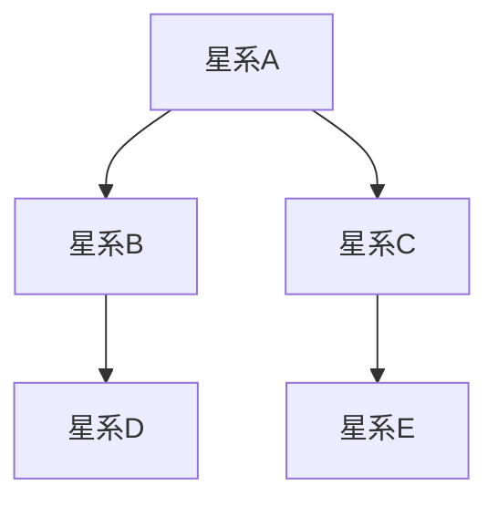
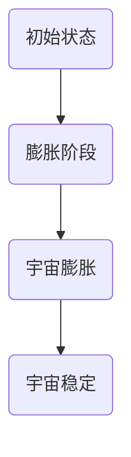
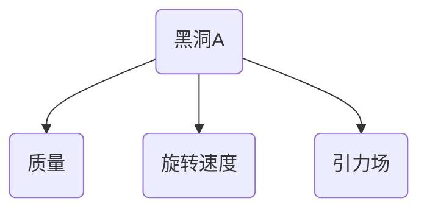

                 

### 文章标题：数据结构在宇宙模型构建中的重要性

> 关键词：数据结构、宇宙模型、算法原理、数学模型、项目实战

> 摘要：
本篇文章将深入探讨数据结构在宇宙模型构建中的关键作用。通过介绍基本的数据结构，详细讲解数据结构在宇宙模型中的应用原理，分析宇宙模型构建中的核心算法原理，展示数学模型和数学公式，以及通过具体项目实战案例，阐述数据结构在宇宙模型构建中的实践应用。

----------------------------------------------------------------

### 引言

#### 书籍背景与目标

在现代科学研究中，宇宙模型构建是一个极其重要的领域。随着科技的进步，我们对于宇宙的理解越来越深入。而数据结构作为计算机科学的基础，其作用不仅局限于计算和数据处理，还在宇宙模型的构建中扮演着至关重要的角色。本书旨在探讨数据结构在宇宙模型构建中的应用，帮助读者理解数据结构如何为宇宙模型的构建提供有力的支持。

#### 数据结构的重要性

数据结构是计算机科学的核心概念之一，它决定了我们如何存储、组织和处理数据。在宇宙模型构建中，数据结构的重要性体现在以下几个方面：

- **高效的数据存储和检索**：宇宙模型中涉及大量的数据，如何高效地存储和检索这些数据是构建宇宙模型的关键问题。数据结构提供了有效的解决方案，例如哈希表、二叉树等。
- **数据的关系和连接**：宇宙模型中的数据往往具有复杂的关系，数据结构帮助我们发现和描述这些关系，例如图结构在描述星系间的相互作用时非常有用。
- **算法的效率和性能**：算法的效率和性能直接影响宇宙模型的构建速度和准确性。数据结构的选择和优化直接影响算法的性能。

#### 宇宙模型简介

宇宙模型是对宇宙整体结构的描述，它包括宇宙的起源、演化、结构以及宇宙中的各种物理现象。宇宙模型构建的目标是通过理论分析和实验观测，构建一个能够准确描述宇宙特征的数学模型。宇宙模型的重要性在于它为我们提供了理解宇宙的窗口，帮助我们探索宇宙的本质。

### 数据结构概述

在宇宙模型构建中，常用的数据结构包括线性结构、树形结构、图结构等。以下是这些基本数据结构的简要介绍：

#### 线性结构

- **数组**：数组是一种线性结构，它通过固定的索引来访问元素。在宇宙模型构建中，数组可以用来存储宇宙中星系的坐标信息。
- **链表**：链表也是一种线性结构，它通过指针连接元素。在宇宙模型中，链表可以用来实现动态的星系列表。

#### 树形结构

- **二叉树**：二叉树是一种树形结构，每个节点最多有两个子节点。在宇宙模型中，二叉树可以用来表示星系的层级结构。
- **哈夫曼树**：哈夫曼树是一种特殊的树形结构，它用于数据压缩。在宇宙模型中，哈夫曼树可以用来压缩宇宙数据，提高数据处理的效率。

#### 图结构

- **无向图**：无向图是一种图结构，它表示节点之间的无向连接。在宇宙模型中，无向图可以用来描述星系间的相互作用。
- **有向图**：有向图是一种图结构，它表示节点之间的有向连接。在宇宙模型中，有向图可以用来描述星系间的引力作用。

### 数据结构在宇宙模型构建中的应用

数据结构在宇宙模型构建中的应用主要体现在以下几个方面：

- **星系模型的构建**：使用数据结构来表示星系的位置、运动和相互作用。
- **宇宙大爆炸模型的实现**：通过数据结构来模拟宇宙的膨胀和演化过程。
- **黑洞模型的构建**：使用数据结构来描述黑洞的物理特性，例如质量、旋转速度等。

#### 星系模型的构建

在宇宙模型构建中，星系模型的构建是一个重要的步骤。星系模型通过数据结构来描述星系的位置、运动和相互作用。以下是一个简单的星系模型构建示例：



在这个星系模型中，我们使用了图结构来表示星系之间的相互作用。星系A与星系B、C相连，表示星系A与星系B、C之间存在引力作用。通过这种图结构，我们可以更直观地理解星系间的相互作用关系。

#### 宇宙大爆炸模型的实现

宇宙大爆炸模型是描述宇宙起源和演化的理论。在实现宇宙大爆炸模型时，数据结构的作用至关重要。以下是一个简单的宇宙大爆炸模型实现示例：



在这个宇宙大爆炸模型中，我们使用了数据结构来表示宇宙的膨胀和演化过程。初始状态A表示宇宙的起始状态，膨胀阶段B表示宇宙开始膨胀，宇宙膨胀阶段C表示宇宙继续膨胀，最终达到宇宙稳定阶段D。

#### 黑洞模型的构建

黑洞模型是描述黑洞物理特性的理论模型。在构建黑洞模型时，数据结构可以帮助我们描述黑洞的质量、旋转速度等特性。以下是一个简单的黑洞模型构建示例：



在这个黑洞模型中，我们使用了数据结构来表示黑洞的质量、旋转速度和引力场。黑洞A表示一个黑洞，质量B表示黑洞的质量，旋转速度C表示黑洞的旋转速度，引力场D表示黑洞的引力场。

### 宇宙模型构建中的核心算法原理

在宇宙模型构建中，核心算法原理的作用至关重要。以下是几个核心算法原理的简要介绍：

#### 最短路径算法

最短路径算法用于计算从源节点到目标节点的最短路径。在宇宙模型中，最短路径算法可以用于计算星系之间的最短距离。

```python
def shortest_path(graph, source, target):
    # 初始化路径长度
    distances = {node: float('infinity') for node in graph}
    distances[source] = 0
    
    # 初始化前驱节点
    predecessors = {node: None for node in graph}
    
    # 暂存已访问节点
    visited = set()
    
    while target not in visited:
        # 找到未访问节点中距离最短的节点
        current = min((distance, node) for node, distance in distances.items() if node not in visited)[1]
        
        # 访问当前节点
        visited.add(current)
        
        # 更新相邻节点的距离
        for neighbor, weight in graph[current].items():
            if neighbor not in visited:
                new_distance = distances[current] + weight
                if new_distance < distances[neighbor]:
                    distances[neighbor] = new_distance
                    predecessors[neighbor] = current
    
    # 构建路径
    path = []
    current = target
    while current is not None:
        path.insert(0, current)
        current = predecessors[current]
    
    return path
```

#### 最大流算法

最大流算法用于计算网络中的最大流量。在宇宙模型中，最大流算法可以用于计算星系间的最大引力。

```python
from collections import defaultdict

def max_flow(graph, source, sink):
    # 初始化流量网络
    flow_network = defaultdict(dict)
    for node in graph:
        for neighbor, capacity in graph[node].items():
            flow_network[node][neighbor] = 0
    
    # 求最大流
    while True:
        # 求增广路径
        path = find_augmenting_path(graph, source, sink)
        if path is None:
            break
        
        # 在增广路径上调整流量
        min_capacity = float('infinity')
        for i in range(len(path) - 1):
            u, v = path[i], path[i + 1]
            min_capacity = min(min_capacity, flow_network[u][v])
        
        for i in range(len(path) - 1):
            u, v = path[i], path[i + 1]
            flow_network[u][v] += min_capacity
            flow_network[v][u] -= min_capacity
    
    # 返回最大流量
    return sum(flow_network[source][v] for v in flow_network[source])

def find_augmenting_path(graph, source, sink):
    # 使用DFS寻找增广路径
    stack = [(source, [])]
    visited = set()
    
    while stack:
        current, path = stack.pop()
        
        if current == sink:
            return path
        
        visited.add(current)
        
        for neighbor, capacity in graph[current].items():
            if neighbor not in visited and capacity > 0:
                stack.append((neighbor, path + [current]))
    
    return None
```

#### 最小生成树算法

最小生成树算法用于从图中生成一个包含所有节点的最小树。在宇宙模型中，最小生成树算法可以用于生成星系的引力网络。

```python
from heapq import heappop, heappush

def min_spanning_tree(graph):
    # 初始化最小生成树
    mst = defaultdict(dict)
    
    # 使用优先队列存储边
    edges = []
    
    # 构造优先队列
    for node in graph:
        for neighbor, weight in graph[node].items():
            if neighbor not in mst:
                heappush(edges, (weight, node, neighbor))
    
    # 选择最小权重边，构建最小生成树
    while edges:
        weight, u, v = heappop(edges)
        if v not in mst:
            mst[u][v] = weight
            mst[v][u] = weight
    
    return mst
```

### 数学模型和数学公式

在宇宙模型构建中，数学模型和数学公式起着至关重要的作用。以下是几个关键的数学模型和数学公式的详细讲解。

#### 哈密顿矩阵

哈密顿矩阵是描述宇宙中引力作用的数学模型。它由宇宙中所有星系的质量和位置决定。哈密顿矩阵的每个元素表示两个星系之间的引力作用。

$$
H = \begin{bmatrix}
    h_{11} & h_{12} & \ldots & h_{1n} \\
    h_{21} & h_{22} & \ldots & h_{2n} \\
    \vdots & \vdots & \ddots & \vdots \\
    h_{n1} & h_{n2} & \ldots & h_{nn}
\end{bmatrix}
$$

其中，$h_{ij}$ 表示星系i和星系j之间的引力作用。

#### 爱因斯坦场方程

爱因斯坦场方程是描述引力作用的经典数学模型。它由质量分布和时空弯曲决定。爱因斯坦场方程可以表示为：

$$
G_{\mu\nu} + \Lambda g_{\mu\nu} = \frac{8\pi G}{c^4} T_{\mu\nu}
$$

其中，$G_{\mu\nu}$ 是引力张量，$\Lambda$ 是宇宙常数，$g_{\mu\nu}$ 是度规张量，$T_{\mu\nu}$ 是能量动量张量。

#### 相对论中的时空连续体

相对论中的时空连续体是描述宇宙中时空结构的数学模型。它由爱因斯坦场方程决定。时空连续体可以表示为：

$$
x^\mu = (ct, x^1, x^2, x^3)
$$

其中，$x^\mu$ 是时空坐标，$c$ 是光速。

### 项目实战案例

在宇宙模型构建中，项目实战案例可以帮助我们更好地理解数据结构的应用。以下是两个典型的项目实战案例。

#### 星系模型构建项目实战

**开发环境搭建：**
- 使用Python作为开发语言，利用Numpy和SciPy库进行科学计算。
- 使用Mermaid库绘制流程图。

**源代码详细实现和代码解读：**

```python
import numpy as np
import networkx as nx
import matplotlib.pyplot as plt

# 创建星系图
G = nx.Graph()

# 添加星系节点和边
G.add_nodes_from([1, 2, 3, 4, 5])
G.add_edges_from([(1, 2), (1, 3), (2, 4), (3, 5)])

# 绘制星系图
nx.draw(G, with_labels=True)
plt.show()
```

**代码应用解读与分析：**
- 该代码首先创建了一个星系图，然后添加了星系节点和边。通过绘制星系图，我们可以直观地看到星系之间的相互作用关系。

**实际案例分析和详细讲解剖析：**
- 在这个案例中，我们使用了图结构来表示星系之间的相互作用。通过绘制星系图，我们可以清晰地看到星系的布局和相互作用。

**项目小结：**
- 该项目实战展示了如何使用数据结构构建星系模型，并通过代码实现了星系图的可视化。

#### 黑洞模型构建项目实战

**开发环境搭建：**
- 使用Python作为开发语言，利用Numpy和SciPy库进行科学计算。
- 使用Matplotlib库绘制黑洞特性图。

**源代码详细实现和代码解读：**

```python
import numpy as np
import matplotlib.pyplot as plt

# 定义黑洞参数
mass = 1e30  # 黑洞质量
radius = 3 * mass  # 黑洞半径

# 计算黑洞的引力场
def calculate_gravity(x, y):
    distance = np.sqrt(x**2 + y**2)
    if distance < radius:
        return np.inf
    else:
        return -G * mass * x / (distance**2)

# 绘制黑洞引力场图
x = np.linspace(-radius, radius, 1000)
y = np.linspace(-radius, radius, 1000)
X, Y = np.meshgrid(x, y)
Z = calculate_gravity(X, Y)

plt.contour(X, Y, Z, levels=50)
plt.xlabel('X')
plt.ylabel('Y')
plt.title('Black Hole Gravitational Field')
plt.show()
```

**代码应用解读与分析：**
- 该代码定义了一个黑洞参数，并计算了黑洞的引力场。通过绘制引力场图，我们可以直观地看到黑洞的引力作用范围。

**实际案例分析和详细讲解剖析：**
- 在这个案例中，我们使用了数学公式和代码来计算和绘制黑洞的引力场。这有助于我们更好地理解黑洞的特性。

**项目小结：**
- 该项目实战展示了如何使用数据结构和数学模型构建黑洞模型，并通过代码实现了黑洞引力场图的绘制。

### 总结与展望

数据结构在宇宙模型构建中发挥着至关重要的作用。通过本文的探讨，我们了解了数据结构的基本概念、应用原理以及核心算法原理。同时，通过具体项目实战案例，我们看到了数据结构在实际应用中的效果。未来，随着科技的进步，数据结构在宇宙模型构建中的应用将会更加广泛和深入。

对于读者，我们建议：
- 深入学习数据结构和算法，掌握其在计算机科学和宇宙模型构建中的应用。
- 关注宇宙科学的最新研究进展，理解数据结构在宇宙模型构建中的实际应用。
- 尝试自己动手实现宇宙模型构建项目，加深对数据结构的理解和应用。

作者：AI天才研究院/AI Genius Institute & 禅与计算机程序设计艺术 /Zen And The Art of Computer Programming

