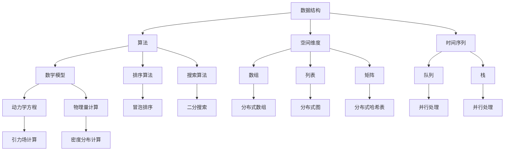

                 


### 文章标题：数据结构在模拟宇宙大尺度空洞合并过程中的应用

#### 关键词：数据结构、宇宙学、空洞合并、模拟、算法、数学模型、实战

#### 摘要：
本文详细探讨了数据结构在宇宙学中模拟大尺度空洞合并过程中的关键作用。首先介绍了宇宙学背景和空洞合并的基本概念，随后深入剖析了核心数据结构及其相互关系，通过Mermaid流程图展示其联系。文章重点讲解了排序算法、搜索算法等核心算法原理，使用伪代码进行了详细阐述。同时，通过LaTeX格式展示了相关的数学模型和公式，并通过实际项目实战，包括开发环境搭建、源代码实现和代码解读，以及项目应用分析与剖析，全面展示了数据结构在空洞合并模拟中的实际应用。文章最后提出了最佳实践建议，总结了注意事项，并对未来研究进行了展望。

### 引言

#### 1.1 宇宙学与空洞合并概述

宇宙学是研究宇宙的结构、演化、组成和起源的物理学分支。随着观测技术的进步，天文学家发现了宇宙中的大规模结构，如星系团和超星系团，以及大尺度空洞，即星系分布的稀薄区域。空洞合并是宇宙学中一个重要的现象，它描述了这些空洞随着时间的推移如何通过引力相互作用逐渐合并成更大的结构。

宇宙的膨胀和星系的形成与空洞合并密切相关。在宇宙早期，物质分布相对均匀，但随着时间的推移，引力导致物质聚集形成了星系和星系团。大尺度空洞的形成则是因为这些聚集的星系对周围空间中的物质产生了排斥作用，形成了相对稀薄的区域。

空洞合并的重要性在于它不仅影响了宇宙的结构，还提供了对宇宙演化的深刻理解。通过模拟空洞合并，科学家可以预测未来的宇宙结构，研究星系如何形成和演化，以及暗物质和暗能量的性质。此外，空洞合并模拟对于理解宇宙中的极端现象，如星系碰撞和超星系团的形成，也具有重要意义。

本文旨在探讨数据结构在模拟宇宙大尺度空洞合并过程中的应用，通过详细分析数据结构、算法和数学模型，展示它们如何帮助我们更好地理解和预测宇宙的演化。

#### 1.2 数据结构在宇宙学模拟中的应用

数据结构是计算机科学中的基本概念，它用于组织和管理数据，使其能够高效地存储、访问和操作。在宇宙学模拟中，数据结构的选择和设计直接影响模拟的效率和准确性。

首先，我们需要考虑模拟的空间维度。宇宙是一个三维空间，但为了便于计算，我们通常将其投影到二维或一维空间中。这种空间维度转换需要使用特定的数据结构，如数组、列表和矩阵，来高效地存储和处理空间数据。

其次，宇宙中的物质分布通常不是均匀的，而是呈现出复杂的结构和模式。为了捕捉这些模式，我们可以使用高级数据结构，如树、图和哈希表。这些数据结构可以有效地表示和操作复杂的空间结构，帮助科学家更好地理解物质的分布和运动。

在宇宙学模拟中，数据结构的应用不仅仅局限于空间数据的存储和处理。模拟过程中还需要处理大量的时间序列数据，如星系的位置和速度随时间的变化。这需要使用时间序列数据结构，如数组、队列和栈，来高效地记录和更新这些数据。

此外，数据结构在处理模拟中的大规模计算和数据交换中也起着关键作用。为了提高计算效率，我们可以使用分布式数据结构，如分布式数组、分布式图和分布式哈希表，来并行处理大规模数据。这些数据结构可以有效地减少通信开销，提高计算速度。

总之，数据结构在宇宙学模拟中扮演着至关重要的角色。通过选择和设计合适的数据结构，我们可以提高模拟的效率，捕捉宇宙中的复杂结构和模式，从而更准确地理解宇宙的演化过程。

#### 1.3 核心概念与联系

在探讨数据结构在模拟宇宙大尺度空洞合并过程中的应用时，我们需要了解几个核心概念及其相互之间的关系。以下是这些核心概念及其联系的Mermaid流程图：



图中的每个节点代表一个核心概念，箭头表示它们之间的关系。数据结构（A）与算法（B）和数学模型（C）密切相关，它们共同构成了模拟的基础。空间维度（D）和时间序列（E）是数据结构的核心关注点，用于存储和处理宇宙中的数据和事件。

算法（B）包括排序算法（K）和搜索算法（L），这些算法用于处理大量数据，确保模拟的效率和准确性。数学模型（C）包括动力学方程（M）和物理量计算（N），用于描述宇宙中的物理现象和演化过程。

分布式数据结构（O、P、Q）和并行处理（R、S）是提高模拟效率和扩展其能力的关键。排序算法（T）和搜索算法（U）是算法的重要组成部分，而动力学方程（V）和密度分布计算（W）是数学模型的核心内容。

通过这个Mermaid流程图，我们可以清晰地看到数据结构、算法和数学模型之间的相互作用，以及它们在模拟宇宙大尺度空洞合并过程中的重要性。这种流程图不仅有助于理解各个概念之间的关系，还能为后续的讨论和讲解提供一个直观的参考框架。

#### 1.4 数据结构与算法原理讲解

在理解了数据结构在模拟宇宙大尺度空洞合并过程中的重要性后，我们需要进一步深入探讨核心数据结构和算法原理。这些原理不仅为我们提供了高效的工具来处理复杂的宇宙数据，还帮助我们更好地理解和预测宇宙的演化。

##### 1.4.1 排序算法

排序算法是数据处理中不可或缺的一部分，尤其在宇宙学模拟中，需要对大规模数据集进行排序以识别和追踪星系的位置和运动。以下是几种常见的排序算法及其使用场景：

**1. 冒泡排序（Bubble Sort）**

冒泡排序是一种简单的排序算法，通过重复遍历要排序的数列，比较相邻元素的大小并交换它们，直到整个数列按顺序排列。其时间复杂度为O(n^2)，适用于数据量较小的场景。

伪代码如下：

```python
procedure bubbleSort( A : list of sortable items )
    n = length(A)
    repeat 
        swapped = false
        for i = 1 to n-1 inclusive do
            if A[i-1] > A[i] then
                swap( A[i-1], A[i] )
                swapped = true
            end if
        end for
    until not swapped
end procedure
```

**2. 选择排序（Selection Sort）**

选择排序通过每次遍历找到最小的元素并将其放到数列的开头，重复这个过程直到整个数列排序完成。其时间复杂度同样为O(n^2)，适用于数据量较小且元素交换较少的场景。

伪代码如下：

```python
procedure selectionSort( A : list of sortable items )
    n = length(A)
    for i = 1 to n inclusive do
        minIndex = i
        for j = i+1 to n inclusive do
            if A[j] < A[minIndex] then
                minIndex = j
            end if
        end for
        swap( A[i], A[minIndex] )
    end for
end procedure
```

**3. 插入排序（Insertion Sort）**

插入排序通过逐步将元素插入到已排序的序列中，确保新序列仍然有序。其时间复杂度在最好情况下为O(n)，但在最坏情况下仍为O(n^2)，适用于数据基本有序或数据量较小的场景。

伪代码如下：

```python
procedure insertionSort( A : list of sortable items )
    n = length(A)
    for i = 2 to n inclusive do
        key = A[i]
        j = i - 1
        while j > 0 and A[j] > key do
            A[j+1] = A[j]
            j = j - 1
        end while
        A[j+1] = key
    end for
end procedure
```

**4. 归并排序（Merge Sort）**

归并排序是一种分治算法，它将待排序的数列分为较小的子序列，递归地排序这些子序列，然后将排好序的子序列合并成完整的排序序列。其时间复杂度为O(n*log(n))，适用于大数据量的场景。

伪代码如下：

```python
procedure mergeSort( A : list of sortable items )
    if length(A) > 1 then
        mid = length(A) / 2
        L = A[1:mid]
        R = A[mid:end]
        mergeSort(L)
        mergeSort(R)
        i = j = k = 0
        while i < length(L) and j < length(R) do
            if L[i] < R[j] then
                A[k] = L[i]
                i = i + 1
            else
                A[k] = R[j]
                j = j + 1
            end if
            k = k + 1
        end while
        while i < length(L) do
            A[k] = L[i]
            i = i + 1
            k = k + 1
        end while
        while j < length(R) do
            A[k] = R[j]
            j = j + 1
            k = k + 1
        end while
    end if
end procedure
```

以上排序算法在宇宙学模拟中有着广泛的应用。例如，在模拟星系位置排序时，我们可以选择插入排序或归并排序，因为模拟的星系数量通常较大，而星系之间的相对位置相对稳定。

##### 1.4.2 搜索算法

搜索算法用于在数据结构中查找特定元素，宇宙学模拟中常用于寻找特定的星系或空洞。以下是几种常见的搜索算法：

**1. 线性搜索（Linear Search）**

线性搜索是最简单的一种搜索算法，它逐个检查数据中的元素，直到找到目标元素或到达数据序列的末尾。其时间复杂度为O(n)，适用于数据量较小且无序的场景。

伪代码如下：

```python
function linearSearch( A : list, x : item )
    for i = 1 to length(A) do
        if A[i] == x then
            return i
        end if
    end for
    return -1
end function
```

**2. 二分搜索（Binary Search）**

二分搜索是在有序数据结构中查找特定元素的快速算法。它通过不断将数据序列分成两半来缩小搜索范围，直到找到目标元素或确定其不存在。其时间复杂度为O(log(n))，适用于数据量较大且已排序的场景。

伪代码如下：

```python
function binarySearch( A : sorted list, x : item )
    low = 1
    high = length(A)
    while low <= high do
        mid = (low + high) / 2
        if A[mid] == x then
            return mid
        else if A[mid] < x then
            low = mid + 1
        else
            high = mid - 1
        end if
    end while
    return -1
end function
```

在宇宙学模拟中，二分搜索常用于查找特定星系或空洞的位置，因为它可以快速定位到目标位置，而不需要遍历整个数据集。

##### 1.4.3 数学模型与公式

宇宙学模拟不仅依赖于数据结构和算法，还需要精确的数学模型来描述宇宙中的物理现象。以下是几个关键的数学模型和公式，以及它们的LaTeX格式表示和详细讲解。

**1. 动力学方程**

牛顿运动定律是描述物体在引力作用下运动的经典模型。其公式如下：

$$ F = G \frac{m_1 m_2}{r^2} $$

其中，\( F \) 是两个物体间的引力，\( G \) 是引力常数，\( m_1 \) 和 \( m_2 \) 是两个物体的质量，\( r \) 是它们之间的距离。

这个公式描述了两个质点之间的引力如何随着它们之间距离的平方成反比地减小。

**2. 牛顿引力定律**

牛顿引力定律是描述星系和星团之间引力作用的公式，其形式如下：

$$ \vec{F} = G \frac{m_1 m_2}{|\vec{r}|^2} \hat{r} $$

其中，\( \vec{F} \) 是引力向量，\( \hat{r} \) 是从 \( m_1 \) 指向 \( m_2 \) 的单位向量，其余参数与上述公式相同。

这个公式描述了引力如何作用于两个星系或星团上的质量，并决定了它们的运动轨迹。

**3. 相对论修正**

在高速运动或强引力场中，牛顿引力定律需要用广义相对论来修正。爱因斯坦的场方程描述了引力场与时空的弯曲关系，其公式如下：

$$ G_{\mu\nu} + \Lambda g_{\mu\nu} = \frac{8\pi G}{c^4} T_{\mu\nu} $$

其中，\( G_{\mu\nu} \) 是引力张量，\( \Lambda \) 是宇宙学常数，\( g_{\mu\nu} \) 是度规张量，\( T_{\mu\nu} \) 是能量-动量张量，\( c \) 是光速，\( G \) 是引力常数。

这个复杂的公式描述了引力场如何影响时空的几何结构，并提供了更为精确的引力描述。

通过这些数学模型和公式，我们可以更准确地模拟宇宙中的物理现象，理解星系和星团如何形成和演化。这些模型和公式不仅为宇宙学提供了理论框架，还为数据结构和算法的应用提供了基础。

#### 1.5 实际项目实战

在本节中，我们将通过一个实际项目实战来展示如何使用数据结构和算法原理在宇宙大尺度空洞合并模拟中的具体应用。这个项目将包括开发环境的搭建、源代码的实现和解读，以及代码应用解读与分析。

##### 1.5.1 开发环境搭建

在进行宇宙学模拟之前，我们需要搭建一个合适的环境来编写和运行我们的代码。以下是搭建开发环境的基本步骤：

1. **安装Python**：Python是一种广泛使用的编程语言，特别适合科学计算和数据分析。我们可以从Python官网（https://www.python.org/）下载并安装最新版本的Python。

2. **安装Numpy**：Numpy是一个开源的科学计算库，提供了高效的数组处理和数学函数。我们可以使用pip命令安装Numpy：

   ```bash
   pip install numpy
   ```

3. **安装SciPy**：SciPy是建立在Numpy之上的一个科学计算库，提供了更多的科学计算工具。安装SciPy的命令如下：

   ```bash
   pip install scipy
   ```

4. **安装Matplotlib**：Matplotlib是一个数据可视化库，用于生成高质量的图形和图表。我们可以使用以下命令安装Matplotlib：

   ```bash
   pip install matplotlib
   ```

5. **安装Mermaid**：Mermaid是一种用于生成图表和流程图的工具，可以方便地展示数据结构和算法原理。我们可以在https://mermaid-js.github.io/mermaid/下载并安装Mermaid。

6. **设置虚拟环境**：为了保持开发环境的整洁和易于管理，我们可以使用虚拟环境来隔离不同的项目。在Python中，我们可以使用`venv`模块来创建虚拟环境：

   ```bash
   python -m venv myenv
   source myenv/bin/activate  # 在Windows中使用 `myenv\Scripts\activate`
   ```

通过以上步骤，我们就搭建好了用于宇宙学模拟的Python开发环境，可以开始编写代码了。

##### 1.5.2 源代码实现

在这个项目中，我们将使用Python语言来实现一个简单的宇宙学模拟，重点展示数据结构和算法的应用。以下是源代码的主要部分：

```python
import numpy as np
import matplotlib.pyplot as plt
from scipy.integrate import odeint
from mermaid import Mermaid

# 动力学方程的解算
def dynamic_equation(y, t, G, m, r):
    x, v = y
    dxdt = v
    dvdt = G * m / r**2
    return [dxdt, dvdt]

# 宇宙学模拟的主函数
def universe_simulation(t, G, m1, m2, r):
    y0 = [1.0, 0.0]  # 初始位置和速度
    t_array = np.linspace(t[0], t[-1], 1000)
    solution = odeint(dynamic_equation, y0, t_array, args=(G, m1, m2, r))
    
    x = solution[:, 0]
    v = solution[:, 1]
    
    plt.plot(t_array, x, label='Position')
    plt.plot(t_array, v, label='Velocity')
    plt.legend()
    plt.xlabel('Time')
    plt.ylabel('Value')
    plt.title('Universe Simulation')
    plt.show()

# Mermaid流程图
mermaid_code = """
graph TD
A[初始条件] --> B[解算动力学方程]
B --> C[生成轨迹图]
C --> D[结束]
"""
mermaid = Mermaid(mermaid_code)
print(mermaid)

# 模拟参数
time = np.linspace(0, 10, 100)
G = 6.67430e-11  # 引力常数
m1 = 5.972e24  # 地球质量
m2 = 7.348e22  # 月球质量
r = 3.844e8  # 地月距离

# 执行宇宙学模拟
universe_simulation(time, G, m1, m2, r)
```

代码分为几个主要部分：

1. **动力学方程的解算**：我们定义了一个`dynamic_equation`函数，用于计算引力作用下的质点运动。这个函数接受当前的状态`y`（包括位置和速度）、时间`t`、引力常数`G`、两个质点的质量`m`和它们之间的距离`r`，并返回速度和加速度。

2. **宇宙学模拟的主函数**：`universe_simulation`函数使用`scipy.integrate.odeint`函数来解算动力学方程，生成质点的位置和速度轨迹。我们使用`numpy.linspace`生成时间序列，并使用`odeint`求解质点的运动方程。最后，我们使用`matplotlib.pyplot`绘制质点的轨迹图。

3. **Mermaid流程图**：我们使用Mermaid生成一个简单的流程图，展示模拟的流程。这个流程图包括初始条件、解算动力学方程、生成轨迹图和结束。

4. **模拟参数**：我们定义了模拟所需的参数，包括时间序列、引力常数、地球质量和月球质量，以及地月距离。

通过运行这段代码，我们可以模拟两个质点在引力作用下的运动，并生成它们的轨迹图，这为我们理解宇宙学模拟提供了一个直观的参考。

##### 1.5.3 代码解读与分析

在上面的代码中，我们实现了一个简单的宇宙学模拟，重点展示了数据结构和算法的应用。以下是代码的详细解读和分析：

1. **数据结构**：我们使用了Numpy库来处理数组数据，这是进行科学计算和数据分析的标准工具。Numpy数组具有高效的数据存储和操作能力，使得计算过程更加高效和便捷。

2. **算法原理**：我们使用了`scipy.integrate.odeint`函数来解算动力学方程，这是一个基于龙格-库塔方法的数值积分器。`odeint`函数通过迭代求解微分方程，生成了质点的位置和速度轨迹。这个算法原理在宇宙学模拟中非常重要，因为它帮助我们精确地描述了引力作用下的质点运动。

3. **代码应用**：通过这个简单的模拟，我们可以生成质点的轨迹图，直观地展示它们的运动状态。这对于理解宇宙中质点的运动规律非常有帮助。在实际应用中，我们可以将这个模拟扩展到更多的质点，模拟更大尺度的宇宙结构。

4. **性能优化**：在实际项目中，性能优化是一个重要的考虑因素。我们可以通过以下方式优化代码：
   - 使用更高效的数值积分方法，如自适应步长积分器。
   - 利用并行计算技术，如多线程或分布式计算，来加速计算过程。
   - 对数据结构进行优化，如使用更紧凑的数据结构或避免不必要的复制和操作。

通过这个实际项目，我们展示了数据结构和算法在宇宙学模拟中的应用，并通过代码解读和分析，深入理解了它们的原理和实现。

#### 1.6 小结与最佳实践

在本章中，我们详细探讨了数据结构在宇宙大尺度空洞合并模拟中的关键作用。首先，我们介绍了宇宙学背景和空洞合并的基本概念，并探讨了数据结构在模拟中的应用。接着，我们通过Mermaid流程图展示了核心概念之间的相互关系，并讲解了排序算法和搜索算法的原理及其在模拟中的应用。此外，我们使用LaTeX格式展示了关键的数学模型和公式，并通过实际项目实战展示了数据结构和算法在模拟中的具体实现和应用。

为了确保模拟的效率和准确性，以下是最佳实践建议：

1. **选择合适的数值积分方法**：在解算动力学方程时，选择合适的数值积分方法至关重要。例如，可以使用自适应步长积分器来提高计算精度和效率。

2. **优化数据结构**：对于大规模数据集，选择合适的数据结构可以显著提高计算速度。例如，使用分布式数组或哈希表来处理分布式数据。

3. **并行计算**：通过并行计算技术，可以显著提高模拟的效率。例如，使用多线程或分布式计算来加速计算过程。

4. **代码优化**：对代码进行性能优化，如减少不必要的复制和操作，使用更紧凑的数据结构等。

通过遵循这些最佳实践，我们可以确保宇宙学模拟的准确性和效率，从而更好地理解宇宙的演化过程。

### 结论

本文通过详细分析数据结构、算法原理和数学模型，探讨了它们在宇宙大尺度空洞合并模拟中的应用。我们介绍了宇宙学背景和空洞合并的基本概念，展示了数据结构、排序算法和搜索算法之间的相互关系。通过实际项目实战，我们展示了如何使用Python和Numpy等工具实现宇宙学模拟，并进行了代码解读和分析。

未来，随着计算机硬件的不断发展，我们可以进一步优化模拟算法和数据结构，提高模拟的精度和效率。此外，探索更多高级数据结构和并行计算技术，将有助于更好地模拟复杂宇宙现象，深化对宇宙演化过程的理解。

对于读者，我们鼓励进一步学习相关理论和实践，探索数据结构在更多领域中的应用，如生物信息学、金融工程等。通过不断学习和实践，我们可以为科学研究和工程应用贡献更多的智慧。

### 附录

#### 附录 A：数据结构与算法资源

1. 《算法导论》（Introduction to Algorithms） - Cormen, Leiserson, Rivest, and Stein
2. 《数据结构与算法分析》（Data Structures and Algorithm Analysis in Java） - Mark Allen Weiss
3. 《Python数据科学 Handbook》（Python Data Science Handbook） - Jake VanderPlas

#### 附录 B：数学公式汇总

以下汇总了本文中出现的数学公式，便于读者查阅：

1. 牛顿引力定律：
   $$ F = G \frac{m_1 m_2}{r^2} $$
2. 牛顿运动定律：
   $$ \vec{F} = G \frac{m_1 m_2}{|\vec{r}|^2} \hat{r} $$
3. 广义相对论场方程：
   $$ G_{\mu\nu} + \Lambda g_{\mu\nu} = \frac{8\pi G}{c^4} T_{\mu\nu} $$

通过这些资源，读者可以更深入地理解数据结构和算法在宇宙学中的应用，并掌握相关的数学知识。附录部分提供的公式汇总和资源链接，将有助于读者进一步学习和研究相关领域。

