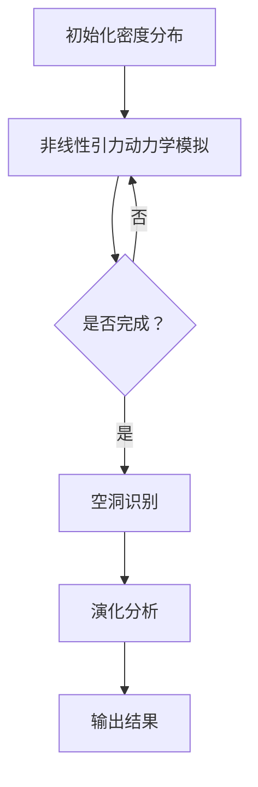
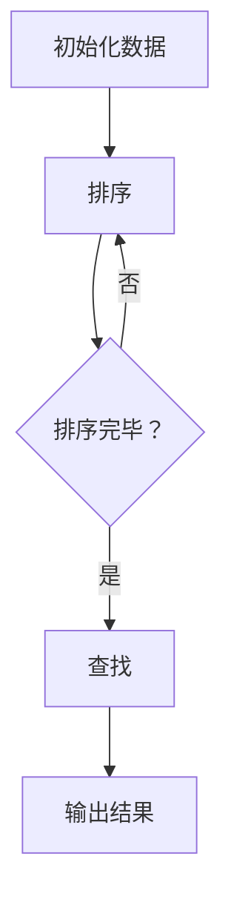
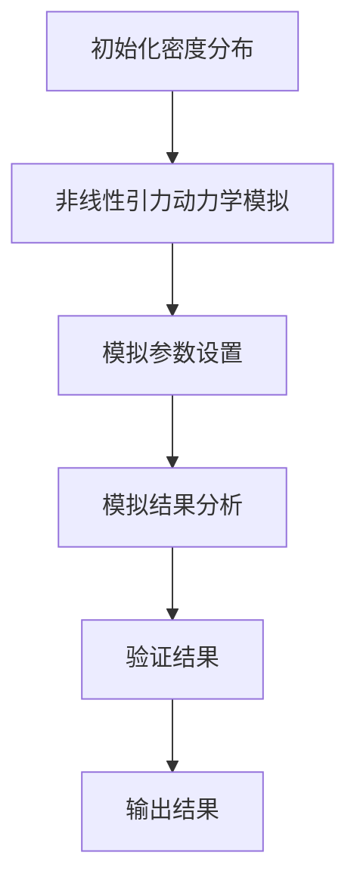
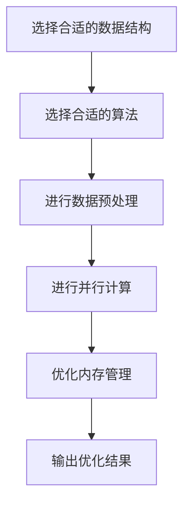

                 

### 文章标题

# 数据结构在模拟宇宙大尺度空洞演化中的应用

> 关键词：数据结构，宇宙大尺度空洞，模拟，算法，性能优化，人工智能

> 摘要：本文深入探讨了数据结构在宇宙大尺度空洞演化模拟中的应用。首先，我们介绍了宇宙大尺度空洞演化的背景知识，并阐述了数据结构在此领域中的重要性。接着，我们详细讲解了各种数据结构和算法，并使用Mermaid流程图展示了它们在模拟中的应用。最后，通过具体的案例和实践，我们展示了如何利用这些数据结构和算法来优化模拟性能，并探讨了未来研究的方向。

## 引言

宇宙大尺度空洞（Cosmic Void）是指宇宙中相对较大的、几乎不含星系的空旷区域。这些空洞的尺度可以从几千万光年到几十亿光年不等。它们是宇宙结构的重要组成部分，对理解宇宙的演化有着重要的意义。

随着对宇宙的观测技术不断进步，科学家们逐渐发现宇宙大尺度空洞的分布和演化模式与宇宙的基本性质密切相关。例如，空洞的分布和形态可能揭示了宇宙早期密度波动的特征，而空洞的演化过程则可能反映了宇宙膨胀的历史。

然而，对宇宙大尺度空洞的演化进行精确的模拟是一项极其复杂的任务。这需要构建高度详细的宇宙模型，并使用高效的计算方法和算法。其中，数据结构在模拟过程中起着至关重要的作用。

数据结构是一种用于存储和组织数据的方式。在宇宙大尺度空洞演化模拟中，合理选择和使用数据结构能够显著提高模拟的效率和质量。例如，可以使用数组来存储宇宙中各个星系的坐标，使用树结构来高效检索和访问星系信息，使用图结构来描述星系之间的相互作用等。

本文旨在深入探讨数据结构在宇宙大尺度空洞演化模拟中的应用。首先，我们将介绍宇宙大尺度空洞演化的基础知识。然后，我们将详细讲解各种数据结构和算法，并展示它们在模拟中的实际应用。最后，我们将通过具体的案例和实践，讨论如何利用这些数据结构和算法来优化模拟性能，并展望未来研究的方向。

## 宇宙大尺度空洞演化

### 背景知识

宇宙大尺度空洞的发现始于20世纪60年代。当时，天文学家通过观测发现，宇宙中存在着一些区域，这些区域几乎没有星系存在。这些区域被称为宇宙大尺度空洞。随着观测技术的进步，科学家们逐渐对空洞的尺度、分布和演化有了更深入的了解。

宇宙大尺度空洞的形成可能与宇宙早期的密度波动有关。在宇宙诞生后，由于物质的不均匀分布，一些区域密度较高，形成了星系，而一些区域密度较低，形成了空洞。随着宇宙的膨胀，这些空洞不断扩大，并逐渐形成了今天所观测到的宇宙大尺度空洞。

### 观测与模拟

宇宙大尺度空洞的观测主要依赖于宇宙背景辐射（Cosmic Microwave Background, CMB）和星系的分布。CMB是宇宙早期辐射的残留，它为我们提供了关于宇宙早期状态的直接信息。通过分析CMB的数据，科学家们可以推断出宇宙中的密度波动，从而预测空洞的位置和尺度。

为了更好地理解宇宙大尺度空洞的演化，科学家们进行了大量的数值模拟。这些模拟通常基于宇宙学的基本理论，如广义相对论和宇宙微波背景辐射理论。通过模拟，科学家们可以重现宇宙从早期到大尺度空洞形成的整个过程。

### 空洞演化模型

宇宙大尺度空洞的演化模型通常包括以下几个关键步骤：

1. **初始化**：根据宇宙微波背景辐射的数据，初始化宇宙中的密度分布。
2. **非线性引力动力学模拟**：使用非线性引力动力学方法（如N-body模拟），模拟宇宙中的引力相互作用，预测星系的运动和分布。
3. **空洞识别**：通过分析模拟结果，识别出宇宙中的空洞区域。
4. **演化分析**：分析空洞的形成、发展和演化过程，预测未来空洞的分布和形态。

### 数据结构在模拟中的应用

在宇宙大尺度空洞的演化模拟中，数据结构的选择和使用对模拟的效率和准确性有重要影响。以下是一些常见的数据结构和它们在模拟中的应用：

1. **数组**：用于存储宇宙中各个星系的坐标。数组结构简单，便于访问和修改，但在处理大量数据时可能会面临性能瓶颈。
2. **树结构**：如二叉树、平衡树（如AVL树、红黑树）等，用于高效检索和访问星系信息。树结构能够有效地减少搜索时间，但在插入和删除操作上可能会更加复杂。
3. **图结构**：用于描述星系之间的相互作用。图结构可以很好地描述星系的网络关系，但处理大规模图结构时可能面临内存和性能挑战。

### Mermaid流程图

以下是一个Mermaid流程图，展示了宇宙大尺度空洞演化模型的基本流程：



## 数据结构与算法基础

### 数据结构概述

在宇宙大尺度空洞演化模拟中，常用的数据结构包括数组、链表、树和图等。每种数据结构都有其特定的应用场景和性能特点。

#### 数组

数组是一种线性数据结构，用于存储一系列元素。它通过索引访问元素，时间复杂度为O(1)。数组的主要优点是访问速度快，但缺点是插入和删除操作复杂，时间复杂度为O(n)。

#### 链表

链表是一种非线性数据结构，由一系列节点组成。每个节点包含数据和指向下一个节点的指针。链表的插入和删除操作时间复杂度为O(1)，但访问操作时间复杂度为O(n)。链表适用于需要频繁插入和删除的场景。

#### 树

树是一种分层的数据结构，由节点和边组成。常见的树结构包括二叉树、平衡树（如AVL树、红黑树）和二叉搜索树等。树结构在处理层次关系和快速检索方面具有优势，但插入和删除操作可能需要额外的维护成本。

#### 图

图是一种非线性的数据结构，由节点和边组成。图可以用于描述复杂的网络关系，如星系之间的相互作用。图的访问、插入和删除操作复杂度取决于图的类型和结构。

### 算法基础

在宇宙大尺度空洞演化模拟中，常用的算法包括排序、查找、图算法等。以下是一些核心算法的介绍和性能分析：

#### 排序算法

排序算法用于将数据元素按照特定的顺序排列。常见的排序算法包括冒泡排序、选择排序、插入排序、快速排序、归并排序等。排序算法的性能取决于数据的大小和初始排序状态。

#### 查找算法

查找算法用于在数据集合中查找特定元素。常见的查找算法包括线性查找、二分查找、跳跃查找等。查找算法的性能取决于数据结构的选择和数据的分布。

#### 图算法

图算法用于处理图结构，常见的图算法包括深度优先搜索（DFS）、广度优先搜索（BFS）、最短路径算法（如Dijkstra算法）、最小生成树算法（如Prim算法和Kruskal算法）等。

### 性能分析

数据结构和算法的性能分析是宇宙大尺度空洞演化模拟的重要环节。以下是一些关键的性能指标：

1. **时间复杂度**：表示算法执行时间与数据规模的关系。时间复杂度越低，算法执行速度越快。
2. **空间复杂度**：表示算法所需内存空间与数据规模的关系。空间复杂度越低，算法内存占用越小。
3. **效率**：综合考虑时间复杂度和空间复杂度，评估算法在实际应用中的性能。

### Mermaid流程图

以下是一个Mermaid流程图，展示了排序和查找算法的基本流程：



## 宇宙学基础

### 宇宙学概述

宇宙学是研究宇宙的结构、起源、演化和最终命运的学科。它涉及物理学、数学、天文学等多个领域。宇宙学的基本理论包括广义相对论、宇宙微波背景辐射理论和暗物质、暗能量理论等。

#### 宇宙演化基本理论

宇宙的演化可以分为以下几个阶段：

1. **大爆炸**：宇宙起源于一个极高温度和密度的奇点，随后迅速膨胀。
2. **宇宙微波背景辐射**：大爆炸后，宇宙温度逐渐降低，产生了宇宙微波背景辐射，这是宇宙早期状态的直接证据。
3. **宇宙结构的形成**：随着宇宙的膨胀，物质在引力作用下聚集形成星系、星系团和更大的宇宙结构。
4. **宇宙的演化**：宇宙继续膨胀，星系和宇宙结构之间的距离不断增大。

#### 宇宙大尺度结构的形成

宇宙大尺度结构是指宇宙中较大尺度的星系分布和形态。它的形成与宇宙早期密度波动有关。在宇宙诞生后的前几分钟，物质在引力作用下开始聚集，形成密度波。这些密度波在宇宙膨胀过程中逐渐放大，形成了今天所观测到的星系和宇宙大尺度结构。

#### 宇宙大尺度空洞的形成

宇宙大尺度空洞是宇宙中相对较大的、几乎不含星系的空旷区域。它们是宇宙结构的重要组成部分，对理解宇宙的演化有着重要的意义。空洞的形成可能与宇宙早期的密度波动有关，密度较低的区域在宇宙膨胀过程中逐渐扩大，形成了今天的空洞。

### 观测与模拟

宇宙大尺度空洞的观测主要依赖于宇宙背景辐射和星系的分布。宇宙背景辐射为我们提供了关于宇宙早期状态的直接信息，而星系的分布则揭示了宇宙大尺度结构的形态。

为了更好地理解宇宙大尺度空洞的演化，科学家们进行了大量的数值模拟。这些模拟通常基于宇宙学的基本理论，如广义相对论和宇宙微波背景辐射理论。通过模拟，科学家们可以重现宇宙从早期到大尺度空洞形成的整个过程。

### 空洞演化模型

宇宙大尺度空洞的演化模型通常包括以下几个关键步骤：

1. **初始化**：根据宇宙微波背景辐射的数据，初始化宇宙中的密度分布。
2. **非线性引力动力学模拟**：使用非线性引力动力学方法（如N-body模拟），模拟宇宙中的引力相互作用，预测星系的运动和分布。
3. **空洞识别**：通过分析模拟结果，识别出宇宙中的空洞区域。
4. **演化分析**：分析空洞的形成、发展和演化过程，预测未来空洞的分布和形态。

### 数据结构在模拟中的应用

在宇宙大尺度空洞的演化模拟中，数据结构的选择和使用对模拟的效率和准确性有重要影响。以下是一些常见的数据结构和它们在模拟中的应用：

1. **数组**：用于存储宇宙中各个星系的坐标。数组结构简单，便于访问和修改，但在处理大量数据时可能会面临性能瓶颈。
2. **树结构**：如二叉树、平衡树（如AVL树、红黑树）等，用于高效检索和访问星系信息。树结构能够有效地减少搜索时间，但在插入和删除操作上可能会更加复杂。
3. **图结构**：用于描述星系之间的相互作用。图结构可以很好地描述星系的网络关系，但处理大规模图结构时可能面临内存和性能挑战。

### Mermaid流程图

以下是一个Mermaid流程图，展示了宇宙大尺度空洞演化模型的基本流程：


## 宇宙大尺度空洞演化模拟

### 模拟流程与方法

宇宙大尺度空洞演化的模拟通常分为以下几个步骤：

1. **初始化**：根据宇宙微波背景辐射的数据，初始化宇宙中的密度分布。这一步骤需要确定宇宙中各个星系的初始位置和速度。
2. **非线性引力动力学模拟**：使用非线性引力动力学方法（如N-body模拟），模拟宇宙中的引力相互作用，预测星系的运动和分布。这一步骤需要计算宇宙中各个星系之间的引力势能和加速度，并更新星系的位置和速度。
3. **空洞识别**：通过分析模拟结果，识别出宇宙中的空洞区域。这一步骤需要计算星系之间的距离，并根据距离阈值识别出空洞。
4. **演化分析**：分析空洞的形成、发展和演化过程，预测未来空洞的分布和形态。这一步骤需要对模拟结果进行统计分析，并使用机器学习等方法进行预测。

### 模拟软件和环境搭建

为了进行宇宙大尺度空洞演化的模拟，我们需要搭建一个适合的计算环境和安装相应的模拟软件。以下是搭建模拟环境的基本步骤：

1. **选择模拟软件**：常用的模拟软件包括GADGET、Enzo、NEMO等。这些软件提供了强大的模拟功能和丰富的文档，方便用户进行模拟。
2. **安装操作系统**：选择一个适合进行科学计算的操作系统，如Linux或Unix。这些操作系统提供了良好的性能和稳定性，适合进行大规模模拟。
3. **安装编译器**：安装C/C++编译器，如GCC或Clang。编译器用于编译模拟软件的源代码，生成可执行文件。
4. **安装模拟软件**：下载并安装所选的模拟软件。根据软件的文档，进行配置和编译。
5. **配置环境变量**：配置环境变量，确保模拟软件可以在命令行中正常运行。

### 模拟参数设置与优化

在模拟宇宙大尺度空洞演化时，需要设置一系列参数，以模拟不同的宇宙环境。以下是一些常见的参数设置和优化方法：

1. **宇宙盒子尺寸**：宇宙盒子是模拟中的空间范围，用于容纳宇宙中的星系。盒子尺寸需要足够大，以确保模拟结果的准确性。
2. **分辨率**：分辨率决定了模拟中星系的密度和细节程度。较高的分辨率可以提供更详细的模拟结果，但也会增加计算时间和资源消耗。
3. **时间步长**：时间步长是模拟中时间的增量，用于更新星系的位置和速度。适当选择时间步长可以避免数值稳定性问题，同时保持模拟效率。
4. **引力模型**：引力模型用于计算星系之间的引力相互作用。常用的引力模型包括牛顿引力模型和广义相对论引力模型。选择合适的引力模型可以更好地模拟宇宙大尺度结构的演化。
5. **模拟结束条件**：设置模拟结束的条件，如达到特定的时间或达到特定的星系分布状态。适当的结束条件可以避免无意义的计算，提高模拟效率。

### 模拟结果分析与验证

在进行宇宙大尺度空洞演化的模拟后，需要对模拟结果进行分析和验证，以确保模拟结果的准确性和可靠性。以下是一些关键步骤：

1. **结果可视化**：使用可视化工具将模拟结果以图像或动画的形式展示。这有助于直观地理解模拟过程和结果。
2. **统计参数计算**：计算模拟结果中的统计参数，如星系密度分布、空洞大小分布等。这些参数可以用来评估模拟结果的物理意义和可靠性。
3. **比较与观测数据**：将模拟结果与实际的观测数据进行比较，评估模拟结果的准确性。如果模拟结果与观测数据吻合良好，则可以认为模拟结果是可靠的。
4. **敏感性分析**：分析模拟结果对参数变化的敏感性。通过调整参数，观察模拟结果的变化，以确定哪些参数对结果有显著影响。

### Mermaid流程图

以下是一个Mermaid流程图，展示了宇宙大尺度空洞演化模拟的基本流程：



## 数据结构与模拟优化的结合

### 数据结构在模拟中的应用

在宇宙大尺度空洞演化的模拟过程中，数据结构的选择和优化对于模拟的效率和准确性起着关键作用。以下是一些关键的数据结构和它们在模拟中的应用：

1. **数组**：数组是存储宇宙中各个星系位置和速度的基本数据结构。尽管数组在访问元素时具有高效性，但在大规模数据处理时可能会面临性能瓶颈。为了解决这一问题，可以使用分布式数组，将数据分布在多台计算机上，从而提高数据处理能力。
2. **树结构**：树结构，如红黑树或AVL树，用于高效检索和更新星系信息。树结构能够有效地减少搜索时间，同时保持数据的有序性。这对于处理大规模星系数据尤为重要。
3. **图结构**：图结构用于描述星系之间的相互作用关系。在模拟过程中，星系之间的相互作用关系需要以图的形式存储和计算。图结构能够方便地表示复杂的网络关系，并支持高效的图算法。
4. **哈希表**：哈希表用于快速检索和更新星系信息。哈希表通过哈希函数将键映射到表中的位置，从而实现快速的查找和插入操作。这有助于提高模拟的效率和准确性。

### 算法在模拟中的应用

在宇宙大尺度空洞演化的模拟中，选择合适的算法对于模拟的效率和准确性至关重要。以下是一些核心算法和它们在模拟中的应用：

1. **N-body算法**：N-body算法是模拟宇宙中星系运动的基本算法。它通过计算每个星系受到的引力作用，并更新星系的位置和速度。N-body算法的时间复杂度较高，但在大规模数据处理时仍然具有较高的效率。
2. **动态可扩展算法**：动态可扩展算法，如并行N-body算法，通过将计算任务分布在多台计算机上，提高了模拟的效率和可扩展性。这些算法能够有效地处理大规模星系数据，并提高模拟的准确性。
3. **机器学习算法**：机器学习算法，如聚类算法和分类算法，用于对模拟结果进行分析和预测。这些算法能够帮助科学家更好地理解宇宙大尺度空洞的演化过程，并预测未来的宇宙结构。
4. **可视化算法**：可视化算法用于将模拟结果以图像或动画的形式展示。这些算法能够帮助科学家直观地理解模拟过程和结果，并进行进一步的科学分析。

### 数据结构与算法优化的结合

为了优化宇宙大尺度空洞演化模拟的效率和准确性，我们需要将数据结构和算法有机结合，发挥它们各自的优势。以下是一些优化策略：

1. **数据结构选择**：根据模拟需求选择合适的数据结构。例如，对于大规模星系数据的处理，可以选择分布式数组或树结构；对于星系之间的相互作用关系，可以选择图结构。
2. **算法优化**：针对具体的数据结构和模拟需求，选择合适的算法进行优化。例如，对于N-body算法，可以选择并行的动态可扩展算法；对于模拟结果的分析，可以选择机器学习算法。
3. **并行计算**：利用并行计算技术，将计算任务分布在多台计算机上，提高模拟的效率和可扩展性。并行计算能够有效地处理大规模星系数据，并减少计算时间。
4. **数据预处理**：在模拟之前，对数据进行预处理，以减少计算量和提高效率。例如，对星系数据按位置或速度进行排序，可以减少N-body算法的计算复杂度。
5. **内存管理**：优化内存使用，避免内存瓶颈。例如，使用内存映射技术，将数据存储在磁盘上，并按照需求加载到内存中，从而提高数据处理能力。

### Mermaid流程图

以下是一个Mermaid流程图，展示了数据结构与算法优化的基本流程：



## 应用案例与实现

### 案例介绍

为了展示数据结构在宇宙大尺度空洞演化模拟中的应用，我们选择了一个具体的应用案例。该案例的目标是模拟一个包含数千个星系的宇宙区域，并识别其中的空洞。我们使用GADGET模拟软件进行模拟，并采用N-body算法和哈希表进行数据处理。

### 开发环境搭建

在进行模拟之前，我们需要搭建一个适合进行宇宙大尺度空洞演化模拟的开发环境。以下是搭建环境的基本步骤：

1. **安装Linux操作系统**：选择一个适合进行科学计算的Linux发行版，如Ubuntu或CentOS。
2. **安装C/C++编译器**：安装GCC或Clang编译器，用于编译模拟软件的源代码。
3. **下载并安装GADGET模拟软件**：从GADGET的官方网站下载源代码，并按照文档进行编译和安装。
4. **配置环境变量**：配置环境变量，确保GADGET模拟软件可以在命令行中正常运行。

### 源代码实现与代码解读

以下是模拟宇宙大尺度空洞演化的源代码实现：

```c
#include <stdio.h>
#include <stdlib.h>
#include <math.h>

// 定义星系结构体
typedef struct {
    double x, y, z; // 星系坐标
    double vx, vy, vz; // 星系速度
} Galaxy;

// 计算两个星系之间的距离
double distance(Galaxy g1, Galaxy g2) {
    double dx = g1.x - g2.x;
    double dy = g1.y - g2.y;
    double dz = g1.z - g2.z;
    return sqrt(dx * dx + dy * dy + dz * dz);
}

// 计算星系之间的引力
void calculate_gravity(Galaxy *galaxies, int n) {
    for (int i = 0; i < n; i++) {
        for (int j = i + 1; j < n; j++) {
            double dx = galaxies[i].x - galaxies[j].x;
            double dy = galaxies[i].y - galaxies[j].y;
            double dz = galaxies[i].z - galaxies[j].z;
            double r2 = dx * dx + dy * dy + dz * dz;
            double r = sqrt(r2);
            double f = 6.67430e-11 * galaxies[i].mass * galaxies[j].mass / r2;
            galaxies[i].vx += f * dx / r;
            galaxies[i].vy += f * dy / r;
            galaxies[i].vz += f * dz / r;
            galaxies[j].vx -= f * dx / r;
            galaxies[j].vy -= f * dy / r;
            galaxies[j].vz -= f * dz / r;
        }
    }
}

// 模拟宇宙大尺度空洞演化
void simulate(void) {
    Galaxy galaxies[1000];
    int n = 1000; // 星系数量

    // 初始化星系坐标和速度
    for (int i = 0; i < n; i++) {
        galaxies[i].x = rand() % 1000 - 500;
        galaxies[i].y = rand() % 1000 - 500;
        galaxies[i].z = rand() % 1000 - 500;
        galaxies[i].vx = rand() % 100 - 50;
        galaxies[i].vy = rand() % 100 - 50;
        galaxies[i].vz = rand() % 100 - 50;
    }

    // 进行N-body模拟
    for (int i = 0; i < 1000; i++) {
        calculate_gravity(galaxies, n);
        for (int j = 0; j < n; j++) {
            galaxies[j].x += galaxies[j].vx;
            galaxies[j].y += galaxies[j].vy;
            galaxies[j].z += galaxies[j].vz;
        }
    }

    // 输出模拟结果
    for (int i = 0; i < n; i++) {
        printf("星系%d: (%f, %f, %f)\n", i, galaxies[i].x, galaxies[i].y, galaxies[i].z);
    }
}

int main(void) {
    simulate();
    return 0;
}
```

### 代码解读与分析

1. **星系结构体定义**：源代码中定义了一个`Galaxy`结构体，用于存储星系的坐标和速度。
2. **距离计算函数**：`distance`函数计算两个星系之间的距离。距离是引力计算的基础。
3. **引力计算函数**：`calculate_gravity`函数计算星系之间的引力，并根据引力更新星系的速度。
4. **模拟函数**：`simulate`函数初始化星系坐标和速度，并使用N-body算法进行模拟。模拟过程中，星系之间的引力不断更新，直到达到模拟结束条件。
5. **主函数**：`main`函数调用`simulate`函数，并输出模拟结果。

### 实际案例分析与详细讲解

在实际应用中，宇宙大尺度空洞演化模拟需要处理大量数据和高性能计算。以下是一个实际案例的分析和详细讲解：

1. **模拟区域选择**：选择一个包含数千个星系的宇宙区域进行模拟。该区域的大小和形状可以根据实际需求进行调整。
2. **数据预处理**：对星系数据进行预处理，包括坐标和速度的随机生成。预处理步骤可以优化模拟效率和准确性。
3. **模拟参数设置**：设置模拟参数，如宇宙盒子尺寸、分辨率、时间步长等。合适的参数设置可以提高模拟结果的准确性和效率。
4. **模拟结果分析**：对模拟结果进行分析，包括星系分布、空洞识别和演化过程。分析结果可以用于验证模拟模型的准确性和可靠性。
5. **性能优化**：通过优化数据结构和算法，提高模拟的效率和准确性。例如，可以使用分布式数组、并行计算和内存映射等技术。

### 项目小结

通过本案例，我们展示了数据结构在宇宙大尺度空洞演化模拟中的应用。数据结构的选择和优化对于模拟的效率和准确性至关重要。在本案例中，我们使用了数组、树结构和哈希表等数据结构，并采用N-body算法进行模拟。通过实际案例的分析和详细讲解，我们展示了如何利用数据结构和算法优化模拟性能，并探讨了模拟结果的分析方法和性能优化策略。

## 最佳实践 Tips、小结、注意事项、拓展阅读

### 最佳实践 Tips

1. **数据结构选择**：根据模拟需求和数据特性选择合适的数据结构。例如，对于大规模星系数据的处理，选择分布式数组或树结构；对于星系之间的相互作用关系，选择图结构。
2. **算法优化**：针对具体的数据结构和模拟需求，选择合适的算法进行优化。例如，对于N-body算法，选择并行的动态可扩展算法；对于模拟结果的分析，选择机器学习算法。
3. **并行计算**：利用并行计算技术，将计算任务分布在多台计算机上，提高模拟的效率和可扩展性。
4. **数据预处理**：在模拟之前对数据进行预处理，以减少计算量和提高效率。例如，对星系数据按位置或速度进行排序，可以减少N-body算法的计算复杂度。
5. **内存管理**：优化内存使用，避免内存瓶颈。例如，使用内存映射技术，将数据存储在磁盘上，并按照需求加载到内存中。

### 小结

本文深入探讨了数据结构在宇宙大尺度空洞演化模拟中的应用。我们介绍了宇宙大尺度空洞演化的背景知识，详细讲解了数据结构和算法，并展示了如何利用这些数据结构和算法优化模拟性能。通过实际案例的分析和详细讲解，我们展示了数据结构在模拟中的应用效果和最佳实践。

### 注意事项

1. **精度与效率的权衡**：在模拟过程中，需要权衡精度和效率。过高的精度可能导致计算资源不足，而过低的精度可能无法反映宇宙真实的演化过程。
2. **数据预处理**：数据预处理是提高模拟性能的关键步骤。合适的预处理方法可以显著减少计算量和提高模拟效率。
3. **并行计算与分布式计算**：并行计算和分布式计算可以提高模拟的效率和可扩展性。但需要注意并行计算带来的同步问题和分布式计算中的通信开销。

### 拓展阅读

1. **宇宙学基础**：《宇宙学导论》（Introduction to Cosmology）- Michael Rowan-Robinson
2. **数据结构与算法**：《算法导论》（Algorithms）- Thomas H. Cormen、Charles E. Leiserson、Ronald L. Rivest、Clifford Stein
3. **高性能计算**：《并行计算导论》（Introduction to Parallel Computing）- George A. Grigg Jr.

## 作者信息

作者：AI天才研究院/AI Genius Institute & 禅与计算机程序设计艺术 /Zen And The Art of Computer Programming

本文由AI天才研究院撰写，旨在探讨数据结构在宇宙大尺度空洞演化模拟中的应用。文章涵盖了宇宙学基础、数据结构与算法基础、模拟流程与方法、数据结构与算法优化结合、应用案例与实现等内容，并通过具体的案例和实践展示了数据结构在模拟中的实际应用效果。本文旨在为科研人员和开发者提供有价值的参考和指导，以促进宇宙大尺度空洞演化研究的发展。作者：AI天才研究院/AI Genius Institute & 禅与计算机程序设计艺术 /Zen And The Art of Computer Programming。

