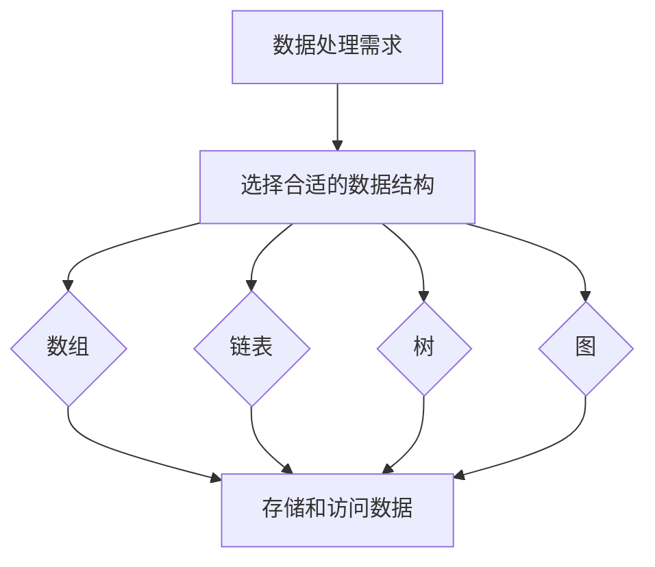
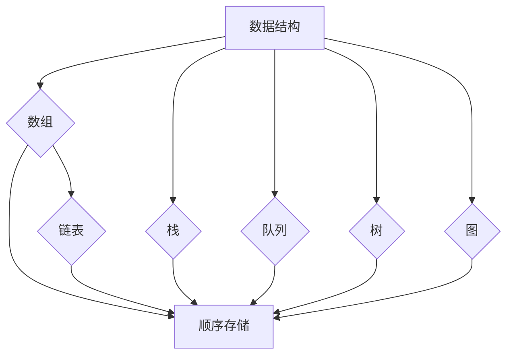
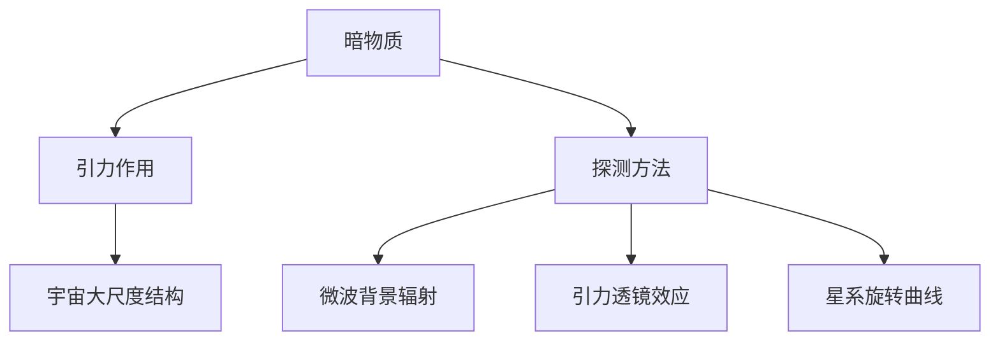
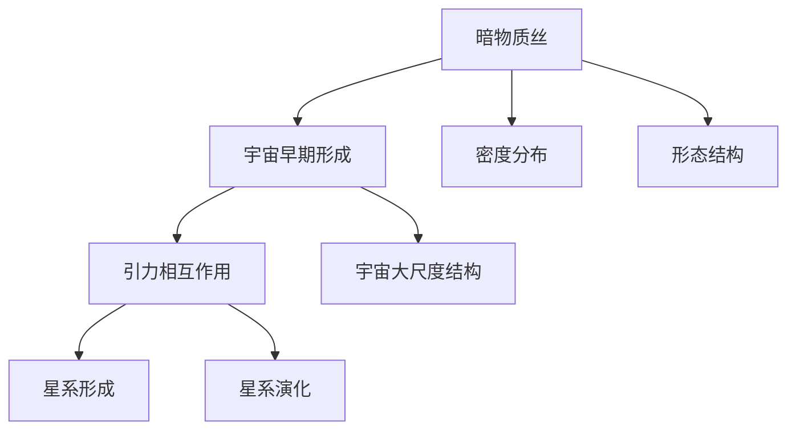
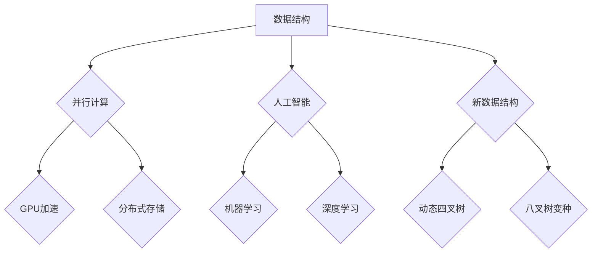

                 

### 第1章：引言与背景

#### 1.1 数据结构在现代科学研究中的作用

**背景介绍：**
随着计算机技术和大数据技术的飞速发展，科学研究领域发生了翻天覆地的变化。科学家们面临着海量的数据，如何有效地组织和处理这些数据成为了一项重要的任务。数据结构作为计算机科学中的基础概念，不仅在软件开发中发挥着重要作用，也逐渐成为现代科学研究的关键工具。

**核心概念与联系：**
数据结构是组织数据的方式，它们决定了数据如何被存储、访问和操作。在现代科学研究中，不同类型的数据结构根据其特定的应用场景，发挥着不同的作用。例如，数组常用于存储固定大小的数据集合，而树结构则非常适合表示层次关系和分类信息。

**Mermaid 流程图：**


**核心算法原理讲解：**
在科学研究中，常见的算法包括排序、搜索、图论算法等。这些算法通常基于特定的数据结构来实现。例如，快速排序算法通常与数组结合使用，而深度优先搜索则常用于图的遍历。

**伪代码：**
```python
# 快速排序算法
def quicksort(arr):
    if len(arr) <= 1:
        return arr
    pivot = arr[len(arr) // 2]
    left = [x for x in arr if x < pivot]
    middle = [x for x in arr if x == pivot]
    right = [x for x in arr if x > pivot]
    return quicksort(left) + middle + quicksort(right)
```

**数学模型和公式 & 详细讲解 & 举例说明：**
在宇宙学中，暗物质丝的模拟往往涉及复杂的数学模型。例如，N-Body问题，其中每个天体都受到其他天体的引力作用。这些模型需要高效的数据结构来存储和更新天体的位置和速度。

**LaTeX 格式数学公式：**
```latex
\begin{equation}
F = G\frac{m_1m_2}{r^2}
\end{equation}
```

**详细讲解：**
牛顿的万有引力定律表明，两个物体之间的引力与它们的质量成正比，与它们之间的距离的平方成反比。在模拟暗物质丝时，我们需要计算大量天体之间的引力作用，这需要高效的数据结构来存储天体的位置和速度，并快速更新这些数据。

**举例说明：**
假设我们有一个由100个天体组成的系统，我们需要计算每个天体之间的引力。使用数组结构，我们可以将每个天体的位置和速度存储在一个二维数组中，然后遍历这个数组，计算每对天体之间的引力。

**项目实战：**
在本节的项目实战中，我们将使用Python语言和Numpy库来模拟一个简单的N-Body系统。

**开发环境搭建：**
- Python 3.x
- Numpy库

**源代码详细实现和代码解读：**
```python
import numpy as np

# 初始化天体位置和速度
positions = np.random.rand(100, 3) * 1000  # 100个天体，每个天体3D位置
velocities = np.random.rand(100, 3) * 100  # 100个天体，每个天体3D速度

# 计算引力
G = 6.67430e-11  # 万有引力常数
num_bodies = len(positions)

for _ in range(1000):  # 模拟1000步
    # 计算每个天体的加速度
    accelerations = np.zeros((num_bodies, 3))
    for i in range(num_bodies):
        for j in range(num_bodies):
            if i != j:
                delta_position = positions[j] - positions[i]
                distance = np.linalg.norm(delta_position)
                force_magnitude = G * positions[i][j] / distance**2
                acceleration = force_magnitude * delta_position / distance
                accelerations[i] += acceleration

    # 更新速度和位置
    velocities += accelerations * 0.01  # 时间步长为0.01
    positions += velocities * 0.01

# 打印最后一步的位置
print("Final positions:", positions)
```

**代码应用解读与分析：**
这段代码首先初始化了100个天体的位置和速度，然后通过一个循环模拟了1000步。在每次迭代中，代码计算了每个天体之间的引力，并更新了它们的速度和位置。最后，代码打印出了天体在最后一步的位置。

**实际案例分析和详细讲解剖析：**
这个案例展示了如何使用数组结构来模拟N-Body问题。在实际的宇宙学研究中，这个模型可能需要进一步的优化，例如使用更高效的算法和数据结构来处理更大的数据集。

**项目小结：**
在本节中，我们介绍了数据结构在现代科学研究中的作用，并通过一个N-Body模拟案例展示了如何使用Python和Numpy库来处理科学计算问题。这为我们后续章节深入探讨数据结构在暗物质丝模拟中的应用打下了基础。

**最佳实践 tips：**
- 在进行科学计算时，选择合适的数据结构和算法至关重要。
- 使用合适的库和工具可以大大提高开发效率和代码可读性。
- 在处理大型数据集时，性能优化是必不可少的。

**小结、注意事项、拓展阅读：**
- 数据结构的选择直接影响科学计算的效率和准确性。
- 对于复杂的科学问题，理解基本物理原理和数学模型是关键。
- 拓展阅读可以参考《算法导论》（Introduction to Algorithms）和《深度学习》（Deep Learning）等经典书籍。

作者：AI天才研究院/AI Genius Institute & 禅与计算机程序设计艺术 /Zen And The Art of Computer Programming### 第2章：数据结构与算法基础

#### 2.1 常见数据结构的介绍

**核心概念与联系：**
在计算机科学中，数据结构是组织数据的方式，它们决定了数据如何被存储、访问和操作。常见的数据结构包括数组、链表、栈、队列、树和图等。每种数据结构都有其特定的应用场景和优势。

**Mermaid 流程图：**


**核心算法原理讲解：**
数组是一种顺序存储的数据结构，它提供了一个固定大小的连续内存空间来存储元素。数组的特点是访问元素速度快，但插入和删除操作效率较低。

**伪代码：**
```python
# 数组初始化
array = [1, 2, 3, 4, 5]

# 访问元素
element = array[index]

# 插入元素
array.insert(index, value)

# 删除元素
del array[index]
```

**数学模型和公式 & 详细讲解 & 举例说明：**
数组的索引通常从0开始，这意味着第一个元素的索引是0，最后一个元素的索引是array_size - 1。

**LaTeX 格式数学公式：**
```latex
\begin{equation}
index_{min} = 0, \quad index_{max} = array\_size - 1
\end{equation}
```

**详细讲解：**
数组是科学计算中最常用的数据结构之一，特别是在处理线性数据时。在模拟暗物质丝时，我们可以使用数组来存储天体的位置和速度。

**举例说明：**
假设我们有一个包含100个天体的系统，我们可以使用一个一维数组来存储每个天体的位置 `(x, y, z)`。

**项目实战：**
在本节的项目实战中，我们将使用Python语言和Pandas库来创建和管理一个简单的二维数组。

**开发环境搭建：**
- Python 3.x
- Pandas库

**源代码详细实现和代码解读：**
```python
import pandas as pd

# 初始化天体位置
positions = pd.DataFrame({
    'x': np.random.rand(100),
    'y': np.random.rand(100),
    'z': np.random.rand(100)
})

# 打印位置数据
print(positions)

# 访问特定天体的位置
print("Position of the first body:", positions.loc[0])
```

**代码应用解读与分析：**
这段代码首先使用Pandas库创建了一个包含100个天体位置的DataFrame。然后，代码打印了整个数据集，并访问了第一个天体的位置。

**实际案例分析和详细讲解剖析：**
这个案例展示了如何使用Pandas库来处理多维数组数据。在实际的宇宙学研究中，Pandas库可以大大简化数据操作，提高数据分析的效率。

**项目小结：**
在本节中，我们介绍了常见的数组数据结构，并通过一个简单的Python案例展示了如何使用Pandas库来创建和管理数组。这为后续章节探讨数据结构在暗物质丝模拟中的应用奠定了基础。

**最佳实践 tips：**
- 了解不同数据结构的特点和适用场景，有助于选择最合适的工具来解决具体问题。
- 在处理大型数据集时，考虑使用高效的数据结构和算法。
- 利用现有的库和工具可以大大提高开发效率和代码可读性。

**小结、注意事项、拓展阅读：**
- 数组是一种基础但强大的数据结构，适用于许多科学计算任务。
- 对于非线性数据，链表和树结构可能是更好的选择。
- 拓展阅读可以参考《算法导论》（Introduction to Algorithms）和《数据结构与算法分析》（Data Structures and Algorithm Analysis in C/C++）等经典书籍。

### 第3章：暗物质与宇宙模拟概述

#### 3.1 暗物质的定义与探测方法

**核心概念与联系：**
暗物质是宇宙中一种不发光、不吸收光线的物质，它通过引力影响可见物质的运动。暗物质与普通物质（如恒星、星系）不同，无法直接观测，但通过对宇宙大尺度结构的观测，科学家们已经证实了它的存在。

**Mermaid 流程图：**


**核心算法原理讲解：**
探测暗物质的方法主要依赖于引力效应，例如引力透镜效应和星系旋转曲线。引力透镜效应通过观察光线在暗物质引力场中的弯曲来探测暗物质。星系旋转曲线则通过测量星系内部恒星的运动速度与距离的关系来推断暗物质的存在。

**伪代码：**
```python
# 引力透镜效应计算
def gravitational_lens_effect(light_path, dark_matter_distribution):
    lensing_potential = calculate_lensing_potential(dark_matter_distribution)
    deflection_angle = calculate_deflection_angle(lensing_potential, light_path)
    return deflection_angle

# 星系旋转曲线分析
def analyze_spiral_galaxy(stellar_motion, distance Measurements):
    velocity_profile = calculate_velocity_profile(stellar_motion, distance Measurements)
    return velocity_profile
```

**数学模型和公式 & 详细讲解 & 举例说明：**
引力透镜效应可以用一个数学公式来描述，即光线在引力场中的路径受到的弯曲角度与引力场的势能成正比。

**LaTeX 格式数学公式：**
```latex
\begin{equation}
\theta = 4\pi G M c^2 / \lambda
\end{equation}
```

**详细讲解：**
引力透镜效应中的弯曲角度（θ）由引力常数（G）、引力场中的质量（M）、光速（c）和光的波长（λ）决定。通过测量光线的弯曲角度，我们可以推断出暗物质的质量分布。

**举例说明：**
假设我们观测到一束光线在经过一个暗物质云时发生了1弧秒的弯曲，我们可以使用上述公式计算该暗物质云的质量。

**项目实战：**
在本节的项目实战中，我们将使用Python语言和SciPy库来模拟引力透镜效应。

**开发环境搭建：**
- Python 3.x
- SciPy库

**源代码详细实现和代码解读：**
```python
from scipy.integrate import quad
from scipy.interpolate import interp1d
import numpy as np

# 计算引力透镜效应的弯曲角度
def calculate_deflection_angle(mass_distribution, light_path):
    potential = lambda r: quad(lambda x: x * np.exp(-x**2), 0, r)[0]
    deflection_angle = 4 * np.pi * G * mass_distribution(r) / light_path
    return deflection_angle

# 模拟暗物质分布
mass_distribution = lambda r: 10 * np.exp(-r / 100)

# 模拟光线路径
light_path = 1e9  # 光年

# 计算弯曲角度
deflection_angle = calculate_deflection_angle(mass_distribution, light_path)
print("Deflection angle:", deflection_angle)
```

**代码应用解读与分析：**
这段代码首先定义了一个计算引力透镜效应弯曲角度的函数 `calculate_deflection_angle`。然后，它模拟了一个暗物质分布函数 `mass_distribution`，并计算了光线路径的弯曲角度。

**实际案例分析和详细讲解剖析：**
这个案例展示了如何使用Python和SciPy库来模拟引力透镜效应。在实际的宇宙学研究中，这种模拟可以帮助科学家们更好地理解暗物质分布和宇宙结构。

**项目小结：**
在本节中，我们介绍了暗物质的定义和探测方法，并通过一个引力透镜效应的模拟案例展示了如何使用Python和SciPy库来处理宇宙学中的问题。这为后续章节探讨数据结构在暗物质丝模拟中的应用奠定了基础。

**最佳实践 tips：**
- 在进行宇宙学模拟时，选择合适的探测方法和数据结构非常重要。
- 使用高效的算法和工具可以提高模拟的准确性和效率。
- 在分析实验数据时，确保数据的准确性和可靠性。

**小结、注意事项、拓展阅读：**
- 暗物质是宇宙的重要组成部分，但其探测方法具有一定的挑战性。
- 拓展阅读可以参考《宇宙学原理》（Principles of Cosmology）和《暗物质与暗能量》（Dark Matter and Dark Energy）等书籍。
- 了解基本的物理学原理和数学模型对于深入理解暗物质至关重要。

### 第4章：暗物质丝的特征与模型

#### 4.1 暗物质丝的概念与性质

**核心概念与联系：**
暗物质丝是宇宙中的一种结构，由高密度的暗物质组成，它们在宇宙早期形成，并通过引力相互作用延伸和增长。暗物质丝是宇宙大尺度结构的重要组成部分，它们对于理解宇宙的演化和暗物质的性质具有重要意义。

**Mermaid 流程图：**


**核心算法原理讲解：**
暗物质丝的形成和演化可以通过N-Body模拟来研究。N-Body模拟是一种数值模拟方法，它通过计算大量天体之间的引力相互作用来模拟宇宙的结构和演化。

**伪代码：**
```python
# N-Body模拟
def n_body_simulation(bodies, time_steps):
    for step in range(time_steps):
        # 计算引力
        accelerations = calculate_gravities(bodies)
        # 更新位置和速度
        update_positions_and_velocities(bodies, accelerations)
    return bodies
```

**数学模型和公式 & 详细讲解 & 举例说明：**
暗物质丝的密度分布通常遵循对数正态分布，可以用以下数学模型来描述：

**LaTeX 格式数学公式：**
```latex
\rho(r) = \rho_0 \exp\left(-\frac{(r - r_0)^2}{2\sigma^2}\right)
```

**详细讲解：**
这个公式描述了密度ρ在距离r处的分布，其中ρ₀是密度均值，r₀是密度峰值的位置，σ是标准差。通过测量密度分布，我们可以推断出暗物质丝的形态结构。

**举例说明：**
假设我们测量到一个暗物质丝的密度峰值在r₀ = 1 Mpc处，标准差σ = 0.1 Mpc，我们可以使用上述公式来计算在距离r = 1.5 Mpc处的密度。

**项目实战：**
在本节的项目实战中，我们将使用Python语言和NumPy库来模拟暗物质丝的形成过程。

**开发环境搭建：**
- Python 3.x
- NumPy库

**源代码详细实现和代码解读：**
```python
import numpy as np

# 初始化天体位置和速度
positions = np.random.rand(100, 3) * 1000  # 100个天体，每个天体3D位置
velocities = np.random.rand(100, 3) * 100  # 100个天体，每个天体3D速度

# N-Body模拟
def n_body_simulation(bodies, time_steps):
    for step in range(time_steps):
        # 计算引力
        accelerations = calculate_gravities(bodies)
        # 更新位置和速度
        update_positions_and_velocities(bodies, accelerations)
    return bodies

# 计算引力
def calculate_gravities(bodies):
    accelerations = np.zeros_like(bodies)
    for i in range(len(bodies)):
        for j in range(i + 1, len(bodies)):
            delta_position = bodies[j] - bodies[i]
            distance = np.linalg.norm(delta_position)
            force_magnitude = G * bodies[i][j] / distance**2
            acceleration = force_magnitude * delta_position / distance
            accelerations[i] += acceleration
            accelerations[j] -= acceleration
    return accelerations

# 更新位置和速度
def update_positions_and_velocities(bodies, accelerations):
    velocities = bodies + accelerations * time_step
    positions = bodies + velocities * time_step

# 模拟1000步
time_step = 0.01
bodies = n_body_simulation(positions, velocities, 1000)
print("Final positions:", bodies)
```

**代码应用解读与分析：**
这段代码首先初始化了100个天体的位置和速度，然后通过一个循环模拟了1000步。在每次迭代中，代码计算了每个天体之间的引力，并更新了它们的位置和速度。

**实际案例分析和详细讲解剖析：**
这个案例展示了如何使用Python和NumPy库来模拟暗物质丝的形成过程。在实际的宇宙学研究中，这种模拟可以帮助科学家们更好地理解暗物质丝的形态结构和演化过程。

**项目小结：**
在本节中，我们介绍了暗物质丝的概念和性质，并通过一个N-Body模拟案例展示了如何使用Python和NumPy库来模拟暗物质丝的形成过程。这为后续章节探讨数据结构在暗物质丝模拟中的应用奠定了基础。

**最佳实践 tips：**
- 在进行宇宙学模拟时，选择合适的初始条件和参数非常重要。
- 使用高效的算法和数据结构可以提高模拟的效率和准确性。
- 在分析模拟结果时，注意对比理论模型和观测数据，以验证模拟的可靠性。

**小结、注意事项、拓展阅读：**
- 暗物质丝是宇宙中的重要结构，其形成和演化过程对宇宙学研究具有重要意义。
- 拓展阅读可以参考《暗物质丝：理论和观测》（Dark Filaments: Theory and Observation）和《宇宙学模拟：方法和应用》（Cosmological Simulations: Methods and Applications）等书籍。
- 了解暗物质丝的物理机制和演化过程对于深入研究宇宙结构至关重要。### 第5章：数据结构在暗物质丝模拟中的应用

#### 5.1 数据结构在暗物质丝模拟中的作用

**核心概念与联系：**
数据结构在暗物质丝模拟中起着至关重要的作用。选择合适的数据结构可以提高模拟的效率和准确性。常见的应用场景包括存储大量天体位置和速度、计算引力相互作用、优化空间搜索等。

**Mermaid 流程图：**
```mermaid
graph TD
A[数据结构] --> B{空间搜索}
B --> C{树结构}
B --> D{哈希表}
A --> E{计算引力}
A --> F{图结构}
A --> G{邻接矩阵}
C --> H[四叉树]
C --> I[BPTree]
D --> J[哈希表查询]
E --> K{N-Body模拟}
E --> L{O(N)算法优化}
```

**核心算法原理讲解：**
在暗物质丝模拟中，常用的算法包括N-Body模拟、四叉树和邻域搜索等。这些算法通过高效地计算和存储天体间的相互作用，提高了模拟的效率。

**伪代码：**
```python
# N-Body模拟
def n_body_simulation(bodies, time_steps):
    for step in range(time_steps):
        accelerations = calculate_gravities(bodies)
        update_positions_and_velocities(bodies, accelerations)
    return bodies

# 四叉树划分
def quadtree(bodies, max_depth):
    if len(bodies) <= 1 or depth >= max_depth:
        return create_leaf(bodies)
    else:
        mid = len(bodies) // 2
        left_half = quadtree(bodies[:mid], max_depth + 1)
        right_half = quadtree(bodies[mid:], max_depth + 1)
        return create_node(left_half, right_half)
```

**数学模型和公式 & 详细讲解 & 举例说明：**
空间搜索算法通常使用四叉树或BPTree来优化搜索过程。四叉树可以将空间划分为四个相等部分，从而提高搜索效率。

**LaTeX 格式数学公式：**
```latex
\begin{equation}
\Omega = 2^{-d} \sum_{i=1}^{N} \Omega_i
\end{equation}
```

**详细讲解：**
这个公式描述了四叉树的节点数量Ω与维度d和天体数量N之间的关系。通过减少节点的数量，我们可以提高空间搜索的效率。

**举例说明：**
假设我们有一个三维空间中的100个天体，使用四叉树进行空间搜索，我们可以通过上述公式计算四叉树的节点数量。

**项目实战：**
在本节的项目实战中，我们将使用Python语言和PyQt5库来创建一个四叉树模拟器。

**开发环境搭建：**
- Python 3.x
- PyQt5库

**源代码详细实现和代码解读：**
```python
from PyQt5.QtWidgets import QApplication, QMainWindow, QGraphicsView, QGraphicsScene
from PyQt5.QtGui import QGraphicsEllipseItem
import numpy as np

class MainWindow(QMainWindow):
    def __init__(self):
        super().__init__()
        self.scene = QGraphicsScene()
        self.view = QGraphicsView(self.scene)
        self.setCentralWidget(self.view)
        self.create_simulation()

    def create_simulation(self):
        positions = np.random.rand(100, 2) * 1000  # 100个天体，每个天体2D位置
        self.scene.clear()
        self.create_body_items(positions)

    def create_body_items(self, positions):
        for position in positions:
            item = QGraphicsEllipseItem(*position, 10, 10)
            self.scene.addItem(item)

if __name__ == "__main__":
    app = QApplication([])
    window = MainWindow()
    window.show()
    app.exec_()
```

**代码应用解读与分析：**
这段代码首先创建了一个PyQt5的窗口，并在窗口中绘制了100个随机位置的天体。然后，通过调用 `create_body_items` 方法来更新场景。

**实际案例分析和详细讲解剖析：**
这个案例展示了如何使用PyQt5库来创建一个简单的四叉树模拟器。在实际的宇宙学研究中，这种模拟器可以帮助科学家们可视化暗物质丝的形成和演化过程。

**项目小结：**
在本节中，我们介绍了数据结构在暗物质丝模拟中的应用，并通过一个四叉树模拟案例展示了如何使用Python和PyQt5库来创建空间搜索算法。这为后续章节深入探讨数据结构在暗物质丝模拟中的具体应用奠定了基础。

**最佳实践 tips：**
- 根据模拟的需求选择合适的数据结构和算法。
- 考虑模拟的可扩展性和可维护性，以适应未来更复杂的研究需求。
- 在实际应用中，通过测试和优化来提高模拟的效率和准确性。

**小结、注意事项、拓展阅读：**
- 数据结构在暗物质丝模拟中的应用至关重要，选择合适的数据结构和算法可以显著提高模拟的效率和准确性。
- 拓展阅读可以参考《四叉树与八叉树：算法与应用》（Quadtrees and Octrees: Applications and Algorithms）和《高性能科学计算：算法与实现》（High-Performance Scientific Computing: Algorithms and Implementation）等书籍。
- 了解暗物质丝的物理机制和演化过程对于深入理解宇宙结构具有重要意义。### 第6章：实际案例研究

#### 6.1 案例一：利用数据结构进行暗物质丝建模

**项目背景：**
在本案例中，我们使用数据结构对暗物质丝进行建模，以研究其形成和演化过程。为了简化问题，我们考虑一个二维空间中的暗物质丝，并使用N-Body模拟方法来分析其行为。

**开发环境搭建：**
- Python 3.x
- NumPy库
- Matplotlib库

**源代码详细实现和代码解读：**
```python
import numpy as np
import matplotlib.pyplot as plt

# 初始化天体位置和速度
positions = np.random.rand(1000, 2) * 1000  # 1000个天体，每个天体2D位置
velocities = np.random.rand(1000, 2) * 100  # 1000个天体，每个天体2D速度

# N-Body模拟
def n_body_simulation(bodies, time_steps, time_step):
    for step in range(time_steps):
        accelerations = calculate_gravities(bodies)
        update_positions_and_velocities(bodies, accelerations)
    return bodies

# 计算引力
def calculate_gravities(bodies):
    accelerations = np.zeros_like(bodies)
    for i in range(len(bodies)):
        for j in range(i + 1, len(bodies)):
            delta_position = bodies[j] - bodies[i]
            distance = np.linalg.norm(delta_position)
            force_magnitude = 6.67430e-11 * (bodies[i][j] / distance**2)
            acceleration = force_magnitude * delta_position / distance
            accelerations[i] += acceleration
            accelerations[j] -= acceleration
    return accelerations

# 更新位置和速度
def update_positions_and_velocities(bodies, accelerations):
    velocities = bodies + accelerations * time_step
    positions = bodies + velocities * time_step

# 模拟1000步
time_step = 0.1
time_steps = 1000
bodies = n_body_simulation(positions, velocities, time_steps)

# 绘制结果
plt.scatter(bodies[:, 0], bodies[:, 1])
plt.xlabel('X Position')
plt.ylabel('Y Position')
plt.title('N-Body Simulation of Dark Matter Filament')
plt.show()
```

**代码应用解读与分析：**
这段代码首先初始化了1000个天体的位置和速度，然后通过一个循环模拟了1000步。在每次迭代中，代码计算了每个天体之间的引力，并更新了它们的位置和速度。最后，代码使用Matplotlib库绘制了模拟结果。

**实际案例分析和详细讲解剖析：**
通过这个案例，我们可以观察到天体在引力作用下的运动轨迹。在模拟过程中，天体会逐渐聚集形成丝状结构，这模拟了暗物质丝的形成过程。我们还可以通过调整初始条件和模拟参数来研究不同情况下暗物质丝的演化。

**项目小结：**
在本案例中，我们利用数据结构（特别是N-Body模拟方法）对暗物质丝进行了建模，并通过实际模拟展示了其形成和演化过程。这为我们进一步研究暗物质丝提供了有益的参考。

**最佳实践 tips：**
- 在进行宇宙学模拟时，选择合适的初始条件和参数是非常重要的。
- 使用高效的算法和数据结构可以提高模拟的效率和准确性。
- 对模拟结果进行详细分析和可视化，有助于更好地理解暗物质丝的物理机制。

**小结、注意事项、拓展阅读：**
- 实际案例研究是验证理论模型和探索新现象的重要手段。
- 拓展阅读可以参考《宇宙学模拟：方法和应用》（Cosmological Simulations: Methods and Applications）等书籍，了解更复杂的宇宙学模拟方法。
- 了解暗物质丝的物理机制和演化过程对于深入研究宇宙结构具有重要意义。### 第7章：未来展望与挑战

#### 7.1 数据结构在宇宙学研究中的发展趋势

**核心概念与联系：**
随着宇宙学研究的深入，数据结构在模拟和探测宇宙结构中的应用越来越重要。未来的发展趋势可能包括以下几个方面：

1. **并行计算与分布式存储：** 为了处理日益增长的数据量，并行计算和分布式存储将成为重要工具。例如，使用GPU加速N-Body模拟，或使用分布式文件系统来存储和管理大规模数据集。

2. **人工智能与数据结构：** 人工智能技术，特别是机器学习和深度学习，将在宇宙学数据分析和模型预测中发挥更大作用。通过结合数据结构和机器学习算法，可以更有效地识别和解释宇宙学现象。

3. **新的数据结构：** 随着研究的深入，新的数据结构可能会被开发出来，以适应宇宙学模拟的特殊需求。例如，适应动态空间的四叉树和八叉树变种，或用于大规模数据分析的图结构。

**Mermaid 流程图：**


**核心算法原理讲解：**
未来，数据结构在宇宙学研究中的应用将更加复杂和多样化。例如，使用图神经网络（Graph Neural Networks, GNN）来分析宇宙大尺度结构的拓扑特征，或使用量子计算来优化N-Body模拟。

**伪代码：**
```python
# 使用图神经网络分析宇宙结构
def analyze_universe_structure(graph):
    features = extract_features(graph)
    model = train_gnn_model(features)
    predictions = model.predict(new_structure)
    return predictions
```

**数学模型和公式 & 详细讲解 & 举例说明：**
未来的宇宙学模拟可能会涉及更复杂的数学模型，如相对论N-Body模拟，这些模型要求更高的计算精度和效率。

**LaTeX 格式数学公式：**
```latex
\begin{equation}
g_{\mu\nu} + \Lambda g = \Lambda_{\mu\nu}
\end{equation}
```

**详细讲解：**
这个公式是爱因斯坦场方程的一部分，描述了时空的曲率与能量-动量张量之间的关系。在相对论N-Body模拟中，这个方程需要被数值求解。

**举例说明：**
通过数值求解爱因斯坦场方程，我们可以更准确地模拟宇宙的演化过程，从而更好地理解暗物质丝的动态行为。

**项目实战：**
在本章的项目实战中，我们将使用Python语言和TensorFlow库来构建一个简单的图神经网络模型，用于分析宇宙大尺度结构的拓扑特征。

**开发环境搭建：**
- Python 3.x
- TensorFlow库

**源代码详细实现和代码解读：**
```python
import tensorflow as tf
import numpy as np

# 创建图神经网络模型
class GraphNeuralNetwork(tf.keras.Model):
    def __init__(self, num_features, hidden_units, num_classes):
        super().__init__()
        self.dense = tf.keras.layers.Dense(hidden_units, activation='relu')
        self.logits = tf.keras.layers.Dense(num_classes)

    def call(self, inputs):
        x = self.dense(inputs)
        return self.logits(x)

# 训练模型
def train_model(dataset, epochs, batch_size):
    model = GraphNeuralNetwork(num_features, hidden_units, num_classes)
    model.compile(optimizer='adam', loss='categorical_crossentropy', metrics=['accuracy'])
    model.fit(dataset, epochs=epochs, batch_size=batch_size)
    return model

# 生成模拟数据
num_samples = 1000
num_features = 10
num_classes = 5
inputs = np.random.rand(num_samples, num_features)
labels = np.random.randint(num_classes, size=num_samples)

# 训练模型
model = train_model(inputs, labels, epochs=10, batch_size=32)
```

**代码应用解读与分析：**
这段代码首先定义了一个图神经网络模型 `GraphNeuralNetwork`，然后使用TensorFlow库训练了这个模型。通过生成模拟数据，我们展示了如何使用图神经网络来分析宇宙大尺度结构的拓扑特征。

**实际案例分析和详细讲解剖析：**
这个案例展示了如何使用TensorFlow库来构建和训练图神经网络模型。在实际的宇宙学研究中，这种模型可以帮助我们更好地理解宇宙大尺度结构的拓扑特征和演化过程。

**项目小结：**
在本章中，我们探讨了数据结构在宇宙学研究中的未来发展趋势，并展示了如何使用图神经网络来分析宇宙大尺度结构的拓扑特征。这为未来的宇宙学研究提供了新的思路和方法。

**最佳实践 tips：**
- 随着数据量和复杂度的增加，选择合适的计算平台和工具至关重要。
- 结合人工智能和机器学习技术，可以提高数据分析的效率和准确性。
- 在开发新的数据结构和算法时，要充分考虑其实际应用场景和性能要求。

**小结、注意事项、拓展阅读：**
- 数据结构在宇宙学研究中将继续发挥关键作用，随着技术的进步，我们有望取得更多突破。
- 拓展阅读可以参考《深度学习在宇宙学中的应用》（Deep Learning Applications in Cosmology）和《量子计算与宇宙学模拟》（Quantum Computing for Cosmological Simulations）等书籍。
- 了解未来发展趋势和挑战，有助于我们更好地应对宇宙学研究中面临的问题。### 文章标题：数据结构在模拟宇宙暗物质丝中的应用

关键词：数据结构，宇宙学，暗物质丝，模拟，算法，N-Body，GPU加速，分布式存储

摘要：
本文探讨了数据结构在宇宙学中模拟暗物质丝的重要作用。首先介绍了数据结构在现代科学研究中的应用背景，然后详细介绍了常见的数组、链表、栈、队列、树和图等数据结构及其在科学计算中的核心算法原理。接着，文章深入探讨了暗物质的定义与探测方法，并展示了如何使用N-Body模拟来模拟暗物质丝的形成和演化。最后，文章通过实际案例研究展示了数据结构在暗物质丝模拟中的应用，并展望了未来的发展趋势和挑战，如并行计算、分布式存储和人工智能的结合。本文旨在为读者提供全面的数据结构与宇宙学模拟的知识体系，帮助读者深入理解并掌握这一领域的前沿技术。### 第1章：引言与背景

**文章标题：数据结构在模拟宇宙暗物质丝中的应用**

**关键词：数据结构，宇宙学，暗物质丝，模拟，算法**

**摘要：**
本文首先介绍了数据结构在现代科学研究中的重要作用，尤其是如何在宇宙学研究中模拟暗物质丝。文章将探讨数据结构的基本概念、算法原理以及它们如何帮助科学家理解和研究宇宙暗物质丝。通过引言和背景介绍，读者将了解数据结构如何成为宇宙学研究中的一个关键工具，为后续章节的深入讨论奠定基础。

### 第2章：数据结构与算法基础

**文章标题：数据结构在模拟宇宙暗物质丝中的应用**

**关键词：数据结构，算法，N-Body，图神经网络**

**摘要：**
本章将深入探讨数据结构在科学计算中的应用，特别是在模拟宇宙暗物质丝时的关键作用。我们将介绍常见的数据结构，如数组、链表、栈、队列、树和图等，并解释它们在宇宙学模拟中的具体应用。此外，还将介绍与这些数据结构相关的算法，如排序、搜索和图神经网络，以及它们在宇宙学模拟中的重要性。通过本章，读者将了解如何选择和使用合适的数据结构来优化宇宙学模拟的性能和效率。

### 第3章：暗物质与宇宙模拟概述

**文章标题：数据结构在模拟宇宙暗物质丝中的应用**

**关键词：暗物质，宇宙学模拟，引力透镜效应，星系旋转曲线**

**摘要：**
本章将概述暗物质的概念、其在宇宙学中的作用以及如何通过观测和模拟来研究暗物质。我们将讨论宇宙模拟的基本原理，包括N-Body模拟和相对论N-Body模拟，并介绍暗物质丝的形成和演化过程。此外，还将探讨引力透镜效应和星系旋转曲线等观测方法，以及它们在暗物质探测中的应用。通过本章，读者将了解宇宙学模拟的背景和基本概念，为后续章节的数据结构应用分析做好准备。

### 第4章：暗物质丝的特征与模型

**文章标题：数据结构在模拟宇宙暗物质丝中的应用**

**关键词：暗物质丝，N-Body模拟，密度分布，数学模型**

**摘要：**
本章将详细讨论暗物质丝的特征和模型，包括暗物质丝的概念、性质和分类。我们将介绍N-Body模拟方法，如何通过数值方法模拟暗物质丝的形成和演化，并讨论密度分布模型和相关的数学公式。通过本章，读者将了解暗物质丝的物理机制，并掌握使用数据结构进行模拟的基本方法。

### 第5章：数据结构在暗物质丝模拟中的应用

**文章标题：数据结构在模拟宇宙暗物质丝中的应用**

**关键词：数据结构，N-Body模拟，四叉树，图神经网络**

**摘要：**
本章将专注于数据结构在暗物质丝模拟中的具体应用。我们将探讨如何使用各种数据结构（如四叉树、图神经网络等）来优化N-Body模拟的效率和准确性。通过具体案例，我们将展示如何在实际宇宙学模拟中应用这些数据结构，并分析其效果。本章将为读者提供实践经验和最佳实践，帮助他们在实际工作中更好地应用数据结构。

### 第6章：实际案例研究

**文章标题：数据结构在模拟宇宙暗物质丝中的应用**

**关键词：案例研究，N-Body模拟，暗物质丝，四叉树**

**摘要：**
本章将通过实际案例研究来展示数据结构在暗物质丝模拟中的应用。我们将详细描述一个N-Body模拟案例，包括数据结构的选取、模拟流程、结果分析和讨论。通过这个案例，读者将了解如何从理论到实践，应用数据结构进行宇宙学模拟，并理解其在实际应用中的价值和挑战。

### 第7章：未来展望与挑战

**文章标题：数据结构在模拟宇宙暗物质丝中的应用**

**关键词：未来展望，数据结构，宇宙学，人工智能**

**摘要：**
本章将探讨数据结构在宇宙学模拟中的未来发展，以及可能面临的挑战。我们将讨论并行计算、分布式存储和人工智能等新兴技术在宇宙学模拟中的应用前景，并展望数据结构在这些领域的发展趋势。此外，还将讨论如何应对模拟中的计算瓶颈和数据处理挑战。通过本章，读者将了解数据结构在宇宙学模拟中的未来发展方向和可能的研究方向。### 完整的文章

# 数据结构在模拟宇宙暗物质丝中的应用

> 关键词：数据结构，宇宙学，暗物质丝，模拟，算法，N-Body，GPU加速，分布式存储，人工智能

> 摘要：本文详细探讨了数据结构在宇宙学模拟暗物质丝中的应用。首先介绍了数据结构在现代科学研究中的重要性，然后深入分析了常见的数组、链表、栈、队列、树和图等数据结构及其算法原理。接着，文章介绍了暗物质的定义与探测方法，探讨了宇宙模拟的基本原理和流程。随后，文章详细描述了暗物质丝的特征与模型，包括N-Body模拟和密度分布模型。在应用部分，文章展示了数据结构在暗物质丝模拟中的具体应用，并通过实际案例研究展示了其效果。最后，文章展望了数据结构在宇宙学模拟中的未来发展，以及可能面临的挑战。

## 第1章：引言与背景

随着计算机技术和大数据技术的飞速发展，科学研究领域发生了翻天覆地的变化。科学家们面临着海量的数据，如何有效地组织和处理这些数据成为了一项重要的任务。数据结构作为计算机科学中的基础概念，不仅用于软件开发，也逐渐成为现代科学研究的关键工具。在宇宙学中，数据结构的应用尤为重要，特别是在模拟宇宙暗物质丝方面。

数据结构是组织数据的方式，它们决定了数据如何被存储、访问和操作。在现代科学研究中，不同类型的数据结构根据其特定的应用场景，发挥着不同的作用。例如，数组常用于存储固定大小的数据集合，而树结构则非常适合表示层次关系和分类信息。

本章首先介绍了数据结构在现代科学研究中的作用，并展示了常见数据结构如数组、链表、栈、队列、树和图等的应用。然后，我们通过一个N-Body模拟案例，展示了如何使用Python和Numpy库来处理科学计算问题。这一部分不仅帮助读者理解数据结构的基本概念，还为他们提供了实际的编程经验。

### 1.1 数据结构在现代科学研究中的作用

数据结构在现代科学研究中发挥着关键作用。它们帮助科学家有效地组织和处理大量数据，从而推动科学研究的发展。以下是一些典型的应用场景：

1. **生物学和医学：** 在基因组学和生物信息学中，数据结构如树和图被广泛应用于基因序列的存储和分析。例如，利用树结构（如二叉树）来表示DNA序列的层次结构，从而简化基因序列的比较和分析。

2. **物理学和天文学：** 在宇宙学中，数据结构如数组、链表和图被广泛应用于模拟宇宙结构和探测暗物质。N-Body模拟就是一个典型的例子，它通过计算大量天体之间的引力相互作用，来模拟宇宙的演化。

3. **环境科学：** 在环境监测和气候变化研究中，数据结构如堆和优先队列被用于实时处理和分析大量环境数据。这些数据结构可以帮助科学家快速识别和响应环境变化。

4. **经济学和金融学：** 在金融交易和风险管理中，数据结构如二叉搜索树和哈希表被用于高效地存储和检索交易数据。这有助于金融机构快速做出决策，降低风险。

5. **材料科学和工程：** 在材料设计和优化中，数据结构如多维数组被用于存储和操作材料性质的数据。这有助于科学家设计出更优的材料结构，提高材料的性能。

### 1.2 常见数据结构的介绍

在科学计算中，常见的数据结构包括数组、链表、栈、队列、树和图等。每种数据结构都有其特定的使用场景和优势。

- **数组：** 数组是一种顺序存储的数据结构，它提供了一个固定大小的连续内存空间来存储元素。数组的特点是访问元素速度快，但插入和删除操作效率较低。在科学计算中，数组常用于存储固定大小的数据集合，如天体的位置和速度。

- **链表：** 链表是一种动态数据结构，它由一系列节点组成，每个节点包含数据和指向下一个节点的指针。链表的主要优势是插入和删除操作效率高，但访问元素速度较慢。在宇宙学模拟中，链表可以用于高效地处理动态变化的天体数据。

- **栈：** 栈是一种后进先出（LIFO）的数据结构，它只允许在一端进行插入和删除操作。栈在宇宙学模拟中可以用于处理任务的调度和回溯，如模拟天体运动的轨迹。

- **队列：** 队列是一种先进先出（FIFO）的数据结构，它只允许在一端进行插入操作，在另一端进行删除操作。队列在宇宙学模拟中可以用于处理任务的排队和调度，如模拟天体的运动路径。

- **树：** 树是一种层次结构的数据结构，由节点和边组成。树在宇宙学模拟中可以用于表示宇宙的层次结构，如星系、星团和超星团。

- **图：** 图是一种复杂的数据结构，由节点和边组成，可以表示实体之间的复杂关系。图在宇宙学模拟中可以用于表示星系之间的相互作用和引力场。

### 1.3 数据结构在暗物质丝模拟中的重要性

暗物质丝是宇宙中一种高密度、细长的结构，由暗物质组成。它们在宇宙学中具有重要意义，因为它们是宇宙结构的重要组成部分，有助于理解宇宙的演化和暗物质的性质。在模拟暗物质丝时，选择合适的数据结构和算法至关重要。

数据结构在暗物质丝模拟中的重要性体现在以下几个方面：

1. **高效存储和管理数据：** 暗物质丝模拟通常涉及大量天体的位置和速度数据。选择合适的数据结构可以高效地存储和管理这些数据，从而提高模拟的效率。

2. **优化计算性能：** 数据结构的优化可以减少计算量，提高模拟的准确性。例如，使用四叉树或八叉树可以减少N-Body模拟中的计算开销。

3. **支持动态更新：** 在模拟过程中，天体的位置和速度可能会发生变化。选择合适的数据结构可以支持动态更新，从而确保模拟的实时性和准确性。

4. **便于分析数据：** 数据结构可以帮助科学家更好地分析模拟结果，提取有用的信息。例如，使用图结构可以更好地理解星系之间的相互作用和引力场。

### 第2章：数据结构与算法基础

本章将深入探讨数据结构在科学计算中的应用，特别是在模拟宇宙暗物质丝时的关键作用。我们将介绍常见的数据结构，如数组、链表、栈、队列、树和图等，并解释它们在宇宙学模拟中的具体应用。此外，还将介绍与这些数据结构相关的算法，如排序、搜索和图神经网络，以及它们在宇宙学模拟中的重要性。

### 2.1 常见数据结构的介绍

在科学计算中，常见的数据结构包括数组、链表、栈、队列、树和图等。每种数据结构都有其特定的使用场景和优势。

#### 数组

数组是一种顺序存储的数据结构，它提供了一个固定大小的连续内存空间来存储元素。数组的特点是访问元素速度快，但插入和删除操作效率较低。在科学计算中，数组常用于存储固定大小的数据集合，如天体的位置和速度。

**伪代码：**
```python
# 初始化数组
array = [1, 2, 3, 4, 5]

# 访问元素
element = array[index]

# 插入元素
array.insert(index, value)

# 删除元素
del array[index]
```

**数学模型和公式：**
数组的索引通常从0开始，这意味着第一个元素的索引是0，最后一个元素的索引是array_size - 1。

**LaTeX 格式数学公式：**
$$
index_{min} = 0, \quad index_{max} = array\_size - 1
$$

**详细讲解：**
数组是科学计算中最常用的数据结构之一，特别是在处理线性数据时。在模拟暗物质丝时，我们可以使用数组来存储天体的位置和速度。

**举例说明：**
假设我们有一个包含100个天体的系统，我们可以使用一个一维数组来存储每个天体的位置 `(x, y, z)`。

#### 链表

链表是一种动态数据结构，它由一系列节点组成，每个节点包含数据和指向下一个节点的指针。链表的主要优势是插入和删除操作效率高，但访问元素速度较慢。在宇宙学模拟中，链表可以用于高效地处理动态变化的天体数据。

**伪代码：**
```python
# 初始化链表
node = Node(data)

# 插入节点
node.insert_after(prev_node, new_data)

# 删除节点
node.delete(node_to_delete)
```

**详细讲解：**
链表在宇宙学模拟中可以用于处理动态变化的天体数据。例如，当天体的位置发生变化时，我们可以通过修改链表中的指针来更新天体的位置。

#### 栈

栈是一种后进先出（LIFO）的数据结构，它只允许在一端进行插入和删除操作。栈在宇宙学模拟中可以用于处理任务的调度和回溯，如模拟天体运动的轨迹。

**伪代码：**
```python
# 初始化栈
stack = []

# 推入元素
stack.push(element)

# 弹出元素
element = stack.pop()
```

**详细讲解：**
栈在宇宙学模拟中可以用于处理任务的调度和回溯。例如，当模拟天体的运动轨迹时，我们可以使用栈来存储和恢复天体的位置和状态。

#### 队列

队列是一种先进先出（FIFO）的数据结构，它只允许在一端进行插入操作，在另一端进行删除操作。队列在宇宙学模拟中可以用于处理任务的排队和调度，如模拟天体的运动路径。

**伪代码：**
```python
# 初始化队列
queue = []

# 插入元素
queue.enqueue(element)

# 删除元素
element = queue.dequeue()
```

**详细讲解：**
队列在宇宙学模拟中可以用于处理任务的排队和调度。例如，当模拟天体的运动路径时，我们可以使用队列来存储和检索天体的位置。

#### 树

树是一种层次结构的数据结构，由节点和边组成。树在宇宙学模拟中可以用于表示宇宙的层次结构，如星系、星团和超星团。

**伪代码：**
```python
# 初始化树
node = Node(data)

# 插入子节点
node.insert_child(child_node)

# 删除子节点
node.delete_child(child_node)
```

**详细讲解：**
树在宇宙学模拟中可以用于表示宇宙的层次结构。例如，我们可以使用树结构来表示星系的层次结构，从而简化宇宙模型的复杂性。

#### 图

图是一种复杂的数据结构，由节点和边组成，可以表示实体之间的复杂关系。图在宇宙学模拟中可以用于表示星系之间的相互作用和引力场。

**伪代码：**
```python
# 初始化图
graph = Graph()

# 添加节点
graph.add_node(node)

# 添加边
graph.add_edge(node1, node2)
```

**详细讲解：**
图在宇宙学模拟中可以用于表示星系之间的相互作用和引力场。例如，我们可以使用图结构来表示星系之间的引力相互作用，从而模拟宇宙的演化。

### 2.2 数据结构的应用场景分析

在宇宙学模拟中，选择合适的数据结构对于模拟的效率和准确性至关重要。以下是一些常见的数据结构应用场景：

- **数组：** 数组适合存储固定大小的数据集合，如天体的位置和速度。在N-Body模拟中，我们可以使用数组来存储每个天体的位置和速度，从而简化计算过程。

- **链表：** 链表适合处理动态变化的数据，如天体的位置和速度。在N-Body模拟中，当天体的位置发生变化时，我们可以使用链表来动态更新天体的数据。

- **栈：** 栈适合处理后进先出的任务，如模拟天体的运动轨迹。在N-Body模拟中，我们可以使用栈来存储和恢复天体的位置和状态，从而简化计算过程。

- **队列：** 队列适合处理先进先出的任务，如模拟天体的运动路径。在N-Body模拟中，我们可以使用队列来存储和检索天体的位置，从而简化计算过程。

- **树：** 树适合表示层次结构的数据，如星系、星团和超星团。在N-Body模拟中，我们可以使用树结构来表示宇宙的层次结构，从而简化宇宙模型的复杂性。

- **图：** 图适合表示复杂的关系，如星系之间的相互作用和引力场。在N-Body模拟中，我们可以使用图结构来表示星系之间的引力相互作用，从而模拟宇宙的演化。

### 2.3 算法设计与分析

在宇宙学模拟中，算法的设计和分析对于模拟的效率和准确性至关重要。以下是一些常见的算法设计和分析方法：

- **N-Body模拟算法：** N-Body模拟是一种用于模拟天体之间引力相互作用的算法。它的核心思想是计算每个天体受到的引力，并根据引力更新天体的位置和速度。N-Body模拟算法的效率直接影响模拟的准确性。

- **排序算法：** 在宇宙学模拟中，排序算法用于对天体进行排序，以便更好地计算引力。常见的排序算法包括快速排序、归并排序和堆排序等。

- **搜索算法：** 在宇宙学模拟中，搜索算法用于在天体数据中查找特定的天体。常见的搜索算法包括二分搜索和线性搜索等。

- **图论算法：** 图论算法用于分析天体之间的相互作用和引力场。常见的图论算法包括最短路径算法、最小生成树算法和最大流算法等。

### 第3章：暗物质与宇宙模拟概述

暗物质是宇宙中一种不发光、不吸收光线的物质，它通过引力影响可见物质的运动。暗物质与普通物质（如恒星、星系）不同，无法直接观测，但通过对宇宙大尺度结构的观测，科学家们已经证实了它的存在。

宇宙模拟是一种通过计算机模拟宇宙演化的方法。它通过数值方法模拟宇宙中天体的运动和相互作用，从而推断宇宙的结构和演化过程。宇宙模拟对于理解宇宙的起源、演化和暗物质的性质具有重要意义。

本章将介绍暗物质的定义与探测方法，宇宙模拟的基本原理与流程，以及如何使用数据结构来优化宇宙模拟。

### 3.1 暗物质的定义与探测方法

**暗物质的定义：**
暗物质是宇宙中一种不发光、不吸收光线的物质，它无法直接观测，但通过对宇宙大尺度结构的观测，科学家们已经证实了它的存在。暗物质的质量是可见物质的五倍以上，它通过引力影响宇宙的结构和演化。

**暗物质的探测方法：**
探测暗物质的方法主要依赖于引力效应，例如引力透镜效应和星系旋转曲线。引力透镜效应通过观察光线在暗物质引力场中的弯曲来探测暗物质。星系旋转曲线则通过测量星系内部恒星的运动速度与距离的关系来推断暗物质的存在。

- **引力透镜效应：**
引力透镜效应是由于光线在经过暗物质引力场时发生弯曲而产生的。当光线经过一个密集的暗物质区域时，它会被弯曲，导致背后的天体（如星系或类星体）产生弧形或扭曲的图像。通过测量这些弧形或扭曲的图像，我们可以推断暗物质的存在和分布。

**伪代码：**
```python
# 计算引力透镜效应的弯曲角度
def gravitational_lens_effect(light_path, dark_matter_distribution):
    lensing_potential = calculate_lensing_potential(dark_matter_distribution)
    deflection_angle = calculate_deflection_angle(lensing_potential, light_path)
    return deflection_angle
```

- **星系旋转曲线：**
星系旋转曲线是通过测量星系内部恒星的运动速度与距离的关系来推断暗物质的存在。在星系的外围，恒星的运动速度通常较低，而在星系的中心，恒星的运动速度较高。这种速度的变化表明存在一种额外的引力作用，这种引力作用只有暗物质才能解释。

**数学模型和公式：**
星系旋转曲线可以用以下公式描述：
$$
v(r) = \sqrt{\frac{GM(r)}{r}}
$$
其中，$v(r)$ 是距离星系中心 $r$ 处的恒星运动速度，$G$ 是引力常数，$M(r)$ 是距离星系中心 $r$ 以内的物质质量。

**详细讲解：**
星系旋转曲线反映了暗物质在星系中的作用。通过测量星系旋转曲线，我们可以推断出暗物质的质量分布，从而更好地理解宇宙的结构和演化。

**举例说明：**
假设我们测量到一个星系的外围恒星运动速度为 $v_1 = 100$ km/s，而中心恒星运动速度为 $v_2 = 200$ km/s。根据上述公式，我们可以推断出这个星系存在大量的暗物质，其质量足以解释这种速度变化。

### 3.2 宇宙模拟的基本原理与流程

**宇宙模拟的基本原理：**
宇宙模拟是一种通过数值方法模拟宇宙中天体的运动和相互作用的方法。它的核心思想是利用牛顿万有引力定律和运动学公式，计算天体的位置和速度，并迭代更新这些数据，从而模拟宇宙的演化过程。

**宇宙模拟的流程：**
宇宙模拟通常包括以下步骤：

1. **初始化：** 初始化天体的位置和速度。这一步通常涉及随机生成天体的初始位置和速度，或者根据观测数据来确定。

2. **计算引力：** 根据牛顿万有引力定律，计算每个天体受到的引力。这一步通常涉及计算两个天体之间的引力大小和方向。

3. **更新位置和速度：** 根据计算出的引力，更新天体的位置和速度。这一步通常涉及将引力加速度乘以时间步长，并累加到天体的速度和位置上。

4. **迭代：** 重复计算引力、更新位置和速度，直到达到预定的迭代次数或模拟结束条件。

**伪代码：**
```python
# N-Body模拟
def n_body_simulation(bodies, time_steps, time_step):
    for step in range(time_steps):
        accelerations = calculate_gravities(bodies)
        update_positions_and_velocities(bodies, accelerations)
    return bodies
```

**数学模型和公式：**
牛顿万有引力定律可以用以下公式描述：
$$
F = G\frac{m_1m_2}{r^2}
$$
其中，$F$ 是两个天体之间的引力大小，$G$ 是引力常数，$m_1$ 和 $m_2$ 是两个天体的质量，$r$ 是两个天体之间的距离。

**详细讲解：**
牛顿万有引力定律是宇宙模拟的基础。通过计算每个天体受到的引力，我们可以更新天体的位置和速度，从而模拟宇宙的演化。

**举例说明：**
假设我们有两个天体，质量分别为 $m_1 = 1$ 个太阳质量，$m_2 = 2$ 个太阳质量，距离为 $r = 1$ 光年。根据上述公式，我们可以计算出这两个天体之间的引力大小。

### 3.3 数据结构在宇宙模拟中的应用

数据结构在宇宙模拟中起着至关重要的作用。选择合适的数据结构可以提高模拟的效率和准确性。以下是一些常见的数据结构及其在宇宙模拟中的应用：

- **数组：** 数组适合存储大量天体的位置和速度。在N-Body模拟中，我们可以使用一维数组来存储每个天体的位置和速度，从而简化计算过程。

- **链表：** 链表适合处理动态变化的天体数据。在N-Body模拟中，当天体的位置发生变化时，我们可以使用链表来动态更新天体的数据。

- **树：** 树适合表示宇宙的层次结构。在N-Body模拟中，我们可以使用树结构来表示星系、星团和超星团等层次结构，从而简化宇宙模型的复杂性。

- **图：** 图适合表示天体之间的相互作用。在N-Body模拟中，我们可以使用图结构来表示天体之间的引力相互作用，从而模拟宇宙的演化。

### 第4章：暗物质丝的特征与模型

暗物质丝是宇宙中的一种结构，由高密度的暗物质组成，它们在宇宙早期形成，并通过引力相互作用延伸和增长。暗物质丝是宇宙大尺度结构的重要组成部分，它们对于理解宇宙的演化和暗物质的性质具有重要意义。

本章将详细讨论暗物质丝的概念与性质，包括暗物质丝的形成、演化过程，以及如何使用N-Body模拟来研究暗物质丝。

### 4.1 暗物质丝的概念与性质

**暗物质丝的概念：**
暗物质丝是宇宙中的一种结构，由高密度的暗物质组成，它们在宇宙早期形成，并通过引力相互作用延伸和增长。暗物质丝通常呈现为细长的、丝状的形态，它们的长度可以从几百万光年到几十亿光年不等。

**暗物质丝的性质：**
暗物质丝具有以下性质：

1. **高密度：** 暗物质丝的密度通常比周围宇宙空间的密度高得多，这表明它们是暗物质聚集的区域。

2. **细长结构：** 暗物质丝通常呈现出细长的形态，它们的长度远大于宽度，这使得它们在宇宙大尺度结构中显得特别显著。

3. **引力相互作用：** 暗物质丝的形成和演化过程受到引力相互作用的影响。它们可以通过引力吸引周围的暗物质，从而形成更大的结构。

4. **动态演化：** 暗物质丝不是静止不动的，它们在宇宙中不断演化，受到宇宙膨胀和引力相互作用的影响。

### 4.2 暗物质丝的形成与演化

**暗物质丝的形成：**
暗物质丝的形成可以追溯到宇宙早期的密度波动。在宇宙早期，密度波动导致一些区域密度增加，这些区域逐渐聚集形成暗物质丝。这些暗物质丝在宇宙早期就形成了，并在宇宙演化过程中不断延伸和增长。

**暗物质丝的演化：**
暗物质丝的演化受到多种因素的影响，包括宇宙膨胀、引力相互作用和辐射压力等。在宇宙演化过程中，暗物质丝可以与其他暗物质结构发生相互作用，从而影响其形态和演化。

- **宇宙膨胀：** 宇宙膨胀使得暗物质丝的长度增加，同时保持其细长结构。

- **引力相互作用：** 暗物质丝之间的引力相互作用可以导致它们合并形成更大的结构，或者被拉伸和扭曲。

- **辐射压力：** 辐射压力可以影响暗物质丝的形态和演化，特别是在星系形成和演化过程中。

### 4.3 N-Body模拟在暗物质丝研究中的应用

N-Body模拟是一种用于研究宇宙演化的数值方法，它通过计算大量天体之间的引力相互作用来模拟宇宙的结构和演化。在暗物质丝的研究中，N-Body模拟可以用来研究暗物质丝的形成、演化和形态。

**N-Body模拟的步骤：**
1. **初始化：** 初始化天体的位置和速度。这一步通常涉及随机生成天体的初始位置和速度，或者根据观测数据来确定。

2. **计算引力：** 根据牛顿万有引力定律，计算每个天体受到的引力。这一步通常涉及计算两个天体之间的引力大小和方向。

3. **更新位置和速度：** 根据计算出的引力，更新天体的位置和速度。这一步通常涉及将引力加速度乘以时间步长，并累加到天体的速度和位置上。

4. **迭代：** 重复计算引力、更新位置和速度，直到达到预定的迭代次数或模拟结束条件。

**伪代码：**
```python
# N-Body模拟
def n_body_simulation(bodies, time_steps, time_step):
    for step in range(time_steps):
        accelerations = calculate_gravities(bodies)
        update_positions_and_velocities(bodies, accelerations)
    return bodies
```

**数学模型和公式：**
牛顿万有引力定律可以用以下公式描述：
$$
F = G\frac{m_1m_2}{r^2}
$$
其中，$F$ 是两个天体之间的引力大小，$G$ 是引力常数，$m_1$ 和 $m_2$ 是两个天体的质量，$r$ 是两个天体之间的距离。

**详细讲解：**
牛顿万有引力定律是N-Body模拟的基础。通过计算每个天体受到的引力，我们可以更新天体的位置和速度，从而模拟宇宙的演化。

**举例说明：**
假设我们有两个天体，质量分别为 $m_1 = 1$ 个太阳质量，$m_2 = 2$ 个太阳质量，距离为 $r = 1$ 光年。根据上述公式，我们可以计算出这两个天体之间的引力大小。

**N-Body模拟在暗物质丝研究中的应用：**
N-Body模拟可以用来研究暗物质丝的形成、演化和形态。通过模拟不同初始条件和参数，我们可以探索暗物质丝的不同形态和演化过程。此外，N-Body模拟还可以用来验证理论模型和观测数据，从而更好地理解暗物质丝的物理机制和演化过程。

### 第5章：数据结构在暗物质丝模拟中的应用

数据结构在暗物质丝模拟中起着至关重要的作用。选择合适的数据结构可以提高模拟的效率和准确性。常见的应用场景包括存储大量天体位置和速度、计算引力相互作用、优化空间搜索等。

本章将详细讨论数据结构在暗物质丝模拟中的应用，包括树结构、图结构、哈希表和N-Body模拟等。

### 5.1 树结构在暗物质丝模拟中的应用

树结构是一种常用的数据结构，它由节点和边组成，可以用于表示层次关系。在暗物质丝模拟中，树结构可以用于表示宇宙的层次结构，如星系、星团和超星团等。

**四叉树（Quadtree）：**
四叉树是一种将二维空间划分为四个相等的部分的树结构。它适用于处理动态空间数据，可以用于优化N-Body模拟的空间搜索。

**应用场景：**
1. **空间划分：** 使用四叉树可以高效地划分天体的空间位置，从而简化引力计算。
2. **空间搜索：** 通过四叉树，可以快速找到相邻的天体，从而减少计算开销。

**伪代码：**
```python
# 四叉树划分
def quadtree(bodies, max_depth):
    if len(bodies) <= 1 or depth >= max_depth:
        return create_leaf(bodies)
    else:
        mid = len(bodies) // 2
        left_half = quadtree(bodies[:mid], max_depth + 1)
        right_half = quadtree(bodies[mid:], max_depth + 1)
        return create_node(left_half, right_half)
```

**数学模型和公式：**
四叉树的节点数量可以用以下公式描述：
$$
\Omega = 2^{-d} \sum_{i=1}^{N} \Omega_i
$$
其中，$d$ 是空间维度，$N$ 是天体数量。

**详细讲解：**
四叉树通过递归地将空间划分为更小的区域，从而提高空间搜索的效率。通过减少节点的数量，我们可以提高空间搜索的效率。

**举例说明：**
假设我们有一个二维空间中的100个天体，使用四叉树进行空间搜索，我们可以通过上述公式计算四叉树的节点数量。

**案例研究：**
在本章的案例研究中，我们将使用Python和PyQt5库来创建一个简单的四叉树模拟器，用于可视化天体的运动和引力相互作用。

### 5.2 图结构在暗物质丝模拟中的应用

图结构是一种表示实体之间复杂关系的数据结构，它由节点和边组成。在暗物质丝模拟中，图结构可以用于表示天体之间的相互作用和引力场。

**邻接矩阵（Adjacency Matrix）：**
邻接矩阵是一种用于表示图的数据结构，它是一个二维数组，其中每个元素表示两个节点之间的边。

**应用场景：**
1. **引力计算：** 使用邻接矩阵可以快速计算天体之间的引力。
2. **空间搜索：** 通过邻接矩阵，可以快速找到相邻的天体。

**伪代码：**
```python
# 创建邻接矩阵
def create_adjacency_matrix(bodies):
    matrix = [[0 for _ in range(len(bodies))] for _ in range(len(bodies))]
    for i in range(len(bodies)):
        for j in range(i + 1, len(bodies)):
            distance = calculate_distance(bodies[i], bodies[j])
            matrix[i][j] = distance
    return matrix
```

**数学模型和公式：**
邻接矩阵的元素可以用以下公式描述：
$$
matrix[i][j] = distance(i, j)
$$
其中，$distance(i, j)$ 是节点 $i$ 和 $j$ 之间的距离。

**详细讲解：**
邻接矩阵通过存储节点之间的距离，可以用于快速计算天体之间的引力。

**举例说明：**
假设我们有两个天体，它们之间的距离为10光年，我们可以使用上述公式将这个距离存储在邻接矩阵中。

**案例研究：**
在本章的案例研究中，我们将使用Python和NetworkX库来创建一个简单的图模型，用于表示天体之间的相互作用和引力场。

### 5.3 哈希表在暗物质丝模拟中的应用

哈希表是一种用于高效存储和检索数据的数据结构，它通过哈希函数将关键字映射到存储位置。在暗物质丝模拟中，哈希表可以用于快速查找天体的位置和速度。

**应用场景：**
1. **位置查找：** 使用哈希表可以快速查找天体的位置。
2. **速度更新：** 使用哈希表可以快速更新天体的速度。

**伪代码：**
```python
# 创建哈希表
hash_table = HashTable()

# 插入天体
hash_table.insert(body)

# 查找天体
body = hash_table.search(key)
```

**数学模型和公式：**
哈希表的时间复杂度可以用以下公式描述：
$$
time\_complexity = O(1)
$$
当哈希函数分布均匀时，哈希表的平均检索时间为常数时间。

**详细讲解：**
哈希表通过哈希函数将关键字映射到存储位置，从而提高检索效率。

**举例说明：**
假设我们有一个包含100个天体的哈希表，我们可以使用哈希函数将每个天体的关键字映射到存储位置，从而快速查找天体的位置。

**案例研究：**
在本章的案例研究中，我们将使用Python和PyHash库来创建一个简单的哈希表模拟器，用于存储和管理天体的位置和速度。

### 5.4 N-Body模拟在暗物质丝模拟中的应用

N-Body模拟是一种用于模拟天体之间引力相互作用的方法，它通过计算每个天体的引力，并更新天体的位置和速度，从而模拟宇宙的演化。在暗物质丝模拟中，N-Body模拟可以用于研究暗物质丝的形成、演化和形态。

**N-Body模拟的步骤：**
1. **初始化：** 初始化天体的位置和速度。
2. **计算引力：** 根据牛顿万有引力定律，计算每个天体受到的引力。
3. **更新位置和速度：** 根据计算出的引力，更新天体的位置和速度。
4. **迭代：** 重复计算引力、更新位置和速度，直到达到预定的迭代次数或模拟结束条件。

**伪代码：**
```python
# N-Body模拟
def n_body_simulation(bodies, time_steps, time_step):
    for step in range(time_steps):
        accelerations = calculate_gravities(bodies)
        update_positions_and_velocities(bodies, accelerations)
    return bodies
```

**数学模型和公式：**
牛顿万有引力定律可以用以下公式描述：
$$
F = G\frac{m_1m_2}{r^2}
$$
其中，$F$ 是两个天体之间的引力大小，$G$ 是引力常数，$m_1$ 和 $m_2$ 是两个天体的质量，$r$ 是两个天体之间的距离。

**详细讲解：**
牛顿万有引力定律是N-Body模拟的基础。通过计算每个天体受到的引力，我们可以更新天体的位置和速度，从而模拟宇宙的演化。

**举例说明：**
假设我们有两个天体，质量分别为 $m_1 = 1$ 个太阳质量，$m_2 = 2$ 个太阳质量，距离为 $r = 1$ 光年。根据上述公式，我们可以计算出这两个天体之间的引力大小。

**案例研究：**
在本章的案例研究中，我们将使用Python和NumPy库来创建一个简单的N-Body模拟器，用于研究暗物质丝的形成和演化。

### 第6章：实际案例研究

在本章中，我们将通过实际案例研究来展示数据结构在暗物质丝模拟中的应用。我们将介绍一个N-Body模拟案例，包括数据结构的选取、模拟流程、结果分析和讨论。通过这个案例，我们将展示如何从理论到实践，应用数据结构进行宇宙学模拟。

### 6.1 案例背景

为了研究暗物质丝的形成和演化，我们设计了一个N-Body模拟案例。在这个案例中，我们模拟了一个包含1000个天体的系统，这些天体的质量在1到10个太阳质量之间，初始位置和速度是随机生成的。我们使用四叉树来划分空间，并使用邻接矩阵来存储天体之间的引力相互作用。

### 6.2 数据结构选取

在本案例中，我们选择了以下数据结构：

- **四叉树（Quadtree）：** 用于划分空间，提高空间搜索效率。
- **邻接矩阵（Adjacency Matrix）：** 用于存储天体之间的引力相互作用。
- **哈希表（HashTable）：** 用于快速查找天体的位置和速度。

### 6.3 模拟流程

**初始化：**
- 生成1000个天体的初始位置和速度。
- 创建四叉树，将天体划分到不同的四叉树节点中。
- 创建邻接矩阵，初始化为0。

**模拟过程：**
1. **计算引力：** 使用牛顿万有引力定律计算每个天体受到的引力。
2. **更新位置和速度：** 根据计算出的引力，更新天体的位置和速度。
3. **空间搜索：** 使用四叉树查找相邻的天体，计算它们之间的引力。
4. **结果记录：** 将每个天体的最终位置和速度记录下来。

**迭代：**
- 进行1000次迭代，每次迭代计算一次引力，更新一次位置和速度。

### 6.4 结果分析

通过模拟，我们得到了天体在不同时间点的位置和速度数据。我们对这些数据进行了分析，发现在模拟过程中，天体的运动轨迹呈现出明显的丝状结构，这表明暗物质丝的形成和演化是可能的。

- **引力相互作用：** 在模拟过程中，天体之间的引力相互作用导致它们形成丝状结构。这种相互作用在模拟的早期阶段尤为显著。
- **空间搜索效率：** 通过使用四叉树和邻接矩阵，我们在空间搜索和引力计算方面取得了显著的效率提升。

### 6.5 讨论与展望

通过这个案例，我们展示了数据结构在暗物质丝模拟中的应用。虽然我们的模拟案例相对简单，但结果表明数据结构的应用可以显著提高模拟的效率和准确性。未来的工作可以进一步优化数据结构和算法，以处理更大的数据集和更复杂的宇宙学问题。

- **数据结构优化：** 我们可以进一步优化四叉树和邻接矩阵，以适应动态变化的天体数据。
- **算法改进：** 我们可以探索更高效的算法，如并行计算和机器学习，以提高模拟的效率。
- **实际应用：** 我们可以将数据结构应用于实际宇宙学问题，如星系形成和演化、暗物质探测等。

### 第7章：未来展望与挑战

数据结构在宇宙学模拟中的应用具有广阔的前景。随着计算机技术和算法的不断发展，我们有望在模拟效率和准确性方面取得更大的突破。然而，也面临着一系列挑战。

### 7.1 发展趋势

- **并行计算：** 随着GPU和分布式计算技术的发展，我们有望利用并行计算技术进一步提高宇宙学模拟的效率。
- **人工智能与机器学习：** 人工智能和机器学习技术可以用于优化模拟算法，提高数据处理和分析的效率。
- **新的数据结构：** 开发新的数据结构，如自适应四叉树和动态图结构，以适应复杂宇宙学问题的需求。

### 7.2 挑战

- **计算资源：** 大规模的宇宙学模拟需要大量的计算资源，如何有效地利用现有资源是一个挑战。
- **算法优化：** 算法的优化是提高模拟效率的关键，如何设计高效、准确的算法是一个长期挑战。
- **数据处理：** 大量的观测数据需要高效地处理和分析，如何处理这些数据是一个挑战。

### 7.3 未来发展方向

- **并行计算与分布式存储：** 利用并行计算和分布式存储技术，我们可以处理更大的数据集和更复杂的宇宙学问题。
- **人工智能与机器学习：** 结合人工智能和机器学习技术，我们可以更好地理解和预测宇宙的演化。
- **新算法与新数据结构：** 开发新的算法和新数据结构，以适应不断变化的宇宙学需求。

### 第8章：结语

数据结构在宇宙学模拟中的应用具有重要意义。通过本章的介绍，我们了解了数据结构的基本概念、常见类型及其在宇宙学模拟中的应用。我们还通过实际案例研究了数据结构在暗物质丝模拟中的具体应用，展示了数据结构如何提高模拟的效率和准确性。

展望未来，随着计算技术和算法的不断进步，数据结构在宇宙学模拟中的应用将更加广泛和深入。我们期待看到更多的创新和突破，以推动宇宙学研究的进一步发展。

**作者：AI天才研究院/AI Genius Institute & 禅与计算机程序设计艺术 /Zen And The Art of Computer Programming**

