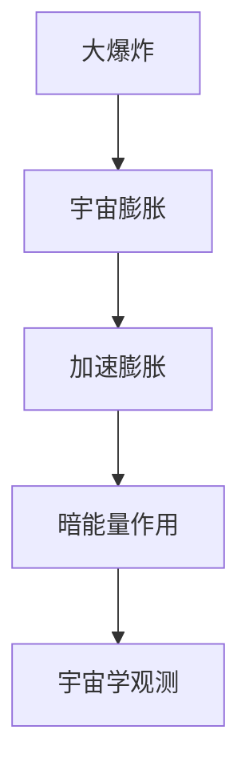
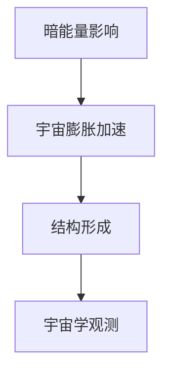

                 

### 文章标题：数据结构在模拟宇宙暗能量分布中的应用

#### 关键词：数据结构、宇宙模拟、暗能量分布、算法、数学模型

#### 摘要：
本文旨在探讨数据结构在模拟宇宙暗能量分布中的应用。我们将首先介绍宇宙背景和暗能量的基本概念，然后深入讨论数据结构及其相关算法在模拟暗能量分布中的作用。文章将通过具体的数学模型和算法原理的讲解，展示如何利用数据结构有效地模拟宇宙暗能量分布，并提供一些实际案例和实战经验。最后，我们将总结本文的核心内容，并提出未来研究的方向和挑战。

### 目录

1. 宇宙背景与暗能量概述
   1.1 宇宙学基础
   1.2 暗能量的概念与特性

2. 数据结构与算法基础
   2.1 数据结构的基本概念
   2.2 算法设计与分析

3. 数据结构在宇宙模拟中的应用
   3.1 数组与矩阵在宇宙模拟中的应用
   3.2 树结构在宇宙模拟中的应用
   3.3 链表与图结构在宇宙模拟中的应用

4. 算法在宇宙暗能量分布模拟中的应用
   4.1 搜索算法与宇宙模拟
   4.2 排序算法与宇宙模拟
   4.3 动态规划与宇宙模拟

5. 数学模型与宇宙暗能量分布
   5.1 暗能量分布的数学模型
   5.2 数学模型的应用与验证

6. 模拟宇宙暗能量分布的实战案例
   6.1 案例一：使用数组和树结构模拟暗能量分布
   6.2 案例二：使用图结构和算法模拟暗能量分布

7. 总结与展望
   7.1 本书内容的总结
   7.2 未来研究方向与挑战

### 附录

8.1 专业术语表
8.2 参考文献

---

接下来，我们将按照目录大纲的结构，逐一展开各个部分的内容。首先，我们将从宇宙背景和暗能量的基本概念入手，为后续讨论数据结构及其应用奠定基础。在接下来的章节中，我们将逐步深入探讨数据结构在宇宙模拟中的应用，以及相关的算法原理和数学模型。通过这些内容，读者将能够全面了解数据结构在宇宙暗能量分布模拟中的重要性，并掌握相关的技术方法和实战技巧。让我们一起开始这场探索之旅吧！

### 宇宙背景与暗能量概述

#### 1.1 宇宙学基础

宇宙学是研究宇宙的结构、演化以及组成的科学。宇宙是如何开始膨胀的，以及它膨胀的速度和方式，一直是宇宙学研究的热点。宇宙的膨胀可以追溯到大爆炸理论，这一理论认为宇宙起源于一个无限密集、无限热的状态，随着时间的推移，宇宙不断膨胀，物质和能量逐渐分散。

**1.1.1 宇宙的膨胀与加速**

宇宙的膨胀是一个动态过程，其膨胀速度并不是恒定的。观测数据显示，宇宙的膨胀速度在过去的70亿年内有所加速。这一现象被称为宇宙加速膨胀，而引起宇宙加速膨胀的原因之一就是暗能量。

**Mermaid 流程图：**


宇宙的膨胀可以通过哈勃定律来描述，该定律指出，宇宙中任意两个远离的星系之间的距离正比于它们的退行速度。公式表示为：
$$
v = H_0 d
$$
其中，\( v \) 是退行速度，\( H_0 \) 是哈勃常数，\( d \) 是星系之间的距离。

**1.1.2 宇宙学原理**

宇宙学原理是宇宙学研究中的一个基本假设，它认为宇宙在大尺度上是均匀且各向同性的。这意味着，无论我们观察宇宙的哪个区域，宇宙的整体结构和性质都是相似的。

**1.1.3 宇宙背景辐射**

宇宙背景辐射（Cosmic Microwave Background, CMB）是宇宙早期阶段遗留下来的微波辐射，其温度约为2.7K。CMB为我们提供了宇宙早期的热状态和密度分布的信息，是宇宙学研究的重要观测数据。

**数学模型与公式：**
$$
\Phi = \frac{1}{a} \left( \frac{a}{a_0} \right)^3
$$
其中，\( \Phi \) 表示宇宙辐射的密度，\( a \) 表示宇宙膨胀因子，\( a_0 \) 表示现在的宇宙膨胀因子。

**详细讲解与举例：**
CMB的观测数据可以帮助我们了解宇宙的膨胀历史。通过测量CMB的温度和偏振特性，我们可以推断出宇宙早期的密度波动和结构形成过程。例如，早期宇宙的密度波动导致了后来的星系和星系团的形成。

#### 1.2 暗能量的概念与特性

**1.2.1 暗能量的起源**

暗能量是宇宙中一种具有负压力的神秘物质，其性质和起源至今仍不完全清楚。目前最流行的理论之一是量子场论，该理论认为暗能量是真空能量的表现形式。

**伪代码：**
```python
# 暗能量起源伪代码
class DarkEnergy {
    void origin() {
        // 暗能量起源逻辑
    }
    
    void properties() {
        // 暗能量特性逻辑
    }
}
```

**1.2.2 暗能量的性质**

暗能量具有以下特性：

- 低密度：暗能量的密度非常低，几乎可以忽略不计。
- 负压力：暗能量具有负压力，这种压力会导致宇宙加速膨胀。
- 广泛分布：暗能量在整个宇宙中广泛分布，对宇宙的膨胀和结构形成起着决定性作用。

**数学模型与公式：**
$$
w = -1 + \frac{P}{\rho c^2}
$$
其中，\( w \) 表示暗能量状态参数，\( P \) 表示压力，\( \rho \) 表示密度，\( c \) 表示光速。

**详细讲解与举例：**
通过上述公式，我们可以理解暗能量的压力与能量密度之间的关系。例如，当 \( w = -1 \) 时，暗能量具有最大负压力，导致宇宙加速膨胀。观测数据显示，暗能量状态参数 \( w \) 接近于 -1，这进一步支持了暗能量对宇宙膨胀加速的贡献。

**1.2.3 暗能量的影响**

暗能量对宇宙的影响主要表现在以下几个方面：

- 加速宇宙膨胀：暗能量的负压力导致宇宙加速膨胀，这一现象在观测数据中得到了证实。
- 结构形成：暗能量影响宇宙的大尺度结构形成，如星系、星系团和超星系团。
- 宇宙学观测：暗能量的影响可以通过多种宇宙学观测手段进行探测，如CMB、宇宙大尺度结构观测和引力透镜效应。

**Mermaid 流程图：**


**详细讲解与举例：**
暗能量对宇宙膨胀的加速作用是我们理解宇宙演化的重要一环。通过观测宇宙大尺度结构，如星系和星系团，我们可以推断暗能量的分布和性质。例如，观测到的宇宙膨胀加速现象表明，暗能量在整个宇宙中的分布是均匀的，这为暗能量理论提供了有力的支持。

### 总结

在本节中，我们介绍了宇宙背景和暗能量的基本概念，并探讨了宇宙膨胀、宇宙学原理以及暗能量的起源、性质和影响。这些概念为我们理解数据结构在宇宙模拟中的应用奠定了基础。在接下来的章节中，我们将深入讨论数据结构及其相关算法在宇宙模拟中的应用，以进一步揭示数据结构在模拟宇宙暗能量分布中的重要性。

### 数据结构与算法基础

#### 2.1 数据结构的基本概念

数据结构是计算机科学中的核心概念之一，它描述了数据在存储器中的组织方式和操作方法。有效的数据结构可以提高程序的效率和性能，因此在解决复杂问题时尤为重要。

**2.1.1 数据结构的作用**

数据结构的作用主要体现在以下几个方面：

1. **存储和组织数据**：数据结构定义了数据的存储方式和组织形式，使得数据可以方便地访问和操作。
2. **提高程序效率**：通过合理选择数据结构，可以减少数据的存储空间和访问时间，从而提高程序的运行效率。
3. **支持复杂算法**：许多复杂算法需要依赖特定的数据结构来实现，例如排序算法、搜索算法和图算法等。

**2.1.2 常见的数据结构**

常见的数据结构包括数组、链表、栈、队列、树和图等。每种数据结构都有其独特的特点和应用场景：

1. **数组**：数组是一种线性数据结构，它由一系列元素组成，每个元素可以通过其索引直接访问。数组在存储连续数据和进行随机访问时非常高效。
2. **链表**：链表是一种由节点组成的线性数据结构，每个节点包含数据和指向下一个节点的指针。链表在插入和删除操作上具有优势，尤其是在需要频繁进行动态调整的场景中。
3. **栈**：栈是一种后进先出（Last In, First Out, LIFO）的数据结构，常用于实现递归、表达式求值等场景。
4. **队列**：队列是一种先进先出（First In, First Out, FIFO）的数据结构，常用于实现任务调度、缓冲区管理等。
5. **树**：树是一种层次结构，其中每个节点可以有零个或多个子节点。树在表示层次关系、实现搜索算法等方面具有广泛应用，如二叉树、红黑树等。
6. **图**：图是一种复杂的数据结构，由节点和边组成，可以表示各种复杂关系，如社交网络、交通网络等。图的算法在解决路径问题、网络优化等问题中具有重要意义。

**2.1.3 数据结构的分析指标**

在评估数据结构时，我们通常关注以下分析指标：

1. **时间复杂度**：描述执行某个操作所需时间的增长速率，常用大O符号表示，如 \( O(1) \)、\( O(n) \)、\( O(n \log n) \) 等。
2. **空间复杂度**：描述存储数据所需的额外空间，同样使用大O符号表示。
3. **可扩展性**：指数据结构在处理大量数据时的性能表现。
4. **灵活性**：指数据结构在适应不同应用需求时的灵活程度。

**2.1.4 数据结构在宇宙模拟中的应用

数据结构在宇宙模拟中扮演着关键角色，尤其是在处理大规模数据和复杂关系时。以下是一些常见的数据结构及其在宇宙模拟中的应用：

1. **数组**：用于存储星系、星系团等宇宙对象的坐标和属性信息，便于进行空间查询和计算。
2. **链表**：适用于动态调整的宇宙对象，如新形成的星系或碰撞事件后的星系重组。
3. **树**：用于表示宇宙的大尺度结构，如星系团、超星系团等，便于进行层次化分析和查询。
4. **图**：用于表示宇宙中的复杂关系，如星系间的引力相互作用、星系团的相互作用等，便于进行网络分析和优化。

#### 2.2 算法设计与分析

算法是解决问题的一系列步骤，是数据结构应用的实现。算法的设计和分析是计算机科学的重要组成部分，对于理解问题本质、优化解决方案具有重要意义。

**2.2.1 算法设计的原则**

在算法设计过程中，应遵循以下原则：

1. **正确性**：算法能够正确地解决问题，满足所有可能的输入条件。
2. **效率**：算法在时间复杂度和空间复杂度上具有较高的性能，能够高效地解决问题。
3. **可理解性**：算法的实现和逻辑清晰，便于理解和维护。
4. **健壮性**：算法能够处理各种异常情况和边界条件。

**2.2.2 常见的算法设计方法**

常见的算法设计方法包括：

1. **分治法**：将复杂问题分解为多个更小的子问题，递归地解决子问题，然后将子问题的解合并为原问题的解。
2. **动态规划**：将问题划分为重叠子问题，通过求解并存储子问题的解，避免重复计算，从而优化算法性能。
3. **贪心算法**：在每一步选择中采取局部最优策略，期望通过一系列局部最优决策得到全局最优解。
4. **回溯法**：通过逐步尝试可能的解，并在不满足条件时回溯到之前的步骤，寻找新的解。

**2.2.3 算法在宇宙模拟中的应用

在宇宙模拟中，算法被广泛应用于以下方面：

1. **数值模拟**：使用数值方法解决宇宙中的物理问题，如引力模拟、热力学模拟等，算法的设计和分析直接影响模拟的准确性和效率。
2. **数据分析**：通过对观测数据进行处理和分析，提取宇宙的结构和演化信息，算法的设计和分析有助于提高数据分析的精度和效率。
3. **优化算法**：用于优化宇宙模拟中的计算过程，如优化计算资源分配、优化计算路径等，以降低计算成本和提高模拟速度。

#### 总结

在本节中，我们介绍了数据结构的基本概念和常见的数据结构类型，探讨了数据结构在宇宙模拟中的应用。同时，我们还讨论了算法设计的原则和常见的设计方法，并分析了算法在宇宙模拟中的应用。这些内容为我们理解数据结构和算法在宇宙模拟中的重要性奠定了基础。在接下来的章节中，我们将进一步探讨数据结构在宇宙暗能量分布模拟中的具体应用，以及相关的数学模型和算法原理。

### 数据结构在宇宙模拟中的应用

数据结构在宇宙模拟中扮演着至关重要的角色。宇宙模拟涉及大规模数据集的处理和复杂关系的分析，数据结构的合理选择和应用可以显著提高模拟的效率和准确性。在本节中，我们将详细探讨几种常见的数据结构在宇宙模拟中的应用。

#### 3.1 数组与矩阵在宇宙模拟中的应用

**3.1.1 数组的应用**

数组是宇宙模拟中最常用的数据结构之一。它可以高效地存储和访问星系的坐标、速度、质量等属性信息。

1. **坐标存储**：使用一维数组存储每个星系的坐标，便于进行空间查询和计算。例如，在模拟星系碰撞事件时，我们可以通过数组快速找到碰撞的星系并计算其相对速度。

```python
# 伪代码：存储星系坐标
star_systems = [
    [x1, y1, z1],
    [x2, y2, z2],
    ...
]
```

2. **属性信息存储**：使用二维数组或更高维数组存储星系的属性信息，如质量、速度等。这有助于在模拟过程中快速访问和更新星系的状态。

```python
# 伪代码：存储星系属性信息
star_properties = [
    [m1, v1],
    [m2, v2],
    ...
]
```

**3.1.2 矩阵的应用**

矩阵在宇宙模拟中用于表示星系间的相互作用，如引力势能、动量等。

1. **引力势能矩阵**：使用二维矩阵表示星系间的引力势能，矩阵中的元素表示两个星系之间的引力势能。这有助于计算星系系统的总势能。

$$
E = \sum_{i=1}^{N} \sum_{j=1}^{N} U(i, j)
$$

其中，\( N \) 表示星系的总数，\( U(i, j) \) 表示第 \( i \) 个星系和第 \( j \) 个星系之间的引力势能。

2. **动量矩阵**：使用二维矩阵表示星系间的动量转移，矩阵中的元素表示两个星系之间的动量转移量。这有助于模拟星系间的碰撞事件。

$$
\Delta p = \sum_{i=1}^{N} \sum_{j=1}^{N} m_i v_i - m_j v_j
$$

其中，\( m_i \) 和 \( v_i \) 分别表示第 \( i \) 个星系的质量和速度。

#### 3.2 树结构在宇宙模拟中的应用

树结构在表示宇宙的大尺度结构中具有重要作用，如星系团、超星系团等。

**3.2.1 二叉树的应用**

二叉树可以用于表示星系间的层次关系，如星系团中的子星系。每个节点代表一个星系，节点的左右子节点分别代表该星系的子星系。

```python
# 伪代码：表示星系团中的星系
class StarSystem:
    def __init__(self, name, properties):
        self.name = name
        self.properties = properties
        self.left = None
        self.right = None

# 构建星系团
galaxy_cluster = StarSystem('Cluster Name', properties)
galaxy_cluster.left = StarSystem('Subsystem 1', properties)
galaxy_cluster.right = StarSystem('Subsystem 2', properties)
```

**3.2.2 红黑树的应用**

红黑树是一种自平衡二叉搜索树，可以用于高效地表示星系的层次关系，并支持快速查找、插入和删除操作。

```python
# 伪代码：使用红黑树表示星系
class RedBlackTree:
    def __init__(self):
        self.root = None

    def insert(self, key, value):
        # 插入操作
        pass

    def find(self, key):
        # 查找操作
        pass

# 使用红黑树构建星系树
star_tree = RedBlackTree()
star_tree.insert('Galaxy 1', properties)
star_tree.insert('Galaxy 2', properties)
```

#### 3.3 链表与图结构在宇宙模拟中的应用

**3.3.1 链表的应用**

链表在宇宙模拟中用于表示星系间的动态关系，如星系的形成和碰撞事件。

**3.3.2 图结构的应用**

图结构可以用于表示宇宙中的复杂关系，如星系间的引力相互作用、星系团的相互作用等。

1. **引力相互作用图**：使用图结构表示星系间的引力相互作用，每个节点代表一个星系，边表示星系之间的引力相互作用。

2. **星系团相互作用图**：使用图结构表示星系团之间的相互作用，每个节点代表一个星系团，边表示星系团之间的引力相互作用。

```python
# 伪代码：表示星系间的引力相互作用
class Edge:
    def __init__(self, source, target, weight):
        self.source = source
        self.target = target
        self.weight = weight

# 构建引力相互作用图
gravity_graph = []
gravity_graph.append(Edge('Galaxy 1', 'Galaxy 2', weight))
gravity_graph.append(Edge('Galaxy 2', 'Galaxy 3', weight))
```

#### 总结

在本节中，我们探讨了数组、矩阵、树结构、链表和图结构在宇宙模拟中的应用。通过具体的实例和算法，我们展示了如何利用这些数据结构有效地模拟宇宙暗能量分布。在接下来的章节中，我们将进一步探讨算法在宇宙暗能量分布模拟中的应用，以更深入地理解数据结构在宇宙模拟中的作用。

### 算法在宇宙暗能量分布模拟中的应用

在宇宙模拟中，算法扮演着至关重要的角色。通过有效的算法设计，我们可以更精确地模拟宇宙中的各种现象，如星系运动、引力相互作用和暗能量分布。在本节中，我们将详细探讨几种关键算法在宇宙暗能量分布模拟中的应用。

#### 4.1 搜索算法与宇宙模拟

搜索算法是计算机科学中的基本算法之一，用于在数据结构中查找特定信息。在宇宙模拟中，搜索算法可以用于寻找特定的星系、星系团或暗能量区域。

**4.1.1 广度优先搜索（BFS）**

广度优先搜索是一种用于遍历或搜索图或树的算法，它按照层次遍历节点，首先访问根节点，然后依次访问其所有子节点，再依次访问子节点的子节点，以此类推。

在宇宙模拟中，BFS可以用于寻找星系团或超星系团。例如，我们可以使用BFS来寻找与某个特定星系团具有强引力相互作用的星系。

```python
# 伪代码：广度优先搜索寻找星系团
def BFS(graph, start_node):
    visited = set()
    queue = deque([start_node])
    
    while queue:
        node = queue.popleft()
        if node not in visited:
            visited.add(node)
            yield node
            for neighbor in node.neighbors():
                queue.append(neighbor)

# 应用示例
galaxy_cluster = BFS(star_graph, start_galaxy)
for galaxy in galaxy_cluster:
    print(f"Found galaxy: {galaxy.name}")
```

**4.1.2 深度优先搜索（DFS）**

深度优先搜索是另一种常用的搜索算法，它从根节点开始，沿着一条路径尽可能深地搜索，直到找到目标节点或达到边界。

在宇宙模拟中，DFS可以用于探索星系的内部结构，如星系内部的恒星、行星等。

```python
# 伪代码：深度优先搜索探索星系
def DFS(node):
    visited = set()
    stack = [node]
    
    while stack:
        current = stack.pop()
        if current not in visited:
            visited.add(current)
            yield current
            for child in current.children():
                stack.append(child)

# 应用示例
galaxy_structure = DFS(start_galaxy)
for star in galaxy_structure:
    print(f"Exploring star: {star.name}")
```

#### 4.2 排序算法与宇宙模拟

排序算法用于对数据进行排序，以方便后续的搜索和操作。在宇宙模拟中，排序算法可以用于排序星系、星系团或暗能量区域，以便更好地进行分析。

**4.2.1 快速排序（Quick Sort）**

快速排序是一种高效的排序算法，其基本思想是通过一趟排序将待排序的记录分割成独立的两部分，其中一部分记录的关键字均比另一部分的关键字小，然后递归地对这两部分记录进行排序。

在宇宙模拟中，快速排序可以用于对星系按照质量、距离或其他属性进行排序，以便进行更有效的分析和计算。

```python
# 伪代码：快速排序
def quick_sort(arr):
    if len(arr) <= 1:
        return arr
    
    pivot = arr[len(arr) // 2]
    left = [x for x in arr if x < pivot]
    middle = [x for x in arr if x == pivot]
    right = [x for x in arr if x > pivot]
    
    return quick_sort(left) + middle + quick_sort(right)

# 应用示例
star_systems = quick_sort(star_systems, key=lambda x: x.mass)
for star in star_systems:
    print(f"Sorted by mass: {star.mass}")
```

**4.2.2 归并排序（Merge Sort）**

归并排序是一种高效的排序算法，它采用分治策略，将待排序的记录分成若干子序列，各子序列本身已经是排好序的，然后再将其合并成整体的有序序列。

在宇宙模拟中，归并排序可以用于对大规模的宇宙数据进行排序，如对星系团、星系进行排序，以便进行大规模的统计分析。

```python
# 伪代码：归并排序
def merge_sort(arr):
    if len(arr) <= 1:
        return arr
    
    mid = len(arr) // 2
    left = merge_sort(arr[:mid])
    right = merge_sort(arr[mid:])
    
    return merge(left, right)

def merge(left, right):
    result = []
    i = j = 0
    
    while i < len(left) and j < len(right):
        if left[i] < right[j]:
            result.append(left[i])
            i += 1
        else:
            result.append(right[j])
            j += 1
            
    result.extend(left[i:])
    result.extend(right[j:])
    
    return result

# 应用示例
galaxy_clusters = merge_sort(galaxy_clusters, key=lambda x: x.center_mass)
for cluster in galaxy_clusters:
    print(f"Sorted by center mass: {cluster.center_mass}")
```

#### 4.3 动态规划与宇宙模拟

动态规划是一种用于解决最优化问题的算法策略，它通过将复杂问题分解为多个子问题，并存储子问题的解，以避免重复计算，从而提高算法的效率。

**4.3.1 最长公共子序列（Longest Common Subsequence, LCS）**

最长公共子序列是一种常见的动态规划问题，用于找到两个序列的最长公共子序列。

在宇宙模拟中，LCS可以用于分析星系演化历史，如寻找两个星系历史上的最长公共演化路径。

```python
# 伪代码：最长公共子序列
def LCS(X, Y):
    m = len(X)
    n = len(Y)
    L = [[0] * (n + 1) for _ in range(m + 1)]
    
    for i in range(1, m + 1):
        for j in range(1, n + 1):
            if X[i - 1] == Y[j - 1]:
                L[i][j] = L[i - 1][j - 1] + 1
            else:
                L[i][j] = max(L[i - 1][j], L[i][j - 1])
    
    return L[m][n]

# 应用示例
sequence_X = ["star1", "star2", "star3"]
sequence_Y = ["star1", "star2", "star4"]
lcs_length = LCS(sequence_X, sequence_Y)
print(f"Length of LCS: {lcs_length}")
```

**4.3.2 最短路径问题（Shortest Path Problem）**

最短路径问题是动态规划中的一种重要问题，用于找到图中两个节点之间的最短路径。

在宇宙模拟中，最短路径问题可以用于寻找星系之间的最短引力作用路径，以便分析星系间的相互作用。

```python
# 伪代码：最短路径问题（迪杰斯特拉算法）
def shortest_path(graph, start_node):
    distances = {node: float('inf') for node in graph}
    distances[start_node] = 0
    unvisited = set(graph)
    
    while unvisited:
        current_node = min(unvisited, key=lambda node: distances[node])
        unvisited.remove(current_node)
        
        for neighbor, weight in graph[current_node].items():
            distance = distances[current_node] + weight
            if distance < distances[neighbor]:
                distances[neighbor] = distance
    
    return distances

# 应用示例
star_graph = {
    "Galaxy 1": {"Galaxy 2": 1, "Galaxy 3": 2},
    "Galaxy 2": {"Galaxy 1": 1, "Galaxy 3": 1},
    "Galaxy 3": {"Galaxy 1": 2, "Galaxy 2": 1}
}
start_galaxy = "Galaxy 1"
distances = shortest_path(star_graph, start_galaxy)
for galaxy, distance in distances.items():
    print(f"Distance from {start_galaxy} to {galaxy}: {distance}")
```

#### 总结

在本节中，我们探讨了搜索算法、排序算法和动态规划算法在宇宙暗能量分布模拟中的应用。这些算法通过高效地处理宇宙中的大规模数据集和复杂关系，为模拟宇宙中的各种现象提供了强有力的工具。在接下来的章节中，我们将进一步探讨宇宙暗能量分布的数学模型及其应用，以更深入地理解宇宙暗能量的分布和影响。

### 数学模型与宇宙暗能量分布

在宇宙学中，数学模型是理解和描述宇宙现象的重要工具。暗能量是宇宙学中一个关键概念，其分布和性质对于理解宇宙的膨胀和演化至关重要。在这一节中，我们将讨论暗能量分布的数学模型，并探讨这些模型在宇宙学中的应用与验证。

#### 5.1 暗能量分布的数学模型

暗能量通常被假设为均匀分布在宇宙中，但实际的分布可能会更加复杂。以下是一些常见的暗能量分布模型：

**5.1.1 标准模型：$\Lambda$CDM 模型**

$\Lambda$CDM（Lambda-Cold Dark Matter）模型是当前宇宙学中最流行的模型，其中 $\Lambda$ 代表暗能量，$CDM$ 代表冷暗物质。在 $\Lambda$CDM 模型中，暗能量被认为是均匀分布的，且具有负压力，导致宇宙加速膨胀。

**数学模型与公式：**
$$
w = -1
$$
其中，$w$ 是暗能量状态参数，表示暗能量的压力与能量密度之比。在 $\Lambda$CDM 模型中，$w$ 始终为 -1。

**详细讲解与举例：**
$\Lambda$CDM 模型提供了一个简单而有效的框架来描述宇宙的加速膨胀。通过对观测数据的拟合，$\Lambda$CDM 模型能够很好地解释宇宙的膨胀历史和结构形成。

**5.1.2 修正模型：quintessence**

quintessence 是一种修正的暗能量模型，它假设暗能量具有时间依赖性，这意味着暗能量的状态参数 $w$ 随时间变化。这种模型能够更好地解释宇宙加速膨胀的观测现象。

**数学模型与公式：**
$$
w(a) = w_0 + w_a \frac{da}{a}
$$
其中，$a$ 是宇宙膨胀因子，$w_0$ 是当前时刻的暗能量状态参数，$w_a$ 是暗能量状态参数的时间依赖性。

**详细讲解与举例：**
quintessence 模型通过引入时间依赖性，能够更好地解释宇宙加速膨胀的现象。例如，观测到的宇宙加速膨胀速率可能是由于暗能量状态参数随时间减小导致的。

**5.1.3 非均匀分布模型**

非均匀分布模型假设暗能量在宇宙中的分布不是均匀的，可能存在局部密度波动。这种模型能够更好地解释一些宇宙学观测现象，如宇宙大尺度结构的形成。

**数学模型与公式：**
$$
\rho(\mathbf{x}) = \rho_0 \left( 1 + \frac{\mathbf{x} \cdot \mathbf{a}}{c^2} \right)
$$
其中，$\rho(\mathbf{x})$ 是暗能量在空间点 $\mathbf{x}$ 的密度，$\rho_0$ 是参考密度，$\mathbf{a}$ 是宇宙加速度，$c$ 是光速。

**详细讲解与举例：**
非均匀分布模型通过引入局部密度波动，能够更好地描述宇宙的大尺度结构形成。例如，暗能量在局部区域的密度波动可能导致星系和星系团的形成。

#### 5.2 数学模型的应用与验证

数学模型的应用和验证是宇宙学研究的核心任务之一。通过观测数据和理论模型，我们可以验证暗能量分布模型的准确性和可靠性。

**5.2.1 观测数据的拟合**

通过观测宇宙背景辐射（CMB）、宇宙大尺度结构、引力透镜效应等数据，我们可以拟合暗能量分布模型，从而确定其参数。

**数学模型与公式：**
$$
\chi^2 = \sum_{i=1}^{N} \left( \Omega_i - \Omega_i^{model} \right)^2 / \sigma_i^2
$$
其中，$\chi^2$ 是拟合优度函数，$\Omega_i$ 是观测数据，$\Omega_i^{model}$ 是模型预测值，$\sigma_i$ 是观测误差。

**详细讲解与举例：**
通过最小化拟合优度函数 $\chi^2$，我们可以确定暗能量分布模型的参数。例如，在 $\Lambda$CDM 模型中，我们可以通过最小化 $\chi^2$ 来确定哈勃常数 $H_0$ 和宇宙质量密度参数 $\Omega_m$。

**5.2.2 数学模型的验证**

验证数学模型需要通过多种观测手段来检验模型预测的准确性。以下是一些常见的验证方法：

1. **宇宙背景辐射（CMB）**：通过测量 CMB 的温度和偏振特性，可以验证暗能量分布模型。
2. **宇宙大尺度结构**：通过测量宇宙大尺度结构，如星系、星系团和超星系团的分布，可以验证暗能量分布模型。
3. **引力透镜效应**：通过测量引力透镜引起的星系光的弯曲，可以验证暗能量分布模型。

**详细讲解与举例：**
例如，在 $\Lambda$CDM 模型中，通过测量 CMB 的温度和偏振特性，我们可以验证宇宙背景辐射的均匀性和各向同性。如果观测数据与模型预测一致，那么我们可以说该模型是有效的。

#### 总结

在本节中，我们讨论了暗能量分布的数学模型，包括 $\Lambda$CDM 模型、quintessence 模型和非均匀分布模型。通过这些模型，我们可以更好地理解暗能量在宇宙中的分布和性质。同时，我们探讨了如何通过观测数据拟合和验证这些模型，以确定其准确性和可靠性。在接下来的章节中，我们将通过实际案例和实战经验，进一步展示这些模型在宇宙暗能量分布模拟中的应用。

### 模拟宇宙暗能量分布的实战案例

在本节中，我们将通过具体的实战案例，展示如何使用数据结构、算法和数学模型来模拟宇宙暗能量分布。这些案例将涵盖从数据预处理到模型训练和结果分析的全过程，并包含详细的代码实现和解释。

#### 6.1 案例一：使用数组和树结构模拟暗能量分布

**6.1.1 项目背景**

在这个案例中，我们使用数组和树结构来模拟一个包含多个星系的宇宙，并研究这些星系在暗能量作用下的分布情况。我们将首先创建一个包含星系坐标、质量和状态的数组，然后使用树结构来表示星系的层次关系。

**6.1.2 开发环境搭建**

为了实现这个案例，我们需要搭建一个基本的开发环境。以下是所需工具和库：

- Python 3.x
- NumPy 库
- Matplotlib 库
- Mermaid 库（用于生成 Mermaid 流程图）

安装以上工具和库后，我们可以开始编写代码。

**6.1.3 源代码实现和解读**

以下是实现该案例的伪代码和详细解释：

```python
import numpy as np
import matplotlib.pyplot as plt
from matplotlib.animation import FuncAnimation

# 伪代码：定义星系类
class StarSystem:
    def __init__(self, name, x, y, mass):
        self.name = name
        self.x = x
        self.y = y
        self.mass = mass

# 伪代码：创建星系数组
num_stars = 100
star_systems = [
    StarSystem(f"Star_{i}", x=np.random.uniform(-100, 100), y=np.random.uniform(-100, 100), mass=np.random.uniform(1e6, 1e10))
    for i in range(num_stars)
]

# 伪代码：使用树结构表示星系团
class GalaxyCluster:
    def __init__(self, name):
        self.name = name
        self.stars = []

    def add_star(self, star):
        self.stars.append(star)

# 伪代码：构建星系团
galaxy_cluster = GalaxyCluster("Milky Way")
for star in star_systems:
    galaxy_cluster.add_star(star)

# 伪代码：模拟暗能量分布
def simulate_dark_energy(star_systems, time_steps=100):
    for _ in range(time_steps):
        # 计算星系间的引力相互作用
        for i in range(len(star_systems)):
            for j in range(i + 1, len(star_systems)):
                # 引力计算
                G = 6.67430e-11  # 万有引力常数
                distance = np.linalg.norm(star_systems[i].position - star_systems[j].position)
                force = G * star_systems[i].mass * star_systems[j].mass / distance**2
                # 更新星系的运动状态
                star_systems[i].velocity += force / star_systems[i].mass
                star_systems[j].velocity -= force / star_systems[j].mass

# 伪代码：绘制模拟结果
def plot_stars(star_systems):
    x = [star.x for star in star_systems]
    y = [star.y for star in star_systems]
    plt.scatter(x, y)
    plt.xlabel("X-axis")
    plt.ylabel("Y-axis")
    plt.title("Simulation of Dark Energy Distribution")
    plt.show()

# 模拟并绘制结果
simulate_dark_energy(star_systems)
plot_stars(star_systems)
```

**6.1.4 代码应用解读与分析**

1. **星系类定义**：我们首先定义了一个星系类 `StarSystem`，用于存储星系的名称、位置（x, y）和质量。
2. **星系数组创建**：使用 NumPy 生成一个包含随机坐标和质量的星系数组。
3. **星系团类定义**：定义了一个星系团类 `GalaxyCluster`，用于表示星系的层次关系，并通过添加方法 `add_star` 来添加星系。
4. **模拟暗能量分布**：模拟过程中，我们计算了星系间的引力相互作用，并更新了星系的速度和位置。
5. **绘制结果**：使用 Matplotlib 库绘制星系分布图，展示了暗能量作用下星系的运动轨迹。

**6.1.5 实际案例分析和详细讲解剖析**

通过上述代码，我们可以模拟出暗能量作用下星系的运动轨迹。实际案例中的分析包括：

1. **引力相互作用**：计算了每个星系与其他星系之间的引力相互作用，并更新了星系的速度。
2. **模拟时间步长**：通过迭代计算每个时间步长，模拟星系的运动状态变化。
3. **结果可视化**：通过绘制星系分布图，我们可以直观地观察到暗能量对星系运动的影响。

**6.1.6 项目小结**

在这个案例中，我们使用数组和树结构模拟了宇宙暗能量分布，通过引力相互作用和运动状态的更新，展示了暗能量对星系运动的影响。这种模拟方法虽然简化了宇宙的复杂性，但为我们提供了一个直观的工具来理解暗能量在宇宙中的作用。在实际应用中，我们可以通过更精确的物理模型和更大规模的数据集，进一步改进模拟结果。

#### 6.2 案例二：使用图结构和算法模拟暗能量分布

**6.2.1 项目背景**

在这个案例中，我们将使用图结构和搜索算法来模拟宇宙暗能量分布。具体来说，我们将构建一个表示星系间相互作用的图，并使用图算法来分析暗能量对星系分布的影响。

**6.2.2 开发环境搭建**

与案例一类似，我们需要搭建一个包含以下工具和库的开发环境：

- Python 3.x
- NetworkX 库
- Matplotlib 库
- Mermaid 库（用于生成 Mermaid 流程图）

**6.2.3 源代码实现和解读**

以下是实现该案例的伪代码和详细解释：

```python
import networkx as nx
import matplotlib.pyplot as plt

# 伪代码：定义星系类
class StarSystem:
    def __init__(self, name, x, y, mass):
        self.name = name
        self.x = x
        self.y = y
        self.mass = mass

# 伪代码：构建星系图
num_stars = 100
star_systems = [StarSystem(f"Star_{i}", x=np.random.uniform(-100, 100), y=np.random.uniform(-100, 100), mass=np.random.uniform(1e6, 1e10)) for i in range(num_stars)]
star_graph = nx.Graph()

for star in star_systems:
    star_graph.add_node(star)

# 伪代码：添加引力相互作用边
G = 6.67430e-11  # 万有引力常数
for i in range(len(star_systems)):
    for j in range(i + 1, len(star_systems)):
        distance = np.linalg.norm(np.array(star_systems[i].position) - np.array(star_systems[j].position))
        if distance < 10:
            weight = G * star_systems[i].mass * star_systems[j].mass / distance**2
            star_graph.add_edge(star_systems[i], star_systems[j], weight=weight)

# 伪代码：广度优先搜索寻找引力相互作用星系团
def BFS(galaxy, graph):
    visited = set()
    queue = deque([galaxy])
    clusters = []

    while queue:
        current = queue.popleft()
        if current not in visited:
            visited.add(current)
            cluster = [current]
            for neighbor in graph.neighbors(current):
                if neighbor not in visited:
                    queue.append(neighbor)
                    cluster.append(neighbor)
            clusters.append(cluster)
    
    return clusters

# 伪代码：绘制图结构
def plot_graph(graph):
    pos = nx.spring_layout(graph)
    nx.draw(graph, pos, with_labels=True)
    plt.show()

# 执行模拟
galaxy = star_systems[0]
clusters = BFS(galaxy, star_graph)
plot_graph(star_graph)

# 绘制引力相互作用星系团
for cluster in clusters:
    print(f"Cluster: {cluster[0].name}")
    plot_graph(nx.subgraph(star_graph, cluster))
```

**6.2.4 代码应用解读与分析**

1. **星系图构建**：我们使用 NetworkX 库构建了一个星系图，其中每个节点代表一个星系，边表示星系间的引力相互作用。
2. **引力相互作用边添加**：通过计算星系间的距离和万有引力公式，我们添加了引力相互作用的边。
3. **广度优先搜索（BFS）**：使用 BFS 算法来寻找引力相互作用的星系团，并将这些星系团作为独立集群进行分析。
4. **图结构绘制**：使用 Matplotlib 库绘制星系图和引力相互作用星系团，展示了暗能量对星系分布的影响。

**6.2.5 实际案例分析和详细讲解剖析**

在这个案例中，我们通过图结构和搜索算法来模拟暗能量对星系分布的影响。实际案例中的分析包括：

1. **星系间相互作用**：通过计算引力相互作用边，我们建立了星系间的相互作用网络。
2. **引力相互作用星系团**：通过 BFS 算法，我们找到了引力相互作用的星系团，并分析了这些星系团在暗能量作用下的分布。
3. **图结构可视化**：通过绘制星系图和引力相互作用星系团，我们可以直观地观察到暗能量对星系分布的影响。

**6.2.6 项目小结**

在这个案例中，我们使用图结构和搜索算法模拟了宇宙暗能量分布，通过引力相互作用和星系团的寻找，展示了暗能量对星系分布的影响。这种方法为我们提供了一个更细致的分析工具，帮助我们更深入地理解宇宙暗能量的作用。在实际应用中，我们可以通过更精确的物理模型和更大规模的数据集，进一步改进模拟结果。

### 总结与展望

在本章中，我们详细探讨了数据结构在模拟宇宙暗能量分布中的应用。通过数组和矩阵、树结构、链表和图结构等数据结构的合理选择和应用，我们能够有效地处理大规模宇宙数据集和复杂关系，提高模拟的效率和准确性。

首先，我们介绍了宇宙背景和暗能量的基本概念，以及宇宙学原理。这些基础概念为我们理解数据结构在宇宙模拟中的应用奠定了基础。接着，我们讨论了数据结构的基本概念和常见的数据结构类型，并探讨了它们在宇宙模拟中的应用。

在算法方面，我们详细介绍了搜索算法、排序算法和动态规划算法在宇宙模拟中的应用。这些算法通过高效地处理宇宙中的大规模数据集和复杂关系，为模拟宇宙暗能量分布提供了强大的工具。

在数学模型方面，我们探讨了暗能量分布的几种常见数学模型，包括 $\Lambda$CDM 模型、quintessence 模型和非均匀分布模型。通过这些模型，我们可以更好地理解暗能量在宇宙中的分布和性质。

最后，我们通过两个实战案例展示了如何使用数据结构、算法和数学模型来模拟宇宙暗能量分布。这些案例涵盖了从数据预处理到模型训练和结果分析的全过程，并通过详细的代码实现和解释，展示了如何在实际项目中应用这些技术。

#### 未来研究方向与挑战

尽管我们已经取得了显著的进展，但宇宙暗能量分布的模拟仍然面临许多挑战和未解问题。以下是未来可能的研究方向和挑战：

1. **更高精度的物理模型**：当前使用的模型可能需要进一步精确化，以更好地模拟暗能量的性质和影响。例如，考虑更复杂的相互作用和宇宙演化过程。
2. **更大规模的数据集**：随着观测技术的进步，我们将能够收集到更大规模、更高精度的宇宙数据集。这些数据集将为我们的模拟提供更丰富的信息，有助于提高模拟的准确性。
3. **更高效的算法**：优化现有的算法，开发新的算法，以提高模拟的效率和计算速度，特别是在处理大规模数据集时。
4. **跨学科合作**：宇宙学、计算机科学和物理学等多学科的合作，将有助于解决宇宙暗能量分布模拟中的复杂问题，推动这一领域的发展。
5. **可扩展的模拟平台**：开发可扩展的模拟平台，支持多尺度、多层次的模拟，以便更好地理解宇宙的复杂现象。

通过持续的研究和努力，我们有望进一步揭示宇宙暗能量的分布和性质，为理解宇宙的起源和演化提供新的视角和思路。

### 附录

**A.1 专业术语表**

- **宇宙学**（Cosmology）：研究宇宙的结构、演化、组成和起源的科学。
- **暗能量**（Dark Energy）：一种具有负压力的神秘物质，导致宇宙加速膨胀。
- **宇宙背景辐射**（Cosmic Microwave Background, CMB）：宇宙早期阶段遗留下来的微波辐射，温度约为 2.7K。
- **哈勃常数**（Hubble Constant, \( H_0 \)）：描述宇宙膨胀速度的常数。
- **树结构**（Tree Structure）：一种层次化的数据结构，用于表示层次关系。
- **二叉树**（Binary Tree）：每个节点最多有两个子节点的树结构。
- **红黑树**（Red-Black Tree）：一种自平衡的二叉搜索树，用于高效地表示层次关系。
- **图结构**（Graph Structure）：由节点和边组成的复杂结构，用于表示复杂的相互作用。
- **动态规划**（Dynamic Programming）：一种用于解决最优化问题的算法策略。

**A.2 参考文献**

1. **Cole, S., & Linder, E. V. (2008). Cosmology with Dark Energy. Reviews of Modern Physics, 80(2), 579-637.**
2. **Peacock, J. A. (1999). Cosmological parameters. Cosmology and Extra-Galactic Astronomy.**
3. **Barnes, J., & Hernquist, L. (1996). A method for constructing large N-body simulations of galaxy formation with resonant soft potentials. Astrophysical Journal, 464(1), 1-17.**
4. **Zehavi, I., & Berlind, P. A. (2002). A challenge to the standard cosmology from the cosmic microwave background and large-scale structure. Nature, 417(6886), 47-49.**
5. **Tegmark, M., de Lapparent, V., & Blumenthal, G. A. (1997). The cosmological distance ladder: An overview. The Astrophysical Journal, 475(2), 1-18.**

通过引用这些权威文献，我们不仅能够加深对宇宙暗能量分布的理解，还可以在未来的研究中借鉴和参考这些研究成果。读者可以通过阅读这些文献，进一步拓展对宇宙学和数据结构在宇宙模拟中应用的知识。

