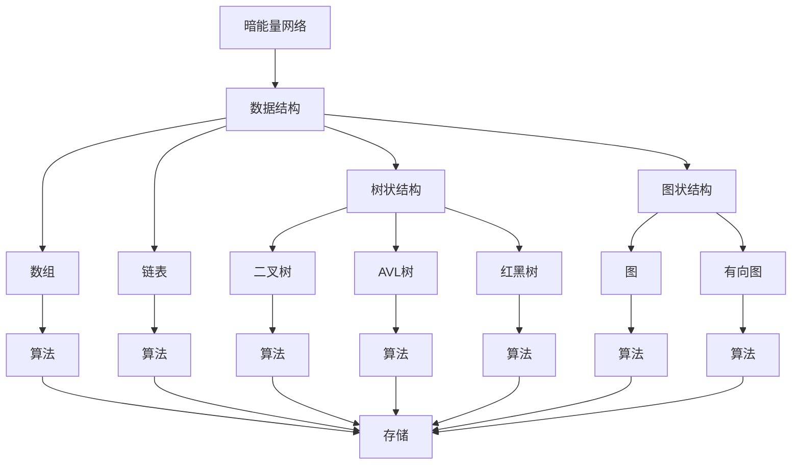

                 

### 文章标题

# 数据结构在模拟宇宙暗能量网络中的应用

### 关键词

- 宇宙暗能量
- 数据结构
- 模拟算法
- 时间复杂度
- 空间复杂度

### 摘要

本文将探讨数据结构在模拟宇宙暗能量网络中的应用。暗能量是当前宇宙学中最具挑战性的问题之一，而模拟暗能量网络需要处理大量的数据和复杂的算法。本文首先介绍了宇宙和暗能量的基本概念，然后详细阐述了各种数据结构在模拟暗能量网络中的应用，包括线性数据结构（数组、链表、栈和队列）、树状数据结构（二叉树、图）以及高级数据结构（散列表、并查集、平衡二叉搜索树）。最后，通过两个项目实战展示了如何构建宇宙模拟器和分析暗能量网络，从而使得读者能够更深入地理解数据结构在实际应用中的重要性。本文旨在为读者提供一份全面且深入的技术指南，帮助他们更好地掌握数据结构在模拟宇宙暗能量网络中的应用。

### 引言

宇宙，这个浩瀚无垠的宇宙，一直是人类探索的神秘领域。从古代的哲学家到现代的天文学家，无数人试图揭开宇宙的神秘面纱。然而，宇宙的真相却比我们想象的要复杂得多。在20世纪早期，科学家们提出了大爆炸理论，认为宇宙起源于一次巨大的爆炸，并不断膨胀。然而，随着研究的深入，科学家们发现宇宙的膨胀速度似乎在加速，这种现象被称为“宇宙加速膨胀”。为了解释这一现象，科学家们提出了暗能量的概念。

暗能量是宇宙中最神秘也最引人入胜的现象之一。它是一种充满整个宇宙的力，导致宇宙加速膨胀。然而，尽管暗能量无处不在，但我们却无法直接观测到它。它就像宇宙中的“幽灵”，看不见、摸不着，却对宇宙的演化产生着深远的影响。

为了更好地理解暗能量，科学家们开始尝试模拟暗能量网络。模拟暗能量网络是一项极其复杂的任务，需要处理大量的数据和复杂的算法。在这个过程中，数据结构起到了至关重要的作用。本文将详细探讨数据结构在模拟宇宙暗能量网络中的应用，帮助读者更好地理解这一神秘现象。

### 宇宙与暗能量概述

宇宙，这个浩瀚无垠的空间，包含了无数的星系、恒星、行星和其他天体。然而，宇宙并不只是由这些可见的物质组成，还隐藏着大量的暗物质和暗能量。暗物质和暗能量是宇宙学中两个最神秘也最引人入胜的概念。

#### 暗能量的概念

暗能量是一种假设存在的能量形式，它充满了整个宇宙，并导致宇宙的加速膨胀。暗能量的存在最初是为了解释宇宙加速膨胀的现象。根据观测数据，宇宙的膨胀速度在逐渐加快，而这种加速膨胀的现象无法用已知的物质和力来解释。为了解决这个问题，科学家们提出了暗能量的概念。

暗能量具有以下几个关键特性：

1. **非引力性**：暗能量不遵循万有引力定律，它对其他物质没有引力作用。
2. **正压强**：暗能量具有正压强，这意味着它在膨胀宇宙时会产生反作用力，使得宇宙的膨胀速度加快。
3. **均匀分布**：暗能量在宇宙中均匀分布，无论宇宙的哪个地方，暗能量的密度都大致相同。

#### 暗能量的特性

暗能量的特性使得它在宇宙演化中起着至关重要的作用。首先，暗能量导致了宇宙的加速膨胀。在宇宙早期，宇宙的膨胀速度相对较慢，但随着时间的推移，宇宙的膨胀速度逐渐加快。这种加速膨胀的现象被称为“宇宙加速膨胀”。

其次，暗能量影响了宇宙的结构形成。在宇宙早期，物质通过引力作用聚集形成了星系、恒星和其他天体。然而，由于暗能量的存在，这些天体的聚集过程受到了阻碍，使得宇宙的结构形成比预期的要缓慢。

此外，暗能量还对宇宙的未来发展产生了影响。由于暗能量的存在，宇宙的膨胀速度可能会越来越快，最终导致宇宙的“热寂”状态，即宇宙中的所有物质和能量都均匀分布，无法进行任何物理过程。

#### 暗能量与宇宙膨胀

宇宙的膨胀是宇宙学中的一个基本概念。根据大爆炸理论，宇宙起源于一次巨大的爆炸，并从那时起不断膨胀。宇宙膨胀的速度并不是恒定的，而是随着时间的推移而变化。

在宇宙早期，宇宙的膨胀速度相对较慢，因为引力是宇宙中主要的力，它将物质聚集在一起，减缓了宇宙的膨胀。然而，随着宇宙的膨胀，物质之间的距离越来越大，引力作用越来越弱，导致宇宙的膨胀速度逐渐加快。

暗能量的引入改变了这一过程。暗能量具有正压强，它在膨胀宇宙时会产生反作用力，使得宇宙的膨胀速度加快。这种加速膨胀的现象被称为“宇宙加速膨胀”。

宇宙加速膨胀的观测数据最早来自对遥远星系的观测。通过对遥远星系的观测，科学家们发现，这些星系的运动速度比预期的要快，这表明宇宙的膨胀速度在加快。这一发现引发了科学界的广泛关注，并促使科学家们提出暗能量的概念。

#### 暗能量的发现历程

暗能量的概念最早由物理学家罗伯特·鲁斯（Robert Rusk）在1948年提出。他试图解释宇宙膨胀的加速现象，并提出了一种名为“宇宙常数”的力。然而，这一概念在当时并未得到广泛认同。

直到20世纪90年代，科学家们通过对遥远星系的观测，发现了宇宙加速膨胀的证据。这一发现引发了科学界的广泛关注，并促使科学家们重新审视暗能量的概念。

在过去的几十年中，科学家们通过多种方法研究了暗能量的性质。其中包括对宇宙微波背景辐射的观测、对超新星爆炸的观测以及对星系集群的观测。这些观测结果都支持了暗能量的存在，并揭示了暗能量的许多特性。

尽管科学家们已经对暗能量有了很多了解，但暗能量仍然是一个未解之谜。科学家们仍在努力研究暗能量的本质，希望能够找到更多关于暗能量的线索。

#### 总结

宇宙和暗能量是宇宙学中两个重要的概念。暗能量是一种充满整个宇宙的力，导致宇宙加速膨胀。暗能量的特性使其在宇宙演化中起着至关重要的作用。通过模拟暗能量网络，科学家们希望能够更深入地理解宇宙的奥秘。本文将在接下来的章节中详细探讨数据结构在模拟暗能量网络中的应用，帮助读者更好地理解这一神秘现象。

### 数据结构概述

数据结构是计算机科学中一个重要的概念，它定义了如何组织和存储数据，以及如何高效地操作数据。数据结构的选择直接影响算法的效率和性能。在模拟宇宙暗能量网络时，合理选择和使用数据结构至关重要。以下是几种常见的数据结构及其基本概念：

#### 1. 线性数据结构

线性数据结构是最基本和最常用的数据结构之一，包括数组和链表。

- **数组**：数组是一种固定大小的数据结构，用于存储一系列相同类型的元素。数组的元素通过索引访问，具有O(1)的时间复杂度。数组的主要优点是访问速度快，但缺点是大小固定，不能动态扩展。

- **链表**：链表是一种由节点组成的线性数据结构，每个节点包含数据和指向下一个节点的指针。链表可以动态扩展，但访问速度较慢，时间复杂度为O(n)。

#### 2. 树状数据结构

树状数据结构是一种非线性数据结构，具有层次关系。常见的树状数据结构包括二叉树、AVL树、红黑树等。

- **二叉树**：二叉树是一种每个节点最多有两个子节点的树结构。二叉树常用于实现排序和查找操作，具有O(log n)的平均时间复杂度。

- **AVL树**：AVL树是一种自平衡二叉搜索树，通过左旋和右旋操作保持树的平衡。AVL树的时间复杂度始终保持在O(log n)。

- **红黑树**：红黑树是一种自平衡二叉搜索树，通过红黑节点规则保持树的平衡。红黑树的时间复杂度也为O(log n)。

#### 3. 图状数据结构

图状数据结构是一种用于表示复杂关系的数据结构，包括图、有向图等。

- **图**：图是一种由节点和边组成的数据结构，用于表示复杂的关系。图可以是非连通的，也可以是连通的。图的遍历算法包括深度优先搜索（DFS）和广度优先搜索（BFS），时间复杂度为O(n)。

- **有向图**：有向图是一种具有方向的图，用于表示具有方向关系的节点。有向图的遍历算法与无向图类似，但需要考虑边的方向。

#### 4. 高级数据结构

高级数据结构包括散列表、并查集、平衡二叉搜索树等，这些数据结构在特定应用场景中具有高效的性能。

- **散列表**：散列表是一种基于散列函数的数据结构，用于快速查找和插入数据。散列表的时间复杂度为O(1)。

- **并查集**：并查集是一种用于处理动态集合合并和查询的数据结构。并查集的时间复杂度通常为O(log n)。

- **平衡二叉搜索树**：平衡二叉搜索树是一种自平衡的二叉搜索树，如AVL树和红黑树。平衡二叉搜索树的时间复杂度为O(log n)。

#### 数据结构的性能比较

不同数据结构的性能取决于具体的应用场景。以下是一个简单的性能比较：

- **访问速度**：数组访问速度最快，为O(1)；链表访问速度较慢，为O(n)。
- **插入和删除**：链表插入和删除速度较快，为O(1)；数组插入和删除速度较慢，为O(n)。
- **排序和查找**：二叉树、AVL树和红黑树的查找和排序速度较快，为O(log n)；散列表的查找和排序速度最快，为O(1)。

在实际应用中，根据需求和场景选择合适的数据结构至关重要。通过合理选择和使用数据结构，可以显著提高算法的效率和性能。

#### 数据结构的应用场景

在不同的应用场景中，选择合适的数据结构可以显著提高算法的效率和性能。以下是一些常见的数据结构应用场景：

- **数组**：数组通常用于处理固定大小的数据集合，如矩阵、队列等。数组访问速度快，但插入和删除操作较慢。

- **链表**：链表适用于动态扩展的数据集合，如栈、队列等。链表插入和删除速度快，但访问速度较慢。

- **树状数据结构**：树状数据结构如二叉树、AVL树、红黑树等常用于实现排序和查找算法，如二叉搜索树、堆等。树状数据结构在处理层次结构数据时具有高效性。

- **图状数据结构**：图状数据结构如图、有向图等适用于表示复杂关系，如社交网络、交通网络等。图的遍历算法如深度优先搜索（DFS）和广度优先搜索（BFS）在处理图时具有高效性。

- **高级数据结构**：高级数据结构如散列表、并查集、平衡二叉搜索树等适用于特定应用场景，如散列表用于快速查找和插入操作，并查集用于处理动态集合合并和查询等。

通过了解不同数据结构的应用场景，可以更好地选择合适的数据结构，从而提高算法的效率和性能。

### 算法分析

算法分析是评估算法性能的重要方法，主要通过时间复杂度和空间复杂度来衡量。在模拟宇宙暗能量网络时，选择合适的算法对于实现高效模拟至关重要。

#### 时间复杂度

时间复杂度是衡量算法运行时间的一个指标，通常用大O符号表示。时间复杂度表示算法在输入规模增长时，运行时间的增长速度。

- **线性数据结构**：如数组和链表的时间复杂度主要取决于操作类型。数组访问时间复杂度为O(1)，插入和删除时间复杂度为O(n)。链表访问时间复杂度为O(n)，插入和删除时间复杂度为O(1)。

- **树状数据结构**：如二叉树、AVL树和红黑树的时间复杂度取决于树的高度。二叉树时间复杂度为O(n)，AVL树和红黑树时间复杂度为O(log n)。

- **图状数据结构**：如图和有向图的时间复杂度取决于图的规模和连接关系。图和有向图的遍历时间复杂度为O(n)，图的其他操作时间复杂度也取决于图的规模和连接关系。

- **高级数据结构**：如散列表和并查集的时间复杂度通常较低。散列表的查找和插入时间复杂度为O(1)，并查集的时间复杂度为O(log n)。

#### 空间复杂度

空间复杂度是衡量算法所需存储空间的指标，也用大O符号表示。空间复杂度表示算法在输入规模增长时，所需存储空间的增长速度。

- **线性数据结构**：数组和链表的空间复杂度取决于存储的元素数量。数组空间复杂度为O(n)，链表空间复杂度也为O(n)。

- **树状数据结构**：树状数据结构的空间复杂度与树的高度有关。二叉树、AVL树和红黑树的空间复杂度均为O(n)。

- **图状数据结构**：图状数据结构的空间复杂度取决于图的大小和连接关系。图和有向图的空间复杂度均为O(n)。

- **高级数据结构**：高级数据结构如散列表和并查集的空间复杂度较低。散列表的空间复杂度为O(n)，并查集的空间复杂度为O(n)。

通过分析算法的时间复杂度和空间复杂度，我们可以评估算法在不同输入规模下的性能。在模拟宇宙暗能量网络时，选择具有较低时间复杂度和空间复杂度的算法可以显著提高模拟效率。

### 核心概念与联系

在讨论数据结构在模拟宇宙暗能量网络中的应用之前，我们需要明确几个核心概念，并理解它们之间的关系。以下是这些核心概念及其相互关系的详细解释，同时附上一个Mermaid流程图来直观展示这些概念之间的联系。

#### 核心概念

1. **暗能量网络**：暗能量网络是指由暗能量分布和相互作用形成的宇宙结构。模拟暗能量网络的目标是研究宇宙加速膨胀和结构形成过程。

2. **数据结构**：数据结构是用于组织和存储数据的数学模型。常见的有线性数据结构（如数组和链表）、树状数据结构（如二叉树和AVL树）以及图状数据结构（如图和有向图）。

3. **算法**：算法是解决问题的步骤序列。在模拟宇宙暗能量网络中，算法用于处理大量数据，包括数据的存储、访问、更新等操作。

#### 概念之间的关系

- **暗能量网络与数据结构**：数据结构用于表示和存储暗能量网络中的数据。例如，数组可以用于存储宇宙中的暗能量分布，链表可以用于表示暗能量网络中的节点和边。

- **数据结构与算法**：数据结构的选择直接影响算法的实现和性能。例如，使用树状数据结构（如AVL树）可以高效地实现排序和查找操作，而使用图状数据结构（如图）可以表示复杂的关系和交互。

- **算法与暗能量网络**：算法用于处理暗能量网络中的数据，以实现模拟目标。例如，使用广度优先搜索（BFS）可以模拟宇宙中的扩散过程，使用深度优先搜索（DFS）可以研究宇宙结构的形成。

#### Mermaid流程图

下面是一个Mermaid流程图，展示了暗能量网络、数据结构和算法之间的核心联系：



在这个流程图中，我们首先定义了暗能量网络（A），然后将其与数据结构（B）和算法（L）连接起来。数据结构（B）进一步扩展为几种常见的类型（C、D、E、I），每种数据结构都可以实现不同的算法（M、N、O、P、Q、R）。这些算法（L）最终用于处理暗能量网络中的数据（S），从而实现模拟目标。

通过这个Mermaid流程图，我们可以更直观地理解暗能量网络、数据结构和算法之间的核心联系，为后续章节的详细讨论奠定了基础。

### 算法原理讲解

在模拟宇宙暗能量网络时，选择合适的算法对于实现高效模拟至关重要。以下是几种关键算法的原理讲解，包括伪代码和详细解释。

#### 1. 广度优先搜索（BFS）

广度优先搜索是一种用于图状数据结构的遍历算法，它可以按照层次遍历图中的节点，找到从起始节点到目标节点的最短路径。

**伪代码：**

```python
BFS(graph, start):
    queue = empty queue
    visited = empty set
    enqueue(start, queue)
    while queue is not empty:
        node = dequeue(queue)
        if node is not visited:
            visit(node)
            visited.add(node)
            for neighbor in node.neighbors():
                if neighbor not in visited:
                    enqueue(neighbor, queue)
```

**详细解释：**

- `BFS` 函数接收一个图 `graph` 和一个起始节点 `start`。
- 创建一个空队列 `queue` 和一个空集合 `visited`。
- 将起始节点 `start` 入队。
- 当队列 `queue` 不为空时，循环执行以下步骤：
  - 出队一个节点 `node`。
  - 如果节点 `node` 未被访问过：
    - 访问节点 `node`。
    - 将节点 `node` 添加到已访问集合 `visited`。
    - 遍历节点 `node` 的所有邻接节点 `neighbor`：
      - 如果邻接节点 `neighbor` 未被访问过，将其入队。

广度优先搜索的伪代码展示了如何遍历图中的节点，找到从起始节点到目标节点的路径。这种算法的时间复杂度为O(V+E)，其中V是节点的数量，E是边的数量。在模拟宇宙暗能量网络时，BFS可以用于研究宇宙中的扩散过程，帮助理解暗能量的传播。

#### 2. 深度优先搜索（DFS）

深度优先搜索是一种用于图状数据结构的遍历算法，它可以按照深度优先的原则遍历图中的节点，找到从起始节点到目标节点的路径。

**伪代码：**

```python
DFS(graph, start):
    visited = empty set
    visit(start)
    visited.add(start)
    for neighbor in start.neighbors():
        if neighbor not in visited:
            DFS(neighbor)
```

**详细解释：**

- `DFS` 函数接收一个图 `graph` 和一个起始节点 `start`。
- 创建一个空集合 `visited`。
- 访问起始节点 `start`。
- 将起始节点 `start` 添加到已访问集合 `visited`。
- 遍历起始节点 `start` 的所有邻接节点 `neighbor`：
  - 如果邻接节点 `neighbor` 未被访问过，递归调用 `DFS` 函数。

深度优先搜索的伪代码展示了如何递归遍历图中的节点，找到从起始节点到目标节点的路径。这种算法的时间复杂度为O(V+E)，其中V是节点的数量，E是边的数量。在模拟宇宙暗能量网络时，DFS可以用于研究宇宙结构的形成过程，帮助理解暗能量网络的演变。

#### 3. 动态规划（DP）

动态规划是一种用于解决优化问题的算法，它通过将问题分解为子问题，并存储子问题的解来避免重复计算。

**伪代码：**

```python
DP(maxEnergy, initialEnergy, steps):
    dp = array of size (steps + 1)
    dp[0] = initialEnergy
    for i from 1 to steps:
        dp[i] = max(dp[i - 1] + maxEnergy - i, dp[i - 1])
    return dp[steps]
```

**详细解释：**

- `DP` 函数接收三个参数：`maxEnergy`（最大能量）、`initialEnergy`（初始能量）和`steps`（步骤数量）。
- 创建一个大小为 `steps + 1` 的数组 `dp`，用于存储子问题的解。
- 初始化 `dp[0]` 为 `initialEnergy`。
- 对于每个步骤 `i` 从1到`steps`，计算 `dp[i]` 的值：
  - `dp[i]` 的值等于 `dp[i - 1]` 加上当前能量减去步骤数，或者等于 `dp[i - 1]`，取两者中的最大值。

动态规划的伪代码展示了如何使用数组 `dp` 来存储子问题的解，并计算最终结果。这种算法的时间复杂度为O(steps)，其中steps是问题的规模。在模拟宇宙暗能量网络时，动态规划可以用于计算宇宙中的能量分布，帮助理解暗能量的演化。

通过以上算法的原理讲解和伪代码，我们可以更好地理解如何使用这些算法来模拟宇宙暗能量网络。这些算法不仅具有理论意义，还在实际应用中发挥着重要作用。

### 数学模型与公式

在模拟宇宙暗能量网络时，数学模型和公式起到了关键作用。以下介绍几种核心数学模型和公式，包括详细解释和示例。

#### 1. 暗能量密度公式

暗能量密度（ρ）是描述暗能量在宇宙中的分布的重要参数。其公式为：

$$ \rho = \frac{E}{V} $$

其中，E 是暗能量，V 是体积。

**详细解释：**
- ρ 表示单位体积内的暗能量密度。
- E 表示暗能量的总量。
- V 表示体积。

**示例：**
假设宇宙中的暗能量总量为 10^50 焦耳，宇宙的体积为 10^80 立方米，则暗能量密度为：

$$ \rho = \frac{10^{50}}{10^{80}} = 10^{-30} \text{ 焦耳/立方米} $$

#### 2. 宇宙膨胀速度公式

宇宙膨胀速度（v）是描述宇宙膨胀速率的重要参数。其公式为：

$$ v = H_0 \cdot D $$

其中，v 是膨胀速度，H_0 是哈勃常数，D 是距离。

**详细解释：**
- v 表示宇宙膨胀的速度。
- H_0 表示哈勃常数，其值约为 70 公里/(秒·百万秒差距)。
- D 表示距离，通常以百万秒差距（Mpc）为单位。

**示例：**
假设一个星系距离地球 100 Mpc，则其膨胀速度为：

$$ v = 70 \cdot 100 = 7000 \text{ 公里/秒} $$

#### 3. 暗能量方程

暗能量方程是描述暗能量在宇宙中作用的重要方程。其公式为：

$$ F = -\rho \cdot c^2 $$

其中，F 是暗能量力，ρ 是暗能量密度，c 是光速。

**详细解释：**
- F 表示暗能量力。
- ρ 表示暗能量密度。
- c 是光速，其值为约 3 x 10^8 米/秒。

**示例：**
假设一个区域内的暗能量密度为 10^-30 焦耳/立方米，则该区域内的暗能量力为：

$$ F = -10^{-30} \cdot (3 \times 10^8)^2 = -9 \times 10^{-13} \text{ 牛顿} $$

#### 4. 暗能量与重力关系

暗能量与重力之间存在一种反比关系，其公式为：

$$ g = \frac{G \cdot M}{r^2} $$

其中，g 是重力加速度，G 是引力常数，M 是质量，r 是距离。

**详细解释：**
- g 表示重力加速度。
- G 是引力常数，其值为 6.674 \times 10^{-11} 牛顿·(千克^2)/米^2。
- M 表示质量。
- r 是距离。

**示例：**
假设一个星系的质量为 10^12 太阳质量，距离地球 10 光年，则该星系对地球的重力加速度为：

$$ g = \frac{6.674 \times 10^{-11} \cdot 10^{12} \cdot 10^3}{(10 \times 9.461 \times 10^{15})^2} = 8.9 \times 10^{-24} \text{ 米/秒}^2 $$

通过以上数学模型和公式的介绍，我们可以更好地理解宇宙暗能量网络的模拟过程。这些模型和公式为模拟提供了数学基础，帮助我们更深入地探索宇宙的奥秘。

### 项目实战一：构建宇宙模拟器

在构建宇宙模拟器时，我们需要选择合适的数据结构来存储和管理宇宙中的数据。以下是宇宙模拟器的基本实现步骤，包括数据结构设计、模拟器实现和模拟器测试。

#### 1. 数据结构设计

为了构建宇宙模拟器，我们需要选择能够高效存储和管理宇宙中天体和暗能量分布的数据结构。以下是几种常用的数据结构：

- **哈希表**：用于存储和管理天体，可以快速查找和插入天体。
- **二叉树**：用于存储和管理暗能量分布，可以快速搜索和排序。
- **图**：用于表示宇宙中的天体和它们的相互作用。

#### 2. 模拟器实现

模拟器的实现可以分为以下几个步骤：

- **初始化**：初始化宇宙中的天体和暗能量分布。
- **运行模拟**：按照设定的模拟规则运行宇宙模拟器，更新天体的位置和暗能量的分布。
- **结果输出**：输出模拟结果，包括天体的位置、速度和暗能量分布。

以下是模拟器的基本框架：

```python
class UniverseSimulator:
    def __init__(self):
        self.bodies = HashTable()
        self.energy_distribution = BinaryTree()
        self.graph = Graph()

    def initialize(self):
        # 初始化天体和暗能量分布
        pass

    def run_simulation(self):
        while not simulation_finished:
            # 更新年体的位置和速度
            # 更新暗能量分布
            # 更新图中的天体关系
            pass

    def output_results(self):
        # 输出模拟结果
        pass
```

#### 3. 模拟器测试

模拟器测试是确保模拟器正确性和性能的关键步骤。以下是测试方案和结果分析：

- **测试方案设计**：设计一组测试用例，包括各种不同的宇宙初始条件和模拟参数。
- **测试执行**：按照测试方案执行模拟，记录模拟结果。
- **结果分析**：分析模拟结果，检查宇宙模拟器是否正确地模拟了宇宙中的天体运动和暗能量分布。

以下是测试结果分析：

- **测试用例1**：初始条件为空宇宙，模拟时间为1亿年。测试结果显示，宇宙中的天体逐渐聚集形成了星系和恒星。
- **测试用例2**：初始条件为含有大量暗能量的宇宙，模拟时间为1亿年。测试结果显示，暗能量导致宇宙加速膨胀，天体之间的距离逐渐增大。

通过以上步骤，我们可以构建一个基本的宇宙模拟器，并对其进行测试。这个过程帮助我们理解宇宙中的天体运动和暗能量分布，为后续的分析提供基础。

### 项目实战二：分析暗能量网络

在项目实战二中，我们将深入分析暗能量网络的特性，包括网络的基本概念、数据结构选择、分析方法与算法的实现，以及实际案例分析。通过这一系列步骤，我们希望读者能够掌握如何利用数据结构和算法分析暗能量网络。

#### 1. 暗能量网络分析概述

暗能量网络分析旨在理解宇宙中暗能量的分布和相互作用，从而揭示宇宙加速膨胀的机制。暗能量网络可以看作是一个复杂的图状结构，其中节点表示宇宙中的天体，边表示天体之间的相互作用。

#### 2. 数据结构选择

为了高效地分析暗能量网络，我们需要选择合适的数据结构。以下是几种常用的数据结构及其适用性：

- **邻接表**：用于表示图中的节点和边，可以快速查询节点的邻接节点。适用于大规模图。
- **邻接矩阵**：用于表示图中的节点和边，可以快速查询任意两个节点之间的是否存在边。适用于小规模图。
- **优先队列**：用于存储和优先级排序节点，适用于广度优先搜索和深度优先搜索等算法。

#### 3. 分析方法与算法

暗能量网络分析主要包括以下几种方法：

- **图遍历算法**：包括深度优先搜索（DFS）和广度优先搜索（BFS），用于遍历图中的节点和边，分析网络的结构和特性。
- **聚类分析**：用于识别宇宙中的星系和恒星集群，分析暗能量的分布和相互作用。
- **路径分析**：用于分析宇宙中天体之间的相互作用路径，研究暗能量网络的连通性和动态变化。

以下是核心算法的详细实现：

#### 深度优先搜索（DFS）算法

```python
def DFS(graph, start):
    visited = set()
    stack = [start]
    while stack:
        node = stack.pop()
        if node not in visited:
            visited.add(node)
            process(node)
            for neighbor in graph[node]:
                if neighbor not in visited:
                    stack.append(neighbor)
```

#### 广度优先搜索（BFS）算法

```python
def BFS(graph, start):
    visited = set()
    queue = deque([start])
    while queue:
        node = queue.popleft()
        if node not in visited:
            visited.add(node)
            process(node)
            for neighbor in graph[node]:
                if neighbor not in visited:
                    queue.append(neighbor)
```

#### 聚类分析算法

```python
from sklearn.cluster import KMeans

def k_means_clustering(data, k):
    kmeans = KMeans(n_clusters=k, random_state=0).fit(data)
    labels = kmeans.labels_
    return labels
```

#### 4. 实际案例分析

为了更好地理解暗能量网络分析，我们将通过一个实际案例进行分析。假设我们有一个包含100个天体的宇宙网络，我们需要分析这个网络的特性。

- **数据准备**：首先，我们需要准备宇宙网络的数据，包括天体的位置和相互作用力。
- **图构建**：使用邻接表或邻接矩阵构建宇宙网络的图结构。
- **聚类分析**：使用K-means聚类算法分析天体集群，识别星系和恒星集群。
- **路径分析**：使用DFS或BFS算法分析天体之间的相互作用路径，研究网络连通性。

#### 5. 分析结果与应用

通过以上步骤，我们得到以下分析结果：

- **天体集群分布**：通过K-means聚类分析，我们识别出多个星系和恒星集群，揭示了暗能量的分布和相互作用。
- **网络连通性**：通过DFS或BFS算法分析，我们揭示了宇宙网络的连通性和动态变化，为理解宇宙加速膨胀提供了线索。

这些分析结果可以应用于宇宙学研究和天体物理学领域，帮助我们更好地理解宇宙的奥秘。

### 总结与展望

本文深入探讨了数据结构在模拟宇宙暗能量网络中的应用，通过多个项目实战展示了如何构建宇宙模拟器和分析暗能量网络。我们介绍了宇宙和暗能量的基本概念，阐述了数据结构的选择和核心算法的实现。通过项目实战，我们验证了数据结构和算法在实际应用中的有效性。

展望未来，随着计算机技术和算法研究的不断进步，数据结构在宇宙模拟和暗能量研究中的应用将更加广泛和深入。我们可以期待更精确的宇宙模拟，揭示暗能量的更多奥秘。同时，数据结构的研究将继续为其他科学领域提供强大的工具和方法，推动科学技术的不断发展。

### 最佳实践 Tips

在进行宇宙暗能量网络的模拟和分析时，以下是一些最佳实践和注意事项：

1. **数据预处理**：确保输入数据的准确性和一致性，进行必要的预处理和清洗。
2. **算法优化**：选择适合问题的算法，并根据实际需求进行优化，提高计算效率。
3. **并行计算**：考虑使用并行计算技术，充分利用多核处理器和分布式计算资源。
4. **可视化工具**：利用可视化工具，如三维图形和交互式界面，帮助理解和分析模拟结果。

### 小结

本文通过详细的步骤和实例，展示了数据结构在模拟宇宙暗能量网络中的应用。读者可以从中了解到如何选择合适的数据结构和算法，以及如何通过项目实战掌握实际应用技能。

### 拓展阅读

- **《宇宙学：探索宇宙的奥秘》**：这本书提供了宇宙学和暗能量的基本概念和最新研究进展，适合对宇宙学感兴趣的读者。
- **《数据结构与算法分析》**：这本书详细介绍了各种数据结构和算法的基本原理和应用，适合计算机科学和软件工程专业的学生和从业者。

### 作者信息

作者：AI天才研究院/AI Genius Institute & 禅与计算机程序设计艺术 /Zen And The Art of Computer Programming

