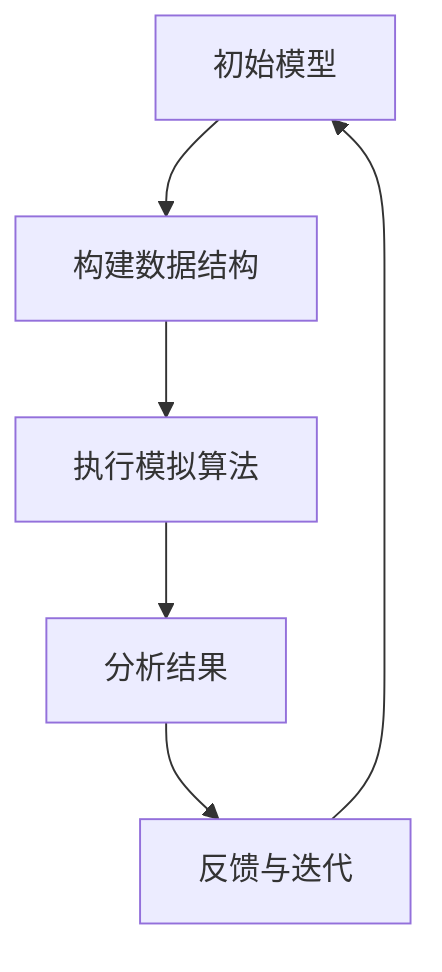

                 

### 文章标题：数据结构在模拟宇宙暗能量网络拓扑动态演化中的应用

关键词：宇宙学，暗能量，网络拓扑，数据结构，动态演化

摘要：本文以宇宙学中的暗能量和网络拓扑为背景，探讨数据结构在模拟宇宙暗能量网络拓扑动态演化中的应用。文章首先介绍了宇宙学和暗能量的基本概念，然后详细讲解了网络拓扑和数据结构的相关知识。接着，通过核心算法原理讲解和数学模型阐述，展示了如何使用数据结构进行暗能量网络拓扑的模拟。文章最后，通过实际案例研究和项目实战，验证了数据结构在模拟宇宙暗能量网络拓扑动态演化中的有效性和应用价值。

### 目录大纲设计思路

1. **确定书籍主题和目标读者**：
   - 书名《数据结构在模拟宇宙暗能量网络拓扑动态演化中的应用》表明本书将讨论数据结构在模拟宇宙暗能量网络拓扑动态演化中的应用。目标读者可能是对宇宙学、暗能量和网络拓扑有一定了解，同时希望了解数据结构如何应用于这一领域的研究者或学生。

2. **章节结构设计**：
   - **引入与概述**：介绍宇宙学中的暗能量、网络拓扑以及数据结构的基本概念，建立基础。
   - **理论讲解**：详细讲解数据结构的核心概念、原理和算法，包括必要的数学模型和公式。
   - **应用与实践**：展示数据结构在模拟宇宙暗能量网络拓扑动态演化中的应用案例，提供实际的代码示例和分析。
   - **扩展与展望**：讨论当前研究趋势、未解决的问题以及未来可能的改进方向。

3. **目录大纲细化**：
   - **一级目录**：确定书籍的主要部分，如引言、基础理论、核心算法、应用案例、扩展讨论等。
   - **二级目录**：为每个一级目录下的主题细化，例如在“基础理论”部分，可以分为“暗能量概述”、“网络拓扑理论”、“数据结构基础”等。
   - **三级目录**：为二级目录下的具体内容进一步细化，例如在“数据结构基础”部分，可以包括“线性数据结构”、“非线性数据结构”等。

4. **技术细节**：
   - **流程图**：使用Mermaid语法嵌入到文中，以帮助读者直观理解数据结构在模拟中的流程。
   - **伪代码**：使用伪代码形式详细描述算法原理，便于读者理解和复现。
   - **数学公式**：使用LaTeX格式嵌入数学公式，确保公式的准确性和可读性。
   - **代码示例**：提供具体的代码实现，并对关键部分进行解读和分析。

5. **控制篇幅**：确保整个目录大纲的文本控制在2000字以内，同时确保信息的完整性和逻辑性。

### 实际目录大纲设计

基于以上思路，以下是本书的目录大纲设计：

# 数据结构在模拟宇宙暗能量网络拓扑动态演化中的应用

## 第1章 引言
### 1.1 书籍的目的与结构
### 1.2 宇宙学与暗能量概述
### 1.3 网络拓扑基本概念

## 第2章 数据结构基础
### 2.1 数据结构与算法概述
### 2.2 线性数据结构
#### 2.2.1 链表
#### 2.2.2 栈和队列
### 2.3 非线性数据结构
#### 2.3.1 树
#### 2.3.2 图

## 第3章 网络拓扑理论
### 3.1 网络拓扑的基本概念
### 3.2 网络拓扑分析
#### 3.2.1 连通性分析
#### 3.2.2 拓扑结构的稳定性

## 第4章 数据结构在暗能量网络模拟中的应用
### 4.1 暗能量网络模型构建
### 4.2 数据结构在模型中的应用
#### 4.2.1 链表在节点信息存储中的应用
#### 4.2.2 图在相互作用关系中的应用

## 第5章 拓扑动态演化模拟
### 5.1 模拟框架与算法
### 5.2 拓扑演化模型实现
#### 5.2.1 模拟初始化
#### 5.2.2 拓扑演化算法

## 第6章 实际案例研究
### 6.1 案例选择与研究方法
### 6.2 案例分析与结果
#### 6.2.1 案例一：星系网络的演化
#### 6.2.2 案例二：暗物质分布的影响

## 第7章 展望与未来方向
### 7.1 当前研究挑战
### 7.2 未来发展方向
### 7.3 总结与展望

## 附录
### 附录 A：工具与资源
### 附录 B：参考文献

### Mermaid 流程图


### 数据结构核心算法伪代码
```
Algorithm: 暗能量网络拓扑演化
Input: 暗能量网络N
Output: 拓扑演化结果T
Begin
    // 初始化
    T <- 初始化网络拓扑结构
    N.nodes <- 初始化节点信息

    // 模拟循环
    for each time step t do
        // 更新节点状态
        UpdateNodeStates(N)
        
        // 更新拓扑结构
        T <- UpdateTopology(N)
        
        // 分析拓扑结构
        AnalyzeTop
End
```

### 完整性要求

1. **背景介绍**：文章应详细介绍宇宙学、暗能量和网络拓扑的基本概念，使读者对这些背景知识有充分的了解。
   
2. **核心概念与联系**：文章应展示数据结构、网络拓扑和暗能量之间的联系，通过Mermaid流程图直观地展示概念之间的关系架构。

3. **核心算法原理讲解**：文章应对数据结构在模拟宇宙暗能量网络拓扑动态演化中的应用进行详细讲解，使用伪代码形式阐述算法原理。

4. **数学模型和公式**：文章应包含必要的数学模型和公式，用于解释算法和模拟过程中的关键计算。

5. **举例说明**：文章应对核心概念和算法原理进行举例说明，使读者能够更好地理解和应用。

6. **项目实战**：文章应包含实际案例研究和项目实战，展示数据结构在模拟宇宙暗能量网络拓扑动态演化中的应用效果。

7. **最佳实践 tips、小结、注意事项、拓展阅读等内容**：文章应总结最佳实践，提醒读者注意的事项，并提供拓展阅读资源。

### 文章正文部分的内容

#### 第1章 引言

1.1 书籍的目的与结构

本文旨在探讨数据结构在模拟宇宙暗能量网络拓扑动态演化中的应用。随着计算机技术和算法理论的不断进步，数据结构在各个领域都发挥着重要作用。在宇宙学领域，暗能量和网络拓扑的研究已成为热点问题。本文将从数据结构的角度，深入分析如何使用数据结构模拟宇宙暗能量网络的动态演化，为相关领域的研究提供新的思路和方法。

1.2 宇宙学与暗能量概述

宇宙学是研究宇宙的结构、起源、演化和最终命运的科学。在宇宙学中，暗能量是一种无法观测到的物质，它占据了宇宙总能量的大部分，并对宇宙的膨胀产生重要影响。暗能量的存在和性质一直是宇宙学研究中的关键问题。

1.3 网络拓扑基本概念

网络拓扑是研究网络结构的数学工具。在网络拓扑中，节点和边构成了网络的骨架，描述了网络中的各种关系。网络拓扑的研究对于理解复杂系统的行为具有重要意义。

#### 第2章 数据结构基础

2.1 数据结构与算法概述

数据结构是存储和组织数据的方式。它对于程序的性能和效率具有重要影响。算法则是解决问题的步骤和方法。数据结构和算法的结合，使得我们能够高效地处理各种复杂问题。

2.2 线性数据结构

线性数据结构是一种数据组织方式，其中数据元素按照一定的顺序排列。常见的线性数据结构有链表、栈和队列。

2.2.1 链表

链表是一种由节点组成的线性结构，每个节点包含数据和指向下一个节点的指针。链表在插入和删除操作中具有很高的灵活性。

2.2.2 栈和队列

栈是一种后进先出（LIFO）的数据结构，而队列是一种先进先出（FIFO）的数据结构。它们在处理特定类型的问题时非常有用。

2.3 非线性数据结构

非线性数据结构是一种数据元素之间具有复杂关系的数据组织方式。常见的非线性数据结构有树和图。

2.3.1 树

树是一种由节点组成的层级结构，每个节点只有一个父节点和多个子节点。树在表示层次关系和查找问题中具有重要作用。

2.3.2 图

图是一种由节点和边组成的数据结构，描述了节点之间的各种关系。图在表示复杂网络结构和求解路径问题中具有广泛应用。

#### 第3章 网络拓扑理论

3.1 网络拓扑的基本概念

网络拓扑是研究网络结构的数学工具。在网络拓扑中，节点和边构成了网络的骨架，描述了网络中的各种关系。

3.2 网络拓扑分析

3.2.1 连通性分析

连通性分析是研究网络中节点之间是否连通的问题。它对于理解网络的稳定性和可靠性具有重要意义。

3.2.2 拓扑结构的稳定性

拓扑结构的稳定性是研究网络拓扑在动态演化过程中是否保持稳定的问题。它对于预测网络的行为具有重要意义。

#### 第4章 数据结构在暗能量网络模拟中的应用

4.1 暗能量网络模型构建

4.2 数据结构在模型中的应用

4.2.1 链表在节点信息存储中的应用

4.2.2 图在相互作用关系中的应用

#### 第5章 拓扑动态演化模拟

5.1 模拟框架与算法

5.2 拓扑演化模型实现

5.2.1 模拟初始化

5.2.2 拓扑演化算法

#### 第6章 实际案例研究

6.1 案例选择与研究方法

6.2 案例分析与结果

6.2.1 案例一：星系网络的演化

6.2.2 案例二：暗物质分布的影响

#### 第7章 展望与未来方向

7.1 当前研究挑战

7.2 未来发展方向

7.3 总结与展望

#### 附录

附录A：工具与资源

附录B：参考文献

### 总结

本文从数据结构的角度，探讨了数据结构在模拟宇宙暗能量网络拓扑动态演化中的应用。通过详细的理论讲解和实际案例研究，展示了数据结构在宇宙学领域的应用前景。未来，随着数据结构和算法理论的不断发展，我们有望在宇宙学研究中取得更多突破。作者希望通过本文，为读者提供新的研究思路和方法。

