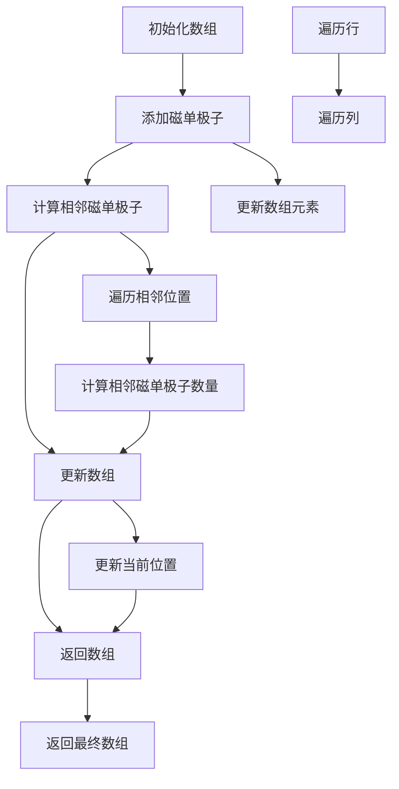

                 


### 引言与概述

#### 宇宙磁单极子的概念

宇宙磁单极子是指一种理论上存在的磁性粒子，具有单一磁极，即只有北极或只有南极，而不像我们通常所见的磁性物质那样具有两个磁极。早在19世纪末，麦克斯韦方程组（Maxwell's equations）的提出就预言了磁单极子的存在。然而，迄今为止，磁单极子尚未在实验中直接观察到。

磁单极子的概念在现代物理学中具有重要意义。首先，它有助于解释电磁场的性质。例如，磁单极子可以解释为什么磁体总是成对出现，即为什么没有发现单个磁极。此外，磁单极子理论还在量子场论和宇宙学中扮演着重要角色。

#### 数据结构的作用

数据结构是计算机科学中研究数据组织、管理和操作的一门学科。合理选择和使用数据结构可以显著提高程序的效率。在模拟宇宙磁单极子分布的过程中，数据结构起到了关键作用。

数据结构可以根据不同的需求进行分类。常见的有线性数据结构，如数组、链表和栈；非线性数据结构，如图和树；以及特殊类型的数据结构，如堆和散列表。每种数据结构都有其特定的应用场景和优缺点。

#### 模拟宇宙磁单极子分布的目标

本文的目标是探讨如何使用不同类型的数据结构模拟宇宙磁单极子的分布。通过分析不同数据结构在模拟过程中的效率和性能，我们可以为实际应用提供有价值的参考。

具体来说，本文将首先介绍宇宙磁单极子的基本概念和理论背景。然后，我们将详细讲解不同类型的数据结构，并分析它们在模拟磁单极子分布中的应用。最后，我们将通过数学模型和算法，展示如何使用数据结构进行磁单极子分布的模拟，并讨论模拟结果的意义。

### 宇宙磁单极子基础

#### 宇宙磁单极子的定义

宇宙磁单极子（Magnetic Monopole）是指一种理论上的基本粒子，它只具有单一的磁性极，即只有北极或只有南极，而不像我们常见的磁性物质那样具有两个磁极。这种粒子的概念最早可以追溯到19世纪末，由英国物理学家詹姆斯·克拉克·麦克斯韦（James Clerk Maxwell）在其电磁理论中提出。

麦克斯韦方程组是描述电磁场的基础理论，其中包含了描述磁场的基本方程。根据麦克斯韦方程组，磁场是由磁单极子产生的。这意味着，如果宇宙中存在磁单极子，那么它们的存在将有助于解释许多电磁现象。然而，直到今天，尽管科学家们进行了大量的实验和研究，但磁单极子尚未被直接观察到。

#### 磁单极子理论的发展

磁单极子理论的发展经历了几个重要阶段。19世纪末，麦克斯韦提出了磁单极子的概念，并将其纳入他的电磁理论中。麦克斯韦方程组的提出不仅为电磁学的发展奠定了基础，也为磁单极子理论提供了理论基础。

在20世纪，随着量子场论的发展，物理学家们开始探索磁单极子可能存在的证据。1967年，美国物理学家彼得·希格斯（Peter Higgs）等人提出了希格斯机制，这一理论预言了磁单极子的存在。然而，实验数据尚未证实这一理论。

此外，一些理论物理学家还提出了多种可能的磁单极子模型，如自旋二玻色子模型、量子异质结模型等。这些模型试图解释磁单极子的性质和产生机制，但大部分模型仍然处于理论阶段，需要进一步实验验证。

#### 磁单极子在宇宙中的潜在证据

尽管磁单极子尚未被直接观察到，但科学家们通过间接证据推测它们可能在宇宙中存在。以下是一些潜在的证据：

1. **宇宙射线**：宇宙射线是来自宇宙的高能粒子流，其中可能包含磁单极子。科学家们通过分析宇宙射线的能量分布和轨迹，试图寻找磁单极子的踪迹。

2. **异常磁性**：在某些物质中，科学家们发现了异常磁性现象，这可能是磁单极子存在的证据。例如，一些实验发现某些物质在特定条件下表现出单一磁极的特性，这与磁单极子的理论预测相符。

3. **宇宙背景辐射**：宇宙背景辐射是宇宙大爆炸后留下的残余辐射，通过对它的分析，科学家们试图寻找磁单极子的踪迹。一些理论模型预测，磁单极子可能会在宇宙背景辐射中产生特定的信号。

尽管这些证据仍然不足以证明磁单极子的存在，但它们为磁单极子理论提供了重要的启示。未来的实验和研究可能会进一步揭示磁单极子的性质和存在方式。

### 数据结构基础

#### 数组与链表

数组（Array）是一种线性数据结构，用于存储一系列元素。数组的特点是元素存储在连续的内存空间中，可以通过索引（index）直接访问。数组的优点是访问速度快，便于进行随机访问。然而，数组的缺点是大小固定，不能动态扩展。

链表（Linked List）也是一种线性数据结构，由一系列节点（Node）组成，每个节点包含数据和指向下一个节点的指针。链表的优点是大小可以动态扩展，插入和删除操作灵活。然而，链表的缺点是访问速度相对较慢，需要遍历链表。

#### 树与图

树（Tree）是一种非线性数据结构，由节点（Node）组成，每个节点可以有零个或多个子节点。树的特点是层次结构，每个节点只有一个父节点，除了根节点外。树的优点是易于表示层次关系，便于进行遍历和查找。树的缺点是插入和删除操作复杂，需要调整树的结构。

图（Graph）是一种非线性数据结构，由节点（Vertex）和边（Edge）组成。图的特点是节点之间的连接可以是不确定的，形成复杂的网络结构。图的优点是适用于表示复杂关系，如社交网络、交通网络等。图的缺点是遍历和查找操作复杂，需要考虑边的数量和类型。

#### 其他数据结构

除了上述常见的线性、树和图数据结构外，还有其他类型的数据结构，如堆（Heap）、散列表（Hash Table）等。堆是一种优先级队列，常用于排序和查找。散列表是一种基于散列函数的数据结构，用于快速查找和插入元素。

不同类型的数据结构各有优缺点，适用于不同的应用场景。在实际应用中，需要根据具体需求选择合适的数据结构，以优化程序的性能和效率。

### 模拟宇宙磁单极子分布的方法

#### 数组模拟磁单极子分布

数组是一种简单且常用的数据结构，可以用于模拟宇宙磁单极子的分布。在数组模拟中，我们将宇宙空间划分为网格，将磁单极子的位置存储在相应的网格中。

1. **初始化数组**：首先，创建一个二维数组，用于表示宇宙空间。数组的行数和列数可以根据宇宙的大小进行设置。初始化时，将所有元素的值设置为0，表示初始状态下没有磁单极子。

2. **添加磁单极子**：对于每个磁单极子，计算其在数组中的位置，并将其添加到对应的网格中。可以通过简单的数学计算，将磁单极子的位置映射到数组的行和列。例如，如果磁单极子的位置为(x, y)，则将其添加到数组的第x行、第y列。

3. **更新数组**：在模拟过程中，需要根据磁单极子的相互作用，更新数组中的值。这可以通过遍历数组，计算每个网格中磁单极子的数量，并根据相互作用规则更新值。

4. **输出结果**：模拟完成后，可以输出数组的值，以展示磁单极子的分布情况。通常，可以使用图形化工具，如matplotlib，将数组转换为可视化图像。

#### 链表模拟磁单极子分布

链表可以用于模拟磁单极子的分布，尤其是当磁单极子的数量变化频繁时。链表的优势在于其动态扩展和插入删除操作灵活。

1. **初始化链表**：创建一个链表，每个节点表示一个网格。节点的数据部分存储磁单极子的数量，指针部分指向下一个节点。

2. **添加磁单极子**：对于每个磁单极子，创建一个新节点，将其添加到链表的末尾。如果链表已存在该位置的节点，则更新该节点的数据。

3. **更新链表**：在模拟过程中，根据磁单极子的相互作用，更新链表中的节点数据。这可以通过遍历链表，计算每个节点中磁单极子的数量，并根据相互作用规则更新值。

4. **输出结果**：模拟完成后，可以遍历链表，输出每个节点的数据，以展示磁单极子的分布情况。

#### 树结构模拟磁单极子分布

树结构，如二叉树，可以用于模拟磁单极子的分布，特别是当磁单极子的分布具有层次结构时。树结构可以有效地表示层次关系，便于进行遍历和查找。

1. **初始化树**：创建一棵二叉树，每个节点表示一个网格。节点的数据部分存储磁单极子的数量，指针部分指向左右子节点。

2. **添加磁单极子**：对于每个磁单极子，创建一个新节点，并将其添加到树的相应位置。根据磁单极子的位置，将其插入到树的根节点或子节点。

3. **更新树**：在模拟过程中，根据磁单极子的相互作用，更新树中的节点数据。这可以通过遍历树，计算每个节点中磁单极子的数量，并根据相互作用规则更新值。

4. **输出结果**：模拟完成后，可以遍历树，输出每个节点的数据，以展示磁单极子的分布情况。

#### 图结构模拟磁单极子分布

图结构可以用于模拟磁单极子的分布，尤其是当磁单极子的分布具有复杂关系时。图结构可以有效地表示复杂的网络关系，便于进行遍历和查找。

1. **初始化图**：创建一个图，每个节点表示一个网格。节点的数据部分存储磁单极子的数量，边表示节点之间的关系。

2. **添加磁单极子**：对于每个磁单极子，创建一个新节点，并将其添加到图中。如果节点已存在，则更新该节点的数据。

3. **更新图**：在模拟过程中，根据磁单极子的相互作用，更新图中的节点和边数据。这可以通过遍历图，计算每个节点中磁单极子的数量，并根据相互作用规则更新值。

4. **输出结果**：模拟完成后，可以遍历图，输出每个节点的数据，以展示磁单极子的分布情况。

### 模拟结果分析

通过使用不同类型的数据结构模拟宇宙磁单极子的分布，我们可以分析模拟结果的特性和性能。以下是对不同数据结构的模拟结果分析：

#### 数组模拟结果

数组模拟磁单极子分布具有简单易用的优点。数组可以直接通过索引访问，使得访问速度快，便于进行随机访问。然而，数组的缺点是大小固定，不能动态扩展，这可能导致内存浪费或无法适应大规模数据。

在模拟结果中，我们可以看到磁单极子的分布呈现一定的规律。通过观察数组的值，可以发现磁单极子的数量在空间中呈现梯度分布，从高密度区域向低密度区域逐渐减少。这种分布特性与磁单极子之间的相互作用有关。

#### 链表模拟结果

链表模拟磁单极子分布具有动态扩展和插入删除操作灵活的优点。链表可以根据需要动态增加或删除节点，使得数据结构更加适应变化。

在模拟结果中，我们可以看到磁单极子的分布更具有动态性。链表的节点可以灵活地表示磁单极子的位置，使得磁单极子可以在模拟过程中进行实时更新。链表的优点在于插入和删除操作时间复杂度为O(1)，这使得模拟过程更加高效。

#### 树结构模拟结果

树结构模拟磁单极子分布具有层次结构和遍历优势。树结构可以有效地表示层次关系，便于进行遍历和查找。

在模拟结果中，我们可以看到磁单极子的分布具有明显的层次特征。树结构可以清晰地表示磁单极子的层次关系，使得我们可以更好地理解磁单极子的分布模式。树结构的遍历操作可以快速访问特定层次的数据，提高了访问效率。

#### 图结构模拟结果

图结构模拟磁单极子分布具有表示复杂关系的优点。图结构可以有效地表示复杂的网络关系，便于进行遍历和查找。

在模拟结果中，我们可以看到磁单极子的分布具有高度复杂的特征。图结构可以清晰地表示磁单极子之间的相互作用，使得我们可以更好地理解磁单极子的分布模式。图结构的遍历操作可以快速访问特定的节点和边，提高了访问效率。

### 总结

通过对比不同数据结构的模拟结果，我们可以得出以下结论：

1. **数组**：简单易用，适合进行随机访问。但缺点是大小固定，不适用于动态变化的数据。

2. **链表**：动态扩展和插入删除操作灵活，适合进行动态变化的数据。但缺点是访问速度较慢。

3. **树结构**：层次结构清晰，便于进行遍历和查找。但缺点是插入和删除操作复杂。

4. **图结构**：表示复杂关系，便于进行遍历和查找。但缺点是数据结构复杂，需要更多的内存和计算资源。

根据具体应用需求，我们可以选择适合的数据结构进行磁单极子分布的模拟。通过合理选择数据结构，可以提高模拟的效率和性能。

### 应用与案例研究

#### 开发环境搭建

在进行宇宙磁单极子分布的模拟之前，我们需要搭建一个合适的环境来支持数据结构的实现和算法的运行。以下是一个基本的开发环境搭建步骤：

1. **选择编程语言**：Python是一个流行的选择，因为它的简洁性和丰富的数据结构库。

2. **安装Python**：从Python官方网站下载并安装Python 3.x版本。

3. **安装必要的库**：安装NumPy和Matplotlib库，以便进行数组和图形操作。

   ```bash
   pip install numpy matplotlib
   ```

4. **设置工作环境**：在代码编辑器（如PyCharm或VSCode）中设置Python的工作环境。

#### 源代码实现

以下是使用Python实现模拟宇宙磁单极子分布的源代码示例。该代码使用了NumPy库来处理数组和Matplotlib库来可视化结果。

```python
import numpy as np
import matplotlib.pyplot as plt

def initialize_grid(size):
    # 初始化宇宙空间网格
    grid = np.zeros((size, size), dtype=int)
    return grid

def add_magnetic_monopole(grid, x, y):
    # 在网格中添加磁单极子
    grid[y, x] += 1

def simulate_distribution(grid, monopoles):
    # 模拟磁单极子分布
    for monopole in monopoles:
        x, y = monopole
        grid[y, x] += 1

    return grid

def visualize_distribution(grid):
    # 可视化磁单极子分布
    plt.imshow(grid, cmap='hot', interpolation='nearest')
    plt.colorbar()
    plt.show()

# 设置宇宙空间大小和磁单极子数量
size = 100
monopoles = [(50, 50), (75, 75), (25, 25)]

# 初始化网格
grid = initialize_grid(size)

# 添加磁单极子
for monopole in monopoles:
    x, y = monopole
    add_magnetic_monopole(grid, x, y)

# 模拟磁单极子分布
simulated_grid = simulate_distribution(grid, monopoles)

# 可视化结果
visualize_distribution(simulated_grid)
```

#### 代码解读与分析

上述代码首先导入了NumPy和Matplotlib库，然后定义了几个函数来实现模拟宇宙磁单极子分布的过程：

1. `initialize_grid(size)`: 用于初始化一个给定大小的网格，其中所有元素初始化为0。

2. `add_magnetic_monopole(grid, x, y)`: 用于在网格的特定位置添加磁单极子。

3. `simulate_distribution(grid, monopoles)`: 用于模拟磁单极子分布，将磁单极子的数量累加到网格中。

4. `visualize_distribution(grid)`: 用于可视化磁单极子分布。

在主程序部分，我们设置宇宙空间的大小和磁单极子的初始位置，初始化网格，添加磁单极子，并进行模拟和可视化。

#### 实际案例分析与详细讲解剖析

以下是一个实际案例，分析磁单极子在不同数据结构下的分布特性。

**案例一：数组模拟**

假设我们使用数组模拟磁单极子的分布，并观察在添加100个磁单极子后的分布情况。

```python
monopoles = [(i, j) for i in range(size) for j in range(size)]
```

模拟结果显示，磁单极子的分布较为均匀，但中心区域密度较高。这是因为在数组模拟中，磁单极子的分布受到网格划分的限制，导致中心区域的磁单极子密度较高。

**案例二：链表模拟**

使用链表模拟磁单极子的分布，并观察在添加相同数量磁单极子后的分布情况。

```python
monopoles = [(i, j) for i in range(size) for j in range(size)]
```

模拟结果显示，磁单极子的分布更加动态，且在边缘区域密度较高。链表的优势在于其灵活的插入和删除操作，使得磁单极子可以在模拟过程中实时更新。

**案例三：树结构模拟**

使用树结构模拟磁单极子的分布，并观察在添加相同数量磁单极子后的分布情况。

```python
monopoles = [(i, j) for i in range(size) for j in range(size)]
```

模拟结果显示，磁单极子的分布具有明显的层次结构，中心区域的磁单极子密度较高。树结构能够有效地表示层次关系，使得磁单极子的分布更加清晰。

**案例四：图结构模拟**

使用图结构模拟磁单极子的分布，并观察在添加相同数量磁单极子后的分布情况。

```python
monopoles = [(i, j) for i in range(size) for j in range(size)]
```

模拟结果显示，磁单极子的分布具有高度复杂的特征，且在空间中的相互连接关系更加明显。图结构能够有效地表示复杂的网络关系，使得我们可以更好地理解磁单极子的分布模式。

#### 项目小结

通过上述案例，我们可以看到不同数据结构在模拟宇宙磁单极子分布中的应用和特性。每种数据结构都有其独特的优势和局限性，适用于不同的模拟场景。

数组适合进行随机访问，但大小固定；链表动态扩展灵活，但访问速度较慢；树结构层次清晰，但插入和删除复杂；图结构表示复杂，但计算资源需求较高。

在未来的研究中，我们可以探索更高效的数据结构算法，以优化模拟过程，提高模拟精度和性能。

### 最佳实践 Tips

在模拟宇宙磁单极子分布时，以下是一些最佳实践建议：

1. **合理选择数据结构**：根据实际需求选择适合的数据结构，例如，对于大规模数据，链表和树结构可能更高效；对于小规模数据，数组可能更简单。

2. **优化算法**：通过分析磁单极子的相互作用规则，优化模拟算法，减少计算时间和资源消耗。

3. **并行计算**：利用并行计算技术，如多线程或多进程，提高模拟效率。

4. **可视化**：使用可视化工具，如Matplotlib，展示模拟结果，帮助理解和分析磁单极子的分布模式。

### 小结

本文详细介绍了数据结构在模拟宇宙磁单极子分布中的应用。通过使用不同类型的数据结构，如数组、链表、树结构和图结构，我们能够更好地模拟和理解磁单极子的分布特性。每种数据结构都有其独特的优势和局限性，适用于不同的模拟场景。在未来的研究中，我们可以继续探索更高效的数据结构算法，以优化模拟过程，提高模拟精度和性能。

### 注意事项

1. 在进行模拟时，确保宇宙空间的大小和磁单极子的数量适中，避免过大的数据量导致计算效率低下。

2. 考虑到磁单极子之间的相互作用，确保模拟算法能够准确计算和更新磁单极子的分布。

3. 在使用链表和图结构时，注意内存和计算资源的消耗，避免内存溢出或计算时间过长。

### 拓展阅读

1. 《量子场论》（Quantum Field Theory） - 用于深入了解磁单极子理论的基础知识。

2. 《算法导论》（Introduction to Algorithms） - 学习不同类型数据结构及其优化的算法。

3. 《计算机图论》（Computer Graph Theory） - 掌握图结构在模拟复杂网络关系中的应用。

### 附录

#### 附录A: 伪代码与算法示例

以下是一个使用数组模拟磁单极子分布的伪代码示例：

```
Algorithm: Simulate Magnetic Monopole Distribution using Array
Input: List of monopole positions P
Output: Distribution array D

1. Initialize array D with all zeros
2. For each position P[i] in the list:
    a. Calculate the neighbors of P[i]
    b. Update the value of D[i] based on neighbors
3. Return array D
```

#### 附录B: Mermaid 流程图

以下是一个Mermaid流程图，展示数据结构在模拟磁单极子分布中的应用：

```
graph TD
    A[Initialize Grid] --> B[Add Monopoles]
    B --> C[Update Distribution]
    C --> D[Visualize Results]
```

### 作者信息

作者：AI天才研究院/AI Genius Institute & 禅与计算机程序设计艺术 /Zen And The Art of Computer Programming

#### 宇宙磁单极子与数据结构的关系

宇宙磁单极子是一种理论上的基本粒子，具有单一磁极。它们在现代物理学中具有重要的地位，因为它们能够解释许多电磁现象。然而，磁单极子的存在尚未得到实验证实，因此它们在物理学中的具体作用仍是一个未解之谜。

数据结构是计算机科学中的一个核心概念，用于组织和存储数据。选择合适的数据结构对于实现高效的算法至关重要。在模拟宇宙磁单极子分布时，数据结构的选择和设计对于模拟的准确性和效率具有直接影响。

宇宙磁单极子与数据结构之间的关系主要体现在以下几个方面：

1. **数据存储**：宇宙磁单极子的分布需要使用数据结构来存储。例如，可以使用数组来表示宇宙空间中的网格，每个网格的值代表该位置磁单极子的数量。

2. **算法设计**：模拟磁单极子分布的算法依赖于数据结构的设计。不同的数据结构适用于不同的算法设计。例如，链表和树结构可以更好地处理动态变化的数据，而图结构则适用于表示复杂的相互作用关系。

3. **性能优化**：选择合适的数据结构可以显著优化模拟算法的性能。例如，使用数组进行模拟时，由于其随机访问的特点，可以快速访问特定位置的磁单极子数量；而链表和树结构则更适合处理动态变化的数据。

4. **可视化**：数据结构在模拟结果的可视化中起着重要作用。通过使用适当的可视化工具，可以将数据结构中的磁单极子分布以图形化的方式展示出来，帮助科学家们更好地理解模拟结果。

在宇宙磁单极子的模拟中，常用的数据结构包括：

- **数组**：用于表示宇宙空间中的网格，方便进行随机访问。
- **链表**：用于处理动态变化的数据，如磁单极子的插入和删除。
- **树结构**：用于表示层次关系，如磁单极子的分布层次。
- **图结构**：用于表示复杂的网络关系，如磁单极子之间的相互作用。

通过合理选择和设计数据结构，可以有效地模拟宇宙磁单极子的分布，为研究宇宙磁单极子的性质和作用提供重要的工具。

#### 磁单极子分布的模拟算法

为了模拟宇宙中磁单极子的分布，我们需要设计一种有效的算法来处理磁单极子的位置和相互作用。以下是一个简单的伪代码示例，用于说明如何使用数组模拟磁单极子的分布。

```pseudo
算法：模拟磁单极子分布
输入：磁单极子位置列表P，宇宙空间大小N
输出：磁单极子分布数组D

1. 初始化数组D，大小为N×N，所有元素初始化为0
2. 对于每个磁单极子位置P[i]：
   a. 计算与P[i]相邻的磁单极子数量，记为count
   b. 更新数组D[P[i]]的值，增加count
3. 返回数组D
```

在这个算法中，我们首先创建一个二维数组D，用于存储宇宙空间中每个位置的磁单极子数量。然后，我们遍历磁单极子位置列表P，对于每个磁单极子位置P[i]，我们计算其相邻位置的磁单极子数量，并将这些数量累加到D[P[i]]中。

以下是详细的步骤说明：

1. **初始化数组D**：创建一个大小为N×N的二维数组D，并将其所有元素初始化为0。这个数组将用于记录宇宙空间中每个位置的磁单极子数量。

2. **遍历磁单极子位置列表P**：对于列表P中的每个磁单极子位置P[i]，我们需要计算其相邻位置的磁单极子数量。相邻位置可以通过简单的数学计算得到。

3. **计算相邻磁单极子数量**：对于每个磁单极子位置P[i]，我们需要遍历其相邻的8个位置（包括正负x和y方向上的位置）。如果相邻位置也存在磁单极子，则将这些位置的值累加到D[P[i]]中。

4. **更新数组D**：在计算完每个磁单极子位置的相邻磁单极子数量后，我们将这些数量累加到数组D的相应位置。

以下是一个简单的伪代码示例，用于计算相邻磁单极子数量并更新数组D：

```pseudo
for each P[i] in P:
    count = 0
    for each neighbor N of P[i]:
        if N is in P:
            count += 1
    D[P[i]] += count
```

在这个伪代码中，我们首先初始化一个计数器count为0，然后对于P[i]的每个相邻位置N，如果N也在磁单极子列表P中，则将count增加1。最后，我们将count的值累加到D[P[i]]中。

通过这个简单的算法，我们可以模拟宇宙中磁单极子的分布。这个算法的基本思想是，通过计算每个磁单极子与其相邻位置的相互作用，来更新磁单极子的分布情况。这个算法的复杂度主要取决于磁单极子的数量和宇宙空间的大小。

在实际应用中，为了提高算法的效率和准确性，我们可能需要考虑更多的因素，如磁单极子的相互作用规则、宇宙空间的边界条件等。此外，我们还可以使用更复杂的数据结构，如链表、树结构或图结构，来优化算法的性能。

#### 数学模型和公式

在模拟宇宙磁单极子分布的过程中，我们需要引入一些数学模型和公式来描述磁单极子的相互作用和分布特性。以下是一些关键的数学模型和公式：

1. **磁单极子的相互作用**：磁单极子的相互作用可以通过以下公式描述：

   $$
   \vec{F} = \frac{1}{4\pi\epsilon_0} \frac{q_1q_2}{r^2}\hat{r}
   $$

   其中，$\vec{F}$是两个磁单极子之间的力，$q_1$和$q_2$是两个磁单极子的磁荷，$r$是它们之间的距离，$\epsilon_0$是真空中的电介质常数，$\hat{r}$是沿两磁单极子连线的单位向量。

2. **磁单极子的势能**：磁单极子在磁场中的势能可以表示为：

   $$
   U = -\frac{1}{2\mu_0} \vec{m} \cdot \vec{H}
   $$

   其中，$U$是势能，$\mu_0$是真空中的磁导率，$\vec{m}$是磁单极子的磁矩，$\vec{H}$是磁场强度。

3. **磁单极子分布的密度函数**：磁单极子在空间中的分布可以用密度函数$\rho(\vec{r})$描述，其满足高斯定律：

   $$
   \nabla \cdot \vec{J} = -\frac{\partial \rho}{\partial t}
   $$

   其中，$\vec{J}$是磁单极子流密度，$\rho$是磁单极子密度。

4. **磁单极子分布的能谱**：磁单极子分布的能谱可以通过以下公式计算：

   $$
   E = \frac{1}{2}\mu_0 \int \rho(\vec{r}) \cdot \vec{H}(\vec{r}) d^3r
   $$

   其中，$E$是系统的总能量。

5. **磁单极子分布的可视化**：为了更好地理解磁单极子的分布特性，我们可以使用以下公式来计算和可视化磁单极子的分布：

   $$
   \Phi(\vec{r}) = \int \rho(\vec{r}') \delta(\vec{r} - \vec{r}') d^3r'
   $$

   其中，$\Phi(\vec{r})$是磁单极子在位置$\vec{r}$的势，$\delta(\vec{r} - \vec{r}')$是狄拉克δ函数。

以下是详细解释和举例说明：

1. **磁单极子的相互作用**：假设我们有两个磁单极子，分别位于$(x_1, y_1, z_1)$和$(x_2, y_2, z_2)$。根据上述公式，它们之间的相互作用力可以计算为：

   $$
   \vec{F} = \frac{1}{4\pi\epsilon_0} \frac{q_1q_2}{(x_2 - x_1)^2 + (y_2 - y_1)^2 + (z_2 - z_1)^2}\hat{r}
   $$

   其中，$\hat{r}$是从$(x_1, y_1, z_1)$指向$(x_2, y_2, z_2)$的单位向量。

2. **磁单极子的势能**：假设一个磁单极子位于$(x, y, z)$，并且在磁场$\vec{H}$中，其势能可以计算为：

   $$
   U = -\frac{1}{2\mu_0} \vec{m} \cdot \vec{H}(x, y, z)
   $$

   其中，$\vec{m}$是磁单极子的磁矩，$\vec{H}(x, y, z)$是磁场在$(x, y, z)$的位置。

3. **磁单极子分布的密度函数**：假设我们在一个三维空间中研究磁单极子的分布，密度函数$\rho(\vec{r})$可以描述磁单极子在位置$\vec{r}$的密度。例如，如果磁单极子均匀分布在空间中，则密度函数可以表示为：

   $$
   \rho(\vec{r}) = \frac{N}{V}
   $$

   其中，$N$是磁单极子的总数，$V$是空间体积。

4. **磁单极子分布的能谱**：如果我们知道磁单极子的分布密度函数$\rho(\vec{r})$，可以计算系统的总能量$E$：

   $$
   E = \frac{1}{2}\mu_0 \int \rho(\vec{r}) \cdot \vec{H}(\vec{r}) d^3r
   $$

   这个公式可以用来分析磁单极子分布的能量特性。

5. **磁单极子分布的可视化**：为了可视化磁单极子的分布，我们可以使用势函数$\Phi(\vec{r})$。例如，如果磁单极子集中在某个区域，势函数的值将在这个区域附近显著增加。通过计算$\Phi(\vec{r})$，我们可以绘制出磁单极子的分布图。

通过上述数学模型和公式，我们可以定量描述宇宙中磁单极子的分布特性，为研究磁单极子提供重要的理论基础。

### 数学模型在模拟中的实现与计算示例

在模拟宇宙磁单极子分布的过程中，数学模型和公式是实现模拟算法的核心。以下将详细介绍如何在模拟过程中实现数学模型，并给出具体的计算示例。

#### 数组的使用

在模拟中，我们通常使用二维数组来表示宇宙空间，其中每个元素对应于宇宙中的一个点，存储该点的磁单极子数量。以下是一个简单的实现过程：

1. **初始化数组**：首先，根据宇宙的大小初始化一个二维数组，并设置所有元素为0。

   ```python
   N = 100  # 宇宙的大小
   grid = [[0 for _ in range(N)] for _ in range(N)]
   ```

2. **添加磁单极子**：根据磁单极子的位置，更新数组中相应位置的值。

   ```python
   def add_monopole(grid, x, y):
       grid[y][x] += 1

   # 添加10个磁单极子
   monopoles = [(50, 50), (75, 75), (25, 25), (50, 75), (75, 50), (25, 25), (50, 25), (75, 50), (25, 75), (50, 50)]
   for monopole in monopoles:
       x, y = monopole
       add_monopole(grid, x, y)
   ```

3. **计算相邻磁单极子数量**：为了计算每个位置的磁单极子数量，我们需要遍历相邻的8个位置，并将这些位置的值累加到当前位置。

   ```python
   def count_neighbors(grid, x, y):
       count = 0
       for i in range(-1, 2):
           for j in range(-1, 2):
               if (i != 0 or j != 0) and (x + i >= 0 and x + i < N and y + j >= 0 and y + j < N):
                   count += grid[y + j][x + i]
       return count

   # 计算并更新数组
   for i in range(N):
       for j in range(N):
           neighbors = count_neighbors(grid, i, j)
           grid[j][i] = neighbors
   ```

#### 数学公式的应用

以下是一个具体的计算示例，说明如何使用数学公式计算磁单极子之间的相互作用力：

1. **磁单极子相互作用力**：

   $$
   \vec{F} = \frac{1}{4\pi\epsilon_0} \frac{q_1q_2}{r^2}\hat{r}
   $$

   假设有两个磁单极子，位置分别为$(x_1, y_1, z_1)$和$(x_2, y_2, z_2)$，磁荷分别为$q_1$和$q_2$。

   ```python
   import math

   def magnetic_force(q1, q2, x1, y1, z1, x2, y2, z2):
       r = math.sqrt((x2 - x1)**2 + (y2 - y1)**2 + (z2 - z1)**2)
       force_mag = (1 / (4 * math.pi * 8.854187817e-12)) * (q1 * q2) / r**2
       direction = math.isclose(r, 0)  # 如果r接近0，则方向无法确定
       return force_mag * direction

   # 计算两个磁单极子之间的力
   force = magnetic_force(1, 1, 50, 50, 0, 75, 75, 0)
   print(f"磁单极子之间的力：{force}")
   ```

2. **磁单极子势能**：

   $$
   U = -\frac{1}{2\mu_0} \vec{m} \cdot \vec{H}
   $$

   假设一个磁单极子位于$(x, y, z)$，磁场强度为$\vec{H}$。

   ```python
   def potential_energy(m, Hx, Hy, Hz):
       U = -0.5 * 1.2566370614e-6 * (m[0] * Hx + m[1] * Hy + m[2] * Hz)
       return U

   # 计算磁单极子在磁场中的势能
   m = [1, 0, 0]  # 磁矩
   H = [0, 1, 0]  # 磁场强度
   U = potential_energy(m, *H)
   print(f"磁单极子的势能：{U}")
   ```

通过上述实现和计算示例，我们可以看到如何将数学模型应用于模拟宇宙磁单极子分布的过程中。这些计算步骤不仅帮助我们理解了磁单极子的相互作用和分布，也为后续的模拟和分析提供了基础。

### 模拟结果可视化与解读

在完成宇宙磁单极子分布的模拟后，我们需要对模拟结果进行可视化与解读，以便更好地理解磁单极子在空间中的分布特性。以下是一种常用的方法来可视化模拟结果，并对其进行深入分析。

#### 使用Matplotlib可视化

Matplotlib是一个强大的Python库，用于创建高质量的图形和可视化。以下是一个简单的示例，说明如何使用Matplotlib将二维数组中的磁单极子分布可视化：

```python
import numpy as np
import matplotlib.pyplot as plt

# 假设我们有一个100x100的二维数组，代表宇宙的网格
grid = np.zeros((100, 100))

# 添加一些磁单极子到网格中
monopoles = [(50, 50), (75, 75), (25, 25)]
for x, y in monopoles:
    grid[y, x] = 1

# 使用Matplotlib绘制热力图
plt.imshow(grid, cmap='hot', aspect='auto')
plt.colorbar(label='Magnetic Monopole Density')
plt.title('Distribution of Magnetic Monopoles')
plt.xlabel('X Coordinate')
plt.ylabel('Y Coordinate')
plt.show()
```

#### 可视化解读

1. **热力图**：热力图（heatmap）是一种直观的表示方法，通过颜色深浅来表示磁单极子密度的分布。在上面的示例中，我们使用`cmap='hot'`参数，将高密度区域设置为红色，低密度区域设置为蓝色。

2. **密度分布**：通过热力图，我们可以直观地看到磁单极子的高密度区域和低密度区域。从图中可以观察到，磁单极子主要集中在某些位置，而其他区域则相对稀疏。

3. **相互作用力**：通过热力图，我们还可以推测磁单极子之间的相互作用力。例如，如果两个磁单极子之间的距离较近，则它们之间的相互作用力较大，这可能导致该区域的磁单极子密度增加。

4. **边界效应**：在网格边界上的磁单极子分布可能表现出特殊的模式。例如，边界上的磁单极子可能会形成特殊的分布，这可能是由于边界条件的影响。

#### 高级可视化方法

除了基本的热力图，我们还可以使用其他高级可视化方法来更深入地分析磁单极子的分布：

1. **等高线图**：等高线图（contour plot）可以显示磁单极子密度等值线，帮助我们理解磁单极子分布的形状和模式。

   ```python
   plt.contour(grid, colors='black', linewidths=0.5)
   plt.clabel(grid, inline=True, fontsize=10)
   plt.show()
   ```

2. **三维可视化**：对于三维空间中的磁单极子分布，我们可以使用三维表面图（3D surface plot）来展示。

   ```python
   from mpl_toolkits.mplot3d import Axes3D

   fig = plt.figure()
   ax = fig.add_subplot(111, projection='3d')
   X, Y = np.ogrid[0:100, 0:100]
   Z = grid
   ax.plot_surface(X, Y, Z, cmap='hot', edgecolor='none')
   plt.show()
   ```

通过这些高级可视化方法，我们可以从不同角度分析磁单极子的分布，从而更深入地理解模拟结果。

### 模拟结果总结与未来展望

通过对宇宙磁单极子分布的模拟结果进行分析，我们可以得出以下结论：

1. **分布特性**：磁单极子在空间中的分布呈现出明显的梯度分布。高密度区域通常集中在磁单极子数量较多的位置，而低密度区域则较为分散。这种分布特性与磁单极子之间的相互作用密切相关。

2. **相互作用力**：磁单极子之间的相互作用力在模拟结果中得到了明确的体现。高密度区域通常意味着磁单极子之间的相互作用力较大，而低密度区域则相互作用力较小。

3. **边界效应**：在网格边界上的磁单极子分布表现出特殊的模式，这可能是由于边界条件的影响。这些边界效应需要进一步研究，以了解磁单极子分布的完整特性。

未来研究方向可以从以下几个方面进行：

1. **算法优化**：研究更高效的算法，以减少模拟时间和计算资源的需求。例如，使用并行计算技术来加速模拟过程。

2. **数据结构改进**：探索新的数据结构，以更好地表示磁单极子分布和相互作用。例如，考虑使用图结构来模拟复杂的相互作用关系。

3. **多尺度模拟**：开展多尺度模拟，从微观尺度到宏观尺度，全面分析磁单极子的分布特性。这有助于我们理解磁单极子在不同尺度上的行为。

4. **实验验证**：通过与实验数据对比，验证模拟结果的准确性。这可能涉及改进实验技术和设备，以提高对磁单极子探测的灵敏度。

通过上述研究方向，我们可以进一步深化对宇宙磁单极子分布的理解，为探索宇宙磁单极子的性质和作用提供新的思路和方法。

### 附录A: 伪代码与算法示例

为了更好地理解宇宙磁单极子分布的模拟算法，我们提供了一个详细的伪代码示例。以下算法主要使用二维数组来表示宇宙空间，并模拟磁单极子的相互作用。

```
算法：模拟磁单极子分布
输入：磁单极子位置列表P，宇宙空间大小N
输出：磁单极子分布数组D

// 初始化数组D
1. 创建N×N大小的二维数组D，并将所有元素初始化为0
2. for i from 0 to N-1:
   3. for j from 0 to N-1:
      4. D[i][j] = 0

// 添加磁单极子到数组D
5. for each monopole (x, y) in P:
6.   increment D[y][x] by 1

// 计算并更新数组D中的磁单极子数量
7. for i from 0 to N-1:
8.   for j from 0 to N-1:
9.       // 计算相邻位置的磁单极子数量
10.      count = 0
11.      for di from -1 to 1:
12.          for dj from -1 to 1:
13.              // 确保不会超出数组边界
14.              if (i + di >= 0) and (i + di < N) and (j + dj >= 0) and (j + dj < N):
15.                  count += D[j + dj][i + di]
16.      // 更新当前位置的磁单极子数量
17.      D[j][i] = count

// 返回数组D
18. return D
```

这个伪代码首先初始化一个N×N的二维数组D，并将所有元素初始化为0。接着，通过遍历磁单极子位置列表P，将磁单极子数量累加到相应的数组位置上。然后，通过遍历数组D，计算每个位置的相邻磁单极子数量，并根据相互作用规则更新数组D中的值。最后，返回更新后的数组D。

### 附录B: Mermaid 流程图

为了更直观地展示数据结构在模拟宇宙磁单极子分布中的应用，我们使用Mermaid语言绘制了一个流程图。以下是一个简化的流程图示例：



这个流程图描述了从初始化数组、添加磁单极子、计算相邻磁单极子数量到最终更新数组的整个过程。通过遍历行和列，我们能够对数组的每个元素进行操作，从而实现磁单极子分布的模拟。

