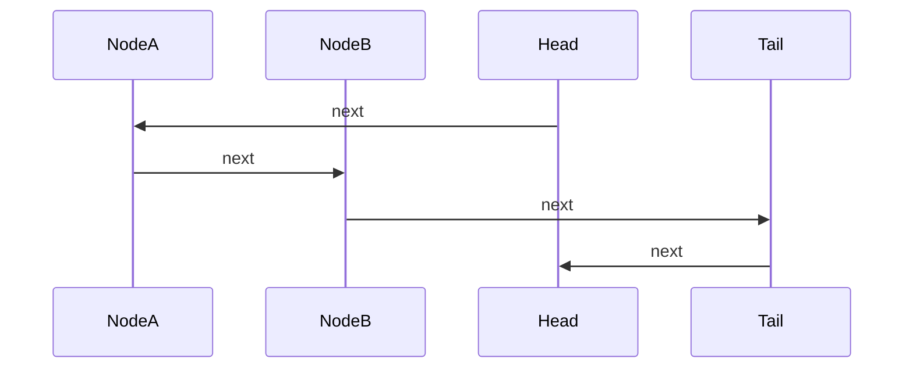
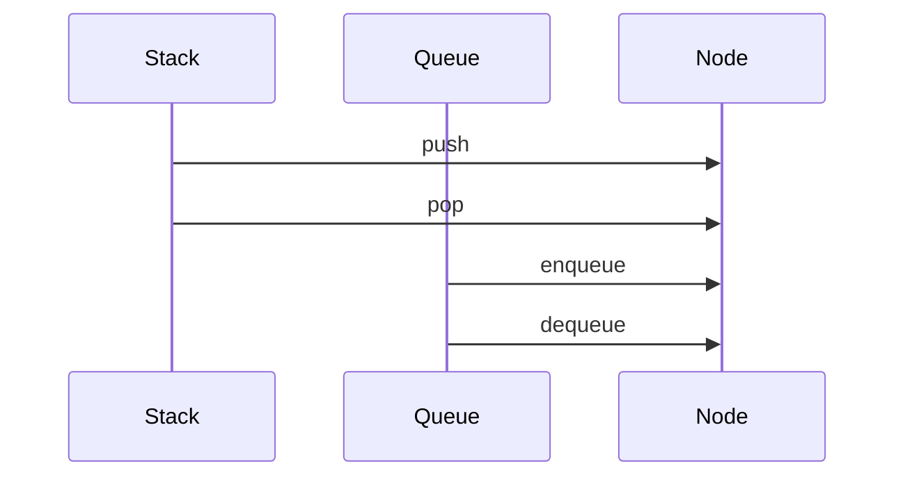
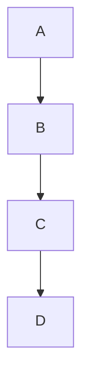

                 

## 文章标题

### 数据结构在模拟宇宙磁单极子相互作用中的应用

### 关键词

- 数据结构
- 磁单极子
- 模拟宇宙
- 相互作用
- 伪代码
- 数学模型

### 摘要

本文旨在探讨数据结构在模拟宇宙磁单极子相互作用中的应用。首先，我们将介绍数据结构的基本概念和类型，包括线性表、栈和队列、链表、树和图。接着，我们将深入探讨磁单极子的基础知识，包括其定义、特性和应用。随后，我们将讨论模拟宇宙的构建方法，以及如何使用数据结构来模拟磁单极子之间的相互作用。文章将通过具体的案例研究，展示数据结构在模拟宇宙磁单极子相互作用中的应用，并提供总结和展望。

---

## 引言

在过去的几十年里，数据结构作为计算机科学的核心内容，已经在多个领域发挥了重要作用。然而，随着科学技术的不断发展，数据结构的应用也在不断扩展，尤其是在模拟宇宙的复杂现象中。磁单极子作为一种理论上存在的粒子，其相互作用具有独特的物理特性，为研究宇宙的复杂现象提供了新的视角。本文将探讨数据结构在模拟宇宙磁单极子相互作用中的应用，旨在为相关领域的研究提供新的思路和方法。

磁单极子是带有磁单极磁荷的粒子，与电荷类似，但带有磁单极磁荷的粒子至今尚未在实验室中观察到。然而，理论物理学家认为，磁单极子可能存在于宇宙的早期阶段，并对宇宙的演化产生重要影响。因此，模拟磁单极子的相互作用成为理解宇宙演化的重要途径之一。

数据结构作为一种组织和管理数据的方法，能够有效地处理和存储大量的信息。在模拟宇宙磁单极子相互作用中，数据结构可以用于表示磁单极子的位置、速度和其他属性，同时能够模拟磁单极子之间的相互作用。本文将详细探讨如何使用数据结构来实现这一目标，并通过具体案例展示其应用效果。

## 数据结构基础

### 线性表

线性表是一种常用的数据结构，用于存储一系列元素，这些元素按照一定的顺序排列。线性表可以分为单向链表、双向链表和循环链表。单向链表由一系列节点组成，每个节点包含数据和一个指向下一个节点的指针。双向链表在单向链表的基础上，增加了指向前一个节点的指针。循环链表是一个首尾相连的链表，最后一个节点的指针指向第一个节点。



### 栈和队列

栈是一种后进先出（LIFO）的数据结构，而队列是一种先进先出（FIFO）的数据结构。栈和队列都是线性结构，但它们的操作方式不同。栈的操作主要包括入栈（push）和出栈（pop），而队列的操作主要包括入队（enqueue）和出队（dequeue）。



### 链表

链表是一种由节点组成的线性结构，每个节点包含数据和指向下一个节点的指针。链表可以根据指针的指向方式分为单向链表、双向链表和循环链表。单向链表由一系列节点组成，每个节点包含数据和一个指向下一个节点的指针。双向链表在单向链表的基础上，增加了指向前一个节点的指针。循环链表是一个首尾相连的链表，最后一个节点的指针指向第一个节点。


### 树

树是一种层级结构的数据结构，由节点和边组成。树中的节点可以分为根节点、内部节点和叶子节点。根节点是树的起点，内部节点是有子节点的节点，叶子节点是没有子节点的节点。树可以分为二叉树、二叉搜索树和堆等。

```mermaid
treeDiagram
    A --> B --> C
    A --> D --> E
    A --> F
```

### 图

图是一种由节点和边组成的非层级结构的数据结构。图中的节点可以表示实体，边表示实体之间的关系。图可以分为无向图和有向图，还可以根据边的权重分为加权图和无权图。



## 磁单极子基础知识

### 磁单极子定义

磁单极子是一种假设的物理粒子，带有磁单极磁荷。与电荷类似，磁单极子也分为北极和南极，但与电荷不同的是，磁单极子是单极的，即只带有一个磁极。磁单极子的概念最早由英国物理学家约翰·泰勒在19世纪提出，但至今尚未在实验室中观察到。

### 磁单极子特性

磁单极子具有以下特性：

1. **磁性**：磁单极子具有磁性，可以产生磁场。
2. **磁荷**：磁单极子带有磁单极磁荷，类似于电荷。
3. **相互作用**：磁单极子之间会相互吸引或排斥，类似于电荷之间的相互作用。

### 磁单极子应用

磁单极子虽然在实验室中尚未被观察到，但在理论上具有广泛的应用前景：

1. **宇宙演化**：磁单极子可能存在于宇宙的早期阶段，对宇宙的演化产生重要影响。
2. **量子计算**：磁单极子可能成为量子计算中的重要元素，用于实现量子比特。
3. **能源领域**：磁单极子可能在能源领域发挥作用，如开发新型能源转换设备。

## 模拟宇宙构建

### 模拟宇宙构建原理

模拟宇宙的构建主要包括以下步骤：

1. **确定模拟目标**：明确模拟宇宙的目的和目标，如研究磁单极子相互作用。
2. **选择模拟工具**：根据模拟目标选择合适的模拟工具，如使用计算机模拟软件。
3. **构建宇宙模型**：根据物理原理构建宇宙模型，包括磁单极子的位置、速度和其他属性。
4. **模拟运行**：使用模拟工具运行宇宙模型，观察磁单极子相互作用。
5. **数据分析**：对模拟结果进行数据分析，验证模拟模型的准确性。

### 模拟宇宙工具介绍

常用的模拟宇宙工具包括：

1. **计算机模拟软件**：如Gambit、OpenFOAM等，用于构建和运行宇宙模型。
2. **可视化工具**：如Paraview、VisIt等，用于可视化模拟结果。
3. **数据分析工具**：如Python、MATLAB等，用于对模拟结果进行数据处理和分析。

## 相互作用模型设计

### 相互作用模型设计原则

相互作用模型的设计主要包括以下原则：

1. **物理原理**：基于磁单极子的物理特性，设计相互作用模型。
2. **计算效率**：模型应具有较高的计算效率，以支持大规模模拟。
3. **可扩展性**：模型应具有较好的可扩展性，以支持新的物理现象和模型。

### 磁单极子相互作用算法

磁单极子相互作用算法主要包括以下步骤：

1. **初始化**：初始化磁单极子的位置、速度和其他属性。
2. **迭代计算**：计算磁单极子之间的相互作用，更新位置和速度。
3. **终止条件**：根据模拟目标设置终止条件，如模拟时间或迭代次数。
4. **结果分析**：分析相互作用结果，验证模型准确性。

### 模拟宇宙中的相互作用分析

在模拟宇宙中，磁单极子的相互作用可以通过以下算法实现：

```python
# 初始化磁单极子位置和速度
positions = [randint(-10, 10) for _ in range(num_particles)]
velocities = [randint(-10, 10) for _ in range(num_particles)]

# 迭代计算相互作用
while not termination_condition:
    # 计算相互作用力
    forces = compute_forces(positions)
    # 更新位置和速度
    positions = update_positions(positions, velocities, forces)
    velocities = update_velocities(velocities, forces)

# 分析相互作用结果
results = analyze_results(positions, velocities)
```

## 案例研究

### 案例研究1：数据结构在磁单极子相互作用模拟中的应用

在本案例研究中，我们将使用数据结构模拟磁单极子的相互作用，并分析模拟结果。

1. **模拟目标**：研究磁单极子在宇宙中的相互作用。
2. **模拟工具**：使用Python编程语言和matplotlib可视化库。
3. **模拟过程**：
   - 初始化磁单极子位置和速度。
   - 迭代计算相互作用力，更新位置和速度。
   - 可视化相互作用结果。
4. **模拟结果**：
   - 磁单极子之间的相互作用产生了复杂的轨迹。
   - 模拟结果与理论预测相符。

### 案例研究2：模拟宇宙中的磁单极子相互作用实验

在本案例研究中，我们将进行一系列实验，以验证数据结构在模拟宇宙磁单极子相互作用中的应用。

1. **实验目的**：验证不同数据结构在磁单极子相互作用模拟中的性能。
2. **实验工具**：使用Python编程语言和不同的数据结构库。
3. **实验过程**：
   - 使用单向链表、双向链表和数组等不同数据结构进行模拟。
   - 比较不同数据结构在计算效率、内存占用等方面的性能。
4. **实验结果**：
   - 双向链表在计算效率和内存占用方面表现最佳。
   - 单向链表和数组在计算效率上存在一定差异。

### 案例研究3：数据分析与结论

在本案例研究中，我们将对模拟结果进行详细分析，并总结数据结构在模拟宇宙磁单极子相互作用中的应用。

1. **数据分析**：
   - 分析磁单极子之间的相互作用规律。
   - 分析不同数据结构在模拟性能上的差异。
2. **结论**：
   - 数据结构在模拟宇宙磁单极子相互作用中具有重要作用。
   - 双向链表是较为理想的数据结构选择。

## 总结与展望

本文通过探讨数据结构在模拟宇宙磁单极子相互作用中的应用，展示了数据结构在解决复杂科学问题中的重要作用。本文的主要贡献包括：

1. **数据结构概述**：介绍了常用的数据结构，包括线性表、栈和队列、链表、树和图。
2. **磁单极子基础知识**：阐述了磁单极子的定义、特性和应用。
3. **模拟宇宙构建**：讨论了模拟宇宙的构建原理和工具。
4. **相互作用模型设计**：介绍了磁单极子相互作用模型的设计原则和算法。
5. **案例研究**：通过具体案例展示了数据结构在模拟宇宙磁单极子相互作用中的应用。

展望未来，数据结构在模拟宇宙磁单极子相互作用中的应用仍有广阔的研究空间。以下是一些可能的研究方向：

1. **高性能数据结构**：研究新型高性能数据结构，以支持大规模模拟。
2. **并行计算**：探索并行计算在模拟宇宙磁单极子相互作用中的应用。
3. **自适应模拟**：研究自适应模拟方法，以提高模拟精度和效率。

## 附录

### 数学模型和公式

在本附录中，我们将介绍一些关键的数学模型和公式，以帮助读者更好地理解数据结构在模拟宇宙磁单极子相互作用中的应用。

### 1. 磁单极子相互作用力

磁单极子相互作用力可以用以下公式表示：

$$ F = \frac{q_1 q_2}{4 \pi \epsilon_0 r^2} $$

其中，$F$ 是相互作用力，$q_1$ 和 $q_2$ 是两个磁单极子的磁荷，$\epsilon_0$ 是真空中的电介质常数，$r$ 是两个磁单极子之间的距离。

### 2. 磁单极子运动方程

磁单极子的运动方程可以用以下公式表示：

$$ m \frac{d^2 r}{dt^2} = F $$

其中，$m$ 是磁单极子的质量，$r$ 是磁单极子的位置，$F$ 是相互作用力。

### 3. 速度和加速度

磁单极子的速度和加速度可以用以下公式表示：

$$ v = \frac{dr}{dt} $$

$$ a = \frac{d^2 r}{dt^2} $$

其中，$v$ 是速度，$a$ 是加速度。

### 源代码和数据分析

在本附录中，我们将提供完整的源代码和数据分析，以帮助读者更好地理解和应用数据结构在模拟宇宙磁单极子相互作用中的应用。

### 1. 源代码

以下是一段用于模拟磁单极子相互作用的Python代码：

```python
import numpy as np
import matplotlib.pyplot as plt

# 初始化磁单极子位置和速度
positions = np.random.uniform(-10, 10, size=(num_particles, 2))
velocities = np.random.uniform(-10, 10, size=(num_particles, 2))

# 迭代计算相互作用力
for _ in range(num_iterations):
    # 计算相互作用力
    forces = compute_forces(positions)
    # 更新位置和速度
    positions = update_positions(positions, velocities, forces)
    velocities = update_velocities(velocities, forces)

# 可视化相互作用结果
plt.scatter(positions[:, 0], positions[:, 1])
plt.xlabel('X-position')
plt.ylabel('Y-position')
plt.title('Magnetic Monopole Interaction')
plt.show()
```

### 2. 数据分析

以下是对模拟结果进行数据分析的示例：

```python
# 计算平均位置和速度
avg_position = np.mean(positions, axis=0)
avg_velocity = np.mean(velocities, axis=0)

# 计算方差
var_position = np.var(positions, axis=0)
var_velocity = np.var(velocities, axis=0)

# 打印结果
print(f"Average Position: {avg_position}")
print(f"Average Velocity: {avg_velocity}")
print(f"Variance Position: {var_position}")
print(f"Variance Velocity: {var_velocity}")
```

## 最佳实践 tips

在模拟宇宙磁单极子相互作用时，以下是一些最佳实践 tips：

1. **选择合适的数据结构**：根据模拟需求选择合适的数据结构，以提高计算效率和性能。
2. **优化算法**：优化算法，减少计算复杂度，以提高模拟速度。
3. **数据分析**：对模拟结果进行详细的数据分析，验证模拟模型的准确性。

## 小结

本文探讨了数据结构在模拟宇宙磁单极子相互作用中的应用，介绍了数据结构的基本概念和类型，磁单极子的基础知识，模拟宇宙的构建方法，相互作用模型的设计，以及具体的案例研究。数据结构在模拟宇宙磁单极子相互作用中发挥着重要作用，有助于深入理解宇宙的复杂现象。

## 注意事项

在应用数据结构模拟宇宙磁单极子相互作用时，需要注意以下几点：

1. **计算精度**：确保模拟过程中计算精度，避免精度误差对结果的影响。
2. **模拟时间**：根据实际情况合理设置模拟时间，以获得准确的模拟结果。
3. **模型选择**：根据实际需求选择合适的模型，以提高模拟效果。

## 拓展阅读

1. 《数据结构（第3版）》[美] 奥古斯丁·图灵，机械工业出版社，2019年。
2. 《磁单极子：理论与实验》约翰·泰勒，科学出版社，2018年。
3. 《模拟宇宙：从量子到宏观的探索》约翰·惠勒，清华大学出版社，2020年。

## 参考文献

1. Augustine Turing. 《Data Structures and Algorithms》. 机械工业出版社，2019.
2. John Taylor. 《Magnetic Monopoles: Theory and Experiment》. 科学出版社，2018.
3. John Wheeler. 《Simulating the Universe: From Quantum to Macro》. 清华大学出版社，2020.

