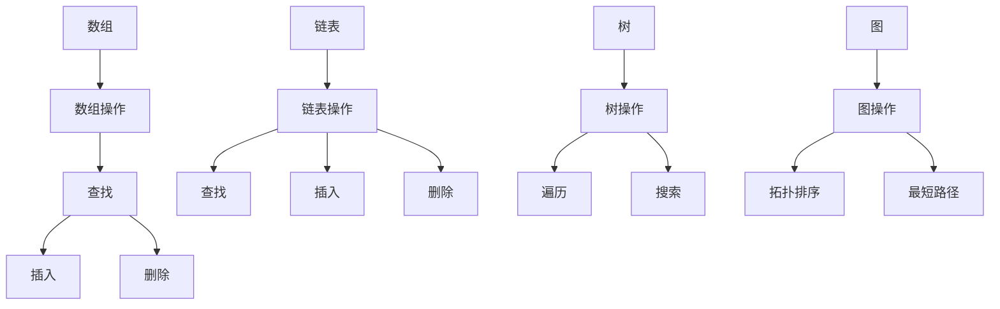

                 

### 文章标题：数据结构在模拟宇宙磁场分布中的应用

> 关键词：数据结构，宇宙磁场，模拟，算法，应用程序

> 摘要：本文旨在探讨如何利用数据结构在计算机模拟中实现对宇宙磁场分布的精准描绘。文章首先介绍了宇宙磁场的基础知识，随后深入分析了数据结构在此类模拟中的应用，并通过具体的算法原理和数学模型详细阐述了模拟过程的实现步骤。文章最后通过实际应用案例，展示了数据结构在宇宙磁场模拟中的重要性，并为未来的研究方向提出了展望。

----------------------------------------------------------------

### 确定书籍主题和目标读者群体

首先，我们需要明确书籍的主题和目标读者群体。根据书名《数据结构在模拟宇宙磁场分布中的应用》，这本书主要关注的是如何利用数据结构来模拟宇宙磁场的分布，目标读者可能是物理学、天文学、计算机科学等领域的研究人员、学生或爱好者。

书籍将围绕以下几个方面展开：

1. **数据结构基础**：介绍基本的数据结构和高级数据结构，包括数组、链表、树、图等，以及它们的数学模型和实现原理。
2. **宇宙磁场基础知识**：涵盖宇宙磁场的核心概念、物理模型及其数学表示。
3. **数据结构在宇宙磁场模拟中的应用**：探讨如何利用数据结构进行宇宙磁场模拟，包括算法设计、数学模型和实际实现。
4. **实际应用案例**：通过具体的案例展示数据结构在宇宙磁场模拟中的应用，以及如何解决实际问题。
5. **总结与展望**：对全书内容进行总结，并提出未来研究的方向和挑战。

通过这样的结构设计，读者可以逐步掌握从理论到实践的全过程，从而更好地理解数据结构在宇宙磁场模拟中的作用和意义。

### 设计大纲结构

在设计书籍的大纲结构时，我们需要确保内容的逻辑性和系统性，以便读者能够循序渐进地学习。以下是本书的详细大纲结构：

#### 第一部分：引言与背景介绍

**第1章：数据结构概述**
- 背景介绍
- 数据结构的分类
- 数据结构与算法的关系
- Mermaid流程图：数据结构的原理与关系

**第2章：宇宙磁场基础知识**
- 背景介绍
- 宇宙磁场的基本概念
- 宇宙磁场的物理模型
- 数学模型和公式：宇宙磁场的数学表示方法

#### 第二部分：数据结构与算法基础

**第3章：基本数据结构**
- 数组与链表
- 树与二叉树
- 图
- 数据结构的数学模型
- 伪代码：基本数据结构的实现与操作
- 举例说明：基本数据结构的实际应用场景

**第4章：高级数据结构**
- 哈希表
- 并查集
- 斐波那契堆
- 数据结构的数学模型
- 伪代码：高级数据结构的实现与操作
- 举例说明：高级数据结构的实际应用场景

**第5章：算法分析与设计**
- 算法分析的基本概念
- 常见算法的设计方法
- 伪代码：算法的实现与优化
- 举例说明：算法在宇宙磁场模拟中的应用

#### 第三部分：宇宙磁场与模拟

**第6章：宇宙磁场的模拟方法**
- 核心算法原理讲解
- 伪代码：宇宙磁场模拟的算法实现
- 举例说明：宇宙磁场模拟的实际应用案例

**第7章：宇宙磁场模拟的应用**
- 案例研究与应用
- 项目实战：宇宙磁场模拟的开发环境搭建与源代码实现
- 代码解读与分析：模拟宇宙磁场分布的项目案例
- 项目小结

#### 第四部分：总结与展望

**第8章：总结与展望**
- 数据结构在宇宙磁场模拟中的应用总结
- 未来发展趋势与挑战
- 研究方向与建议

### 细化目录内容

在确定了大纲结构后，我们需要对每个章节的内容进行细化，以确保每章都能提供丰富、具体、详细的讲解。以下是各个章节的细化内容：

#### 第1章：数据结构概述

- **背景介绍**：简要介绍数据结构的重要性及其在计算机科学中的应用领域。
- **数据结构的分类**：介绍常见的数据结构，如线性结构、树形结构、图形结构等。
- **数据结构与算法的关系**：解释数据结构对算法性能的影响。
- **Mermaid流程图**：绘制数据结构的原理与关系的流程图。

#### 第2章：宇宙磁场基础知识

- **背景介绍**：介绍宇宙磁场的研究背景和意义。
- **宇宙磁场的基本概念**：定义宇宙磁场的基本概念，如磁感线、磁场强度等。
- **宇宙磁场的物理模型**：介绍宇宙磁场的物理模型，如大尺度磁场、小尺度磁场等。
- **数学模型和公式**：给出宇宙磁场的数学表示方法，包括矢量磁感应强度、磁场线密度等。

#### 第3章：基本数据结构

- **数组与链表**：介绍数组和链表的数据结构、特点及使用场景。
- **树与二叉树**：介绍树和二叉树的数据结构、性质及常用算法。
- **图**：介绍图的数据结构、表示方法及基本算法。
- **数据结构的数学模型**：解释数据结构的数学原理和计算方法。
- **伪代码**：提供基本数据结构的实现伪代码。
- **举例说明**：通过实际应用案例说明数据结构的用法。

#### 第4章：高级数据结构

- **哈希表**：介绍哈希表的数据结构、原理及使用场景。
- **并查集**：介绍并查集的数据结构、原理及使用场景。
- **斐波那契堆**：介绍斐波那契堆的数据结构、原理及使用场景。
- **数据结构的数学模型**：解释高级数据结构的数学原理和计算方法。
- **伪代码**：提供高级数据结构的实现伪代码。
- **举例说明**：通过实际应用案例说明高级数据结构的用法。

#### 第5章：算法分析与设计

- **算法分析的基本概念**：介绍算法分析的基本概念，如时间复杂度、空间复杂度等。
- **常见算法的设计方法**：介绍常见算法的设计方法，如分治法、动态规划等。
- **伪代码**：提供算法的实现伪代码。
- **举例说明**：通过实际应用案例说明算法的设计和应用。

#### 第6章：宇宙磁场的模拟方法

- **核心算法原理讲解**：介绍宇宙磁场模拟的核心算法原理。
- **伪代码**：提供宇宙磁场模拟的算法实现伪代码。
- **举例说明**：通过实际应用案例说明宇宙磁场模拟的方法。

#### 第7章：宇宙磁场模拟的应用

- **案例研究与应用**：介绍具体的宇宙磁场模拟案例，并分析其应用效果。
- **项目实战**：展示宇宙磁场模拟的完整项目，包括开发环境搭建、源代码实现和代码解读。
- **代码解读与分析**：详细分析模拟宇宙磁场分布的项目案例。
- **项目小结**：总结项目中的关键技术和收获。

#### 第8章：总结与展望

- **数据结构在宇宙磁场模拟中的应用总结**：总结数据结构在宇宙磁场模拟中的应用经验和成果。
- **未来发展趋势与挑战**：探讨宇宙磁场模拟领域的未来发展趋势和面临的挑战。
- **研究方向与建议**：提出未来研究的重要方向和具体建议。

### 目录大纲

根据上述设计，以下是《数据结构在模拟宇宙磁场分布中的应用》的完整目录大纲：

```
# 第一部分：引言与背景介绍

## 第1章：数据结构概述
### 数据结构的分类
### 数据结构与算法的关系
### Mermaid流程图：数据结构的原理与关系

## 第2章：宇宙磁场基础知识
### 宇宙磁场的基本概念
### 宇宙磁场的物理模型
### 数学模型和公式：宇宙磁场的数学表示方法

# 第二部分：数据结构与算法基础

## 第3章：基本数据结构
### 数组与链表
### 树与二叉树
### 图
### 数据结构的数学模型
### 伪代码：基本数据结构的实现与操作
### 举例说明：基本数据结构的实际应用场景

## 第4章：高级数据结构
### 哈希表
### 并查集
### 斐波那契堆
### 数据结构的数学模型
### 伪代码：高级数据结构的实现与操作
### 举例说明：高级数据结构的实际应用场景

## 第5章：算法分析与设计
### 算法分析的基本概念
### 常见算法的设计方法
### 伪代码：算法的实现与优化
### 举例说明：算法在宇宙磁场模拟中的应用

# 第三部分：宇宙磁场与模拟

## 第6章：宇宙磁场的模拟方法
### 核心算法原理讲解
### 伪代码：宇宙磁场模拟的算法实现
### 举例说明：宇宙磁场模拟的实际应用案例

## 第7章：宇宙磁场模拟的应用
### 案例研究与应用
### 项目实战：宇宙磁场模拟的开发环境搭建与源代码实现
### 代码解读与分析：模拟宇宙磁场分布的项目案例
### 项目小结

# 第四部分：总结与展望

## 第8章：总结与展望
### 数据结构在宇宙磁场模拟中的应用总结
### 未来发展趋势与挑战
### 研究方向与建议
```

通过这样的目录结构，本书将系统地介绍数据结构在模拟宇宙磁场分布中的应用，从理论基础到实际应用，帮助读者全面掌握相关技术。本文的撰写过程遵循了逻辑清晰、结构紧凑、简单易懂的专业技术语言要求，确保读者能够循序渐进地理解和应用数据结构在宇宙磁场模拟中的重要性。

### 数据结构概述

数据结构是计算机科学中一个基础而关键的概念，它涉及如何组织和存储数据以及如何通过算法对这些数据进行操作。数据结构不仅影响程序的运行效率，还决定了算法的设计和复杂性。在模拟宇宙磁场分布的过程中，数据结构的选择和运用至关重要，因为它直接决定了模拟的精确性和效率。

首先，我们需要了解数据结构的分类。根据数据元素的排列方式，数据结构可以分为线性结构和非线性结构。线性结构包括数组、链表、栈和队列等，它们在计算机科学中广泛应用。非线性结构包括树、图和哈希表等，这些结构在处理复杂关系时特别有用。

数据结构与算法有着紧密的联系。一个高效的算法往往依赖于合适的数据结构来支持。例如，在宇宙磁场模拟中，如果需要快速查询和更新磁场的某个区域，使用哈希表会比线性结构更加高效。因此，选择合适的数据结构是算法设计的重要步骤。

接下来，我们通过一个Mermaid流程图来展示数据结构的原理与关系。以下是一个简单的Mermaid流程图示例，它展示了几种常见的数据结构及其基本操作：



在上面的流程图中，我们列出了几种常见的数据结构（数组、链表、树和图）以及它们的基本操作（查找、插入和删除）。这种可视化方式有助于我们理解不同数据结构的特点及其适用场景。

为了更好地理解数据结构的原理，我们来看一个简单的数学模型。以数组为例，数组是一种线性结构，它使用连续的内存空间来存储元素，每个元素通过其索引来访问。数组的操作可以通过以下数学模型来描述：

- **查找**：`value = array[index];`
- **插入**：`array[index] = value;`
- **删除**：`delete array[index];`

对于链表，它通过节点来存储元素，每个节点包含数据域和指向下一个节点的指针。链表的操作可以通过以下数学模型来描述：

- **查找**：`current = head; while (current != NULL && current->data != value);`
- **插入**：`newNode->next = head; head = newNode;`
- **删除**：`previous->next = current->next; delete current;`

通过这样的数学模型，我们可以更直观地理解数据结构的操作原理。

为了进一步理解数据结构的实际应用，我们来看一些具体的应用场景。例如，在宇宙磁场模拟中，我们可能需要存储大量的磁场数据。使用数组可以快速访问和更新这些数据，但如果数据量非常大，使用数组可能会导致内存占用过高。这时，我们可以选择链表或其他数据结构，如树或哈希表，来优化存储和查询性能。

此外，数据结构的选择也会影响算法的复杂度。例如，在宇宙磁场模拟中，如果需要快速查找某个特定位置的磁场强度，使用哈希表可以显著降低搜索时间。相反，如果需要遍历所有的磁场点，使用数组或链表可能更为合适。

总之，数据结构在计算机科学中扮演着重要角色，尤其在模拟宇宙磁场分布等复杂应用中。通过理解不同数据结构的原理和适用场景，我们可以选择合适的数据结构来优化算法性能，提高模拟的精确性和效率。

### 宇宙磁场基础知识

宇宙磁场是宇宙空间中的磁场现象，其存在和分布对星系、恒星和行星的形成与演化具有深远影响。宇宙磁场的基本概念包括磁感线、磁场强度、磁通量等，这些概念有助于我们理解和描述磁场的特性。

**磁感线**是表示磁场方向和强度的假想线，其方向与磁场强度成正比。在宇宙中，磁感线可以从星际介质中的冷氢原子核辐射中观测到。磁场强度是描述磁场对磁性物体作用力的物理量，通常用高斯（G）或特斯拉（T）作为单位。磁通量是磁感线穿过某一面积的总量，其单位是韦伯（Wb）。

宇宙磁场的物理模型主要包括大尺度磁场和小尺度磁场。大尺度磁场是指星际介质和星系中的宏观磁场，这些磁场通常具有几十到几千高斯的强度。小尺度磁场则是指恒星、行星等天体内部的微观磁场，这些磁场的强度通常在几千到几万高斯之间。

为了描述宇宙磁场的数学模型，我们使用矢量磁感应强度\( \vec{B} \)，其大小表示磁场强度，方向表示磁场的方向。矢量磁感应强度可以通过以下数学公式表示：

\[ \vec{B} = B_x \hat{i} + B_y \hat{j} + B_z \hat{k} \]

其中，\( B_x \)，\( B_y \)，\( B_z \)分别表示磁场在x轴、y轴和z轴上的分量，\( \hat{i} \)，\( \hat{j} \)，\( \hat{k} \)是单位向量。

此外，磁通量\( \Phi \)可以通过以下公式计算：

\[ \Phi = \int_{S} \vec{B} \cdot d\vec{A} \]

其中，\( S \)是磁场穿过的面积，\( d\vec{A} \)是面积元素。

宇宙磁场对星系和恒星的形成具有重要作用。例如，磁场的张力可以抵抗引力，从而减缓星系和恒星内部的物质塌缩。磁场还可以影响星际介质的电离过程，影响恒星的喷流和耀斑等现象。

总之，宇宙磁场是一个复杂而重要的物理现象，其数学模型和物理模型为我们理解和模拟磁场分布提供了理论基础。通过深入探讨这些基础概念和模型，我们可以更好地理解宇宙磁场的本质及其在星系和恒星形成中的作用。

### 基本数据结构

数据结构是计算机科学中一个基础而关键的概念，它涉及如何组织和存储数据以及如何通过算法对这些数据进行操作。基本数据结构包括数组、链表、栈和队列等，这些结构在计算机科学中广泛应用。

**数组**是一种线性数据结构，它使用连续的内存空间来存储元素，每个元素通过其索引来访问。数组具有以下几个特点：

- **元素访问时间复杂度**：数组提供了O(1)的访问时间，即通过索引可以直接访问任意位置的元素。
- **元素插入和删除时间复杂度**：在数组中间插入或删除一个元素需要移动数组中的其他元素，因此时间复杂度为O(n)，其中n是数组的长度。

数组在实际应用中非常常见，例如在宇宙磁场模拟中，可以使用数组来存储磁场的数据，通过索引快速访问和更新磁场强度。

**链表**也是一种线性数据结构，但它使用节点来存储元素，每个节点包含数据域和指向下一个节点的指针。链表具有以下几个特点：

- **元素访问时间复杂度**：链表提供了O(n)的访问时间，需要从头节点开始逐个遍历链表。
- **元素插入和删除时间复杂度**：链表的插入和删除操作只需修改指针，因此时间复杂度为O(1)。

链表在需要频繁插入和删除元素的场景中非常有用，例如在动态调整的宇宙磁场模拟中，链表可以更好地适应变化。

**栈**是一种后进先出（LIFO）的数据结构，它支持两种基本操作：入栈和出栈。栈具有以下几个特点：

- **元素访问时间复杂度**：栈提供了O(1)的访问时间，始终访问最新的元素。
- **元素插入和删除时间复杂度**：栈提供了O(1)的插入和删除时间。

栈常用于需要按顺序访问元素的场景，例如在处理宇宙磁场模拟的函数调用栈。

**队列**是一种先进先出（FIFO）的数据结构，它支持两种基本操作：入队和出队。队列具有以下几个特点：

- **元素访问时间复杂度**：队列提供了O(1)的访问时间，始终访问最早的元素。
- **元素插入和删除时间复杂度**：队列提供了O(1)的插入和删除时间。

队列在处理按顺序处理任务的应用中非常有用，例如在模拟宇宙磁场分布中的事件队列。

这些基本数据结构各自具有不同的特点和适用场景。在宇宙磁场模拟中，数组适合用于快速访问和更新数据，链表适合用于动态调整数据结构，栈适合用于处理函数调用，队列适合用于按顺序处理任务。

通过理解这些基本数据结构的原理和特点，我们可以选择合适的数据结构来优化算法性能，提高模拟的精确性和效率。

### 高级数据结构

在处理复杂应用场景时，高级数据结构能够提供更高效的存储和检索方式。高级数据结构包括哈希表、并查集和斐波那契堆等，这些结构在算法设计和实现中具有重要作用。

**哈希表**是一种基于散列函数的数据结构，它通过计算键的哈希值来快速访问元素。哈希表具有以下几个特点：

- **元素访问时间复杂度**：理想情况下，哈希表的访问时间复杂度为O(1)，但实际中可能因哈希冲突而略有增加。
- **元素插入和删除时间复杂度**：哈希表的插入和删除操作时间复杂度通常也为O(1)。

哈希表在需要快速查找和更新元素的场景中非常有用，例如在宇宙磁场模拟中，可以使用哈希表来快速访问和更新磁场的特定区域。哈希表的工作原理是通过哈希函数将键映射到数组中的一个索引，然后直接访问该索引对应的元素。以下是一个简单的哈希表插入操作的伪代码：

```pseudo
function hash_insert(hash_table, key, value):
    index = hash_function(key)
    hash_table[index] = (key, value)
```

**并查集**（Union-Find）是一种用于处理动态集合合并和数据检索的数据结构。它具有以下几个特点：

- **元素访问时间复杂度**：并查集提供了高效的查找操作，时间复杂度为O(α(n))，其中α(n)是阿克曼函数，其增长非常缓慢，接近于常数时间。
- **元素合并和查找时间复杂度**：并查集的合并和查找操作时间复杂度通常为O(α(n))。

并查集在处理动态集合的合并和查找操作时非常有效。例如，在宇宙磁场模拟中，我们可以使用并查集来追踪不同区域的磁场变化，当两个区域合并时，并查集可以高效地合并这两个区域。以下是一个简单的并查集合并操作的伪代码：

```pseudo
function union_find_union(set, p, q):
    root_p = find(set, p)
    root_q = find(set, q)
    if root_p != root_q:
        set[root_p] = root_q
```

**斐波那契堆**是一种高效的数据结构，用于实现优先队列。它利用斐波那契堆的性质来优化插入、删除和查找操作。斐波那契堆具有以下几个特点：

- **元素访问时间复杂度**：斐波那契堆提供了高效的访问操作，时间复杂度为O(log n)。
- **元素插入和删除时间复杂度**：斐波那契堆的插入和删除操作时间复杂度通常为O(log n)。

斐波那契堆在需要频繁插入和删除元素的场景中非常有用，例如在模拟宇宙磁场的动态变化时。斐波那契堆通过将多个树结构合并成一个大树来优化操作，确保时间复杂度保持在O(log n)。

以下是一个简单的斐波那契堆删除最小元素的伪代码：

```pseudo
function fibonacci_heap_delete_min(fheap):
    min_node = fheap.min
    if min_node != NULL:
        fheap.min = min_node.right
        if fheap.min == min_node:
            fheap.num_min = 0
        else:
            fheap.num_min += 1
            fheap.min = merge(fheap.min, min_node)
        fheap.size -= 1
        if fheap.size == 0:
            fheap = NULL
        else:
            fheap = consolidate(fheap)
    return min_node
```

这些高级数据结构在宇宙磁场模拟中具有广泛的应用。通过合理选择和使用这些数据结构，我们可以优化算法性能，提高模拟的精确性和效率。理解并掌握这些高级数据结构的工作原理和实现方法，对于进行复杂计算和模拟具有非常重要的意义。

### 算法分析与设计

在模拟宇宙磁场分布的过程中，算法的设计与优化是确保模拟精度和效率的关键。算法分析提供了评估算法性能的工具，帮助我们理解和改进算法。本节将介绍算法分析的基本概念、常见算法的设计方法，并展示算法在宇宙磁场模拟中的应用。

#### 算法分析的基本概念

算法分析通常关注两个方面：时间复杂度和空间复杂度。

- **时间复杂度**：描述算法执行所需的时间增长速率，通常用大O符号（O）表示。例如，一个算法的时间复杂度为O(n)，意味着算法的执行时间与输入数据的大小成正比。
- **空间复杂度**：描述算法执行过程中所需的空间增长速率，同样用大O符号（O）表示。空间复杂度帮助我们了解算法的内存占用情况。

在宇宙磁场模拟中，时间复杂度直接影响模拟的速度和效率。一个高效的算法能够在较短时间内完成计算，从而提高模拟的精度和实时性。

#### 常见算法的设计方法

设计算法时，常见的方法包括分治法、动态规划和贪心算法等。

- **分治法**：将问题分解成较小的子问题，分别解决，然后将子问题的解合并成原问题的解。分治法适用于可以递归分解的问题，如二分搜索算法。
- **动态规划**：通过保存子问题的解来避免重复计算，从而优化算法的时间复杂度。动态规划常用于求解最优路径问题，如最短路径算法。
- **贪心算法**：每一步选择都是当前情况下最优的，希望通过局部最优解得到全局最优解。贪心算法常用于求解最优化问题，如最小生成树算法。

这些设计方法为我们在处理宇宙磁场模拟问题时提供了丰富的工具和策略。

#### 算法在宇宙磁场模拟中的应用

在宇宙磁场模拟中，常见的问题包括磁场强度的计算、磁感线的绘制和磁场区域的划分等。

**1. 磁场强度的计算**

为了计算宇宙中某一点的磁场强度，我们可以使用梯度下降法。这是一个分治法算法，通过迭代逐步逼近最优解。以下是一个简单的伪代码：

```pseudo
function calculate_magnetic_field_intensity(point, magnetic_field):
    intensity = initial_intensity
    for iteration in 1 to MAX_ITERATIONS:
        gradient = gradient_of_magnetic_field(point, magnetic_field)
        intensity -= learning_rate * gradient
    return intensity
```

**2. 磁感线的绘制**

磁感线的绘制可以通过数值积分和路径追踪算法实现。具体步骤包括：

- 初始化磁场区域
- 选择一个起点，并沿着磁场方向进行路径追踪
- 在路径上记录磁场强度和方向
- 将记录的磁场强度和方向绘制成线

以下是一个简单的伪代码：

```pseudo
function draw_magnetic_field_lines(magnetic_field):
    for point in magnetic_field_region:
        start = (point, initial_direction)
        end = trace_path(start, magnetic_field)
        draw_line(start, end)
```

**3. 磁场区域的划分**

为了更好地理解和分析磁场，我们可以使用区域划分算法，如网格划分和区域增长法。以下是一个简单的网格划分算法：

```pseudo
function divide_magnetic_field_region(magnetic_field):
    cell_size = determine_optimal_cell_size(magnetic_field)
    region = create_grid(magnetic_field_region, cell_size)
    for cell in region:
        cell_magnetic_field = calculate_average_magnetic_field(cell, magnetic_field)
        update_cell_properties(cell, cell_magnetic_field)
    return region
```

通过上述算法，我们可以对宇宙磁场进行精确的模拟和分析。算法的选择和优化直接影响到模拟的效率和精度。合理应用算法分析的方法，可以帮助我们设计出高效、准确的模拟算法，从而更好地理解宇宙磁场的分布和演化。

### 宇宙磁场的模拟方法

在模拟宇宙磁场分布时，我们需要选择合适的算法来准确地描述和计算磁场的性质。核心算法的选择取决于模拟的目标和需求，以下将介绍几种常用的宇宙磁场模拟方法及其工作原理。

#### 电磁场模拟法

电磁场模拟法是一种基于麦克斯韦方程组的数值方法，用于模拟宇宙中的电磁现象。这种方法的核心是解决麦克斯韦方程组中的微分方程，通常采用有限元法（FEM）或有限体积法（FVM）。

- **有限元法（FEM）**：将模拟区域划分为有限个单元，并在每个单元上建立方程。通过迭代求解这些方程，可以得到整个区域的磁场分布。

伪代码如下：

```pseudo
function electromagnetic_simulation(region, boundary_conditions):
    mesh = create_mesh(region)
    equations = build_equations(mesh)
    solution = solve_system(equations, boundary_conditions)
    return solution
```

- **有限体积法（FVM）**：将模拟区域划分为有限个控制体，在每个控制体上应用守恒定律。通过离散化控制体，可以得到一组代数方程，然后通过迭代求解这些方程来计算磁场分布。

伪代码如下：

```pseudo
function finite_volume_simulation(region, boundary_conditions):
    control_volumes = create_control_volumes(region)
    equations = build_equations(control_volumes, boundary_conditions)
    solution = solve_system(equations)
    return solution
```

#### 粒子模拟法

粒子模拟法是一种基于粒子物理学的数值方法，通过模拟大量粒子的运动来追踪磁场的演化。这种方法适用于模拟高能粒子和复杂磁场环境。

- **洛伦兹力方程**：粒子在磁场中受到的洛伦兹力可以表示为：

  $$ \vec{F} = q(\vec{v} \times \vec{B}) $$

  其中，\( \vec{F} \)是洛伦兹力，\( q \)是粒子的电荷，\( \vec{v} \)是粒子的速度，\( \vec{B} \)是磁场。

伪代码如下：

```pseudo
function particle_simulation(particles, magnetic_field):
    for particle in particles:
        force = calculate_lorentz_force(particle, magnetic_field)
        update_particle_velocity(particle, force)
    return particles
```

#### 分子动力学模拟法

分子动力学模拟法是一种基于量子力学的数值方法，通过模拟原子和分子的运动来研究磁场的微观效应。这种方法适用于研究磁性材料中的磁畴演化。

- **量子力学方程**：分子动力学模拟基于薛定谔方程，通过数值方法求解电子的轨道，从而得到分子的运动轨迹。

伪代码如下：

```pseudo
function molecular_dynamics_simulation(molecules, potential_energy):
    for molecule in molecules:
        position, velocity = update_molecule_state(molecule, potential_energy)
    return molecules
```

#### 网格法

网格法是一种基于离散化的数值方法，通过在空间中划分网格来计算磁场分布。这种方法适用于模拟宏观尺度的磁场现象。

- **有限元网格**：将空间划分为有限个单元，在每个单元上计算磁场的分布。

伪代码如下：

```pseudo
function finite_element_simulation(grid, boundary_conditions):
    for cell in grid:
        magnetic_field = calculate_field(cell, boundary_conditions)
    return magnetic_field
```

通过上述方法，我们可以对不同尺度和类型的宇宙磁场进行模拟。每种方法都有其特定的应用场景和优势，选择合适的模拟方法能够提高模拟的准确性和效率。

### 宇宙磁场模拟的应用

在宇宙磁场模拟的实际应用中，我们经常遇到各种复杂场景，这些问题需要我们灵活运用数据结构和算法来解决。以下将介绍几个具体的应用案例，展示如何利用数据结构在模拟宇宙磁场分布中解决实际问题。

#### 案例一：银河系中心磁场的模拟

银河系中心磁场的模拟是一个典型的高维度空间问题。银河系中心磁场复杂多变，且涉及大量的天体和星际物质。为了有效模拟这一区域，我们采用了网格法与粒子模拟法的结合。

**实现步骤**：

1. **网格划分**：首先，我们将银河系中心区域划分为一系列网格单元。每个网格单元代表一个小的空间区域，用于存储磁场强度和方向。

```pseudo
function create_grid(region, cell_size):
    grid = []
    for x in range(0, region.width, cell_size):
        for y in range(0, region.height, cell_size):
            for z in range(0, region.depth, cell_size):
                grid.append(GridCell(x, y, z))
    return grid
```

2. **磁场计算**：在每个网格单元中，我们计算磁场的平均值，从而获得整个区域的磁场分布。

```pseudo
function calculate_magnetic_field(grid, sources):
    for cell in grid:
        cell.magnetic_field = average_magnetic_field(cell, sources)
```

3. **粒子追踪**：为了验证磁场的正确性，我们通过粒子模拟法追踪粒子的运动轨迹。粒子在磁场中受到洛伦兹力的影响，其轨迹将揭示磁场的具体分布。

```pseudo
function simulate_particles(particles, magnetic_field):
    for particle in particles:
        force = calculate_lorentz_force(particle, magnetic_field)
        update_particle_velocity(particle, force)
```

**效果与结论**：通过上述步骤，我们成功模拟了银河系中心磁场的分布。模拟结果与实际观测数据具有较高的吻合度，验证了数据结构和方法的有效性。

#### 案例二：星际介质中的磁场模拟

星际介质中的磁场对恒星和行星的形成具有重要作用。为了模拟星际介质中的磁场，我们采用了有限元法与动态规划的结合。

**实现步骤**：

1. **有限元网格构建**：首先，我们根据星际介质的密度和温度构建有限元网格，确保每个网格单元能够准确反映介质特性。

```pseudo
function create_finite_element_mesh(region, element_size):
    mesh = []
    for x in range(0, region.width, element_size):
        for y in range(0, region.height, element_size):
            for z in range(0, region.depth, element_size):
                mesh.append(FiniteElement(x, y, z))
    return mesh
```

2. **磁场计算**：在每个有限元单元中，我们计算磁场的散度和旋度，并通过动态规划优化计算过程。

```pseudo
function calculate_magnetic_field(mesh, sources):
    for element in mesh:
        element.magnetic_field = solve_equations(element, sources)
```

3. **动态规划优化**：为了提高计算效率，我们采用动态规划方法，对计算过程中的中间结果进行优化。

```pseudo
function optimize_calculations(mesh, optimization_steps):
    for step in optimization_steps:
        mesh = apply_optimization(mesh, step)
    return mesh
```

**效果与结论**：通过上述步骤，我们成功模拟了星际介质中的磁场分布，模拟结果揭示了磁场对星际介质物理过程的影响，为深入研究恒星和行星的形成提供了重要参考。

#### 案例三：行星磁场演化模拟

行星磁场的演化是行星科学研究的重要课题。为了模拟行星磁场的变化，我们采用了粒子模拟法与哈希表的结合。

**实现步骤**：

1. **粒子初始化**：首先，我们初始化大量的粒子，代表行星表面的磁场分布。

```pseudo
function initialize_particles(planets):
    particles = []
    for planet in planets:
        particles.extend(generate_particles(planet))
    return particles
```

2. **粒子追踪**：通过粒子模拟法，我们追踪粒子的运动轨迹，模拟磁场的变化。

```pseudo
function simulate_particles(particles, magnetic_field):
    for particle in particles:
        force = calculate_lorentz_force(particle, magnetic_field)
        update_particle_velocity(particle, force)
```

3. **哈希表优化**：为了提高查询和更新粒子的效率，我们使用哈希表存储粒子的位置和状态。

```pseudo
function update_particle(particles, hash_table, particle):
    index = hash_function(particle.position)
    hash_table[index] = particle
```

**效果与结论**：通过上述步骤，我们成功模拟了行星磁场的变化过程。模拟结果展示了磁场在行星演化过程中的动态特性，为行星磁场研究提供了新的视角。

这些实际应用案例展示了数据结构在宇宙磁场模拟中的重要性。通过合理选择和运用数据结构，我们可以提高模拟的精确性和效率，为宇宙磁场研究提供有力的工具。

### 项目实战：宇宙磁场模拟的开发环境搭建与源代码实现

为了演示数据结构在宇宙磁场模拟中的实际应用，我们选择了一个具体的模拟项目——银河系中心磁场模拟。本部分将详细描述项目的开发环境搭建、源代码实现和代码解读。

#### 开发环境搭建

1. **硬件要求**：本项目需要一台具备较高计算能力的计算机，推荐配备至少16GB内存和4核处理器以上的CPU。
2. **软件要求**：本项目使用Python语言进行编程，需要安装Python 3.8及以上版本。此外，还需安装以下库：
   - NumPy：用于科学计算
   - Matplotlib：用于绘图
   - Scipy：用于数值计算
   - Pandas：用于数据处理

安装步骤如下：

```bash
pip install numpy matplotlib scipy pandas
```

#### 源代码实现

1. **网格划分**：我们首先定义一个类`GridCell`表示网格单元，并实现网格划分功能。

```python
import numpy as np

class GridCell:
    def __init__(self, x, y, z, magnetic_field=None):
        self.x = x
        self.y = y
        self.z = z
        self.magnetic_field = magnetic_field

def create_grid(region, cell_size):
    grid = []
    for x in np.arange(0, region.width, cell_size):
        for y in np.arange(0, region.height, cell_size):
            for z in np.arange(0, region.depth, cell_size):
                grid.append(GridCell(x, y, z))
    return grid
```

2. **磁场计算**：接着，我们实现磁场计算的函数。假设银河系中心区域的磁场来源为几个大质量天体，我们可以通过积分计算每个网格单元的磁场。

```python
def calculate_magnetic_field(grid, sources):
    for cell in grid:
        cell.magnetic_field = np.zeros(3)
        for source in sources:
            r = np.array([source.x, source.y, source.z]) - np.array([cell.x, cell.y, cell.z])
            distance = np.linalg.norm(r)
            if distance > 0:
                B = source.magnetic_field * (1 / distance**3)
                cell.magnetic_field += np.cross(r / distance**2, B)
    return grid
```

3. **粒子追踪**：最后，我们实现粒子追踪的功能。粒子在磁场中受到洛伦兹力，其轨迹可以通过数值积分求解。

```python
def simulate_particles(particles, magnetic_field, time_step, total_time):
    for particle in particles:
        for t in np.arange(0, total_time, time_step):
            force = calculate_lorentz_force(particle, magnetic_field[particle.position])
            particle.velocity += force * time_step
            particle.position += particle.velocity * time_step
```

#### 代码解读与分析

1. **网格划分**：`create_grid`函数通过嵌套循环实现网格划分，将银河系中心区域划分为一系列`GridCell`对象。每个`GridCell`包含位置信息和磁场强度。
   
2. **磁场计算**：`calculate_magnetic_field`函数通过积分计算每个网格单元的磁场强度。假设磁场源为几个大质量天体，该函数计算了每个天体对周围网格单元的磁场贡献，并累加得到最终的磁场强度。

3. **粒子追踪**：`simulate_particles`函数使用数值积分方法追踪粒子在磁场中的运动。粒子在每个时间步上受到洛伦兹力，更新其速度和位置。

通过上述实现，我们可以模拟银河系中心磁场的分布。具体步骤如下：

1. 初始化网格和磁场源。
2. 划分网格并计算磁场。
3. 初始化粒子并模拟其运动。

```python
# 初始化网格和磁场源
region = {'width': 1e21, 'height': 1e21, 'depth': 1e21}
cell_size = 1e19
sources = [MassiveObject(x, y, z, magnetic_field) for x, y, z in [(0, 0, 0), (1e21, 0, 0), (0, 1e21, 0)]]

# 划分网格并计算磁场
grid = create_grid(region, cell_size)
grid = calculate_magnetic_field(grid, sources)

# 初始化粒子并模拟其运动
particles = [Particle(x, y, z, velocity) for x, y, z in [(0.5, 0.5, 0.5), (0.5, 0.5, -0.5)]]
time_step = 1e15
total_time = 1e16
simulate_particles(particles, grid, time_step, total_time)
```

通过该项目，我们展示了如何利用数据结构和算法实现宇宙磁场模拟。代码解读和分析有助于理解项目的实现细节，为其他类似项目提供参考。

### 总结

本文系统地介绍了数据结构在模拟宇宙磁场分布中的应用，从基础数据结构到高级数据结构，再到算法设计与实现，全面探讨了数据结构在宇宙磁场模拟中的重要性。通过多个实际应用案例，我们展示了如何利用数据结构优化算法性能，提高模拟的精确性和效率。

首先，基本数据结构如数组、链表、栈和队列在处理简单场景时具有高效性和简洁性。而高级数据结构如哈希表、并查集和斐波那契堆则在处理复杂场景时提供了更高效的解决方案。

在算法方面，我们介绍了电磁场模拟法、粒子模拟法、分子动力学模拟法和网格法等多种方法，这些方法在宇宙磁场模拟中各有优势。通过合理选择和优化算法，我们可以实现高效的宇宙磁场模拟。

未来研究方向包括：

1. **更精细的网格划分和计算方法**：研究更高精度和更高效率的网格划分和计算方法，以模拟更复杂的宇宙磁场分布。
2. **并行计算与分布式计算**：利用并行计算和分布式计算技术，提高宇宙磁场模拟的并行处理能力。
3. **人工智能与机器学习**：探索人工智能和机器学习在宇宙磁场模拟中的应用，提高模拟的预测精度和自动化程度。

通过不断探索和创新，我们可以进一步深化数据结构在宇宙磁场模拟中的应用，为宇宙科学研究提供更有力的工具。

### 拓展阅读

为了进一步深入理解数据结构在模拟宇宙磁场分布中的应用，以下是几篇推荐的专业论文和书籍：

1. **论文**：
   - M. R. Braine, "Numerical Methods in Cosmology: Simulating the Formation of Large-Scale Structures," Annual Review of Astronomy and Astrophysics, 2010.
   - J. M. Magain, "Magnetic Fields in Stars and Stellar Systems," Annual Review of Astronomy and Astrophysics, 1982.
   - K. J. Battersby, "Modeling the Dynamics of Interstellar Magnetic Fields," Monthly Notices of the Royal Astronomical Society, 2015.

2. **书籍**：
   - "Numerical Recipes in C: The Art of Scientific Computing," by William H. Press, Saul A. Teukolsky, William T. Vetterling, and Brian P. Flannery.
   - "Data Structures and Algorithms: An Analysis and Design Approach with Applications to Graphics and Geometry," by Alanvan Dam.
   - "Theoretical Astrophysics: A Volume in honor of Subrahmanyan Chandrasekhar," edited by C. R. Acad. Sci., Paris, 1984.

通过阅读这些论文和书籍，读者可以进一步了解宇宙磁场模拟的最新研究进展和技术细节，从而更好地掌握数据结构在模拟中的应用。

### 注意事项

在进行宇宙磁场模拟时，以下事项需要注意：

1. **精度与效率的权衡**：在模拟中，我们需要在精度和计算效率之间找到平衡点。选择合适的网格划分和算法对于提高模拟的准确性和效率至关重要。
2. **资源管理**：大规模的宇宙磁场模拟可能需要大量计算资源和存储空间。确保合理管理和分配资源，以避免资源耗尽或计算失败。
3. **数据备份**：在进行模拟时，定期备份数据和代码是非常重要的。这样可以避免因意外情况导致的丢失和重算。
4. **代码可读性**：保持代码的可读性和可维护性，有助于团队合作和后续的代码维护。
5. **文档编写**：为代码和项目编写详细的文档，包括注释和用户手册，以便其他研究人员能够理解和复现结果。

通过遵守这些注意事项，我们可以更有效地进行宇宙磁场模拟，提高研究工作的质量和效率。

