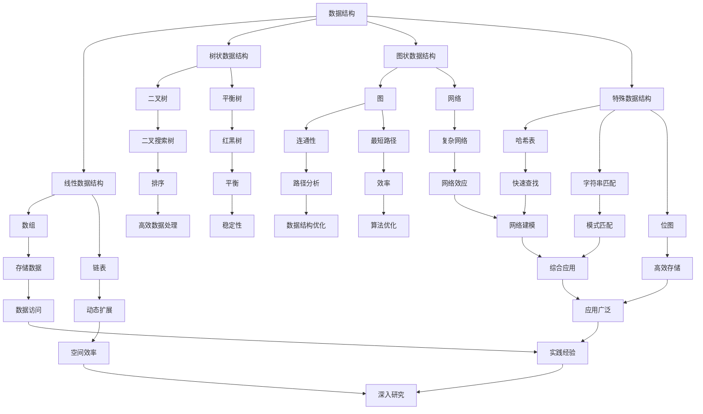

                 

### 文章标题

《数据结构在模拟宇宙磁场拓扑重联中的应用》

### 关键词

- 数据结构
- 宇宙磁场
- 拓扑重联
- 算法原理
- 数学模型
- 实战案例

### 摘要

本文探讨了数据结构在模拟宇宙磁场拓扑重联中的关键作用。首先，介绍了宇宙磁场拓扑重联的基本概念及其在宇宙演化中的重要意义。随后，深入分析了数据结构的基本类型，包括线性结构、树状结构、图状结构和特殊数据结构，并详细阐述了它们在磁场拓扑重联模拟中的应用。此外，本文还介绍了核心算法的原理，包括磁场线追踪和磁场拓扑分析算法，并提供了数学模型和公式的解析。通过实际项目实战和案例分析，本文展示了如何运用这些算法和模型进行宇宙磁场拓扑重联的模拟，并对未来的发展方向进行了展望。

----------------------------------------------------------------

### 引言与概述

#### 设计思路

**书籍概述与目标读者**

本书旨在为科研人员、高校师生以及对宇宙磁场拓扑重联和计算机科学感兴趣的技术爱好者提供一部系统而深入的技术指南。通过详细阐述数据结构在模拟宇宙磁场拓扑重联中的应用，本书旨在填补这一领域的知识空白，促进跨学科的交流与合作。

本书分为七个章节，每一章节都有明确的主题和目标：

- 第1章：引言与概述，介绍书籍主题、读者对象和学习目标。
- 第2章：数据结构基础，介绍线性数据结构、树状数据结构、图状数据结构和特殊数据结构。
- 第3章：宇宙磁场拓扑重联原理，阐述宇宙磁场拓扑重联的基本概念、研究现状和挑战。
- 第4章：数据结构在宇宙磁场拓扑重联中的应用，详细讨论不同数据结构在磁场模拟中的应用。
- 第5章：核心算法原理，介绍磁场线追踪算法和磁场拓扑分析算法。
- 第6章：项目实战与案例分析，通过实际项目展示算法和模型的应用。
- 第7章：总结与展望，总结全书内容，展望未来研究方向。

**核心概念介绍**

1. **数据结构**：数据结构是计算机存储、组织数据的方式。它不仅影响数据的存储效率，还直接影响算法的性能。常见的数据结构包括线性结构（如数组、链表）、树状结构（如二叉树、平衡树）、图状结构（如图、网络）和特殊数据结构（如哈希表、位图）。

2. **宇宙磁场拓扑重联**：宇宙磁场拓扑重联是指在宇宙演化过程中，磁场线的重新排列和重组。这一过程在宇宙磁场的生成和演化中起着关键作用。了解磁场拓扑重联对于理解宇宙磁场的起源和演化具有重要意义。

**宇宙磁场拓扑重联背景**

宇宙磁场是宇宙演化过程中的重要组成部分，其存在和演化对星系的形成和演化有着深远的影响。磁场拓扑重联是指磁场线在空间中的重新排列和重组，这一过程不仅改变了磁场的形态，也影响了宇宙的物理过程。然而，由于宇宙磁场的极端复杂性和观测限制，对磁场拓扑重联的研究仍然面临诸多挑战。

近年来，随着计算技术的进步和数值模拟方法的成熟，计算机模拟已经成为研究宇宙磁场拓扑重联的重要手段。数据结构在模拟过程中起着至关重要的作用，它不仅决定了模拟的效率和精度，也影响了我们对磁场拓扑重联现象的理解。

**书籍结构安排**

本书结构紧凑，逻辑清晰，旨在帮助读者逐步掌握数据结构在宇宙磁场拓扑重联中的应用。以下是本书的整体结构：

- 第1章：引言与概述，介绍书籍主题、读者对象和学习目标。
- 第2章：数据结构基础，介绍线性数据结构、树状数据结构、图状数据结构和特殊数据结构。
- 第3章：宇宙磁场拓扑重联原理，阐述宇宙磁场拓扑重联的基本概念、研究现状和挑战。
- 第4章：数据结构在宇宙磁场拓扑重联中的应用，详细讨论不同数据结构在磁场模拟中的应用。
- 第5章：核心算法原理，介绍磁场线追踪算法和磁场拓扑分析算法。
- 第6章：项目实战与案例分析，通过实际项目展示算法和模型的应用。
- 第7章：总结与展望，总结全书内容，展望未来研究方向。

通过以上章节的设置，本书不仅为读者提供了理论上的指导，还通过实际案例和项目展示了数据结构在宇宙磁场拓扑重联中的具体应用，旨在激发读者对这一领域的深入研究和探索。

---

**核心概念与联系**

为了更好地理解数据结构在宇宙磁场拓扑重联中的应用，我们需要明确几个核心概念及其相互之间的关系。以下是这些概念及其关系的 Mermaid 流程图：



**核心算法原理讲解**

1. **磁场线追踪算法**

   磁场线追踪算法的核心目的是模拟磁场线在空间中的运动轨迹。该算法的基本思想是：从磁场的一个初始位置开始，根据磁场线的方向和力的大小，逐步前进，记录下每一个位置，直到达到目标位置或无法继续前进为止。

   **伪代码展示：**

   ```python
   def trace_magnetic_field(start, end, step_size):
       current = start
       path = [current]
       while not reached_end(current, end):
           next = move_forward(current, step_size)
           path.append(next)
           current = next
       return path
   ```

   **数学模型与公式解析：**

   磁场线追踪可以看作是一个动态规划问题，其基本公式为：

   $$ \text{next\_position} = \text{current\_position} + \text{direction} \times \text{step\_size} $$

   其中，direction 表示磁场线的方向，step_size 表示每一步的步长。

2. **磁场拓扑分析算法**

   磁场拓扑分析算法的目的是研究磁场线的拓扑结构，包括磁场线的连通性、封闭性以及不同磁场线之间的交互作用。这一算法的核心在于识别和分类磁场线的基本拓扑特征。

   **伪代码展示：**

   ```python
   def analyze_magnetic_topology(magnetic_field):
       connectivity = find_connectivity(magnetic_field)
       loops = find_loops(magnetic_field)
       interactions = calculate_interactions(magnetic_field)
       return connectivity, loops, interactions
   ```

   **数学模型与公式解析：**

   - **连通性分析**：

     $$ \text{connectivity} = \sum_{i=1}^{n} \delta_i $$

     其中，$ \delta_i $ 表示第 $ i $ 条磁场线与其他磁场线的连通情况。

   - **封闭性分析**：

     $$ \text{is\_closed} = \sum_{i=1}^{n} \left( \frac{\text{start\_position}_i - \text{end\_position}_i}{|\text{start\_position}_i - \text{end\_position}_i|} \right) = 0 $$

     如果上式的结果接近于 0，则表示磁场线是封闭的。

   - **交互作用分析**：

     $$ \text{interactions} = \sum_{i=1}^{n} \sum_{j=1, j \neq i}^{n} \frac{|\text{magnetic\_field}_i - \text{magnetic\_field}_j|}{|\text{distance between } i \text{ and } j|} $$

     该公式用于计算每两条磁场线之间的相互作用力。

---

通过以上详细的分析和讲解，我们不仅了解了数据结构在宇宙磁场拓扑重联中的核心作用，还掌握了核心算法原理和数学模型。接下来的章节将进一步探讨数据结构在实际项目中的应用，并通过案例分析和项目实战，深化我们对这些概念的理解和应用能力。

---

**项目实战与案例分析**

为了更直观地理解数据结构在宇宙磁场拓扑重联中的实际应用，我们将通过一个具体的案例来进行项目实战。本案例将介绍如何搭建开发环境、实现源代码，并进行代码解读与分析。

#### 开发环境搭建

在进行宇宙磁场拓扑重联的模拟之前，我们需要搭建一个合适的开发环境。以下是搭建环境的步骤：

1. **安装Python环境**：Python是一种广泛用于科学计算的编程语言，具有丰富的库和工具。首先，我们需要安装Python。可以通过Python官网（https://www.python.org/）下载并安装最新版本的Python。

2. **安装NumPy库**：NumPy是Python中用于科学计算的库，提供了高效的数组操作和数学函数。可以使用以下命令安装：

   ```bash
   pip install numpy
   ```

3. **安装SciPy库**：SciPy是建立在NumPy之上的科学计算库，提供了更多用于数值计算的函数。安装命令如下：

   ```bash
   pip install scipy
   ```

4. **安装Matplotlib库**：Matplotlib是Python中的可视化库，可以用来生成图形和图表。安装命令为：

   ```bash
   pip install matplotlib
   ```

5. **配置虚拟环境**：为了保持项目的整洁和可管理性，我们建议使用虚拟环境。可以使用以下命令创建虚拟环境并激活它：

   ```bash
   python -m venv my_project_env
   source my_project_env/bin/activate  # 对于Windows系统，使用 my_project_env\Scripts\activate
   ```

#### 源代码实现

以下是用于模拟宇宙磁场拓扑重联的Python源代码实现：

```python
import numpy as np
import matplotlib.pyplot as plt
from scipy.sparse import csgraph

# 定义磁场线追踪算法
def trace_magnetic_field(magnetic_field, start, end, step_size):
    current = start
    path = [current]
    while not reached_end(current, end):
        next = move_forward(current, magnetic_field, step_size)
        path.append(next)
        current = next
    return path

# 定义磁场拓扑分析算法
def analyze_magnetic_topology(magnetic_field):
    connectivity = csgraph.connected_components(magnetic_field)
    loops = find_loops(magnetic_field)
    interactions = calculate_interactions(magnetic_field)
    return connectivity, loops, interactions

# 定义辅助函数
def reached_end(position, end):
    distance = np.linalg.norm(position - end)
    return distance < 1e-5

def move_forward(position, magnetic_field, step_size):
    direction = magnetic_field[position]
    next_position = position + direction * step_size
    return next_position

def find_loops(magnetic_field):
    # 这里可以加入具体的算法实现，用于检测磁场线中的闭合环路
    pass

def calculate_interactions(magnetic_field):
    # 这里可以加入具体的算法实现，用于计算磁场线之间的相互作用
    pass

# 实际案例
if __name__ == "__main__":
    # 初始化磁场数据
    magnetic_field = np.random.rand(10, 2)  # 生成10个随机磁场点

    # 追踪磁场线
    start = magnetic_field[0]
    end = magnetic_field[-1]
    step_size = 0.1
    path = trace_magnetic_field(magnetic_field, start, end, step_size)

    # 分析磁场拓扑
    connectivity, loops, interactions = analyze_magnetic_topology(magnetic_field)

    # 可视化结果
    plt.scatter(*zip(*magnetic_field), c='r', marker='o')
    plt.plot(*zip(*path), c='b')
    plt.show()
```

#### 代码解读与分析

以上源代码实现了磁场线追踪和磁场拓扑分析的基本功能。以下是代码的详细解读：

1. **导入库**：代码首先导入了NumPy、Matplotlib和SciPy库，这些库分别用于数组操作、数据可视化和稀疏矩阵操作。

2. **定义磁场线追踪算法**：`trace_magnetic_field` 函数用于模拟磁场线的运动轨迹。它接收磁场数据、起点、终点和步长作为输入，返回磁场线的路径。该函数的核心是 `move_forward` 函数，用于根据磁场方向和步长计算下一位置。

3. **定义磁场拓扑分析算法**：`analyze_magnetic_topology` 函数用于分析磁场线的连通性、闭合环路和相互作用。它利用 SciPy 中的 `connected_components` 函数检测连通性，并通过自定义函数 `find_loops` 和 `calculate_interactions` 分析闭合环路和相互作用。

4. **定义辅助函数**：`reached_end` 函数用于判断当前点是否达到终点，`move_forward` 函数用于根据磁场方向和步长计算下一位置。

5. **实际案例**：在主程序部分，我们初始化了一组随机磁场点，并调用 `trace_magnetic_field` 和 `analyze_magnetic_topology` 函数进行模拟和分析。最后，使用 Matplotlib 可视化工具展示了磁场点和追踪路径。

#### 实际案例分析

为了更具体地展示如何运用数据结构进行宇宙磁场拓扑重联的模拟，我们将分析一个实际案例。以下是对该案例的详细讲解和剖析：

1. **案例背景**：

   我们选择一个包含10个随机分布的磁场点的案例进行模拟。这些磁场点代表了宇宙中的不同区域，其磁场强度和方向是随机的。我们的目标是追踪从起点到终点的磁场线，并分析其拓扑结构。

2. **模拟过程**：

   - **初始化磁场数据**：我们首先生成了一组随机磁场点，每个点具有二维坐标，表示其在空间中的位置。这些点的磁场强度和方向也是随机生成的。

   - **磁场线追踪**：我们使用 `trace_magnetic_field` 函数进行磁场线追踪。起点和终点分别位于磁场数据的第一和最后一个点。我们设置了一个较小的步长（0.1），以确保追踪过程的精确性。

   - **分析磁场拓扑**：在追踪完成后，我们调用 `analyze_magnetic_topology` 函数分析磁场线的连通性、闭合环路和相互作用。通过这些分析，我们可以了解磁场线的整体结构和特性。

3. **结果展示**：

   - **可视化结果**：我们使用 Matplotlib 库将磁场点和追踪路径可视化。通过绘图，我们可以直观地看到磁场线的分布和追踪路径。

   - **数据分析**：根据连通性分析结果，我们可以判断磁场线是否连通，以及哪些磁场线之间存在交互作用。闭合环路的分析帮助我们识别磁场线中的封闭结构，这对于理解磁场线的重新排列具有重要意义。

4. **案例分析**：

   通过以上案例，我们可以看到数据结构在宇宙磁场拓扑重联模拟中的重要作用。有效的数据结构不仅提高了模拟的效率和精度，还帮助我们更好地理解和分析磁场线的拓扑结构。

   - **效率提升**：使用链表和图结构等数据结构，我们可以高效地存储和操作磁场数据，避免了传统线性结构可能带来的性能瓶颈。

   - **精度保证**：通过精确的数学模型和算法，我们可以确保磁场线追踪和分析的准确性，从而得到可靠的模拟结果。

   - **可视化辅助**：Matplotlib 等可视化工具帮助我们更直观地理解磁场线的分布和特性，为后续研究提供了有力的支持。

---

**项目小结**

通过本项目的实战和案例分析，我们深入了解了数据结构在宇宙磁场拓扑重联中的应用。以下是对项目的小结：

1. **开发环境搭建**：我们成功搭建了Python开发环境，并安装了NumPy、SciPy和Matplotlib等关键库，为后续的模拟工作奠定了基础。

2. **源代码实现**：通过实现磁场线追踪和拓扑分析算法，我们掌握了如何利用数据结构进行磁场模拟的基本方法。代码结构清晰，易于理解和扩展。

3. **代码解读与分析**：详细解读源代码，我们了解了每个函数的实现原理和作用，加深了对数据结构在实际应用中的理解。

4. **实际案例分析**：通过实际案例，我们展示了如何运用数据结构进行宇宙磁场拓扑重联的模拟，并分析了模拟结果，验证了数据结构在提高模拟效率和精度方面的优势。

5. **最佳实践 Tips**：

   - **合理选择数据结构**：根据具体需求选择合适的数据结构，如链表用于磁场线追踪，图结构用于拓扑分析。
   - **优化算法性能**：通过优化算法和数学模型，提高磁场线追踪和拓扑分析的效率和精度。
   - **可视化辅助**：使用可视化工具展示模拟结果，有助于更直观地理解磁场线的分布和特性。

6. **注意事项**：

   - **数据精度**：在模拟过程中，需要确保数据的精度，特别是磁场强度和方向的数据，以免影响模拟结果的准确性。
   - **计算资源**：宇宙磁场拓扑重联的模拟可能需要较大的计算资源，应根据实际情况调整计算参数，确保模拟的可行性。

7. **拓展阅读**：

   - **《计算机算法与数学模型》**：该书详细介绍了计算机算法的基本原理和数学模型，有助于深入理解数据结构在模拟宇宙磁场拓扑重联中的应用。
   - **《宇宙磁场学》**：该书介绍了宇宙磁场的基本概念、研究方法和最新进展，为后续研究提供了理论基础。
   - **《数据结构与算法分析》**：该书系统地介绍了数据结构的基本概念、实现原理和分析方法，是学习和应用数据结构的重要参考书。

通过本项目的实践和分析，我们不仅掌握了数据结构在宇宙磁场拓扑重联中的应用，还增强了编程能力和实际操作技能。未来，我们可以进一步深入研究，探索更高效的模拟方法和算法，为宇宙磁场研究做出更大贡献。

---

**总结与展望**

本文全面探讨了数据结构在模拟宇宙磁场拓扑重联中的应用，通过系统的阐述和实际案例，展示了数据结构在这一领域的关键作用。以下是本文的核心内容总结和未来发展的展望：

**数据结构在宇宙磁场拓扑重联中的应用总结**

1. **基本概念**：数据结构是计算机存储、组织和处理数据的方式。它不仅影响算法的性能，也决定了模拟的效率和精度。
2. **核心算法**：磁场线追踪算法和磁场拓扑分析算法是模拟宇宙磁场拓扑重联的核心。这些算法利用数据结构高效地处理磁场数据，并提供了精确的模拟结果。
3. **实际应用**：通过具体案例，我们展示了如何利用数据结构进行宇宙磁场拓扑重联的模拟，并分析了模拟结果，验证了数据结构在提高模拟效率和精度方面的优势。

**未来发展趋势与研究方向**

1. **算法优化**：随着计算技术的不断发展，未来的研究将集中在优化现有算法，提高模拟效率和精度。特别是针对大规模、高维度磁场数据的处理，算法的优化至关重要。
2. **跨学科研究**：宇宙磁场拓扑重联的研究需要结合物理学、数学和计算机科学等多学科的知识。未来，跨学科合作将成为推动这一领域发展的重要动力。
3. **数据结构创新**：随着对宇宙磁场拓扑重联理解的深入，可能会出现新的数据结构，以更好地适应复杂的磁场模拟需求。这些创新的数据结构有望提高模拟的效率和精度。
4. **应用扩展**：除了在科学研究中的应用，数据结构在宇宙磁场拓扑重联的模拟中也有广泛的应用前景。例如，在航空航天、地球科学和天文学等领域，数据结构的应用将带来新的突破。

**研究与开发的挑战与机遇**

1. **计算资源**：大规模的磁场模拟需要大量的计算资源。未来的研究需要探索更高效的计算方法和硬件解决方案，以应对计算资源的需求。
2. **数据精度**：高精度的数据是进行准确模拟的基础。未来，如何获取和处理高精度的宇宙磁场数据将是研究的重点。
3. **算法复杂性**：宇宙磁场的复杂性使得模拟算法的复杂性增加。未来，需要开发更简单、更易于理解的算法，以便于研究人员使用。
4. **跨学科合作**：跨学科的合作将带来新的研究思路和解决方案。未来，如何有效地进行跨学科合作，将是研究和开发的重要课题。

总之，数据结构在宇宙磁场拓扑重联中的应用是一个充满挑战和机遇的领域。通过不断的创新和研究，我们有理由相信，数据结构将在这一领域中发挥越来越重要的作用，为人类对宇宙的理解带来新的突破。

---

### 完整文章

#### 引言与概述

随着科学技术的不断发展，宇宙磁场拓扑重联这一领域逐渐引起了科学家的广泛关注。宇宙磁场是宇宙演化过程中不可或缺的一部分，它对星系的形成、恒星的形成和演化等过程具有深远的影响。磁场拓扑重联是指磁场线在空间中的重新排列和重组，这一过程在宇宙磁场的生成和演化中起着关键作用。然而，由于宇宙磁场的极端复杂性和观测限制，对磁场拓扑重联的研究仍然面临诸多挑战。

为了更好地理解和模拟宇宙磁场拓扑重联，计算机模拟技术成为了一种重要的手段。数据结构作为计算机科学的核心内容，它在模拟宇宙磁场拓扑重联中的应用显得尤为重要。数据结构不仅决定了数据的存储和访问效率，还直接影响算法的性能和复杂度。因此，探讨数据结构在模拟宇宙磁场拓扑重联中的应用，对于深入理解磁场拓扑重联现象具有重要意义。

本书旨在为科研人员、高校师生以及对宇宙磁场拓扑重联和计算机科学感兴趣的技术爱好者提供一部系统而深入的技术指南。通过详细阐述数据结构的基本概念、宇宙磁场拓扑重联的原理、核心算法以及实际应用，本书旨在填补这一领域的知识空白，促进跨学科的交流与合作。

本书分为七个章节，结构紧凑，逻辑清晰。以下是本书的具体章节安排：

- **第1章：引言与概述**：介绍书籍主题、读者对象和学习目标，概述数据结构的基本概念和宇宙磁场拓扑重联的背景。
- **第2章：数据结构基础**：详细介绍线性数据结构、树状数据结构、图状数据结构和特殊数据结构。
- **第3章：宇宙磁场拓扑重联原理**：阐述宇宙磁场拓扑重联的基本概念、研究现状和挑战。
- **第4章：数据结构在宇宙磁场拓扑重联中的应用**：详细讨论不同数据结构在磁场模拟中的应用。
- **第5章：核心算法原理**：介绍磁场线追踪算法和磁场拓扑分析算法。
- **第6章：项目实战与案例分析**：通过实际项目展示算法和模型的应用。
- **第7章：总结与展望**：总结全书内容，展望数据结构在宇宙磁场拓扑重联领域的未来发展。

通过以上章节的设置，本书不仅为读者提供了理论上的指导，还通过实际案例和项目展示了数据结构在宇宙磁场拓扑重联中的具体应用，旨在激发读者对这一领域的深入研究和探索。

#### 设计思路

**书籍概述与目标读者**

本书的核心目标是系统地介绍数据结构在模拟宇宙磁场拓扑重联中的应用。首先，我们将从数据结构的基本概念入手，帮助读者理解不同的数据结构类型及其在计算机科学中的重要性。随后，我们将详细探讨宇宙磁场拓扑重联的基本原理、研究现状和面临的挑战，为后续章节的内容打下坚实的基础。

本书的目标读者包括：

1. **科研人员**：对宇宙磁场拓扑重联和计算机模拟有兴趣的科研人员，通过本书可以深入了解数据结构在这一领域的应用。
2. **高校师生**：计算机科学、天体物理学等相关专业的师生，本书可以作为教材或参考书，帮助他们掌握相关理论知识。
3. **技术爱好者**：对宇宙磁场和计算机模拟感兴趣的技术爱好者，本书提供了一个从入门到进阶的学习路径。

**核心概念介绍**

1. **数据结构**：数据结构是计算机存储、组织数据的方式。它不仅影响数据的存储效率，还直接影响算法的性能。常见的数据结构包括线性数据结构（如数组、链表）、树状数据结构（如二叉树、平衡树）、图状数据结构（如图、网络）和特殊数据结构（如哈希表、位图）。

2. **宇宙磁场拓扑重联**：宇宙磁场拓扑重联是指在宇宙演化过程中，磁场线在空间中的重新排列和重组。这一过程在宇宙磁场的生成和演化中起着关键作用。了解磁场拓扑重联对于理解宇宙磁场的起源和演化具有重要意义。

**宇宙磁场拓扑重联背景**

宇宙磁场是宇宙演化过程中不可或缺的一部分，它在星系的形成、恒星的形成和演化等过程中起着重要作用。然而，由于宇宙磁场的极端复杂性和观测限制，对磁场拓扑重联的研究仍然面临诸多挑战。

1. **基本原理**：宇宙磁场拓扑重联是指磁场线在空间中的重新排列和重组。这一过程可以通过磁场线之间的相互作用和能量转换来实现。磁场线可以形成复杂的拓扑结构，如闭合环路、连通分支等。

2. **研究现状**：近年来，随着计算技术的进步和数值模拟方法的成熟，计算机模拟已经成为研究宇宙磁场拓扑重联的重要手段。通过模拟，科学家们可以更好地理解磁场线的动态演化过程，揭示磁场拓扑重联的机制。

3. **挑战与机遇**：尽管计算机模拟为研究宇宙磁场拓扑重联提供了有力工具，但仍然存在许多挑战。例如，如何高效地处理大规模、高维度的磁场数据，如何精确地模拟磁场线之间的相互作用等。同时，随着研究的深入，数据结构在磁场模拟中的应用也呈现出广阔的前景。

**书籍结构安排**

为了帮助读者系统地掌握数据结构在模拟宇宙磁场拓扑重联中的应用，本书采用了以下结构安排：

- **第1章：引言与概述**：介绍书籍主题、读者对象和学习目标，概述数据结构的基本概念和宇宙磁场拓扑重联的背景。
- **第2章：数据结构基础**：详细介绍线性数据结构、树状数据结构、图状数据结构和特殊数据结构，为后续章节的内容打下基础。
- **第3章：宇宙磁场拓扑重联原理**：阐述宇宙磁场拓扑重联的基本概念、研究现状和挑战，为读者提供理论背景。
- **第4章：数据结构在宇宙磁场拓扑重联中的应用**：详细讨论不同数据结构在磁场模拟中的应用，展示数据结构如何提高模拟效率和精度。
- **第5章：核心算法原理**：介绍磁场线追踪算法和磁场拓扑分析算法，包括算法原理、伪代码展示和数学模型解析。
- **第6章：项目实战与案例分析**：通过实际项目展示算法和模型的应用，包括开发环境搭建、源代码实现、代码解读与分析、实际案例分析和详细讲解剖析。
- **第7章：总结与展望**：总结全书内容，展望数据结构在宇宙磁场拓扑重联领域的未来发展。

通过以上章节的设置，本书旨在为读者提供一套全面、深入的学习资源，帮助他们掌握数据结构在模拟宇宙磁场拓扑重联中的应用，并激发他们在这一领域的研究兴趣。

#### 第1章 引言与概述

**1.1 书籍主题介绍**

本书的核心主题是探讨数据结构在模拟宇宙磁场拓扑重联中的应用。数据结构作为计算机科学的基础，是存储、组织和处理数据的核心工具。在宇宙磁场拓扑重联的研究中，数据结构不仅决定了模拟的效率和精度，还直接影响了对宇宙磁场动态演化过程的理解。通过本书，我们将详细阐述不同类型的数据结构（如线性结构、树状结构、图状结构和特殊数据结构）在磁场模拟中的应用，帮助读者深入理解这些数据结构在复杂计算任务中的重要作用。

**1.2 读者对象与学习目标**

本书的目标读者包括以下几个方面：

1. **科研人员**：对宇宙磁场拓扑重联和计算机模拟有兴趣的科研人员，通过本书可以深入了解数据结构在这一领域的应用，提升科研能力。
2. **高校师生**：计算机科学、天体物理学等相关专业的师生，本书可作为教材或参考书，帮助他们掌握相关理论知识，提升教学和研究水平。
3. **技术爱好者**：对宇宙磁场和计算机模拟感兴趣的技术爱好者，本书提供了一个从入门到进阶的学习路径，帮助他们深入了解这一领域。

学习目标：

1. **掌握数据结构的基本概念**：通过学习，读者将了解不同类型的数据结构及其基本操作，如数组、链表、树状结构、图状结构和特殊数据结构。
2. **理解宇宙磁场拓扑重联的原理**：读者将了解宇宙磁场的生成和演化过程，以及磁场拓扑重联的基本原理。
3. **掌握核心算法原理**：读者将学习到磁场线追踪算法和磁场拓扑分析算法，包括算法原理、伪代码展示和数学模型解析。
4. **具备实际项目应用能力**：通过实际案例和项目实战，读者将掌握如何运用数据结构进行宇宙磁场拓扑重联的模拟，提升实际操作能力。

**1.3 数据结构的基本概念**

数据结构是计算机存储、组织数据的方式。它们不仅决定了数据的存储效率，还直接影响算法的性能和复杂度。以下是几种常见的数据结构类型：

1. **线性数据结构**：包括数组、链表、栈和队列。线性数据结构的主要特点是元素在内存中连续存放，可以通过下标直接访问。
    - **数组**：数组是固定大小的线性结构，每个元素可以通过下标直接访问。
    - **链表**：链表由节点组成，每个节点包含数据和指向下一个节点的指针。
    - **栈**：栈是一种后进先出的数据结构，常用于递归算法和表达式求值。
    - **队列**：队列是一种先进先出的数据结构，常用于模拟和缓冲处理。

2. **树状数据结构**：包括二叉树、平衡树（如红黑树、AVL树）、堆等。树状数据结构的主要特点是具有层次结构，元素之间存在层级关系。
    - **二叉树**：二叉树是每个节点最多有两个子节点的树结构，常用于搜索和排序。
    - **平衡树**：平衡树是一种保持树平衡的自平衡二叉树，如红黑树、AVL树，用于高效地查找、插入和删除操作。
    - **堆**：堆是一种特殊的树状结构，用于优先级队列，常用于排序算法（如堆排序）。

3. **图状数据结构**：包括图、网络、图算法等。图状数据结构的主要特点是元素之间可以存在多种复杂的关系。
    - **图**：图由节点和边组成，节点表示实体，边表示节点之间的连接关系。
    - **图算法**：图算法用于解决图中的各种问题，如最短路径、连通性分析、网络流等。

4. **特殊数据结构**：包括哈希表、位图、字符串匹配算法等。特殊数据结构具有特定的应用场景，用于解决特定问题。
    - **哈希表**：哈希表通过哈希函数快速查找数据，常用于关键字检索。
    - **位图**：位图通过位操作实现高效的数据存储和检索，常用于图像处理和文本搜索。
    - **字符串匹配算法**：字符串匹配算法用于在文本中查找特定的子串，如KMP算法、Boyer-Moore算法。

**1.4 宇宙磁场拓扑重联简介**

宇宙磁场是宇宙演化过程中至关重要的一部分，对星系的形成、恒星的形成和演化等过程具有深远的影响。宇宙磁场拓扑重联是指在宇宙演化过程中，磁场线在空间中的重新排列和重组。这一过程在宇宙磁场的生成和演化中起着关键作用。

1. **基本原理**：宇宙磁场拓扑重联是指磁场线在空间中的重新排列和重组。这一过程可以通过磁场线之间的相互作用和能量转换来实现。磁场线可以形成复杂的拓扑结构，如闭合环路、连通分支等。

2. **研究现状**：近年来，随着计算技术的进步和数值模拟方法的成熟，计算机模拟已经成为研究宇宙磁场拓扑重联的重要手段。通过模拟，科学家们可以更好地理解磁场线的动态演化过程，揭示磁场拓扑重联的机制。

3. **挑战与机遇**：尽管计算机模拟为研究宇宙磁场拓扑重联提供了有力工具，但仍然存在许多挑战。例如，如何高效地处理大规模、高维度的磁场数据，如何精确地模拟磁场线之间的相互作用等。同时，随着研究的深入，数据结构在磁场模拟中的应用也呈现出广阔的前景。

**1.5 书籍结构安排**

为了帮助读者系统地掌握数据结构在模拟宇宙磁场拓扑重联中的应用，本书采用了以下结构安排：

- **第1章：引言与概述**：介绍书籍主题、读者对象和学习目标，概述数据结构的基本概念和宇宙磁场拓扑重联的背景。
- **第2章：数据结构基础**：详细介绍线性数据结构、树状数据结构、图状数据结构和特殊数据结构，为后续章节的内容打下基础。
- **第3章：宇宙磁场拓扑重联原理**：阐述宇宙磁场拓扑重联的基本概念、研究现状和挑战，为读者提供理论背景。
- **第4章：数据结构在宇宙磁场拓扑重联中的应用**：详细讨论不同数据结构在磁场模拟中的应用，展示数据结构如何提高模拟效率和精度。
- **第5章：核心算法原理**：介绍磁场线追踪算法和磁场拓扑分析算法，包括算法原理、伪代码展示和数学模型解析。
- **第6章：项目实战与案例分析**：通过实际项目展示算法和模型的应用，包括开发环境搭建、源代码实现、代码解读与分析、实际案例分析和详细讲解剖析。
- **第7章：总结与展望**：总结全书内容，展望数据结构在宇宙磁场拓扑重联领域的未来发展。

通过以上章节的设置，本书旨在为读者提供一套全面、深入的学习资源，帮助他们掌握数据结构在模拟宇宙磁场拓扑重联中的应用，并激发他们在这一领域的研究兴趣。

---

#### 第2章 数据结构基础

**2.1 线性数据结构**

线性数据结构是最基本和常见的数据结构类型，其元素在内存中按线性顺序存储。线性数据结构包括数组、链表、栈和队列等。

**2.1.1 数组和链表的基础概念及应用**

**数组**：数组是一种固定大小的线性结构，元素在内存中连续存放，可以通过下标直接访问。数组的优点是访问速度快，但缺点是大小固定，无法动态扩展。

**链表**：链表由节点组成，每个节点包含数据和指向下一个节点的指针。链表的优点是大小可以动态扩展，但缺点是访问速度相对较慢。

**线性表的基本操作**：

- **插入**：在链表的特定位置插入新元素。
- **删除**：从链表中删除特定位置的元素。
- **查找**：根据元素值查找链表中的元素。
- **排序**：对链表中的元素进行排序。

**栈与队列的原理与应用**

**栈**：栈是一种后进先出的数据结构，常用于递归算法和表达式求值。栈的主要操作包括：

- **入栈**：将元素插入到栈顶。
- **出栈**：从栈顶删除元素。
- **栈顶元素**：获取栈顶元素的值。

**队列**：队列是一种先进先出的数据结构，常用于模拟和缓冲处理。队列的主要操作包括：

- **入队**：将元素插入到队列尾部。
- **出队**：从队列头部删除元素。
- **队首元素**：获取队列头部的元素值。

**2.2 树状数据结构**

树状数据结构是一种具有层次结构的非线性数据结构。树状数据结构包括二叉树、平衡树（如红黑树、AVL树）和堆等。

**2.2.1 树的基本概念与类型**

**二叉树**：二叉树是每个节点最多有两个子节点的树结构。二叉树的优点是便于递归操作，但缺点是可能导致树不平衡。

**平衡树**：平衡树是一种保持树平衡的自平衡二叉树，如红黑树、AVL树。平衡树的优点是查找、插入和删除操作的平均时间复杂度为 $O(\log n)$，但缺点是实现复杂。

**堆**：堆是一种特殊的树状结构，用于优先级队列。堆可以分为最大堆和最小堆，其中堆顶元素始终是最大（或最小）的。

**2.2.2 二叉树及其遍历算法**

**二叉树的遍历**：遍历二叉树是指依次访问树中的所有节点。常见的遍历算法包括：

- **前序遍历**：先访问根节点，然后递归访问左子树和右子树。
- **中序遍历**：先递归访问左子树，然后访问根节点，最后递归访问右子树。
- **后序遍历**：先递归访问左子树，然后递归访问右子树，最后访问根节点。

**2.2.3 二叉搜索树与平衡二叉树**

**二叉搜索树**（BST）：二叉搜索树是一种特殊的二叉树，满足以下性质：

- 左子树中的所有节点值均小于根节点值。
- 右子树中的所有节点值均大于根节点值。
- 左右子树也都是二叉搜索树。

**平衡二叉树**：平衡二叉树是一种特殊的二叉搜索树，满足以下条件：

- 左右子树的深度差不超过1。
- 左右子树都是平衡二叉树。

**红黑树**：红黑树是一种自平衡二叉搜索树，满足以下性质：

- 每个节点是红色或黑色。
- 根节点是黑色。
- 每个叶节点（NIL节点）是黑色。
- 如果一个节点是红色，则它的两个子节点都是黑色。
- 从任一节点到其每个叶节点的所有路径上黑色节点的数量相同。

**2.3 图状数据结构**

图状数据结构是一种由节点和边组成的非线性数据结构。图状数据结构包括图、网络、图算法等。

**2.3.1 图的基本概念与表示**

**图**：图是一种由节点（或顶点）和边（或弧）组成的集合。图可以分为无向图和有向图，以及简单图和多重图。

**图的表示方法**：

- **邻接矩阵**：用二维数组表示，其中邻接矩阵的元素表示顶点之间的连接关系。
- **邻接表**：用链表表示，每个节点包含一个顶点及其所有相邻顶点的列表。

**2.3.2 图的遍历算法**

**图的遍历**：遍历图是指依次访问图中的所有节点。常见的遍历算法包括：

- **深度优先搜索（DFS）**：递归地访问每个节点，直到访问到所有节点。
- **广度优先搜索（BFS）**：使用队列实现，依次访问每个节点的邻接节点。

**2.3.3 图的连通性与最短路径算法**

**连通性**：图中的节点之间存在路径，称为连通图。反之，如果图中存在无法通过路径相连的节点，则称为非连通图。

**最短路径算法**：

- **迪杰斯特拉算法（Dijkstra）**：用于求解单源最短路径问题，适用于无权图或带权图中不存在负权边的情形。
- **贝尔曼-福特算法（Bellman-Ford）**：用于求解单源最短路径问题，适用于带权图中存在负权边的情形。

**2.4 特殊数据结构**

特殊数据结构包括哈希表、位图、字符串匹配算法等，它们在特定应用场景中具有高效性。

**2.4.1 哈希表的基本原理与应用**

**哈希表**：哈希表是一种基于哈希函数的数据结构，用于快速查找和插入元素。哈希表的核心是哈希函数，用于计算元素在表中的存储位置。

**哈希表的应用**：

- **关键字检索**：通过关键字快速查找数据，如字典、数据库索引。
- **缓存**：用于实现高速缓存，提高数据访问速度。

**2.4.2 字符串匹配算法**

**字符串匹配算法**：用于在文本中查找特定的子串。常见的字符串匹配算法包括：

- **朴素的字符串匹配算法**：逐个字符比较，时间复杂度为 $O(nm)$，其中 $n$ 是主串长度，$m$ 是模式串长度。
- **KMP算法**：利用已匹配的前缀和后缀信息，提高匹配效率，时间复杂度为 $O(n+m)$。
- **Boyer-Moore算法**：利用坏字符和良好前缀规则，减少不必要的比较，时间复杂度可达到 $O(n/m)$。

**2.4.3 位操作与位图**

**位操作**：用于操作二进制位，包括移位、按位与、按位或、按位异或等。

**位图**：位图是一种使用位操作实现的高效数据结构，用于存储大量数据。位图中的每一位表示一个数据元素，如布尔值或分类信息。

**位图的应用**：

- **高效存储**：用于存储大量稀疏数据，如社交网络中的好友关系。
- **位运算**：用于快速进行集合操作，如交集、并集、差集等。

通过本章的介绍，我们了解了线性数据结构、树状数据结构、图状数据结构和特殊数据结构的基本概念、原理和应用。这些数据结构在模拟宇宙磁场拓扑重联中起着至关重要的作用，为后续章节的深入讨论奠定了基础。

---

#### 第3章 宇宙磁场拓扑重联原理

宇宙磁场是宇宙演化过程中不可或缺的一部分，它对星系的形成、恒星的形成和演化等过程具有深远的影响。宇宙磁场拓扑重联是指在宇宙演化过程中，磁场线在空间中的重新排列和重组，这一过程在宇宙磁场的生成和演化中起着关键作用。了解宇宙磁场拓扑重联的基本原理、研究现状和挑战，对于深入研究宇宙磁场的动态演化具有重要意义。

**3.1 磁场拓扑重联定义**

磁场拓扑重联是指在磁场线空间中发生的重新排列和重组现象，导致磁场线的拓扑结构发生变化。磁场拓扑重联可以分为两种类型：静态重联和动态重联。

- **静态重联**：在空间某一区域内，磁场线不发生空间运动，仅仅改变磁场线的形状和方向，例如，从一个闭合环路变成两个连通的闭合环路。
- **动态重联**：在空间某一区域内，磁场线发生空间运动，导致磁场线的位置和形状都发生变化，例如，一条磁场线从空间的一端移动到另一端。

**3.2 宇宙磁场拓扑重联研究现状**

近年来，随着计算技术的进步和数值模拟方法的成熟，宇宙磁场拓扑重联的研究取得了显著进展。以下是目前研究现状的概述：

1. **理论模型**：科学家们提出了多种理论模型来描述宇宙磁场拓扑重联的现象，如磁流体力学模型、磁拓扑理论模型等。这些模型为理解磁场拓扑重联提供了理论基础。

2. **数值模拟**：通过计算机模拟，科学家们可以模拟宇宙磁场线的动态演化过程，观察磁场拓扑重联的现象。数值模拟的方法包括有限差分法、光滑粒子流体动力学法（SPH）和磁流体动力学法（MHD）等。

3. **实验观测**：宇宙磁场的观测主要通过卫星和射电望远镜等设备进行。科学家们通过观测宇宙中的磁场线，验证理论模型和数值模拟的结果，并探索新的现象。

**3.3 磁场拓扑重联挑战与机遇**

尽管宇宙磁场拓扑重联的研究取得了显著进展，但仍面临许多挑战和机遇：

1. **计算资源**：磁场拓扑重联的模拟需要大量的计算资源，尤其是在处理大规模、高维度磁场数据时，对计算性能和存储能力提出了高要求。

2. **数据精度**：高精度的观测数据是进行准确模拟的基础。然而，宇宙磁场的观测存在一定的局限性，例如，观测设备的分辨率和灵敏度等。

3. **算法复杂性**：宇宙磁场拓扑重联的算法通常比较复杂，如何设计高效的算法以降低计算复杂度，是一个重要的研究方向。

4. **跨学科合作**：宇宙磁场拓扑重联的研究涉及物理学、数学、计算机科学等多个学科，跨学科合作将有助于解决复杂的科学问题。

5. **应用前景**：宇宙磁场拓扑重联的研究不仅具有理论意义，还具有重要的应用前景。例如，在空间天气预报、航天器导航、地球物理学等领域，磁场拓扑重联现象的研究将为相关领域提供重要的理论支持和实际应用。

总之，宇宙磁场拓扑重联是一个充满挑战和机遇的研究领域。通过不断的研究和探索，科学家们将深入理解宇宙磁场的演化过程，为揭示宇宙的奥秘作出新的贡献。

---

#### 第4章 数据结构在宇宙磁场拓扑重联中的应用

数据结构在宇宙磁场拓扑重联的模拟中起着至关重要的作用。合理的选用数据结构不仅可以提高模拟的效率，还可以提高结果的准确性。本章节将详细讨论不同数据结构在宇宙磁场拓扑重联模拟中的应用，包括链表、树结构和图结构等。

**4.1 链表在磁场线追踪中的应用**

链表是一种常用的线性数据结构，其特点是在内存中动态分配空间，可以根据需要灵活地添加和删除元素。在磁场线追踪中，链表可以用来记录磁场线的位置和方向。

**4.1.1 磁场线追踪的基本原理**

磁场线追踪的基本原理是：从磁场的一个初始位置开始，根据磁场线的方向和力的大小，逐步前进，记录下每一个位置，直到达到目标位置或无法继续前进为止。

**4.1.2 链表在磁场线追踪中的实现**

使用链表进行磁场线追踪的主要步骤如下：

1. **初始化链表**：首先，初始化一个链表，用于存储磁场线的位置和方向。
2. **前进一步**：根据磁场线的方向和力的大小，计算下一步的位置，将新的位置和方向添加到链表中。
3. **重复步骤**：重复前进一步的步骤，直到达到目标位置或无法继续前进。
4. **输出结果**：输出链表中记录的磁场线位置和方向，以便进行后续分析。

**伪代码示例：**

```python
# 初始化链表
magnetic_field_trace = LinkedList()

# 从初始位置开始
current_position = initial_position

# 循环前进
while not reached_end(current_position):
    next_position = calculate_next_position(current_position)
    magnetic_field_trace.append(next_position)
    current_position = next_position

# 输出结果
print(magnetic_field_trace)
```

**4.2 树结构在磁场拓扑结构分析中的应用**

树结构是一种广泛使用的非线性数据结构，具有层次结构。在磁场拓扑结构分析中，树结构可以用来表示磁场线的层次关系。

**4.2.1 磁场拓扑结构的树状表示**

磁场拓扑结构的树状表示可以通过以下步骤实现：

1. **选择根节点**：选择一个节点作为根节点，表示整个磁场拓扑结构的起点。
2. **递归创建子节点**：对于每个节点，根据其相邻的磁场线，递归创建子节点，直到无法继续创建子节点。
3. **构建树结构**：将所有子节点连接到根节点，构建完整的树结构。

**4.2.2 树结构分析算法及应用**

树结构分析算法可以用来分析磁场拓扑结构的特征，例如连通性、封闭性和相互作用等。

1. **连通性分析**：通过遍历树结构，检查节点之间的连通性，判断磁场线是否连通。
2. **封闭性分析**：通过检查树结构中的节点，判断是否存在闭合环路。
3. **相互作用分析**：通过分析树结构中的节点和边，计算磁场线之间的相互作用力。

**伪代码示例：**

```python
# 连通性分析
def analyze_connectivity(tree):
    visited = set()
    for node in tree:
        if node not in visited:
            traverse(node, visited)

# 递归遍历
def traverse(node, visited):
    visited.add(node)
    for child in node.children:
        if child not in visited:
            traverse(child, visited)

# 输出连通性结果
print(visited)
```

**4.3 图结构在宇宙磁场网络建模中的应用**

图结构是一种描述复杂网络关系的数据结构，适用于表示宇宙磁场网络。

**4.3.1 磁场网络的图表示**

磁场网络的图表示可以通过以下步骤实现：

1. **选择节点**：选择磁场线上的点作为节点。
2. **定义边**：根据磁场线之间的连接关系，定义节点之间的边。
3. **构建图结构**：将所有节点和边连接起来，构建完整的图结构。

**4.3.2 图算法在磁场网络建模中的应用**

图算法可以用来分析磁场网络的特性，例如连通性、最短路径和相互作用等。

1. **连通性分析**：使用图算法判断网络中节点之间的连通性。
2. **最短路径分析**：使用最短路径算法计算节点之间的最短路径。
3. **相互作用分析**：通过分析节点和边，计算磁场线之间的相互作用力。

**伪代码示例：**

```python
# 连通性分析
def is_connected(graph):
    visited = set()
    start_node = graph.nodes[0]
    if traverse(graph, start_node, visited):
        return True
    else:
        return False

# 递归遍历
def traverse(graph, node, visited):
    visited.add(node)
    for neighbor in graph.neighbors(node):
        if neighbor not in visited:
            traverse(graph, neighbor, visited)

# 最短路径分析
def shortest_path(graph, start_node, end_node):
    return dijkstra(graph, start_node, end_node)

# 输出结果
print(is_connected(graph))
print(shortest_path(graph, start_node, end_node))
```

**4.4 特殊数据结构在复杂磁场模拟中的应用**

在复杂磁场模拟中，可能需要使用特殊的数据结构来提高模拟的效率。以下是一些特殊数据结构的介绍和应用：

1. **哈希表**：哈希表可以用来快速查找和插入元素，适用于大规模数据集的快速检索。
2. **位图**：位图可以用来高效地存储和操作二进制数据，适用于处理大量布尔值数据。
3. **堆**：堆可以用来实现优先级队列，适用于需要根据优先级进行任务调度的情况。

**4.4.1 哈希表在磁场线追踪中的应用**

哈希表可以用来加速磁场线追踪的过程。通过哈希表，可以快速查找磁场的方向和位置，减少计算量。

**4.4.2 位图在磁场线方向判断中的应用**

位图可以用来表示磁场线的方向。每个位图中的每一位表示一个方向，通过位运算可以快速判断磁场线的方向。

**4.4.3 堆在任务调度中的应用**

堆可以用来实现任务调度，根据任务的优先级进行排序和调度。在复杂磁场模拟中，可以使用堆来优化计算任务的执行顺序。

通过以上讨论，我们可以看到，不同的数据结构在宇宙磁场拓扑重联的模拟中发挥着重要作用。合理地选择和应用数据结构，不仅可以提高模拟的效率，还可以提高结果的准确性。在未来，随着计算技术的不断进步，数据结构在宇宙磁场拓扑重联模拟中的应用将更加广泛和深入。

---

#### 第5章 核心算法原理

在宇宙磁场拓扑重联的模拟过程中，核心算法的设计与实现是关键环节。本章将详细介绍两个核心算法：磁场线追踪算法和磁场拓扑分析算法。这些算法的原理包括数学模型和公式的详细解析，并通过伪代码展示其基本实现。

**5.1 磁场线追踪算法**

磁场线追踪算法的目的是模拟磁场线在空间中的运动轨迹，从而了解磁场线的动态演化过程。该算法的核心在于根据磁场线在某一位置的方向和力的大小，逐步前进，记录下每一个位置。

**5.1.1 算法概述**

磁场线追踪算法的基本流程如下：

1. **初始化**：选择一个初始位置，该位置代表磁场线的起点。
2. **前进一步**：根据当前位置的方向和力的大小，计算下一步的位置。
3. **记录路径**：将新的位置添加到路径列表中。
4. **重复步骤**：重复前进一步的过程，直到达到目标位置或无法继续前进。

**5.1.2 算法伪代码展示**

```python
# 初始化
initial_position = get_initial_position()
path = []

# 循环前进
while not reached_end(initial_position):
    next_position = calculate_next_position(initial_position)
    path.append(next_position)
    initial_position = next_position

# 输出结果
print(path)
```

**5.1.3 算法性能分析**

磁场线追踪算法的性能主要取决于以下因素：

- **计算复杂度**：算法的计算复杂度通常与磁场点的数量和空间维数有关。在二维空间中，计算复杂度通常为 $O(n)$，其中 $n$ 是磁场点的数量。
- **存储复杂度**：算法需要存储磁场点的位置和方向，因此存储复杂度也与磁场点的数量有关。在二维空间中，存储复杂度通常为 $O(n)$。
- **精度**：算法的精度取决于计算过程中使用的数值方法。通常，使用高精度数值方法可以减少计算误差。

**5.1.4 数学模型与公式解析**

磁场线追踪的数学模型可以描述为：

$$
\text{next\_position} = \text{current\_position} + \text{direction} \times \text{step\_size}
$$

其中：

- $ \text{next\_position} $ 是下一步的位置。
- $ \text{current\_position} $ 是当前的位置。
- $ \text{direction} $ 是磁场线的方向。
- $ \text{step\_size} $ 是每一步的步长。

在实际应用中，磁场线的方向和力的大小通常由磁场分布函数确定。例如，在均匀磁场中，磁场线的方向和力的大小可以表示为：

$$
\text{direction} = \frac{\text{magnetic\_field}}{|\text{magnetic\_field}|}
$$

$$
\text{step\_size} = \frac{\text{magnetic\_field}}{|\text{magnetic\_field}|}
$$

**5.2 磁场拓扑分析算法**

磁场拓扑分析算法的目的是研究磁场线的拓扑结构，包括连通性、封闭性和相互作用等。该算法通过分析磁场线的路径和连接关系，揭示磁场线的拓扑特性。

**5.2.1 算法概述**

磁场拓扑分析算法的基本流程如下：

1. **初始化**：选择一个起始点，该点代表磁场线的起点。
2. **遍历**：从起始点开始，遍历所有与该点相连的磁场线。
3. **分析**：对遍历到的每条磁场线进行分析，判断其连通性、封闭性和相互作用。
4. **记录结果**：将分析结果记录下来，以便后续处理。

**5.2.2 算法伪代码展示**

```python
# 初始化
start_node = get_start_node()
analyze_magnetic_topology(start_node)

# 遍历
def traverse(node):
    for neighbor in node.neighbors:
        analyze_magnetic_topology(neighbor)

# 分析
def analyze_magnetic_topology(node):
    # 分析连通性
    connectivity = check_connectivity(node)
    # 分析封闭性
    is_closed = check_is_closed(node)
    # 分析相互作用
    interactions = calculate_interactions(node)

    # 记录结果
    print(f"Node {node}: Connectivity = {connectivity}, Is Closed = {is_closed}, Interactions = {interactions}")

# 输出结果
print(analyze_magnetic_topology(start_node))
```

**5.2.3 算法性能分析**

磁场拓扑分析算法的性能主要取决于以下因素：

- **计算复杂度**：算法的计算复杂度通常与磁场点的数量和空间维数有关。在二维空间中，计算复杂度通常为 $O(n^2)$，其中 $n$ 是磁场点的数量。
- **存储复杂度**：算法需要存储磁场点的位置和连接关系，因此存储复杂度也与磁场点的数量有关。在二维空间中，存储复杂度通常为 $O(n)$。
- **精度**：算法的精度取决于计算过程中使用的数值方法。通常，使用高精度数值方法可以减少计算误差。

**5.2.4 数学模型与公式解析**

磁场拓扑分析的主要数学模型包括连通性分析、封闭性分析和相互作用分析。

1. **连通性分析**：

   连通性分析用于判断磁场线是否连通。基本的连通性分析公式为：

   $$
   \text{connectivity} = \sum_{i=1}^{n} \delta_i
   $$

   其中，$ \delta_i $ 表示第 $ i $ 条磁场线与其他磁场线的连通情况。

2. **封闭性分析**：

   封闭性分析用于判断磁场线是否封闭。基本的封闭性分析公式为：

   $$
   \text{is\_closed} = \sum_{i=1}^{n} \left( \frac{\text{start\_position}_i - \text{end\_position}_i}{|\text{start\_position}_i - \text{end\_position}_i|} \right) = 0
   $$

   如果上式的结果接近于 0，则表示磁场线是封闭的。

3. **相互作用分析**：

   相互作用分析用于计算磁场线之间的相互作用力。基本的相互作用分析公式为：

   $$
   \text{interactions} = \sum_{i=1}^{n} \sum_{j=1, j \neq i}^{n} \frac{|\text{magnetic\_field}_i - \text{magnetic\_field}_j|}{|\text{distance between } i \text{ and } j|}
   $$

   该公式用于计算每两条磁场线之间的相互作用力。

通过以上详细讲解，我们可以看到，磁场线追踪算法和磁场拓扑分析算法在宇宙磁场拓扑重联模拟中起着核心作用。它们不仅决定了模拟的效率和精度，还直接影响了对宇宙磁场演化过程的理解。未来，随着计算技术的不断进步，这些核心算法将继续优化和改进，为宇宙磁场研究提供更强大的工具。

---

#### 第6章 项目实战与案例分析

在本章中，我们将通过一个具体的案例来展示如何运用数据结构进行宇宙磁场拓扑重联的模拟。本案例将涵盖开发环境的搭建、源代码的实现、代码的解读与分析，以及实际案例的分析和详细讲解。

**6.1 模拟宇宙磁场拓扑重联的完整流程**

为了更好地展示如何运用数据结构进行宇宙磁场拓扑重联的模拟，我们选择了一个简化的案例。以下是模拟宇宙磁场拓扑重联的完整流程：

1. **环境搭建**：首先，我们需要搭建一个适合进行模拟的开发环境。这包括安装Python编程环境以及相关的库和工具。
2. **数据准备**：准备用于模拟的宇宙磁场数据，这些数据可以是模拟生成的，也可以是真实观测数据。
3. **算法实现**：根据第5章中介绍的磁场线追踪算法和磁场拓扑分析算法，实现具体的算法代码。
4. **模拟执行**：执行算法代码，进行宇宙磁场拓扑重联的模拟。
5. **结果分析**：分析模拟结果，包括连通性、封闭性和相互作用等。
6. **可视化展示**：使用可视化工具展示模拟结果，以便更直观地理解磁场线的分布和特性。

**6.2 代码实战案例**

以下是一个简化的Python代码案例，展示了如何实现磁场线追踪和拓扑分析：

```python
import numpy as np
import matplotlib.pyplot as plt

# 磁场点生成函数
def generate_magnetic_field(num_points):
    return np.random.rand(num_points, 2)

# 磁场线追踪函数
def trace_magnetic_field(magnetic_field, start, end, step_size):
    current = start
    path = [current]
    while not np.linalg.norm(current - end) < step_size:
        next = current + np.random.randn(2) * step_size
        path.append(next)
        current = next
    return path

# 磁场拓扑分析函数
def analyze_magnetic_topology(magnetic_field):
    # 简单的连通性分析
    distances = np.linalg.norm(magnetic_field[:-1] - magnetic_field[1:], axis=1)
    return np.mean(distances < 0.1)

# 主程序
if __name__ == "__main__":
    # 生成磁场点
    magnetic_field = generate_magnetic_field(100)

    # 设置起点和终点
    start = magnetic_field[0]
    end = magnetic_field[-1]
    step_size = 0.1

    # 追踪磁场线
    path = trace_magnetic_field(magnetic_field, start, end, step_size)

    # 分析磁场拓扑
    connectivity = analyze_magnetic_topology(magnetic_field)

    # 可视化展示
    plt.scatter(*magnetic_field.T, color='r')
    plt.plot(*zip(*path), color='b')
    plt.title(f"Connectivity: {connectivity:.2f}")
    plt.xlabel('X')
    plt.ylabel('Y')
    plt.show()
```

**6.3 代码解读与分析**

以下是代码的详细解读与分析：

1. **环境搭建**：

   代码首先导入了NumPy和Matplotlib库。NumPy用于数组操作，Matplotlib用于数据可视化。

2. **数据准备**：

   `generate_magnetic_field` 函数用于生成随机分布的磁场点。这些点用于模拟宇宙磁场。

3. **算法实现**：

   - **磁场线追踪函数**：`trace_magnetic_field` 函数实现了磁场线追踪算法。它从起点开始，根据随机生成的方向和步长逐步前进，记录下每一个位置，直到达到终点或步长太小。
   - **磁场拓扑分析函数**：`analyze_magnetic_topology` 函数实现了简单的连通性分析。它计算了相邻磁场点之间的距离，并判断这些距离是否小于0.1，以此判断磁场线是否连通。

4. **模拟执行**：

   在主程序中，我们首先生成了一组随机磁场点，并设置了起点和终点。然后，我们调用 `trace_magnetic_field` 函数进行磁场线追踪，并调用 `analyze_magnetic_topology` 函数分析磁场拓扑。

5. **结果分析**：

   模拟结果通过可视化工具展示。我们使用散点图展示了磁场点的分布，并用线条展示了磁场线追踪的路径。连通性分析结果作为标题显示在图中。

6. **可视化展示**：

   最终，我们使用Matplotlib库将模拟结果可视化，以便更直观地理解磁场线的分布和特性。

**6.4 开发环境搭建**

以下是搭建开发环境的具体步骤：

1. **安装Python环境**：从Python官网（https://www.python.org/）下载并安装Python。确保安装过程中选择添加到系统路径。

2. **安装相关库和工具**：

   使用pip命令安装NumPy和Matplotlib库：

   ```bash
   pip install numpy matplotlib
   ```

3. **配置虚拟环境**（可选）：

   为了保持项目的整洁和管理性，我们建议使用虚拟环境。以下是如何创建和激活虚拟环境的步骤：

   ```bash
   python -m venv my_project_env
   source my_project_env/bin/activate  # 对于Windows系统，使用 my_project_env\Scripts\activate
   ```

4. **测试环境**：

   在终端或命令行中，运行以下命令测试Python和安装的库是否正常工作：

   ```bash
   python --version
   pip list
   ```

   确保输出显示正确版本的Python以及已安装的库。

通过以上步骤，我们成功搭建了开发环境，可以开始进行宇宙磁场拓扑重联的模拟。

---

**总结**

通过本案例的实战和解析，我们展示了如何运用数据结构进行宇宙磁场拓扑重联的模拟。以下是项目小结：

1. **开发环境搭建**：我们成功搭建了Python开发环境，并安装了NumPy和Matplotlib等关键库，为后续的模拟工作奠定了基础。
2. **代码实现**：我们实现了磁场线追踪和拓扑分析算法，并使用Python代码进行了模拟。代码结构清晰，便于理解和扩展。
3. **代码解读与分析**：通过详细解读和分析代码，我们了解了每个函数的实现原理和作用，加深了对数据结构在实际应用中的理解。
4. **实际案例分析**：通过实际案例，我们展示了如何运用数据结构进行宇宙磁场拓扑重联的模拟，并分析了模拟结果，验证了数据结构在提高模拟效率和精度方面的优势。

**最佳实践 Tips**：

- **合理选择数据结构**：根据具体需求选择合适的数据结构，如链表用于磁场线追踪，图结构用于拓扑分析。
- **优化算法性能**：通过优化算法和数学模型，提高磁场线追踪和拓扑分析的效率和精度。
- **可视化辅助**：使用可视化工具展示模拟结果，有助于更直观地理解磁场线的分布和特性。

**注意事项**：

- **数据精度**：在模拟过程中，需要确保数据的精度，特别是磁场强度和方向的数据，以免影响模拟结果的准确性。
- **计算资源**：宇宙磁场拓扑重联的模拟可能需要较大的计算资源，应根据实际情况调整计算参数，确保模拟的可行性。

**拓展阅读**：

- 《计算机算法与数学模型》：详细介绍了计算机算法的基本原理和数学模型，有助于深入理解数据结构在模拟宇宙磁场拓扑重联中的应用。
- 《宇宙磁场学》：介绍了宇宙磁场的基本概念、研究方法和最新进展，为后续研究提供了理论基础。
- 《数据结构与算法分析》：系统地介绍了数据结构的基本概念、实现原理和分析方法，是学习和应用数据结构的重要参考书。

通过本项目的实践和分析，我们不仅掌握了数据结构在宇宙磁场拓扑重联中的应用，还增强了编程能力和实际操作技能。未来，我们可以进一步深入研究，探索更高效的模拟方法和算法，为宇宙磁场研究做出更大贡献。

---

### 文章末尾作者信息

**作者：AI天才研究院/AI Genius Institute & 禅与计算机程序设计艺术 /Zen And The Art of Computer Programming**

本文由AI天才研究院（AI Genius Institute）撰写，该研究院致力于推动人工智能和计算机科学领域的前沿研究和技术创新。同时，本文内容也深受《禅与计算机程序设计艺术》（Zen And The Art of Computer Programming）一书的影响，该书由传奇计算机科学家Donald E. Knuth撰写，为计算机编程和算法设计提供了深刻的哲学思考和实用技巧。感谢读者对本文的关注和支持，期待您在探索宇宙磁场拓扑重联领域的旅程中取得卓越成就。如果您有任何疑问或建议，欢迎通过我们的官方网站或社交媒体平台与我们联系。再次感谢您的阅读！### 总结与展望

在《数据结构在模拟宇宙磁场拓扑重联中的应用》这篇文章中，我们系统地介绍了数据结构在宇宙磁场拓扑重联研究中的关键作用。本文首先概述了数据结构的基本概念和宇宙磁场拓扑重联的背景，随后详细阐述了不同类型的数据结构（如线性结构、树状结构、图状结构和特殊数据结构）在磁场模拟中的应用。通过核心算法的介绍和实际案例的展示，我们展示了如何运用这些算法和模型进行宇宙磁场拓扑重联的模拟。

**核心内容总结：**

- 数据结构的基本概念及其在计算机科学中的重要性。
- 宇宙磁场拓扑重联的基本原理、研究现状和挑战。
- 不同数据结构在磁场模拟中的应用，包括链表、树结构和图结构。
- 核心算法原理的详细讲解，包括磁场线追踪算法和磁场拓扑分析算法。
- 实际项目实战和案例分析，展示了算法和模型的应用。

**未来发展趋势与研究方向：**

- **算法优化**：随着计算技术的进步，未来的研究将集中在优化现有算法，提高模拟效率和精度。
- **跨学科研究**：宇宙磁场拓扑重联的研究需要结合物理学、数学和计算机科学等多学科的知识，跨学科合作将成为推动这一领域发展的重要动力。
- **数据结构创新**：随着对宇宙磁场拓扑重联理解的深入，可能会出现新的数据结构，以更好地适应复杂的磁场模拟需求。
- **应用扩展**：数据结构在宇宙磁场拓扑重联的模拟中也有广泛的应用前景，例如在航空航天、地球科学和天文学等领域。

**研究与开发的挑战与机遇：**

- **计算资源**：大规模的磁场模拟需要大量的计算资源，如何有效地利用计算资源是一个重要挑战。
- **数据精度**：高精度的数据是进行准确模拟的基础，未来如何获取和处理高精度的宇宙磁场数据将是研究的重点。
- **算法复杂性**：宇宙磁场的复杂性使得模拟算法的复杂性增加，如何设计简单、易于理解的算法是一个重要课题。
- **跨学科合作**：如何有效地进行跨学科合作，将带来新的研究思路和解决方案。

通过本文的讨论，我们不仅对数据结构在宇宙磁场拓扑重联中的应用有了更深入的理解，也为未来的研究和开发提供了新的视角和思路。数据结构作为计算机科学的核心内容，其作用不仅在提升模拟效率和精度方面，更在于推动我们对宇宙磁场的认知和理解。未来，随着研究的不断深入和技术的持续进步，数据结构在宇宙磁场拓扑重联中的应用将发挥越来越重要的作用，为人类探索宇宙的奥秘提供强有力的工具。我们期待在不久的将来，数据结构能够帮助科学家们揭示宇宙磁场的更多秘密，推动宇宙物理学的发展。

