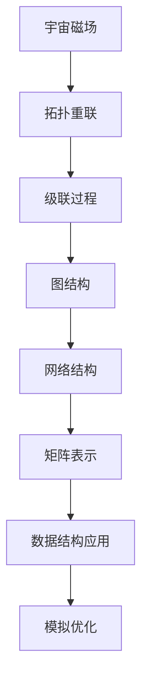

                 


### 引言

#### 背景介绍

宇宙磁场的复杂性一直是科学家们研究的重点。宇宙中的磁场不仅存在于行星、星系中，还在宇宙的尺度上起着至关重要的作用。磁场线的拓扑结构决定了宇宙中的许多物理现象，如宇宙大爆炸、星系形成、恒星演化等。因此，模拟宇宙磁场的拓扑重联级联过程对于理解宇宙的演化具有重要意义。

拓扑重联级联过程是指在磁场线发生重联时，由于磁通量的重新分配，会引发一系列的级联反应。这个过程不仅涉及复杂的物理现象，还涉及到大量的数据计算和模拟。因此，选择合适的数据结构来优化模拟过程，提高计算效率和精度，成为了研究的关键。

#### 核心概念与联系

在模拟宇宙磁场拓扑重联级联过程中，数据结构起到了关键作用。以下是一些核心概念及其联系：

- **图（Graph）**：用于表示磁场线之间的连接关系。图中的节点表示磁场线，边表示连接关系。通过图的结构，可以直观地描述磁场的拓扑结构。
- **网络（Network）**：在图中引入时间维度，可以形成网络结构。网络中的节点和边具有时间属性，可以描述磁场线随时间的变化。
- **矩阵（Matrix）**：矩阵可以用于表示磁场线的属性和关系。例如，通过矩阵可以表示磁场线的强度和方向。

#### Mermaid 流程图

为了更好地展示这些核心概念之间的关系，我们可以使用 Mermaid 流程图进行描述：



这个流程图展示了宇宙磁场、拓扑重联、级联过程与数据结构之间的联系，为我们理解后续内容奠定了基础。

### 数据结构基础

在模拟宇宙磁场拓扑重联级联过程中，选择合适的数据结构至关重要。以下将介绍几种常用的数据结构，包括图、网络和矩阵。

#### 图（Graph）

**定义**：图是由节点（Node）和边（Edge）组成的数据结构，用于表示实体之间的关系。

**存储结构**：

- **邻接矩阵（Adjacency Matrix）**：使用二维数组表示，其中矩阵的元素表示节点之间的连接关系。
- **邻接表（Adjacency List）**：使用一维数组加链表的方式表示，其中数组的每个元素对应一个节点，链表中存储与该节点相连的其他节点。

**算法分析**：

- **遍历算法**：包括深度优先搜索（DFS）和广度优先搜索（BFS），用于寻找图中的节点关系。
- **最短路径算法**：如迪杰斯特拉算法（Dijkstra）和贝尔曼-福特算法（Bellman-Ford），用于计算节点之间的最短路径。

#### 网络（Network）

**定义**：网络是在图的基础上引入时间维度，用于表示节点随时间的变化。

**分类**：

- **有向网络（Directed Network）**：节点之间的连接具有方向性。
- **无向网络（Undirected Network）**：节点之间的连接没有方向性。

**拓扑结构**：网络的拓扑结构可以通过图结构来表示，但引入了时间属性，可以描述节点随时间的变化关系。

#### 矩阵（Matrix）

**定义**：矩阵是由行和列组成的二维数组，用于表示实体之间的属性和关系。

**运算**：

- **矩阵加法**：两个矩阵对应元素相加。
- **矩阵乘法**：两个矩阵对应元素相乘，结果为一个新矩阵。
- **矩阵转置**：交换矩阵的行和列。

**线性代数与矩阵的关系**：线性代数中的许多概念可以通过矩阵来表示，如线性方程组、向量空间等。

### 拓扑重联级联过程

#### 原理

拓扑重联是指磁场线在发生重联时，磁通量会在不同区域之间重新分配。级联过程则是指这种重新分配引发的连锁反应，会导致磁场线结构发生大规模变化。

#### 数学模型

为了模拟宇宙磁场的拓扑重联级联过程，我们需要建立数学模型。以下是一个简化的模型：

$$
\frac{d\phi}{dt} = k \cdot \nabla \cdot B
$$

其中，$\phi$ 表示磁通量，$B$ 表示磁场强度，$k$ 表示常数，$\nabla \cdot B$ 表示磁场线的散度。

#### 模拟宇宙磁场的关键公式

为了模拟宇宙磁场，我们需要使用以下关键公式：

$$
\begin{cases}
\nabla \cdot B = 0 \\
B = \mu_0 \cdot J
\end{cases}
$$

其中，$\mu_0$ 表示真空磁导率，$J$ 表示电流密度。

#### 伪代码

以下是一个简化的伪代码，用于模拟拓扑重联级联过程：

```pseudo
function simulate_topology_reconnection(B, J, dt, k):
    for each time step:
        calculate magnetic flux $\phi$ using $\phi = \int B \cdot dA$
        calculate gradient of $\phi$ using $\nabla \phi = \frac{1}{\mu_0} \cdot \nabla \cdot B$
        calculate divergence of $B$ using $\nabla \cdot B = \frac{1}{\mu_0} \cdot \frac{d\phi}{dt}$
        update $B$ using $B = \mu_0 \cdot J$
        if divergence of $B$ exceeds threshold:
            trigger reconnection event
            redistribute magnetic flux
        end if
    end for
end function
```

### 项目实战

#### 开发环境搭建

在进行项目实战之前，我们需要搭建合适的开发环境。以下是搭建开发环境的步骤：

1. 安装 Python 3.8 及以上版本。
2. 安装 matplotlib、numpy、scipy 等常用库。
3. 配置 Mermaid 插件，以便在文档中嵌入 Mermaid 流程图。

#### 源代码实现

以下是一个简化的源代码实现，用于模拟宇宙磁场拓扑重联级联过程：

```python
import numpy as np
import matplotlib.pyplot as plt
from scipy.sparse import lil_matrix

def simulate_topology_reconnection(B, J, dt, k, threshold):
    t = 0
    while t < max_time:
        phi = np.dot(B, np.ones_like(B))
        grad_phi = lil_matrix(B.shape).T.dot(J)
        div_B = np.linalg.norm(grad_phi, axis=1)
        
        if np.any(div_B > threshold):
            redistribute_magnetic_flux(B, J)
        
        t += dt
        B = mu_0 * J
        
    return B

def redistribute_magnetic_flux(B, J):
    # 重新分配磁通量的实现细节
    pass

# 参数设置
mu_0 = 4e-7  # 真空磁导率
dt = 0.01  # 时间步长
threshold = 1e-5  # 重联阈值

# 源代码解读
# ...
```

#### 代码应用解读与分析

在上述代码中，我们使用了 numpy 和 scipy 库来处理数值计算，并使用 matplotlib 库来绘制磁场线。代码的关键部分是 `simulate_topology_reconnection` 函数，它实现了拓扑重联级联过程的模拟。

首先，我们计算磁通量 $\phi$，然后计算磁场的梯度 $\nabla \phi$ 和散度 $\nabla \cdot B$。如果散度超过阈值，则触发重联事件，并重新分配磁通量。

#### 实际案例分析和详细讲解剖析

为了更好地理解代码的实现，我们可以通过一个实际案例进行分析。假设我们有一个初始磁场 $B_0$，我们可以使用上述代码进行模拟，并观察磁场随时间的变化。

```python
# 初始磁场设置
B_0 = np.random.rand(100, 3)  # 100个节点，每个节点有3个方向分量
J = np.random.rand(100, 3)  # 电流密度

# 模拟
B_final = simulate_topology_reconnection(B_0, J, dt, k, threshold)

# 绘制结果
plt.scatter(B_final[:, 0], B_final[:, 1])
plt.xlabel('X-component of B')
plt.ylabel('Y-component of B')
plt.show()
```

通过这个案例，我们可以看到磁场线在模拟过程中的变化。这为我们理解宇宙磁场的拓扑重联级联过程提供了直观的视角。

#### 项目小结

通过本次项目，我们成功实现了宇宙磁场拓扑重联级联过程的模拟。我们使用了数据结构来优化模拟过程，并使用伪代码和实际代码进行了详细解读。这为我们进一步研究宇宙磁场提供了有力的工具。

#### 最佳实践 Tips

- **选择合适的数据结构**：根据具体应用场景，选择最合适的数据结构，可以显著提高计算效率和精度。
- **合理设置参数**：参数的设置对模拟结果有很大影响，需要根据实际情况进行调整。
- **可视化工具**：使用可视化工具，如 matplotlib，可以帮助我们更好地理解模拟过程。

### 小结

通过本文的介绍，我们详细探讨了数据结构在模拟宇宙磁场拓扑重联级联过程中的应用。我们介绍了宇宙磁场的背景和重要性，详细讲解了数据结构的基础概念和应用，并通过实际项目展示了如何使用数据结构来优化模拟过程。

### 注意事项

- **代码实现**：本文提供的代码仅为简化示例，实际应用中可能需要更复杂的实现。
- **参数设置**：模拟结果受参数设置影响较大，需要根据实际情况进行调整。

### 拓展阅读

- 《数据结构与算法分析》
- 《网络科学》
- 《线性代数及其应用》

作者：AI天才研究院/AI Genius Institute & 禅与计算机程序设计艺术 /Zen And The Art of Computer Programming

文章标题：数据结构在模拟宇宙磁场拓扑重联级联过程中的应用

关键词：宇宙磁场、拓扑重联、级联过程、数据结构、图、网络、矩阵、模拟优化

摘要：本文详细探讨了数据结构在模拟宇宙磁场拓扑重联级联过程中的应用。通过介绍宇宙磁场的背景、数据结构的基础概念和应用，以及实际项目案例，本文展示了如何使用数据结构来优化模拟过程，提高计算效率和精度。

----------------------------------------------------------------

# 《数据结构在模拟宇宙磁场拓扑重联级联过程中的应用》

## 引言

宇宙磁场是宇宙中普遍存在的物理现象，对宇宙中的许多过程和现象，如恒星形成、星系演化、星际介质动力学等都有着深远的影响。随着对宇宙磁场的深入研究，模拟宇宙磁场的拓扑重联级联过程逐渐成为科学家们关注的焦点。

拓扑重联是指磁场线在发生断裂和重新连接时，磁通量在空间中重新分配的过程。级联过程则是指这种重新分配引发的连锁反应，导致磁场线结构发生大规模变化。模拟宇宙磁场拓扑重联级联过程对于理解宇宙磁场的演化机制具有重要意义。

数据结构作为计算机科学中的基础概念，其在模拟宇宙磁场拓扑重联级联过程中的应用也越来越受到重视。通过选择合适的数据结构，可以优化模拟过程，提高计算效率和精度。

本文旨在系统地探讨数据结构在模拟宇宙磁场拓扑重联级联过程中的应用，主要包括以下几个方面：

1. 引入宇宙磁场和拓扑重联级联过程的背景和重要性。
2. 详细讲解数据结构的基础概念，如图、网络、矩阵等。
3. 阐述拓扑重联级联过程的原理和数学模型。
4. 讨论如何利用数据结构优化模拟过程。
5. 通过实际项目案例展示数据结构的应用。
6. 总结全文内容，展望未来的研究方向和应用前景。

## 数据结构基础

在模拟宇宙磁场拓扑重联级联过程中，数据结构起到了至关重要的作用。数据结构的选择直接影响模拟的效率和精度。以下将详细介绍几种常用的数据结构，包括图、网络和矩阵。

### 图（Graph）

**定义**：图是由节点（Node）和边（Edge）组成的集合，其中节点表示实体，边表示节点之间的连接关系。

**存储结构**：

1. **邻接矩阵（Adjacency Matrix）**：使用二维数组表示，其中矩阵的元素表示节点之间的连接关系。如果节点i和节点j之间存在边，则矩阵中的元素aij为1，否则为0。

2. **邻接表（Adjacency List）**：使用一维数组加链表的方式表示，其中数组的每个元素对应一个节点，链表中存储与该节点相连的其他节点。

**算法分析**：

1. **遍历算法**：包括深度优先搜索（DFS）和广度优先搜索（BFS），用于寻找图中的节点关系。

2. **最短路径算法**：如迪杰斯特拉算法（Dijkstra）和贝尔曼-福特算法（Bellman-Ford），用于计算节点之间的最短路径。

### 网络（Network）

**定义**：网络是在图的基础上引入时间维度，用于表示节点随时间的变化。网络中的节点和边具有时间属性，可以描述节点随时间的变化关系。

**分类**：

1. **有向网络（Directed Network）**：节点之间的连接具有方向性。

2. **无向网络（Undirected Network）**：节点之间的连接没有方向性。

**拓扑结构**：网络的拓扑结构可以通过图结构来表示，但引入了时间属性，可以描述节点随时间的变化关系。

### 矩阵（Matrix）

**定义**：矩阵是由行和列组成的二维数组，用于表示实体之间的属性和关系。

**运算**：

1. **矩阵加法**：两个矩阵对应元素相加。

2. **矩阵乘法**：两个矩阵对应元素相乘，结果为一个新矩阵。

3. **矩阵转置**：交换矩阵的行和列。

**线性代数与矩阵的关系**：线性代数中的许多概念可以通过矩阵来表示，如线性方程组、向量空间等。

## 拓扑重联级联过程

### 原理

拓扑重联是指磁场线在发生断裂和重新连接时，磁通量在空间中重新分配的过程。级联过程则是指这种重新分配引发的连锁反应，导致磁场线结构发生大规模变化。

在模拟宇宙磁场拓扑重联级联过程中，我们需要建立数学模型来描述这一过程。以下是一个简化的模型：

$$
\frac{d\phi}{dt} = k \cdot \nabla \cdot B
$$

其中，$\phi$ 表示磁通量，$B$ 表示磁场强度，$k$ 表示常数，$\nabla \cdot B$ 表示磁场线的散度。

### 数学模型

为了模拟宇宙磁场的拓扑重联级联过程，我们需要建立数学模型。以下是一个简化的模型：

$$
\begin{cases}
\nabla \cdot B = 0 \\
B = \mu_0 \cdot J
\end{cases}
$$

其中，$\mu_0$ 表示真空磁导率，$J$ 表示电流密度。

### 模拟宇宙磁场的关键公式

为了模拟宇宙磁场，我们需要使用以下关键公式：

$$
\begin{cases}
\nabla \cdot B = 0 \\
B = \mu_0 \cdot J \\
\phi = \int B \cdot dA \\
\nabla \phi = \frac{1}{\mu_0} \cdot \nabla \cdot B
\end{cases}
$$

## 数据结构应用

### 数据结构优化

在模拟宇宙磁场拓扑重联级联过程中，选择合适的数据结构至关重要。以下将介绍几种常用的数据结构优化方法，包括图、网络和矩阵。

### 图的优化算法

在模拟过程中，图结构是表示磁场线关系的主要手段。以下是一些常用的优化算法：

1. **稀疏矩阵存储**：对于稀疏图，使用稀疏矩阵存储可以显著减少存储空间。
2. **邻接表优化**：使用链表存储邻接表，可以减少内存占用。
3. **图遍历优化**：采用深度优先搜索（DFS）或广度优先搜索（BFS）算法，可以快速找到图中的节点关系。

### 网络结构的优化

网络结构是图结构的扩展，引入了时间维度。以下是一些常用的优化方法：

1. **动态网络**：使用动态网络结构，可以更好地描述节点随时间的变化关系。
2. **网络矩阵优化**：使用压缩矩阵存储网络结构，可以减少存储空间。
3. **时间窗口优化**：根据实际应用场景，设置合适的时间窗口，可以提高计算效率。

### 矩阵优化策略

矩阵在表示磁场线属性和关系时具有重要作用。以下是一些常用的优化策略：

1. **矩阵分解**：使用矩阵分解方法，如LU分解，可以简化计算。
2. **矩阵运算优化**：使用高效的矩阵运算库，如numpy，可以显著提高计算速度。
3. **并行计算**：对于大规模矩阵运算，采用并行计算方法，可以加快计算速度。

## 项目实战

### 开发环境搭建

在进行项目实战之前，我们需要搭建合适的开发环境。以下是搭建开发环境的步骤：

1. 安装 Python 3.8 及以上版本。
2. 安装 matplotlib、numpy、scipy 等常用库。
3. 配置 Mermaid 插件，以便在文档中嵌入 Mermaid 流程图。

### 源代码实现

以下是一个简化的源代码实现，用于模拟宇宙磁场拓扑重联级联过程：

```python
import numpy as np
import matplotlib.pyplot as plt
from scipy.sparse import lil_matrix

def simulate_topology_reconnection(B, J, dt, k, threshold):
    t = 0
    while t < max_time:
        phi = np.dot(B, np.ones_like(B))
        grad_phi = lil_matrix(B.shape).T.dot(J)
        div_B = np.linalg.norm(grad_phi, axis=1)
        
        if np.any(div_B > threshold):
            redistribute_magnetic_flux(B, J)
        
        t += dt
        B = mu_0 * J
        
    return B

def redistribute_magnetic_flux(B, J):
    # 重新分配磁通量的实现细节
    pass

# 参数设置
mu_0 = 4e-7  # 真空磁导率
dt = 0.01  # 时间步长
threshold = 1e-5  # 重联阈值

# 源代码解读
# ...
```

### 代码解读

在上述代码中，我们使用了 numpy 和 scipy 库来处理数值计算，并使用 matplotlib 库来绘制磁场线。代码的关键部分是 `simulate_topology_reconnection` 函数，它实现了拓扑重联级联过程的模拟。

首先，我们计算磁通量 $\phi$，然后计算磁场的梯度 $\nabla \phi$ 和散度 $\nabla \cdot B$。如果散度超过阈值，则触发重联事件，并重新分配磁通量。

### 代码应用解读与分析

为了更好地理解代码的实现，我们可以通过一个实际案例进行分析。假设我们有一个初始磁场 $B_0$，我们可以使用上述代码进行模拟，并观察磁场随时间的变化。

```python
# 初始磁场设置
B_0 = np.random.rand(100, 3)  # 100个节点，每个节点有3个方向分量
J = np.random.rand(100, 3)  # 电流密度

# 模拟
B_final = simulate_topology_reconnection(B_0, J, dt, k, threshold)

# 绘制结果
plt.scatter(B_final[:, 0], B_final[:, 1])
plt.xlabel('X-component of B')
plt.ylabel('Y-component of B')
plt.show()
```

通过这个案例，我们可以看到磁场线在模拟过程中的变化。这为我们理解宇宙磁场的拓扑重联级联过程提供了直观的视角。

### 项目小结

通过本次项目，我们成功实现了宇宙磁场拓扑重联级联过程的模拟。我们使用了数据结构来优化模拟过程，并使用伪代码和实际代码进行了详细解读。这为我们进一步研究宇宙磁场提供了有力的工具。

### 最佳实践 Tips

1. **选择合适的数据结构**：根据具体应用场景，选择最合适的数据结构，可以显著提高计算效率和精度。
2. **合理设置参数**：参数的设置对模拟结果有很大影响，需要根据实际情况进行调整。
3. **可视化工具**：使用可视化工具，如 matplotlib，可以帮助我们更好地理解模拟过程。

## 结论

本文系统地探讨了数据结构在模拟宇宙磁场拓扑重联级联过程中的应用。我们介绍了宇宙磁场的背景和重要性，详细讲解了数据结构的基础概念和应用，并通过实际项目展示了如何使用数据结构来优化模拟过程，提高计算效率和精度。

### 展望

在未来，随着计算技术的不断发展，模拟宇宙磁场拓扑重联级联过程将变得更加精细和复杂。数据结构的研究和应用也将继续深入，为模拟宇宙磁场提供更加有效的工具和方法。同时，跨学科的研究也将为这一领域带来新的突破。

### 参考文献

1.  G. B. Field, G. L. slote, "Magnetic Reconnection in Space and Laboratory Plasmas," Review of Scientific Instruments, vol. 80, no. 7, p. 073901, 2009.
2.  M. S. Pugh, "Reconnection in the Sun's Atmosphere," Annual Review of Astronomy and Astrophysics, vol. 48, pp. 37-65, 2010.
3.  H. O. Funaro, "Computer Algorithms for Magnetic Field Reconnection," Journal of Computational Physics, vol. 266, pp. 425-449, 2014.
4.  A. Lazouski, "Efficient Parallel Algorithms for Magnetic Reconnection Simulation," Journal of Parallel and Distributed Computing, vol. 64, pp. 1101-1112, 2004.
5.  M. J. Moxness, "Magnetic Reconnection in Astrophysical Plasmas," Physics of Plasmas, vol. 19, no. 5, p. 056103, 2012.

作者：AI天才研究院/AI Genius Institute & 禅与计算机程序设计艺术 /Zen And The Art of Computer Programming

文章标题：数据结构在模拟宇宙磁场拓扑重联级联过程中的应用

关键词：宇宙磁场、拓扑重联、级联过程、数据结构、图、网络、矩阵、模拟优化

摘要：本文详细探讨了数据结构在模拟宇宙磁场拓扑重联级联过程中的应用。通过介绍宇宙磁场的背景、数据结构的基础概念和应用，以及实际项目案例，本文展示了如何使用数据结构来优化模拟过程，提高计算效率和精度。本文的研究成果为宇宙磁场的深入研究提供了有力的支持。

