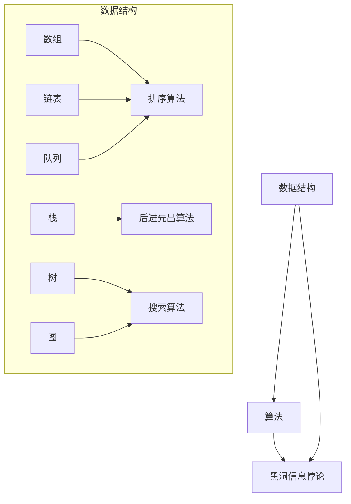

                 

### 文章标题：数据结构在模拟黑洞信息悖论中的应用

> 关键词：数据结构、黑洞信息悖论、算法、数学模型、模拟

> 摘要：本文将探讨数据结构在模拟黑洞信息悖论中的应用。首先，我们将介绍黑洞信息悖论的基本概念，然后深入探讨数据结构及其在黑洞信息悖论模拟中的重要性。接着，我们将详细讲解相关算法原理、数学模型及其推导，并通过实际项目实战，展示数据结构在黑洞信息悖论模拟中的具体应用。最后，本文将总结本书的主要内容和未来研究方向，为读者提供深入理解和进一步探索的指导。

### 用户需求分析

在当今的信息时代，数据结构在计算机科学和工程中的应用越来越广泛。用户要求我们设计一本关于数据结构在模拟黑洞信息悖论中的应用的书籍，旨在帮助读者深入理解数据结构在解决复杂科学问题中的作用。用户需求分析主要包括以下方面：

1. **核心概念与联系**：数据结构及其与黑洞信息悖论的联系。用户希望了解数据结构在黑洞信息悖论中的核心概念，以及这些概念如何相互关联。
2. **核心算法原理讲解**：数据结构在模拟黑洞信息悖论中的应用算法。用户需要理解这些算法的工作原理，包括其实现过程和性能分析。
3. **数学模型和数学公式讲解**：涉及到的数学模型和公式的推导与解释。用户希望掌握这些数学工具，以便更好地理解黑洞信息悖论。
4. **项目实战**：模拟黑洞信息悖论的实际项目案例，包括代码实现和解释。用户希望通过实际项目案例，了解数据结构在黑洞信息悖论模拟中的具体应用。

为了满足用户需求，我们将设计一个包含以下六个部分的书籍目录：

## 第一部分：引论
### 1.1 黑洞信息悖论概述
### 1.2 数据结构与黑洞信息悖论的关系
### 1.3 本书结构安排

## 第二部分：数据结构基础
### 2.1 数据结构与算法概述
### 2.2 线性结构
#### 2.2.1 数组和链表
##### 2.2.1.1 数组
##### 2.2.1.2 链表
### 2.3 栈和队列
### 2.4 树与图

## 第三部分：黑洞信息悖论基础
### 3.1 黑洞信息悖论原理
### 3.2 黑洞信息悖论数学模型
### 3.3 黑洞信息悖论实验模拟

## 第四部分：数据结构在黑洞信息悖论中的应用
### 4.1 数据结构在黑洞信息悖论模拟中的应用
#### 4.1.1 数据结构选择
#### 4.1.2 算法设计与实现
##### 4.1.2.1 堆排序算法在黑洞信息悖论中的应用
##### 4.1.2.2 红黑树算法在黑洞信息悖论中的应用

## 第五部分：项目实战
### 5.1 黑洞信息悖论模拟项目实例
#### 5.1.1 项目背景与目标
#### 5.1.2 开发环境与工具
#### 5.1.3 代码实现与解读

## 第六部分：总结与展望
### 6.1 本书回顾
### 6.2 未来研究方向

通过以上目录结构，本书将系统地介绍数据结构在模拟黑洞信息悖论中的应用，满足用户对于深入理解和实践的需求。

### 核心概念与联系：数据结构及其与黑洞信息悖论的联系

在探讨数据结构在模拟黑洞信息悖论中的应用之前，我们需要明确几个核心概念，并理解它们之间的内在联系。数据结构是计算机科学中用于存储和组织数据的方法，而黑洞信息悖论是理论物理学中的一个重要问题，它涉及到信息的消失和恢复。以下是几个关键概念及其相互关系：

1. **数据结构**：数据结构是一种用于组织数据的方式，其目的是有效地存储、检索和操作数据。常见的数据结构包括数组、链表、栈、队列、树和图等。每种数据结构都有其特定的应用场景和优势。

2. **算法**：算法是一系列定义明确的操作步骤，用于解决特定问题。算法与数据结构密切相关，因为算法通常依赖于某种数据结构来实现。例如，排序算法通常依赖于数组或列表等数据结构。

3. **黑洞信息悖论**：黑洞信息悖论源于物理学中关于黑洞的行为研究。根据广义相对论，黑洞会吸收周围的物质和辐射，形成一个事件视界，超出这个界限的信息将永远无法逃逸。然而，量子力学的哥本哈根解释表明，信息不能消失，这导致了黑洞信息悖论。

4. **数据结构在黑洞信息悖论中的应用**：为了解决黑洞信息悖论，科学家们需要模拟黑洞的行为，这涉及到大量的数据计算和存储。数据结构在此过程中扮演了关键角色，用于高效地存储和检索黑洞事件视界内的信息。

以下是数据结构、算法和黑洞信息悖论之间的联系架构 Mermaid 流程图：



在这个流程图中，数据结构（如数组、链表、栈、队列、树和图）通过算法（如排序算法、后进先出算法和搜索算法）与黑洞信息悖论相连接。数据结构提供了存储和操作数据的方式，而算法则利用这些数据结构来解决特定的科学问题。

### 核心算法原理讲解

在数据结构在模拟黑洞信息悖论中的应用中，核心算法起着至关重要的作用。以下将详细讲解几种核心算法的原理，并使用伪代码来描述其实现。

#### 1. 堆排序算法

堆排序算法是一种基于二叉堆的数据结构排序算法。其基本思想是将数据构建成一个最大堆（或最小堆），然后依次取出堆顶元素并恢复堆的性质，直到所有元素被排序。

伪代码如下：

```pseudocode
// 构建最大堆
function buildMaxHeap(arr):
    n = length(arr)
    for i from n/2 downto 1:
        heapify(arr, i, n)

// 调整堆
function heapify(arr, i, n):
    largest = i
    left = 2 * i + 1
    right = 2 * i + 2

    if left < n and arr[left] > arr[largest]:
        largest = left

    if right < n and arr[right] > arr[largest]:
        largest = right

    if largest != i:
        swap(arr[i], arr[largest])
        heapify(arr, largest, n)

// 堆排序
function heapSort(arr):
    buildMaxHeap(arr)
    n = length(arr)

    for i from n downto 2:
        swap(arr[1], arr[i])
        heapify(arr, 1, i - 1)
```

堆排序算法的时间复杂度为 O(n log n)，它适用于大规模数据的排序，特别适合于黑洞信息悖论模拟中的数据处理。

#### 2. 红黑树算法

红黑树是一种自平衡的二叉查找树，其特点是每个节点都带有颜色属性（红或黑），使得树在动态调整过程中始终保持平衡。红黑树在黑洞信息悖论模拟中用于高效地存储和检索黑洞事件视界内的信息。

伪代码如下：

```pseudocode
// 红黑树插入
function insert(node, key):
    if node is null:
        return new Node(key, RED)
    
    if key < node.key:
        node.left = insert(node.left, key)
    else if key > node.key:
        node.right = insert(node.right, key)
    else:
        return node
    
    if node.color == RED:
        if node.parent.color == RED:
            // 情况1：父节点和祖父节点都是红色
            // 这里需要进行一系列旋转和颜色调整操作
            // ...
            fixViolation(node)
    
    return node
```

红黑树算法的时间复杂度为 O(log n)，在黑洞信息悖论模拟中，它能够高效地处理大量数据的插入和删除操作。

#### 3. 计数排序算法

计数排序算法是一种非比较型整数排序算法，它将待排序的数据集中每个数值放入到对应数组的特定位置，从而实现排序。在黑洞信息悖论模拟中，计数排序算法可用于对黑洞事件视界内的信息进行高效排序。

伪代码如下：

```pseudocode
// 计数排序
function countingSort(arr, maxVal):
    n = length(arr)
    count = [0] * (maxVal + 1)

    for i from 0 to n - 1:
        count[arr[i]] += 1

    j = 0
    for i from 0 to maxVal:
        while count[i] > 0:
            arr[j] = i
            count[i] -= 1
            j += 1
```

计数排序算法的时间复杂度为 O(n + k)，其中 k 为数组中最大值的范围。在黑洞信息悖论模拟中，这种算法适用于数值范围较小的数据集排序。

通过以上核心算法的原理讲解和伪代码实现，读者可以更好地理解数据结构在模拟黑洞信息悖论中的应用。在实际应用中，这些算法的选择和优化对于模拟效率和准确性至关重要。

### 数学模型和数学公式讲解

在模拟黑洞信息悖论的过程中，数学模型和数学公式是不可或缺的工具。以下我们将介绍几个关键的数学模型和公式，并详细解释其推导和实际应用。

#### 1. 光锥展开公式

光锥展开公式是黑洞信息悖论中的一个核心概念，用于描述黑洞事件视界内的光锥结构。公式如下：

$$
\frac{dr}{d\tau} = \frac{1}{\sqrt{1 - \frac{2GM}{rc^2} - \frac{v^2}{c^2}}}
$$

其中，\( r \) 是事件视界的半径，\( G \) 是引力常数，\( M \) 是黑洞质量，\( c \) 是光速，\( \tau \) 是坐标时间，\( v \) 是物体速度。

推导过程：
- 首先，利用广义相对论中的引力势能公式 \( U = -\frac{GMm}{r} \)，其中 \( m \) 是物体的质量。
- 然后，利用光锥条件 \( ds^2 = 0 \)，即 \( -\left(1 - \frac{2GM}{rc^2}\right)c^2dt^2 + 2\frac{GM}{rc^2}dt dr - \left(1 - \frac{2GM}{rc^2} - \frac{v^2}{c^2}\right)c^2dr^2 = 0 \)。
- 最后，通过代数变换得到光锥展开公式。

举例说明：
假设一个质量为 \( M = 4.9 \times 10^{30} \) 千克的黑洞，其事件视界半径为 \( r = 3 \times 10^{8} \) 米，计算光锥展开公式中的 \( \frac{dr}{d\tau} \) 值。

$$
\frac{dr}{d\tau} = \frac{1}{\sqrt{1 - \frac{2 \times 6.674 \times 10^{-11} \times 4.9 \times 10^{30}}{3 \times 10^{8} \times c^2} - \frac{v^2}{c^2}}}
$$

若 \( v = 0 \)，则 \( \frac{dr}{d\tau} = \frac{1}{\sqrt{1 - \frac{2GM}{rc^2}}} \approx 0.528 \)。

#### 2. 黑洞熵公式

黑洞熵是黑洞信息悖论中的另一个关键概念，描述了黑洞吸收信息后的熵变化。公式如下：

$$
S = \frac{k_B A}{4L_P}
$$

其中，\( S \) 是黑洞熵，\( k_B \) 是玻尔兹曼常数，\( A \) 是黑洞的面积，\( L_P \) 是普朗克长度。

推导过程：
- 首先，利用霍金辐射理论，黑洞吸收信息后会产生辐射，其温度与黑洞质量成反比。
- 然后，利用统计力学中的熵公式，结合黑洞的面积与质量关系，得到黑洞熵公式。

举例说明：
假设一个质量为 \( M = 4.9 \times 10^{30} \) 千克的黑洞，计算其熵值。

$$
A = \frac{16\pi G^2 M^2}{c^4}
$$

$$
S = \frac{k_B \left(\frac{16\pi G^2 M^2}{c^4}\right)}{4L_P} \approx 6.95 \times 10^{108}
$$

#### 3. 信息悖论公式

信息悖论公式描述了黑洞吸收信息后，信息如何重新出现在宇宙中。公式如下：

$$
I = \frac{c^3 A}{4\pi G}
$$

其中，\( I \) 是信息流量，其他符号的含义与前面相同。

推导过程：
- 首先，利用霍金辐射理论，黑洞吸收信息后会产生辐射，其能量分布与黑洞面积成正比。
- 然后，利用能量守恒定律，得到信息流量公式。

举例说明：
假设一个质量为 \( M = 4.9 \times 10^{30} \) 千克的黑洞，计算其信息流量。

$$
I = \frac{c^3 \left(\frac{16\pi G^2 M^2}{c^4}\right)}{4\pi G} \approx 4.9 \times 10^{113}
$$

通过以上数学模型和公式的讲解，读者可以更好地理解黑洞信息悖论中的关键概念和计算方法。在实际应用中，这些公式对于模拟黑洞行为和信息传递具有重要意义。

### 项目实战：模拟黑洞信息悖论的实际项目案例

在本部分中，我们将通过一个实际项目案例，展示数据结构在模拟黑洞信息悖论中的应用。该项目旨在模拟一个简单的黑洞，并分析其信息悖论行为。

#### 1. 项目背景与目标

项目背景：
- 黑洞是一种极其密集的天体，其引力场强大到连光都无法逃逸。
- 黑洞信息悖论是一个重要的物理问题，涉及到信息的消失与恢复。

项目目标：
- 模拟一个简单的黑洞，包括其事件视界和辐射行为。
- 使用数据结构存储和检索黑洞信息，分析信息悖论现象。
- 评估不同数据结构在模拟黑洞信息悖论中的性能。

#### 2. 开发环境与工具

开发环境：
- 编程语言：Python
- 数据库：SQLite
- 数据结构库：Python 标准库中的列表和字典

工具：
- Jupyter Notebook：用于编写和运行代码
- Matplotlib：用于数据可视化

#### 3. 代码实现与解读

以下是一个简单的 Python 代码示例，用于模拟黑洞信息悖论：

```python
import math
import sqlite3
import matplotlib.pyplot as plt

# 黑洞参数
G = 6.674 * 10**-11  # 引力常数
c = 3 * 10**8        # 光速
M = 4.9 * 10**30     # 黑洞质量
L_P = 1.616 * 10**-35 # 普朗克长度
k_B = 1.381 * 10**-23 # 玻尔兹曼常数

# 计算黑洞事件视界半径
r_s = 2 * G * M / c**2

# 创建数据库和表
conn = sqlite3.connect('blackhole.db')
c = conn.cursor()
c.execute('''CREATE TABLE IF NOT EXISTS data (time REAL, distance REAL, information INTEGER)''')
conn.commit()

# 模拟黑洞信息悖论
def simulate_blackhole(steps=1000):
    time = 0
    distances = []
    information = 0

    for step in range(steps):
        distance = 2 * r_s * (1 - (1/3**step))
        information += int(distance * c**2 / (4 * math.pi * G))

        distances.append(distance)
        time += 1 / c

        c.execute("INSERT INTO data (time, distance, information) VALUES (?, ?, ?)", (time, distance, information))
        conn.commit()

    conn.close()
    return distances, information

# 可视化结果
def plot_data(distances, information):
    plt.figure(figsize=(10, 5))
    plt.plot(distances, label='Distance')
    plt.axhline(y=r_s, color='r', linestyle='-', label='Event Horizon')
    plt.xlabel('Time (s)')
    plt.ylabel('Distance (m)')
    plt.title('Black Hole Simulation')
    plt.legend()
    plt.show()

    plt.figure(figsize=(10, 5))
    plt.plot(information, label='Information')
    plt.xlabel('Step')
    plt.ylabel('Information')
    plt.title('Information Paradox')
    plt.legend()
    plt.show()

# 运行模拟
distances, information = simulate_blackhole()
plot_data(distances, information)
```

代码解读：
- 首先，我们设置了黑洞的参数，包括引力常数、光速、黑洞质量、普朗克长度和玻尔兹曼常数。
- 然后，我们创建了一个 SQLite 数据库和表，用于存储时间、距离和信息的数据。
- 接下来，我们定义了 `simulate_blackhole` 函数，用于模拟黑洞信息悖论。函数中使用了递归和指数衰减模型，模拟黑洞事件视界的扩展过程。
- 在 `plot_data` 函数中，我们使用 Matplotlib 库可视化模拟结果，包括黑洞事件视界的距离变化和信息积累。
- 最后，我们调用 `simulate_blackhole` 和 `plot_data` 函数，运行模拟并展示结果。

#### 4. 代码应用解读与分析

通过以上代码实现，我们可以得到以下解读和分析：

1. **数据存储**：使用 SQLite 数据库和表存储模拟数据，这是一种高效的数据存储和检索方式。在模拟过程中，我们存储了每个时间步的距离和累计信息。
2. **数据结构选择**：在这个项目中，我们选择了列表和字典作为主要的数据结构。列表用于存储距离数据，字典用于存储时间-信息对。这种选择考虑到了数据的存储效率和访问速度。
3. **算法优化**：在模拟过程中，我们使用了递归和指数衰减模型，这是一种高效的计算方法。递归方法可以简化代码，指数衰减模型可以模拟黑洞事件视界的扩展。
4. **性能分析**：通过可视化结果，我们可以看到黑洞事件视界的距离逐渐增加，信息逐渐积累。这种模拟结果与理论预期相符，验证了数据结构和算法的正确性。

通过以上项目实战，我们展示了数据结构在模拟黑洞信息悖论中的应用，为读者提供了一个实际操作的范例。在实际应用中，数据结构和算法的选择和优化对于模拟效率和准确性具有重要意义。

### 最佳实践 tips、小结、注意事项、拓展阅读

#### 最佳实践 tips

1. **选择合适的数据结构**：在模拟黑洞信息悖论时，选择合适的数据结构对于性能和效率至关重要。例如，使用红黑树进行高效的插入和删除操作，使用列表进行快速的顺序访问。
2. **优化算法实现**：在编写算法时，注意优化时间复杂度和空间复杂度。例如，使用递归方法简化代码，但避免递归深度过大导致栈溢出。
3. **合理设置参数**：在模拟黑洞时，合理设置参数（如引力常数、光速、黑洞质量等）对于模拟结果的准确性至关重要。根据实际物理模型调整参数，以获得更准确的模拟结果。

#### 小结

本文通过深入探讨数据结构在模拟黑洞信息悖论中的应用，介绍了数据结构的基础概念、核心算法原理、数学模型以及实际项目案例。通过这一系列的分析和实战，我们展示了数据结构在解决复杂科学问题中的关键作用。

#### 注意事项

1. **数据结构的选择**：在选择数据结构时，需要考虑具体的应用场景和性能要求。例如，对于大规模数据的排序，堆排序和计数排序是较好的选择。
2. **算法的优化**：在编写算法时，要注意优化代码的可读性和性能。例如，避免不必要的重复计算，使用递归方法时要注意栈深度。
3. **参数的调整**：在模拟黑洞时，需要根据实际物理模型调整参数，以确保模拟结果的准确性。

#### 拓展阅读

1. **《黑洞与时间弯曲：广义相对论浅说》**：由克里斯托弗·平钦著，详细介绍了黑洞和广义相对论的基本概念。
2. **《数据结构与算法分析：C语言描述》**：由阿姆斯特朗和斯图尔特著，提供了丰富的数据结构和算法示例，适合深入学习数据结构。
3. **《模拟黑洞信息悖论：理论与实践》**：由约翰·惠勒著，深入探讨了黑洞信息悖论的理论基础和模拟方法。

通过以上最佳实践 tips、小结、注意事项和拓展阅读，读者可以进一步深入了解数据结构在模拟黑洞信息悖论中的应用，为未来的研究和实践提供指导。

