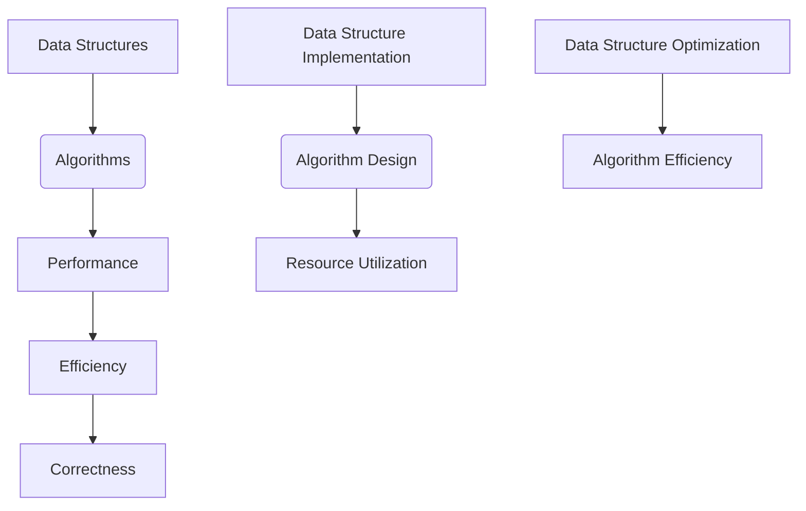
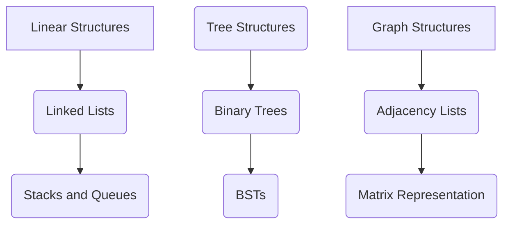
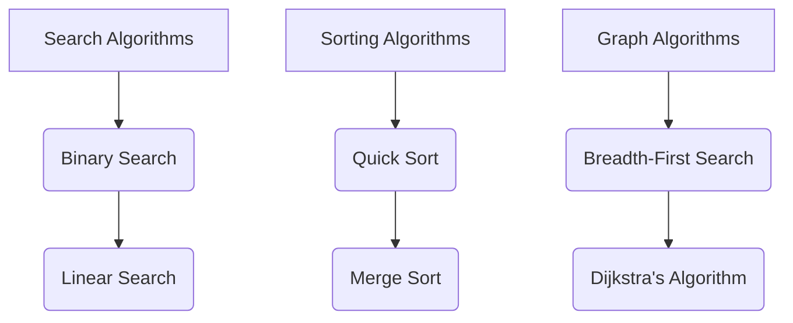

                 

# 数据结构：程序世界的基石

## 关键词
- 数据结构
- 算法
- 程序设计
- 栈和队列
- 树状结构
- 哈希表
- 动态规划
- 项目实战

## 摘要
本文将深入探讨数据结构在程序世界的基石地位，通过逐步分析各种核心数据结构，如线性结构、树状结构、高级数据结构等，及其相关算法，我们能够理解数据结构如何影响程序的性能和效率。文章将通过具体的实现、实例和项目实战，帮助读者掌握数据结构的核心概念和实际应用，从而提升编程能力。

## 引言

### 数据结构与算法的关系

在计算机科学中，数据结构和算法是两个核心概念，它们相互依赖、相互补充。数据结构定义了数据如何被组织、存储和操作，而算法则是解决问题的步骤序列。一个高效的算法往往需要适当的数据结构来支持，反之亦然。例如，排序算法的性能受到数据结构选择的影响，而数据结构的优化又可能需要特定的算法来实现。

### 数据结构的基本概念

数据结构是指数据组织、存储和管理的方式。常见的有线性结构、树状结构、图状结构等。线性结构包括数组、链表、栈和队列；树状结构包括二叉树、二叉搜索树、平衡二叉树等；图状结构包括无向图、有向图、加权图等。

### 算法的基本概念

算法是指解决问题的步骤序列，它可以通过数据结构来高效地执行。算法的设计和选择取决于问题的性质、数据结构和计算资源。一个良好的算法应该具备正确性、效率和健壮性。

## 第一部分：数据结构基础理论

### 第1章：引言

在引言部分，我们将探讨数据结构与算法的紧密关系，并通过具体的例子来说明数据结构如何影响算法的性能。

### 1.1 数据结构与算法的关系

数据结构和算法是相辅相成的，一个高效的算法通常需要合适的数据结构来支持。例如，二分查找算法需要有序的数据结构，而哈希表算法则依赖于哈希函数和链表或数组的数据结构。

#### 核心概念与联系
以下是一个Mermaid流程图，展示数据结构与算法之间的关系：



### 1.2 数据结构的基本概念

数据结构的基本概念包括线性结构、树状结构和图状结构。每种数据结构都有其独特的特点和适用场景。

#### 核心概念与联系
以下是线性结构、树状结构和图状结构的Mermaid流程图：



### 1.3 算法的基本概念

算法是指解决问题的步骤序列，它可以通过数据结构来高效地执行。算法的设计和选择取决于问题的性质、数据结构和计算资源。

#### 核心概念与联系
以下是常见算法的分类和关系的Mermaid流程图：



## 第2章：线性结构

### 2.1 顺序表

顺序表是一种基于数组的数据结构，它提供了一种快速访问任意位置元素的方法。

#### 2.1.1 顺序表的定义与特点

顺序表是一种线性表，其数据元素按照一定顺序存储在数组中。顺序表的特点是随机访问速度快，但插入和删除操作相对较慢。

#### 2.1.2 顺序表的实现

以下是一个简单的顺序表实现的伪代码：

```python
class SequentialList:
    def __init__(self, capacity):
        self.capacity = capacity
        self.size = 0
        self.data = [None] * capacity
    
    def append(self, element):
        if self.size == self.capacity:
            self.resize()
        self.data[self.size] = element
        self.size += 1
    
    def get(self, index):
        if index < 0 or index >= self.size:
            return None
        return self.data[index]
    
    def resize(self):
        new_capacity = self.capacity * 2
        new_data = [None] * new_capacity
        for i in range(self.size):
            new_data[i] = self.data[i]
        self.capacity = new_capacity
        self.data = new_data
```

### 2.2 链表

链表是一种基于指针的数据结构，它提供了一种灵活的插入和删除方法。

#### 2.2.1 单链表

单链表由一系列节点组成，每个节点包含数据域和指向下一个节点的指针。

#### 2.2.2 双向链表

双向链表是单链表的扩展，每个节点包含数据域、指向下一个节点的指针和指向上一个节点的指针。

#### 2.2.3 循环链表

循环链表是双向链表的一种特殊形式，其最后一个节点的指针指向第一个节点，形成一个环。

### 2.3 栈和队列

栈和队列是两种特殊的线性结构，分别用于模拟后进先出（LIFO）和先进先出（FIFO）的行为。

#### 2.3.1 栈的实现与应用

栈通常使用数组或链表来实现，它提供了一种快速入栈和出栈的方法。

#### 2.3.2 队列的实现与应用

队列通常使用数组或链表来实现，它提供了一种快速入队和出队的方法。

## 第3章：树状结构

### 3.1 二叉树

二叉树是一种重要的树状结构，每个节点最多有两个子节点。

#### 3.1.1 二叉树的基本概念

二叉树的基本概念包括节点、根节点、子节点、叶子节点、度等。

#### 3.1.2 二叉树的遍历

二叉树的遍历包括前序遍历、中序遍历和后序遍历。

#### 3.1.3 二叉搜索树

二叉搜索树是一种特殊的二叉树，其左子树上所有节点的值均小于根节点的值，右子树上所有节点的值均大于根节点的值。

### 3.2 图

图是一种复杂的树状结构，由节点（顶点）和边组成。

#### 3.2.1 图的基本概念

图的基本概念包括节点、边、路径、连通性等。

#### 3.2.2 图的遍历

图的遍历包括深度优先搜索（DFS）和广度优先搜索（BFS）。

#### 3.2.3 最小生成树

最小生成树是一种特殊的树，它包含图中所有节点且边的权重之和最小。

## 第4章：高级数据结构

### 4.1 哈希表

哈希表是一种基于散列函数的数据结构，它提供了一种快速查找、插入和删除方法。

#### 4.1.1 哈希表的基本原理

哈希表的基本原理包括哈希函数、数组、链表等。

#### 4.1.2 哈希函数的设计

哈希函数的设计原则包括一致性、均匀分布、快速计算等。

#### 4.1.3 冲突解决策略

冲突解决策略包括链地址法、开放地址法等。

### 4.2 并查集

并查集是一种用于处理动态连通性问题的数据结构。

#### 4.2.1 并查集的基本概念

并查集的基本概念包括合并、查找、连通性等。

#### 4.2.2 并查集的实现

并查集通常使用路径压缩和按秩合并等优化方法。

### 4.3 平衡二叉树

平衡二叉树是一种特殊的树，它能够保持树的平衡，从而提高查找、插入和删除操作的效率。

#### 4.3.1 AVL树

AVL树是一种自平衡的二叉搜索树，它通过左旋和右旋来保持树的平衡。

#### 4.3.2 红黑树

红黑树是一种自平衡的二叉搜索树，它通过颜色和指针来实现树的平衡。

## 第二部分：数据结构与算法应用

### 第5章：排序与查找

#### 5.1 排序算法

排序算法是一种用于将一组数据按照某种顺序排列的算法。

#### 5.1.1 内部排序与外部排序

内部排序是指在内存中完成排序，外部排序则涉及磁盘或外部存储。

#### 5.1.2 插入排序

插入排序包括简单插入排序和希尔排序等。

#### 5.1.3 选择排序

选择排序包括简单选择排序和堆排序等。

#### 5.1.4 交换排序

交换排序包括冒泡排序和快速排序等。

#### 5.1.5 归并排序

归并排序是一种经典的排序算法，它通过合并子序列来实现排序。

#### 5.1.6 快速排序

快速排序是一种高效的排序算法，它通过递归和分治策略来实现排序。

#### 5.2 查找算法

查找算法是一种用于在数据结构中查找特定元素的算法。

#### 5.2.1 线性查找

线性查找是一种简单但效率较低的查找算法。

#### 5.2.2 二分查找

二分查找是一种高效的查找算法，它适用于有序数据结构。

## 第6章：动态规划

#### 6.1 动态规划的基本概念

动态规划是一种解决优化问题的方法，它通过将问题分解为子问题并存储子问题的解来优化计算。

#### 6.2 动态规划的应用

动态规划广泛应用于最短路径问题、背包问题等。

#### 6.3 最长公共子序列

最长公共子序列问题是动态规划的经典应用之一，它用于寻找两个序列中最长的公共子序列。

#### 6.4 最短路径问题

最短路径问题是寻找图中两点之间路径的最小权值问题，动态规划可以有效地解决这一问题。

## 第7章：项目实战

#### 7.1 数据结构在搜索引擎中的应用

搜索引擎通常使用哈希表和树状结构来存储和检索数据。

#### 7.2 数据结构在网络社交平台中的应用

网络社交平台使用图状结构来存储用户关系，并使用排序和查找算法来优化查询操作。

#### 7.3 数据结构在游戏开发中的应用

游戏开发中经常使用栈和队列来模拟游戏中的行为，并使用树状结构来优化游戏中的图形渲染和路径规划。

## 第8章：总结与展望

#### 8.1 数据结构的学习方法

学习数据结构的方法包括理解基本概念、掌握实现细节和进行实际项目开发。

#### 8.2 数据结构的发展趋势

数据结构在计算机科学中持续发展，新型数据结构和新算法的涌现为解决问题提供了更多可能性。

#### 8.3 数据结构在实际开发中的应用前景

数据结构在实际开发中的应用前景广阔，它在提高程序性能和优化资源利用方面发挥着重要作用。

### 作者

作者：AI天才研究院/AI Genius Institute & 禅与计算机程序设计艺术 /Zen And The Art of Computer Programming

### 参考文献

1. Aho, Alfred V., John E. Hopcroft, and Jeffrey D. Ullman. "The Design and Analysis of Computer Algorithms." Addison-Wesley, 1974.
2. Sedgewick, Robert. "Algorithms in C: Parts 1-4: Fundamental Data Structures, Sorting, Searching." Addison-Wesley, 1998.
3. Cormen, Thomas H., Charles E. Leiserson, Ronald L. Rivest, and Clifford Stein. "Introduction to Algorithms." MIT Press, 2009.
4. Knuth, Donald E. "The Art of Computer Programming." Addison-Wesley, 1968.
5. Horowitz, Ellis, and Susan Anderson. "Fundamentals of Data Structures in C++." Computer Science Press, 1996.
6. Skiena, Steven S. "The Algorithm Design Manual." CRC Press, 2008.
7. Lee, Jung-Koo. "Data Structures: An Object-Oriented Approach Using C++." Springer, 2001.

