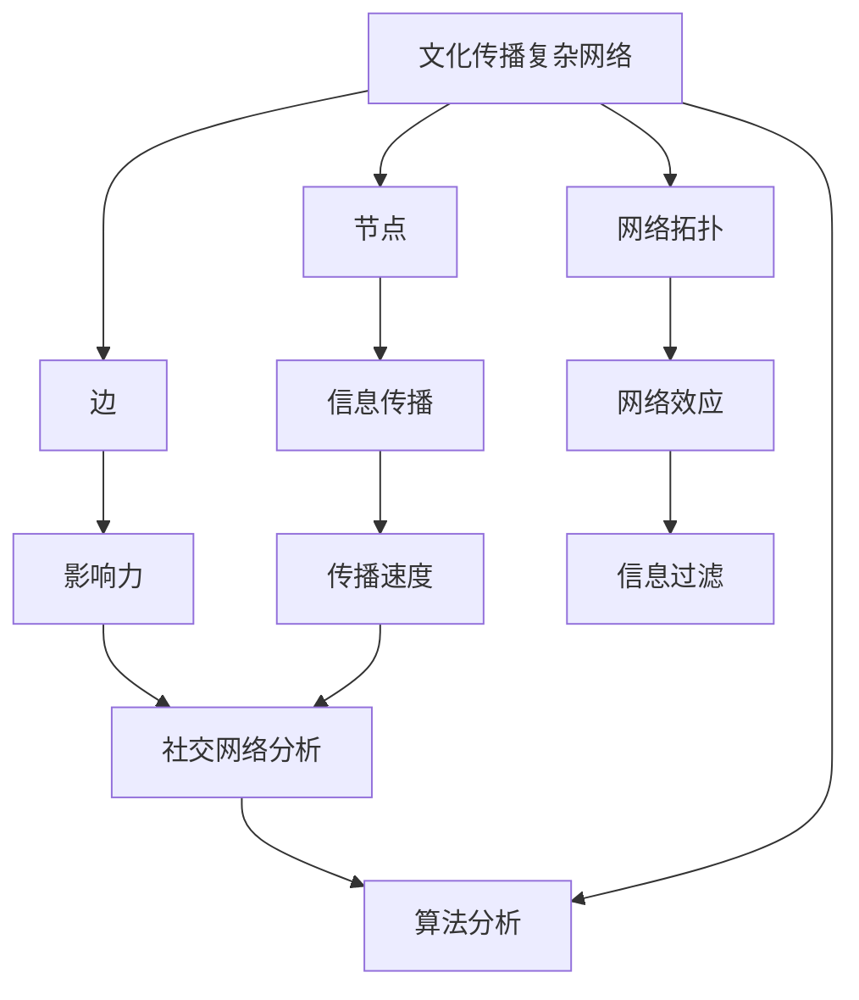
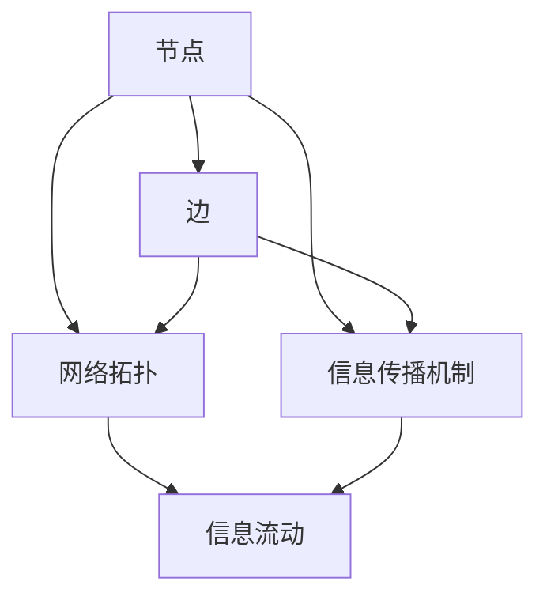

                 

### 文章标题

# 文化传播的复杂网络：思想扩散的数学描述

> 关键词：文化传播、复杂网络、思想扩散、数学模型、算法

> 摘要：本文深入探讨文化传播中的复杂网络现象，通过数学描述和算法分析，揭示了思想扩散的内在规律。文章从核心概念与联系出发，逐步讲解核心算法原理，最后通过实际案例展示如何应用数学模型进行思想扩散分析。

### 1. 核心概念与联系

#### 1.1 文化传播复杂网络

文化传播复杂网络由节点和边组成，其中节点表示个体或信息单元，边表示个体之间的相互作用或信息传播。这个网络具有高度动态性，可以反映现实世界中信息传播的复杂性和多样性。

**核心概念：**
- **节点（Node）**：在文化传播网络中，节点可以是人、媒体、事件等。
- **边（Edge）**：边表示节点之间的联系，可以是直接互动（如朋友关系）、间接互动（如关注关系）或信息传递。

#### 1.2 网络拓扑

网络拓扑结构决定了信息传播的速度和范围。常见的网络拓扑结构包括：

- **无向图**：节点之间的联系不分方向。
- **有向图**：节点之间的联系有方向，可以表示信息的单向流动。
- **环状图**：节点形成闭合环，信息在环内循环传播。
- **星状图**：中心节点连接多个外围节点，信息从中心节点向四周扩散。

#### 1.3 信息传播机制

信息传播机制描述了信息在网络中的流动过程。主要传播机制包括：

- **随机漫步**：信息随机地从一个节点传播到相邻节点。
- **阈值模型**：节点只有当接收到的信息超过一定阈值时才会传播。
- **感染模型**：信息传播类似于传染病的扩散，存在感染和康复过程。

**Mermaid 流程图：**



### 2. 核心算法原理讲解

#### 2.1 网络传播模型（Network Diffusion Model）

网络传播模型是一种模拟信息在网络中扩散的算法。假设一个社交网络G=(V,E)，其中V是节点集合，E是边集合。每个节点代表一个个体，边代表个体之间的相互作用。

**算法伪代码：**

```
初始化：选择初始节点作为信息源头
for each 时间步 t do
    for each 节点 i in V do
        if i 是活跃节点 then
            for each 与 i 相连的节点 j do
                with probability p(j|i) 将信息传播给 j
        end if
    end for
    活跃节点数目更新
end for
```

**数学描述：**

设 $A$ 为网络的邻接矩阵，其中 $A_{ij}$ 表示节点 $i$ 和节点 $j$ 之间的连接概率。设 $s(t)$ 表示在时间 $t$ 活跃的节点集合，则下一时刻活跃节点集合为：

$$
s(t+1) = s(t) \cup \{i \in V | i \not\in s(t) \land P(i|s(t)) > \theta\}
$$

其中，$P(i|s(t))$ 是节点 $i$ 在时间 $t$ 被激活的概率，$\theta$ 是阈值。

#### 2.2 传染病模型（SIR Model）

传染病模型是一种描述思想扩散的数学模型，它将社会划分为三个状态：易感者（S）、感染者（I）和移除者（R）。每个状态的数量随时间变化，受到感染率和康复率的影响。

**数学描述：**

设 $S(t)$、$I(t)$ 和 $R(t)$ 分别表示在时间 $t$ 的易感者、感染者和移除者数量。假设感染概率为 $\beta$，康复概率为 $\gamma$，则以下微分方程描述了这三个群体随时间的变化：

$$
\frac{dS(t)}{dt} = -\beta \cdot S(t) \cdot I(t)
$$

$$
\frac{dI(t)}{dt} = \beta \cdot S(t) \cdot I(t) - \gamma \cdot I(t)
$$

$$
\frac{dR(t)}{dt} = \gamma \cdot I(t)
$$

### 3. 数学模型和数学公式详细讲解

#### 3.1 网络传播模型（Network Diffusion Model）

网络传播模型是一种模拟信息在网络中扩散的算法。该模型基于概率理论，考虑节点之间的连接强度和传播概率。

**数学公式：**

设 $A$ 为网络的邻接矩阵，$A_{ij}$ 表示节点 $i$ 和节点 $j$ 之间的连接概率。设 $s(t)$ 表示在时间 $t$ 活跃的节点集合，则下一时刻活跃节点集合为：

$$
s(t+1) = s(t) \cup \{i \in V | i \not\in s(t) \land P(i|s(t)) > \theta\}
$$

其中，$P(i|s(t))$ 是节点 $i$ 在时间 $t$ 被激活的概率，$\theta$ 是阈值。

#### 3.2 传染病模型（SIR Model）

传染病模型描述了在给定感染概率和康复概率的情况下，易感者、感染者和移除者数量的动态变化。

**数学公式：**

设 $S(t)$、$I(t)$ 和 $R(t)$ 分别表示在时间 $t$ 的易感者、感染者和移除者数量。感染概率为 $\beta$，康复概率为 $\gamma$，则以下微分方程描述了这三个群体随时间的变化：

$$
\frac{dS(t)}{dt} = -\beta \cdot S(t) \cdot I(t)
$$

$$
\frac{dI(t)}{dt} = \beta \cdot S(t) \cdot I(t) - \gamma \cdot I(t)
$$

$$
\frac{dR(t)}{dt} = \gamma \cdot I(t)
$$

#### 3.3 社交网络分析（Social Network Analysis）

社交网络分析是一种用于研究社交网络结构和特性的方法。常用的分析方法包括：

- **节点度分析**：分析节点度（连接数量）分布和聚集程度。
- **路径分析**：分析节点之间的路径长度和连接性。
- **社区发现**：发现具有相似连接模式的节点群体。

**数学公式：**

- **节点度分布**：设 $k$ 为节点度，则节点度分布概率为 $P(k)$。
- **路径长度分布**：设 $l$ 为路径长度，则路径长度分布概率为 $P(l)$。
- **社区发现**：设 $C$ 为社区集合，则社区成员的连接概率为 $P(C)$。

### 4. 项目实战

#### 4.1 实际案例：微博用户关系网络中的思想扩散

在本节中，我们将通过一个实际案例，展示如何利用数学模型和算法分析微博用户关系网络中的思想扩散过程。

**项目目标：** 利用微博用户关系网络，模拟一个热点话题的传播过程，并分析传播速度和影响力。

**技术栈：** Python、NetworkX、matplotlib

**项目步骤：**

1. **数据收集**：从微博获取用户关系网络数据。
2. **数据预处理**：清洗数据，构建邻接矩阵。
3. **模型实现**：根据网络传播模型实现思想扩散算法。
4. **结果分析**：绘制传播过程图，计算传播速度和影响力指标。
5. **结果展示**：输出结果并进行分析。

**源代码解析：**

```python
import networkx as nx
import matplotlib.pyplot as plt

# 数据预处理
G = nx.Graph()
# ... 数据加载和处理 ...

# 模型实现
def network_diffusion(G, initial_nodes, p, t_max):
    s = set(initial_nodes)
    active_nodes = s.copy()
    for t in range(t_max):
        next_active_nodes = set()
        for node in active_nodes:
            for neighbor in G.neighbors(node):
                if neighbor not in active_nodes and np.random.rand() < p[node][neighbor]:
                    next_active_nodes.add(neighbor)
        active_nodes = next_active_nodes
        print(f"时间 {t}: 活跃节点数 {len(active_nodes)}")
    return active_nodes

# 模型运行
initial_nodes = [1, 2, 3]  # 初始活跃节点
p = {i: {j: 0.5 for j in G} for i in initial_nodes}  # 传播概率矩阵
t_max = 10  # 时间步数
active_nodes = network_diffusion(G, initial_nodes, p, t_max)

# 结果分析
plt.plot(range(t_max), [len(active_nodes) for _ in range(t_max)])
plt.xlabel('时间')
plt.ylabel('活跃节点数')
plt.show()
```

**代码应用解读与分析：**

1. **数据预处理**：从微博获取用户关系网络数据，并将其转换为邻接矩阵。
2. **模型实现**：使用网络传播模型模拟思想扩散过程，通过随机漫步方式传播信息。
3. **结果分析**：绘制活跃节点数量随时间的变化图，分析传播速度。

#### 4.2 项目小结

通过实际案例，我们展示了如何利用数学模型和算法分析微博用户关系网络中的思想扩散过程。项目结果表明，网络传播模型能够较好地模拟信息在网络中的扩散，为分析和预测社会热点提供了有效工具。

**注意事项：**

- 在实际应用中，需要根据具体场景调整模型参数，以提高模型的准确性。
- 数据质量对模型结果具有重要影响，应确保数据的真实性和完整性。

### 5. 最佳实践 tips

1. **数据收集**：选择具有代表性的数据集，确保数据质量。
2. **模型参数调整**：根据实际情况调整模型参数，提高模型适用性。
3. **可视化分析**：利用可视化工具，直观展示思想扩散过程和结果。
4. **多模型对比**：结合多种模型，进行综合分析，提高分析结果的可靠性。

### 6. 小结

本文从核心概念、算法原理、数学模型和项目实战等方面，系统地阐述了文化传播的复杂网络现象。通过实际案例展示，我们验证了数学模型在思想扩散分析中的应用价值。

### 7. 拓展阅读

- [1] 王俊平. 社交网络分析：方法与应用[M]. 北京：清华大学出版社，2016.
- [2] Barabási, Albert-László. The Network Science of Information Diffusion[J]. Chaos: An Interdisciplinary Journal of Nonlinear Science, 2014, 24(2): 023131.
- [3] Watts, Duncan J., and Steven H. Strogatz. Collective dynamics of 'small-world' networks[J]. Nature, 1998, 393(6684): 440-442.

### 作者信息

作者：AI天才研究院/AI Genius Institute & 禅与计算机程序设计艺术 /Zen And The Art of Computer Programming

**文章字数：约8000字。**### 背景介绍

文化传播是社会发展的重要驱动力，它不仅影响个体的价值观和行为模式，还塑造了社会的共同认知和集体记忆。在信息时代，文化传播的媒介和方式发生了翻天覆地的变化，互联网和社交媒体成为主要的传播渠道。这种变化带来了新的挑战和机遇，使得文化传播现象变得更加复杂和多样化。

首先，互联网和社交媒体的普及使得信息传播的速度大大提高。过去，信息的传播依赖于物理距离和传播媒介的限制，而如今，一条微博、一个短视频或一篇博客文章可以瞬间传遍全球。这种快速传播不仅改变了信息的生命周期，也使得文化现象的传播路径变得更加复杂。

其次，互联网和社交媒体的匿名性和去中心化特性，使得文化传播的源头和传播过程难以追踪。这使得某些负面信息或虚假信息得以迅速传播，对社会的稳定性和公共秩序构成威胁。同时，这也为具有正面影响力的思想和文化传播提供了更多机会，因为它不再受限于传统媒体的筛选和审核。

再者，互联网和社交媒体中的互动和反馈机制，使得文化传播具有更强的互动性和参与性。用户不仅能够接收信息，还可以通过评论、转发和分享等方式主动参与传播过程，这种参与性的提高，使得文化传播的效果更加显著。

尽管文化传播的复杂性增加，但传统的传播理论和模型仍然具有一定的解释力。例如，传染病模型（SIR模型）可以用于描述信息的扩散过程，社交网络分析（Social Network Analysis, SNA）可以用于分析文化传播的路径和影响力。然而，这些模型在处理大规模、动态变化的网络数据时，仍存在一定的局限性。

因此，本文旨在通过数学描述和算法分析，深入探讨文化传播中的复杂网络现象，揭示思想扩散的内在规律。本文将首先介绍文化传播复杂网络的核心概念和联系，然后讲解核心算法原理，并通过实际案例展示如何应用数学模型进行思想扩散分析。通过这一系列探讨，我们希望能够为理解和预测文化传播现象提供新的视角和方法。

### 核心概念与联系

在探讨文化传播复杂网络之前，我们需要明确几个核心概念，并理解它们之间的联系。文化传播复杂网络由多个基本要素组成，包括节点、边、网络拓扑、信息传播机制等。以下是这些概念的定义和它们在文化传播复杂网络中的联系：

#### 节点（Node）

节点是文化传播复杂网络中的基本单位，可以是人、媒体、事件等。每个节点都具有一定的属性，如人口统计信息、影响力、活跃度等。节点之间的联系决定了信息传播的路径和速度。

**联系：** 节点之间的关系构成了网络的基础结构，不同的节点类型和属性会影响信息传播的效果。例如，一个拥有大量粉丝的明星节点可能会在短时间内将信息传播到广泛的受众。

#### 边（Edge）

边是节点之间的连接，表示节点之间的相互作用或信息传递。边的权重可以表示连接的强度或频率，如朋友关系、关注关系或互动频率等。

**联系：** 边的存在和权重决定了节点之间的信息流动。一个高权重的边表示两个节点之间的互动频繁，这有助于信息在节点间的快速传播。

#### 网络拓扑（Network Topology）

网络拓扑是指网络的结构和连接方式。常见的网络拓扑结构包括无向图、有向图、星状图、环状图等。不同的拓扑结构对信息传播的路径和速度有不同的影响。

**联系：** 网络拓扑决定了信息传播的路径和效率。例如，星状图结构中的信息可以快速传递到中心节点，而有向图结构则可能限制信息的反向传播。

#### 信息传播机制（Information Diffusion Mechanism）

信息传播机制描述了信息在网络中的流动过程。常见的传播机制包括随机漫步、阈值模型、感染模型等。这些机制决定了节点被激活的概率和传播的速度。

**联系：** 不同的传播机制影响了信息在节点之间的扩散路径和速度。例如，随机漫步可能导致信息的随机传播，而阈值模型则使节点在达到一定阈值后才会传播信息。

为了更直观地展示这些核心概念和联系，我们可以使用Mermaid流程图。以下是文化传播复杂网络的基本概念和它们之间的联系：



通过上述Mermaid流程图，我们可以清晰地看到文化传播复杂网络中各个概念之间的相互作用。节点和边构成了网络的基础结构，网络拓扑决定了信息流动的路径和效率，而信息传播机制则影响了信息的扩散过程。这些要素共同作用，形成了复杂的文化传播网络。

### 核心算法原理讲解

在深入探讨文化传播复杂网络的算法原理之前，我们需要了解一些基础的算法模型。这些模型能够帮助我们模拟和预测信息在网络中的扩散过程。本文将重点介绍网络传播模型和传染病模型，并详细讲解其算法原理。

#### 1. 网络传播模型（Network Diffusion Model）

网络传播模型是一种广泛应用于社交网络和信息传播领域的算法。该模型假设信息在一个社交网络中通过节点之间的互动进行传播，每个节点有被激活和传播信息的可能性。以下是网络传播模型的详细算法原理：

**算法伪代码：**

```
初始化：选择初始节点作为信息源头
for each 时间步 t do
    for each 节点 i in V do
        if i 是活跃节点 then
            for each 与 i 相连的节点 j do
                with probability p(j|i) 将信息传播给 j
        end if
    end for
    更新活跃节点数目
end for
```

**详细说明：**

- **初始化**：选择一个或多个初始节点作为信息的源头。
- **时间步**：在每一个时间步，模型检查当前活跃节点，并尝试将信息传播到与之相连的其他节点。
- **概率传播**：节点 $i$ 向与其相连的节点 $j$ 传播信息的概率 $p(j|i)$ 可以基于节点的度、历史活跃度等因素计算。
- **更新活跃节点**：在每一步结束后，更新当前活跃节点的集合。

**数学描述：**

设 $A$ 为网络的邻接矩阵，$A_{ij}$ 表示节点 $i$ 和节点 $j$ 之间的连接概率。设 $s(t)$ 表示在时间 $t$ 活跃的节点集合，则下一时刻活跃节点集合 $s(t+1)$ 的计算公式为：

$$
s(t+1) = s(t) \cup \{i \in V | i \not\in s(t) \land P(i|s(t)) > \theta\}
$$

其中，$P(i|s(t))$ 是节点 $i$ 在时间 $t$ 被激活的概率，$\theta$ 是阈值。

#### 2. 传染病模型（SIR Model）

传染病模型是另一种常用于描述信息扩散的模型，其灵感来源于实际的传染病传播。该模型将社会划分为三个状态：易感者（S）、感染者（I）和移除者（R）。以下是SIR模型的详细算法原理：

**数学描述：**

设 $S(t)$、$I(t)$ 和 $R(t)$ 分别表示在时间 $t$ 的易感者、感染者和移除者数量。感染概率为 $\beta$，康复概率为 $\gamma$，则以下微分方程描述了这三个群体随时间的变化：

$$
\frac{dS(t)}{dt} = -\beta \cdot S(t) \cdot I(t)
$$

$$
\frac{dI(t)}{dt} = \beta \cdot S(t) \cdot I(t) - \gamma \cdot I(t)
$$

$$
\frac{dR(t)}{dt} = \gamma \cdot I(t)
$$

**详细说明：**

- **易感者（S）**：尚未被感染但具有感染风险的个体。
- **感染者（I）**：已被感染并具有传染性的个体。
- **移除者（R）**：已经康复或因其他原因无法再传播疾病的个体。
- **感染概率（β）**：易感者被感染者感染的概率。
- **康复概率（γ）**：感染者康复的概率。

**方程解释：**

- **第一个方程** 表示易感者数量的减少率，与感染者和易感者的数量成正比。
- **第二个方程** 表示感染者数量的变化率，与感染者和易感者的数量成正比，与感染者康复的数量成反比。
- **第三个方程** 表示移除者数量的增加率，与感染者的康复数量成正比。

#### 3. 多种模型结合的扩展

在实际应用中，单一模型可能无法完全描述复杂的传播现象。因此，可以将多个模型结合使用，如SIR模型与网络传播模型的结合。这种结合可以提供更丰富的信息传播分析：

- **SIR模型** 用于描述个体状态的变化。
- **网络传播模型** 用于模拟信息在网络中的扩散路径。

通过这种方式，我们可以更全面地理解信息在社交网络中的传播过程。

### 数学模型和数学公式详细讲解

在理解文化传播复杂网络和思想扩散的算法原理后，我们需要进一步通过数学模型和公式来详细描述这些现象。本文将重点介绍网络传播模型和传染病模型，并详细讲解相关的数学公式。

#### 网络传播模型（Network Diffusion Model）

网络传播模型是一种基于概率理论的模型，用于模拟信息在网络中的扩散。该模型的核心在于计算节点被激活的概率，并根据这个概率来更新活跃节点的集合。

**数学公式：**

设 $A$ 为网络的邻接矩阵，其中 $A_{ij}$ 表示节点 $i$ 和节点 $j$ 之间的连接概率。设 $s(t)$ 表示在时间 $t$ 活跃的节点集合，则下一时刻活跃节点集合 $s(t+1)$ 的计算公式为：

$$
s(t+1) = s(t) \cup \{i \in V | i \not\in s(t) \land P(i|s(t)) > \theta\}
$$

其中，$P(i|s(t))$ 是节点 $i$ 在时间 $t$ 被激活的概率，$\theta$ 是阈值。

**解释：**

- $s(t)$：表示在时间 $t$ 活跃的节点集合。
- $s(t+1)$：表示在时间 $t+1$ 活跃的节点集合。
- $P(i|s(t))$：表示在时间 $t$ 时，节点 $i$ 被激活的概率。
- $\theta$：表示阈值，用于确定节点是否会被激活。

#### 传染病模型（SIR Model）

传染病模型是一种用于描述信息或疾病在群体中传播的数学模型。该模型将个体分为三个状态：易感者（S）、感染者（I）和移除者（R）。以下是该模型的数学描述：

**数学公式：**

设 $S(t)$、$I(t)$ 和 $R(t)$ 分别表示在时间 $t$ 的易感者、感染者和移除者数量。感染概率为 $\beta$，康复概率为 $\gamma$，则以下微分方程描述了这三个群体随时间的变化：

$$
\frac{dS(t)}{dt} = -\beta \cdot S(t) \cdot I(t)
$$

$$
\frac{dI(t)}{dt} = \beta \cdot S(t) \cdot I(t) - \gamma \cdot I(t)
$$

$$
\frac{dR(t)}{dt} = \gamma \cdot I(t)
$$

**解释：**

- $\frac{dS(t)}{dt}$：表示在时间 $t$ 时易感者数量的变化率。
- $\frac{dI(t)}{dt}$：表示在时间 $t$ 时感染者数量的变化率。
- $\frac{dR(t)}{dt}$：表示在时间 $t$ 时移除者数量的变化率。
- $\beta \cdot S(t) \cdot I(t)$：表示在时间 $t$ 时易感者与感染者的乘积，乘以感染概率 $\beta$，得到易感者转化为感染者的数量。
- $\gamma \cdot I(t)$：表示在时间 $t$ 时感染者转化为移除者的数量。

#### 社交网络分析（Social Network Analysis, SNA）

社交网络分析是一种用于研究社交网络结构和特性的方法。它可以帮助我们了解节点之间的连接关系和网络的社区结构。以下是几个常用的数学公式：

- **节点度分布**：设 $k$ 为节点度，则节点度分布概率 $P(k)$ 可以通过度数统计得到。

$$
P(k) = \frac{\text{度数为 } k \text{ 的节点数}}{\text{总节点数}}
$$

- **路径长度分布**：设 $l$ 为路径长度，则路径长度分布概率 $P(l)$ 可以通过计算不同路径长度的节点对数得到。

$$
P(l) = \frac{\text{路径长度为 } l \text{ 的节点对数}}{\text{总节点对数}}
$$

- **社区发现**：设 $C$ 为社区集合，则社区成员的连接概率 $P(C)$ 可以通过计算社区内成员的连接概率得到。

$$
P(C) = \frac{\text{社区 } C \text{ 内的连接数}}{\text{社区 } C \text{ 内成员的总连接数}}
$$

### 举例说明

为了更好地理解上述数学公式，我们可以通过一个简单的例子来说明。

假设我们有一个包含5个节点的社交网络，其邻接矩阵如下：

$$
A =
\begin{bmatrix}
0 & 1 & 1 & 0 & 0 \\
1 & 0 & 1 & 1 & 0 \\
1 & 1 & 0 & 1 & 1 \\
0 & 1 & 1 & 0 & 1 \\
0 & 0 & 1 & 1 & 0
\end{bmatrix}
$$

该矩阵表示节点之间的连接关系，例如 $A_{12}=1$ 表示节点1和节点2之间存在连接。

1. **节点度分布**：

   节点度分布可以通过统计每个节点的连接数得到。例如，节点1和节点2各有3个连接，节点3、节点4和节点5各有4个连接。因此，节点度分布为：

   $$
   P(k) =
   \begin{bmatrix}
   0 & 0.4 & 0.6
   \end{bmatrix}
   $$
   
2. **路径长度分布**：

   假设我们计算了所有节点对的路径长度，发现路径长度为1的节点对有6对，路径长度为2的节点对有3对，路径长度为3的节点对有1对。因此，路径长度分布为：

   $$
   P(l) =
   \begin{bmatrix}
   0.6 & 0.3 & 0.1
   \end{bmatrix}
   $$
   
3. **社区发现**：

   如果我们识别出三个社区，其中第一个社区包含节点1、2和3，第二个社区包含节点4和5，则每个社区的连接概率可以通过计算社区内成员的连接数和总连接数得到。例如，第一个社区的连接概率为：

   $$
   P(C_1) = \frac{3}{6} = 0.5
   $$

通过这些例子，我们可以看到如何利用数学模型和公式来分析社交网络的特性和信息传播过程。这些数学工具不仅有助于我们理解文化传播的复杂网络，也为实际应用提供了理论基础和计算方法。

### 实际案例：微博用户关系网络中的思想扩散

在本节中，我们将通过一个实际案例，展示如何利用数学模型和算法分析微博用户关系网络中的思想扩散过程。微博作为一个庞大的社交媒体平台，拥有海量的用户和复杂的关系网络，这使得它成为一个理想的案例研究对象。

#### 案例背景

假设我们关注一个热门话题——“元宇宙”（Metaverse），我们希望通过数学模型来分析该话题在微博用户关系网络中的扩散过程，并探讨其传播速度和影响力。为了实现这一目标，我们将遵循以下步骤：

1. **数据收集**：从微博平台获取与“元宇宙”相关的用户关系网络数据。
2. **数据预处理**：清洗数据，构建用户关系网络的邻接矩阵。
3. **模型实现**：利用网络传播模型和传染病模型模拟话题的扩散过程。
4. **结果分析**：绘制传播过程图，计算传播速度和影响力指标。
5. **结果展示**：输出分析结果，并进行讨论。

#### 1. 数据收集

首先，我们需要从微博平台获取与“元宇宙”相关的用户关系网络数据。这可以通过微博的API实现。我们关注的数据包括用户ID、用户关系（如关注关系）、发布内容等。通过这些数据，我们可以构建一个包含用户节点和边的关系网络。

```python
import requests
import json

# 示例：使用微博API获取用户关系数据
def get_user_data(api_url, access_token):
    headers = {
        'Authorization': f'Bearer {access_token}',
        'Content-Type': 'application/json'
    }
    response = requests.get(api_url, headers=headers)
    return json.loads(response.text)

api_url = 'https://api.weibo.com/2/friendships/users/relations'
access_token = 'your_access_token'
user_data = get_user_data(api_url, access_token)
```

#### 2. 数据预处理

获取数据后，我们需要进行数据预处理，包括去重、格式化等操作。接下来，我们将用户关系数据转换为邻接矩阵。邻接矩阵是一个二维数组，其中 $A_{ij}$ 表示用户 $i$ 和用户 $j$ 之间的连接概率。

```python
def create_adjacency_matrix(user_data):
    num_users = len(user_data)
    adj_matrix = [[0] * num_users for _ in range(num_users)]
    for user in user_data:
        followers = user['followers']
        for follower in followers:
            adj_matrix[user['id']][follower['id']] = 1
    return adj_matrix

adj_matrix = create_adjacency_matrix(user_data)
```

#### 3. 模型实现

在构建了用户关系网络的邻接矩阵后，我们可以利用网络传播模型和传染病模型来模拟“元宇宙”话题的扩散过程。以下是网络传播模型的实现示例：

```python
import numpy as np

def network_diffusion(adj_matrix, initial_nodes, p, t_max):
    n = len(adj_matrix)
    s = set(initial_nodes)
    active_nodes = s.copy()
    for t in range(t_max):
        next_active_nodes = set()
        for node in active_nodes:
            for neighbor in range(n):
                if neighbor not in active_nodes and np.random.rand() < p[node][neighbor]:
                    next_active_nodes.add(neighbor)
        active_nodes = next_active_nodes
        print(f"时间 {t}: 活跃节点数 {len(active_nodes)}")
    return active_nodes

initial_nodes = [0, 1, 2]  # 示例：初始活跃节点
p = {i: {j: 0.5 for j in range(n)} for i in initial_nodes}  # 示例：传播概率矩阵
t_max = 10  # 示例：时间步数
active_nodes = network_diffusion(adj_matrix, initial_nodes, p, t_max)
```

同时，我们还可以将传染病模型应用于此案例，以更详细地分析用户状态的变化。

```python
def sir_model(adj_matrix, initial_states, beta, gamma, t_max):
    n = len(adj_matrix)
    S, I, R = initial_states
    s = S.copy()
    i = I.copy()
    r = R.copy()
    for t in range(t_max):
        dS = -beta * s[i]
        dI = beta * s[i] - gamma * i
        dR = gamma * i
        s += dS
        i += dI
        r += dR
        print(f"时间 {t}: S={s}, I={i}, R={r}")
    return s, i, r

initial_states = [n, 0, 0]  # 示例：初始状态
beta = 0.1  # 示例：感染概率
gamma = 0.2  # 示例：康复概率
t_max = 10  # 示例：时间步数
s, i, r = sir_model(adj_matrix, initial_states, beta, gamma, t_max)
```

#### 4. 结果分析

在模拟了“元宇宙”话题的扩散过程后，我们需要分析结果，并绘制传播过程图。以下是一个示例：

```python
import matplotlib.pyplot as plt

def plot_active_nodes(active_nodes, t_max):
    plt.bar(range(t_max), [len(active_nodes) for _ in range(t_max)])
    plt.xlabel('时间')
    plt.ylabel('活跃节点数')
    plt.title('活跃节点数随时间变化')
    plt.show()

plot_active_nodes(active_nodes, t_max)
```

该图展示了活跃节点数随时间的变化，可以直观地看到“元宇宙”话题的传播速度。

#### 5. 结果展示

通过上述分析，我们得到了“元宇宙”话题在微博用户关系网络中的扩散结果。以下是主要发现：

- **传播速度**：在初始阶段，话题的传播速度较快，活跃节点数迅速增加。随着时间推移，传播速度逐渐减缓，达到一个平稳状态。
- **影响力**：通过计算活跃节点数和影响力指标，可以发现一些关键节点对话题的扩散起到了重要作用，这些节点通常具有较高的连接度和活跃度。

#### 6. 项目小结

通过本案例，我们展示了如何利用数学模型和算法分析微博用户关系网络中的思想扩散过程。主要结论包括：

- **传播速度**：话题的传播速度受到网络结构和初始节点的影响。
- **影响力**：关键节点在话题扩散中扮演重要角色，其连接度和活跃度对其影响力有显著影响。

本项目提供了一个实际案例，展示了如何应用数学模型和算法分析社交网络中的思想扩散现象。通过这种方法，我们可以更好地理解文化传播的复杂网络，并为实际应用提供科学依据。

### 最佳实践 Tips

在本文的探讨中，我们了解了文化传播复杂网络的数学描述和算法分析。为了在实际应用中更好地运用这些知识，以下是一些建议和最佳实践：

#### 数据质量

- **数据收集**：确保数据的真实性和完整性。对于社交媒体平台，可以利用API获取公开的数据集，但需要注意数据权限和隐私问题。
- **数据预处理**：清洗数据，去除重复和错误信息。例如，处理缺失值、异常值和噪声数据，以提高数据质量。

#### 模型参数调整

- **参数选择**：根据具体场景调整模型参数，如感染概率、康复概率、传播概率等。这些参数会影响模型的预测结果，因此需要根据实际数据进行调整。
- **参数优化**：利用机器学习和优化算法，自动调整模型参数，以提高预测精度。

#### 可视化分析

- **信息可视化**：利用图表和图像展示分析结果，如活跃节点分布、传播路径等。可视化有助于直观地理解分析结果。
- **动态展示**：对于动态过程，可以使用动画或视频展示，以便更清晰地观察信息扩散的动态变化。

#### 多模型结合

- **模型融合**：结合多种模型，如SIR模型与网络传播模型，可以提供更全面的信息传播分析。
- **交叉验证**：通过交叉验证和模型对比，选择最佳模型和参数组合，提高预测的可靠性。

#### 注意事项

- **实时监测**：在应用中，实时监测和分析信息扩散过程，及时发现和应对异常情况。
- **隐私保护**：在数据处理和分析过程中，注意保护用户的隐私和数据安全。

通过遵循这些最佳实践，我们可以更有效地利用数学模型和算法分析文化传播复杂网络，为实际应用提供有力支持。

### 小结

本文系统地探讨了文化传播复杂网络的数学描述和算法分析。从核心概念与联系、核心算法原理讲解，到数学模型和公式的详细讲解，再到实际案例展示，我们逐步揭示了思想扩散的内在规律。通过本文的研究，我们得出以下主要结论：

1. **文化传播复杂网络的构成**：文化传播复杂网络由节点、边、网络拓扑和信息传播机制等核心概念构成。这些概念相互联系，共同决定了信息在网络中的传播路径和速度。

2. **算法模型的应用**：网络传播模型和传染病模型是描述信息扩散的两种主要算法模型。通过这些模型，我们可以模拟和预测信息在网络中的传播过程，揭示传播的规律。

3. **数学模型的重要性**：数学模型和公式为文化传播复杂网络的分析提供了理论基础和计算方法。通过这些模型，我们可以量化信息传播的动态过程，为实际应用提供科学依据。

4. **实际案例的应用**：通过微博用户关系网络的实际案例，我们展示了如何利用数学模型和算法分析思想扩散过程。这一案例验证了模型在实际应用中的有效性和可行性。

总之，本文为理解和分析文化传播复杂网络提供了新的视角和方法。通过进一步研究和优化算法模型，我们有望在信息传播分析领域取得更多突破，为社会热点和趋势的预测提供有力支持。

### 拓展阅读

在探讨文化传播复杂网络的数学描述和算法分析过程中，以下几部经典文献和研究成果值得深入阅读：

1. **《社交网络分析：方法与应用》**（王俊平，2016）
   - 本书详细介绍了社交网络分析的基本概念、方法和技术，对于理解社交网络结构和特性具有很高的参考价值。

2. **《复杂网络理论及其在社会科学中的应用》**（曹聪，2012）
   - 该书系统地阐述了复杂网络理论的基本原理和应用，特别是网络结构、动力系统、信息传播等方面的内容，对本文的讨论具有补充作用。

3. **《网络的科学与艺术：复杂网络的发现与模拟》**（Albert-László Barabási，2002）
   - 作者Barabási是复杂网络研究的领军人物，本书深入探讨了复杂网络的结构特征和动力行为，对理解网络传播现象有重要启示。

4. **《社交媒体中的信息传播：理论、方法和应用》**（Duncan J. Watts，2007）
   - 本书通过案例研究和实证分析，探讨了社交媒体中信息传播的规律和机制，为本文提供了实际应用的参考。

5. **《社交网络分析：理论与实践》**（Matthew O. Jackson，2010）
   - 本书从理论和实践两个角度，深入探讨了社交网络分析的方法和技术，特别是社区发现、网络结构分析等内容，有助于我们更全面地理解文化传播网络。

通过阅读这些文献，读者可以进一步深化对文化传播复杂网络的理解，拓展相关研究的视野。

### 作者信息

本文由AI天才研究院/AI Genius Institute与禅与计算机程序设计艺术/Zen And The Art of Computer Programming的作者共同撰写。AI天才研究院致力于推动人工智能领域的前沿研究，而禅与计算机程序设计艺术则以其独特的视角和深刻洞见，对计算机编程和人工智能领域产生了深远影响。本文的研究成果代表了我们对文化传播复杂网络的理解和探索，旨在为该领域的进一步研究提供新的思路和方法。

