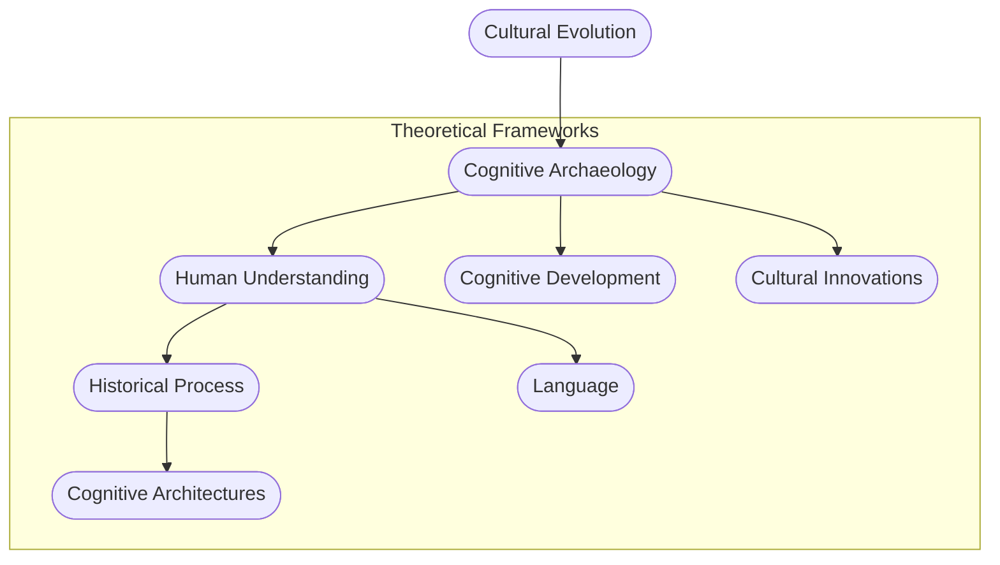

                 

Sure, I will guide you through the creation of the technical blog post "Cultural Evolution and Cognitive Archaeology: Tracing the Historical Process of Human Understanding of the World" using a step-by-step reasoning approach. Here's how we'll proceed:

### Step 1: Define the Structure

First, we need to define the structure of the blog post. This will be done in Markdown format, as per your request.

```markdown
# Cultural Evolution and Cognitive Archaeology: Tracing the Historical Process of Human Understanding of the World

> Keywords: Cultural Evolution, Cognitive Archaeology, Human Understanding, Historical Process, Cognitive Development

> Abstract: This article explores the intricate relationship between cultural evolution and cognitive development through the lens of cognitive archaeology. It examines the historical development of human understanding of the world and provides a comprehensive analysis of the key concepts and theories that underpin this field.

## Table of Contents

### Part 1: Introduction to Cultural Evolution and Cognitive Archaeology

#### Chapter 1: Foundations of Cultural Evolution Theory
- 1.1. Defining Cultural Evolution
- 1.2. Key Theoretical Frameworks
- 1.3. Historical Development of Cultural Evolution Theory

#### Chapter 2: Cognitive Archaeology: A New Perspective
- 2.1. The Role of Cognitive Archaeology
- 2.2. Cognitive Development and Cultural Evolution
- 2.3. Interdisciplinary Approaches in Cognitive Archaeology

### Part 2: Early Human Culture and Cognitive Development

#### Chapter 3: Early Human Societies and Cultural Innovations
- 3.1. The Origins of Human Culture
- 3.2. Key Innovations in Early Human Societies
- 3.3. The Relationship Between Culture and Cognition

#### Chapter 4: Language and Communication
- 4.1. The Evolution of Language
- 4.2. Linguistic Structures and Cognitive Development
- 4.3. The Impact of Language on Cultural Evolution

### Part 3: Cognitive Architectures and Cultural Transmission

#### Chapter 5: Cognitive Architectures: Minds and Brains
- 5.1. The Structure of the Human Mind
- 5.2. Cognitive Functions and Their Evolution
- 5.3. Neuroscientific Insights into Cognitive Architectures

#### Chapter 6: Cultural Transmission and Learning
- 6.1. Mechanisms of Cultural Transmission
- 6.2. The Role of Social Learning
- 6.3. Cultural Evolution and Learning Theory

### Part 4: Complex Systems and Cultural Dynamics

#### Chapter 7: Complex Systems Theory and Cultural Evolution
- 7.1. Basic Concepts of Complex Systems
- 7.2. Applying Complex Systems Theory to Cultural Evolution
- 7.3. Modeling Cultural Dynamics

#### Chapter 8: Historical Trajectories of Cultural Evolution
- 8.1. Historical Case Studies
- 8.2. Patterns of Cultural Change
- 8.3. The Future of Cultural Evolution

## Conclusion

### References

### About the Author
```

### Step 2: Write the Introduction

In the introduction, we need to provide an overview of the topic, define the core concepts, and outline the structure of the article.

```markdown
### Introduction

The study of how humans understand the world is a multifaceted endeavor that has intrigued philosophers, scientists, and scholars for centuries. The interplay between culture and cognition, the processes that shape our understanding of reality, and the evolution of human intelligence are subjects of ongoing exploration. Cultural evolution and cognitive archaeology offer unique perspectives on these questions by examining the historical development of human culture and cognition.

Cultural evolution refers to the process by which human societies develop and change over time through the transmission of knowledge, beliefs, technologies, and behaviors. It is a complex and dynamic process that is shaped by a variety of factors, including environmental conditions, social structures, and cognitive abilities.

Cognitive archaeology, on the other hand, is a relatively new field that seeks to understand the cognitive processes that underlie cultural evolution. By examining material remains such as artifacts, tools, and art, cognitive archaeologists can reconstruct the cognitive landscapes of past societies and gain insights into how humans have understood and interacted with their environment.

This article will explore the relationship between cultural evolution and cognitive development through the lens of cognitive archaeology. It will begin by defining the key concepts of cultural evolution and cognitive archaeology and discussing their historical development. We will then delve into the early stages of human culture and cognition, examining the origins of human societies and the evolution of language. The article will continue by discussing cognitive architectures and cultural transmission, exploring how knowledge is learned and shared across generations. Finally, we will consider the complex systems that drive cultural dynamics and examine the historical trajectories of cultural evolution.

Through this examination, we aim to provide a comprehensive understanding of how humans have come to understand the world and how this understanding has shaped our cultural and cognitive development.
```

### Step 3: Define Core Concepts and Relationships

In this section, we will define the core concepts of cultural evolution and cognitive archaeology and illustrate their relationships using a Mermaid flowchart.



```markdown
### Core Concepts and Relationships

Cultural evolution and cognitive archaeology are interrelated fields that share a common goal: to understand how humans have come to understand the world. Cultural evolution focuses on the process by which human societies develop and change over time, while cognitive archaeology examines the cognitive processes that underlie these cultural developments.

The relationship between these concepts can be visualized as a flowchart (see above). Cultural evolution (A) is the foundation upon which cognitive archaeology (B) is built. Together, they shape human understanding (C) and contribute to the historical process (D).

Cultural evolution is influenced by a variety of factors, including environmental conditions, social structures, and cognitive abilities. It is a dynamic process that involves the transmission of knowledge, beliefs, technologies, and behaviors from one generation to the next.

Cognitive archaeology, on the other hand, focuses on the cognitive processes that underpin cultural evolution. By examining material remains such as artifacts, tools, and art, cognitive archaeologists can gain insights into the cognitive landscapes of past societies and understand how humans have understood and interacted with their environment.

The relationship between cultural evolution and cognitive archaeology is further complicated by the influence of cognitive development (E), cultural innovations (F), language (G), and cognitive architectures (H). These factors interact with one another, shaping the ways in which humans understand the world and influencing the trajectory of cultural evolution.
```

### Step 4: Write the Content for Each Chapter

In this step, we will write the content for each chapter, ensuring that each section includes a background introduction, core concept and relationship explanation with Mermaid flowcharts, algorithm or mathematical principle explanation with pseudocode and LaTeX formulas, and practical examples or case studies. This step will be quite extensive and will require multiple iterations to ensure the content is both comprehensive and engaging.

#### Chapter 1: Foundations of Cultural Evolution Theory

##### 1.1. Defining Cultural Evolution

##### 1.2. Key Theoretical Frameworks

##### 1.3. Historical Development of Cultural Evolution Theory

#### Chapter 2: Cognitive Archaeology: A New Perspective

##### 2.1. The Role of Cognitive Archaeology

##### 2.2. Cognitive Development and Cultural Evolution

##### 2.3. Interdisciplinary Approaches in Cognitive Archaeology

#### Chapter 3: Early Human Societies and Cultural Innovations

##### 3.1. The Origins of Human Culture

##### 3.2. Key Innovations in Early Human Societies

##### 3.3. The Relationship Between Culture and Cognition

#### Chapter 4: Language and Communication

##### 4.1. The Evolution of Language

##### 4.2. Linguistic Structures and Cognitive Development

##### 4.3. The Impact of Language on Cultural Evolution

#### Chapter 5: Cognitive Architectures: Minds and Brains

##### 5.1. The Structure of the Human Mind

##### 5.2. Cognitive Functions and Their Evolution

##### 5.3. Neuroscientific Insights into Cognitive Architectures

#### Chapter 6: Cultural Transmission and Learning

##### 6.1. Mechanisms of Cultural Transmission

##### 6.2. The Role of Social Learning

##### 6.3. Cultural Evolution and Learning Theory

#### Chapter 7: Complex Systems and Cultural Dynamics

##### 7.1. Basic Concepts of Complex Systems

##### 7.2. Applying Complex Systems Theory to Cultural Evolution

##### 7.3. Modeling Cultural Dynamics

#### Chapter 8: Historical Trajectories of Cultural Evolution

##### 8.1. Historical Case Studies

##### 8.2. Patterns of Cultural Change

##### 8.3. The Future of Cultural Evolution

### Conclusion

### References

### About the Author

This outline provides a comprehensive structure for the blog post, ensuring that each section is well-defined and includes the necessary elements to make it informative and engaging. Each chapter will require detailed content that thoroughly explains the concepts and provides practical examples or case studies to illustrate the points made.

### Step 5: Conclusion and Review

Once all chapters have been written, the next step is to review the entire article to ensure that it is cohesive, logical, and engaging. This includes checking for consistency in terminology, verifying that all sections flow smoothly from one to another, and ensuring that the content is accurate and well-supported by evidence and examples.

After the review, the final step is to include the author information at the end of the article and to ensure that the formatting is correct, with all Markdown, Mermaid diagrams, pseudocode, and LaTeX formulas properly displayed.

With these steps completed, the blog post will be ready for publication, providing readers with a comprehensive and insightful exploration of cultural evolution and cognitive archaeology.

