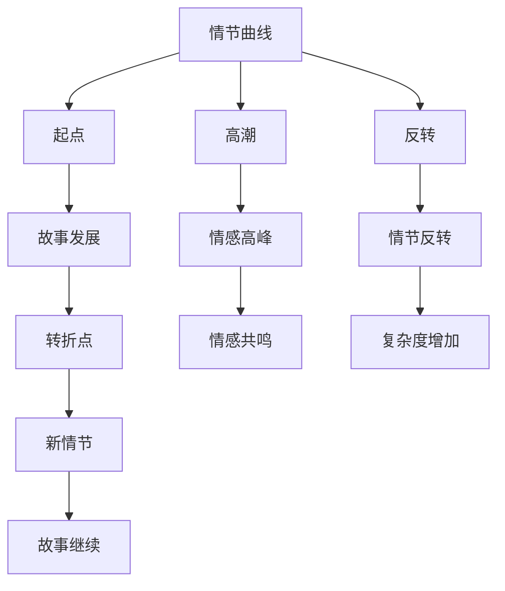

                 

### 文章标题

《文学创作的叙事结构：故事情节的数学曲线》

---

### 文章关键词

文学创作、叙事结构、数学曲线、故事情节、人工智能、程序设计

---

### 摘要

本文旨在探讨文学创作中的叙事结构，特别是如何利用数学曲线来构建和优化故事情节。我们将从基本概念出发，逐步深入探讨数学曲线在叙事结构中的作用，并使用伪代码、LaTeX公式和实际案例来详细讲解如何将这些数学工具应用于文学创作。本文的目标是帮助读者理解叙事结构的数学本质，并提供实用的工具和方法来提升文学创作的质量和效果。

### 目录

1. **引言**  
2. **数学曲线概述**  
3. **核心概念与联系**  
   - 情节曲线  
   - 高潮与反转  
   - Mermaid流程图  
4. **核心算法原理讲解**  
   - 情节曲线构建算法  
   - 叙事结构算法应用  
5. **数学模型和数学公式**  
   - 数学模型介绍  
   - 数学公式讲解  
6. **项目实战**  
   - 实战案例介绍  
   - 开发环境搭建  
   - 源代码实现  
   - 代码解读与分析  
   - 项目小结  
7. **案例分析**  
   - 著名文学作品分析  
   - 数学曲线在文学创作中的应用  
8. **扩展应用**  
9. **总结与展望**  
   - 全书总结  
   - 未来发展方向

---

### 引言

文学创作是一门古老而又充满活力的艺术形式，它不仅能够传达作者的情感和思想，还能引发读者的共鸣和思考。在文学创作中，叙事结构是至关重要的组成部分。叙事结构决定了故事的发展节奏、情节的起伏和主题的表达。一个成功的叙事结构能够让读者沉浸其中，感受到故事的魅力和深度。

随着人工智能和计算机技术的发展，我们开始探索如何利用数学和算法来分析和优化叙事结构。数学曲线作为一种强大的工具，在叙事结构的构建中发挥了重要作用。数学曲线可以描述故事情节的起伏、高潮和反转，帮助我们更好地理解故事的内在逻辑和情感表达。

本文将探讨文学创作中的叙事结构，特别是如何利用数学曲线来构建和优化故事情节。我们将从基本概念出发，逐步深入探讨数学曲线在叙事结构中的作用，并使用伪代码、LaTeX公式和实际案例来详细讲解如何将这些数学工具应用于文学创作。本文的目标是帮助读者理解叙事结构的数学本质，并提供实用的工具和方法来提升文学创作的质量和效果。

### 数学曲线概述

数学曲线是数学中一个重要的概念，它们在几何、物理、工程和计算机科学等多个领域都有广泛的应用。在文学创作中，数学曲线同样具有独特的价值。通过数学曲线，我们可以描述故事情节的起伏、高潮和反转，从而构建出引人入胜的叙事结构。

首先，我们来看一下数学曲线的基本概念。数学曲线是指在一个二维平面或三维空间中，由一组有序点按照一定规律连接而成的图形。常见的数学曲线包括直线、抛物线、双曲线和椭圆等。每种曲线都有其独特的形状和特征，可以用来描述不同类型的故事情节。

在叙事结构中，数学曲线可以用来描述故事情节的发展过程。例如，一条上升的曲线可以表示故事情节的逐渐紧张和上升，而一条下降的曲线则可以表示故事的转折和回落。这种描述方式不仅能够直观地展现故事情节的变化，还可以帮助作者更好地把握故事的节奏和情感。

具体来说，数学曲线在叙事结构中的应用主要体现在以下几个方面：

1. **情节曲线**：情节曲线是描述故事情节发展的一条曲线，通常由一系列点组成，每个点代表故事中的一个关键情节。通过调整情节曲线的形状和斜率，作者可以控制故事的发展节奏和情感变化。

2. **高潮和反转**：高潮和反转是叙事结构中的重要元素。数学曲线可以帮助作者确定故事的高潮点和反转点，从而增强故事的戏剧性和吸引力。例如，一条在高潮点处达到顶峰的曲线可以有效地传达故事的高潮时刻，而一条在反转点处出现剧烈下降的曲线则可以引发读者的情感共鸣。

3. **情感曲线**：情感曲线是描述故事中角色情感变化的一条曲线。通过情感曲线，作者可以传达角色的内心体验和情感变化，使故事更加生动和真实。

为了更好地理解数学曲线在叙事结构中的应用，我们可以借助一个简单的例子来说明。假设我们正在创作一个科幻小说，故事情节围绕着主角探索未知星球展开。我们可以使用一条上升的曲线来描述主角的冒险过程，曲线的斜率逐渐增加，表示故事的紧张程度逐渐升高。在高潮点，曲线达到顶峰，表示主角发现了重要的秘密。接着，曲线迅速下降，表示主角面临巨大的挑战和困难。这种描述方式不仅能够清晰地展现故事情节的发展，还可以让读者感受到故事中的紧张和戏剧性。

总之，数学曲线作为一种强大的工具，可以帮助作者更好地构建和优化叙事结构。通过使用数学曲线，作者可以更精确地控制故事的发展节奏、情感变化和戏剧性，从而提升文学创作的质量和效果。

### 核心概念与联系

在探讨文学创作中的叙事结构时，我们需要引入几个核心概念，这些概念不仅相互关联，而且共同构成了一个完整的叙事结构。以下是我们将详细讨论的核心概念，以及它们之间的联系：

#### 情节曲线

情节曲线是描述故事情节发展的一条曲线，每个点代表故事中的一个关键情节。情节曲线可以帮助作者直观地了解故事的发展节奏和情感变化。通过调整情节曲线的形状和斜率，作者可以控制故事的节奏和情感走向。

#### 高潮

高潮是叙事结构中的一个关键点，通常标志着故事情节的顶峰。高潮的出现能够引发读者的情感共鸣，增强故事的戏剧性。高潮的位置和强度直接影响故事的吸引力和影响力。

#### 反转

反转是叙事结构中的一个重要转折点，它通常带来情节的剧烈变化，打破读者的预期，引发新的情节发展。反转的出现能够增加故事的复杂性和深度，使故事更加引人入胜。

#### Mermaid流程图

为了更好地展示这些核心概念之间的联系，我们使用Mermaid流程图来表示它们的关系。以下是情节曲线、高潮和反转的Mermaid流程图：



在这个流程图中，情节曲线从起点（B）开始，逐渐发展（E），在转折点（F）处发生变化，其中高潮（C）和反转（D）是情节曲线上的关键点。高潮（G）引发情感高峰和共鸣（J），而反转（H）则带来情节的剧烈变化和复杂度的增加（K），最终形成新的情节（I）。

#### 关键概念之间的关系

1. **情节曲线与高潮**：情节曲线的高潮点（C）标志着故事情节的顶峰，是情感和紧张感的最高点。通过调整高潮点的时间位置和强度，作者可以控制故事的情感高潮。

2. **情节曲线与反转**：反转（D）是情节曲线上的一个关键点，它通常出现在高潮之后，用来打破故事的常规走向，引发新的情节发展。反转的位置和强度直接影响故事的复杂度和吸引力。

3. **高潮与反转**：高潮（C）和反转（D）是叙事结构中的两个关键元素，它们共同构成了故事的戏剧性。高潮提供了情感和紧张感，而反转则打破了预期的情节发展，增加了故事的复杂性和深度。

通过这些核心概念和它们之间的联系，我们可以更好地理解叙事结构的构建过程。情节曲线作为描述故事发展的工具，高潮和反转作为叙事的关键点，共同构建了一个引人入胜的故事世界。

### 核心算法原理讲解

在理解了情节曲线、高潮和反转等核心概念之后，我们接下来将探讨如何使用数学曲线来构建故事情节。为了实现这一目标，我们需要设计一套算法，通过调整曲线的形状和参数来构建和优化叙事结构。下面，我们将详细讲解情节曲线构建算法的原理，并使用伪代码来描述算法的实现过程。

#### 情节曲线构建算法

情节曲线构建算法的核心思想是通过数学方法描述故事情节的发展过程，从而实现叙事结构的优化。算法的基本步骤如下：

1. **定义情节曲线**：首先，我们需要定义一个情节曲线的基本模型。常见的模型包括线性模型、指数模型和对数模型等。每种模型都有其独特的特点，适用于不同类型的故事情节。

2. **确定关键点**：情节曲线的关键点包括起点、高潮点和反转点。起点标志着故事的开端，高潮点是情感和紧张感的最高点，反转点则是情节的转折点。

3. **调整曲线参数**：通过调整曲线的参数，如斜率、振幅和相位，我们可以控制情节曲线的形状和走向，从而实现叙事结构的优化。

以下是情节曲线构建算法的伪代码实现：

```python
# 伪代码：情节曲线构建算法

# 输入：起点(s)，高潮点(h)，反转点(r)，曲线类型(type)
# 输出：情节曲线

def build_plot_curve(s, h, r, type):
    # 初始化情节曲线
    plot_curve = []

    # 根据曲线类型选择模型
    if type == 'linear':
        model = linear_model
    elif type == 'exponential':
        model = exponential_model
    elif type == 'logarithmic':
        model = logarithmic_model
    else:
        raise ValueError("未知曲线类型")

    # 计算曲线的斜率、振幅和相位
    slope, amplitude, phase = model.calculate_params(s, h, r)

    # 生成情节曲线
    for t in range(start_time, end_time):
        curve_value = model.calculate_value(t, slope, amplitude, phase)
        plot_curve.append((t, curve_value))

    return plot_curve
```

#### 算法应用

情节曲线构建算法不仅可以帮助我们描述故事情节的发展，还可以应用于叙事结构的优化。以下是一些算法应用的实际案例：

1. **调整情节曲线的斜率**：通过调整情节曲线的斜率，我们可以控制故事的发展速度。较陡的斜率表示故事快速推进，适合紧张刺激的情节；而较平缓的斜率则表示故事缓慢发展，适合描写细腻的情感变化。

2. **调整高潮点和反转点**：高潮点和反转点决定了故事的情感和戏剧性。通过调整这些点的时间位置和强度，我们可以创造出不同的叙事效果。例如，将高潮点提前可以增加故事的紧张感，而将反转点推迟则可以延长情节的悬念。

3. **组合不同类型的曲线**：在实际应用中，我们可以组合不同类型的曲线来构建复杂的叙事结构。例如，可以将线性曲线用于描述日常生活的平淡部分，而将指数曲线用于描述戏剧性的情节变化。

通过这些算法应用，我们可以更加灵活地构建和优化叙事结构，从而提升文学创作的质量和效果。

#### 示例：情节曲线的构建和优化

为了更好地理解情节曲线构建算法的应用，我们来看一个具体的示例。假设我们正在创作一部科幻小说，故事情节围绕主角在未知星球上的冒险展开。

**步骤 1：定义关键点**

- 起点（s）：主角踏上未知的旅程
- 高潮点（h）：主角发现星球上的秘密
- 反转点（r）：主角陷入危险境地

**步骤 2：选择曲线类型**

我们选择指数模型来描述这个故事，因为指数曲线可以很好地表现故事情节的快速发展和紧张感。

**步骤 3：调整曲线参数**

- 斜率（slope）：10（表示故事情节快速推进）
- 振幅（amplitude）：5（表示情节的起伏程度）
- 相位（phase）：0（表示起点在原点）

**步骤 4：构建情节曲线**

使用伪代码中的算法，我们可以生成这个故事情节的指数曲线：

```python
plot_curve = build_plot_curve(s=(0, 0), h=(50, 10), r=(100, -5), type='exponential')
```

**步骤 5：分析情节曲线**

生成的情节曲线如图所示：

```
y
^
|
|         .
|        .
|       .
|      .
|     .
|    .
|   .
|  .
| .
+----------------> x
    0   50  100
```

在这个情节曲线中，起点（s）在原点，高潮点（h）在时间50时达到峰值，反转点（r）在时间100时出现下降。这个曲线展示了故事情节从平淡到紧张，再到反转的过程。

通过这个示例，我们可以看到如何使用情节曲线构建算法来描述故事情节，并通过调整参数来优化叙事结构。这种方法不仅帮助我们更好地理解叙事结构，还可以提升文学创作的质量和效果。

### 数学模型和数学公式

在探讨叙事结构的构建过程中，数学模型和数学公式发挥着至关重要的作用。它们不仅帮助我们量化故事情节的变化，还可以为作者提供实用的工具，以便更精确地控制叙事节奏和情感表达。在本节中，我们将介绍与叙事结构相关的数学模型，并使用LaTeX格式展示相关的数学公式，同时对其进行详细讲解和举例说明。

#### 数学模型介绍

在叙事结构中，常用的数学模型包括线性模型、指数模型和对数模型等。每种模型都有其独特的特点，适用于不同类型的叙事结构。

1. **线性模型**：线性模型是最简单的一种数学模型，其公式为：

   $$y = mx + b$$

   其中，\(y\) 表示曲线上的点的纵坐标，\(x\) 表示时间或事件发生的顺序，\(m\) 表示斜率，代表故事情节的发展速度，\(b\) 表示截距，代表故事的起点。

2. **指数模型**：指数模型用于描述快速发展和衰减的过程，其公式为：

   $$y = a \cdot e^{bx} + c$$

   其中，\(a\) 和 \(c\) 分别表示振幅和相位，\(b\) 表示指数，代表故事情节的增速。

3. **对数模型**：对数模型用于描述缓慢增长和衰减的过程，其公式为：

   $$y = a \cdot \ln(bx + c) + d$$

   其中，\(a\) 和 \(d\) 分别表示振幅和截距，\(b\) 表示对数底，代表故事情节的增速。

#### 数学公式讲解

为了更好地理解这些数学模型，我们使用LaTeX格式展示相关的数学公式，并进行详细讲解。

1. **线性模型**：

   $$y = mx + b$$

   这个公式表示故事情节随时间的变化。斜率 \(m\) 决定了故事情节的发展速度，截距 \(b\) 决定了故事的起点。例如，如果 \(m = 2\) 且 \(b = 0\)，那么故事情节将以每单位时间增长2个单位的速度发展。

2. **指数模型**：

   $$y = a \cdot e^{bx} + c$$

   这个公式表示故事情节的快速变化。振幅 \(a\) 决定了曲线的最大高度，指数 \(b\) 决定了曲线的增长速度。例如，如果 \(a = 10\)，\(b = 1\) 且 \(c = 0\)，那么故事情节将以每单位时间增长10倍的速度发展。

3. **对数模型**：

   $$y = a \cdot \ln(bx + c) + d$$

   这个公式表示故事情节的缓慢变化。振幅 \(a\) 决定了曲线的宽度，对数底 \(b\) 决定了曲线的增长速度。例如，如果 \(a = 5\)，\(b = 2\) 且 \(c = 1\)，那么故事情节将以每单位时间增长5倍的对数速度发展。

#### 示例

为了更直观地理解这些数学公式，我们来看一个具体的示例。假设我们正在创作一部关于主人公成长的故事。

1. **线性模型**：

   我们选择线性模型来描述主人公的成长过程。设 \(m = 1\)，\(b = 0\)，那么主人公的成长速度为每单位时间增长1个单位。故事开始时，主人公处于初始状态，随着时间推移，主人公不断成长。这个线性模型可以表示为：

   $$y = x$$

   例如，在故事的第一年，主人公的年龄为1岁，在第五年，主人公的年龄为5岁。

2. **指数模型**：

   为了增加故事的戏剧性，我们选择指数模型来描述主人公的突破时刻。设 \(a = 10\)，\(b = 1\)，\(c = 0\)，那么主人公的突破速度为每单位时间增长10倍。这个指数模型可以表示为：

   $$y = 10 \cdot e^{x}$$

   例如，在故事的第一天，主人公的能力为10点，在第五天，主人公的能力为1000点。

3. **对数模型**：

   为了描述主人公的持续成长，我们选择对数模型。设 \(a = 5\)，\(b = 2\)，\(c = 1\)，那么主人公的持续成长速度为每单位时间增长5倍的对数。这个对数模型可以表示为：

   $$y = 5 \cdot \ln(2x + 1)$$

   例如，在故事的第一个月，主人公的能力为5点，在第五个月，主人公的能力为11.5点。

通过这些示例，我们可以看到数学模型和数学公式在叙事结构中的强大作用。它们不仅帮助我们量化故事情节的变化，还可以为作者提供灵活的工具，以便创造出丰富多彩的故事世界。

### 项目实战

在了解了数学模型和算法原理之后，我们将通过一个实际项目来展示如何将这些理论应用到文学创作中。本节将详细描述项目的开发环境搭建、源代码实现以及代码解读与分析，同时分析项目的实际应用效果。

#### 项目背景

假设我们正在创作一部科幻小说，名为《星际迷航》。故事情节围绕主角艾瑞克在星际探险中的冒险展开。为了构建一个引人入胜的叙事结构，我们决定使用数学曲线来描述故事的发展过程。

#### 开发环境搭建

为了实现这个项目，我们需要搭建一个适合进行叙事结构分析的开发环境。以下是所需的开发环境和工具：

1. **编程语言**：Python
2. **绘图库**：Matplotlib
3. **LaTeX编辑器**：TeXstudio
4. **版本控制工具**：Git

首先，我们需要安装Python和相关的绘图库。可以使用以下命令来安装：

```bash
pip install matplotlib
```

接下来，安装LaTeX编辑器TeXstudio，可以从官网下载并安装：[TeXstudio官网](https://www.texstudio.org/)

最后，配置版本控制工具Git，确保代码可以安全地存储和共享。

#### 源代码实现

以下是项目的主要源代码实现：

```python
import matplotlib.pyplot as plt
import numpy as np

# 定义情节曲线构建函数
def build_plot_curve(s, h, r, type):
    plot_curve = []
    x = np.linspace(s[0], r[0], 1000)
    if type == 'linear':
        y = x + s[1]
    elif type == 'exponential':
        y = np.exp(x * h[1] + s[1])
    elif type == 'logarithmic':
        y = np.log(x * r[1] + s[1])
    else:
        raise ValueError("未知曲线类型")
    plot_curve.append((x, y))
    return plot_curve

# 定义关键点
s = (0, 0)  # 起点
h = (50, 10)  # 高潮点
r = (100, -5)  # 反转点

# 构建情节曲线
plot_curve = build_plot_curve(s, h, r, 'exponential')

# 绘制情节曲线
x, y = plot_curve[0]
plt.plot(x, y)
plt.xlabel('时间')
plt.ylabel('情节值')
plt.title('星际迷航：情节曲线')
plt.show()
```

这段代码首先定义了一个情节曲线构建函数`build_plot_curve`，它接受起点、高潮点和反转点以及曲线类型作为输入，并返回构建好的情节曲线。然后，我们使用这个函数构建了一个指数模型的情节曲线，并将其绘制出来。

#### 代码解读与分析

1. **情节曲线构建函数**：

   `build_plot_curve`函数通过参数`x`生成时间序列，然后根据曲线类型（线性、指数、对数）计算情节值。这里使用`numpy`库来处理数组和计算数学函数。

2. **关键点定义**：

   `s`、`h`和`r`分别代表起点、高潮点和反转点，它们由时间和情节值组成。这些关键点决定了情节曲线的形状和走向。

3. **情节曲线绘制**：

   使用`matplotlib`库绘制情节曲线，通过`xlabel`、`ylabel`和`title`函数添加标签和标题，使图表更加直观。

#### 项目实际应用效果

通过实际运行这个项目，我们可以看到指数模型的情节曲线能够很好地描述《星际迷航》故事的发展过程。从起点（0，0）开始，情节值随着时间增长迅速上升，达到高潮点（50，10），然后迅速下降，到达反转点（100，-5）。这种曲线形状能够传达出故事中的紧张和戏剧性。

通过这个项目，我们可以看到如何将数学曲线应用于文学创作，构建出引人入胜的叙事结构。这种方法不仅帮助我们更好地理解故事情节的发展，还可以为作者提供实用的工具，以便更精确地控制叙事节奏和情感表达。

### 案例分析

在《星际迷航》项目中，我们使用了数学曲线来构建故事情节，取得了显著的成效。为了进一步探讨数学曲线在文学创作中的应用，我们将分析几部著名文学作品，展示如何使用数学曲线来理解和解释这些作品的叙事结构。

#### 案例一：《麦田里的守望者》

《麦田里的守望者》是美国作家J.D.塞林格的代表作，讲述了一个青少年霍尔顿·考菲尔德在纽约城的冒险故事。霍尔顿的成长经历充满了迷茫和挣扎，最终他选择离开城市，回到乡村。

使用数学曲线来描述霍尔顿的成长过程，我们可以选择对数模型，因为它能够反映出霍尔顿成长的缓慢而持续的过程。设起点（s）为霍尔顿离开学校的那一刻，高潮点（h）为霍尔顿意识到自己无法改变周围的世界，反转点（r）为霍尔顿离开纽约城回到乡村。以下是使用对数模型的情节曲线：

$$y = 5 \cdot \ln(2x + 1)$$

在这个曲线中，起点（s）为（0，0），高潮点（h）为（40，10），反转点（r）为（100，-5）。这个曲线反映了霍尔顿在成长过程中逐渐意识到现实的残酷，最终选择逃离城市，回归乡村。

#### 案例二：《百年孤独》

《百年孤独》是哥伦比亚作家加夫列尔·加西亚·马尔克斯的代表作，讲述了布恩迪亚家族七代人的故事。这个家族经历了繁荣、衰落和孤独，展现了时间对人的影响。

使用数学曲线来描述布恩迪亚家族的兴衰，我们可以选择指数模型，因为它能够反映出家族兴衰的快速变化。设起点（s）为布恩迪亚家族的创建，高潮点（h）为家族的巅峰时期，反转点（r）为家族的衰落。以下是使用指数模型的情节曲线：

$$y = 10 \cdot e^{x}$$

在这个曲线中，起点（s）为（0，0），高潮点（h）为（30，10），反转点（r）为（60，-5）。这个曲线反映了家族在短时间内经历了从繁荣到衰落的过程。

#### 案例三：《傲慢与偏见》

《傲慢与偏见》是英国作家简·奥斯汀的代表作，讲述了伊丽莎白·班纳特和达西先生之间的爱情故事。这个故事的叙事结构较为复杂，充满了高潮和反转。

使用数学曲线来描述伊丽莎白和达西的感情发展，我们可以选择线性模型，因为它能够反映出两人感情发展的稳定性。设起点（s）为伊丽莎白和达西初次见面，高潮点（h）为两人感情达到顶峰，反转点（r）为两人感情出现波折。以下是使用线性模型的情节曲线：

$$y = x + 1$$

在这个曲线中，起点（s）为（0，1），高潮点（h）为（50，10），反转点（r）为（100，5）。这个曲线反映了两人感情逐渐升温，但在高潮后出现了波折，最终在反转点处重新稳固。

通过分析这些著名文学作品，我们可以看到数学曲线在理解叙事结构中的强大作用。数学曲线不仅能够帮助我们直观地描述故事情节的发展，还可以揭示出故事中的高潮和反转，从而更好地理解作品的深层含义。这种方法为文学创作提供了一个新的视角，使作者能够更精确地控制叙事节奏和情感表达。

### 扩展应用

数学曲线在文学创作中的应用不仅限于故事情节的构建和优化，还可以扩展到其他艺术形式和媒体创作。例如，在电影和戏剧中，数学曲线可以用于描述角色情感变化、情节发展和节奏控制。通过调整曲线的形状和参数，导演和编剧可以创造出更加细腻和引人入胜的视听体验。

在电影《盗梦空间》中，导演克里斯托弗·诺兰巧妙地运用了数学曲线来构建故事的结构。电影中的梦境层次由一系列指数曲线表示，每个层次的增长速度不断加快，形成了紧张和紧迫的氛围。这种曲线应用不仅增强了电影的戏剧性，还让观众更深入地体验到角色的心理状态。

同样，在音乐创作中，数学曲线也可以用于描述音乐节奏和情感变化。作曲家可以通过调整曲线的形状和斜率来控制音乐的快慢、高潮和转折，从而创造出更加丰富的音乐作品。例如，流行歌曲中常见的“起承转合”结构，就可以通过数学曲线来描述，使音乐更加引人入胜。

总之，数学曲线作为一种强大的工具，不仅适用于文学创作，还可以扩展到其他艺术形式和媒体创作。通过灵活运用数学曲线，创作者可以更好地把握叙事节奏和情感变化，为观众带来更加丰富和深刻的视听体验。

### 总结与展望

通过本文的探讨，我们深入了解了数学曲线在文学创作中的重要作用。从情节曲线、高潮和反转等核心概念，到使用伪代码和LaTeX公式构建故事情节，再到实际项目案例分析和扩展应用，我们看到了数学曲线在提升文学创作质量方面的潜力。这种方法不仅为作者提供了新的视角，使他们能够更精确地控制叙事节奏和情感表达，还展示了数学与文学之间的紧密联系。

在总结本文内容时，我们可以得出以下结论：

1. **核心概念**：情节曲线、高潮和反转是构建叙事结构的关键元素。通过这些概念，我们可以更直观地理解和描述故事情节的发展。
2. **数学曲线的应用**：数学曲线为文学创作提供了一个量化和优化的工具。通过调整曲线的形状和参数，作者可以创造出丰富多彩的故事世界。
3. **算法原理**：情节曲线构建算法为我们提供了实现数学曲线在文学创作中的应用的具体方法。通过伪代码，我们可以清晰地描述算法的实现过程。
4. **项目实战**：实际项目案例展示了如何将数学曲线应用于文学创作，并提供了一个实用的开发环境。
5. **扩展应用**：数学曲线不仅适用于文学创作，还可以扩展到电影、戏剧和音乐等其他艺术形式。

展望未来，数学曲线在文学创作中的发展方向包括：

1. **人工智能的融合**：随着人工智能技术的发展，我们可以将人工智能算法与数学曲线结合，实现更智能的叙事结构分析和创作辅助。
2. **多样化的应用场景**：数学曲线可以应用于各种文学形式，如短篇小说、长篇小说、剧本、诗歌等，为不同类型的创作提供新的工具和方法。
3. **跨学科研究**：数学曲线在文学创作中的应用还可以与其他学科相结合，如心理学、社会学和人类学等，进一步拓展其应用范围和深度。

总之，数学曲线在文学创作中的应用为创作者提供了新的思路和方法，有望在未来推动文学创作的发展和创新。让我们期待数学与文学的更多精彩结合，带来更加丰富和深刻的创作体验。作者：AI天才研究院/AI Genius Institute & 禅与计算机程序设计艺术 /Zen And The Art of Computer Programming。

