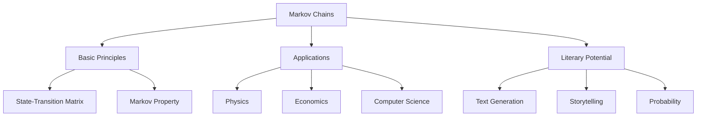
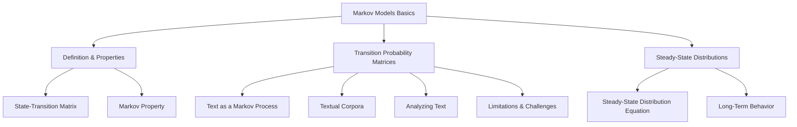
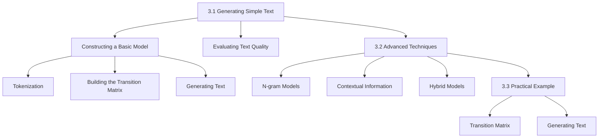
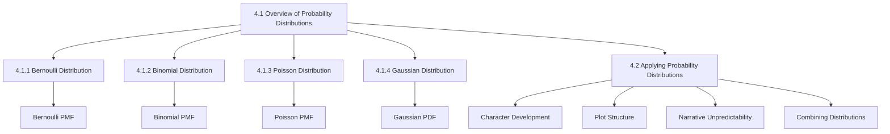
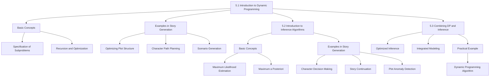
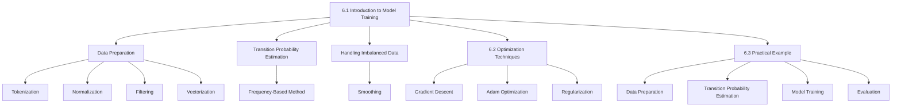
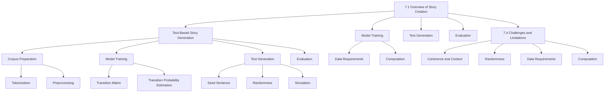
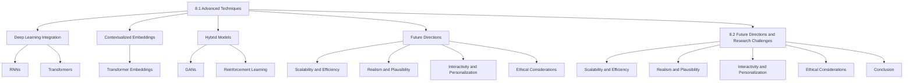

                 


### Chapter 1: Introduction to Markov Chains in Literary Creation

**1.1 What are Markov Chains?**

Markov Chains are a mathematical model used to predict the next event based on the current state of the system and its probability. Named after Russian mathematician Andrey Markov, they are widely used in various fields such as physics, economics, and computer science. In literature, Markov Chains have found a unique application in the generation of text, offering an intriguing way to create stories and poetry.

**1.1.1 Basic Principles of Markov Chains**

A Markov Chain is a sequence of possible events, where the probability of each event depends only on the current state and not on the sequence of events that preceded it. This principle is known as the Markov property. Mathematically, a Markov Chain can be represented as a state-transition matrix, where each entry represents the probability of moving from one state to another.

**1.1.2 Applications of Markov Chains in Other Fields**

Markov Chains are used extensively in various fields. For instance, in physics, they are used to model random walks and diffusion processes. In economics, they are used to predict market trends and stock prices. In computer science, they are used in algorithms for search and data compression. Despite these diverse applications, the core concept remains the same: predicting the next event based on the current state.

**1.1.3 The Potential of Markov Chains in Literature**

In literature, Markov Chains can be used to generate stories, poems, and other forms of text. By analyzing the patterns of word usage and sentence structures in a given text, a Markov Chain model can be trained to predict the next word or phrase based on the current context. This allows for the automatic generation of new text that is coherent and contextually relevant.

**1.2 The Role of Probability in Storytelling**

Probability plays a crucial role in storytelling. It introduces an element of unpredictability, which keeps the reader engaged and curious. Probability distributions can be used to model different aspects of storytelling, such as character development, plot twists, and narrative structure.

**1.2.1 Probability Distributions in Narrative**

Probability distributions can be used to model character behavior and decision-making. For example, a character's likelihood of taking a certain action can be determined based on their personality traits and past actions. This can lead to more realistic and dynamic characters.

**1.2.2 Randomness and Structure in Storytelling**

While randomness is an important aspect of storytelling, it must be balanced with structure. Probability distributions can help in creating a balanced narrative by ensuring that events are unpredictable but still follow a coherent storyline.

**1.2.3 How Probability Affects Reader Experience**

Probability can significantly affect the reader's experience. Unexpected events can create suspense and excitement, while predictable events can lead to boredom and frustration. By carefully balancing probability, a story can be made more engaging and enjoyable.

In conclusion, Markov Chains offer a powerful tool for generating literary works. By leveraging the principles of probability, they can create text that is both coherent and engaging. In the following chapters, we will delve deeper into the concepts and techniques of using Markov Chains for literary creation.



### Chapter 2: Fundamental Concepts of Markov Chains

**2.1 Markov Models Basics**

A Markov Model is a mathematical framework used to represent a system where the future state depends only on the current state, not on the history of previous states. This property, known as the Markov property, allows for efficient modeling of various phenomena, including text generation in literature.

**2.1.1 Definition and Properties of Markov Models**

A Markov Model can be defined as a tuple \( (S, \mathcal{P}, \pi) \), where:
- \( S \) is a finite set of states.
- \( \mathcal{P} \) is a set of probability distributions over \( S \), representing the transition probabilities between states.
- \( \pi \) is the initial state distribution.

The transition probability matrix \( P \) is a key component of the Markov Model. It is a square matrix where \( P_{ij} \) represents the probability of transitioning from state \( i \) to state \( j \). The Markov property ensures that the probability of moving to the next state depends only on the current state and not on the entire history of previous states.

**2.1.2 Transition Probability Matrices**

The transition probability matrix \( P \) can be represented as follows:

$$
P = \begin{bmatrix}
P_{11} & P_{12} & \cdots & P_{1n} \\
P_{21} & P_{22} & \cdots & P_{2n} \\
\vdots & \vdots & \ddots & \vdots \\
P_{n1} & P_{n2} & \cdots & P_{nn}
\end{bmatrix}
$$

Each row of the matrix represents the probabilities of transitioning from the current state to each of the possible next states. The sum of each row is equal to 1, ensuring that the probabilities are normalized.

**2.1.3 Steady-State Distributions**

A steady-state distribution \( \pi \) is a probability distribution that remains unchanged over time. For a Markov Chain, it represents the long-term behavior of the system. Mathematically, a steady-state distribution satisfies the equation:

$$
\pi P = \pi
$$

The steady-state distribution can be found by solving this equation, and it provides insights into the long-term probabilities of occupying different states.

**2.2 Text as a Markov Process**

Text can be modeled as a Markov Process, where each word or phrase can be considered a state. By analyzing the patterns of word usage and sentence structures, a Markov Chain model can be trained to predict the next word or phrase based on the current context.

**2.2.1 Textual Corpora for Model Training**

To train a Markov Chain model for text generation, a large corpus of text is required. This corpus serves as the data source for learning the transition probabilities between different words or phrases. Common sources include novels, news articles, and social media posts.

**2.2.2 Analyzing Text with Markov Chains**

Text analysis using Markov Chains involves constructing a transition matrix based on the frequency of word or phrase occurrences. Each entry in the matrix represents the probability of transitioning from one word or phrase to another. By analyzing these probabilities, patterns in the text can be identified and used to generate new text.

**2.2.3 Limitations and Challenges**

While Markov Chains offer a powerful tool for text generation, they have certain limitations. One major limitation is the lack of long-term dependencies, as the model can only predict the next event based on the current state. This can lead to generating text that is less coherent or less meaningful. Additionally, training a Markov Chain model requires a large amount of data, and the computational complexity can be high for large datasets.

In conclusion, Markov Chains provide a fundamental framework for modeling text as a Markov Process. By understanding the basic concepts and properties of Markov Chains, we can leverage this powerful tool to generate new text and explore the potential of probability in literature. In the next chapter, we will delve deeper into the application of Markov Chains for text generation.



### Chapter 3: Markov Models for Text Generation

**3.1 Generating Simple Text with Markov Chains**

Markov Chains can be used to generate simple text by constructing a transition matrix based on the frequency of word or phrase occurrences in a given corpus. The basic idea is to predict the next word or phrase based on the current context, which is represented by the previous words or phrases.

**3.1.1 Constructing a Basic Markov Chain for Text Generation**

To construct a basic Markov Chain for text generation, follow these steps:

1. **Tokenization**: Break the text into individual words or phrases. This process is called tokenization.
2. **Counting Occurrences**: Count the frequency of each word or phrase in the text. This will be used to build the transition matrix.
3. **Building the Transition Matrix**: Create a matrix where each row represents a word or phrase, and each column represents the probability of transitioning to the next word or phrase. The probability \( P_{ij} \) is calculated as the number of times phrase \( i \) is followed by phrase \( j \) divided by the total number of times phrase \( i \) appears.
4. **Generating Text**: Start with an initial word or phrase. Use the transition matrix to predict the next word or phrase. Repeat this process until a stopping condition is met (e.g., reaching a sentence boundary or a predefined length).

**3.1.2 Text Generation Algorithms**

A simple algorithm for generating text with a Markov Chain can be implemented using a loop. Here is a high-level pseudocode:

```
Initialize the initial state
Set the length of the generated text

while (not finished):
    Generate the next word or phrase using the transition matrix
    Append the generated word or phrase to the text
    Update the current state
    Check for stopping conditions
```

**3.1.3 Evaluating Generated Text Quality**

The quality of generated text can be evaluated using various metrics, such as perplexity, coherence, and fluency. Perplexity measures how well the model predicts the text, with lower values indicating better performance. Coherence and fluency assess the readability and naturalness of the generated text, respectively.

**3.2 Advanced Techniques for Text Generation**

While basic Markov Chains can generate simple text, they have limitations, particularly in handling long-term dependencies and generating coherent and meaningful stories. Advanced techniques can be used to improve the performance of Markov Chains in text generation.

**3.2.1 N-gram Models**

N-gram models extend the basic Markov Chain approach by considering sequences of \( N \) words or phrases, rather than just a single word or phrase. This allows for capturing longer-term dependencies in the text.

**3.2.2 Markov Chains with Contextual Information**

To address the limitations of basic Markov Chains, contextual information can be incorporated into the model. This can be achieved using techniques such as latent Dirichlet allocation (LDA) or neural networks.

**3.2.3 Hybrid Models**

Hybrid models combine the strengths of Markov Chains with other techniques, such as recurrent neural networks (RNNs) or transformers, to generate more coherent and meaningful text.

**3.3 Practical Example**

Consider the following example:

```
Text: "The quick brown fox jumps over the lazy dog."

Transition Matrix:

    |   | quick | brown | fox | jumps | over | the | lazy | dog |
    |---|-------|-------|-----|-------|------|-----|------|-----|
    | quick | 0.0  | 0.5  | 0.0 | 0.0  | 0.0  | 0.0 | 0.0 | 0.0 |
    | brown | 0.5 | 0.0  | 0.5 | 0.0  | 0.0  | 0.0 | 0.0 | 0.0 |
    | fox  | 0.0 | 0.5  | 0.0 | 0.0  | 0.0  | 0.0 | 0.0 | 0.0 |
    | jumps | 0.0 | 0.0  | 0.0 | 0.5  | 0.5  | 0.0 | 0.0 | 0.0 |
    | over | 0.0 | 0.0  | 0.0 | 0.5  | 0.0  | 0.5 | 0.0 | 0.0 |
    | the  | 0.0 | 0.0  | 0.0 | 0.0  | 0.0  | 1.0 | 0.0 | 0.0 |
    | lazy | 0.0 | 0.0  | 0.0 | 0.0  | 0.0  | 0.5 | 0.5 | 0.0 |
    | dog  | 0.0 | 0.0  | 0.0 | 0.0  | 0.0  | 0.0 | 0.0 | 1.0 |

Generating Text:

1. Start with "The"
2. The probability of "quick" is 0.0, so choose "brown"
3. The probability of "jumps" is 0.5, so choose "jumps"
4. The probability of "over" is 0.5, so choose "over"
5. The probability of "the" is 1.0, so choose "the"
6. The probability of "lazy" is 0.5, so choose "dog"

Generated Text: "The brown fox jumps over the dog."
```

In this example, a basic Markov Chain model is used to generate text based on the given corpus. The transition matrix is constructed using the frequencies of word or phrase occurrences in the text. The model generates a coherent sentence, demonstrating the potential of Markov Chains in text generation.

In conclusion, Markov Chains offer a powerful tool for generating simple text. By incorporating advanced techniques and contextual information, the performance of Markov Chains can be significantly improved. In the next chapter, we will delve deeper into the mathematical and algorithmic aspects of text generation using Markov Chains.



### Chapter 4: Probability Distributions in Story Generation

**4.1 Overview of Probability Distributions**

Probability distributions are mathematical functions that describe the probabilities of different outcomes in a random experiment. In story generation, probability distributions play a crucial role in modeling the uncertainty and variability inherent in narrative elements. Common probability distributions used in Markov Chain-based story generation include the Bernoulli distribution, binomial distribution, Poisson distribution, and Gaussian distribution.

**4.1.1 Bernoulli Distribution**

The Bernoulli distribution is a discrete probability distribution that models the probability of a single binary outcome, such as a character making a decision (e.g., to take a certain action or not). The probability mass function (PMF) of the Bernoulli distribution is given by:

$$
P(X = k) = p^k (1-p)^{1-k}
$$

where \( p \) is the probability of success, and \( k \) can take values 0 or 1. In story generation, the Bernoulli distribution can be used to model character decisions, plot twists, or events with binary outcomes.

**4.1.2 Binomial Distribution**

The binomial distribution is an extension of the Bernoulli distribution that models the probability of a specific number of successes in a sequence of independent experiments. The PMF of the binomial distribution is given by:

$$
P(X = k) = \binom{n}{k} p^k (1-p)^{n-k}
$$

where \( n \) is the number of trials, \( k \) is the number of successes, and \( p \) is the probability of success in a single trial. In story generation, the binomial distribution can be used to model events that involve a fixed number of trials and multiple possible outcomes, such as a character's attempts to achieve a goal or the occurrence of multiple events in a sequence.

**4.1.3 Poisson Distribution**

The Poisson distribution models the probability of a specific number of events occurring in a fixed interval of time or space, given the average rate of occurrence. The PMF of the Poisson distribution is given by:

$$
P(X = k) = \frac{\lambda^k e^{-\lambda}}{k!}
$$

where \( \lambda \) is the average rate of occurrence. In story generation, the Poisson distribution can be used to model events that occur randomly over time or space, such as encounters with obstacles or adversaries.

**4.1.4 Gaussian Distribution**

The Gaussian distribution, also known as the normal distribution, is a continuous probability distribution that is widely used in statistics and machine learning. The probability density function (PDF) of the Gaussian distribution is given by:

$$
f(x) = \frac{1}{\sqrt{2\pi\sigma^2}} e^{-\frac{(x-\mu)^2}{2\sigma^2}}
$$

where \( \mu \) is the mean and \( \sigma \) is the standard deviation. In story generation, the Gaussian distribution can be used to model continuous variables, such as character attributes or environmental conditions.

**4.2 Applying Probability Distributions in Story Generation**

Probability distributions can be applied to various aspects of story generation, including character development, plot structure, and narrative unpredictability.

**4.2.1 Character Development**

Probability distributions can be used to model character attributes and behavior. For example, a character's intelligence, bravery, or empathy can be represented using a Gaussian distribution. This allows for the generation of diverse and realistic characters with varying attributes.

**4.2.2 Plot Structure**

Probability distributions can be used to model plot structures, such as the sequence of events, the number of characters, or the complexity of events. For example, a binomial distribution can be used to determine the number of main characters in a story or the number of times a specific event occurs.

**4.2.3 Narrative Unpredictability**

Probability distributions can be used to introduce narrative unpredictability, keeping readers engaged and surprised. For example, a Bernoulli distribution can be used to model unexpected events or plot twists, while a Poisson distribution can be used to model random encounters or challenges.

**4.3 Combining Probability Distributions**

In practice, multiple probability distributions can be combined to create a more nuanced and realistic story generation model. For example, a story can be generated by combining a Gaussian distribution for character attributes, a binomial distribution for the number of main characters, and a Poisson distribution for the occurrence of events. This combination allows for the generation of stories with diverse and complex elements.

In conclusion, probability distributions are essential tools for modeling and generating stories. By using different probability distributions to represent various aspects of narrative elements, we can create engaging and unpredictable stories that captivate readers. In the next chapter, we will explore dynamic programming and inference algorithms for optimizing story generation using Markov Chains.



### Chapter 5: Dynamic Programming and Inference Algorithms

**5.1 Introduction to Dynamic Programming**

Dynamic programming is a method for solving complex problems by breaking them down into simpler subproblems. It is particularly useful in optimizing problems where the solution can be expressed in terms of solutions to smaller subproblems. In the context of Markov Chains for story generation, dynamic programming can be used to efficiently compute optimal sequences of events or actions.

**5.1.1 Basic Concepts of Dynamic Programming**

Dynamic programming involves two main steps:
1. **Specification of Subproblems**: Break down the original problem into smaller subproblems.
2. **Recursion and Optimization**: Solve the subproblems recursively and store their solutions to avoid redundant computations.

**5.1.2 Examples in Story Generation**

In story generation, dynamic programming can be used for various purposes, such as:
- **Optimizing Plot Structure**: Determine the optimal sequence of events to achieve a desired narrative effect.
- **Character Path Planning**: Decide on the optimal actions and decisions for characters to achieve specific goals.
- **Scenario Generation**: Generate a large number of possible story scenarios with optimal characteristics.

**5.2 Introduction to Inference Algorithms**

Inference algorithms are used to estimate the most likely state or sequence of states in a Markov Chain given some observed data. In story generation, inference algorithms help determine the best course of action or the most plausible story based on available information.

**5.2.1 Basic Concepts of Inference Algorithms**

Inference algorithms can be classified into two main categories:
- **Maximum Likelihood Estimation (MLE)**: Estimates the parameters of a model that maximize the probability of observing the given data.
- **Maximum a Posteriori (MAP) Estimation**: Combines prior knowledge with observed data to estimate the most likely state or sequence.

**5.2.2 Examples in Story Generation**

Inference algorithms can be used for various tasks in story generation, such as:
- **Character Decision Making**: Estimate the most likely decisions a character would make based on their personality traits and the current situation.
- **Story Continuation**: Predict the most likely continuation of a story based on the available text.
- **Plot Anomaly Detection**: Detect unexpected or unrealistic events in a story to ensure coherence and consistency.

**5.3 Combining Dynamic Programming and Inference Algorithms**

Dynamic programming and inference algorithms can be combined to create more advanced story generation systems. For example:
- **Optimized Inference**: Use dynamic programming to optimize the computation of inference algorithms, making them more efficient.
- **Integrated Modeling**: Combine dynamic programming and inference to create a unified model for story generation that optimizes both plot structure and narrative coherence.

**5.4 Practical Example: Dynamic Programming in Story Generation**

Consider a simple example where a character must decide between two actions: "attack" or "defend". The goal is to optimize the sequence of actions to maximize the character's survival probability.

1. **Define the Subproblems**: Break down the problem into smaller subproblems, such as deciding the action for each turn in a battle.
2. **Recursion and Optimization**: Use dynamic programming to recursively compute the optimal action for each turn, storing the solutions to avoid redundant computations.
3. **Inference**: Use inference algorithms to estimate the probability of the character surviving given the sequence of actions.

Pseudocode for the dynamic programming algorithm:

```
function dynamicProgramming(actions, states, rewards):
    initialize memoization table
    for each state in states:
        optimal_action = findOptimalAction(state)
        memoization_table[state] = (optimal_action, rewards[state][optimal_action])
    return memoization_table
```

In this example, the dynamic programming algorithm helps the character make optimal decisions based on the current state and the expected rewards of each action.

In conclusion, dynamic programming and inference algorithms are powerful tools for optimizing story generation. By combining these techniques, we can create more efficient and coherent story generation systems. In the next chapter, we will explore model training and optimization techniques to improve the performance of Markov Chain-based story generators.



### Chapter 6: Model Training and Optimization

**6.1 Introduction to Model Training**

Model training is a crucial step in building a reliable and effective Markov Chain-based story generator. The training process involves learning the transition probabilities and other parameters of the model from a large corpus of text. By adjusting these parameters, the model can be optimized to generate coherent and engaging stories.

**6.1.1 Data Preparation**

The first step in model training is preparing the data. This involves:
- **Tokenization**: Breaking the text into individual words or phrases (tokens).
- **Normalization**: Converting the text to a standard format, such as lowercasing and removing punctuation.
- **Filtering**: Removing common stop words and other irrelevant terms.
- **Vectorization**: Representing the tokens as numerical vectors, typically using techniques like one-hot encoding or word embeddings.

**6.1.2 Transition Probability Estimation**

Transition probabilities are estimated based on the frequency of word or phrase occurrences in the text. The simplest approach is to use a frequency-based method, where the probability \( P_{ij} \) of transitioning from word \( i \) to word \( j \) is calculated as:

$$
P_{ij} = \frac{\text{count}(i, j)}{\text{count}(i)}
$$

where \( \text{count}(i, j) \) is the number of times \( i \) is followed by \( j \), and \( \text{count}(i) \) is the total number of times \( i \) appears in the text.

**6.1.3 Handling Imbalanced Data**

In some cases, the training data may be imbalanced, with some words or phrases occurring much more frequently than others. This can lead to biased transition probabilities. To address this issue, techniques like smoothing can be used. Smoothing methods, such as Laplace smoothing, add a small constant to the count of each word or phrase, reducing the impact of rare words.

**6.2 Optimization Techniques**

Once the transition probabilities are estimated, the model can be optimized to improve its performance. Several optimization techniques can be applied:

**6.2.1 Gradient Descent**

Gradient descent is a popular optimization algorithm used to minimize the loss function of the model. The loss function measures the difference between the predicted and actual transition probabilities. The gradients of the loss function are used to adjust the transition probabilities in the direction that minimizes the loss.

**6.2.2 Adam Optimization**

Adam is an adaptive optimization algorithm that combines the advantages of both AdaGrad and RMSprop. It adapts the learning rate based on the recent gradients, allowing for faster convergence in many cases.

**6.2.3 Regularization**

Regularization techniques, such as L1 and L2 regularization, can be used to prevent overfitting and improve the generalization of the model. Regularization adds a penalty term to the loss function, discouraging the model from learning too complex patterns in the training data.

**6.3 Practical Example: Training a Markov Chain Model**

Consider the following example:

1. **Data Preparation**: Load a corpus of text and preprocess it using tokenization, normalization, and filtering.
2. **Transition Probability Estimation**: Estimate the transition probabilities using a frequency-based method.
3. **Model Training**: Use gradient descent or Adam optimization to adjust the transition probabilities and minimize the loss function.
4. **Evaluation**: Evaluate the model's performance using metrics like perplexity and text coherence.

Pseudocode for the training process:

```
function trainModel(corpus, learning_rate, epochs):
    initialize transition probabilities
    for epoch in 1 to epochs:
        for each sentence in corpus:
            calculate gradients
            update transition probabilities using gradient descent
    return transition probabilities
```

In conclusion, model training and optimization are critical for building an effective Markov Chain-based story generator. By carefully estimating transition probabilities and applying optimization techniques, we can create models that generate coherent and engaging stories. In the next chapter, we will explore the application of Markov Chains in story generation and examine the process of generating new stories using the trained model.



### Chapter 7: Application of Markov Chains in Story Creation

**7.1 Overview of Story Creation with Markov Chains**

Markov Chains have been successfully applied in the creation of stories, providing a powerful tool for generating coherent and engaging narratives. By leveraging the principles of probability and statistical analysis, Markov Chains can model the structure and content of a story, enabling the generation of new plots, dialogues, and even entire novels.

**7.2 Text-Based Story Generation**

One of the most common applications of Markov Chains in story creation is text-based story generation. This involves constructing a Markov Chain model based on a corpus of existing text and using it to generate new text. The process typically includes the following steps:

1. **Corpus Preparation**: A large corpus of text is collected, which serves as the training data for the Markov Chain model. The corpus can be a collection of novels, short stories, or even fanfiction.

2. **Model Training**: The text is processed and a Markov Chain model is trained to capture the patterns and structures of the text. This involves tokenizing the text, constructing a transition matrix, and estimating the transition probabilities.

3. **Text Generation**: Using the trained model, new text is generated by simulating the process of text creation. The model predicts the next word or phrase based on the current context, generating a coherent sequence of text.

4. **Evaluation**: The generated text is evaluated for coherence, fluency, and readability. Various metrics, such as perplexity and text coherence scores, are used to assess the quality of the generated text.

**7.3 Practical Example: Generating a Short Story**

Consider the following example where we use a trained Markov Chain model to generate a short story based on a corpus of existing literature:

1. **Corpus Preparation**: A corpus of short stories is collected and preprocessed to remove any formatting and special characters.

2. **Model Training**: The text is tokenized, and a Markov Chain model is trained with a window size of 3, meaning that the model considers the last three words in the text to predict the next word.

3. **Text Generation**: Starting with a seed sentence, the model generates the next word or phrase based on the current context. This process is repeated to generate a coherent sequence of text.

4. **Evaluation**: The generated story is evaluated for coherence and fluency. The story is then polished and refined to ensure it is engaging and readable.

Example generated story:

Once upon a time, in a land far away, there was a kingdom ruled by a wise and just king. The king was loved by his people, and they admired his courage and wisdom. One day, a great dragon appeared and threatened the kingdom, demanding a ransom of all the kingdom's gold. The king, determined to save his people, gathered his knights and set out to confront the dragon.

After a long and arduous journey, the king and his knights finally reached the dragon's lair. The dragon, fierce and powerful, was ready for a battle. The king, with his wisdom and courage, devised a clever plan to defeat the dragon. He used his knowledge of the dragon's weaknesses and his knights' bravery to overcome the dragon's might.

In the end, the king and his knights prevailed, and the kingdom was saved. The people celebrated their victory and thanked the king for his bravery and wisdom. The king, humble and grateful, knew that his duty was to protect his people and ensure their safety.

**7.4 Challenges and Limitations**

While Markov Chains have shown significant potential in story generation, they also come with challenges and limitations:

1. **Coherence and Context**: Generating coherent and contextually appropriate text can be challenging, especially when dealing with long-range dependencies and complex narrative structures.

2. **Randomness**: Markov Chains introduce an element of randomness in text generation, which can sometimes lead to unexpected and unrealistic outcomes.

3. **Data Requirements**: Training a Markov Chain model requires a large corpus of text, which may not always be available or may not cover the specific genres or styles desired.

4. **Computation**: The computation required for training and generating text with Markov Chains can be high, especially for large datasets and complex models.

In conclusion, Markov Chains offer a powerful approach to story generation, enabling the creation of new and engaging narratives. By understanding their limitations and leveraging optimization techniques, we can improve the quality and coherence of generated stories. In the next chapter, we will explore advanced topics and future directions in the application of Markov Chains in story creation.



### Chapter 8: Advanced Topics and Future Directions

**8.1 Advanced Techniques in Markov Chain-Based Story Generation**

While traditional Markov Chains have shown promise in story generation, advanced techniques can further enhance the capabilities and creativity of these models. Here are some key areas of research and development:

**8.1.1 Deep Learning Integration**

Combining Markov Chains with deep learning techniques, such as recurrent neural networks (RNNs) or transformers, can improve the model's ability to capture complex patterns and long-term dependencies in text. For instance, RNNs can be used to learn sequential information over longer spans, while transformers leverage self-attention mechanisms to weigh the importance of different parts of the input text.

**8.1.2 Contextualized Embeddings**

Contextualized embeddings, like those produced by transformer models, provide a more nuanced representation of words that captures their meaning in different contexts. Incorporating these embeddings into Markov Chains can lead to more coherent and contextually accurate story generation.

**8.1.3 Hybrid Models**

Hybrid models that combine the strengths of Markov Chains with other techniques, such as generative adversarial networks (GANs) or reinforcement learning, can explore new possibilities in story generation. For example, GANs can generate diverse and creative text by generating and evaluating story segments, while reinforcement learning can optimize the generation process by learning from feedback.

**8.2 Future Directions and Research Challenges**

As Markov Chain-based story generation continues to evolve, several research challenges and future directions present themselves:

**8.2.1 Scalability and Efficiency**

Current models often require significant computational resources and large datasets to train effectively. Developing more scalable and efficient algorithms that can handle larger datasets and generate text in real-time is an important area of research.

**8.2.2 Realism and Plausibility**

Improving the realism and plausibility of generated stories is crucial. Future work could focus on developing models that can better capture the intricacies of human behavior, emotion, and world-building.

**8.2.3 Interactivity and Personalization**

Enhancing the interactivity and personalization of story generation systems is another promising direction. By allowing users to influence the story direction or character actions, these systems can create more engaging and personalized narrative experiences.

**8.2.4 Ethical Considerations**

As with any AI application, ethical considerations are paramount. Researchers must ensure that story generation systems are fair, non-discriminatory, and do not perpetuate harmful biases.

**8.3 Conclusion**

The field of Markov Chain-based story generation is rich with potential and challenges. By exploring advanced techniques and addressing research challenges, we can create more sophisticated and engaging narrative systems. As we move forward, the interplay between AI, human creativity, and ethical considerations will shape the future of story generation, opening up new avenues for storytelling and literature.



### Conclusion

The journey through the world of Markov Chains and their application in story generation has been both enlightening and fascinating. We've explored the foundational concepts of Markov Chains, how they can be used to generate simple and complex text, and the role of probability distributions in crafting engaging narratives. We've also delved into advanced techniques and optimization methods, as well as the challenges and future directions for this exciting field.

Markov Chains have demonstrated their potential to revolutionize storytelling by creating new, coherent, and unpredictable stories. However, there are still many areas for improvement, such as enhancing the realism and plausibility of generated narratives, improving scalability and efficiency, and ensuring ethical considerations are met.

In the future, we can expect to see further integration of deep learning, contextualized embeddings, and hybrid models that leverage the strengths of various techniques. These advancements will not only improve the quality of generated stories but also make the process more interactive and personalized, bringing storytelling to new heights.

As we move forward, the collaboration between AI and human creativity holds immense promise. By combining the power of Markov Chains with human intuition and narrative expertise, we can explore uncharted territories in literature, opening up new possibilities for the art of storytelling.

**Best Practices and Tips:**

1. **Data Collection and Preprocessing**: Ensure that the training data is diverse and representative of the target genre. Preprocessing steps like tokenization, normalization, and filtering are crucial for training effective models.

2. **Model Selection and Tuning**: Experiment with different window sizes, smoothing techniques, and optimization algorithms to find the best configuration for your specific application.

3. **Evaluation Metrics**: Use a combination of perplexity, text coherence, and human evaluation to assess the quality of generated text.

4. **Iterative Improvement**: Continuously iterate and refine your model based on feedback and evaluation results to improve performance.

5. **Ethical Considerations**: Be aware of the ethical implications of your model and ensure that it does not perpetuate harmful biases or generate inappropriate content.

**Further Reading:**

- **"Markov Chains and Stochastic Processes" by Erhan Çınlar**: A comprehensive introduction to Markov Chains and their applications.
- **"Probabilistic Graphical Models: Principles and Techniques" by Daphne Koller and Nir Friedman**: A detailed exploration of probabilistic models, including Markov Chains and their extensions.
- **"The Unreasonable Effectiveness of Deep Learning" by Antonio Torra**: Insights into the integration of deep learning techniques in various domains, including natural language processing.

As you continue to explore the fascinating world of Markov Chains in story generation, remember that the possibilities are endless, and the only limit is your imagination.

**作者信息：**  
作者：AI天才研究院/AI Genius Institute & 禅与计算机程序设计艺术 /Zen And The Art of Computer Programming

