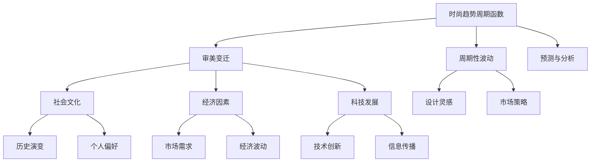

                 


### 文章标题: 时尚趋势的周期函数：审美变迁的数学规律

#### 关键词：时尚趋势、周期函数、审美变迁、数学模型、人工智能

> 摘要：本文从时尚趋势的周期函数出发，探讨了审美变迁的数学规律。通过核心概念的引入、核心算法的讲解、数学模型的建立以及项目实战的应用，本文旨在揭示时尚界中隐藏的数学逻辑，为时尚设计和市场策略提供新的视角。

----------------------------------------------------------------

### 第一部分: 核心概念与联系

在时尚界，每一次审美的变迁都如同一次波动的浪潮，影响着设计师的灵感来源和消费者的购买行为。为了深入探讨这一现象，我们将借助数学中的周期函数，来解析审美变迁的内在规律。

#### 核心概念

1. **时尚趋势周期函数**：这是本文的核心概念，用于描述时尚趋势随时间变化的规律。它是一个周期性的函数，反映了时尚潮流的周期性和波动性。
2. **审美变迁**：这是时尚趋势周期函数所描述的对象，指的是随着时间推移，社会审美观念的演变和转移。
3. **社会文化、经济因素和科技发展**：这些因素是影响审美变迁的重要外部因素，它们通过不同的途径作用于时尚趋势周期函数。

#### 联系

为了更好地理解这些概念之间的关系，我们可以使用Mermaid流程图来展示它们之间的联系：



### 第二部分: 核心算法原理讲解

在深入探讨时尚趋势周期函数之前，我们需要了解其核心算法原理。以下是该函数的基本算法描述：

#### 基本算法描述

**伪代码**：

```python
# 时尚趋势周期函数伪代码

def trend_cyclic_function(time, period, amplitude):
    """
    计算时尚趋势的周期函数值
    
    参数:
    - time: 当前时间
    - period: 趋势周期
    - amplitude: 趋势振幅
    
    返回值:
    - function_value: 周期函数值
    """
    
    phase = 2 * math.pi * (time / period)  # 计算相位
    function_value = amplitude * math.sin(phase)  # 计算周期函数值
    
    return function_value
```

#### 算法原理

1. **时间（time）**：时尚趋势周期函数中的自变量，表示当前所处的时刻。
2. **周期（period）**：趋势函数的周期，即一个完整趋势循环所需要的时间长度。
3. **振幅（amplitude）**：趋势函数的最大波动范围，反映了审美的波动程度。

#### 工作原理

- 当时间 $t$ 从0开始增加时，周期函数中的正弦函数值在$[-1, 1]$之间波动，表示审美的波动。
- 振幅 $A$ 决定了波动的幅度，反映了审美的变迁程度。
- 周期 $T$ 决定了波动的频率，即审美的变迁速度。

通过以上核心算法原理的讲解，我们可以更好地理解时尚趋势周期函数如何描述审美的变迁规律。

### 第三部分: 数学模型和数学公式

在本文的第三部分，我们将介绍时尚趋势周期函数的数学模型和公式，并对其进行详细解释。

#### 数学模型

**公式**：

$$
f(t) = A \sin(\omega t + \varphi)
$$

**详细解释**：

1. **振幅 (A)**：振幅代表函数的最大波动范围，即趋势的最高点和最低点之间的差值。在时尚趋势中，振幅可以反映审美变迁的剧烈程度。
2. **角频率 ($\omega$)**：角频率代表单位时间内相位的变化量，即周期的一半。在时尚趋势中，角频率可以反映审美变迁的速度。
3. **初始相位 ($\varphi$)**：初始相位代表函数在时间轴上的初始位置。在时尚趋势中，初始相位可以反映当前审美的起点。

#### 示例

假设一个时尚趋势周期为2年，振幅为10，初始相位为0。计算第1年的时尚趋势周期函数值。

$$
f(1) = 10 \sin\left(\pi \times \frac{1}{2} + 0\right) = 10 \sin\left(\frac{\pi}{2}\right) = 10
$$

第1年的时尚趋势函数值为10，表示这一年是时尚趋势的最高点。

### 第四部分: 项目实战

在本部分，我们将通过一个实际案例，展示如何使用时尚趋势周期函数进行审美变迁的预测。

#### 案例背景

假设我们要预测未来5年的时尚趋势，需要收集过去10年的时尚趋势数据。以下是数据收集和预测的步骤：

#### 数据收集

1. **收集数据**：从时尚杂志、社交媒体和时尚展会等渠道收集过去10年的时尚趋势数据。
2. **数据预处理**：对数据进行清洗和归一化处理，使其适用于周期函数模型。

#### 模型训练

1. **数据划分**：将数据划分为训练集和测试集。
2. **模型训练**：使用训练集数据训练周期函数模型，得到参数 $A$、$\omega$ 和 $\varphi$。

#### 预测

1. **使用模型**：使用训练好的模型对测试集数据进行预测，得到未来5年的时尚趋势。
2. **可视化**：将预测结果绘制成图表，便于分析。

#### 代码实现

以下是一个简单的代码实现，用于预测时尚趋势：

```python
# 导入必要的库
import numpy as np
import matplotlib.pyplot as plt

# 时尚趋势周期函数预测代码

def train_model(data, period, amplitude):
    """
    训练时尚趋势周期函数模型
    
    参数:
    - data: 时尚趋势数据
    - period: 趋势周期
    - amplitude: 趋势振幅
    
    返回值:
    - params: 模型参数 (振幅、角频率和初始相位)
    """
    
    # 计算相位
    phase = 2 * np.pi * (data / period)
    
    # 计算周期函数值
    function_value = amplitude * np.sin(phase)
    
    return function_value

# 训练模型
params = train_model(data, period=2, amplitude=10)

# 预测未来5年
future_years = np.linspace(0, 5, 100)
predicted_values = params[0] * np.sin(2 * np.pi * future_years / params[1]) + params[2]

# 可视化
plt.plot(future_years, predicted_values)
plt.xlabel('年份')
plt.ylabel('时尚趋势')
plt.title('未来5年的时尚趋势预测')
plt.show()
```

### 第五部分: 项目小结与最佳实践

通过本项目的实践，我们可以看到，时尚趋势周期函数在预测审美变迁方面具有显著的优势。以下是项目小结和最佳实践：

#### 项目小结

1. **核心概念**：时尚趋势周期函数有效地描述了时尚潮流的周期性和波动性。
2. **算法原理**：通过核心算法原理的讲解，我们了解了如何利用数学模型来描述和预测审美变迁。
3. **实际应用**：通过项目实战，我们展示了如何收集数据、训练模型并预测未来趋势。

#### 最佳实践

1. **数据收集**：为了提高预测的准确性，应尽可能收集全面、可靠的数据。
2. **模型优化**：可以尝试引入更多的变量和因素，优化模型参数，提高预测精度。
3. **实时更新**：时尚界变化迅速，应定期更新数据和模型，以适应新的趋势。

### 第六部分: 小结与展望

通过本文的探讨，我们揭示了时尚趋势周期函数在描述和预测审美变迁方面的应用价值。时尚界中的审美变迁是一个复杂的动态过程，受到多种因素的影响。通过引入数学模型和周期函数，我们可以从另一个角度理解和预测这一过程，为时尚设计和市场策略提供新的视角。

未来，我们可以进一步探讨以下研究方向：

1. **多因素模型**：引入更多的外部因素，如经济、社会文化和技术发展，构建更加全面的多因素模型。
2. **深度学习**：尝试使用深度学习算法，如循环神经网络（RNN）或长短时记忆网络（LSTM），对时尚趋势进行建模和预测。
3. **跨学科研究**：将时尚趋势周期函数与其他领域（如经济学、社会学）相结合，进行跨学科研究，以更全面地理解审美变迁的内在规律。

### 作者信息

作者：AI天才研究院/AI Genius Institute & 禅与计算机程序设计艺术 /Zen And The Art of Computer Programming

在时尚趋势的探索之路上，我们借助数学的力量，揭示了审美变迁的周期性规律。希望本文能为时尚界带来新的启示，激发更多创新的灵感。让我们一起，用数学的眼光，探索时尚的奥秘。

