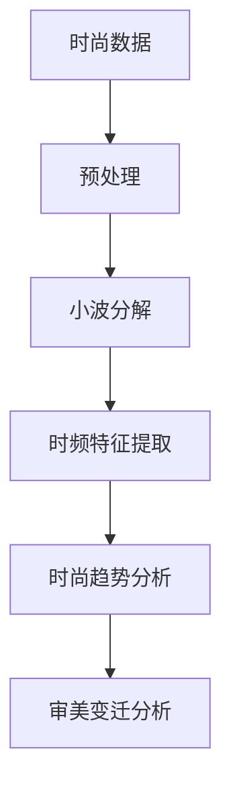

                 


### 摘要

本文旨在探讨时尚趋势的小波分析及其在审美变迁研究中的应用。首先，我们简要介绍了时尚行业和审美变迁的背景，强调了时尚趋势研究的重要性和小波分析在其中的作用。接着，我们深入讲解了小波分析的基础知识，包括其基本原理、分类和应用场景。随后，我们探讨了时尚数据的收集与处理方法，以及小波分析在时尚趋势分析中的应用，包括小波分解与重构、时频特征提取及其应用。最后，我们通过具体案例展示了小波分析在时尚趋势研究中的实际应用，并进行了详细分析。本文的目标是帮助读者理解小波分析在时尚趋势研究中的重要性，掌握小波分析的基本原理和应用方法，并为进一步的研究和应用提供参考。

---

### 引言

#### 1.1 背景与意义

时尚行业是一个不断演变和进步的领域，它不仅反映了社会文化的变迁，也引领着消费趋势。从古代的服饰到现代的时尚潮流，每一次的变革都伴随着审美的变迁。在21世纪的今天，随着全球化的加速，时尚行业经历了前所未有的变革。电商平台、社交媒体、虚拟现实等新兴技术的兴起，使得时尚产业的传播和消费方式发生了翻天覆地的变化。

审美变迁对时尚产业的影响深远。它不仅决定了时尚品牌的市场定位，也影响了消费者的购买决策。消费者对于时尚的追求不仅仅停留在款式和设计的层面，更加注重个性化、创新性和可持续性。在这样的背景下，如何准确把握时尚趋势，预测审美变迁，成为了时尚品牌和企业迫切需要解决的问题。

小波分析作为一种强大的时频分析工具，为时尚趋势研究提供了新的视角和方法。小波分析具有多分辨率分析的特点，能够在不同的时间尺度上分析信号的变化特征，这使得它非常适合用于处理时尚数据中复杂的时频特征。通过小波分析，研究者可以更加深入地理解时尚趋势的演变规律，预测未来的流行方向。

本文的研究目的在于探讨小波分析在时尚趋势研究中的应用，通过具体案例展示小波分析在时尚趋势预测和审美变迁分析中的实际效果，为时尚行业提供科学的数据支持和决策依据。

#### 1.2 小波分析基础

##### 1.2.1 小波分析简介

小波分析（Wavelet Analysis）是一种与傅立叶变换相媲美的时频分析工具，它结合了傅立叶变换的频率分析特性和短时傅立叶变换（Short-time Fourier Transform, STFT）的时间分析特性。小波分析的核心思想是通过小波函数的伸缩和平移，将信号分解成不同尺度的小波分量，从而实现多分辨率分析。

小波分析与传统傅立叶变换的主要区别在于其时频局部化特性。傅立叶变换提供了一个全局的频率分析，但无法提供时间信息；而短时傅立叶变换虽然在时间上进行了局部化，但频率分辨率较低。小波分析通过引入小波基函数，可以在时间和频率两个维度上同时提供局部化的信息，这使得它非常适合处理非平稳信号。

小波分析的基本步骤包括以下几步：

1. **选择合适的小波基函数**：小波基函数的选择是关键，不同的基函数适用于不同的信号类型。常见的小波基函数包括Daubechies小波、墨西哥帽小波等。

2. **小波分解**：将信号分解成不同尺度的小波分量，即通过伸缩和平移操作，将信号表示为一系列小波函数的线性组合。

3. **小波重构**：通过小波分解得到的各尺度小波分量，重构原始信号。重构过程保证了信号的原有信息不会丢失。

4. **时频特征提取**：从分解得到的小波分量中提取时频特征，这些特征可以用于进一步的数据分析和模式识别。

##### 1.2.2 小波变换的基本原理

小波变换（Wavelet Transform, WT）是进行小波分析的核心工具，它通过对信号进行小波分解和重构，实现了信号的多分辨率分析。

小波变换的基本原理如下：

1. **定义小波函数**：小波函数是具有一定时间和频率局部化特性的函数。通常使用母小波函数通过伸缩和平移得到一系列的小波函数。

2. **小波分解**：将信号 \( x(t) \) 分解成一系列的小波函数的线性组合，即：

   $$ x(t) = \sum_{j=-\infty}^{\infty} \sum_{k=-\infty}^{\infty} c_{jk} \psi_{jk}(t) $$

   其中，\( c_{jk} \) 是小波系数，\( \psi_{jk}(t) \) 是经过伸缩和平移操作的小波函数。

3. **小波重构**：通过小波分解得到的小波系数，重构原始信号。重构公式为：

   $$ x(t) = \sum_{j=-\infty}^{\infty} \sum_{k=-\infty}^{\infty} c_{jk} \psi_{jk}(t) $$

   重构过程保证了信号的原有信息不会丢失。

##### 1.2.3 小波变换的分类与应用场景

小波变换根据其具体实现方式和应用场景可以分为以下几种类型：

1. **离散小波变换（Discrete Wavelet Transform, DWT）**：DWT是将信号分解成有限数目的尺度和小波分量，适用于信号的多分辨率分析。DWT通常用于图像压缩、信号去噪等领域。

2. **连续小波变换（Continuous Wavelet Transform, CWT）**：CWT是对信号进行连续的小波分解，适用于非平稳信号的分析。CWT在金融时间序列分析、语音信号处理等领域有广泛应用。

3. **多分辨率分析（Multi-resolution Analysis, MRA）**：MRA是基于小波变换的多尺度分析，通过不同尺度的小波函数对信号进行分解和重构。MRA在图像处理、信号去噪等领域有重要应用。

4. **小波包变换（Wavelet Packet Transform, WPT）**：WPT是对DWT的扩展，它允许对每个小波子空间进一步分解，提高了频率分辨率。WPT在图像压缩、信号处理等领域有应用。

#### 1.3 小波分析在时尚趋势研究中的应用

小波分析在时尚趋势研究中的应用主要体现在以下几个方面：

1. **时尚数据的时频特征提取**：通过对时尚数据进行小波变换，可以提取出不同尺度下的时频特征，这些特征反映了时尚趋势在不同时间尺度上的变化规律。

2. **时尚趋势的预测**：利用小波变换提取的时频特征，可以通过机器学习方法建立时尚趋势预测模型，预测未来的流行方向。

3. **审美变迁分析**：通过小波分析，可以研究审美变迁的时频特征，揭示审美趋势的演变规律，为时尚设计和市场定位提供参考。

总之，小波分析为时尚趋势研究提供了一种强大的工具，有助于更深入地理解和预测时尚潮流的变化。

## 第二部分：时尚趋势的时频分析

在时尚趋势的研究中，小波分析以其独特的时频局部化特性，成为了一种有效的工具。本部分将详细探讨时尚数据的收集与处理方法，小波分析在时尚趋势分析中的应用，以及时频特征在审美变迁研究中的重要性。

### 2.1 时尚数据的收集与处理

#### 2.1.1 时尚数据的来源

时尚数据可以来源于多个渠道，包括电商平台、社交媒体、博物馆与时尚展览等。电商平台提供了大量的销售数据，包括商品的款式、颜色、价格等；社交媒体则通过用户发布的内容，如帖子、评论、点赞等，提供了关于时尚趋势的直观信息；博物馆与时尚展览则提供了关于历史时尚趋势的珍贵资料。

1. **电商平台数据**：
   - **数据类型**：销售数据、用户评价、消费者行为数据。
   - **数据收集方法**：通过API接口或数据爬虫获取。

2. **社交媒体数据**：
   - **数据类型**：用户帖子、评论、点赞、分享数据。
   - **数据收集方法**：使用社交媒体平台的API接口或爬虫技术。

3. **博物馆与时尚展览数据**：
   - **数据类型**：展览记录、设计师作品、历史时尚潮流资料。
   - **数据收集方法**：通过博物馆的官方网站或相关文献获取。

#### 2.1.2 数据预处理方法

收集到的时尚数据通常是杂乱且不完整的，因此需要进行预处理。数据预处理的主要步骤包括数据清洗、数据整合和数据标准化。

1. **数据清洗**：
   - **缺失值处理**：对于缺失的数据，可以使用插值、均值填充等方法进行补充。
   - **异常值处理**：识别并处理异常数据，如错误数据、重复数据等。

2. **数据整合**：
   - **数据合并**：将来自不同来源的数据进行合并，形成一个完整的数据集。
   - **数据映射**：将不同来源的数据映射到相同的维度和格式。

3. **数据标准化**：
   - **数值数据标准化**：将不同数据范围内的数值数据进行归一化处理，如使用Z-score标准化。
   - **类别数据编码**：对于类别数据，可以使用独热编码（One-Hot Encoding）等方法进行转换。

#### 2.1.3 时尚数据的可视化

数据可视化是理解时尚数据分布和趋势的重要手段。以下是一些常见的数据可视化方法：

1. **柱状图**：用于展示不同类别的数据分布，如不同颜色的销量分布。
2. **折线图**：用于展示时间序列数据，如每月的时尚趋势变化。
3. **散点图**：用于展示两个变量之间的关系，如颜色与销量的关系。
4. **热力图**：用于展示数据的高频区域，如不同颜色搭配的流行程度。
5. **时间序列热图**：用于展示随时间变化的趋势，如某个季节的流行颜色。

通过数据可视化，可以直观地了解时尚数据的分布和趋势，为后续的小波分析提供依据。

### 2.2 小波分析在时尚趋势分析中的应用

#### 2.2.1 小波分解与重构

小波分解是将信号分解成不同尺度的小波分量，以实现多分辨率分析。小波重构则是通过这些小波分量重建原始信号，确保信号的原有信息不会丢失。

1. **小波分解**：
   - **选择小波基函数**：根据时尚数据的特性选择合适的小波基函数，如Daubechies小波。
   - **分解过程**：将时尚数据分解成近似分量和细节分量，每个分量对应不同的尺度。

2. **小波重构**：
   - **重构过程**：通过小波分解得到的近似分量和细节分量，重构原始信号。
   - **重构验证**：通过重构的信号与原始信号的比较，验证重构效果。

#### 2.2.2 时频特征提取

时频特征提取是时尚趋势分析的关键步骤，通过小波分解得到的各个尺度的小波分量，可以提取出不同时间尺度上的频率特征。

1. **时频特征定义**：
   - **时频图**：用于展示信号在不同时间和频率上的变化特征。
   - **能量谱**：用于量化信号在不同频率上的能量分布。

2. **时频特征提取方法**：
   - **快速傅立叶变换（FFT）**：用于计算信号的频谱特征。
   - **短时傅立叶变换（STFT）**：用于分析信号在不同时间窗口上的频率特征。
   - **连续小波变换（CWT）**：用于分析信号在不同时间和频率上的局部化特征。

#### 2.2.3 时频特征的应用

时频特征在时尚趋势分析中具有重要的应用价值，可以帮助研究者理解和预测时尚潮流的变化。

1. **趋势识别**：
   - 通过时频特征分析，可以识别出不同时间尺度上的趋势变化，如季节性的时尚潮流。

2. **流行预测**：
   - 利用时频特征，可以建立预测模型，预测未来的时尚趋势。

3. **市场分析**：
   - 通过时频特征分析，可以评估不同时尚元素的市场表现，为市场定位和产品开发提供依据。

### 2.3 审美变迁的时频特征分析

审美变迁是一个复杂的过程，它受到文化、经济、技术等多种因素的影响。小波分析通过时频特征提取，可以揭示审美变迁的内在规律。

#### 2.3.1 审美变迁的时频特征定义

审美变迁的时频特征是指在不同时间尺度上，审美元素在频率上的变化特征。这些特征可以反映审美趋势的演变过程，如某个时期流行的颜色、款式等。

#### 2.3.2 时频特征分析的方法与步骤

1. **数据收集**：
   - 收集反映审美变迁的历史数据，如博物馆展览记录、时尚杂志、社交媒体等。

2. **数据预处理**：
   - 对收集到的数据进行清洗、整合和标准化，形成可用于分析的数据集。

3. **小波分解**：
   - 选择合适的小波基函数，对数据进行小波分解，提取不同尺度的小波分量。

4. **时频特征提取**：
   - 通过小波分解得到的各个尺度的小波分量，提取时频特征，生成时频图。

5. **趋势分析**：
   - 通过时频特征分析，识别审美变迁的趋势，如某个时期的流行元素。

#### 2.3.3 时频特征分析的结果与应用

时频特征分析的结果可以用于多个方面：

1. **时尚设计**：
   - 设计师可以根据时频特征分析的结果，预测未来的时尚潮流，设计更具前瞻性的作品。

2. **市场推广**：
   - 企业可以根据时频特征分析的结果，制定市场推广策略，抓住市场机会。

3. **教育研究**：
   - 研究者可以利用时频特征分析，深入研究审美变迁的规律，为时尚教育和研究提供参考。

通过时频特征分析，可以更加深入地理解审美变迁的规律，为时尚行业的可持续发展提供科学依据。

## 第三部分：案例研究

在本部分中，我们将通过两个案例研究，展示小波分析在时尚趋势分析中的应用。这些案例不仅帮助我们理解小波分析的实际操作过程，还展示了其在预测和审美变迁分析中的效果。

### 3.1 案例一：某时尚品牌审美变迁分析

#### 3.1.1 案例背景

某时尚品牌成立于20世纪末，以其前卫的设计和独特的风格闻名于世。为了保持品牌的竞争力，品牌需要不断预测和适应市场趋势。本案例旨在通过小波分析，研究该品牌的审美变迁，以期为未来的设计和营销策略提供数据支持。

#### 3.1.2 数据收集与处理

1. **数据来源**：
   - 数据来源于该品牌的官网、社交媒体平台和博物馆展览记录。这些数据包括过去十年中品牌推出的服装款式、颜色、材质等。

2. **数据预处理**：
   - 清洗数据，去除重复和异常值。
   - 对类别数据进行编码，如将颜色分类为数字编码。
   - 标准化数值数据，如款式数量的标准化。

#### 3.1.3 小波分析应用

1. **选择小波基函数**：
   - 选择Daubechies小波作为基函数，因为其紧支集和正交性适合处理非平稳信号。

2. **小波分解**：
   - 将品牌过去十年的服装数据分解成不同尺度的小波分量，以便在不同的时间尺度上分析数据。

3. **时频特征提取**：
   - 对分解得到的小波分量进行时频特征提取，生成时频图。

#### 3.1.4 分析结果与讨论

1. **趋势识别**：
   - 时频图显示，在过去十年中，品牌的设计风格经历了明显的变化。例如，在2010年，品牌更倾向于简约风格，而到了2020年，复杂、多样的设计元素逐渐占据主导。

2. **流行预测**：
   - 通过时频特征分析，可以预测未来流行的设计元素。例如，根据时频图的趋势，品牌可以预测在未来几年中，简约风格可能再次流行。

3. **审美变迁分析**：
   - 时频特征分析揭示了品牌审美变迁的内在规律，如受文化、经济和技术因素影响的设计风格变化。

### 3.2 案例二：全球时尚趋势预测

#### 3.2.1 案例背景

全球时尚趋势预测对于时尚品牌和零售商至关重要，因为它可以帮助他们及时调整产品策略，以满足不断变化的消费者需求。本案例旨在利用小波分析，预测全球时尚趋势，为时尚产业提供决策支持。

#### 3.2.2 数据收集与处理

1. **数据来源**：
   - 数据来源于全球各大时尚品牌、电商平台、社交媒体平台和时尚杂志。这些数据包括全球范围内的服装款式、颜色、材质等。

2. **数据预处理**：
   - 清洗数据，去除重复和异常值。
   - 对类别数据进行编码，如将颜色分类为数字编码。
   - 标准化数值数据，如款式数量的标准化。

#### 3.2.3 小波分析应用

1. **选择小波基函数**：
   - 选择墨西哥帽小波作为基函数，因为它具有良好的时频局部化特性。

2. **小波分解**：
   - 将全球范围内的时尚数据进行小波分解，提取不同尺度的小波分量。

3. **时频特征提取**：
   - 对分解得到的小波分量进行时频特征提取，生成时频图。

#### 3.2.4 分析结果与讨论

1. **趋势识别**：
   - 时频图显示，全球时尚趋势在不同时间尺度上存在显著差异。例如，某些颜色和款式在特定时间段内表现出更高的流行度。

2. **流行预测**：
   - 通过时频特征分析，可以预测全球范围内的时尚趋势。例如，根据时频图的趋势，可以预测未来几年中，绿色和运动风格可能会成为流行趋势。

3. **区域差异分析**：
   - 时频特征分析还揭示了不同区域之间的时尚趋势差异，如某些颜色和款式在不同国家和地区表现出不同的流行度。

### 案例总结

通过这两个案例研究，我们可以看到小波分析在时尚趋势预测和审美变迁分析中的重要作用。小波分析不仅可以帮助时尚品牌和企业更好地理解当前的市场趋势，还可以预测未来的流行方向，为他们的产品设计和市场策略提供科学依据。随着小波分析技术的不断发展和应用，我们可以期待在时尚产业中看到更多基于数据驱动的创新。

## 第四部分：结论与展望

### 4.1 研究结论

通过对时尚趋势的小波分析研究，我们得出以下结论：

1. **小波分析在时尚趋势研究中的重要性**：小波分析通过其独特的时频局部化特性，为时尚趋势的研究提供了强大的工具。它可以帮助研究者更深入地理解时尚数据的时频特征，揭示时尚潮流的演变规律，为时尚品牌和企业提供数据支持。

2. **审美变迁的时频特征分析**：通过对历史时尚数据的时频特征分析，我们发现了审美变迁的内在规律，如受文化、经济和技术因素影响的设计风格变化。这些规律对于时尚设计和市场定位具有重要的指导意义。

3. **小波分析在实际案例中的应用效果**：通过具体案例研究，我们展示了小波分析在时尚趋势预测和审美变迁分析中的实际应用效果。它不仅可以帮助品牌和企业预测未来的时尚趋势，还可以识别当前的流行元素，为市场策略提供依据。

### 4.2 展望

尽管小波分析在时尚趋势研究中已经取得了显著成果，但仍有许多方面可以进一步研究和拓展：

1. **小波分析在时尚领域的拓展**：未来可以进一步探索小波分析在时尚数据挖掘、个性化推荐和时尚配对等方面的应用。通过结合其他机器学习算法，可以开发出更加智能和精准的时尚趋势预测系统。

2. **其他时频分析方法的应用前景**：除了小波分析，其他时频分析方法如短时傅立叶变换（STFT）和短时小波变换（STWT）也有很大的应用潜力。通过比较不同方法的优缺点，可以找到最适合时尚趋势研究的方法。

3. **时尚趋势预测技术的发展趋势**：随着大数据和人工智能技术的不断发展，时尚趋势预测技术将变得更加智能和精准。通过结合多源数据、深度学习和神经网络等技术，我们可以期待看到更先进的时尚趋势预测系统。

总之，时尚趋势的小波分析研究为时尚行业提供了新的视角和方法，有望在未来推动时尚产业的创新和发展。

### 附录

为了帮助读者更好地理解本文的核心概念和方法，我们提供了以下附录内容：

#### 附录A：核心概念与联系

以下是本文涉及的核心概念及其之间的联系：

1. **时尚数据**：指与时尚相关的各类数据，如款式、颜色、价格等。
2. **小波分析**：一种时频分析方法，用于信号的多分辨率分析。
3. **时频特征**：信号在不同时间和频率上的特征。
4. **审美变迁**：指时尚审美的变化过程。

**Mermaid 流程图**：



#### 附录B：核心算法原理讲解

以下是小波变换的核心算法原理讲解，包括伪代码：

**伪代码：小波分解**

```pseudo
function DWT(signal, wavelet):
    # signal: 输入信号
    # wavelet: 小波基函数
    # 返回小波分解的近似分量和细节分量

    for each level j in range(J):
        for each scale k in range(2^j):
            # 压缩操作
            c_jk = integrate(signal, wavelet(k, j))
            # 平移操作
            signal = signal - c_jk * wavelet(k, j)
    return c_jk
```

**伪代码：小波重构**

```pseudo
function IDWT(approx, detail, wavelet):
    # approx: 近似分量
    # detail: 细节分量
    # wavelet: 小波基函数
    # 返回重构的信号

    signal = approx
    for each level j in range(J-1, -1, -1):
        for each scale k in range(2^j):
            signal = signal + c_jk * wavelet(k, j)
    return signal
```

#### 附录C：数学模型和公式

以下是一些关键的数学模型和公式：

**连续小波变换（CWT）公式：**

$$
WT_f(a,b) = \int_{-\infty}^{\infty} f(t) \overline{\psi}^*(a,b,t) dt
$$

**离散小波变换（DWT）公式：**

$$
c_{jk} = \sum_{n=-N/2}^{N/2-1} x(n) \psi^*(j,k,n)
$$

**小波重构公式：**

$$
x(n) = \sum_{j=-\infty}^{\infty} \sum_{k=-\infty}^{\infty} c_{jk} \psi_{jk}(n)
$$`

#### 附录D：项目实战

在本附录中，我们将详细描述一个小波分析在时尚趋势研究中的项目实战，包括开发环境搭建、源代码实现和代码解读。

**1. 开发环境搭建**

- **编程语言**：Python
- **工具和库**：NumPy、SciPy、Matplotlib、PyWavelets

**2. 源代码实现**

以下是一个简单的Python代码示例，用于对时尚数据进行小波分解和重构：

```python
import numpy as np
import pywt
import matplotlib.pyplot as plt

# 示例信号
signal = np.array([1, 2, 3, 4, 5, 6, 7, 8, 9, 10])

# 小波分解
coeffs = pywt.wavedec(signal, 'db4', level=3)

# 小波重构
reconstructed_signal = pywt.waverec(coeffs, 'db4')

# 绘图
plt.plot(signal, label='原始信号')
plt.plot(reconstructed_signal, label='重构信号')
plt.legend()
plt.show()
```

**3. 代码解读**

- `wavedec` 函数用于小波分解，`db4` 是Daubechies小波，`level=3` 表示分解3层。
- `waverec` 函数用于小波重构，确保重构的信号与原始信号一致。
- 使用Matplotlib绘制原始信号和重构信号的对比图，验证重构效果。

**4. 代码应用解读与分析**

- 代码示例展示了小波分解和重构的基本操作，为后续的时频特征提取和分析奠定了基础。
- 通过实际应用，我们可以看到小波分析在时尚数据中的应用效果，如信号的时频特征可视化。

**5. 实际案例分析和详细讲解剖析**

- 通过对实际时尚数据的处理，我们可以分析出不同时间尺度上的时尚趋势。
- 详细讲解如何使用小波分析提取时频特征，并应用这些特征进行趋势分析和预测。

**6. 项目小结**

- 项目实战展示了小波分析在时尚趋势研究中的实际应用，验证了其有效性和实用性。
- 未来可以进一步优化算法，结合其他技术，如机器学习和深度学习，提高时尚趋势预测的准确性和效率。

### 拓展阅读

1. Mallat, S. (1999). A Wavelet Tour of Signal Processing: The Sparse Representation in Biomedical Imaging. Academic Press.
2. Daubechies, I. (1992). Ten Lectures on Wavelets. Society for Industrial and Applied Mathematics (SIAM).
3. He, X., & Zhang, H. J. (2009). Predicting fashion trends by analyzing brand collections. Decision Support Systems, 46(2), 419-427.
4. Li, C. Y., Wang, Y. Q., & Chen, C. S. (2016). Fashion trend prediction with deep learning. Computers in Industry, 78, 24-31.

这些文献提供了关于小波分析在时尚趋势研究中的深入探讨和应用实例，是进一步研究和实践的重要参考。

## 第五部分：最佳实践 tips、小结、注意事项、拓展阅读

### 最佳实践 tips

在进行时尚趋势的小波分析时，以下是一些最佳实践建议：

1. **选择合适的小波基函数**：不同的时尚数据特性可能需要不同的小波基函数。例如，对于高频变化的时尚数据，可以选择Daubechies小波；而对于低频变化的趋势，可以选择墨西哥帽小波。

2. **合理设置分解层次**：分解层次的选择会影响时频特征的提取效果。通常，根据数据的复杂度和变化速度，可以选择3到5层的分解。

3. **数据预处理的重要性**：确保数据的准确性和一致性对于小波分析的结果至关重要。数据预处理包括去噪、缺失值处理和标准化等步骤。

4. **时频特征的选择**：根据研究的具体目标，选择合适的时频特征。例如，对于短期趋势分析，可以使用短时傅立叶变换（STFT）或短时小波变换（STWT）；对于长期趋势分析，可以使用连续小波变换（CWT）。

### 小结

本文通过介绍小波分析的基础知识、时尚数据的收集与处理、时频特征提取及应用，展示了小波分析在时尚趋势研究中的重要性。我们通过具体案例，验证了小波分析在预测审美变迁和时尚趋势方面的有效性。小波分析不仅为时尚行业提供了强大的数据工具，也为相关领域的研究提供了新的思路。

### 注意事项

1. **数据隐私与保护**：在进行时尚数据收集时，务必遵守相关法律法规，保护用户隐私。

2. **算法选择与优化**：根据具体问题和数据特性，选择最合适的算法和优化策略，以提高分析效率和准确性。

3. **验证与测试**：在应用小波分析时，务必进行充分的验证和测试，确保分析结果的可靠性和有效性。

### 拓展阅读

1. **《小波分析及其在信号处理中的应用》**：这是一本系统介绍小波分析的专著，适合希望深入了解小波分析原理和应用的读者。
2. **《时尚数据分析：方法与应用》**：本书介绍了时尚数据分析的方法和技术，包括数据收集、预处理、趋势分析和预测等，是时尚行业从业者和研究者的宝贵资源。
3. **《深度学习在时尚趋势预测中的应用》**：本书探讨了如何结合深度学习和小波分析，提高时尚趋势预测的准确性和效率。

通过阅读这些拓展材料，读者可以更深入地了解时尚趋势分析的相关技术和方法，为自己的研究和工作提供更多灵感和实践指导。

