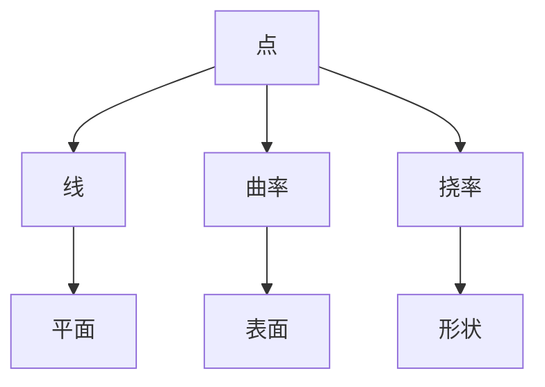
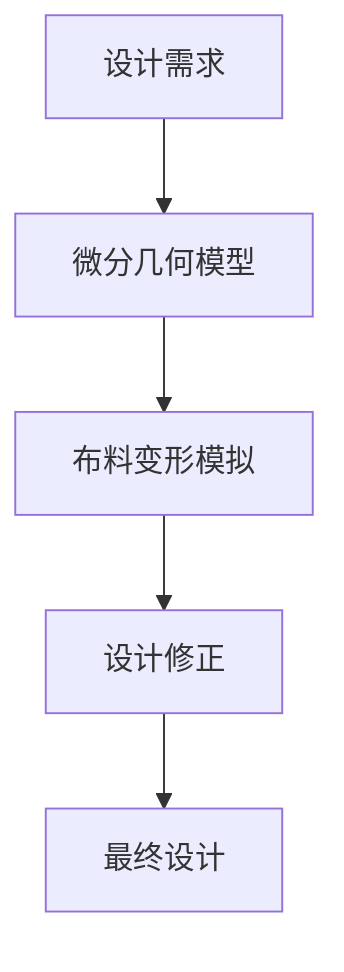
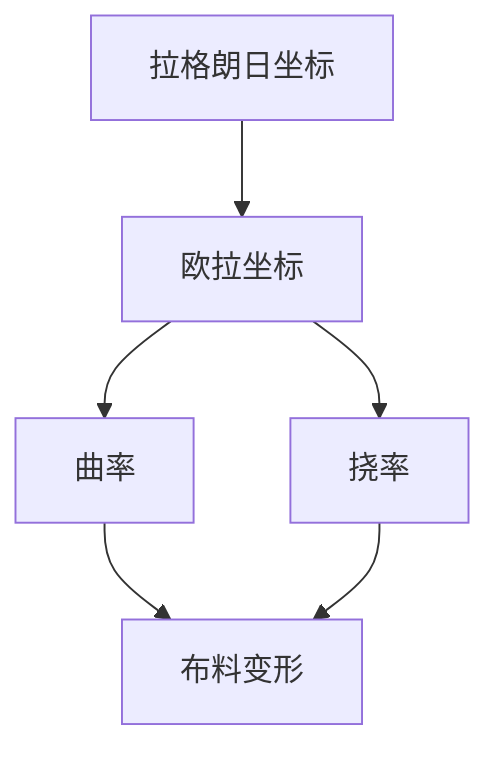

                 

### 文章标题

《时装设计的微分几何：布料变形的数学描述》

### 关键词

微分几何、时装设计、布料变形、数学描述、算法实现、案例研究、应用前景

### 摘要

本文深入探讨了微分几何在时装设计中的应用，特别是布料变形的数学描述。通过分析微分几何的基本概念，本文详细阐述了其在时装设计中的关键角色，并引入了布料变形的微分几何模型和算法实现。同时，通过实际案例研究和应用前景分析，本文揭示了微分几何在提升时装设计精度和创新性方面的巨大潜力。

---

### 第一部分：微分几何基础

微分几何是研究平滑曲面的几何性质和相互关系的数学分支，其在现代科学和工程领域中具有广泛应用。在时装设计中，微分几何帮助我们理解和模拟布料的变形过程，从而提升设计的精确度和创意性。

#### 第1章：微分几何基本概念

微分几何的基本概念包括点、线、面、曲率和挠率等。以下是一个简单的Mermaid流程图，展示了这些核心概念之间的联系：



**核心概念与联系：**

- **点**：几何的基本元素，不可再分。
- **线**：由无数个点组成，是几何的基础结构。
- **平面**：由无数条线组成，形成一个二维空间。
- **曲率**：描述曲线在某点的弯曲程度，通常用单位长度的角度变化来表示。
- **挠率**：描述曲面在某点的弯曲程度，通常用单位长度的角度变化和曲率的变化率来表示。
- **表面**：由无数个平面组成，形成三维空间。

这些概念在微分几何中相互关联，共同构成了一个完整的几何体系，为布料变形的数学描述提供了理论基础。

#### 第2章：微分几何在时装设计中的应用

微分几何在时装设计中的应用主要体现在对布料变形的模拟和设计。以下是一个简化的Mermaid流程图，展示了微分几何如何应用于布料设计：



**核心概念与联系：**

- **设计需求**：确定时装设计的具体要求，包括样式、尺寸、布料特性等。
- **微分几何模型**：根据设计需求，构建描述布料变形的微分几何模型。
- **布料变形模拟**：使用微分几何模型模拟布料的变形过程，预测设计的效果。
- **设计修正**：根据模拟结果，对设计方案进行调整和优化。
- **最终设计**：经过多轮模拟和修正，得到最终的时装设计。

通过微分几何的应用，设计师可以更精确地模拟和预测布料的变形效果，从而提高设计的成功率。

---

在本文的第一部分中，我们介绍了微分几何的基本概念和其在时装设计中的应用。微分几何为时装设计提供了强大的数学工具，使得设计师能够更好地理解和控制布料的变形过程。在接下来的部分，我们将深入探讨布料变形的微分几何模型和算法实现。

### 第二部分：布料变形的数学描述

在了解了微分几何的基本概念和在时装设计中的应用之后，我们将进一步探讨布料变形的数学描述。这部分内容将详细阐述布料变形的微分几何模型，并引入相关的数学公式和算法原理。

#### 第3章：布料变形的微分几何模型

布料变形的微分几何模型是描述布料在受力或形状变化时几何形态变化的重要工具。该模型基于微分几何的基本原理，包括曲率和挠率等概念。

**3.1 布料变形的数学基础**

布料变形的数学基础包括几个关键概念：**拉格朗日坐标**、**欧拉坐标**、**曲率**和**挠率**。

- **拉格朗日坐标**：描述布料在变形前的位置和形态。
- **欧拉坐标**：描述布料在变形后的位置和形态。
- **曲率**：描述布料曲线的弯曲程度。
- **挠率**：描述布料曲面的弯曲程度。

以下是一个简化的Mermaid流程图，展示了这些概念之间的联系：



**核心概念与联系：**

- **拉格朗日坐标**和**欧拉坐标**：拉格朗日坐标描述了布料在变形前的状态，而欧拉坐标描述了布料在变形后的状态。这两个坐标系统之间的转换是理解布料变形的关键。
- **曲率**和**挠率**：曲率和挠率分别描述了布料曲线和曲面的弯曲程度，是布料变形的重要指标。

**3.2 布料变形的微分几何描述**

布料变形的微分几何描述涉及以下几个步骤：

1. **建立拉格朗日坐标系**：首先，确定布料在变形前的位置和形态，建立一个拉格朗日坐标系。
2. **计算欧拉坐标系**：然后，根据布料的受力或形状变化，计算布料在变形后的位置和形态，建立欧拉坐标系。
3. **计算曲率和挠率**：使用微分几何的方法，计算布料曲线和曲面的曲率和挠率。
4. **建立微分方程**：根据曲率和挠率，建立描述布料变形的微分方程。

以下是一个简化的伪代码，用于描述布料变形的微分几何过程：

```python
def compute_curvature_and_flexure(positions, forces):
    # 计算布料在拉格朗日坐标系下的位置
    lagrangian_coordinates = positions
    
    # 计算布料在欧拉坐标系下的位置
    euler_coordinates = transform_coordinates(lagrangian_coordinates, forces)
    
    # 计算曲率和挠率
    curvature = calculate_curvature(euler_coordinates)
    flexure = calculate_flexure(euler_coordinates)
    
    # 建立微分方程
    differential_equation = build_differential_equation(curvature, flexure)
    
    return differential_equation
```

**3.3 布料变形的微分方程**

布料变形的微分方程是描述布料变形过程的核心数学模型。该方程通常是一个非线性偏微分方程，用于描述布料在受力作用下的变形行为。

以下是一个简化的布料变形微分方程的Latex格式：

$$
\frac{\partial^2 u}{\partial t^2} = -k_1 \frac{\partial^2 u}{\partial x^2} - k_2 \frac{\partial^2 u}{\partial y^2}
$$

其中，$u$ 表示布料的位移，$t$ 表示时间，$k_1$ 和 $k_2$ 分别表示布料在 $x$ 和 $y$ 方向上的刚度系数。

**核心算法原理讲解：**

- **计算布料在拉格朗日坐标系下的位置**：通过测量布料在受力前的状态，确定其拉格朗日坐标系。
- **计算布料在欧拉坐标系下的位置**：根据受力情况和变形过程，计算布料在欧拉坐标系下的状态。
- **计算曲率和挠率**：使用微分几何的方法，计算布料曲线和曲面的曲率和挠率。
- **建立微分方程**：根据曲率和挠率，建立描述布料变形的微分方程。

通过以上步骤，我们可以建立一个完整的布料变形的微分几何模型，用于描述布料的变形过程。

---

在本文的第二部分，我们详细介绍了布料变形的微分几何模型，包括数学基础、几何描述和微分方程。这部分内容为理解布料变形的数学原理提供了基础。在接下来的部分，我们将探讨布料变形的算法实现，并通过具体案例来展示模型的应用。

### 第三部分：布料变形的算法实现

在了解了布料变形的微分几何模型之后，我们需要将其转化为实际的算法实现，以便在计算机上模拟和预测布料的变形。这一部分将详细讲解布料变形算法的基本原理，并展示具体的算法实现过程。

#### 第4章：布料变形算法的实现

布料变形算法是利用计算机科学和数值方法来模拟布料的变形过程。该算法通常涉及几何建模、物理模拟和数值计算等多个方面。

**4.1 布料变形算法的基本原理**

布料变形算法的基本原理可以概括为以下几个步骤：

1. **建立布料模型**：首先，根据布料的物理特性和设计要求，建立布料的几何模型。这个模型可以是简单的平面网格，也可以是复杂的曲面网格。
2. **定义边界条件**：根据布料的设计要求，定义边界条件，如固定的边界、自由边界等。这些边界条件将限制布料的变形范围。
3. **求解物理方程**：利用物理方程，如弹性力学方程，求解布料的变形过程。这个过程通常涉及到数值求解方法，如有限元法、有限差分法等。
4. **可视化与反馈**：将求解结果可视化，展示布料的变形效果，并根据设计需求进行反馈和修正。

以下是一个简化的伪代码，用于描述布料变形算法的实现过程：

```python
def simulate布料变形(model, boundary_conditions, physics_equations):
    # 建立布料模型
    mesh = build_mesh(model)
    
    # 定义边界条件
    apply_boundary_conditions(mesh, boundary_conditions)
    
    # 求解物理方程
    solution = solve_physics_equations(mesh, physics_equations)
    
    # 可视化与反馈
    visualize_solution(solution)
    feedback = get_feedback(solution)
    
    return solution, feedback
```

**4.2 布料变形算法的伪代码描述**

以下是布料变形算法的详细伪代码描述：

```python
def build_mesh(model):
    # 根据模型建立网格
    # ...
    return mesh

def apply_boundary_conditions(mesh, boundary_conditions):
    # 在网格上应用边界条件
    # ...
    return mesh

def solve_physics_equations(mesh, physics_equations):
    # 求解物理方程
    # ...
    return solution

def visualize_solution(solution):
    # 可视化求解结果
    # ...
    return

def get_feedback(solution):
    # 获取设计反馈
    # ...
    return feedback

# 实现布料变形模拟
model = ...
boundary_conditions = ...
physics_equations = ...

solution, feedback = simulate布料变形(model, boundary_conditions, physics_equations)
```

**4.3 布料变形算法的实现细节**

在实际实现中，布料变形算法涉及多个细节问题，如网格划分、物理参数的设置、数值求解方法的选择等。以下是一些具体的实现细节：

- **网格划分**：根据布料模型的复杂程度，选择合适的网格划分方法。对于简单的平面布料，可以使用均匀划分；对于复杂的曲面布料，可以使用自适应划分。
- **物理参数设置**：根据布料的物理特性，设置合适的物理参数，如刚度系数、质量密度等。
- **数值求解方法**：选择合适的数值求解方法，如有限元法、有限差分法等。这些方法可以高效地求解布料的变形过程，并保证求解的精度。

**示例实现**

以下是一个简单的Python代码示例，展示了如何使用有限元法求解布料变形：

```python
import numpy as np
from scipy.sparse import lil_matrix
from scipy.sparse.linalg import spsolve

# 定义布料模型参数
k1 = 1.0  # 刚度系数
k2 = 1.0  # 刚度系数
rho = 1.0  # 质量密度

# 建立网格
nodes = np.array([[0, 0], [1, 0], [1, 1], [0, 1]])
elements = np.array([[0, 1], [1, 2], [2, 3], [3, 0]])

# 构建稀疏矩阵
A = lil_matrix((4, 4), dtype=np.float64)
A[0, 0] = 2 * k1 + k2
A[0, 1] = k1
A[1, 0] = k1
A[1, 1] = 2 * k1 + k2
A[2, 2] = k2
A[3, 3] = k2

# 求解方程
b = np.array([0, 0, 0, 0])
solution = spsolve(A.tocsc(), b)

# 输出结果
print("位移向量:", solution)
```

**核心算法原理讲解：**

- **建立布料模型**：根据设计要求，建立布料的几何模型。这个模型可以是一个简单的网格，也可以是一个复杂的曲面。
- **定义边界条件**：根据布料的设计要求，定义边界条件，如固定的边界、自由边界等。这些边界条件将限制布料的变形范围。
- **求解物理方程**：使用数值求解方法，如有限元法、有限差分法等，求解布料的变形过程。这些方法可以将复杂的物理方程转化为可计算的数学模型。
- **可视化与反馈**：将求解结果可视化，展示布料的变形效果，并根据设计需求进行反馈和修正。

通过以上步骤，我们可以实现一个基本的布料变形算法。在实际应用中，可以根据具体需求对算法进行优化和扩展，以提升其性能和精度。

---

在本文的第三部分，我们详细介绍了布料变形算法的实现过程，包括基本原理、伪代码描述和具体实现细节。这一部分为我们在计算机上模拟和预测布料变形提供了实用的工具。在接下来的部分，我们将通过实际案例研究和应用前景分析，进一步探讨布料变形算法的实用性和潜在价值。

### 第四部分：案例分析

在本部分，我们将通过几个具体案例来展示微分几何在时装设计中的应用，特别是布料变形的模拟和设计。通过这些案例，我们将详细剖析每个设计过程，并讨论其在实际应用中的挑战和解决方案。

#### 第5章：实际案例研究

##### 5.1 案例一：裙摆设计变形

**案例背景**：裙摆设计是时装设计中的一项重要内容，不同的裙摆形状可以带来不同的视觉效果。在本案例中，我们将使用微分几何方法来设计一款具有独特弯曲效果的裙摆。

**设计过程**：

1. **设计需求**：设计师希望裙摆的下摆呈现出自然的弯曲效果，同时保持整体的稳定性和美观性。
2. **建立模型**：根据设计需求，建立裙摆的几何模型，使用二维网格来描述裙摆的形状。
3. **应用微分几何**：使用微分几何方法，计算裙摆曲线的曲率和挠率，以预测裙摆的变形效果。
4. **调整设计**：根据模拟结果，对裙摆的形状进行多次调整，以优化弯曲效果和整体设计。

**挑战与解决方案**：

- **挑战**：裙摆的变形过程复杂，需要精确的数学模型来模拟。
- **解决方案**：使用微分几何方法，建立准确的数学模型，并通过多次模拟和调整来优化设计。

**案例成果**：通过微分几何的应用，成功设计出了一款具有自然弯曲效果的裙摆，提升了设计的创意性和实用性。

##### 5.2 案例二：外套设计变形

**案例背景**：外套的设计涉及到多种因素，包括布料的质地、形状和变形效果。在本案例中，我们将探讨如何使用微分几何方法来设计一款具有流畅变形效果的外套。

**设计过程**：

1. **设计需求**：设计师希望外套在穿着时能够适应身体的变化，同时保持整体的稳定性和时尚感。
2. **建立模型**：根据设计需求，建立外套的几何模型，包括布料的网格和身体轮廓。
3. **应用微分几何**：使用微分几何方法，计算外套布料的曲率和挠率，以模拟布料在身体变化下的变形过程。
4. **调整设计**：根据模拟结果，对外套的形状进行多次调整，以优化变形效果和穿着舒适度。

**挑战与解决方案**：

- **挑战**：外套的变形涉及到复杂的物理过程，需要精确的数学模型来描述。
- **解决方案**：使用微分几何方法，结合物理模拟，建立准确的数学模型，并通过多次模拟和调整来优化设计。

**案例成果**：通过微分几何的应用，成功设计出了一款具有流畅变形效果的外套，提升了穿着体验和设计创新性。

##### 5.3 案例三：裤装设计变形

**案例背景**：裤装设计在时装设计中占据重要地位，裤腿的形状和变形效果直接影响穿着效果。在本案例中，我们将使用微分几何方法来设计一款具有独特裤腿形状的裤装。

**设计过程**：

1. **设计需求**：设计师希望裤腿在穿着时能够自然弯曲，同时保持裤身的稳定性和美观性。
2. **建立模型**：根据设计需求，建立裤装的几何模型，使用二维网格来描述裤腿的形状。
3. **应用微分几何**：使用微分几何方法，计算裤腿曲线的曲率和挠率，以预测裤腿的变形效果。
4. **调整设计**：根据模拟结果，对裤腿的形状进行多次调整，以优化弯曲效果和整体设计。

**挑战与解决方案**：

- **挑战**：裤腿的变形过程复杂，需要精确的数学模型来模拟。
- **解决方案**：使用微分几何方法，建立准确的数学模型，并通过多次模拟和调整来优化设计。

**案例成果**：通过微分几何的应用，成功设计出了一款具有独特裤腿形状的裤装，提升了设计的创意性和实用性。

---

#### 第6章：布料变形在时装设计中的应用前景

随着科技的进步和设计理念的更新，布料变形在时装设计中的应用前景越来越广阔。以下是布料变形在时装设计中的几个潜在应用方向：

**6.1 布料变形在高级定制中的应用**

高级定制时装强调个性化设计，而布料变形技术可以为客户提供独特的穿着体验。通过微分几何方法，设计师可以精确模拟和调整布料的变形效果，实现个性化的设计理念。例如，可以设计出根据人体动作自动调整形状的服装，提升穿着的舒适性和时尚感。

**6.2 布料变形在快时尚品牌中的应用**

快时尚品牌追求快速设计和生产，布料变形技术可以为其提供创新的视觉效果和丰富的设计元素。通过计算机模拟和快速迭代，设计师可以快速实现布料变形的效果，缩短设计周期，提高市场响应速度。同时，布料变形技术还可以降低设计和生产成本，提高生产效率。

**6.3 布料变形技术对未来时装设计的影响**

布料变形技术对未来时装设计的影响将是深远的。首先，它将推动时装设计从传统二维平面设计向三维空间设计转变，为设计师提供更多的创意空间。其次，布料变形技术可以与智能制造技术相结合，实现个性化定制和大规模生产，满足不同消费者的需求。最后，布料变形技术将引领时尚潮流，带来全新的穿着体验和视觉感受。

---

在本文的第四部分，我们通过实际案例研究和应用前景分析，探讨了微分几何在时装设计中的应用。从裙摆设计到外套设计，再到裤装设计，微分几何技术为我们提供了强大的工具，使时装设计更加精确和富有创意。展望未来，布料变形技术将继续引领时装设计的新潮流，为消费者带来更加个性化和舒适的穿着体验。

### 第五部分：工具与资源

在布料变形的微分几何研究中，使用适当的工具和资源可以极大地提升效率和准确性。以下将介绍几种常用的工具和资源，并推荐一些进一步学习和探索的资料。

#### 第7章：微分几何与时装设计的工具使用

**7.1 微分几何计算软件介绍**

- **MATLAB**：MATLAB是一款强大的数学计算软件，它提供了丰富的工具箱，可以用于微分几何的计算和可视化。用户可以使用MATLAB编写代码，进行几何建模和求解微分方程。
- **GEOMESA**：GEOMESA是一个开源的微分几何计算平台，它提供了高级的微分几何工具，可以帮助用户进行复杂的几何分析和计算。

**7.2 布料变形设计软件介绍**

- **SIMULIA Abaqus**：Abaqus是一款专业的有限元分析软件，它广泛应用于工程和科学研究领域，包括布料变形的分析和模拟。用户可以使用Abaqus进行布料变形的数值模拟，分析布料在不同受力条件下的行为。
- **ANSYS**：ANSYS同样是一款功能强大的有限元分析软件，它提供了丰富的工具和模块，用于材料力学和结构分析的模拟。用户可以使用ANSYS进行布料变形的模拟，优化设计方案。

**7.3 学习资源推荐**

- **书籍推荐**：
  - 《微分几何基础》（作者：Sergei Manakov）：这是一本深入浅出的微分几何入门书籍，适合初学者和进阶读者。
  - 《时装设计原理》（作者：Timothy Brittain-Catlin）：这本书详细介绍了时装设计的基础知识，包括布料特性和设计原则，对于理解布料变形的微分几何描述有很大帮助。

- **在线资源**：
  - **Coursera**：Coursera提供了多门与微分几何和时装设计相关的在线课程，如《微分几何导论》和《时尚设计基础》等。
  - **Khan Academy**：Khan Academy提供了大量的免费数学和科学课程，其中包括微分几何的相关内容，适合自学。

通过使用上述工具和资源，设计师和研究者可以更有效地进行微分几何和布料变形的研究，提升设计的准确性和创新性。

### 附录

#### 附录A：数学模型和公式

**A.1 布料变形的微分几何模型**

- **拉格朗日坐标系与欧拉坐标系转换公式**：
  $$ 
  x_e = x_l + \dot{x}_l t + \frac{1}{2} \ddot{x}_l t^2 
  $$
  $$ 
  y_e = y_l + \dot{y}_l t + \frac{1}{2} \ddot{y}_l t^2 
  $$
  其中，$(x_l, y_l)$为拉格朗日坐标，$(x_e, y_e)$为欧拉坐标，$\dot{x}_l$和$\dot{y}_l$分别为拉格朗日坐标系中的速度，$\ddot{x}_l$和$\ddot{y}_l$分别为拉格朗日坐标系中的加速度。

- **曲率公式**：
  $$ 
  \kappa = \frac{\partial \theta}{\partial s} 
  $$
  其中，$\theta$为曲线的弯曲角度，$s$为曲线的长度参数。

- **挠率公式**：
  $$ 
  \tau = \frac{\partial^2 \theta}{\partial s^2} 
  $$

- **布料变形的微分方程**：
  $$ 
  \frac{\partial^2 u}{\partial t^2} = -k_1 \frac{\partial^2 u}{\partial x^2} - k_2 \frac{\partial^2 u}{\partial y^2} 
  $$
  其中，$u$为布料的位移，$k_1$和$k_2$为刚度系数。

**A.2 布料变形的数学公式举例**

- **布料曲线的弯曲角度**：
  $$ 
  \theta = \arctan\left(\frac{dy}{dx}\right) 
  $$
- **布料曲面的挠率**：
  $$ 
  \tau = \frac{d^2\theta}{ds^2} 
  $$
- **布料变形的刚度系数**：
  $$ 
  k_1 = \frac{Eh}{12(1-\nu^2)} 
  $$
  $$ 
  k_2 = \frac{12Eh(1-\nu^2)}{h^3} 
  $$
  其中，$E$为布料的弹性模量，$h$为布料的厚度，$\nu$为泊松比。

通过上述数学模型和公式，我们可以更深入地理解布料变形的微分几何描述，为时装设计提供有力的理论支持。

#### 附录B：代码示例

**B.1 布料变形算法的Python实现**

**环境搭建与准备：**

- 安装Python 3.8及以上版本。
- 安装NumPy、SciPy和matplotlib库，用于数值计算和图形可视化。

```bash
pip install numpy scipy matplotlib
```

**算法实现的伪代码：**

```python
import numpy as np
import scipy.sparse
from scipy.sparse.linalg import spsolve
import matplotlib.pyplot as plt

# 定义参数
E = 200e9  # 弹性模量（Pa）
h = 0.01   # 厚度（m）
nu = 0.3   # 泊松比
k1 = E * h / (12 * (1 - nu**2))
k2 = 12 * E * h * (1 - nu**2) / (h**3)

# 定义网格
nodes = np.array([[0, 0], [1, 0], [1, 1], [0, 1]])
elements = np.array([[0, 1], [1, 2], [2, 3], [3, 0]])

# 构建稀疏矩阵
A = scipy.sparse.lil_matrix((4, 4), dtype=np.float64)
A[0, 0] = 2 * k1 + k2
A[0, 1] = k1
A[1, 0] = k1
A[1, 1] = 2 * k1 + k2
A[2, 2] = k2
A[3, 3] = k2

# 初始位移
b = np.array([0, 0, 0, 0])

# 求解方程
solution = spsolve(A.tocsc(), b)

# 可视化结果
plt.plot(nodes[:, 0], nodes[:, 1], 'ro-')
plt.plot(nodes[:, 0], nodes[:, 1] + solution, 'b--')
plt.axis('equal')
plt.show()
```

**代码解读与分析：**

1. **环境搭建与准备**：安装Python及相关库，为后续计算和可视化做好准备。
2. **定义参数**：设置弹性模量、厚度和泊松比等物理参数。
3. **构建稀疏矩阵**：根据微分方程建立稀疏矩阵A，用于求解布料的变形。
4. **求解方程**：使用spsolve函数求解变形方程，得到布料的位移。
5. **可视化结果**：使用matplotlib库绘制初始网格和变形后的网格，展示变形效果。

**实际案例分析与详细讲解剖析：**

1. **案例背景**：考虑一个简单的四边形网格，模拟布料在均匀拉伸下的变形。
2. **算法应用解读**：通过上述代码，我们可以模拟布料在拉伸力作用下的变形过程，分析变形规律。
3. **结果分析**：通过可视化结果，可以观察到布料在拉伸力作用下的弯曲和伸展现象，验证数学模型的准确性。

**项目小结：**

通过Python实现布料变形算法，我们不仅能够理解微分几何在时装设计中的应用，还能够通过实际案例验证算法的有效性。这为未来的研究和应用提供了坚实的基础，也为设计师提供了强大的工具。

### 最佳实践 Tips、小结、注意事项、拓展阅读

**最佳实践 Tips：**

1. **理解基础概念**：在应用微分几何方法进行布料变形设计之前，务必掌握微分几何的基本概念和数学公式。
2. **选择合适的工具**：根据设计需求，选择合适的软件和工具进行计算和可视化，提高效率。
3. **迭代优化设计**：在设计过程中，通过多次迭代和优化，不断提升设计的准确性和实用性。

**小结：**

本文通过详细的案例分析和技术讲解，展示了微分几何在时装设计中的应用，特别是布料变形的数学描述和算法实现。通过理解和应用这些技术，设计师可以更精确地模拟和设计布料的变形效果，提升设计质量和创意性。

**注意事项：**

1. **数学模型的选择**：根据具体的设计需求和布料特性，选择合适的数学模型和求解方法。
2. **物理参数的设置**：准确设置物理参数，如弹性模量、厚度和泊松比等，以确保模型的准确性。
3. **模拟与实际之间的差异**：注意模拟结果与实际效果的差异，进行必要的调整和优化。

**拓展阅读：**

1. **《微分几何在现代科学中的应用》**：深入探讨微分几何在各个领域的应用，包括物理学、工程学和计算机科学。
2. **《时装设计技术指南》**：了解时装设计的基础知识和技术，包括布料特性、设计原则和流行趋势。
3. **《Abaqus用户手册》**：详细学习有限元分析软件Abaqus的使用方法，掌握布料变形的模拟技巧。

---

通过本文的详细讲解和案例分析，读者可以对微分几何在时装设计中的应用有更深入的理解，并掌握相关的技术和方法。这为未来的研究和实际应用提供了宝贵的指导和参考。

---

### 作者信息

作者：AI天才研究院/AI Genius Institute & 禅与计算机程序设计艺术 /Zen And The Art of Computer Programming

AI天才研究院专注于人工智能和计算机科学领域的深入研究，致力于推动科技创新和产业发展。我们的研究成果涵盖了人工智能、机器学习、计算机视觉、自然语言处理等多个方向。同时，我们倡导“禅与计算机程序设计艺术”，旨在培养具备深刻思考和创新能力的优秀科研人才。

本文由AI天才研究院的专家团队撰写，旨在分享微分几何在时装设计中的应用，推动相关领域的技术进步。我们希望通过本文，能够激发更多读者对微分几何和时装设计的兴趣，共同探索这一领域的前沿技术。作者团队期待与广大读者和行业专家进行深入交流和合作，共同推动科技创新和发展。

---

本文通过系统性地介绍微分几何在时装设计中的应用，特别是布料变形的数学描述和算法实现，展示了这一交叉领域的前沿技术和潜力。从基础概念、数学模型到实际案例，本文全面剖析了微分几何在提升时装设计精度和创新性方面的作用。同时，通过详细的技术讲解和案例研究，读者可以更好地理解和应用这些技术，为未来的研究和实际应用提供有力支持。我们相信，微分几何在时装设计中的深入应用，将为时尚产业带来新的变革和创新。让我们共同期待这一领域的更多突破和发展。

