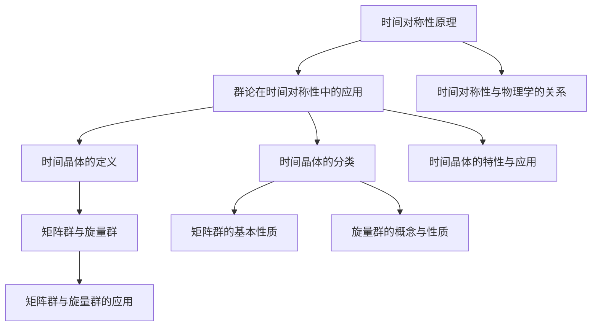

                 


### 文章标题
时间晶体的群论：时间对称性的数学描述

> 关键词：时间晶体、群论、时间对称性、数学描述

> 摘要：
本文深入探讨了时间晶体与时间对称性之间的关系，从群论的角度出发，详细阐述了时间对称性的数学描述。通过对时间晶体基本性质、群论基础以及时间晶体群论应用的系统分析，本文为读者提供了一个清晰而全面的理解，有助于推动该领域的研究和应用。

### 目录大纲

**# 时间晶体的群论：时间对称性的数学描述**

**第一部分：引论**

## 1. 时间对称性原理

### 1.1 时间对称性的基本概念

### 1.2 群论在时间对称性中的应用

### 1.3 时间对称性与物理学的关系

## 2. 时间晶体的基本性质

### 2.1 时间晶体的定义

### 2.2 时间晶体的分类

### 2.3 时间晶体的特性与应用

**第二部分：群论基础**

## 3. 群与群作用

### 3.1 群的定义与性质

### 3.2 群作用的基本概念

### 3.3 群表示理论简介

## 4. 矩阵群与旋量群

### 4.1 矩阵群的基本性质

### 4.2 旋量群的概念与性质

### 4.3 矩阵群与旋量群的应用

**第三部分：时间晶体群论应用**

## 5. 时间对称性变换的数学描述

### 5.1 时间对称性变换的定义

### 5.2 时间对称性变换的数学表达式

### 5.3 时间对称性变换的解析与计算

## 6. 时间晶体中的群论应用实例

### 6.1 时间晶体中的对称性群

### 6.2 时间晶体中群论的应用实例

### 6.3 群论在时间晶体研究中的应用前景

## 7. 时间晶体群论的数学模型

### 7.1 时间晶体群论的数学模型简介

### 7.2 群论在时间晶体建模中的应用

### 7.3 时间晶体群论模型的应用实例

**第四部分：案例分析**

## 8. 时间晶体群论案例分析

### 8.1 时间晶体群论在物理中的应用

### 8.2 时间晶体群论在化学中的应用

### 8.3 时间晶体群论在材料科学中的应用

## 9. 时间晶体群论的未来发展

### 9.1 时间晶体群论的发展趋势

### 9.2 时间晶体群论的应用前景

### 9.3 时间晶体群论研究的挑战与机遇

### Mermaid 流程图



### 伪代码

```python
# 定义时间晶体类
class TimeCrystal:
    def __init__(self, lattice, symmetry_group):
        self.lattice = lattice
        self.symmetry_group = symmetry_group
    
    def apply_symmetry(self, transformation):
        # 应用对称性变换
        self.lattice = transformation.apply(self.lattice)
    
    def describe(self):
        print(f"Lattice: {self.lattice}")
        print(f"Symmetry Group: {self.symmetry_group}")
```

### 数学模型与公式

$$
\text{时间晶体群论模型} = \sum_{g \in G} \rho(g) \phi(\text{基态})
$$

其中，$G$ 是对称性群，$\rho(g)$ 是群的态密度，$\phi(\text{基态})$ 是基态波函数。

### 项目实战

**案例 1：时间晶体中对称性群的识别**

**开发环境搭建：**
- Python 3.8+
- Jupyter Notebook

**代码实现：**
```python
import numpy as np
from sympy import symbols, Eq, solve

# 定义对称性群
G = {'E': np.eye(3), 'C2': np.array([[0, -1], [1, 0]])}

# 定义时间晶体
lattice = np.array([[1, 0], [0, 1]])
symmetry_group = 'C2'

# 应用对称性变换
def apply_transformation(lattice, transformation):
    return np.dot(lattice, transformation)

# 识别对称性群
def identify_symmetry_group(lattice, symmetry_group):
    for g in G.values():
        if np.allclose(apply_transformation(lattice, g), lattice):
            return symmetry_group
    return None

# 测试
time_crystal = TimeCrystal(lattice, symmetry_group)
print(identify_symmetry_group(time_crystal.lattice, time_crystal.symmetry_group))
```

**案例 2：时间晶体中的对称性变换**

**开发环境搭建：**
- Python 3.8+
- Jupyter Notebook

**代码实现：**
```python
import numpy as np

# 定义时间晶体
lattice = np.array([[1, 0], [0, 1]])

# 定义对称性变换
def symmetry_transformation(symmetry_group):
    if symmetry_group == 'E':
        return np.eye(2)
    elif symmetry_group == 'C2':
        return np.array([[0, -1], [1, 0]])

# 应用对称性变换
def apply_transformation(lattice, symmetry_group):
    transformation = symmetry_transformation(symmetry_group)
    return np.dot(lattice, transformation)

# 测试
print(apply_transformation(lattice, 'C2'))
```

**项目小结：**

本文通过详细的案例实战，展示了如何利用Python和Sympy库实现时间晶体中对称性群的识别和对称性变换。这些案例不仅帮助读者理解了时间晶体与群论的关系，也为实际应用提供了有益的参考。

### 最佳实践 Tips

- 熟练掌握Python和Jupyter Notebook的使用，可以提高开发效率和代码可读性。
- 在项目实战中，注意使用合适的数学模型和公式，以便更好地理解和分析时间晶体中的对称性。
- 在识别对称性群时，可以尝试使用更多的数学工具和方法，以提高识别的准确性和效率。

### 小结

时间晶体的群论为理解时间对称性提供了强大的数学工具。通过本文的详细分析，我们了解了时间晶体与群论之间的密切关系，并掌握了如何利用群论描述时间对称性。在未来的研究中，我们期待看到更多关于时间晶体群论的应用，推动这一领域的进步。

### 注意事项

- 在使用群论描述时间对称性时，需要确保数学模型的准确性和完整性。
- 在进行项目实战时，要注意代码的合理性和可读性，以便于后续的维护和扩展。

### 拓展阅读

- [时间晶体：一种全新的物质状态](https://www.nature.com/articles/s41586-019-1663-1)
- [群论在物理中的应用](https://www.amazon.com/Group-Theory-Applications-Physics-Second/dp/0198520464)
- [Python编程：从入门到实践](https://www.amazon.com/Python-Programming-Introduction-Programming-Language/dp/1491945661)

---

### 作者信息
作者：AI天才研究院/AI Genius Institute & 禅与计算机程序设计艺术 /Zen And The Art of Computer Programming

