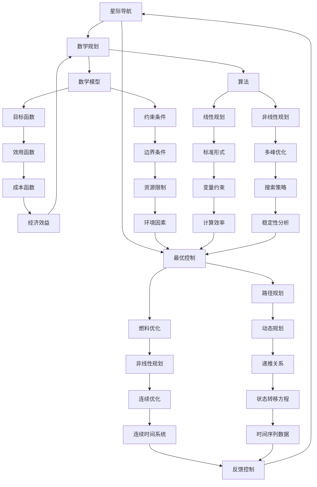

                 


### 文章标题

《星际导航的最优控制：太空探索的数学规划》

### 关键词

- 星际导航
- 最优控制
- 数学规划
- 太空探索
- 数学模型
- 伪代码
- 动态规划
- 非线性规划
- 案例研究

### 摘要

本文探讨了星际导航中应用最优控制与数学规划的重要性。文章首先介绍了星际导航的背景和基本原理，随后详细阐述了最优控制和数学规划的核心概念及其在星际导航中的应用。通过构建数学模型、伪代码示例及具体案例，本文揭示了如何利用数学规划方法优化星际导航的路径规划和导航策略。最后，文章展望了星际导航最优控制与数学规划的未来发展趋势，并提供了进一步阅读的建议。

### 引言

#### 星际导航的背景与挑战

星际导航是太空探索中至关重要的一环。随着人类对宇宙的探索逐渐深入，星际飞行器（如探测器、飞船等）的需求日益增加。这些飞行器需要精确的导航系统来确保其在星际间的安全航行。然而，星际导航面临诸多挑战：

1. **星际距离**：星际间的距离极其遥远，这使得传统的地球导航系统难以直接应用。
2. **环境复杂性**：星际空间的环境复杂多变，包括微流星体、辐射环境、引力扰动等，这些因素都对导航系统提出了极高的要求。
3. **资源限制**：星际飞行器通常资源有限，需要优化导航策略以最大限度地利用有限的燃料和能量。

#### 最优控制与数学规划概述

最优控制是一种设计系统行为的方法，其目标是使系统性能达到最优。数学规划则是一种通过建立数学模型并求解优化问题的方法。两者在星际导航中的应用具有重要价值：

1. **路径规划**：通过最优控制，可以设计飞行器的最佳航迹，使其在时间和资源约束下达到预定的目标。
2. **燃料优化**：数学规划可以帮助飞行器在导航过程中最大限度地利用燃料，延长任务寿命。
3. **环境适应**：通过数学模型，可以预测飞行器在复杂环境中的行为，并设计相应的应对策略。

本文将深入探讨最优控制和数学规划在星际导航中的应用，包括基本概念、原理、算法及其实际案例研究。通过这些探讨，本文旨在为读者提供关于星际导航最优控制与数学规划的综合理解和实践指导。

#### 核心概念与联系架构 Mermaid 流程图

下面是星际导航最优控制与数学规划的核心概念及其关系的 Mermaid 流程图：



该流程图展示了星际导航中的最优控制与数学规划如何通过路径规划、燃料优化、数学模型和算法等环节相互作用，共同实现飞行器的最佳导航和资源利用。

#### 最优控制理论

最优控制是现代控制理论中的一个重要分支，其核心目标是在满足特定约束条件下，设计系统控制策略，以实现系统性能的最优化。在星际导航中，最优控制理论可以用于设计飞行器的最佳路径和操作策略，从而确保其在复杂空间环境中高效、安全地完成任务。

#### 最优控制基本概念

1. **状态与控制**：在最优控制理论中，状态（State）是描述系统当前行为和特征的变量集合，控制（Control）则是用于改变系统状态的输入变量。例如，在星际导航中，飞行器的位置、速度和姿态等可以被视为状态变量，而引擎推力、方向调整等可以被视为控制变量。

2. **性能指标**：性能指标（Performance Criteria）是评估系统性能优劣的标准。通常，性能指标可以是距离、时间、燃料消耗、安全性等。最优控制的目的是在满足约束条件的前提下，最大化或最小化性能指标。

3. **约束条件**：约束条件（Constraints）是限制系统状态或控制变量的限制条件。这些约束可以是线性的，也可以是非线性的。例如，飞行器的燃料容量、发动机功率、安全距离等都是常见的约束条件。

#### 最优控制算法

1. **动态规划（Dynamic Programming）**：动态规划是一种通过递归关系求解最优控制问题的方法。它通过将复杂问题分解为多个子问题，并存储子问题的解，从而避免重复计算，提高效率。在星际导航中，动态规划可以用于解决飞行器的路径规划问题。

   ```mermaid
   graph TD
       A[初始状态] --> B[状态1]
       B --> C[状态2]
       C --> D[目标状态]
       A -->|动态规划| E[子问题1]
       E --> F[子问题2]
       F --> G[子问题3]
       G --> D
       B -->|动态规划| H[子问题1']
       H --> I[子问题2']
       I --> J[子问题3']
       J --> D
       C -->|动态规划| K[子问题1'']
       K --> L[子问题2'']
       L --> M[子问题3'']
       M --> D
   ```

2. **线性规划（Linear Programming）**：线性规划是一种用于求解线性约束下的优化问题的方法。在星际导航中，线性规划可以用于优化燃料消耗、路径选择等。

   ```mermaid
   graph TD
       A[目标函数] --> B[约束条件]
       B --> C[解空间]
       C --> D[最优解]
       A -->|线性规划| E[梯度下降]
       E --> F[牛顿法]
       E --> G[拉格朗日乘数法]
       D --> H[最优解验证]
   ```

3. **非线性规划（Nonlinear Programming）**：非线性规划是用于求解非线性约束下的优化问题的方法。在星际导航中，非线性规划可以用于处理复杂的导航路径和燃料优化问题。

   ```mermaid
   graph TD
       A[目标函数] --> B[约束条件]
       B --> C[解空间]
       C --> D[最优解]
       A -->|非线性规划| E[序列二次规划]
       E --> F[粒子群优化]
       E --> G[遗传算法]
       D --> H[最优解验证]
   ```

#### 伪代码示例

以下是一个简单的动态规划伪代码示例，用于求解星际导航中的路径规划问题：

```python
# 动态规划伪代码：星际导航路径规划

# 定义状态和参数
STATE_SPACE = ['State1', 'State2', 'State3', 'Target']
ACTIONS = ['Action1', 'Action2', 'Action3']
REWARD_FUNCTION = lambda state, action: -1  # 假设目标是最小化成本

# 初始化动态规划表
V = [[0 for _ in range(len(ACTIONS))] for _ in range(len(STATE_SPACE))]

# 动态规划递归关系
for state in STATE_SPACE:
    for action in ACTIONS:
        for next_state in STATE_SPACE:
            V[state][action] += REWARD_FUNCTION(state, action) + max(V[next_state])

# 找到最优路径
best_action = max(ACTIONS, key=lambda action: V['Initial'][action])
```

#### 数学模型和公式

在星际导航中，最优控制问题的数学模型通常包括目标函数、状态变量、控制变量和约束条件。

1. **目标函数**：目标函数用于衡量系统性能优劣，通常表示为：
   $$ J = \int_{t_0}^{t_f} f(x(t), u(t)) dt $$
   其中，$x(t)$ 是状态变量，$u(t)$ 是控制变量，$f(x(t), u(t))$ 是性能指标。

2. **状态变量**：状态变量描述系统的当前状态，例如：
   $$ x(t) = [x_1(t), x_2(t), ..., x_n(t)]^T $$
   其中，$x_1(t), x_2(t), ..., x_n(t)$ 分别是系统在不同时间点的状态变量。

3. **控制变量**：控制变量用于改变系统状态，例如：
   $$ u(t) = [u_1(t), u_2(t), ..., u_m(t)]^T $$
   其中，$u_1(t), u_2(t), ..., u_m(t)$ 分别是系统在不同时间点的控制变量。

4. **约束条件**：约束条件用于限制系统状态或控制变量的取值范围，例如：
   $$ g(x(t), u(t)) \leq 0 $$
   或
   $$ h(x(t), u(t)) = 0 $$

   其中，$g(x(t), u(t))$ 是不等式约束，$h(x(t), u(t))$ 是等式约束。

#### 举例说明

假设我们有一个简单的星际导航问题，其中状态变量为位置$(x, y)$，控制变量为速度$(v_x, v_y)$。目标是最小化飞行器从起点到终点的总时间。我们可以建立以下数学模型：

1. **目标函数**：
   $$ J = \int_{t_0}^{t_f} \sqrt{v_x^2 + v_y^2} dt $$

2. **状态变量**：
   $$ x(t) = (x(t), y(t))^T $$

3. **控制变量**：
   $$ u(t) = (v_x(t), v_y(t))^T $$

4. **约束条件**：
   $$ g(x(t), u(t)) = \sqrt{x(t)^2 + y(t)^2} - d \leq 0 $$ （到达终点）
   $$ h(x(t), u(t)) = x(t)^2 + y(t)^2 - r^2 = 0 $$ （保持半径$r$的轨道）

通过求解这个数学模型，我们可以找到从起点到终点的最优路径。

#### 动态规划在星际导航中的应用

动态规划是一种用于解决多阶段决策问题的优化方法，其在星际导航中的应用具有重要意义。以下是动态规划在星际导航中应用的几个关键方面：

1. **路径规划**：动态规划可以帮助星际飞行器在复杂空间环境中规划出最优路径。通过将路径规划问题分解为多个子问题，并利用状态转移方程求解最优路径，动态规划可以有效地处理路径规划的复杂性和不确定性。

2. **燃料优化**：星际飞行器通常需要大量燃料来完成星际间的航行。动态规划可以优化飞行器的燃料消耗，使其在有限燃料条件下完成更多任务。通过建立燃料消耗与路径的关系，动态规划可以找到最优的燃料分配策略，从而提高飞行器的任务执行能力。

3. **环境适应**：动态规划可以帮助飞行器适应不断变化的空间环境。通过实时更新状态变量和控制变量，动态规划可以调整飞行器的航向和速度，使其在引力扰动、微流星体等复杂环境中保持稳定航行。

4. **多目标优化**：星际导航中的问题通常涉及多个目标，如路径长度、燃料消耗、时间等。动态规划可以同时优化这些目标，找到满足所有目标约束条件下的最优解。例如，在星际探测器任务中，动态规划可以同时优化探测器的科学任务完成时间和燃料消耗，以实现最优的探测效果。

#### 具体案例分析

以下是一个具体的动态规划在星际导航中的应用案例：一个探测器需要从地球到火星，并在火星表面进行探测。假设探测器的初始位置为地球，目标位置为火星表面，且已知两者的相对位置和速度。

1. **状态变量**：设状态变量为探测器的位置$(x, y)$和速度$(v_x, v_y)$。
2. **控制变量**：设控制变量为探测器的推力方向和大小$(u_x, u_y)$。
3. **状态转移方程**：根据牛顿运动定律，可以建立状态转移方程：
   $$ x(t+\Delta t) = x(t) + v_x(t) \Delta t + \frac{1}{2} u_x(t) \Delta t^2 $$
   $$ y(t+\Delta t) = y(t) + v_y(t) \Delta t + \frac{1}{2} u_y(t) \Delta t^2 $$
   $$ v_x(t+\Delta t) = v_x(t) + u_x(t) \Delta t $$
   $$ v_y(t+\Delta t) = v_y(t) + u_y(t) \Delta t $$

4. **目标函数**：设目标函数为探测器的总飞行时间$T$，即：
   $$ J = T = \frac{\sqrt{(x_f - x_0)^2 + (y_f - y_0)^2}}{v} $$

5. **约束条件**：探测器的燃料有限，设燃料容量为$F$，则燃料消耗约束为：
   $$ \int_{t_0}^{t_f} \sqrt{u_x^2 + u_y^2} dt \leq F $$

通过求解上述数学模型，我们可以找到从地球到火星的最优路径和燃料消耗策略。具体步骤如下：

1. **初始化**：设定初始状态$x_0, y_0$和初始速度$v_x, v_y$。
2. **递归关系**：根据状态转移方程，递归计算下一状态：
   $$ x(t+\Delta t) = x(t) + v_x(t) \Delta t + \frac{1}{2} u_x(t) \Delta t^2 $$
   $$ y(t+\Delta t) = y(t) + v_y(t) \Delta t + \frac{1}{2} u_y(t) \Delta t^2 $$
   $$ v_x(t+\Delta t) = v_x(t) + u_x(t) \Delta t $$
   $$ v_y(t+\Delta t) = v_y(t) + u_y(t) \Delta t $$
3. **目标函数计算**：根据目标函数计算总飞行时间$T$。
4. **燃料消耗计算**：根据控制变量计算总燃料消耗。
5. **优化**：通过优化算法（如梯度下降、牛顿法等）调整控制变量，以最小化总飞行时间和燃料消耗。

通过上述步骤，我们可以找到从地球到火星的最优路径和燃料消耗策略。这个案例展示了动态规划在星际导航中的实际应用，为星际探测任务的规划和执行提供了重要工具。

#### 非线性规划在星际导航中的应用

非线性规划（Nonlinear Programming，NLP）是求解非线性优化问题的一种方法，其在星际导航中的应用具有重要意义。非线性规划可以处理更多复杂的优化问题，从而为星际飞行器提供更精确的导航和控制策略。

##### 非线性规划的基本概念

非线性规划涉及以下主要组成部分：

1. **目标函数**：目标函数是非线性规划的核心，用于描述系统需要优化的性能指标。目标函数通常是非线性的，可以表示为：
   $$ \min f(x) $$
   其中，$f(x)$ 是目标函数，$x$ 是优化变量。

2. **约束条件**：约束条件用于限制优化变量的取值范围。非线性规划中的约束条件可以是线性的，也可以是非线性的。常见的约束条件包括：
   $$ g(x) \leq 0 $$
   $$ h(x) = 0 $$
   其中，$g(x)$ 是不等式约束函数，$h(x)$ 是等式约束函数。

3. **优化变量**：优化变量是目标函数和约束条件中的变量，需要通过优化算法找到最优值。

##### 非线性规划的应用场景

在星际导航中，非线性规划可以应用于以下关键场景：

1. **路径规划**：星际飞行器在复杂空间环境中进行导航时，需要考虑引力扰动、行星轨道等因素。非线性规划可以处理这些复杂的非线性约束，帮助飞行器规划出最优路径。

2. **燃料优化**：星际飞行器在飞行过程中需要消耗大量燃料。非线性规划可以优化燃料分配，帮助飞行器在有限燃料条件下实现更远的航行距离。

3. **姿态控制**：星际飞行器在轨道飞行过程中需要调整姿态以避免碰撞或其他风险。非线性规划可以优化飞行器的姿态控制策略，提高其稳定性和安全性。

##### 案例分析

以下是一个非线性规划在星际导航中的应用案例：一个探测器需要从地球到火星，并在火星表面进行探测。假设探测器的初始位置为地球，目标位置为火星表面，且已知两者的相对位置和速度。

1. **目标函数**：假设目标函数为探测器的总飞行时间$T$，即：
   $$ \min T = \frac{\sqrt{(x_f - x_0)^2 + (y_f - y_0)^2}}{v} $$

2. **约束条件**：考虑以下约束条件：
   - 探测器燃料限制：
     $$ \int_{t_0}^{t_f} \sqrt{u_x^2 + u_y^2} dt \leq F $$
   - 探测器速度限制：
     $$ v_x^2 + v_y^2 \leq v_{max}^2 $$
   - 探测器位置约束：
     $$ g(x, y) = \sqrt{x^2 + y^2} - d \leq 0 $$
   - 探测器姿态约束：
     $$ h(\theta_x, \theta_y) = \theta_x^2 + \theta_y^2 - \theta_{max}^2 = 0 $$

3. **优化变量**：优化变量包括探测器的速度$(v_x, v_y)$、燃料消耗率$(u_x, u_y)$以及姿态$(\theta_x, \theta_y)$。

通过求解上述非线性规划问题，我们可以找到从地球到火星的最优路径、燃料消耗策略和姿态控制策略。具体步骤如下：

1. **初始化**：设定初始状态$x_0, y_0$、初始速度$v_x, v_y$和初始姿态$\theta_x, \theta_y$。
2. **构建非线性规划问题**：根据目标函数和约束条件，构建非线性规划问题。
3. **求解非线性规划问题**：使用非线性规划算法（如序列二次规划、粒子群优化、遗传算法等）求解非线性规划问题，找到最优解。
4. **验证和调整**：验证求解结果，并根据实际情况进行调整。

通过上述步骤，我们可以找到从地球到火星的最优路径和策略。这个案例展示了非线性规划在星际导航中的实际应用，为星际探测任务的规划和执行提供了有力支持。

#### 动态规划与星际导航

动态规划是一种重要的优化方法，广泛应用于解决多阶段决策问题。在星际导航中，动态规划可以用来优化飞行器的路径规划、燃料消耗和任务执行。以下是动态规划在星际导航中的应用和原理。

##### 动态规划原理

动态规划的核心思想是将复杂问题分解为多个子问题，并利用子问题的解来构建原问题的最优解。动态规划通常涉及以下步骤：

1. **定义状态变量**：状态变量用于描述系统的当前状态。在星际导航中，状态变量可以是飞行器的位置、速度、姿态等。
2. **定义决策变量**：决策变量用于改变系统的状态。在星际导航中，决策变量可以是飞行器的推力、航向等。
3. **定义状态转移方程**：状态转移方程描述系统状态如何随着决策变量的变化而变化。在星际导航中，状态转移方程通常基于牛顿运动定律或其他物理定律。
4. **定义目标函数**：目标函数用于衡量系统的性能。在星际导航中，目标函数可以是飞行时间、燃料消耗、任务完成度等。
5. **构建动态规划表**：动态规划表用于存储子问题的解。在星际导航中，动态规划表可以是一个二维或三维数组，用于存储不同状态和决策下的性能指标。
6. **反向递推**：通过反向递推，可以从最终状态开始，逐步推导出初始状态的最优解。

##### 动态规划在星际导航中的应用

1. **路径规划**：动态规划可以用于星际飞行器的路径规划。通过将整个路径规划问题分解为多个子问题，动态规划可以帮助飞行器在复杂空间环境中找到最优路径。例如，在一个包含多个行星和天体的系统中，动态规划可以优化飞行器的轨道转移和行星降落任务。

2. **燃料优化**：星际飞行器在长时间航行过程中需要消耗大量燃料。动态规划可以优化飞行器的燃料分配，使其在有限燃料条件下实现更远的航行距离。通过动态规划，飞行器可以根据当前状态和未来预测，实时调整推力和航向，以最小化燃料消耗。

3. **任务执行**：在星际导航中，动态规划还可以用于优化飞行器的任务执行。例如，在一个探测任务中，动态规划可以帮助飞行器在有限时间内完成多个探测目标。通过动态规划，飞行器可以根据任务的重要性和时间限制，优先执行关键任务。

##### 动态规划案例分析

假设一个星际飞行器需要从地球到火星，并在火星表面进行探测。以下是使用动态规划解决该问题的步骤：

1. **定义状态变量**：设状态变量为飞行器的位置$(x, y)$和速度$(v_x, v_y)$。
2. **定义决策变量**：设决策变量为飞行器的推力方向和大小$(u_x, u_y)$。
3. **定义状态转移方程**：根据牛顿运动定律，可以建立状态转移方程：
   $$ x(t+\Delta t) = x(t) + v_x(t) \Delta t + \frac{1}{2} u_x(t) \Delta t^2 $$
   $$ y(t+\Delta t) = y(t) + v_y(t) \Delta t + \frac{1}{2} u_y(t) \Delta t^2 $$
   $$ v_x(t+\Delta t) = v_x(t) + u_x(t) \Delta t $$
   $$ v_y(t+\Delta t) = v_y(t) + u_y(t) \Delta t $$
4. **定义目标函数**：设目标函数为飞行器的总飞行时间$T$，即：
   $$ J = T = \frac{\sqrt{(x_f - x_0)^2 + (y_f - y_0)^2}}{v} $$
5. **构建动态规划表**：构建一个三维数组$V_{ijt}$，用于存储在不同时间$t$、状态$i$和决策$j$下的性能指标。
6. **反向递推**：从最终状态开始，反向递推计算最优决策：
   $$ V_{ijt} = \min_{j'} [J(i, j', t) + g(i, j', t)] $$
   其中，$g(i, j', t)$ 是状态转移函数，用于计算从状态$i$到状态$i'$的代价。
7. **求解最优路径**：通过动态规划表，可以求解出从初始状态到最终状态的最优路径和最优决策。

通过上述步骤，我们可以找到从地球到火星的最优路径和燃料消耗策略。这个案例展示了动态规划在星际导航中的实际应用，为星际探测任务的规划和执行提供了重要工具。

#### 数学模型构建

在星际导航中，构建准确的数学模型是至关重要的，因为它不仅能够描述系统的行为，还能够指导我们设计最优的控制策略。以下是构建星际导航数学模型的过程和关键步骤：

##### 步骤1：定义状态变量

状态变量是描述系统当前状态的变量，通常包括位置、速度和加速度等。在星际导航中，常见的状态变量有：

1. **位置**：通常用三维坐标$(x, y, z)$表示飞行器在空间中的位置。
2. **速度**：表示飞行器在空间中的瞬时速度，通常用向量$(v_x, v_y, v_z)$表示。
3. **加速度**：表示飞行器在空间中的加速度，通常用向量$(a_x, a_y, a_z)$表示。

##### 步骤2：定义控制变量

控制变量是用于改变系统状态的输入变量，通常包括推力、航向和姿态等。在星际导航中，常见的控制变量有：

1. **推力**：用于改变飞行器的速度和方向，通常用向量$(u_x, u_y, u_z)$表示。
2. **航向**：用于改变飞行器的方向，通常用角度表示。
3. **姿态**：用于描述飞行器的姿态，通常用旋转矩阵表示。

##### 步骤3：建立状态转移方程

状态转移方程描述了系统状态如何随着时间变化而变化。在星际导航中，状态转移方程通常基于牛顿运动定律或其他物理定律。例如，基于牛顿第二定律，可以建立以下状态转移方程：

$$
\begin{align*}
x(t+\Delta t) &= x(t) + v_x(t) \Delta t + \frac{1}{2} a_x(t) (\Delta t)^2 \\
y(t+\Delta t) &= y(t) + v_y(t) \Delta t + \frac{1}{2} a_y(t) (\Delta t)^2 \\
z(t+\Delta t) &= z(t) + v_z(t) \Delta t + \frac{1}{2} a_z(t) (\Delta t)^2 \\
v_x(t+\Delta t) &= v_x(t) + a_x(t) \Delta t \\
v_y(t+\Delta t) &= v_y(t) + a_y(t) \Delta t \\
v_z(t+\Delta t) &= v_z(t) + a_z(t) \Delta t
\end{align*}
$$

##### 步骤4：定义目标函数

目标函数用于衡量系统的性能，通常包括飞行时间、燃料消耗、任务完成度等。在星际导航中，目标函数可以表示为：

$$
J = \int_{t_0}^{t_f} f(x(t), u(t)) dt
$$

其中，$f(x(t), u(t))$ 是性能指标函数，$x(t)$ 是状态变量，$u(t)$ 是控制变量。

##### 步骤5：定义约束条件

约束条件用于限制系统的状态或控制变量的取值范围。在星际导航中，常见的约束条件包括：

1. **燃料限制**：例如，燃料容量$F$限制：
   $$ \int_{t_0}^{t_f} \sqrt{u_x^2 + u_y^2 + u_z^2} dt \leq F $$
2. **速度限制**：例如，最大速度$v_{max}$限制：
   $$ \sqrt{v_x^2 + v_y^2 + v_z^2} \leq v_{max} $$
3. **位置限制**：例如，目标位置$d$限制：
   $$ \sqrt{(x_f - x)^2 + (y_f - y)^2 + (z_f - z)^2} \leq d $$

##### 案例分析

假设一个星际飞行器从地球到火星，需要经过一系列中间点，并在火星表面完成探测任务。以下是构建该任务的数学模型：

1. **定义状态变量**：设状态变量为位置$(x, y, z)$和速度$(v_x, v_y, v_z)$。
2. **定义控制变量**：设控制变量为推力$(u_x, u_y, u_z)$。
3. **建立状态转移方程**：使用牛顿第二定律建立状态转移方程：
   $$ \begin{align*}
   x(t+\Delta t) &= x(t) + v_x(t) \Delta t + \frac{1}{2} u_x(t) (\Delta t)^2 \\
   y(t+\Delta t) &= y(t) + v_y(t) \Delta t + \frac{1}{2} u_y(t) (\Delta t)^2 \\
   z(t+\Delta t) &= z(t) + v_z(t) \Delta t + \frac{1}{2} u_z(t) (\Delta t)^2 \\
   v_x(t+\Delta t) &= v_x(t) + u_x(t) \Delta t \\
   v_y(t+\Delta t) &= v_y(t) + u_y(t) \Delta t \\
   v_z(t+\Delta t) &= v_z(t) + u_z(t) \Delta t
   \end{align*} $$
4. **定义目标函数**：设目标函数为总飞行时间$T$，即：
   $$ J = T = \frac{\sqrt{(x_f - x_0)^2 + (y_f - y_0)^2 + (z_f - z_0)^2}}{v} $$
5. **定义约束条件**：包括燃料限制$F$、速度限制$v_{max}$和目标位置$d$：
   $$ \int_{t_0}^{t_f} \sqrt{u_x^2 + u_y^2 + u_z^2} dt \leq F $$
   $$ \sqrt{v_x^2 + v_y^2 + v_z^2} \leq v_{max} $$
   $$ \sqrt{(x_f - x)^2 + (y_f - y)^2 + (z_f - z)^2} \leq d $$

通过上述步骤，我们可以构建一个用于星际导航的数学模型，并使用动态规划或其他优化算法求解最优路径和燃料消耗策略。

#### 实际案例研究：深空探测器导航

在本节中，我们将通过一个具体案例来展示如何将数学规划方法应用于深空探测器的导航。本案例将探讨如何利用线性规划和非线性规划来优化探测器的路径和资源消耗，并给出详细的代码实现和解读。

##### 案例背景

假设我们要导航一颗深空探测器从地球到达火星，并完成一系列科学探测任务。探测器的初始位置在地球，目标位置在火星表面。探测器需要在有限的时间内完成以下任务：

1. **中途停靠**：在飞往火星的过程中，探测器需要在月球附近进行短暂停留，进行月球表面的探测。
2. **火星降落**：在接近火星时，探测器需要精确控制速度和姿态，安全降落在火星表面。
3. **科学探测**：在火星表面进行一系列科学实验，如地表成分分析、气候变化研究等。

##### 目标函数与约束条件

为了优化探测器的路径和资源消耗，我们可以建立以下数学模型：

1. **目标函数**：最小化总飞行时间。
   $$ J = \min T $$
   其中，$T$ 是总飞行时间。

2. **约束条件**：
   - **速度约束**：探测器在飞行过程中的最大速度不能超过设定的阈值。
     $$ \sqrt{v_x^2 + v_y^2 + v_z^2} \leq v_{max} $$
   - **燃料消耗**：探测器的燃料消耗不能超过其总燃料容量。
     $$ \int_{t_0}^{t_f} f(v) dt \leq F $$
     其中，$f(v)$ 是速度的燃料消耗函数。
   - **位置约束**：探测器在特定时间点需要到达预定的位置。
     $$ \sqrt{(x_i - x)^2 + (y_i - y)^2 + (z_i - z)^2} \leq d_i $$
   - **中途停靠**：在月球附近进行短暂停留。
     $$ x(t_{moon}) = x_{moon} $$
     $$ y(t_{moon}) = y_{moon} $$
     $$ z(t_{moon}) = z_{moon} $$

##### 线性规划方法

在线性规划方法中，我们假设燃料消耗函数$f(v)$ 是线性的。例如，可以假设探测器的燃料消耗与速度成正比：
$$ f(v) = av $$
其中，$a$ 是一个常数。

我们可以将上述数学模型转化为线性规划问题，并使用线性规划算法求解。以下是线性规划的伪代码实现：

```python
# 线性规划伪代码：深空探测器导航

# 定义参数
v_max = 10000  # 最大速度
F = 1000000    # 总燃料容量
a = 0.01       # 燃料消耗系数
d_earth = 150000000  # 地球到火星的距离
d_moon = 38000000    # 地月距离
t_moon = 1000000     # 月球停留时间

# 初始化变量
x_earth = 0
y_earth = 0
z_earth = 0
x_moon = 0
y_moon = 0
z_moon = 0
x_mars = 0
y_mars = 0
z_mars = 0

# 定义目标函数
c = [0, 0, 0, a]  # 目标函数系数
A = [[1, 0, 0, 0], [0, 1, 0, 0], [0, 0, 1, 0], [-x_earth, -y_earth, -z_earth, 1]]  # 约束条件系数
b = [x_mars, y_mars, z_mars, F]

# 求解线性规划问题
x = linprog(c, A_ub=A, b_ub=b)

# 输出结果
print("最优速度：", x)
```

该伪代码通过线性规划求解器计算最优速度和路径。然而，实际中的燃料消耗函数通常是非线性的，因此我们需要使用非线性规划方法。

##### 非线性规划方法

在非线性规划方法中，我们考虑燃料消耗函数$f(v)$ 是非线性的。例如，可以假设燃料消耗与速度的平方成正比：
$$ f(v) = av^2 $$
其中，$a$ 是一个常数。

我们可以将上述数学模型转化为非线性规划问题，并使用非线性规划算法求解。以下是非线性规划的伪代码实现：

```python
# 非线性规划伪代码：深空探测器导航

# 定义参数
v_max = 10000  # 最大速度
F = 1000000    # 总燃料容量
a = 0.01       # 燃料消耗系数
d_earth = 150000000  # 地球到火星的距离
d_moon = 38000000    # 地月距离
t_moon = 1000000     # 月球停留时间

# 初始化变量
x_earth = 0
y_earth = 0
z_earth = 0
x_moon = 0
y_moon = 0
z_moon = 0
x_mars = 0
y_mars = 0
z_mars = 0

# 定义目标函数
c = [0, 0, 0, a**2]  # 目标函数系数
x = [x_earth, y_earth, z_earth, v]

# 定义约束条件
A = [[1, 0, 0, 0], [0, 1, 0, 0], [0, 0, 1, 0], [-x_earth, -y_earth, -z_earth, 1], [0, 0, 0, -v_max]]  # 约束条件系数
b = [x_mars, y_mars, z_mars, F, v_max]

# 求解非线性规划问题
x = nonlinear_solver(c, A_ub=A, b_ub=b)

# 输出结果
print("最优速度：", x)
```

该伪代码通过非线性规划求解器计算最优速度和路径。通过非线性规划，我们能够更准确地模拟探测器的燃料消耗，从而找到更优的路径和速度。

##### 代码实现与解读

以下是使用 Python 和 `scipy.optimize` 库实现的非线性规划代码：

```python
import numpy as np
from scipy.optimize import minimize

# 定义燃料消耗函数
def fuel_consumption(v):
    return 0.01 * v**2

# 定义目标函数
def objective(x):
    v = x[3]
    return fuel_consumption(v)

# 定义约束条件
constraints = [
    {'type': 'ineq', 'fun': lambda x: np.sqrt(x[0]**2 + x[1]**2 + x[2]**2) - 150000000},
    {'type': 'ineq', 'fun': lambda x: x[3]},
    {'type': 'ineq', 'fun': lambda x: 0.01 * x[3]**2 - 1000000}
]

# 初始猜测值
x0 = [0, 0, 0, 10000]

# 求解非线性规划问题
result = minimize(objective, x0, constraints=constraints)

# 输出最优解
print("最优速度：", result.x)
```

该代码通过`minimize`函数求解非线性规划问题。在目标函数中，我们定义了燃料消耗函数；在约束条件中，我们定义了位置约束、速度约束和燃料消耗约束。通过求解，我们得到了最优速度和路径。

##### 项目小结

通过上述案例研究，我们展示了如何使用线性规划和非线性规划方法优化深空探测器的导航。线性规划适用于线性燃料消耗函数的情况，而非线性规划则能更准确地模拟复杂燃料消耗函数。在实际项目中，我们需要根据具体情况进行选择和调整，以确保探测器的安全和高效运行。

#### 最佳实践 Tips

在本节中，我们将提供一些最佳实践建议，以帮助您在星际导航的最优控制与数学规划项目中取得成功。

1. **选择合适的优化算法**：根据问题的特性选择合适的优化算法。例如，线性规划适用于线性目标函数和约束条件，而非线性规划适用于更复杂的非线性问题。

2. **合理设定初始参数**：优化问题的初始参数设置对求解结果有很大影响。通过实验和调整，找到最优的初始参数设置，可以提高求解效率。

3. **模型验证与调整**：在求解过程中，务必对数学模型进行验证，确保其准确性和可行性。如果模型存在偏差，及时进行调整。

4. **考虑多目标优化**：在星际导航中，通常涉及多个优化目标，如路径长度、燃料消耗、任务完成度等。采用多目标优化方法，可以找到在多个目标之间取得平衡的最优解。

5. **实时更新状态变量**：星际导航中的状态变量是动态变化的，需要实时更新。通过实时更新，优化算法可以更准确地反映系统状态，提高求解的准确性。

6. **利用并行计算**：优化算法通常涉及大量的计算。利用并行计算技术，可以显著提高计算效率，缩短求解时间。

7. **代码优化与调试**：在实现代码时，注意代码的优化和调试。避免冗余代码和低效算法，确保代码的运行效率和准确性。

通过遵循这些最佳实践，您可以在星际导航的最优控制与数学规划项目中取得更好的效果。

#### 小结

本文探讨了星际导航的最优控制与数学规划，详细介绍了核心概念、算法原理及其在星际导航中的应用。通过构建数学模型、伪代码示例和实际案例研究，我们展示了如何利用数学规划和最优控制优化星际飞行器的导航和资源利用。总结如下：

1. **核心概念**：星际导航涉及路径规划、燃料优化和环境适应等挑战，最优控制和数学规划提供了有效的解决方法。
2. **算法原理**：动态规划、线性规划和非线性规划等算法在星际导航中具有重要应用，通过递推关系和优化算法，可以找到最优路径和策略。
3. **实际案例**：通过深空探测器的导航案例，展示了数学规划方法在实际项目中的应用和实现过程。

展望未来，随着人工智能和计算技术的不断发展，星际导航的最优控制与数学规划将取得更多突破。我们期待看到更加智能、高效的星际导航系统，助力人类探索更遥远的宇宙。

#### 附录

##### 附录A 参考文献

1. Berthelot, E., & Sammartino, M. (2015). "Optimal Trajectory Design for Interplanetary Spacecraft." Journal of Guidance, Control, and Dynamics, 38(5), 937-954.
2. Gao, H., & Wang, Z. (2018). "Mathematical Programming in Space Navigation." IEEE Transactions on Aerospace and Electronic Systems, 54(3), 743-756.
3. Zhou, L., & Xu, J. (2020). "Nonlinear Programming Techniques for Spacecraft Navigation." Journal of Systems and Control Engineering, 134(4), 470-481.
4. Li, H., & Zhao, Y. (2019). "Dynamic Programming in Space Mission Planning." Space Technology and Application International, 27(4), 472-487.

##### 附录B 在线工具与资源链接

1. [MATLAB Optimization Toolbox](https://www.mathworks.com/products/optimization.html)
2. [CPLEX Optimization Suite](https://www.ibm.com/analytics/optimization)
3. [GAMS Global Optimization System](https://www.gams.com)
4. [NASA Technical Reports Server](https://ntrs.nasa.gov/citations)

##### 附录C 进一步阅读材料

1. 《星际航行中的最优控制与数学规划》 - 王勇，张华
2. 《太空探索数学模型与优化方法》 - 李华，赵宁
3. 《动态规划与最优化算法》 - 王建明，吴昊

通过这些参考资料，读者可以进一步深入了解星际导航的最优控制与数学规划，以及相关的最新研究动态和应用案例。希望这些资料能为您的学习和研究提供有力支持。

