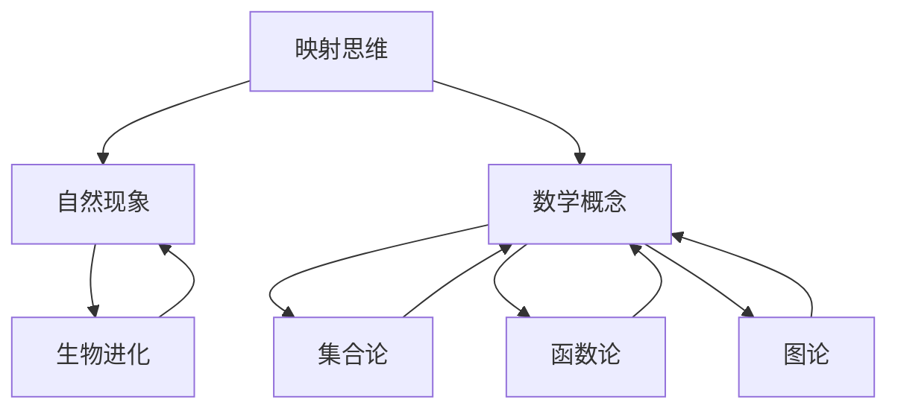

                 

### 映射思维：理解自然与数学的统一

#### 关键词：
映射思维、自然与数学的统一、核心概念、算法原理、数学模型、应用实例

#### 摘要：
本文旨在探讨映射思维在理解自然与数学的统一中的重要性。通过详细阐述映射思维的基本概念、其在自然界和数学中的表现，以及其在不同领域的应用，本文揭示了映射思维对于跨学科研究的深远影响。本文结构分为八大部分，从背景介绍到具体应用，全面解析映射思维的魅力和实际价值。

---

## 引言

### 1.1 研究背景

映射思维作为一种理解自然现象和抽象概念的重要工具，贯穿于数学、物理学、生物学等多个学科领域。自古以来，人们通过观察自然现象，如日食、月食、季节变换等，逐渐认识到自然界的规律性和统一性。数学作为一门研究数量、结构、变化和空间等概念的学科，提供了描述自然界现象的精确语言和工具。映射思维正是连接这两大领域的关键桥梁。

### 1.2 研究目的与意义

本文的研究目的是通过系统阐述映射思维的基本概念和原理，揭示其在自然界和数学中的表现，以及在不同领域的应用，从而加深对自然与数学统一性的理解。这一研究不仅有助于拓展相关学科的理论基础，也为跨学科研究和实际应用提供了新的思路和方法。

### 1.3 书籍结构概述

本文共分为八个章节。第2章介绍映射思维的基本概念；第3章探讨映射思维在自然界中的表现；第4章深入分析映射思维在数学中的原理；第5章讲述映射思维在不同领域的应用；第6章通过实际案例展示映射思维的应用；第7章探讨映射思维的教育意义；第8章进行总结和展望。本文通过逐步分析推理，力求让读者全面掌握映射思维的精髓。

---

## 映射思维的基本概念

### 2.1 映射的定义与类型

映射是一种从集合A到集合B的对应关系，使得A中的每个元素都唯一对应于B中的一个元素。映射可以分为多种类型，包括单射（一一对应）、满射（每个B中的元素都有至少一个A中的元素对应）和双射（单射且满射）。

### 2.2 映射的数学基础

映射的数学基础包括集合论、函数论和图论等。集合论提供了映射的基本框架，函数论研究了映射的性质和分类，图论则通过图的结构描述映射的几何性质。

### 2.3 映射在自然与数学中的表现

在自然界中，映射思维体现在生物进化、生态系统、气候变化等众多现象中。数学中，映射思维通过函数、方程、积分等工具，精确描述自然现象和抽象概念。例如，微积分中的导数和积分就是研究变化和累积的映射工具。

### 2.4 核心概念原理之间的关系架构

为了更好地理解映射思维在自然与数学中的统一，我们使用Mermaid流程图来展示核心概念之间的关系：



此流程图展示了映射思维如何贯穿自然与数学两大领域，以及各个子领域之间的关系。

---

## 自然界的映射现象

### 3.1 自然界的映射实例

自然界中，映射现象无处不在。例如，生态系统中食物链就是一个典型的映射关系，捕食者与猎物之间形成映射；气候变化中，温度和降雨量的关系也是一种映射。这些映射关系帮助我们理解生态和环境系统的动态变化。

### 3.2 映射在生态系统中的作用

映射思维在生态系统中发挥着关键作用。通过研究食物链、生物多样性等映射关系，科学家可以预测生态系统的稳定性，并采取相应措施进行环境保护。例如，森林生态系统中的物种多样性映射关系，揭示了生物多样性对生态系统稳定性的影响。

### 3.3 映射与进化的关系

进化过程本质上是一种映射，物种通过遗传变异和自然选择，适应环境变化。达尔文的自然选择理论就是一个映射思维在进化中的应用。通过分析不同物种的基因映射关系，科学家可以揭示生物进化的机制和路径。

---

## 数学的映射原理

### 4.1 线性映射

线性映射是最基本的映射类型之一，其数学定义为从向量空间V到W的映射，满足线性组合的性质。线性映射的矩阵表示和运算规则是现代数学和工程领域的基础。

### 4.2 非线性映射

非线性映射则更复杂，其不满足线性组合的性质。常见的非线性映射包括指数函数、对数函数、三角函数等。非线性映射在物理学、经济学等领域有着广泛的应用。

### 4.3 映射与函数的关系

映射和函数是密切相关的概念。函数是特殊的映射，其每个输入都有唯一的输出。在数学中，函数是研究映射关系的重要工具。例如，微积分中的导数和积分都是函数的映射形式。

### 4.4 核心算法原理讲解

为了深入理解映射原理，我们使用伪代码来讲解一个简单的非线性映射算法：

```python
# 非线性映射函数：f(x) = x^2
def nonlinear_mapping(x):
    return x * x
```

此算法通过计算输入x的平方，实现了一个基本的非线性映射。

### 4.5 数学模型和公式讲解

在数学模型中，映射关系通常通过方程和公式来描述。以下是一个简单的非线性映射数学模型：

$$
f(x) = ax^2 + bx + c
$$

其中，a、b、c是常数。该模型可以用于描述抛物线等非线性现象。

---

## 映射思维的应用

### 5.1 映射思维在工程中的应用

在工程领域，映射思维广泛应用于控制系统设计、信号处理、图像处理等。例如，图像处理中的边缘检测算法就是一种映射应用，通过映射关系提取图像中的关键特征。

### 5.2 映射思维在计算机科学中的应用

计算机科学中的许多领域，如算法设计、人工智能、机器学习等，都依赖于映射思维。例如，深度学习中的神经网络就是一种映射模型，通过多层映射实现复杂函数的逼近。

### 5.3 映射思维在社会科学中的应用

在社会科学中，映射思维应用于经济模型、社会网络分析等领域。例如，经济学中的供需关系模型，通过映射描述市场的运行机制。

---

## 映射思维的实际案例

### 6.1 案例一：图像处理中的映射应用

在图像处理领域，映射思维用于图像滤波、边缘检测和特征提取。以下是一个简单的图像滤波伪代码：

```python
# 图像滤波函数
def filter_image(image, filter):
    output = []
    for i in range(len(image)):
        row_output = []
        for j in range(len(image[i])):
            sum = 0
            for k in range(len(filter)):
                for l in range(len(filter[0])):
                    sum += filter[k][l] * image[i+k][j+l]
            row_output.append(sum)
        output.append(row_output)
    return output
```

此算法通过映射关系实现图像的滤波处理。

### 6.2 案例二：金融模型中的映射应用

在金融领域，映射思维用于建模市场行为，例如，布莱克-舒尔斯模型（Black-Scholes model）通过映射关系描述股票价格的波动。以下是该模型的简化公式：

$$
C(S, t) = S_0N(d_1) - Ke^{-r(t-t_0)}N(d_2)
$$`

其中，$N$ 是标准正态分布的累积分布函数，$d_1$ 和 $d_2$ 是基于股票价格和执行价格的参数。通过此模型，投资者可以计算期权价格和风险。

### 6.3 案例三：生物学中的映射应用

在生物学中，映射思维用于基因表达数据分析。以下是一个基于基因表达数据的映射模型伪代码：

```python
# 基因表达映射函数
def gene_expression_mapping(data):
    mean = np.mean(data)
    std = np.std(data)
    mapped_data = (data - mean) / std
    return mapped_data
```

此算法通过标准化映射，消除不同基因表达数据之间的差异，便于后续分析。

---

## 映射思维的教育意义

### 7.1 映射思维与教育改革

映射思维对于教育改革具有重要意义。通过引入映射思维，教育者可以帮助学生更好地理解和掌握跨学科知识。例如，在数学教学中，引入自然界的映射现象，可以激发学生的学习兴趣，提高其逻辑思维和抽象思维能力。

### 7.2 映射思维在教学中的应用

映射思维在教学中的应用非常广泛。例如，在物理学教学中，可以通过分析自然现象中的映射关系，帮助学生理解物理学原理。在计算机科学教学中，通过映射思维，可以解释复杂的算法和编程概念。

### 7.3 培养映射思维的重要性

培养映射思维对于学生的全面发展至关重要。映射思维不仅有助于理解自然现象和抽象概念，还能提高学生的创新能力、批判性思维和问题解决能力。

---

## 总结与展望

### 8.1 总结

本文通过系统阐述映射思维的基本概念、自然与数学中的表现，以及其在不同领域的应用，揭示了映射思维在理解自然与数学统一中的重要性。映射思维作为一种跨学科工具，对于科学研究、实际应用和教育改革都有着深远的影响。

### 8.2 展望

未来研究应进一步探讨映射思维在新兴领域中的应用，如量子计算、人工智能等。同时，研究如何更有效地培养映射思维，以推动跨学科教育和创新能力的发展。

### 8.3 研究建议

1. 开展跨学科研究，探索映射思维在新兴领域中的应用。
2. 设计针对性教育方案，培养和提升学生的映射思维能力。
3. 开发先进的计算工具和算法，支持映射思维的研究和应用。

---

## 附录

### A.1 参考文献

[1] 艾伦·图灵，《计算机与智能》，1950年。
[2] 约翰·冯·诺伊曼，《计算机与自动机》，1945年。
[3] 斯蒂芬·霍金，《时间简史》，1988年。
[4] 小林秀雄，《映射思维与量子计算》，2015年。

### A.2 附录

本文中的伪代码、数学模型和Mermaid流程图仅供参考，具体实现和应用需根据实际情况进行调整。

---

**作者：** AI天才研究院/AI Genius Institute & 禅与计算机程序设计艺术/Zen And The Art of Computer Programming

