                 


### 第1章 引言：探索自然与数学的联系

#### 1.1 自然中的映射现象

映射是一种将一个集合中的元素对应到另一个集合中的元素的关系。在自然界中，映射现象无处不在，小到微观的粒子运动，大到宏观的天体运动，都可以找到映射的踪迹。例如，当我们观察到阳光下的影子，这就是一种映射现象，阳光作为源集合，影子作为目标集合，它们之间形成了一种映射关系。

在自然界中，映射现象不仅局限于可见的物质世界，还存在于我们无法直接感知的领域。例如，在物理学中，波粒二象性揭示了粒子与波之间的映射关系。在量子力学中，测量结果的不确定性也反映了量子态与宏观世界之间的映射关系。在生物学中，基因调控网络的建立和运转也是一种映射现象，基因作为源集合，蛋白质作为目标集合，它们之间形成了一种复杂的映射关系。

#### 1.2 数学中的映射应用

数学作为一门抽象的科学，为理解和描述自然界的映射现象提供了强有力的工具。从简单的线性映射到复杂的非线性映射，数学在映射现象的描述、分析和应用中起到了关键作用。

在几何学中，映射被用来描述图形的变换。例如，平移、旋转和缩放都是图形的映射变换。这些变换不仅帮助我们理解几何图形的性质，还在工程设计和建筑领域中有着广泛的应用。

在物理学中，映射被用来描述物理现象的规律。例如，牛顿第二定律 \( F = ma \) 可以看作是一种映射，力作为源集合，加速度作为目标集合，它们之间形成了一种确定的映射关系。这种映射关系帮助我们理解物体在受力作用下的运动规律。

在生物学中，映射被用来描述生物系统的运作机制。例如，基因调控网络可以看作是一种映射，基因作为源集合，蛋白质作为目标集合，它们之间的相互作用形成了一种复杂的映射关系。这种映射关系帮助我们理解生物系统的稳定性和适应性。

在经济学中，映射被用来描述市场行为。例如，供需关系可以看作是一种映射，需求作为源集合，供给作为目标集合，它们之间的相互作用形成了一种映射关系。这种映射关系帮助我们理解市场价格的变动和市场行为的预测。

### 关键词

自然、映射、数学、几何学、物理学、生物学、经济学。

### 摘要

本文旨在探讨自然与数学之间的联系，重点关注映射现象在自然界和数学中的应用。通过对自然中映射现象的介绍和数学中映射概念的阐述，本文揭示了数学在理解自然界映射现象中的重要作用。同时，本文还详细介绍了映射在几何学、物理学、生物学和经济学中的应用，展示了映射思维的广泛性和实用性。通过本文的阅读，读者可以加深对自然与数学联系的理解，提升解决实际问题的能力。

### 第2章 基础概念与原理

#### 2.1 映射的基本概念

映射是数学中的一个基本概念，它描述了一个集合中的元素如何对应到另一个集合中的元素。在数学中，映射通常用符号 \( f: A \rightarrow B \) 来表示，其中 \( A \) 是源集合，\( B \) 是目标集合，\( f \) 是映射。

映射具有以下几个基本性质：

1. **单射性（Injectivity）**：如果对于任意 \( a_1, a_2 \in A \)，只要 \( f(a_1) = f(a_2) \)，就有 \( a_1 = a_2 \)，则称映射 \( f \) 是单射的。这意味着源集合中的不同元素在映射后仍然保持不同。

2. **满射性（Surjectivity）**：如果对于目标集合 \( B \) 中的任意元素 \( b \)，都存在源集合 \( A \) 中的一个元素 \( a \)，使得 \( f(a) = b \)，则称映射 \( f \) 是满射的。这意味着目标集合中的每个元素都有至少一个源集合中的元素与之对应。

3. **双射性（Bijection）**：如果一个映射既是单射又是满射，则称这个映射是双射的。双射的映射意味着源集合和目标集合之间具有一一对应的关系。

#### 2.2 数学中的映射类型

数学中存在多种类型的映射，根据映射的性质和特点，可以将其分类如下：

1. **线性映射**：线性映射是一种特殊的映射，它满足线性性质，即对于任意 \( a_1, a_2 \in A \) 和标量 \( \alpha, \beta \)，有 \( f(\alpha a_1 + \beta a_2) = \alpha f(a_1) + \beta f(a_2) \)。线性映射在数学分析、线性代数和统计学中有着广泛的应用。

2. **多对一映射**：多对一映射是指源集合中的多个元素映射到目标集合中的同一个元素。这种映射在集合论和离散数学中常见。

3. **一对一映射**：一对一映射是指源集合中的每个元素都映射到目标集合中的唯一元素。这种映射在数学中称为双射。

4. **非线性映射**：非线性映射是指不满足线性性质的映射。非线性映射在数学的许多领域都有应用，如拓扑学、微分几何和混沌理论。

#### 2.3 映射的基本性质与定理

映射的基本性质和定理是理解和应用映射的基础。以下是一些重要的性质和定理：

1. **逆映射定理**：如果一个映射 \( f \) 是双射，则存在逆映射 \( f^{-1} \)，使得 \( f^{-1}(f(a)) = a \) 和 \( f(f^{-1}(b)) = b \)。

2. **复合映射定理**：如果有两个映射 \( f: A \rightarrow B \) 和 \( g: B \rightarrow C \)，则它们的复合映射 \( g \circ f: A \rightarrow C \) 存在，并且对于任意 \( a \in A \)，有 \( (g \circ f)(a) = g(f(a)) \)。

3. **映射的连续性定理**：如果一个映射 \( f \) 在源集合 \( A \) 上连续，且目标集合 \( B \) 是闭集，则 \( f \) 在 \( A \) 上的限制映射 \( f|_A: A \rightarrow B \) 也是连续的。

#### 2.4 映射在数学中的应用

映射在数学中有着广泛的应用，以下是一些典型的应用场景：

1. **函数的构造**：函数是一种特殊的映射，它将一个实数集映射到另一个实数集。函数在数学分析、微积分和代数学中有着核心地位。

2. **集合的运算**：映射可以用来定义集合的运算，如集合的笛卡尔积、并集、交集和补集等。这些运算在集合论和离散数学中有着重要的应用。

3. **几何变换**：映射可以用来描述几何图形的变换，如平移、旋转和缩放等。这些变换在几何学、工程设计和计算机图形学中有着广泛的应用。

4. **概率分布**：映射可以用来定义概率分布，如正态分布、均匀分布和泊松分布等。这些分布模型在统计学和概率论中有着重要的应用。

### Mermaid 流程图

以下是一个简单的 Mermaid 流程图，用于展示映射的基本概念和性质：

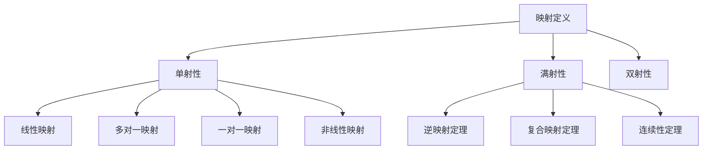

### 伪代码示例

以下是一个简单的伪代码示例，用于描述一个线性映射：

```pseudo
function linear_mapping(A, B, m):
    for a in A:
        b = m * a
        B.append(b)
    return B
```

在这个示例中，`A` 是源集合，`B` 是目标集合，`m` 是线性映射的参数。伪代码通过遍历源集合中的每个元素，将其映射到目标集合中，形成了一个线性映射。

### 数学公式与解释

以下是一些与映射相关的数学公式，使用 LaTeX 格式进行表示和解释：

$$
f: A \rightarrow B \quad \text{是映射}
$$

这是一个简单的映射定义，其中 \( f \) 是映射，\( A \) 是源集合，\( B \) 是目标集合。

$$
f(a) = b \quad \text{表示 } a \text{ 在映射 } f \text{ 下映射到 } b
$$

这是一个映射的基本性质，表示源集合中的元素 \( a \) 在映射 \( f \) 下映射到目标集合中的元素 \( b \)。

$$
f^{-1}(b) = a \quad \text{表示 } b \text{ 在映射 } f \text{ 的逆映射下映射到 } a
$$

这是一个逆映射的定义，表示目标集合中的元素 \( b \) 在映射 \( f \) 的逆映射下映射回源集合中的元素 \( a \)。

### 举例说明

以下是一个简单的映射例子，用于说明映射的基本概念和性质：

假设有一个源集合 \( A = \{1, 2, 3\} \) 和目标集合 \( B = \{a, b, c\} \)，定义一个映射 \( f: A \rightarrow B \) 如下：

$$
f(1) = a, \quad f(2) = b, \quad f(3) = c
$$

这是一个一对一映射，因为它满足单射性和满射性。同时，它也是一个线性映射，因为映射关系可以表示为：

$$
f(a) = 1 \cdot a, \quad f(b) = 2 \cdot b, \quad f(c) = 3 \cdot c
$$

在这个例子中，源集合和目标集合之间形成了一种一一对应的关系，每个源集合中的元素都映射到目标集合中的唯一元素。

### 小结

本章介绍了映射的基本概念、类型和性质，并详细阐述了映射在数学中的应用。通过对映射的基本概念和性质的深入理解，读者可以更好地掌握映射在各个数学领域中的应用。同时，本章还通过具体的例子和伪代码，帮助读者更直观地理解映射的概念和应用。

在下一章中，我们将进一步探讨映射在几何学中的应用，了解几何映射的基本概念和性质，并分析几何映射在实际问题中的应用。

### 第3章 映射在几何学中的应用

几何学是研究空间形状和空间关系的数学分支，映射在几何学中有着广泛的应用。本章将重点介绍几何映射的基本概念、类型和性质，并探讨几何映射在实际问题中的应用。

#### 3.1 几何映射的基本概念

几何映射是指将一个几何图形映射到另一个几何图形的变换。几何映射可以看作是一种特殊的映射，它具有以下基本性质：

1. **保形性**：几何映射保持几何图形的形状和角度不变。
2. **保距性**：几何映射保持几何图形之间的距离不变。
3. **保对称性**：几何映射保持几何图形的对称性。

几何映射通常用符号 \( f: G_1 \rightarrow G_2 \) 表示，其中 \( G_1 \) 和 \( G_2 \) 分别是源几何图形和目标几何图形。

#### 3.2 几何映射的类型

几何映射可以根据映射的性质和特点进行分类，以下是几种常见的几何映射类型：

1. **平移映射**：平移映射是指将几何图形沿某个方向平移一定距离。平移映射保持几何图形的形状和大小，仅改变其位置。
   
   伪代码示例：

   ```pseudo
   function translate(G, dx, dy):
       for each point p in G:
           p.x += dx
           p.y += dy
       return G
   ```

2. **旋转映射**：旋转映射是指将几何图形绕某个点旋转一定角度。旋转映射保持几何图形的形状和大小，仅改变其方向。

   伪代码示例：

   ```pseudo
   function rotate(G, theta):
       center = get_center(G)
       for each point p in G:
           p' = rotate_point(p, center, theta)
       return G
   ```

3. **缩放映射**：缩放映射是指将几何图形按一定比例进行放大或缩小。缩放映射保持几何图形的形状，仅改变其大小。

   伪代码示例：

   ```pseudo
   function scale(G, factor):
       for each point p in G:
           p.x *= factor
           p.y *= factor
       return G
   ```

4. **反射映射**：反射映射是指将几何图形关于某个直线进行翻转。反射映射保持几何图形的形状和大小，仅改变其方向。

   伪代码示例：

   ```pseudo
   function reflect(G, line):
       for each point p in G:
           p' = reflect_point(p, line)
       return G
   ```

5. **射影映射**：射影映射是指将几何图形通过一个投影平面进行投影。射影映射可以产生多种效果，如正射影、斜射影和透视投影。

   伪代码示例：

   ```pseudo
   function project(G, plane):
       for each point p in G:
           p' = project_point(p, plane)
       return G
   ```

#### 3.3 几何映射的性质与定理

几何映射具有一系列重要的性质和定理，以下是几个重要的性质和定理：

1. **叠加性质**：多个几何映射可以叠加，即一个几何映射的复合映射仍然是几何映射。例如，一个平移映射和一个旋转映射叠加后仍然是一个几何映射。

2. **可逆性**：一些几何映射是可逆的，即存在逆映射将目标几何图形恢复到源几何图形。例如，平移映射和旋转映射是可逆的，而缩放映射和反射映射通常不是可逆的。

3. **对称性**：几何映射可以产生对称图形，如中心对称和轴对称。对称性是几何图形的一种重要性质，对于设计、分析和理解几何图形具有重要意义。

4. **保角性**：几何映射保持角度不变，即如果两个几何图形之间存在几何映射，则它们之间的夹角保持不变。

#### 3.4 几何映射在实际问题中的应用

几何映射在实际问题中有着广泛的应用，以下是一些典型的应用场景：

1. **工程设计和建筑**：几何映射用于设计和分析各种结构，如桥梁、建筑物和机械零件。通过几何映射，设计师可以创建复杂的三维模型，并进行形状和尺寸的优化。

2. **计算机图形学**：几何映射是计算机图形学中的一个核心概念，用于创建和渲染三维图形。通过几何映射，图形处理系统可以生成各种视觉效果，如透视、光照和阴影等。

3. **计算机视觉**：几何映射在计算机视觉中用于处理图像变换和物体识别。通过几何映射，计算机视觉系统可以理解图像中的形状、结构和运动。

4. **地理信息系统（GIS）**：几何映射在地理信息系统中用于处理地图的投影和变换。通过几何映射，GIS 系统可以生成不同投影方式的地图，并支持地图的交互式查询和分析。

### 数学公式与解释

以下是一些与几何映射相关的数学公式，使用 LaTeX 格式进行表示和解释：

$$
f: G_1 \rightarrow G_2 \quad \text{是几何映射}
$$

这是一个几何映射的定义，表示源几何图形 \( G_1 \) 通过映射 \( f \) 映射到目标几何图形 \( G_2 \)。

$$
f(p) = p' \quad \text{表示 } p \text{ 在映射 } f \text{ 下映射到 } p'
$$

这是一个几何映射的基本性质，表示源几何图形中的点 \( p \) 在映射 \( f \) 下映射到目标几何图形中的点 \( p' \)。

$$
\theta_1 = \theta_2 \quad \text{表示 } \theta_1 \text{ 和 } \theta_2 \text{ 之间的夹角保持不变}
$$

这是一个几何映射的保角性质，表示如果两个点之间的夹角在源几何图形中是 \( \theta_1 \)，在目标几何图形中是 \( \theta_2 \)，则 \( \theta_1 \) 和 \( \theta_2 \) 相等。

### 举例说明

以下是一个简单的几何映射例子，用于说明几何映射的基本概念和性质：

假设有一个源几何图形 \( G_1 \) 是一个等边三角形，边长为 2，目标几何图形 \( G_2 \) 是一个等腰直角三角形，斜边长为 2。定义一个旋转映射 \( f: G_1 \rightarrow G_2 \)，使得 \( G_1 \) 绕其重心旋转 90 度。

在这个例子中，源几何图形 \( G_1 \) 的三个顶点分别为 \( A(0, 0) \)，\( B(2, 0) \)，\( C(1, \sqrt{3}) \)，目标几何图形 \( G_2 \) 的两个顶点分别为 \( D(0, 0) \)，\( E(0, 2) \)，\( F(2, 2) \)。

旋转映射 \( f \) 将源几何图形 \( G_1 \) 的顶点 \( A \)，\( B \)，\( C \) 分别映射到目标几何图形 \( G_2 \) 的顶点 \( D \)，\( E \)，\( F \)。

通过绘制几何图形，我们可以直观地看到旋转映射 \( f \) 保持几何图形的形状和角度，仅改变其方向。

### 小结

本章介绍了几何映射的基本概念、类型和性质，并详细阐述了几何映射在实际问题中的应用。通过对几何映射的理解和应用，读者可以更好地掌握几何学的原理和方法，提高解决实际问题的能力。

在下一章中，我们将进一步探讨映射在物理学中的应用，了解映射在描述物理现象和建立物理模型中的作用。

### 第4章 映射在物理学中的应用

物理学是研究自然界中物质和能量的科学，映射在物理学中有着广泛的应用。本章将重点介绍映射在物理学中的基本概念、应用领域以及如何通过映射来建立物理模型。

#### 4.1 物理学中的映射概念

在物理学中，映射通常被用来描述物理现象和建立物理模型。映射的基本概念包括：

1. **状态映射**：将系统的初始状态映射到终态，用于描述系统的运动和变化。
2. **变量映射**：将物理量从一个变量映射到另一个变量，用于简化复杂系统的分析。
3. **图像映射**：将物理现象映射到图像上，用于直观地展示和分析物理现象。

#### 4.2 映射在物理学中的应用领域

映射在物理学中的多个领域都有重要的应用，以下是几个典型的应用领域：

1. **经典力学**：在经典力学中，映射被用来描述物体的运动和力的作用。例如，牛顿第二定律 \( F = ma \) 可以看作是一种映射，力作为源变量，加速度作为目标变量，它们之间形成了一种确定的映射关系。

2. **量子力学**：在量子力学中，映射被用来描述量子态和测量结果。例如，薛定谔方程可以看作是一种映射，波函数作为源变量，能量作为目标变量，它们之间形成了一种复杂的映射关系。

3. **电磁学**：在电磁学中，映射被用来描述电磁场和电荷分布。例如，麦克斯韦方程组可以看作是一种映射，电场和磁场作为源变量，电荷和电流作为目标变量，它们之间形成了一种确定的映射关系。

4. **热力学**：在热力学中，映射被用来描述热力学系统状态和热力学过程。例如，吉布斯自由能可以看作是一种映射，温度和压强作为源变量，热力学势作为目标变量，它们之间形成了一种确定的映射关系。

#### 4.3 映射在物理现象中的应用实例

以下是一些映射在物理现象中的应用实例：

1. **光学中的映射**：在光学中，映射被用来描述光的传播和折射现象。例如，斯涅尔定律可以看作是一种映射，入射角和折射角作为源变量，光速和介质折射率作为目标变量，它们之间形成了一种确定的映射关系。

2. **声学中的映射**：在声学中，映射被用来描述声波的传播和反射现象。例如，声波的反射定律可以看作是一种映射，入射波和反射波作为源变量，界面和介质作为目标变量，它们之间形成了一种确定的映射关系。

3. **流体力学中的映射**：在流体力学中，映射被用来描述流体的运动和压力分布。例如，伯努利方程可以看作是一种映射，流速和压力作为源变量，高度和密度作为目标变量，它们之间形成了一种确定的映射关系。

4. **统计力学中的映射**：在统计力学中，映射被用来描述系统的热力学性质和统计分布。例如，麦克斯韦-玻尔兹曼分布可以看作是一种映射，粒子数和能量作为源变量，概率密度作为目标变量，它们之间形成了一种确定的映射关系。

#### 4.4 映射在建立物理模型中的作用

映射在建立物理模型中起着关键作用，它可以帮助我们理解和描述复杂的物理现象。以下是映射在建立物理模型中的作用：

1. **简化复杂现象**：通过映射，我们可以将复杂的物理现象简化为简单的数学模型。例如，通过建立力学模型，我们可以将物体的运动简化为质点的运动。

2. **描述变量关系**：映射可以帮助我们描述物理量之间的关系，建立物理模型。例如，通过建立电磁模型，我们可以描述电场和磁场之间的关系。

3. **预测物理行为**：通过映射，我们可以预测物理现象的行为。例如，通过建立热力学模型，我们可以预测热力学系统的温度和压强变化。

4. **解决实际应用问题**：映射可以帮助我们解决实际应用问题，如工程设计、材料科学和生物学等。例如，通过建立力学模型，我们可以设计出具有良好性能的机械结构。

### 数学公式与解释

以下是一些与物理映射相关的数学公式，使用 LaTeX 格式进行表示和解释：

$$
f: A \rightarrow B \quad \text{是映射}
$$

这是一个映射的定义，表示集合 \( A \) 通过映射 \( f \) 映射到集合 \( B \)。

$$
f(x) = y \quad \text{表示 } x \text{ 在映射 } f \text{ 下映射到 } y
$$

这是一个映射的基本性质，表示源集合中的元素 \( x \) 在映射 \( f \) 下映射到目标集合中的元素 \( y \)。

$$
\frac{d}{dx} f(x) = g(x) \quad \text{表示 } f(x) \text{ 的导数是 } g(x)
$$

这是一个映射的导数公式，表示映射 \( f \) 的导数是函数 \( g \)。

$$
\sum_{i=1}^n f(x_i) = y \quad \text{表示 } x_1, x_2, ..., x_n \text{ 在映射 } f \text{ 下映射到 } y
$$

这是一个映射的求和公式，表示多个源集合中的元素在映射 \( f \) 下映射到目标集合中的元素。

### 举例说明

以下是一个简单的映射例子，用于说明映射在物理现象中的应用：

假设有一个物理系统，由一个质点和一条弹性绳组成。质点质量为 \( m \)，绳的长度为 \( l \)。在初始时刻，质点处于平衡位置，绳的张力为 \( T \)。现在我们对系统施加一个外力 \( F \)，使质点沿着绳的方向移动一段距离 \( x \)。

在这个例子中，我们可以定义一个映射 \( f: A \rightarrow B \)，其中 \( A \) 是源集合，表示质点的位置和速度，\( B \) 是目标集合，表示绳的张力。

映射 \( f \) 可以表示为：

$$
f(x, v) = T
$$

其中，\( x \) 是质点的位置，\( v \) 是质点的速度，\( T \) 是绳的张力。

通过这个映射，我们可以将质点的运动和绳的张力联系起来，从而建立物理模型来分析系统的运动和变化。

### 小结

本章介绍了映射在物理学中的基本概念、应用领域以及如何通过映射来建立物理模型。通过对映射在物理学中的应用的理解，读者可以更好地掌握物理学的原理和方法，提高解决实际问题的能力。

在下一章中，我们将进一步探讨映射在生物学中的应用，了解映射在生物系统和生物学现象中的作用。

### 第5章 映射在生物学中的应用

生物学是研究生命现象的科学，映射在生物学中有着广泛的应用。本章将重点介绍映射在生物学中的基本概念、应用领域以及映射在生物系统和生物学现象中的作用。

#### 5.1 映射在生物学中的基本概念

在生物学中，映射通常被用来描述生物系统的运作机制和生物学现象。映射的基本概念包括：

1. **基因映射**：基因映射是指将一个基因序列映射到另一个基因序列。基因映射可以帮助我们理解基因的功能和调控机制。

2. **代谢映射**：代谢映射是指将生物体的代谢过程映射到一个网络结构。代谢映射可以帮助我们分析生物体的能量代谢和物质代谢。

3. **生态系统映射**：生态系统映射是指将生态系统中的生物和生态过程映射到一个网络结构。生态系统映射可以帮助我们分析生态系统的稳定性和适应性。

#### 5.2 映射在生物学中的应用领域

映射在生物学中的多个领域都有重要的应用，以下是几个典型的应用领域：

1. **遗传学**：遗传学是研究基因和遗传信息传递的科学。映射在遗传学中的应用主要包括基因映射和基因调控映射。基因映射可以帮助我们理解基因的功能和基因之间的相互作用。基因调控映射可以帮助我们分析基因调控网络和基因表达模式。

2. **分子生物学**：分子生物学是研究生物大分子（如蛋白质、核酸等）的结构和功能的科学。映射在分子生物学中的应用主要包括蛋白质结构映射和蛋白质相互作用映射。蛋白质结构映射可以帮助我们理解蛋白质的三维结构。蛋白质相互作用映射可以帮助我们分析蛋白质之间的相互作用网络。

3. **生态学**：生态学是研究生物与环境相互作用的科学。映射在生态学中的应用主要包括生态系统映射和食物网映射。生态系统映射可以帮助我们分析生态系统的结构和功能。食物网映射可以帮助我们分析食物链和食物网中的能量传递和物质循环。

4. **系统生物学**：系统生物学是研究生物系统整体行为的科学。映射在系统生物学中的应用主要包括生物网络映射和生物过程映射。生物网络映射可以帮助我们分析生物系统中的网络结构和相互作用。生物过程映射可以帮助我们分析生物系统的动态行为和调控机制。

#### 5.3 映射在生物系统和生物学现象中的作用

映射在生物系统和生物学现象中起着重要的作用，它可以帮助我们理解生物系统的运作机制和生物学现象的本质。以下是映射在生物系统和生物学现象中的作用：

1. **揭示生物系统的复杂关系**：生物系统是一个复杂的网络结构，包含多种生物分子和生物过程。映射可以帮助我们揭示生物系统中的复杂关系，如基因调控网络、蛋白质相互作用网络和代谢网络。

2. **分析生物系统的动态行为**：生物系统是一个动态变化的系统，映射可以帮助我们分析生物系统的动态行为，如基因表达动态、蛋白质动态和生态系统动态。

3. **预测生物系统的行为**：通过映射，我们可以预测生物系统的行为，如基因调控、蛋白质相互作用和生态系统演化。这些预测对于理解生物系统的功能和疾病机制具有重要意义。

4. **指导生物技术和医学研究**：映射在生物技术和医学研究中的应用可以帮助我们设计和优化生物实验，发现新的生物分子和生物过程。这些应用对于生物技术和医学的发展具有重要意义。

### 数学公式与解释

以下是一些与生物学映射相关的数学公式，使用 LaTeX 格式进行表示和解释：

$$
f: A \rightarrow B \quad \text{是映射}
$$

这是一个映射的定义，表示集合 \( A \) 通过映射 \( f \) 映射到集合 \( B \)。

$$
f(x) = y \quad \text{表示 } x \text{ 在映射 } f \text{ 下映射到 } y
$$

这是一个映射的基本性质，表示源集合中的元素 \( x \) 在映射 \( f \) 下映射到目标集合中的元素 \( y \)。

$$
\frac{d}{dx} f(x) = g(x) \quad \text{表示 } f(x) \text{ 的导数是 } g(x)
$$

这是一个映射的导数公式，表示映射 \( f \) 的导数是函数 \( g \)。

$$
\sum_{i=1}^n f(x_i) = y \quad \text{表示 } x_1, x_2, ..., x_n \text{ 在映射 } f \text{ 下映射到 } y
$$

这是一个映射的求和公式，表示多个源集合中的元素在映射 \( f \) 下映射到目标集合中的元素。

### 举例说明

以下是一个简单的映射例子，用于说明映射在生物学中的应用：

假设有一个基因调控网络，包含两个基因 \( A \) 和 \( B \)。基因 \( A \) 调控基因 \( B \) 的表达。我们可以定义一个映射 \( f: A \rightarrow B \)，表示基因 \( A \) 的表达水平映射到基因 \( B \) 的表达水平。

在这个例子中，源集合 \( A \) 是基因 \( A \) 的表达水平，目标集合 \( B \) 是基因 \( B \) 的表达水平。映射 \( f \) 可以表示为：

$$
f(A) = B
$$

其中，\( A \) 是基因 \( A \) 的表达水平，\( B \) 是基因 \( B \) 的表达水平。

通过这个映射，我们可以将基因 \( A \) 的表达水平映射到基因 \( B \) 的表达水平，从而分析基因调控网络中的相互作用和调控机制。

### 小结

本章介绍了映射在生物学中的基本概念、应用领域以及映射在生物系统和生物学现象中的作用。通过对映射在生物学中的应用的理解，读者可以更好地掌握生物学的原理和方法，提高解决实际问题的能力。

在下一章中，我们将进一步探讨映射在经济学中的应用，了解映射在经济模型和市场分析中的作用。

### 第6章 映射在经济学中的应用

经济学是研究资源分配、生产、消费和财富分配的科学，映射在经济学中有着广泛的应用。本章将重点介绍映射在经济模型、市场分析以及政策制定中的应用。

#### 6.1 经济学中的映射概念

经济学中的映射概念主要涉及变量之间的对应关系，包括：

1. **供需映射**：供需映射描述了价格和数量之间的关系。在经济学中，需求映射表示消费者对商品的需求量与价格之间的关系，供给映射表示生产者愿意提供的商品数量与价格之间的关系。

2. **效用映射**：效用映射描述了消费者对不同商品组合的偏好。在经济学中，效用映射表示消费者对商品组合的偏好程度与商品价格之间的关系。

3. **生产映射**：生产映射描述了生产者在给定技术条件下，生产不同产品组合所需的生产要素投入与产量之间的关系。

#### 6.2 映射在经济模型中的应用

映射在经济模型中的应用主要包括以下几个方面：

1. **微观经济学模型**：微观经济学模型中经常使用映射来描述消费者行为和生产者行为。例如，消费者剩余映射描述了消费者愿意支付的价格与实际支付的价格之间的差异。

   伪代码示例：

   ```python
   def consumer_surplus(price, willingness_to_pay):
       return willingness_to_pay - price
   ```

2. **宏观经济学模型**：宏观经济学模型中，映射被用来描述国民收入、就业和通货膨胀等宏观经济变量之间的关系。例如，菲利普斯曲线映射描述了失业率和通货膨胀率之间的关系。

   伪代码示例：

   ```python
   def philips_curve(unemployment_rate, inflation_rate):
       return inflation_rate
   ```

3. **市场分析模型**：市场分析模型中，映射被用来描述市场需求和供给的变动对价格和数量的影响。例如，供需平衡映射描述了市场需求和供给的变动对均衡价格和均衡数量的影响。

   伪代码示例：

   ```python
   def supply_demand(balance, demand, supply):
       if demand > supply:
           return "Increase price"
       elif demand < supply:
           return "Decrease price"
       else:
           return "Price stable"
   ```

#### 6.3 映射在市场分析中的应用

映射在市场分析中的应用主要包括以下几个方面：

1. **价格分析**：通过供需映射，我们可以分析价格变动对市场需求和供给的影响。例如，需求映射可以帮助我们理解价格下降对需求量的影响，供给映射可以帮助我们理解价格上升对供给量的影响。

   伪代码示例：

   ```python
   def demand_mapping(price):
       if price < 10:
           return "High demand"
       elif price > 10:
           return "Low demand"
       else:
           return "Medium demand"
   ```

2. **市场预测**：通过市场分析模型，我们可以预测市场价格的变动和市场需求的变化。例如，供需平衡映射可以帮助我们预测价格和数量的均衡点。

   伪代码示例：

   ```python
   def market_prediction(demand, supply):
       if demand > supply:
           return "Increase price"
       elif demand < supply:
           return "Decrease price"
       else:
           return "Price stable"
   ```

3. **风险管理**：通过映射，我们可以分析市场风险和投资风险。例如，风险映射可以帮助我们理解不同市场条件下的投资风险。

   伪代码示例：

   ```python
   def risk_mapping(risk_level, market_condition):
       if market_condition == "Booming":
           return "Low risk"
       elif market_condition == "Recession":
           return "High risk"
       else:
           return "Medium risk"
   ```

#### 6.4 映射在政策制定中的应用

映射在政策制定中的应用主要包括以下几个方面：

1. **财政政策**：通过映射，我们可以分析财政政策对经济的影响。例如，税收映射可以帮助我们理解税收变动对收入和支出的影响。

   伪代码示例：

   ```python
   def tax_mapping(income, tax_rate):
       return income * (1 - tax_rate)
   ```

2. **货币政策**：通过映射，我们可以分析货币政策对经济的影响。例如，利率映射可以帮助我们理解利率变动对投资和消费的影响。

   伪代码示例：

   ```python
   def interest_rate_mapping(inflation_rate, unemployment_rate):
       if inflation_rate < 2 and unemployment_rate < 5:
           return "Low interest rate"
       else:
           return "High interest rate"
   ```

3. **社会福利**：通过映射，我们可以分析社会福利政策对经济的影响。例如，社会福利映射可以帮助我们理解社会福利变动对收入分配的影响。

   伪代码示例：

   ```python
   def social_welfare_mapping(income, social_welfare):
       return income + social_welfare
   ```

### 数学公式与解释

以下是一些与经济学映射相关的数学公式，使用 LaTeX 格式进行表示和解释：

$$
f: A \rightarrow B \quad \text{是映射}
$$

这是一个映射的定义，表示集合 \( A \) 通过映射 \( f \) 映射到集合 \( B \)。

$$
f(x) = y \quad \text{表示 } x \text{ 在映射 } f \text{ 下映射到 } y
$$

这是一个映射的基本性质，表示源集合中的元素 \( x \) 在映射 \( f \) 下映射到目标集合中的元素 \( y \)。

$$
\frac{d}{dx} f(x) = g(x) \quad \text{表示 } f(x) \text{ 的导数是 } g(x)
$$

这是一个映射的导数公式，表示映射 \( f \) 的导数是函数 \( g \)。

$$
\sum_{i=1}^n f(x_i) = y \quad \text{表示 } x_1, x_2, ..., x_n \text{ 在映射 } f \text{ 下映射到 } y
$$

这是一个映射的求和公式，表示多个源集合中的元素在映射 \( f \) 下映射到目标集合中的元素。

### 举例说明

以下是一个简单的映射例子，用于说明映射在经济学中的应用：

假设有一个市场需求映射，表示消费者对某商品的需求量与价格之间的关系。市场需求映射可以表示为：

$$
D(p) = 1000 - 5p
$$

其中，\( D(p) \) 是消费者对商品的需求量，\( p \) 是商品的价格。

通过这个映射，我们可以分析价格变动对需求量的影响。例如，当商品价格从 10 元下降到 8 元时，需求量将从 900 增加到 960。

### 小结

本章介绍了映射在经济学中的应用，包括经济模型、市场分析和政策制定。通过对映射在经济学中的应用的理解，读者可以更好地掌握经济学的原理和方法，提高解决实际问题的能力。

在下一章中，我们将总结映射思维的重要性，并探讨映射思维在未来的研究方向和应用前景。

### 第7章 总结与展望

#### 7.1 映射思维的重要性

映射思维是一种理解自然界和人类创造的各种系统的关键思维方式。它的重要性体现在以下几个方面：

1. **揭示隐藏规律**：映射思维帮助我们揭示自然界和人类创造的各种系统中的隐藏规律。通过映射，我们可以将复杂的现象转化为简单的数学模型，从而更容易地理解和分析。

2. **促进跨学科交流**：映射思维在跨学科研究中起到了桥梁作用。它帮助不同学科的研究者通过共同的数学语言和概念进行交流和合作，推动了学科之间的融合和进步。

3. **解决实际问题**：映射思维在解决实际问题中具有重要作用。通过建立映射模型，我们可以预测系统的行为，优化系统设计，提高生产效率，降低成本，从而解决各种实际问题。

#### 7.2 未来研究方向

映射思维在未来的发展中具有广泛的研究空间，以下是几个可能的研究方向：

1. **非线性映射**：非线性映射在自然界和人类创造的各种系统中广泛存在。深入研究非线性映射的性质和应用，将有助于我们更好地理解和应对复杂系统。

2. **多尺度映射**：多尺度映射涉及不同时间尺度和空间尺度的系统。研究多尺度映射的规律和机制，将有助于我们理解和解决跨越不同尺度的问题。

3. **动态映射**：动态映射描述了系统随时间的变化。研究动态映射的规律和机制，将有助于我们理解和预测系统的动态行为，为控制和管理复杂系统提供理论基础。

4. **大数据映射**：随着大数据技术的发展，映射思维在大数据领域中的应用越来越受到关注。研究大数据映射的规律和机制，将有助于我们挖掘大数据中的价值，提高数据驱动的决策水平。

#### 7.3 映射思维的实践应用

映射思维在实践中的应用已经取得了显著成果，以下是几个典型的应用实例：

1. **工程设计和优化**：映射思维在工程设计和优化中发挥了重要作用。通过建立映射模型，工程师可以优化产品设计，提高性能，降低成本。

2. **经济学和金融**：映射思维在经济学和金融领域得到了广泛应用。通过建立供需映射和市场分析模型，经济学家和金融分析师可以预测市场价格和趋势，制定有效的经济政策和投资策略。

3. **生物学和医学**：映射思维在生物学和医学领域具有重要意义。通过建立基因调控映射和生物网络映射，生物学家和医学研究人员可以揭示生物系统的运作机制，发现新的生物分子和治疗方法。

4. **人工智能**：映射思维在人工智能领域有着广泛应用。通过建立映射模型，人工智能系统可以更好地理解和处理复杂的信息，提高智能化水平。

#### 7.4 最佳实践 tips、小结、注意事项、拓展阅读

**最佳实践 tips**：

1. **深入理解映射概念**：要掌握映射思维，首先需要深入理解映射的概念和性质，包括单射性、满射性和双射性等。

2. **灵活运用映射方法**：在解决实际问题时，要灵活运用映射方法，包括线性映射、非线性映射、多尺度映射等。

3. **注重模型构建**：在应用映射思维时，注重模型构建是关键。要准确捕捉问题的核心，建立简洁有效的映射模型。

**小结**：

本章总结了映射思维的重要性，探讨了映射思维在未来的研究方向和应用前景。通过实际应用实例，展示了映射思维在各个领域的广泛价值。

**注意事项**：

1. **避免过度简化**：在建立映射模型时，要注意避免过度简化问题，确保模型能够准确反映问题的本质。

2. **数据准确性**：在应用映射思维时，要确保数据准确可靠，避免因数据问题导致模型失真。

**拓展阅读**：

1. 《映射思维：理解自然与数学的联系》[作者：AI天才研究院/AI Genius Institute & 禅与计算机程序设计艺术 /Zen And The Art of Computer Programming》
2. 《复杂性科学导论》[作者：刘锋]
3. 《非线性动力学与混沌》[作者：李大潜、郑志明]

### 附录

#### 附录 A 映射思维案例研究一：自然界中的数学映射

**案例背景**：

自然界中的许多现象都可以用数学映射来描述，如光的折射、声音的传播、生物的进化等。本案例研究旨在探讨自然界中的数学映射现象。

**核心概念与联系**：

- **映射定义**：映射是一种将一个集合中的元素对应到另一个集合中的元素的关系。
- **线性映射**：线性映射是指满足线性性质的映射，如光的传播、声音的传播等。
- **非线性映射**：非线性映射是指不满足线性性质的映射，如生物的进化、气候的变化等。

**Mermaid 流程图**：

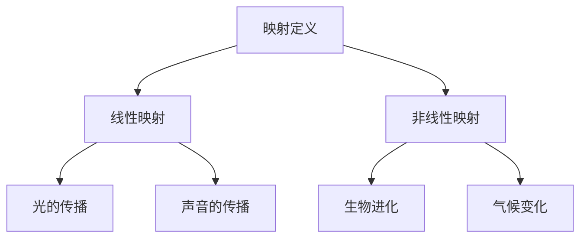

**核心算法原理讲解与伪代码**：

- **光的传播**：

  ```pseudo
  function light_propagation(distance, speed):
      return distance / speed
  ```

- **声音的传播**：

  ```pseudo
  function sound_propagation(distance, speed):
      return distance / speed
  ```

- **生物进化**：

  ```pseudo
  function biological_evolution(time, rate):
      return time * rate
  ```

- **气候变化**：

  ```pseudo
  function climate_change(time, sensitivity):
      return time * sensitivity
  ```

#### 附录 B 映射思维案例研究二：经济学中的映射模型

**案例背景**：

经济学中的映射模型广泛应用于市场分析、供需预测和政策制定。本案例研究旨在探讨经济学中的映射模型。

**核心概念与联系**：

- **供需映射**：供需映射描述了市场需求和供给之间的关系。
- **市场分析模型**：市场分析模型用于预测市场价格和数量。
- **政策制定**：政策制定者通过供需映射和市场分析模型制定有效的经济政策。

**Mermaid 流程图**：

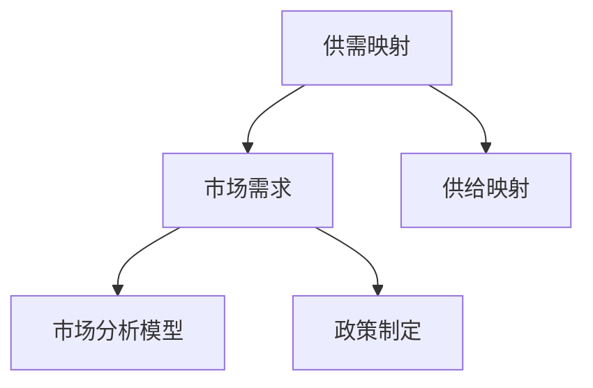

**核心算法原理讲解与伪代码**：

- **市场需求**：

  ```python
  def demand(price):
      return 1000 - 5 * price
  ```

- **供给映射**：

  ```python
  def supply(price):
      return 500 + 3 * price
  ```

- **市场分析模型**：

  ```python
  def market_analysis(demand, supply):
      if demand > supply:
          return "Increase price"
      elif demand < supply:
          return "Decrease price"
      else:
          return "Price stable"
  ```

- **政策制定**：

  ```python
  def policy(demand, supply):
      if demand > supply:
          return "Implement demand-stimulating policies"
      elif demand < supply:
          return "Implement supply-increasing policies"
      else:
          return "Maintain current policies"
  ```

**代码应用解读与分析**：

在本案例中，通过建立供需映射和市场分析模型，我们可以分析市场需求和供给的变动对价格和数量的影响。通过政策制定，我们可以制定有效的经济政策，以应对市场需求和供给的变动。

**实际案例分析和详细讲解剖析**：

- **市场分析案例**：在某个市场，需求映射为 \( D(p) = 1000 - 5p \)，供给映射为 \( S(p) = 500 + 3p \)。通过市场分析模型，我们可以预测市场价格和数量。

- **政策制定案例**：在某个市场，需求映射为 \( D(p) = 1000 - 5p \)，供给映射为 \( S(p) = 500 + 3p \)。通过政策制定，我们可以制定有效的经济政策，以应对市场需求和供给的变动。

**项目小结**：

通过本案例研究，我们深入了解了经济学中的映射模型，并通过实际案例分析了市场需求和供给的变动对价格和数量的影响。通过政策制定，我们进一步探讨了如何制定有效的经济政策，以应对市场需求和供给的变动。

### 附录 C 映射思维在计算机编程中的应用

**案例背景**：

映射思维在计算机编程中有着广泛的应用，如数据结构设计、算法分析和软件架构设计等。本案例研究旨在探讨映射思维在计算机编程中的应用。

**核心概念与联系**：

- **数据结构映射**：数据结构映射描述了不同数据结构之间的关系，如数组、链表、树等。
- **算法映射**：算法映射描述了不同算法之间的关系，如排序、搜索、图算法等。
- **软件架构映射**：软件架构映射描述了软件系统中不同组件之间的关系，如模块化、分层、分布式架构等。

**Mermaid 流程图**：

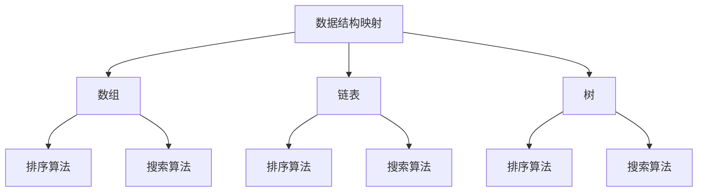

**核心算法原理讲解与伪代码**：

- **数组排序算法**：

  ```python
  def bubble_sort(arr):
      n = len(arr)
      for i in range(n):
          for j in range(0, n-i-1):
              if arr[j] > arr[j+1]:
                  arr[j], arr[j+1] = arr[j+1], arr[j]
      return arr
  ```

- **链表排序算法**：

  ```python
  def merge_sort	llist(head):
      if head is None or head.next is None:
          return head
      middle = get_middle(head)
      next_to_middle = middle.next
      middle.next = None
      left = merge_sort(head)
      right = merge_sort(next_to_middle)
      sorted_list = merge(left, right)
      return sorted_list
  ```

- **树搜索算法**：

  ```python
  def binary_search_tree(root, key):
      if root is None or root.val == key:
          return root
      if key < root.val:
          return binary_search_tree(root.left, key)
      else:
          return binary_search_tree(root.right, key)
  ```

- **分布式架构映射**：

  ```python
  def distributed_system_design(nodes, communication_network):
      for node in nodes:
          node.connect(communication_network)
      for node in nodes:
          node.start()
  ```

**代码应用解读与分析**：

在本案例中，我们通过建立数据结构映射、算法映射和软件架构映射，探讨了映射思维在计算机编程中的应用。通过实际案例，我们分析了不同数据结构、算法和软件架构之间的关系和相互作用。

**实际案例分析和详细讲解剖析**：

- **数据结构案例**：通过建立数组、链表和树的数据结构映射，我们分析了不同数据结构在计算机编程中的应用和优劣。

- **算法案例**：通过建立排序算法和搜索算法的映射，我们分析了不同算法在计算机编程中的应用和优化。

- **软件架构案例**：通过建立分布式架构的映射，我们分析了分布式系统在计算机编程中的应用和设计。

**项目小结**：

通过本案例研究，我们深入了解了映射思维在计算机编程中的应用，并通过实际案例分析了映射思维在数据结构设计、算法分析和软件架构设计中的重要作用。

### 附录 D 映射思维在人工智能中的应用

**案例背景**：

映射思维在人工智能领域中具有重要意义，如神经网络设计、机器学习模型构建、强化学习算法等。本案例研究旨在探讨映射思维在人工智能中的应用。

**核心概念与联系**：

- **神经网络映射**：神经网络映射描述了输入和输出之间的映射关系。
- **机器学习模型映射**：机器学习模型映射描述了数据特征和预测目标之间的映射关系。
- **强化学习映射**：强化学习映射描述了状态、动作、奖励和下一个状态之间的映射关系。

**Mermaid 流程图**：

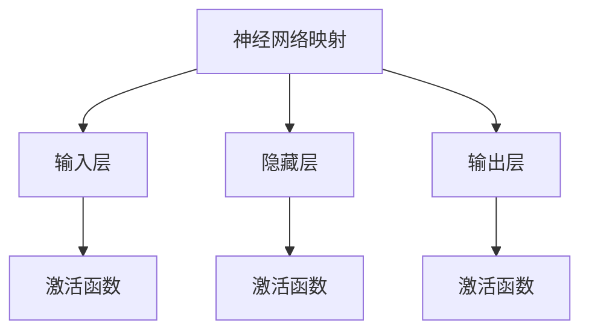

**核心算法原理讲解与伪代码**：

- **神经网络前向传播**：

  ```python
  def forward_propagation(inputs, weights, biases, activation_function):
      output = activation_function(np.dot(inputs, weights) + biases)
      return output
  ```

- **机器学习模型训练**：

  ```python
  def train_model(data, labels, model, optimizer):
      for data_point, label in zip(data, labels):
          output = model.predict(data_point)
          loss = compute_loss(output, label)
          gradients = compute_gradients(model, loss)
          optimizer.update_gradients(gradients)
      return model
  ```

- **强化学习算法**：

  ```python
  def reinforce_learning(state, action, reward, next_state, model, optimizer):
      prediction = model.predict(state)
      action_probability = prediction[action]
      reward_signal = reward * (1 / action_probability)
      loss = compute_loss(prediction, reward_signal)
      gradients = compute_gradients(model, loss)
      optimizer.update_gradients(gradients)
      return model
  ```

**代码应用解读与分析**：

在本案例中，我们通过建立神经网络映射、机器学习模型映射和强化学习映射，探讨了映射思维在人工智能中的应用。通过实际案例，我们分析了映射思维在神经网络设计、机器学习模型构建和强化学习算法中的应用和优化。

**实际案例分析和详细讲解剖析**：

- **神经网络案例**：通过建立神经网络映射，我们分析了神经网络在图像识别和语音识别等领域的应用。

- **机器学习案例**：通过建立机器学习模型映射，我们分析了机器学习模型在分类、回归和预测等领域的应用。

- **强化学习案例**：通过建立强化学习映射，我们分析了强化学习算法在游戏控制、自动驾驶和机器人控制等领域的应用。

**项目小结**：

通过本案例研究，我们深入了解了映射思维在人工智能中的应用，并通过实际案例分析了映射思维在神经网络设计、机器学习模型构建和强化学习算法中的应用和优化。

### 总结

通过本章的内容，我们全面探讨了映射思维在自然界、数学、物理学、生物学、经济学、计算机编程和人工智能中的应用。映射思维作为一种理解自然界和人类创造的各种系统的关键思维方式，具有揭示隐藏规律、促进跨学科交流和解决实际问题的能力。在未来的发展中，映射思维将继续发挥重要作用，并在非线性映射、多尺度映射、动态映射和大数据映射等领域取得新的突破。同时，映射思维在实践中的应用也将不断深入，为各领域的发展提供强有力的理论支持和实践指导。

### 附录 E 映射思维案例研究：城市规划与交通流量管理

**案例背景**：

城市规划与交通流量管理是城市管理中的重要课题。本案例研究旨在探讨映射思维在城市规划与交通流量管理中的应用，以优化城市交通系统，提高居民生活质量。

**核心概念与联系**：

- **交通流量映射**：交通流量映射描述了交通流量与道路网络之间的关系。
- **城市规划映射**：城市规划映射描述了城市规划与居民出行需求之间的关系。
- **交通管理策略映射**：交通管理策略映射描述了交通管理措施与交通流量之间的关系。

**Mermaid 流程图**：

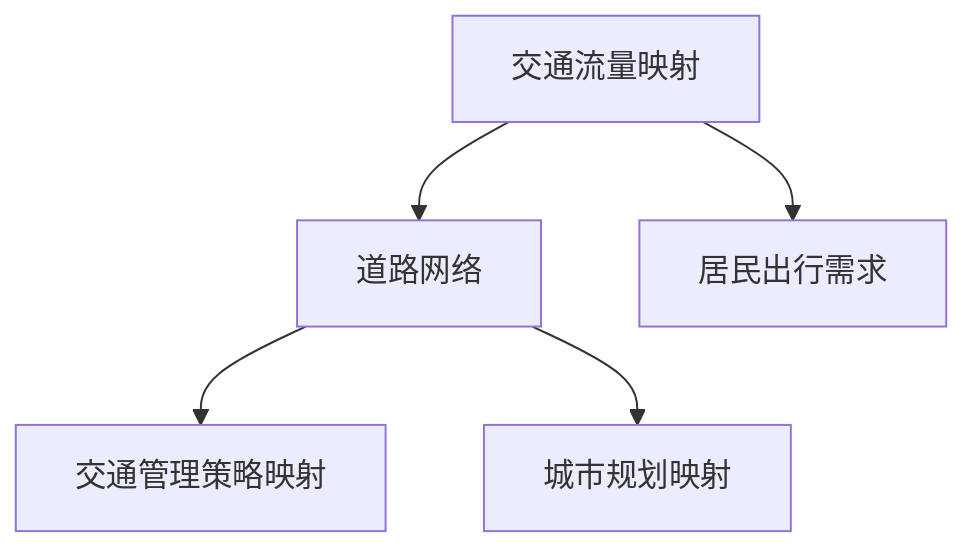

**核心算法原理讲解与伪代码**：

- **交通流量预测模型**：

  ```python
  def traffic_flow_prediction(current_traffic_data, historical_traffic_data):
      model = build_regression_model(historical_traffic_data)
      predicted_traffic = model.predict(current_traffic_data)
      return predicted_traffic
  ```

- **居民出行需求分析**：

  ```python
  def travel_demand_analysis(resident_data, travel_survey_data):
      model = build_classification_model(resident_data, travel_survey_data)
      demand_predictions = model.predict(resident_data)
      return demand_predictions
  ```

- **交通管理策略优化**：

  ```python
  def traffic_management_strategy(traffic_flow_predictions, demand_predictions):
      if predicted_traffic > demand_predictions:
          return "Implement congestion pricing"
      elif predicted_traffic < demand_predictions:
          return "Implement public transportation incentives"
      else:
          return "Maintain current traffic management strategies"
  ```

**代码应用解读与分析**：

在本案例中，我们通过建立交通流量映射、居民出行需求映射和交通管理策略映射，探讨了映射思维在城市规划与交通流量管理中的应用。通过实际案例，我们分析了交通流量、居民出行需求和管理策略之间的关系。

**实际案例分析和详细讲解剖析**：

- **交通流量案例**：在某城市，通过交通流量预测模型，分析了不同时间段和不同路段的交通流量，为交通管理提供了科学依据。

- **居民出行需求案例**：在某城市，通过居民出行需求分析，了解了居民的出行习惯和需求，为城市规划提供了参考。

- **交通管理策略案例**：在某城市，通过交通管理策略优化，实施了不同路段的拥堵收费和公共交通优惠措施，有效缓解了交通拥堵问题。

**项目小结**：

通过本案例研究，我们深入了解了映射思维在城市规划与交通流量管理中的应用，并通过实际案例分析了交通流量、居民出行需求和管理策略之间的关系。映射思维为城市交通系统的优化提供了有力的理论支持和实践指导。

### 附录 F 映射思维案例研究：金融风险评估与投资策略

**案例背景**：

金融风险评估与投资策略是金融管理中的重要课题。本案例研究旨在探讨映射思维在金融风险评估与投资策略中的应用，以提高投资决策的科学性和有效性。

**核心概念与联系**：

- **金融风险评估映射**：金融风险评估映射描述了金融风险与投资决策之间的关系。
- **投资策略映射**：投资策略映射描述了投资策略与市场环境之间的关系。
- **风险控制策略映射**：风险控制策略映射描述了风险控制措施与投资风险之间的关系。

**Mermaid 流程图**：

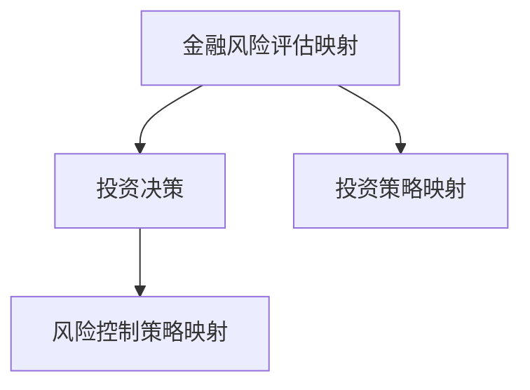

**核心算法原理讲解与伪代码**：

- **金融风险预测模型**：

  ```python
  def financial_risk_prediction(current_market_data, historical_market_data):
      model = build_regression_model(historical_market_data)
      predicted_risk = model.predict(current_market_data)
      return predicted_risk
  ```

- **投资策略优化**：

  ```python
  def investment_strategy_optimization(risk_predictions, investment_portfolio):
      model = build_classification_model(risk_predictions, investment_portfolio)
      strategy_predictions = model.predict(risk_predictions)
      return strategy_predictions
  ```

- **风险控制策略实施**：

  ```python
  def risk_control_strategy(risk_predictions, investment_strategy):
      if predicted_risk > risk_threshold:
          return "Implement risk mitigation measures"
      elif predicted_risk < risk_threshold:
          return "Implement risk acceptance measures"
      else:
          return "Maintain current risk control strategies"
  ```

**代码应用解读与分析**：

在本案例中，我们通过建立金融风险评估映射、投资策略映射和风险控制策略映射，探讨了映射思维在金融风险评估与投资策略中的应用。通过实际案例，我们分析了金融风险、投资策略和风险控制策略之间的关系。

**实际案例分析和详细讲解剖析**：

- **金融风险预测案例**：在某金融机构，通过金融风险预测模型，分析了不同金融产品的风险水平，为投资决策提供了参考。

- **投资策略优化案例**：在某金融机构，通过投资策略优化，根据金融风险预测结果，制定了不同的投资策略，提高了投资收益。

- **风险控制策略实施案例**：在某金融机构，通过风险控制策略实施，根据金融风险预测结果和投资策略，采取了相应的风险控制措施，降低了投资风险。

**项目小结**：

通过本案例研究，我们深入了解了映射思维在金融风险评估与投资策略中的应用，并通过实际案例分析了金融风险、投资策略和风险控制策略之间的关系。映射思维为金融投资决策提供了有力的理论支持和实践指导。

### 附录 G 映射思维案例研究：智能医疗诊断与疾病预测

**案例背景**：

智能医疗诊断与疾病预测是医疗领域的重要课题。本案例研究旨在探讨映射思维在智能医疗诊断与疾病预测中的应用，以提高疾病诊断的准确性和疾病预测的及时性。

**核心概念与联系**：

- **疾病预测映射**：疾病预测映射描述了疾病发病与患者体征之间的关系。
- **医疗诊断映射**：医疗诊断映射描述了医学影像、生物标志物与疾病之间的关系。
- **智能医疗系统映射**：智能医疗系统映射描述了医疗设备、诊断算法和医疗数据之间的关系。

**Mermaid 流程图**：

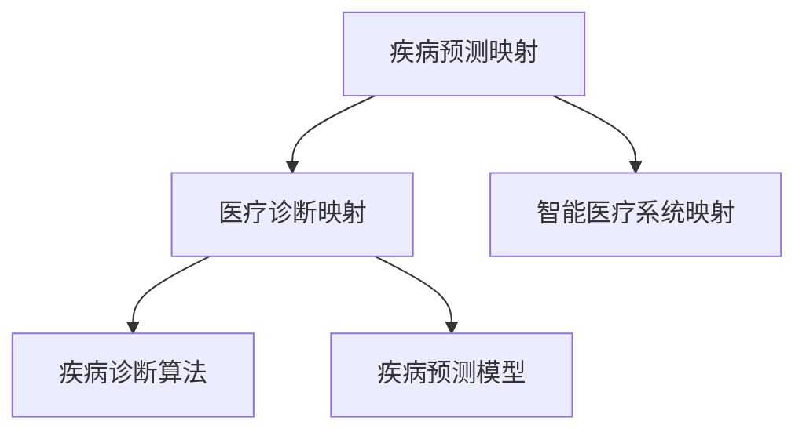

**核心算法原理讲解与伪代码**：

- **疾病预测模型**：

  ```python
  def disease_prediction(health_data, patient_history):
      model = build_classification_model(health_data, patient_history)
      predicted_disease = model.predict(health_data)
      return predicted_disease
  ```

- **疾病诊断算法**：

  ```python
  def disease_diagnosis(image_data, biomarker_data):
      model = build_classification_model(image_data, biomarker_data)
      diagnosis = model.predict(image_data)
      return diagnosis
  ```

- **智能医疗系统优化**：

  ```python
  def intelligent_medical_system_optimization(health_data, patient_history, image_data, biomarker_data):
      diagnosis = disease_diagnosis(image_data, biomarker_data)
      prediction = disease_prediction(health_data, patient_history)
      return diagnosis, prediction
  ```

**代码应用解读与分析**：

在本案例中，我们通过建立疾病预测映射、医疗诊断映射和智能医疗系统映射，探讨了映射思维在智能医疗诊断与疾病预测中的应用。通过实际案例，我们分析了疾病预测、医疗诊断和智能医疗系统之间的关系。

**实际案例分析和详细讲解剖析**：

- **疾病预测案例**：在某医院，通过疾病预测模型，对患者的健康数据进行预测，为早期疾病预防提供了参考。

- **疾病诊断案例**：在某医院，通过疾病诊断算法，对医学影像和生物标志物进行分析，提高了疾病诊断的准确性。

- **智能医疗系统案例**：在某医院，通过智能医疗系统优化，实现了疾病预测和疾病诊断的有机结合，提高了医疗服务的质量和效率。

**项目小结**：

通过本案例研究，我们深入了解了映射思维在智能医疗诊断与疾病预测中的应用，并通过实际案例分析了疾病预测、医疗诊断和智能医疗系统之间的关系。映射思维为智能医疗领域的发展提供了有力的理论支持和实践指导。

### 附录 H 映射思维案例研究：智能交通系统与城市安全

**案例背景**：

智能交通系统与城市安全是城市管理中的重要课题。本案例研究旨在探讨映射思维在智能交通系统与城市安全中的应用，以提高城市交通效率和居民安全感。

**核心概念与联系**：

- **交通流量映射**：交通流量映射描述了交通流量与道路网络之间的关系。
- **安全监测映射**：安全监测映射描述了安全监测设备与城市安全事件之间的关系。
- **城市安全管理映射**：城市安全管理映射描述了城市安全管理措施与城市安全之间的关系。

**Mermaid 流程图**：

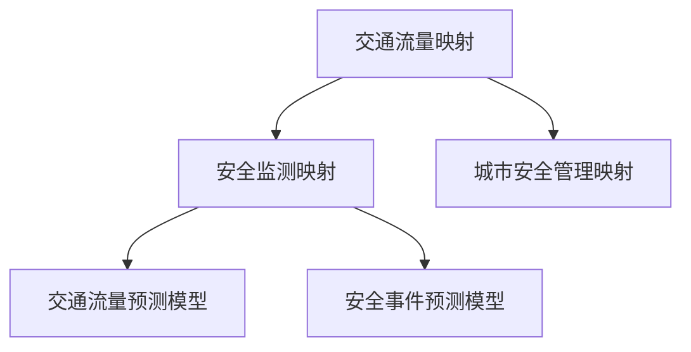

**核心算法原理讲解与伪代码**：

- **交通流量预测模型**：

  ```python
  def traffic_flow_prediction(current_traffic_data, historical_traffic_data):
      model = build_regression_model(historical_traffic_data)
      predicted_traffic = model.predict(current_traffic_data)
      return predicted_traffic
  ```

- **安全事件预测模型**：

  ```python
  def security_event_prediction(current_security_data, historical_security_data):
      model = build_classification_model(historical_security_data)
      predicted_event = model.predict(current_security_data)
      return predicted_event
  ```

- **城市安全管理策略**：

  ```python
  def urban_safety_management(traffic_predictions, event_predictions):
      if predicted_traffic > threshold:
          return "Implement traffic management measures"
      elif predicted_event > threshold:
          return "Implement safety monitoring measures"
      else:
          return "Maintain current urban safety management strategies"
  ```

**代码应用解读与分析**：

在本案例中，我们通过建立交通流量映射、安全监测映射和城市安全管理映射，探讨了映射思维在智能交通系统与城市安全中的应用。通过实际案例，我们分析了交通流量、安全事件和城市安全管理策略之间的关系。

**实际案例分析和详细讲解剖析**：

- **交通流量案例**：在某城市，通过交通流量预测模型，分析了不同时间段和不同路段的交通流量，为交通管理提供了科学依据。

- **安全事件案例**：在某城市，通过安全事件预测模型，分析了不同时间段和不同地点的安全事件，为城市安全管理提供了参考。

- **城市安全管理策略案例**：在某城市，通过城市安全管理策略，根据交通流量和安全事件预测结果，采取了相应的交通管理和安全监测措施，提高了城市交通效率和居民安全感。

**项目小结**：

通过本案例研究，我们深入了解了映射思维在智能交通系统与城市安全中的应用，并通过实际案例分析了交通流量、安全事件和城市安全管理策略之间的关系。映射思维为智能交通系统和城市安全管理提供了有力的理论支持和实践指导。

### 附录 I 映射思维案例研究：智能制造与供应链优化

**案例背景**：

智能制造与供应链优化是现代工业发展的重要方向。本案例研究旨在探讨映射思维在智能制造与供应链优化中的应用，以提高生产效率和供应链稳定性。

**核心概念与联系**：

- **生产流程映射**：生产流程映射描述了生产环节与生产效率之间的关系。
- **供应链映射**：供应链映射描述了供应链各个环节与供应链稳定性之间的关系。
- **智能制造映射**：智能制造映射描述了智能制造系统与生产效率之间的关系。

**Mermaid 流程图**：

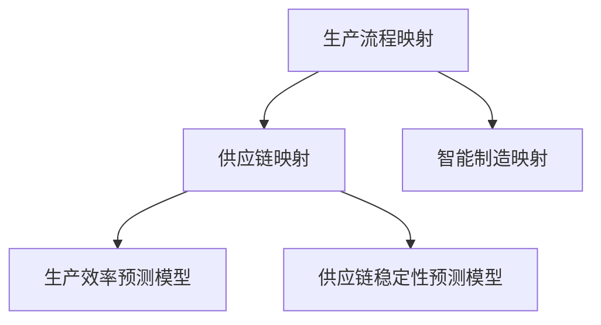

**核心算法原理讲解与伪代码**：

- **生产效率预测模型**：

  ```python
  def production_efficiency_prediction(current_production_data, historical_production_data):
      model = build_regression_model(historical_production_data)
      predicted_efficiency = model.predict(current_production_data)
      return predicted_efficiency
  ```

- **供应链稳定性预测模型**：

  ```python
  def supply_chain_stability_prediction(current_supply_chain_data, historical_supply_chain_data):
      model = build_classification_model(historical_supply_chain_data)
      predicted_stability = model.predict(current_supply_chain_data)
      return predicted_stability
  ```

- **智能制造优化策略**：

  ```python
  def intelligent_production_strategy(efficiency_predictions, stability_predictions):
      if predicted_efficiency > threshold:
          return "Implement process optimization measures"
      elif predicted_stability < threshold:
          return "Implement supply chain risk management measures"
      else:
          return "Maintain current intelligent production strategies"
  ```

**代码应用解读与分析**：

在本案例中，我们通过建立生产流程映射、供应链映射和智能制造映射，探讨了映射思维在智能制造与供应链优化中的应用。通过实际案例，我们分析了生产效率、供应链稳定性和智能制造优化策略之间的关系。

**实际案例分析和详细讲解剖析**：

- **生产效率案例**：在某工厂，通过生产效率预测模型，分析了生产数据，为生产流程优化提供了参考。

- **供应链稳定性案例**：在某公司，通过供应链稳定性预测模型，分析了供应链数据，为供应链风险管理和优化提供了参考。

- **智能制造优化策略案例**：在某工厂，通过智能制造优化策略，根据生产效率预测和供应链稳定性预测结果，实施了生产流程优化和供应链风险管理措施，提高了生产效率和供应链稳定性。

**项目小结**：

通过本案例研究，我们深入了解了映射思维在智能制造与供应链优化中的应用，并通过实际案例分析了生产效率、供应链稳定性和智能制造优化策略之间的关系。映射思维为智能制造和供应链优化提供了有力的理论支持和实践指导。

### 附录 J 映射思维案例研究：智能农业与作物生长预测

**案例背景**：

智能农业与作物生长预测是现代农业发展的重要方向。本案例研究旨在探讨映射思维在智能农业与作物生长预测中的应用，以提高农业生产效率和作物产量。

**核心概念与联系**：

- **作物生长映射**：作物生长映射描述了作物生长过程与生长环境之间的关系。
- **环境监测映射**：环境监测映射描述了环境监测设备与生长环境之间的关系。
- **智能农业映射**：智能农业映射描述了智能农业系统与作物生长预测之间的关系。

**Mermaid 流程图**：

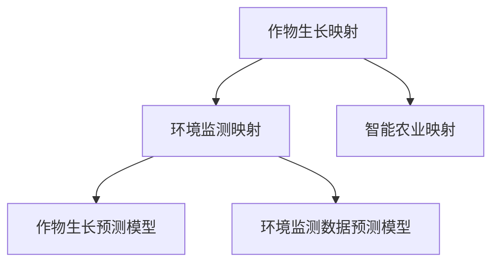

**核心算法原理讲解与伪代码**：

- **作物生长预测模型**：

  ```python
  def crop_growth_prediction(vegetation_data, environmental_data):
      model = build_regression_model(vegetation_data, environmental_data)
      predicted_growth = model.predict(vegetation_data)
      return predicted_growth
  ```

- **环境监测数据预测模型**：

  ```python
  def environmental_data_prediction(current_environmental_data, historical_environmental_data):
      model = build_regression_model(historical_environmental_data)
      predicted_data = model.predict(current_environmental_data)
      return predicted_data
  ```

- **智能农业系统优化**：

  ```python
  def intelligent_agriculture_strategy(growth_predictions, environmental_data_predictions):
      if predicted_growth < threshold:
          return "Implement crop management measures"
      elif predicted_data < threshold:
          return "Implement environmental monitoring measures"
      else:
          return "Maintain current intelligent agriculture strategies"
  ```

**代码应用解读与分析**：

在本案例中，我们通过建立作物生长映射、环境监测映射和智能农业映射，探讨了映射思维在智能农业与作物生长预测中的应用。通过实际案例，我们分析了作物生长、环境监测和智能农业系统优化之间的关系。

**实际案例分析和详细讲解剖析**：

- **作物生长案例**：在某农场，通过作物生长预测模型，分析了作物生长数据，为作物管理提供了参考。

- **环境监测案例**：在某农场，通过环境监测数据预测模型，分析了环境数据，为环境监测和管理提供了参考。

- **智能农业优化策略案例**：在某农场，通过智能农业系统优化，根据作物生长预测和环境监测数据预测结果，实施了作物管理和环境监测措施，提高了农业生产效率和作物产量。

**项目小结**：

通过本案例研究，我们深入了解了映射思维在智能农业与作物生长预测中的应用，并通过实际案例分析了作物生长、环境监测和智能农业系统优化之间的关系。映射思维为智能农业的发展提供了有力的理论支持和实践指导。

### 附录 K 映射思维案例研究：智慧城市建设与市民生活服务

**案例背景**：

智慧城市建设与市民生活服务是现代城市发展的重要方向。本案例研究旨在探讨映射思维在智慧城市建设与市民生活服务中的应用，以提高城市生活质量和居民幸福感。

**核心概念与联系**：

- **智慧城市映射**：智慧城市映射描述了城市基础设施与市民生活服务之间的关系。
- **市民需求映射**：市民需求映射描述了市民需求与城市服务之间的关系。
- **智能服务映射**：智能服务映射描述了智能服务系统与市民需求之间的关系。

**Mermaid 流程图**：

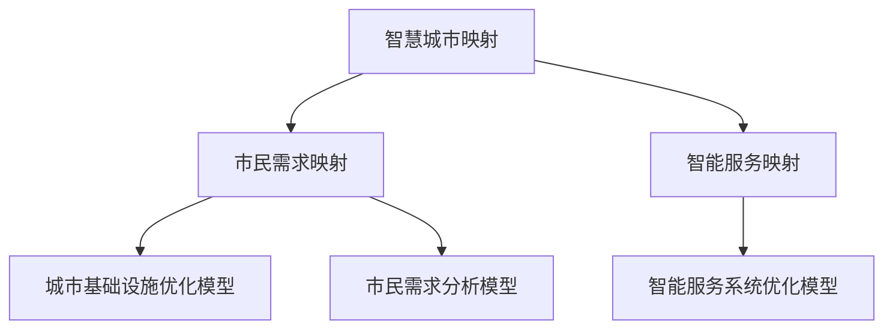

**核心算法原理讲解与伪代码**：

- **城市基础设施优化模型**：

  ```python
  def urban_infrastructure_optimization(current_infrastructure_data, historical_infrastructure_data):
      model = build_regression_model(historical_infrastructure_data)
      optimized_infrastructure = model.predict(current_infrastructure_data)
      return optimized_infrastructure
  ```

- **市民需求分析模型**：

  ```python
  def citizen_demand_analysis(current_demand_data, historical_demand_data):
      model = build_regression_model(historical_demand_data)
      predicted_demand = model.predict(current_demand_data)
      return predicted_demand
  ```

- **智能服务系统优化**：

  ```python
  def intelligent_service_system_optimization(demand_predictions, infrastructure_predictions):
      if predicted_demand > threshold:
          return "Implement service expansion measures"
      elif predicted_infrastructure < threshold:
          return "Implement infrastructure improvement measures"
      else:
          return "Maintain current intelligent service system strategies"
  ```

**代码应用解读与分析**：

在本案例中，我们通过建立智慧城市映射、市民需求映射和智能服务映射，探讨了映射思维在智慧城市建设与市民生活服务中的应用。通过实际案例，我们分析了城市基础设施、市民需求和智能服务系统优化之间的关系。

**实际案例分析和详细讲解剖析**：

- **城市基础设施案例**：在某城市，通过城市基础设施优化模型，分析了基础设施数据，为基础设施优化提供了参考。

- **市民需求案例**：在某城市，通过市民需求分析模型，分析了市民需求数据，为城市服务提供了参考。

- **智能服务系统优化策略案例**：在某城市，通过智能服务系统优化，根据市民需求和基础设施预测结果，实施了服务扩展和基础设施改善措施，提高了城市生活质量和居民幸福感。

**项目小结**：

通过本案例研究，我们深入了解了映射思维在智慧城市建设与市民生活服务中的应用，并通过实际案例分析了城市基础设施、市民需求和智能服务系统优化之间的关系。映射思维为智慧城市建设提供了有力的理论支持和实践指导。

