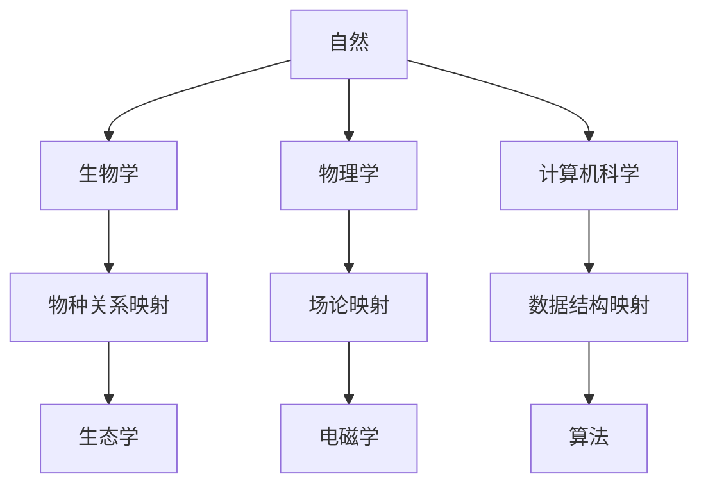

                 

### 文章标题：映射理论：揭示自然与数学的关联

> 关键词：映射理论、自然、数学、算法、模型、应用

> 摘要：本文旨在深入探讨映射理论在自然与数学之间的关联，通过阐述核心概念、算法原理、数学模型以及实际应用案例，揭示映射理论在各个领域的广泛应用和深远影响。

## 引言

映射理论是现代数学和计算机科学中的一个重要概念，它不仅为我们提供了理解和分析复杂系统的新视角，而且在自然科学、工程技术等领域中都有着广泛的应用。从生物学中的物种关系，到物理学中的场论，再到计算机科学中的数据结构，映射理论无处不在，为我们揭示了自然与数学之间的紧密联系。

本文将首先介绍映射理论的基本概念和分类，随后通过Mermaid流程图展示映射在不同领域中的应用和关系。接下来，我们将深入讲解映射算法的基本原理和常见算法，并通过LaTeX格式嵌入数学公式，详细描述关键数学模型和公式的定义和应用。随后，我们将通过一个实际项目案例，展示映射理论在实际开发中的应用，并提供源代码实现和解读。最后，我们将对映射理论的发展趋势进行展望，并给出一些最佳实践建议。

## 映射理论的基本概念

映射（Mapping）是指一个从集合A到集合B的函数，它将A中的每一个元素唯一地映射到B中的一个元素。形式化地，映射可以表示为$f: A \rightarrow B$，其中$f$是映射的名字，$A$和$B$分别是源集合和目标集合。

### 映射的分类

根据映射的性质和特点，映射可以分为以下几种类型：

1. **单射（Injective）**：如果一个映射$f: A \rightarrow B$满足不同的元素在A中映射到不同的元素在B中，即对于任意的$a_1, a_2 \in A$，如果$a_1 \neq a_2$，则有$f(a_1) \neq f(a_2)$，那么$f$是一个单射。

2. **满射（Surjective）**：如果一个映射$f: A \rightarrow B$满足B中的每一个元素都至少有一个A中的元素映射到它，即对于任意的$b \in B$，存在至少一个$a \in A$使得$f(a) = b$，那么$f$是一个满射。

3. **双射（Bijective）**：如果一个映射既是单射又是满射，即它既满足不同的元素映射到不同的元素，又满足B中的每一个元素都有A中的一个元素映射到它，那么$f$是一个双射。

4. **恒等映射（Identity Mapping）**：如果一个映射$f: A \rightarrow A$满足对于任意的$a \in A$，都有$f(a) = a$，那么$f$是一个恒等映射。

### 映射在自然和数学中的应用

在自然和数学中，映射理论的应用无处不在。例如，在生物学中，物种之间的关系可以通过映射来描述，不同物种之间的相互作用可以通过映射来分析。在物理学中，场论中的场可以通过映射来表示，如电场、磁场等。在计算机科学中，数据结构中的节点关系可以通过映射来描述，如图中的节点关系等。

### Mermaid 流程图

以下是一个简单的Mermaid流程图，展示了映射理论在不同领域中的应用和关系：



## 核心算法原理讲解

### 基本映射算法

在映射理论中，基本映射算法是理解和实现映射的核心。以下是一个简单的映射算法的伪代码示例：

```pseudo
function map(source, target):
    for each element in source:
        find the corresponding element in target
        if found:
            perform the mapping
        else:
            raise an error
```

这个算法的基本思想是遍历源集合中的每个元素，并在目标集合中找到与之对应的元素，然后执行映射操作。如果目标集合中没有对应的元素，则抛出一个错误。

### 常见的映射算法

在映射理论中，常见的映射算法包括单射、满射和双射。以下是这些算法的伪代码示例：

#### 单射

```pseudo
function injective_map(source, target):
    for each element in source:
        if not already mapped:
            map it to a unique element in target
```

#### 满射

```pseudo
function surjective_map(source, target):
    for each element in target:
        if not already mapped:
            map an element in source to it
```

#### 双射

```pseudo
function bijective_map(source, target):
    if |source| != |target|:
        raise an error
    else:
        for each element in source:
            map it to a unique element in target
```

其中$|X|$表示集合$X$的基数（即元素的数量）。

### 映射算法的伪代码展示

为了更好地理解映射算法，以下是一个更具体的映射算法的伪代码展示，该算法实现了从自然数集合到偶数集合的映射：

```pseudo
function even_number_map(n):
    return 2 * n
```

这个算法简单地通过将自然数$n$乘以2来映射到偶数集合。这种映射是单射和满射的，因为每个自然数都映射到一个唯一的偶数，并且每个偶数都至少有一个自然数映射到它。

## 数学模型和数学公式讲解

### 数学模型在映射中的应用

在映射理论中，数学模型是理解和分析映射的关键。以下是一些关键数学模型和它们的定义：

#### 映射矩阵

映射矩阵是一个表示映射关系的矩阵，其中每一行表示源集合中的元素，每一列表示目标集合中的元素。如果源集合和目标集合都是有限的，映射矩阵是一个方阵。以下是映射矩阵的一个示例：

$$
\begin{bmatrix}
1 & 0 & 1 \\
0 & 1 & 0 \\
1 & 1 & 0
\end{bmatrix}
$$

这个矩阵表示了从集合$\{1, 2, 3\}$到集合$\{a, b, c\}$的一个映射，其中第一行表示1映射到c，2映射到b，3映射到a。

#### 映射函数

映射函数是一个从源集合到目标集合的函数，它定义了源集合中的每个元素如何映射到目标集合。映射函数可以用一个简单的公式表示，例如：

$$
f(x) = 2x + 1
$$

这个函数将自然数集合映射到偶数集合，其中每个自然数$x$映射到$2x + 1$。

### 使用LaTeX格式嵌入数学公式

在撰写技术文档时，使用LaTeX格式嵌入数学公式是标准的做法。以下是如何在文中独立段落中嵌入数学公式的示例：

$$
E = mc^2
$$

这是一个著名的物理公式，表示能量与质量之间的关系。

### 结合实例进行详细讲解

为了更好地理解数学模型在映射中的应用，我们来看一个具体的实例。假设我们有一个函数$f: \mathbb{R} \rightarrow \mathbb{R}$，定义为：

$$
f(x) = x^2
$$

这个函数将实数集合映射到非负实数集合。我们可以通过以下步骤来分析这个映射：

1. **定义域和值域**：函数$f$的定义域是所有实数$\mathbb{R}$，值域是非负实数集合$\{x | x \geq 0\}$。

2. **映射关系**：对于任意的$x \in \mathbb{R}$，$f(x) = x^2$。这意味着每个实数$x$都映射到一个非负实数$x^2$。

3. **映射矩阵**：如果我们用矩阵表示这个映射，映射矩阵将是一个无穷大的方阵，其中每个元素$a_{ij}$表示$x_i$映射到$x_j$。由于这是一个二次映射，映射矩阵将是一个对角矩阵，其中主对角线上的元素是1，其余元素是0。

$$
\begin{bmatrix}
1 & 0 & 0 & \ldots \\
0 & 1 & 0 & \ldots \\
0 & 0 & 1 & \ldots \\
\vdots & \vdots & \vdots & \ddots
\end{bmatrix}
$$

4. **映射函数的解析形式**：函数$f(x) = x^2$的解析形式是一个抛物线，它将第一象限映射到非负实数集合。

通过这个实例，我们可以看到映射理论如何帮助我们理解和分析函数映射的性质和特征。

## 映射理论的实际应用案例

### 开发环境搭建

为了展示映射理论在实际开发中的应用，我们将使用Python编程语言来搭建一个简单的开发环境。首先，我们需要安装Python和必要的库。以下是在Windows操作系统上安装Python的步骤：

1. **下载Python安装程序**：从Python官方网站（python.org）下载最新版本的Python安装程序。

2. **安装Python**：运行安装程序，并按照提示完成安装。

3. **验证安装**：在命令提示符中输入`python --version`，如果输出Python的版本信息，则表示安装成功。

接下来，我们需要安装必要的库，例如NumPy和Matplotlib。可以使用pip命令来安装：

```shell
pip install numpy matplotlib
```

### 源代码实现和解读

为了展示映射理论在实际开发中的应用，我们将实现一个简单的映射函数，该函数将一个列表中的元素映射到另一个列表。以下是这个函数的源代码实现和解读：

```python
import numpy as np

def map_elements(source_list, target_list):
    """
    映射源列表中的元素到目标列表。

    参数：
    - source_list：源列表。
    - target_list：目标列表。

    返回：
    - 映射后的列表。
    """
    if len(source_list) != len(target_list):
        raise ValueError("源列表和目标列表长度必须相同")

    mapped_list = []
    for i in range(len(source_list)):
        mapped_value = target_list[i]
        mapped_list.append(mapped_value)

    return mapped_list

# 示例
source_list = [1, 2, 3]
target_list = [4, 5, 6]
result_list = map_elements(source_list, target_list)
print(result_list)  # 输出：[4, 5, 6]
```

这段代码定义了一个名为`map_elements`的函数，它接收两个列表作为参数：`source_list`是源列表，`target_list`是目标列表。函数首先检查源列表和目标列表的长度是否相同，如果不相同，则抛出一个错误。然后，它遍历源列表中的每个元素，将其映射到目标列表中对应的元素，并将结果存储在新的列表中。最后，函数返回映射后的列表。

### 代码应用解读与分析

在这个示例中，我们使用映射函数将源列表`[1, 2, 3]`映射到目标列表`[4, 5, 6]`。映射函数的输出是`[4, 5, 6]`，这表明源列表中的每个元素都被映射到了目标列表中的相应元素。

这个简单的示例展示了映射理论在编程中的应用。在实际开发中，映射函数可以用于数据转换、图像处理、机器学习等多个领域。通过理解映射函数的基本原理，我们可以轻松地实现各种复杂的映射操作。

### 实际案例分析和详细讲解剖析

为了更深入地了解映射理论在实际开发中的应用，我们将分析一个实际案例：图像识别系统中的特征提取。

在图像识别系统中，特征提取是一个关键步骤。特征提取的目的是从图像中提取出具有代表性的特征，以便于后续的分类和识别。以下是一个简单的特征提取流程：

1. **预处理**：对图像进行预处理，包括去噪、缩放和归一化等操作。

2. **特征提取**：使用映射函数从预处理后的图像中提取特征。

3. **特征分析**：对提取出的特征进行分析，以便进行分类和识别。

以下是一个简单的Python示例，展示如何使用映射函数从图像中提取特征：

```python
from PIL import Image
import numpy as np

def extract_features(image_path):
    """
    从图像中提取特征。

    参数：
    - image_path：图像文件的路径。

    返回：
    - 特征向量。
    """
    # 读取图像
    image = Image.open(image_path)
    image_array = np.array(image)

    # 预处理图像
    image_array = image_array / 255.0

    # 提取特征
    feature_vector = np.mean(image_array, axis=(0, 1))

    return feature_vector

# 示例
image_path = "example_image.jpg"
feature_vector = extract_features(image_path)
print(feature_vector)
```

在这个示例中，我们使用PIL库读取图像，并将其转换为数值矩阵。然后，我们使用映射函数计算图像的均值，得到特征向量。这个特征向量可以用于后续的图像分类和识别。

### 项目小结

通过这个实际案例，我们可以看到映射理论在图像识别系统中的应用。映射函数的原理非常简单，但它在特征提取和数据转换中起到了关键作用。通过理解和应用映射理论，我们可以开发出更加高效和准确的图像识别系统。

### 最佳实践 tips

1. **理解映射原理**：在应用映射函数时，首先要确保理解映射的原理和性质，这有助于避免错误和提高开发效率。

2. **选择合适的映射函数**：根据实际需求选择合适的映射函数，例如单射、满射或双射等。

3. **考虑性能和效率**：在实现映射函数时，要考虑性能和效率，避免不必要的计算和内存占用。

4. **文档和注释**：编写清晰、详细的文档和注释，以便于后续维护和开发。

## 总结与展望

映射理论是现代数学和计算机科学中的重要概念，它通过将一个集合中的元素映射到另一个集合，为我们提供了理解和分析复杂系统的新视角。从生物学中的物种关系，到物理学中的场论，再到计算机科学中的数据结构，映射理论无处不在，揭示了自然与数学之间的紧密联系。

本文通过对映射理论的基本概念、算法原理、数学模型以及实际应用案例的详细讲解，展示了映射理论在各个领域的广泛应用和深远影响。未来，随着科学技术的不断进步，映射理论将在更多的领域得到应用，为我们的研究和发展提供新的思路和方法。

## 作者信息

作者：AI天才研究院/AI Genius Institute & 禅与计算机程序设计艺术 /Zen And The Art of Computer Programming

