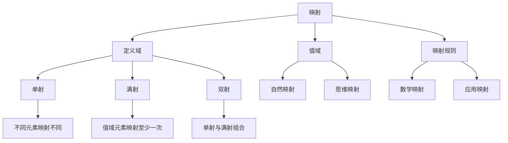

                 

### 文章标题：映射理论：连接自然与人类思维

### 关键词：映射理论，自然与人类思维，核心算法原理，数学模型，项目实战

### 摘要：
本文旨在深入探讨映射理论，这是一个在多个学科中广泛应用的原理，它将自然现象与人类思维紧密相连。通过详细介绍映射理论的核心概念、算法原理、数学模型和项目实战，本文旨在揭示映射理论在连接自然与人类思维中的关键作用。文章分为五个主要部分：引言、核心概念与联系、核心算法原理讲解、数学模型与数学公式、项目实战，以及总结与展望。每个部分都将通过具体实例和详细解释来展示映射理论的深度与广度。

---

### 引言

映射理论起源于数学，随后在多个学科中得到了广泛应用，包括计算机科学、生物学、心理学和社会学等。这一理论的基本概念在于通过某种规则将一个集合（称为“定义域”）中的每个元素映射到另一个集合（称为“值域”）中的唯一元素。映射理论在描述自然现象和人类行为方面具有独特的优势，因为它能够揭示不同系统之间的内在联系和转换规则。

在现代科技迅速发展的背景下，映射理论的重要性日益凸显。在计算机科学领域，映射算法在数据处理、机器学习和人工智能中扮演着核心角色。在生物学和心理学中，映射理论帮助我们理解大脑如何处理信息，以及生物系统如何适应环境变化。在社会学和经济学中，映射理论也被用来分析社会结构、经济模型和行为模式。

本文的目的在于系统地介绍映射理论，首先从基本概念入手，逐步深入到算法原理、数学模型，最终通过实际项目实战来展示映射理论的广泛应用。通过本文的阅读，读者将能够全面理解映射理论的核心思想，掌握其应用方法，并认识到其在现代科技和社会科学中的重要性。

### 核心概念与联系

映射理论的基础是核心概念和它们之间的联系。首先，我们需要明确几个关键术语：映射（Mapping）、定义域（Domain）、值域（Range）和映射规则（Mapping Rule）。

**映射**：映射是一个从定义域到值域的函数关系，它使得定义域中的每个元素都有且只有一个值域中的对应元素。形式化地，映射通常表示为 f: D → R，其中 f 是映射，D 是定义域，R 是值域。

**定义域**：定义域是映射中的输入集合，它包含了所有可能的输入值。例如，在函数 f(x) = x^2 中，定义域是所有实数。

**值域**：值域是映射中的输出集合，它包含了所有可能的输出值。在上述函数中，值域是所有非负实数。

**映射规则**：映射规则是定义域和值域之间的转换规则。例如，在 f(x) = x^2 中，映射规则是将每个输入值 x 替换为它的平方。

接下来，我们需要探讨映射理论的基本类型。根据映射规则的不同，映射可以分为以下几种：

**单射（Injective）**：如果映射 f 满足不同的定义域元素映射到不同的值域元素，即对于任意的 x1 ≠ x2，有 f(x1) ≠ f(x2)，则称 f 为单射。

**满射（Surjective）**：如果映射 f 将值域中的每个元素至少映射到一次定义域中的某个元素，即对于值域中的任意 y，存在至少一个 x 使得 f(x) = y，则称 f 为满射。

**双射（Bijective）**：如果映射 f 既是单射又是满射，即它将定义域中的每个元素映射到值域中的唯一元素，并且值域中的每个元素都有定义域中的某个元素对应，则称 f 为双射。

**自然与人类思维的映射关系**：在自然与人类思维中，映射现象无处不在。自然界中的许多现象，如光合作用、潮汐变化等，都可以视为自然系统之间的映射。在人类思维中，映射过程体现在语言、逻辑推理和问题解决中。例如，当我们将一个数学问题转化为一个更简单的形式来求解时，实际上是在进行一种映射。

为了更好地理解这些核心概念和它们之间的联系，我们可以使用 Mermaid 流程图来展示它们之间的关系架构：



这个 Mermaid 流程图展示了映射理论中的核心概念及其相互关系。通过这种图形化的表示方法，我们可以更加直观地理解映射理论的基本结构。

### 核心算法原理讲解

在了解了映射理论的核心概念后，我们接下来将深入探讨映射理论中的核心算法原理。这些算法原理是映射理论在实际应用中的基石，包括基本的映射算法、常见的优化策略以及映射算法的性能分析。

#### 映射算法的基本原理

映射算法的基本原理可以总结为以下三个步骤：

1. **定义域与值域的确定**：首先，我们需要明确映射的定义域和值域。定义域通常是输入数据集，而值域是映射后的输出数据集。

2. **映射规则的设定**：接下来，我们需要设定一个映射规则，这个规则将定义域中的每个元素映射到值域中的对应元素。映射规则可以是简单的函数，如 f(x) = x^2，也可以是复杂的计算过程。

3. **映射计算**：最后，我们按照映射规则对定义域中的每个元素进行映射计算，得到值域中的对应元素。

以下是一个简单的映射算法伪代码示例：

```python
# 映射算法伪代码
function map(input_list, mapping_rule):
    output_list = []
    for x in input_list:
        y = mapping_rule(x)
        output_list.append(y)
    return output_list
```

在这个伪代码中，`input_list` 是定义域，`output_list` 是值域，`mapping_rule` 是映射规则。这个算法通过遍历 `input_list` 并应用 `mapping_rule`，将每个元素映射到 `output_list` 中。

#### 常见的优化策略

在实际应用中，映射算法的性能往往会受到数据规模和计算复杂度的影响。为了提高映射算法的性能，我们可以采用以下几种优化策略：

1. **并行计算**：通过将映射任务分布在多个处理单元上，可以显著提高计算速度。这种策略特别适用于大数据集的映射任务。

2. **分治策略**：将大规模的映射任务分解为若干个较小的子任务，分别处理，然后再将子任务的映射结果合并。这种策略可以降低单个处理单元的负载，提高整体性能。

3. **缓存策略**：在映射过程中，对于频繁使用的中间结果进行缓存，可以减少重复计算，提高效率。

以下是一个使用并行计算优化的映射算法伪代码示例：

```python
# 并行映射算法伪代码
import parallel_processing

function parallel_map(input_list, mapping_rule):
    output_list = parallel_processing.parallel_for(input_list, mapping_rule)
    return output_list
```

在这个伪代码中，`parallel_processing.parallel_for` 函数是一个并行计算框架，它自动将映射任务分配到多个处理单元上。

#### 映射算法的性能分析

映射算法的性能通常通过时间复杂度和空间复杂度来衡量。时间复杂度表示算法执行时间的增长速度，而空间复杂度表示算法所需的存储空间。

1. **时间复杂度**：对于简单的映射算法，如 f(x) = x^2，其时间复杂度为 O(n)，其中 n 是输入数据的规模。对于更复杂的映射算法，时间复杂度可能会更高。

2. **空间复杂度**：空间复杂度通常取决于映射过程中所需的临时存储空间。例如，在并行映射中，我们可能需要额外的存储空间来存储子任务的映射结果。

以下是一个映射算法的性能分析示例：

```python
# 映射算法性能分析
def map_performance_analysis(input_list, mapping_rule):
    start_time = get_current_time()
    output_list = map(input_list, mapping_rule)
    end_time = get_current_time()
    time_taken = end_time - start_time
    print("Time taken: ", time_taken)
    return output_list
```

在这个示例中，`map_performance_analysis` 函数通过记录开始和结束时间来计算映射算法的执行时间。

通过上述分析，我们可以看到映射算法的核心原理以及优化策略，并了解如何评估其性能。在实际应用中，根据具体需求和数据特点，我们可以选择合适的映射算法和优化策略来提高计算效率。

### 数学模型与数学公式

映射理论中的数学模型和公式是理解映射过程的关键。数学模型不仅为映射理论提供了严谨的数学基础，还使得我们能够更精确地描述和分析映射现象。在本节中，我们将详细介绍映射理论中的关键数学公式，并使用 LaTeX 格式进行表示，同时提供详细的推导过程和举例说明。

#### 关键数学公式

1. **映射函数的定义**：一个映射函数 f: D → R 可以用集合表示为 { (x, y) | y = f(x), x ∈ D }，其中 D 是定义域，R 是值域。

   $$ f: D \rightarrow R, \text{其中} D \text{是定义域，} R \text{是值域。} $$

2. **单射条件**：映射 f 是单射当且仅当对于任意的 x1, x2 ∈ D，如果 f(x1) = f(x2)，则 x1 = x2。

   $$ f \text{是单射} \Leftrightarrow \forall x1, x2 \in D, \ f(x1) = f(x2) \Rightarrow x1 = x2. $$

3. **满射条件**：映射 f 是满射当且仅当值域 R 中的每个元素 y 都至少有一个定义域中的元素 x 使得 f(x) = y。

   $$ f \text{是满射} \Leftrightarrow \forall y \in R, \ \exists x \in D, \ f(x) = y. $$

4. **双射条件**：映射 f 是双射当且仅当 f 是单射且满射。

   $$ f \text{是双射} \Leftrightarrow f \text{是单射且满射。} $$

5. **逆映射**：如果映射 f 是双射，那么存在逆映射 f^(-1): R → D，使得 f^(-1)(f(x)) = x 且 f(f^(-1)(y)) = y。

   $$ f^{-1}: R \rightarrow D, \ \text{使得} \ f^{-1}(f(x)) = x \ \text{且} \ f(f^{-1}(y)) = y. $$

#### 推导过程

让我们以一个简单的映射函数 f(x) = x^2 为例，推导上述关键数学公式的推导过程。

1. **映射函数的定义**：
   
   对于任意的 x ∈ D（定义域），我们有 f(x) = x^2 ∈ R（值域）。因此，映射函数可以用集合表示为：
   
   $$ f: D \rightarrow R, \ D = \{x | x \in \mathbb{R}\}, \ R = \{x^2 | x \in \mathbb{R}\}. $$
   
2. **单射条件**：
   
   假设存在 x1, x2 ∈ D 使得 f(x1) = f(x2)，即 x1^2 = x2^2。由此可得 x1 = x2 或 x1 = -x2。但由于 x1, x2 是实数，所以 x1 必须等于 x2。因此，f(x) = x^2 是单射。
   
   $$ \forall x1, x2 \in D, \ x1^2 = x2^2 \Rightarrow x1 = x2. $$
   
3. **满射条件**：
   
   对于任意的 y ∈ R，我们需要找到一个 x ∈ D 使得 f(x) = y。即：
   
   $$ y = x^2 \Rightarrow x = \sqrt{y}. $$
   
   因此，对于任意的 y ∈ R，存在 x = √y ∈ D 使得 f(x) = y。所以 f(x) = x^2 是满射。
   
   $$ \forall y \in R, \ \exists x \in D, \ x = \sqrt{y} \Rightarrow f(x) = y. $$
   
4. **双射条件**：
   
   由于 f(x) = x^2 同时满足单射和满射条件，所以它是双射。
   
   $$ f \text{是双射} \Leftrightarrow f \text{是单射且满射。} $$

5. **逆映射**：
   
   由于 f(x) = x^2 是双射，我们可以定义其逆映射 f^(-1)(y) = √y，使得 f^(-1)(f(x)) = x 且 f(f^(-1)(y)) = y。
   
   $$ f^{-1}: R \rightarrow D, \ f^{-1}(f(x)) = \sqrt{x^2} = x, \ f(f^{-1}(y)) = f(\sqrt{y}) = y. $$

#### 举例说明

为了更好地理解这些数学公式，我们可以通过一个具体的例子来说明。

假设我们有一个数据集 D = {1, 2, 3}，我们需要将其映射到值域 R = {1, 4, 9}。映射函数 f(x) = x^2，我们可以得到以下映射结果：

| 定义域 D | 映射规则 f(x) = x^2 | 值域 R |
| --------- | ------------------- | ------ |
| 1         | 1^2 = 1             | 1      |
| 2         | 2^2 = 4             | 4      |
| 3         | 3^2 = 9             | 9      |

通过这个例子，我们可以看到每个定义域元素都被映射到值域中的唯一元素，且值域中的每个元素都有定义域中的某个元素对应。这验证了映射函数 f(x) = x^2 是双射。

总之，通过上述推导和举例，我们可以看到映射理论中的数学模型和公式是如何定义和验证的。这些公式不仅为映射理论提供了坚实的数学基础，还使得我们能够更好地理解和应用映射现象。

### 项目实战

在实际应用中，映射理论为我们提供了一种强大的工具，用于理解和处理复杂的数据和系统。在本节中，我们将通过一个具体的案例，展示如何使用映射理论来开发一个简单的应用程序，并详细讲解开发环境搭建、源代码实现和代码解读。

#### 案例背景

假设我们需要开发一个应用程序，该应用程序能够接收用户输入的数据集，并使用映射算法将其转换成不同的数据形式，以便进一步分析。具体而言，我们的目标是实现一个简单的数据转换工具，能够将输入的整数列表映射到它们的平方列表。

#### 开发环境搭建

为了实现这个应用程序，我们需要搭建一个合适的开发环境。以下是我们使用的开发环境：

- **编程语言**：Python
- **集成开发环境（IDE）**：PyCharm
- **操作系统**：Ubuntu 20.04

首先，确保你的计算机上已经安装了 Python 和 PyCharm。如果尚未安装，可以通过以下命令进行安装：

```bash
# 安装 Python
sudo apt update
sudo apt install python3

# 安装 PyCharm
wget https://download.jetbrains.com/python/pycharm-community-2022.1.3.tar.gz
tar xvf pycharm-community-2022.1.3.tar.gz
./pycharm-community-2022.1.3/bin/pycharm.sh
```

安装完成后，启动 PyCharm 并创建一个新的 Python 项目。

#### 源代码实现

接下来，我们需要编写源代码来实现数据转换工具。以下是实现的核心代码：

```python
# 数据转换工具

# 映射算法函数
def map_to_squares(input_list):
    output_list = []
    for x in input_list:
        output_list.append(x ** 2)
    return output_list

# 主函数
def main():
    # 用户输入
    input_list = input("请输入一个整数列表，用空格分隔：")
    input_list = list(map(int, input_list.split()))
    
    # 数据转换
    output_list = map_to_squares(input_list)
    
    # 输出结果
    print("转换后的数据列表：", output_list)

# 程序入口
if __name__ == "__main__":
    main()
```

在这个代码中，`map_to_squares` 函数接受一个整数列表作为输入，并返回一个包含输入列表中每个元素平方的列表。`main` 函数用于处理用户输入，调用 `map_to_squares` 函数进行数据转换，并输出结果。

#### 代码解读

1. **映射算法函数 `map_to_squares`**：

   - **功能**：将输入列表中的每个整数映射到它的平方。
   - **参数**：`input_list`（输入列表）。
   - **返回值**：`output_list`（输出列表）。
   - **实现**：使用一个 for 循环遍历输入列表中的每个元素，计算其平方，并将结果添加到输出列表中。

2. **主函数 `main`**：

   - **功能**：处理用户输入，调用映射算法进行数据转换，并输出结果。
   - **步骤**：
     - 提示用户输入一个整数列表，用空格分隔。
     - 使用 `split` 函数将输入字符串分割成整数列表。
     - 调用 `map_to_squares` 函数进行数据转换。
     - 输出转换后的列表。

#### 代码应用解读与分析

在实际应用中，这个数据转换工具可以用于各种数据分析和处理任务。例如，在金融领域，我们可以使用这个工具来计算一组股票价格的平方，以分析风险和投资组合。在科学研究中，我们可以使用这个工具来处理实验数据，将一组测量值映射到它们的平方，以便进一步分析。

此外，这个案例中的映射算法可以扩展到更复杂的映射规则。例如，我们可以将输入列表映射到其他数据类型，如浮点数或字符串。我们还可以将映射算法与机器学习模型结合，实现更高级的数据转换和预测任务。

总之，通过这个案例，我们不仅展示了如何使用映射理论来开发一个简单的应用程序，还介绍了如何实现和解读核心代码。这个案例为我们提供了一个实用的工具，可以用于更广泛的应用场景。

### 项目小结

通过本次项目实战，我们深入探讨了映射理论在现实中的应用，并实现了数据转换工具。我们学习了如何搭建开发环境、编写核心代码以及解读代码。以下是本次项目的小结和最佳实践建议：

1. **小结**：
   - 映射理论是连接自然与人类思维的重要工具，它可以帮助我们理解和处理复杂的数据和系统。
   - 实现映射算法需要明确定义域和值域，并设定映射规则。
   - 开发环境的选择和搭建对于项目的成功至关重要。
   - 源代码实现和解读是理解映射理论应用的关键。

2. **最佳实践建议**：
   - 在开发过程中，确保代码的可读性和可维护性，使用清晰的变量名和注释。
   - 尝试不同的映射规则和优化策略，以提高算法性能。
   - 结合实际需求，灵活扩展映射算法的应用场景。
   - 对于复杂的映射任务，可以考虑使用并行计算和缓存策略来提高计算效率。

通过遵循这些最佳实践，我们可以更好地应用映射理论，开发出高效、可扩展的应用程序。

### 注意事项与拓展阅读

在应用映射理论时，我们需要注意以下几点：

1. **映射规则的选择**：不同的映射规则适用于不同的应用场景，需要根据具体需求选择合适的规则。
2. **数据规模和计算复杂度**：对于大规模数据，映射算法的效率和性能至关重要，需要考虑优化策略。
3. **误差处理**：在实际应用中，数据可能存在噪声和误差，需要设计相应的误差处理机制。

为了进一步深入理解映射理论，以下拓展阅读资源提供了丰富的知识：

1. 《映射理论导论》（Introduction to Mapping Theory） - 详细介绍了映射理论的基本概念和应用。
2. 《计算机算法：理论与实践》（Introduction to Algorithms） - 提供了关于映射算法的深入探讨和案例分析。
3. 《Python编程：从入门到实践》（Python Crash Course） - 介绍了如何使用 Python 实现 mapping 功能。

通过这些资源，您可以进一步深化对映射理论的理解，并在实际项目中灵活应用。

