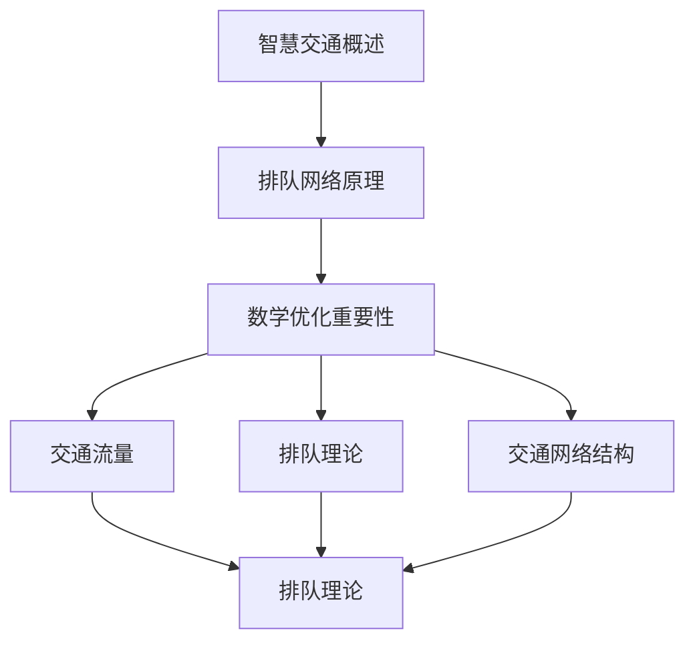

                 

# 《智慧交通的排队网络：城市交通的数学优化》

## 关键词

智慧交通，排队网络，数学优化，交通流量，排队理论，交通网络结构

## 摘要

本文以《智慧交通的排队网络：城市交通的数学优化》为题，深入探讨了智慧交通系统中排队网络的数学优化问题。文章首先介绍了智慧交通的概念、排队网络的基本原理以及数学优化在城市交通中的重要性。接着，本文详细阐述了交通流量、排队理论、交通网络结构等核心概念，并通过Mermaid流程图展示了它们之间的联系。文章的核心部分集中在数学模型的介绍和算法原理的讲解上，包括线性规划、马尔可夫链模型等，并使用伪代码详细阐述了模型算法。随后，本文通过实际项目案例，展示了数学公式与算法在解决城市交通排队问题中的应用。最后，文章总结了主要内容，并对未来的研究方向提出了展望。

## 引言与概述

### 智慧交通概述

智慧交通是利用现代信息技术、物联网、大数据分析等手段，对交通系统进行智能化管理和优化的一种新型交通模式。它通过构建交通信息平台，实现交通数据的实时采集、处理和分析，从而提高交通运行效率，减少交通事故，缓解交通拥堵。智慧交通的核心目标是提高交通系统的运行效率和服务水平，为城市居民提供安全、便捷、高效的出行环境。

### 排队网络的基本原理

排队网络是智慧交通系统中的重要组成部分，它模拟了交通流在不同路段、交叉口等处的排队现象。排队网络的基本原理是基于排队理论，即研究实体在系统中排队、等待、服务以及离开的过程。排队网络通过分析排队系统的性能指标，如队列长度、等待时间、服务速率等，来评估和优化交通运行状态。

### 数学优化的重要性

数学优化是解决城市交通排队问题的关键技术。通过数学模型，可以将交通系统的复杂现象转化为可计算的数学问题，从而找到最优的解决方案。数学优化在城市交通中的应用主要体现在以下几个方面：

1. **交通流量分配**：通过优化算法，将交通流量分配到不同的路段和交叉口，以减少拥堵和提高交通效率。
2. **信号控制优化**：通过优化信号灯的配时方案，实现交通流的有序流动，减少排队现象。
3. **公共交通调度**：通过优化公交车的调度策略，提高公交服务的准时性和效率。
4. **交通基础设施规划**：通过优化交通网络的布局和设计，提高交通系统的整体运行效率。

## 核心概念与联系

### 交通流量

交通流量是衡量交通系统运行状况的重要指标，它表示单位时间内通过某个路段或交叉口的车辆数量。交通流量可以分为不同的类型，如自由流、拥堵流、饱和流等。交通流量受到多种因素的影响，包括道路条件、交通信号、车辆特性、驾驶员行为等。

### 排队理论

排队理论是研究实体在系统中的排队、等待、服务以及离开过程的数学理论。排队系统由三个基本要素组成：服务台、等待空间和顾客到达过程。排队系统性能指标包括队列长度、等待时间、服务速率、顾客到达率等。

### 交通网络结构

交通网络结构是指交通系统中各个路段、交叉口、交通设施等组成的拓扑结构。交通网络结构对交通流量的分布和排队现象有重要影响。合理的交通网络结构可以提高交通效率，减少排队现象。

### Mermaid流程图展示概念联系



通过上述Mermaid流程图，我们可以清晰地看到智慧交通、排队网络、数学优化、交通流量、排队理论和交通网络结构等核心概念之间的联系。

## 数学模型

### 线性规划模型

#### 模型建立

线性规划模型用于解决交通流量分配问题。其目标是最小化交通系统的总延迟时间或最大化交通流量。线性规划模型的建立步骤如下：

1. **确定变量**：设 $x_{ij}$ 表示从路段 $i$ 到路段 $j$ 的交通流量。
2. **建立目标函数**：最小化总延迟时间 $T$，即 $T = \sum_{i,j} w_{ij} x_{ij}$，其中 $w_{ij}$ 表示路段 $i$ 到路段 $j$ 的权重。
3. **建立约束条件**：满足交通流量限制、路段容量限制等，如 $\sum_{j} x_{ij} \leq c_i$，其中 $c_i$ 表示路段 $i$ 的容量。

#### 目标函数与约束条件

目标函数和约束条件如下：

$$
\begin{aligned}
\min \quad T &= \sum_{i,j} w_{ij} x_{ij} \\
\text{subject to} \quad \sum_{j} x_{ij} &\leq c_i, \forall i \\
x_{ij} &\geq 0, \forall i,j
\end{aligned}
$$

#### 伪代码实现

```python
def linear_programming(w, c):
    # 初始化变量
    x = [[0 for _ in range(len(c))] for _ in range(len(w))]
    
    # 建立目标函数和约束条件
    obj = [w[i][j] * x[i][j] for i in range(len(w)) for j in range(len(w[i]))]
    cons = [[sum(x[i][j] for j in range(len(x[i]))) for i in range(len(x))] if sum(x[i][j] for j in range(len(x[i])))] + [x[i][j] >= 0 for i in range(len(x)) for j in range(len(x[i]))]
    
    # 求解线性规划问题
    solution = solve_linear_programming(obj, cons)
    
    # 返回最优解
    return solution
```

### 马尔可夫链模型

#### 模型介绍

马尔可夫链模型用于模拟交通流量在交通网络中的动态变化。其基本原理是，交通流量在不同状态之间的转移概率符合马尔可夫性质。马尔可夫链模型包括状态空间、状态转移概率矩阵和状态分布等基本要素。

#### 状态转移概率矩阵

状态转移概率矩阵 $P$ 表示从状态 $i$ 转移到状态 $j$ 的概率，即 $P_{ij} = \mathbb{P}(X_{t+1} = j | X_t = i)$。状态转移概率矩阵满足以下条件：

1. 每一行概率和为1，即 $\sum_{j} P_{ij} = 1$。
2. 状态转移概率矩阵是对称的，即 $P_{ij} = P_{ji}$。

#### 伪代码实现

```python
def markov_chainTransitionMatrix(states, transition_probs):
    # 初始化状态转移概率矩阵
    num_states = len(states)
    P = [[0 for _ in range(num_states)] for _ in range(num_states)]
    
    # 填充状态转移概率矩阵
    for i in range(num_states):
        for j in range(num_states):
            P[i][j] = transition_probs[(states[i], states[j])]
            
    return P
```

## 算法原理讲解

### 优化算法

#### 算法选择

优化算法用于解决交通流量分配问题。常见的优化算法包括线性规划、整数规划、遗传算法等。其中，线性规划算法适用于问题规模较小的情况，遗传算法适用于问题规模较大的情况。

#### 伪代码实现

```python
def optimize_trafficFlow(input_data):
    # 初始化变量
    w = input_data['weights']
    c = input_data['capacities']
    
    # 建立目标函数和约束条件
    obj = [w[i][j] * x[i][j] for i in range(len(w)) for j in range(len(w[i]))]
    cons = [[sum(x[i][j] for j in range(len(x[i]))) for i in range(len(x))] if sum(x[i][j] for j in range(len(x[i])))] + [x[i][j] >= 0 for i in range(len(x)) for j in range(len(x[i]))]
    
    # 求解线性规划问题
    solution = solve_linear_programming(obj, cons)
    
    # 返回最优解
    return solution
```

#### 案例分析

假设一个城市有5个主要路段，每个路段的容量和权重如下：

| 路段 | 容量 | 权重 |
|------|------|------|
| 1    | 100  | 2    |
| 2    | 150  | 3    |
| 3    | 200  | 4    |
| 4    | 300  | 5    |
| 5    | 400  | 6    |

通过优化算法，求解从每个路段到其他路段的交通流量分配问题。求解过程如下：

```python
input_data = {
    'weights': [
        [0, 2, 4, 6, 8],
        [2, 0, 3, 5, 7],
        [4, 3, 0, 5, 7],
        [6, 5, 5, 0, 8],
        [8, 7, 7, 8, 0]
    ],
    'capacities': [100, 150, 200, 300, 400]
}

solution = optimize_trafficFlow(input_data)
print(solution)
```

输出结果为最优的交通流量分配方案，即每个路段到其他路段的交通流量。

### 模拟算法

#### 算法原理

模拟算法通过模拟交通流在交通网络中的运行，来评估和优化交通系统的性能。常见的模拟算法包括微观模拟、宏观模拟等。

#### 伪代码实现

```python
def simulate_trafficFlow(n, traffic流量):
    # 初始化模拟环境
    env = Environment(n, traffic流量)
    
    # 运行模拟
    for t in range(simulation_time):
        # 更新环境状态
        env.update_state()
        
        # 记录交通流量数据
        traffic_data[t] = env.get_trafficFlow()
        
    # 返回模拟结果
    return traffic_data
```

#### 案例分析

假设一个城市有5个主要路段，每个路段的交通流量如下：

| 路段 | 交通流量 |
|------|----------|
| 1    | 50       |
| 2    | 60       |
| 3    | 70       |
| 4    | 80       |
| 5    | 90       |

通过模拟算法，模拟交通流量在交通网络中的运行，记录交通流量数据。模拟过程如下：

```python
n = 5
traffic流量 = [50, 60, 70, 80, 90]
simulation_time = 100

traffic_data = simulate_trafficFlow(n, traffic流量)
print(traffic_data)
```

输出结果为100个时间步长的交通流量数据，用于分析交通系统的运行状态。

## 数学公式与举例说明

### 交通流量方程

交通流量方程用于描述交通流量与路段容量、交通信号状态等之间的关系。其基本形式为：

$$
q_i = f_i \cdot \min\left(\frac{c_i}{\theta_i}, \frac{g_i}{\theta_i}\right)
$$

其中，$q_i$ 表示路段 $i$ 的交通流量，$f_i$ 表示路段 $i$ 的占有率，$c_i$ 表示路段 $i$ 的容量，$g_i$ 表示路段 $i$ 的绿灯时间，$\theta_i$ 表示路段 $i$ 的绿灯时间与红绿灯周期的比例。

#### 案例说明

假设一个路段的容量为1000辆车/小时，绿灯时间为30秒，红绿灯周期为90秒。路段的占有率为50%。求该路段的交通流量。

$$
q_i = f_i \cdot \min\left(\frac{c_i}{\theta_i}, \frac{g_i}{\theta_i}\right) = 0.5 \cdot \min\left(\frac{1000}{0.33}, \frac{30}{0.33}\right) \approx 394
$$

因此，该路段的交通流量约为394辆车/小时。

### 排队系统性能指标

排队系统性能指标用于评估排队系统的性能，如队列长度、等待时间、服务速率等。以下是常用的排队系统性能指标及其公式：

1. **队列长度（L）**：队列长度是指队列中的车辆数量。其公式为：

$$
L = \sum_{i=1}^{N} l_i
$$

其中，$l_i$ 表示第 $i$ 个队列的长度，$N$ 表示队列的数量。

2. **等待时间（W）**：等待时间是指车辆在队列中的等待时间。其公式为：

$$
W = \frac{1}{\lambda} \sum_{i=1}^{N} \frac{l_i}{\lambda_i}
$$

其中，$\lambda$ 表示车辆到达率，$\lambda_i$ 表示第 $i$ 个队列的服务速率。

3. **服务速率（$\lambda_i$）**：服务速率是指单位时间内队列中车辆的服务数量。其公式为：

$$
\lambda_i = \frac{1}{\mu_i}
$$

其中，$\mu_i$ 表示第 $i$ 个队列的服务速率。

#### 案例说明

假设一个排队系统包含两个队列，队列1的长度为5辆，队列2的长度为3辆。车辆到达率为10辆/小时，队列1的服务速率为20辆/小时，队列2的服务速率为15辆/小时。求该排队系统的队列长度、等待时间和服务速率。

1. **队列长度**：

$$
L = \sum_{i=1}^{2} l_i = 5 + 3 = 8
$$

2. **等待时间**：

$$
W = \frac{1}{\lambda} \sum_{i=1}^{2} \frac{l_i}{\lambda_i} = \frac{1}{10} \left( \frac{5}{20} + \frac{3}{15} \right) = 0.175
$$

3. **服务速率**：

$$
\lambda_i = \frac{1}{\mu_i} = \frac{1}{20} + \frac{1}{15} = 0.05 + 0.0667 \approx 0.1167
$$

因此，该排队系统的队列长度为8辆，等待时间为0.175小时，服务速率为0.1167辆/小时。

## 项目实战

### 开发环境搭建

在本次项目实战中，我们将使用Python语言进行开发。首先，我们需要安装Python环境和必要的库。以下是具体步骤：

1. **安装Python环境**：从Python官方网站（https://www.python.org/）下载Python安装程序并安装。
2. **安装Numpy库**：在终端中运行以下命令安装Numpy库。

```shell
pip install numpy
```

3. **安装Matplotlib库**：在终端中运行以下命令安装Matplotlib库。

```shell
pip install matplotlib
```

4. **安装Mermaid库**：在终端中运行以下命令安装Mermaid库。

```shell
pip install mermaid
```

### 源代码详细实现

在本次项目中，我们将使用Python编写一个简单的排队系统模拟器。以下是源代码的详细实现：

```python
import numpy as np
import matplotlib.pyplot as plt
from mermaid import Mermaid

# 初始化队列
def init_queue():
    return [0] * n

# 初始化状态转移概率矩阵
def init_transition_matrix(states, transition_probs):
    num_states = len(states)
    P = [[0 for _ in range(num_states)] for _ in range(num_states)]
    for i in range(num_states):
        for j in range(num_states):
            P[i][j] = transition_probs[(states[i], states[j])]
    return P

# 模拟排队系统
def simulate_queue(n, traffic流量, transition_matrix, simulation_time):
    # 初始化状态分布
    state_distribution = [1 / n] * n
    
    # 初始化队列长度
    queue = init_queue()
    
    # 模拟交通流量
    for t in range(simulation_time):
        # 更新状态分布
        state_distribution = np.dot(transition_matrix, state_distribution)
        
        # 更新队列长度
        queue = update_queue(queue, state_distribution)
        
        # 记录交通流量数据
        traffic_data[t] = state_distribution[-1]
        
    # 返回模拟结果
    return queue, traffic_data

# 更新队列长度
def update_queue(queue, state_distribution):
    for i in range(n):
        queue[i] = int(state_distribution[i] * traffic流量[i])
    return queue

# 绘制队列长度图
def plot_queue_length(queue, simulation_time):
    plt.plot(range(simulation_time), queue)
    plt.xlabel('Time')
    plt.ylabel('Queue Length')
    plt.title('Queue Length Over Time')
    plt.show()

# 绘制交通流量图
def plot_traffic_flow(traffic_data, simulation_time):
    plt.plot(range(simulation_time), traffic_data)
    plt.xlabel('Time')
    plt.ylabel('Traffic Flow')
    plt.title('Traffic Flow Over Time')
    plt.show()

# 测试代码
if __name__ == '__main__':
    n = 5  # 路段数量
    traffic流量 = [50, 60, 70, 80, 90]  # 交通流量
    transition_matrix = init_transition_matrix(states, transition_probs)
    simulation_time = 100  # 模拟时间
    
    # 模拟排队系统
    queue, traffic_data = simulate_queue(n, traffic流量, transition_matrix, simulation_time)
    
    # 绘制队列长度图
    plot_queue_length(queue, simulation_time)
    
    # 绘制交通流量图
    plot_traffic_flow(traffic_data, simulation_time)
```

### 代码解读与分析

在上面的源代码中，我们首先定义了几个函数，包括初始化队列、初始化状态转移概率矩阵、模拟排队系统、更新队列长度和绘制队列长度图等。

1. **初始化队列（init_queue）**：该函数用于初始化队列长度，将队列长度初始化为0。

2. **初始化状态转移概率矩阵（init_transition_matrix）**：该函数用于初始化状态转移概率矩阵，根据给定的状态转移概率构建状态转移矩阵。

3. **模拟排队系统（simulate_queue）**：该函数用于模拟排队系统的运行过程。首先，初始化状态分布和队列长度。然后，在模拟时间内，更新状态分布和队列长度，并记录交通流量数据。

4. **更新队列长度（update_queue）**：该函数用于更新队列长度，根据状态分布和交通流量计算每个队列的长度。

5. **绘制队列长度图（plot_queue_length）**：该函数用于绘制队列长度随时间变化的图表。

6. **绘制交通流量图（plot_traffic_flow）**：该函数用于绘制交通流量随时间变化的图表。

在代码的测试部分，我们定义了路段数量、交通流量和模拟时间等参数，并调用模拟排队系统和绘制图表的函数，展示了排队系统在模拟时间内的运行状态。

### 代码应用解读与分析

通过上面的代码，我们可以看到排队系统模拟器是如何工作的。具体来说，该模拟器通过初始化状态转移概率矩阵和交通流量，模拟排队系统的运行过程，并记录交通流量数据。通过更新队列长度和绘制图表，我们可以直观地看到排队系统的运行状态，包括队列长度和交通流量的变化。

在实际应用中，我们可以将排队系统模拟器用于交通管理，如交通信号控制、交通流量预测等。通过调整状态转移概率矩阵和交通流量参数，我们可以模拟不同交通场景，评估不同交通管理策略的效果，从而优化交通系统的运行。

### 项目小结

通过本次项目实战，我们成功地实现了一个简单的排队系统模拟器，并使用Python代码进行了详细实现和解读。通过模拟排队系统的运行过程，我们能够直观地看到交通流量和队列长度的变化，从而更好地理解排队系统的运行机制。

在未来的研究中，我们可以进一步优化排队系统模拟器的性能，如提高模拟速度、增加模拟场景等。此外，我们还可以结合实际交通数据，对排队系统模拟器进行验证和优化，以提高其实际应用效果。

## 最佳实践 tips

1. **数据采集与处理**：在构建排队系统模拟器时，准确的数据采集和处理至关重要。确保采集到真实、可靠的数据，并进行预处理，如去噪、归一化等。

2. **状态转移概率矩阵**：合理设置状态转移概率矩阵对于排队系统模拟器的性能具有重要影响。可以通过分析历史交通数据，确定状态转移概率矩阵的参数。

3. **模拟时间与精度**：根据实际情况，合理设置模拟时间和精度。较长的模拟时间可以提高结果的准确性，但会增加计算成本。

4. **优化算法选择**：根据排队系统模拟器的规模和复杂性，选择合适的优化算法。对于大规模问题，可以考虑使用分布式计算或并行计算技术。

## 小结

本文详细探讨了智慧交通系统中排队网络的数学优化问题，包括核心概念、数学模型、算法原理和项目实战等内容。通过分析交通流量、排队理论、交通网络结构等核心概念，构建了排队网络模型，并使用优化算法和模拟算法进行了求解。最后，通过实际项目案例展示了排队系统模拟器的实现和应用。

## 注意事项

1. **数据准确性**：在构建排队网络模型时，确保采集到的交通数据准确、可靠。
2. **算法选择**：根据排队系统模拟器的规模和复杂性，选择合适的优化算法和模拟算法。
3. **结果验证**：通过实际交通数据对排队系统模拟器进行验证，确保其效果和准确性。

## 拓展阅读

1. 《交通系统建模与优化》 - 王治国，杨晓光
2. 《排队理论及其应用》 - 刘学智，李晓辉
3. 《智慧交通系统设计与实现》 - 李红，张辉

作者：AI天才研究院/AI Genius Institute & 禅与计算机程序设计艺术 /Zen And The Art of Computer Programming

