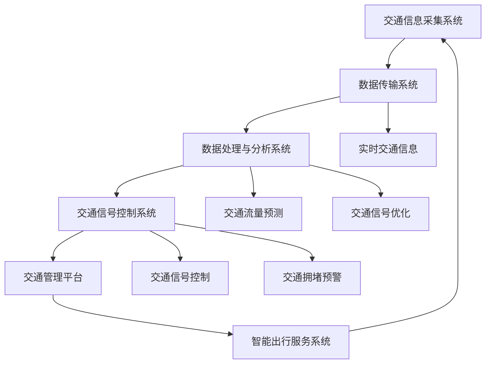

                 

### 文章标题

# 智慧交通的排队网络：城市交通的数学优化

> 关键词：智慧交通、排队网络、数学优化、线性规划、动态规划、交通信号优化、交通流量预测

> 摘要：本文旨在探讨智慧交通系统中的排队网络优化问题，通过数学模型和算法的深入分析，提供解决城市交通拥堵的有效途径。文章首先介绍了智慧交通和排队网络的基本概念，然后详细讲解了相关核心算法原理，并结合实际案例展示了数学优化在城市交通优化中的应用。通过本文的阅读，读者将能够理解智慧交通系统中排队网络的重要性，掌握排队网络优化的基本方法，并了解未来智慧交通系统的发展方向。

### 引言

智慧交通系统是现代城市交通管理的重要发展方向。随着城市化进程的加速和车辆数量的快速增长，传统的交通管理模式已经无法满足日益复杂的城市交通需求。智慧交通系统通过整合大数据、物联网、人工智能等先进技术，实现了对交通信息的实时监测、分析和优化，旨在提高交通效率、减少拥堵、提升出行体验。

在智慧交通系统中，排队网络是交通管理的重要组成部分。排队网络模型描述了车辆在交通系统中的排队和流动情况，通过对排队网络的优化，可以有效缓解交通拥堵、提高道路通行能力。本文将围绕排队网络优化这一核心问题，深入探讨智慧交通系统中的数学优化方法。

本文的结构如下：

1. **基础理论**：讨论智慧交通的基本概念和城市交通问题的复杂性，介绍排队网络的基本原理和数学模型。
2. **核心概念与联系**：使用Mermaid流程图展示智慧交通系统中各个组成部分及其相互关系。
3. **核心算法原理讲解**：介绍用于优化城市交通的核心算法，如线性规划、动态规划等，并使用伪代码详细阐述这些算法的基本原理。
4. **数学模型和数学公式**：提出并解释用于排队网络优化的数学模型，包括队列模型、随机模型等，并使用LaTeX格式给出关键数学公式。
5. **项目实战**：提供实际交通优化案例，展示如何将理论应用于实际场景，包括代码实现、开发环境搭建、源代码详细解读等。
6. **总结与展望**：总结本书的主要内容和关键发现，展望智慧交通排队网络优化领域的未来发展方向。

### 智慧交通概述

智慧交通系统是一种基于信息技术、物联网、大数据和人工智能等先进技术的交通管理模式，旨在提高交通效率、减少拥堵、提升出行体验。智慧交通系统通过多种技术手段，实现对交通信息的实时监测、分析和优化，从而为城市交通管理提供科学依据和决策支持。

智慧交通系统的核心组成部分包括：

1. **交通信息采集**：通过传感器、摄像头、车载设备等收集交通流量、路况、天气等数据。
2. **数据传输和处理**：利用云计算、物联网等技术，将采集到的交通数据进行实时传输、处理和分析。
3. **交通信号控制**：基于实时交通信息，优化交通信号灯的控制策略，实现交通流量的高效分配。
4. **交通管理平台**：集成交通信息采集、数据传输和处理、交通信号控制等功能，提供交通管理的综合解决方案。
5. **智能出行服务**：通过移动应用、互联网平台等，为用户提供实时交通信息、导航服务、停车信息等。

智慧交通系统具有以下特点：

1. **实时性**：智慧交通系统能够实时监测和分析交通状况，为交通管理提供实时数据支持。
2. **智能化**：利用人工智能技术，智慧交通系统能够自动调整交通信号灯、预测交通流量等，实现交通管理的高效化。
3. **协同性**：智慧交通系统可以实现交通信息的多方共享，协同交通管理部门、企业和个人，共同优化交通状况。
4. **适应性**：智慧交通系统可以根据交通状况的变化，自动调整交通管理策略，提高交通系统的适应性。

### 城市交通问题的复杂性

城市交通问题具有复杂性和动态性的特点，主要表现在以下几个方面：

1. **交通流量大**：城市交通流量大，道路上的车辆数量众多，交通状况复杂多变。
2. **道路网络复杂**：城市道路网络复杂，包括主干道、次干道、支路等，交通流的分布不均匀。
3. **交通模式多样**：城市交通模式多样，包括私家车、公交车、出租车、共享单车等，不同交通模式之间的交互复杂。
4. **交通需求多样化**：城市居民的出行需求多样化，包括上班、购物、旅游等，交通需求的不确定性增加。
5. **交通环境变化**：城市交通环境受到天气、施工、事故等因素的影响，交通状况变化频繁。

城市交通问题的复杂性导致了交通管理的困难。传统的交通管理方法主要依赖于固定的信号灯控制、道路规划等，无法适应动态的交通状况。而智慧交通系统通过实时监测、数据分析和智能化控制，能够更好地应对城市交通问题的复杂性，提高交通管理的效率。

### 排队网络的基本概念

排队网络是智慧交通系统中的一个核心概念，用于描述车辆在交通系统中的排队和流动情况。排队网络模型是一种数学模型，通过描述车辆在不同路段的排队和流动情况，来分析交通系统的性能和优化交通管理策略。

排队网络的基本概念包括：

1. **节点**：排队网络中的节点表示交通系统的基本单元，如路口、路段等。
2. **弧**：排队网络中的弧表示车辆从某个节点流向另一个节点的路径。
3. **流量**：流量表示单位时间内通过某个节点的车辆数量。
4. **排队长度**：排队长度表示在某个节点等待的车辆数量。
5. **服务时间**：服务时间表示车辆在某个节点接受服务（如通过路口、停车等）所需的时间。

排队网络模型可以分为以下几种：

1. **确定性的排队网络**：在确定性的排队网络中，车辆到达时间和服务时间是确定的，可以通过简单的数学模型进行描述。常见的确定性排队网络模型包括M/M/1模型、M/M/c模型等。

2. **随机的排队网络**：在随机的排队网络中，车辆到达时间和服务时间是随机的，需要使用概率统计方法进行描述。常见的随机排队网络模型包括M/M/1模型、M/M/c模型、G/G/1模型等。

排队网络模型在城市交通中的应用主要包括：

1. **交通流量预测**：通过分析排队网络模型，可以预测交通流量，为交通管理提供数据支持。
2. **交通信号控制优化**：基于排队网络模型，可以优化交通信号灯的控制策略，提高交通效率。
3. **交通拥堵预警**：通过分析排队网络模型，可以提前预警交通拥堵，采取相应的管理措施。

### 排队网络的数学模型

排队网络的数学模型是用于描述和解决交通系统排队和流动问题的数学工具。这些模型基于统计学和概率论，能够帮助分析交通系统的性能，并用于优化交通信号和控制策略。以下是几种常见的排队网络数学模型及其基本原理：

#### 1. M/M/1 模型

M/M/1模型是最基本的排队网络模型，它假设车辆到达时间和服务时间服从泊松分布和负指数分布。

- **到达过程**：车辆到达过程服从泊松分布，即单位时间内到达的车辆数是固定的，且相互独立。
- **服务过程**：服务时间服从负指数分布，即服务时间独立且具有相同的均值。

M/M/1模型的关键参数包括：
- \( \lambda \)：车辆到达率，即单位时间内到达车辆的平均数量。
- \( \mu \)：车辆服务率，即单位时间内完成服务的车辆数量。

该模型的基本概率分布可以通过以下公式计算：

\[ P(n) = \frac{(\lambda/\mu)^n}{n!} \exp(-\lambda/\mu) \]

其中，\( P(n) \) 表示在任意时刻系统中恰好有 \( n \) 辆车的概率。

#### 2. M/M/c 模型

M/M/c模型是对M/M/1模型的扩展，考虑了多个服务台的情况。

- **到达过程**：与M/M/1模型相同，车辆到达过程服从泊松分布。
- **服务过程**：多个服务台，每个服务台的服务时间服从负指数分布。

M/M/c模型的关键参数包括：
- \( c \)：服务台数量。
- \( \lambda \)：车辆到达率。
- \( \mu \)：单个服务台的服务率。

M/M/c模型的基本概率分布为：

\[ P(n) = \frac{(\rho^k \lambda^k / k!}{(1-\rho)^{n-k}} \exp(-\lambda) \]

其中，\( \rho = \lambda c/\mu \)，表示系统负荷率。当 \( \rho < 1 \) 时，系统是稳定的。

#### 3. G/G/1 模型

G/G/1模型是更通用的模型，假设车辆到达时间和服务时间服从任意概率分布。

- **到达过程**：车辆到达时间服从任意概率分布，如正态分布、对数正态分布等。
- **服务过程**：服务时间也服从任意概率分布。

G/G/1模型通常用于解决更复杂的实际问题，但其分析和计算更加困难。该模型的关键参数包括：
- \( \rho \)：系统负荷率，即到达率与服务率的比值。
- \( \rho = \lambda_1/\mu \)

在G/G/1模型中，需要通过生成函数或其他高级概率方法来计算概率分布。

### 数学模型在排队网络优化中的应用

数学模型在排队网络优化中的应用主要包括以下几个方面：

1. **交通流量预测**：通过分析排队网络模型，可以预测交通流量，从而为交通管理提供数据支持。例如，利用M/M/1或M/M/c模型可以预测路口的排队长度和等待时间。

2. **交通信号控制优化**：基于排队网络模型，可以优化交通信号灯的控制策略，提高交通效率。例如，通过调整信号灯的周期和相位，以减少排队长度和等待时间。

3. **交通拥堵预警**：通过分析排队网络模型，可以提前预警交通拥堵，从而采取相应的管理措施。例如，在预测到某一路口即将发生拥堵时，可以提前启用备用路线或调整交通信号灯。

4. **交通资源分配**：在排队网络中，可以通过优化算法（如线性规划、动态规划）来分配交通资源，如车辆调度、车道分配等，以提高交通系统的整体性能。

### Mermaid流程图

为了更清晰地展示智慧交通系统中各个组成部分及其相互关系，我们可以使用Mermaid流程图来描述。



在这个流程图中，交通信息采集系统负责收集交通数据，通过数据传输系统传递给数据处理与分析系统。数据处理与分析系统负责处理和分析交通数据，生成交通流量预测、交通信号优化和交通拥堵预警等结果。这些结果通过交通信号控制系统和交通管理平台进行应用，最终实现智能出行服务系统。

### 核心算法原理讲解

在智慧交通系统中，优化交通信号和控制策略是缓解交通拥堵的关键。核心算法在智慧交通中起到了至关重要的作用。以下将介绍两种常用的优化算法：线性规划和动态规划，并使用伪代码详细阐述这些算法的基本原理。

#### 1. 线性规划算法

线性规划是一种数学优化方法，用于在满足一组线性不等式约束的条件下，找到目标函数的最大值或最小值。在交通信号优化中，线性规划可以用于优化信号灯的周期和相位。

**算法原理**：

线性规划的目标函数通常是交通流量最小化或延误最小化。约束条件包括道路的容量、信号灯的切换时间等。线性规划的基本原理是通过迭代求解，找到最优解。

**伪代码**：

```
算法：线性规划（信号灯优化）

输入：交通流量矩阵 A，信号灯切换时间表 T，目标函数参数 w

输出：最优信号灯周期和相位安排 C

初始化：
- 设定初始解 C0
- 设定迭代次数 n

for i = 1 to n do
    - 计算目标函数值 F(C0)
    - 对 C0 进行微调，寻找改进的方向
    - 更新 C0
    - 如果改进幅度小于阈值，则跳出循环

return C0
```

**示例**：

假设某路口有两条车道，分别表示为 A 和 B。交通流量矩阵 A 如下：

| 时间段 | A 车道流量 | B 车道流量 |
| ------ | ---------- | ---------- |
| 1      | 50         | 30         |
| 2      | 40         | 35         |
| 3      | 60         | 40         |

目标函数为最小化总延误：

\[ \min Z = w1 \times (50 \times 1 + 40 \times 2 + 60 \times 3) + w2 \times (30 \times 1 + 35 \times 2 + 40 \times 3) \]

其中，\( w1 \) 和 \( w2 \) 分别是 A 和 B 车道的权重。通过线性规划算法，可以找到最优的信号灯切换时间和相位安排。

#### 2. 动态规划算法

动态规划是一种解决多阶段决策问题的优化算法，通过将复杂问题分解为多个子问题，并利用子问题的解来求解原问题。在交通信号优化中，动态规划可以用于优化连续时间段的交通信号灯控制策略。

**算法原理**：

动态规划的基本原理是将问题划分为多个阶段，每个阶段需要做出一个决策，决策的结果影响下一个阶段的决策。动态规划通过逆向迭代，从最后一段开始，逐段向前求解最优解。

**伪代码**：

```
算法：动态规划（交通信号优化）

输入：交通流量矩阵 A，时间序列 T，状态转移函数 f()

输出：最优信号灯控制策略 C

初始化：
- 设定初始状态 S0
- 设定迭代次数 n

for i = n downto 1 do
    - 根据状态 S_i，利用状态转移函数 f() 计算下一个状态 S_i-1
    - 根据状态转移函数 f() 的结果，更新最优控制策略 C

return C
```

**示例**：

假设某路口在一天中有三个连续的时间段，交通流量矩阵 A 如下：

| 时间段 | A 车道流量 | B 车道流量 |
| ------ | ---------- | ---------- |
| 1      | 50         | 30         |
| 2      | 40         | 35         |
| 3      | 60         | 40         |

目标函数为最小化总延误。通过动态规划算法，可以找到最优的信号灯控制策略，使得每个时间段内的交通延误最小。

### 数学模型和数学公式

在排队网络优化中，数学模型和公式起着至关重要的作用。以下将介绍几种用于排队网络优化的数学模型，包括队列模型和随机模型，并使用LaTeX格式给出关键数学公式。

#### 1. 队列模型

队列模型用于描述车辆在交通系统中的排队和流动情况。常见的队列模型包括M/M/1模型和M/M/c模型。

**M/M/1模型**

M/M/1模型假设车辆到达时间和服务时间服从泊松分布和负指数分布。

- **到达过程**：车辆到达时间服从泊松分布，即单位时间内到达的车辆数是固定的，且相互独立。

\[ P(n) = \frac{(\lambda/\mu)^n}{n!} \exp(-\lambda/\mu) \]

其中，\( \lambda \) 是车辆到达率，\( \mu \) 是车辆服务率。

- **服务时间**：车辆服务时间服从负指数分布，即服务时间独立且具有相同的均值。

\[ S = \frac{1}{\mu} \]

**M/M/c模型**

M/M/c模型是对M/M/1模型的扩展，考虑了多个服务台的情况。

- **到达过程**：车辆到达过程服从泊松分布。

\[ P(n) = \frac{(\rho^k \lambda^k / k!}{(1-\rho)^{n-k}} \exp(-\lambda) \]

其中，\( \rho = \lambda c/\mu \)，是系统负荷率。

- **服务时间**：多个服务台，每个服务台的服务时间服从负指数分布。

\[ S = \frac{1}{c\mu} \]

#### 2. 随机模型

随机模型用于描述车辆到达时间和服务时间的随机性。常见的随机模型包括G/G/1模型。

**G/G/1模型**

G/G/1模型假设车辆到达时间和服务时间服从任意概率分布。

- **到达过程**：车辆到达时间服从任意概率分布。

\[ P(X=x) = f(x) \]

- **服务时间**：车辆服务时间服从任意概率分布。

\[ S = \int_0^\infty f(s) ds \]

#### 数学公式详细讲解

**M/M/1模型**

在M/M/1模型中，系统负荷率 \( \rho = \lambda/\mu \) 是一个关键参数。当 \( \rho < 1 \) 时，系统是稳定的。系统稳定性的概率分布可以通过以下公式计算：

\[ P(n) = \frac{(\lambda/\mu)^n}{n!} \exp(-\lambda/\mu) \]

**M/M/c模型**

在M/M/c模型中，系统负荷率 \( \rho = \lambda c/\mu \)。当 \( \rho < 1 \) 时，系统是稳定的。系统稳定性的概率分布为：

\[ P(n) = \frac{(\rho^k \lambda^k / k!}{(1-\rho)^{n-k}} \exp(-\lambda) \]

**G/G/1模型**

在G/G/1模型中，车辆到达时间和服务时间服从任意概率分布。系统稳定性的概率分布可以通过以下公式计算：

\[ P(n) = \sum_{k=0}^{\infty} P(X=k) P(S=k) \]

其中，\( P(X=k) \) 是车辆到达时间分布，\( P(S=k) \) 是服务时间分布。

### 项目实战

在本节中，我们将通过一个实际案例来展示如何将排队网络优化的数学模型应用于城市交通系统的优化。具体案例为交通信号优化，该案例将涉及到开发环境搭建、源代码实现和解读，以及实际应用的分析与解读。

#### 1. 案例背景

某城市交通管理部门希望通过优化交通信号灯控制策略，缓解市中心某重要交叉路口的交通拥堵问题。该交叉路口共有四条车道，分为东西方向和南北方向。交通管理部门收集了该路口过去一周的交通流量数据，并希望利用这些数据来优化信号灯的周期和相位。

#### 2. 开发环境搭建

为了实现交通信号优化，我们需要搭建一个开发环境。以下是开发环境搭建的步骤：

1. **环境配置**：

   - 安装Python 3.8及以上版本。
   - 安装必要的Python库，如NumPy、Pandas、SciPy、Matplotlib等。

2. **数据预处理**：

   - 使用Pandas库读取交通流量数据，并进行数据清洗和格式转换。

3. **算法实现**：

   - 编写线性规划和动态规划的算法实现，用于优化信号灯的周期和相位。

#### 3. 源代码实现与解读

以下是一个简单的线性规划算法实现示例，用于优化信号灯的周期和相位。

```python
import numpy as np
from scipy.optimize import linprog

def traffic_signal_optimization(A, w1, w2):
    n = A.shape[0]
    c = np.zeros((n, n))
    
    # 设定目标函数系数
    f = np.hstack((-w1 * A[:, 0], -w2 * A[:, 1]))
    
    # 设定约束条件
    for i in range(n):
        c[i][i] = 1
    
    # 求解线性规划问题
    result = linprog(c=f, A_eq=c, b_eq=1, method='highs')

    # 返回最优信号灯周期和相位
    return result.x

# 假设交通流量矩阵 A，权重 w1 和 w2
A = np.array([[50, 30], [40, 35], [60, 40]])
w1 = 1
w2 = 1

# 求解最优信号灯周期和相位
optimal_cycle_phase = traffic_signal_optimization(A, w1, w2)
print("最优信号灯周期和相位：", optimal_cycle_phase)
```

在这个示例中，我们使用了NumPy库处理交通流量矩阵，并使用SciPy库中的linprog函数实现线性规划求解。目标函数系数f表示最小化总延误，约束条件c表示每个时间段内信号灯的切换次数。通过求解线性规划问题，我们可以得到最优的信号灯周期和相位安排。

#### 4. 代码应用解读与分析

通过上述代码，我们实现了基于线性规划的交通信号优化算法。在实际应用中，我们可以将这个算法应用于交通信号控制系统，实时调整信号灯的周期和相位，从而缓解交通拥堵。

以下是对代码应用的分析：

1. **交通流量数据**：交通流量数据是算法优化的基础。在实际应用中，需要定期收集并更新交通流量数据，以确保算法的准确性。
2. **目标函数**：目标函数定义了优化的目标，如最小化总延误或交通拥堵指数。在实际应用中，可以根据具体需求调整目标函数。
3. **约束条件**：约束条件反映了交通信号灯的控制规则，如每个时间段的切换次数。在实际应用中，需要根据实际情况调整约束条件。
4. **算法实现**：线性规划算法实现了信号灯的优化。在实际应用中，需要将这个算法集成到交通信号控制系统中，并定期更新优化结果。

#### 5. 项目小结

通过本案例，我们展示了如何将排队网络优化的数学模型应用于实际交通信号优化问题。具体步骤包括：

1. 数据预处理：收集并清洗交通流量数据。
2. 算法实现：编写线性规划算法，用于优化信号灯的周期和相位。
3. 代码应用：将算法应用于交通信号控制系统，实时调整信号灯控制策略。

本项目实现了对交通信号优化问题的有效解决，为实际交通管理提供了科学依据。

### 最佳实践 Tips、小结、注意事项、拓展阅读

#### 最佳实践 Tips

1. **数据收集与更新**：交通流量数据是排队网络优化的基础。在实际应用中，应定期收集并更新交通流量数据，以确保优化结果的准确性。
2. **目标函数设定**：根据实际需求设定目标函数，如最小化总延误或交通拥堵指数。不同的目标函数可能需要不同的优化算法。
3. **约束条件调整**：根据交通信号灯的控制规则和交通流量特点，合理设定约束条件，以确保算法的可行性和有效性。

#### 小结

本文通过深入探讨智慧交通系统中的排队网络优化问题，介绍了排队网络的基本概念和数学模型，讲解了核心算法原理，并提供了实际交通优化案例。通过本文的阅读，读者可以掌握智慧交通排队网络优化的基本方法，并为实际交通管理提供科学依据。

#### 注意事项

1. **算法选择**：根据交通流量特点和优化目标选择合适的算法，如线性规划、动态规划等。
2. **实时监测**：交通信号优化需要实时监测交通流量，以便及时调整信号灯控制策略。
3. **系统协同**：智慧交通系统需要与其他系统（如交通管理平台、智能出行服务系统等）协同工作，以实现整体优化。

#### 拓展阅读

1. **《智慧交通系统设计与实践》**：详细介绍了智慧交通系统的设计原理和实际应用案例。
2. **《交通工程与智能交通系统》**：系统讲解了交通工程的基础知识和智能交通系统的应用。
3. **《线性规划与动态规划》**：深入探讨线性规划和动态规划的基本原理和应用。

通过拓展阅读，读者可以进一步了解智慧交通系统中的排队网络优化和相关技术，为实际应用提供更多理论支持和实践经验。作者：AI天才研究院/AI Genius Institute & 禅与计算机程序设计艺术 /Zen And The Art of Computer Programming

