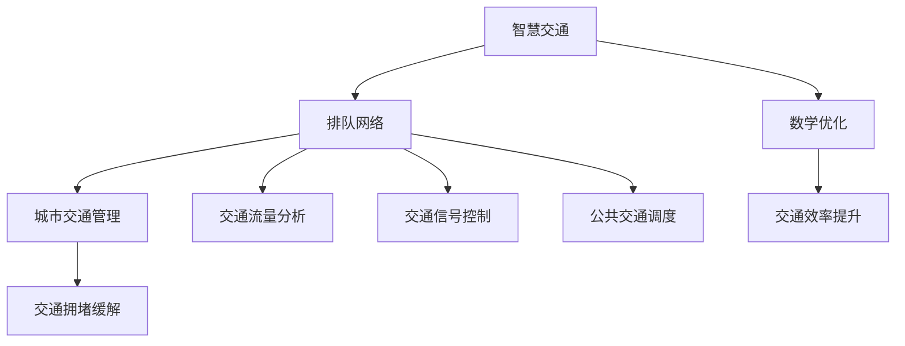

                 

# 文章标题：智慧交通的排队网络：城市交通的数学优化

> 关键词：智慧交通、排队网络、数学优化、交通效率、城市交通管理

> 摘要：本文详细探讨了智慧交通中的排队网络及其数学优化方法。通过分析排队网络的基本概念、理论基础、优化模型及实践应用，旨在为城市交通管理提供有效的优化策略，提升交通效率，缓解交通拥堵。

## 《智慧交通的排队网络：城市交通的数学优化》目录大纲

### 第一部分：引论

#### 第1章 智慧交通概述

#### 第2章 排队网络在智慧交通中的重要性

#### 第3章 数学优化在智慧交通中的应用

### 第二部分：排队网络的理论基础

#### 第4章 流量与排队模型

#### 第5章 排队系统的性能指标

#### 第6章 数学优化方法在排队系统中的应用

### 第三部分：智慧交通中的排队网络优化

#### 第7章 城市交通排队网络优化模型

#### 第8章 城市交通排队网络优化的算法

#### 第9章 城市交通排队网络优化的案例分析

### 第四部分：智慧交通排队网络优化实践

#### 第10章 智慧交通排队网络优化的实施策略

#### 第11章 城市交通排队网络优化的案例研究

#### 第12章 智慧交通排队网络优化的挑战与展望

#### 第13章 智慧交通排队网络优化技术在城市交通管理中的应用

### 附录

#### 附录A：常用数学模型与算法

#### 附录B：参考资源与进一步阅读

## 第一部分：引论

### 第1章 智慧交通概述

智慧交通是现代社会信息化和智能化发展的产物，它利用现代信息技术、物联网、大数据和人工智能等技术手段，对交通系统进行全方位的优化和管理，以提高交通效率、减少交通拥堵、提升交通安全性。智慧交通系统的建立，不仅有助于缓解城市交通压力，还能为市民提供更加便捷、高效的出行服务。

#### 1.1 智慧交通的背景与发展

**交通问题的挑战：** 随着城市化和机动化进程的加速，城市交通面临着前所未有的挑战。交通拥堵、交通事故、环境污染等问题日益严重，传统交通管理手段已经难以满足现代城市交通的需求。

**智慧交通的定义与目标：** 智慧交通是指利用现代信息技术和智能化手段，对交通系统进行全面的优化和管理，以提高交通效率、减少交通拥堵、提升交通安全性。智慧交通的目标是实现交通系统的智能调度、智能监控、智能管理和智能服务。

**智慧交通的国内外发展现状：** 当前，国内外许多城市都在积极推进智慧交通的建设。例如，美国、欧洲等地的一些城市已经建立了较为完善的智慧交通系统，而中国也在智慧交通领域取得了显著的进展。

#### 1.2 排队网络在智慧交通中的重要性

排队网络是智慧交通系统中一个重要的组成部分，它反映了交通流在不同节点（如交叉口、路段等）之间的流动情况。排队网络的重要性主要体现在以下几个方面：

**排队网络的基本概念：** 排队网络是指由多个节点（如交叉口、路段等）和连接这些节点的有向边组成的网络结构，其中节点表示交通流的汇聚点，有向边表示交通流的流动方向。

**排队网络在城市交通中的应用：** 排队网络在交通流分析、交通信号控制、交通需求管理等方面具有广泛的应用。通过排队网络模型，可以预测交通流量变化、评估交通系统的性能，从而为交通管理提供科学依据。

**排队网络对交通效率的影响：** 排队网络的存在会影响交通流的流畅性，导致交通拥堵、延误等问题。优化排队网络结构，可以提高交通效率，减少交通拥堵，从而提高城市交通系统的整体性能。

#### 1.3 数学优化在智慧交通中的应用

数学优化是智慧交通系统中的一个重要工具，它利用数学建模和算法优化技术，对交通系统进行优化和控制。数学优化在智慧交通中的应用主要包括以下几个方面：

**数学优化的基本原理：** 数学优化旨在通过建立数学模型，利用优化算法，找到最优或近似最优的解，以实现特定目标。常见的数学优化方法包括线性规划、动态规划、随机规划等。

**数学优化在城市交通优化中的应用：** 数学优化在城市交通优化中的应用非常广泛，包括交通信号控制、交通流量分配、公共交通调度等。通过数学优化，可以有效地提高交通效率、减少交通拥堵、提升交通安全性。

**数学优化对交通管理决策的支持：** 数学优化可以为交通管理决策提供科学依据，帮助交通管理部门制定更加合理的交通管理策略，从而提高交通系统的整体性能。

## 第二部分：排队网络的理论基础

### 第2章 流量与排队模型

排队网络理论是研究交通流在排队系统中流动和排队的数学模型。通过建立流量与排队模型，可以分析交通流在不同节点（如交叉口、路段等）之间的流动情况，为排队网络优化提供理论支持。

#### 2.1 基本流量模型

**基本流量模型** 是描述交通流量在不同节点之间流动的数学模型。常见的流量模型包括流量平衡方程、流量分布模型等。

**流量平衡方程：** 流量平衡方程描述了在某个节点处，流入流量等于流出流量。具体来说，设节点i的流入流量为\( f_i \)，流出流量为\( g_i \)，则有 \( f_i = g_i \)。

**流量分布模型：** 流量分布模型描述了交通流在不同节点之间的分布情况。常见的流量分布模型包括泊松分布、正态分布等。

#### 2.2 常见的排队模型

**常见的排队模型** 是研究交通流在排队系统中排队的数学模型。常见的排队模型包括M/M/1模型、M/M/c模型、M/G/1模型等。

**M/M/1模型：** M/M/1模型是最简单的排队模型，其中M表示泊松分布，1表示一个服务台。该模型适用于描述单个服务台系统中的排队现象。

**M/M/c模型：** M/M/c模型是M/M/1模型的扩展，其中c表示多个服务台。该模型适用于描述多个服务台系统中的排队现象。

**M/G/1模型：** M/G/1模型是M/M/1模型的另一个扩展，其中G表示一般分布，用于描述服务时间的分布。该模型适用于描述服务时间具有一般分布的系统中的排队现象。

#### 2.3 流量与排队模型的关系

**流量与排队模型的关系** 可以通过流量平衡方程和服务水平指标来描述。流量平衡方程反映了交通流在不同节点之间的流动关系，而服务水平指标反映了排队系统的性能。

**服务水平指标：** 常见的服务水平指标包括系统利用率、队列长度、等待时间等。系统利用率表示服务台被占用的比例，队列长度表示排队等待的车辆数量，等待时间表示车辆在系统中等待的时间。

通过流量与排队模型，可以分析交通流在不同节点之间的流动情况，为排队网络优化提供理论支持。

### 第3章 排队系统的性能指标

排队系统的性能指标是评估排队系统性能的重要标准，主要包括服务水平指标、队列长度指标和等待时间指标。这些指标能够帮助交通管理部门了解排队系统的运行状况，从而制定更加科学的交通管理策略。

#### 3.1 服务水平指标

服务水平指标是衡量排队系统服务质量的重要指标，主要包括系统利用率和服务水平。

**系统利用率：** 系统利用率是指服务台被占用的比例，通常用利用率 \( \rho \) 表示。当 \( \rho = 1 \) 时，表示服务台总是被占用，即系统处于饱和状态；当 \( \rho = 0 \) 时，表示服务台总是空闲，即系统处于空闲状态。

**服务水平：** 服务水平是指在一定时间内，车辆能够得到服务的概率。服务水平通常用 \( p_s \) 表示，其计算公式为 \( p_s = 1 - \rho \)。当 \( \rho \) 较小时，服务水平较高，即车辆得到服务的概率较大；当 \( \rho \) 较大时，服务水平较低，即车辆得到服务的概率较小。

#### 3.2 队列长度指标

队列长度指标是衡量排队系统中车辆排队等待情况的指标，主要包括队列长度和平均队列长度。

**队列长度：** 队列长度是指在一定时间内，排队等待的车辆数量。队列长度通常用 \( L_q \) 表示。

**平均队列长度：** 平均队列长度是指在一定时间内，队列长度的平均值。平均队列长度通常用 \( \bar{L}_q \) 表示。

平均队列长度的计算公式为：

\[ \bar{L}_q = \frac{1}{\lambda} \sum_{t=0}^{T} L_q(t) \]

其中，\( \lambda \) 表示车辆到达率，\( L_q(t) \) 表示在时间 \( t \) 时的队列长度，\( T \) 表示观测时间。

#### 3.3 等待时间指标

等待时间指标是衡量排队系统中车辆等待情况的指标，主要包括等待时间和平均等待时间。

**等待时间：** 等待时间是指车辆在排队系统中等待的时间。等待时间通常用 \( W_q \) 表示。

**平均等待时间：** 平均等待时间是指在一定时间内，车辆等待时间的平均值。平均等待时间通常用 \( \bar{W}_q \) 表示。

平均等待时间的计算公式为：

\[ \bar{W}_q = \frac{1}{N} \sum_{i=1}^{N} W_q(i) \]

其中，\( N \) 表示观测时间内进入排队系统的车辆数量，\( W_q(i) \) 表示第 \( i \) 辆车辆的等待时间。

通过这些性能指标，交通管理部门可以评估排队系统的运行状况，为排队网络优化提供依据。接下来，我们将介绍数学优化方法在排队系统中的应用。

### 第4章 数学优化方法在排队系统中的应用

数学优化方法在排队系统中的应用主要包括线性规划、动态规划和随机规划等方法。这些方法能够帮助交通管理部门找到最优或近似最优的解，以提高排队系统的性能。

#### 4.1 线性规划方法

线性规划方法是一种常用的数学优化方法，它通过建立线性目标函数和线性约束条件，求解最优解。在排队系统中，线性规划方法可以用于求解以下问题：

**问题1：最小化系统利用率**

假设排队系统由一个服务台组成，系统利用率为 \( \rho \)。目标是最小化 \( \rho \)，以满足系统负荷较低的需求。

目标函数：\( \min \rho \)

约束条件：
\[ \rho \leq \frac{\lambda}{\mu} \]

其中，\( \lambda \) 表示车辆到达率，\( \mu \) 表示车辆服务率。

**问题2：最大化服务水平**

目标函数：\( \max p_s \)

约束条件：
\[ p_s \geq 1 - \frac{\lambda}{\mu} \]

通过线性规划方法，可以求解出最优的系统利用率和服务水平，从而提高排队系统的性能。

#### 4.2 动态规划方法

动态规划方法是一种求解多阶段决策优化问题的方法，它将问题分解为多个阶段，每个阶段都有决策变量和状态变量。在排队系统中，动态规划方法可以用于求解以下问题：

**问题1：最优服务台数量**

假设排队系统中有多个服务台，目标是最小化系统利用率，同时确保服务水平不低于一定要求。

状态变量：\( s_t \) 表示在时间 \( t \) 时的系统利用率。

决策变量：\( d_t \) 表示在时间 \( t \) 时选择的服务台数量。

状态转移方程：\( s_{t+1} = \max(0, s_t + d_t - \lambda_t) \)

目标函数：\( \min \sum_{t=1}^{T} \rho_t \)

其中，\( T \) 表示观测时间，\( \lambda_t \) 表示在时间 \( t \) 时的车辆到达率。

通过动态规划方法，可以求解出最优的服务台数量，从而提高排队系统的性能。

#### 4.3 随机规划方法

随机规划方法是一种处理不确定性的数学优化方法，它通过建立随机目标函数和随机约束条件，求解最优解。在排队系统中，随机规划方法可以用于求解以下问题：

**问题1：最优服务时间**

假设排队系统中有多个服务台，目标是在不确定的服务时间下，最小化系统利用率和最大化服务水平。

随机目标函数：\( \min \rho_t + \max p_s \)

随机约束条件：
\[ \rho_t \leq \frac{\lambda_t}{\mu_t} \]
\[ p_s \geq 1 - \frac{\lambda_t}{\mu_t} \]

其中，\( \rho_t \) 表示在时间 \( t \) 时的系统利用率，\( p_s \) 表示服务水平，\( \lambda_t \) 表示在时间 \( t \) 时的车辆到达率，\( \mu_t \) 表示在时间 \( t \) 时的车辆服务率。

通过随机规划方法，可以在不确定的服务时间下，求解出最优的服务台数量和服务时间，从而提高排队系统的性能。

综上所述，数学优化方法在排队系统中的应用非常广泛，通过这些方法，可以有效地提高排队系统的性能，缓解交通拥堵，提升交通效率。接下来，我们将介绍城市交通排队网络优化的具体模型和算法。

### 第5章 城市交通排队网络优化模型

城市交通排队网络优化模型是智慧交通系统中的一个重要组成部分，它通过数学建模和算法优化，对城市交通排队网络进行优化，以提高交通效率和减少交通拥堵。本节将介绍城市交通排队网络优化模型的基本概念、结构和目标。

#### 5.1 城市交通排队网络的基本结构

城市交通排队网络是指由多个交通节点（如交叉口、路段、停车场等）和连接这些节点的交通流组成的网络结构。城市交通排队网络的基本结构可以分为以下几个部分：

1. **交通节点**：交通节点是交通流汇聚和分散的地点，如交叉口、路段和停车场等。交通节点通常由信号灯、监控设备和交通控制设备等组成。

2. **交通流**：交通流是指在一定时间内通过交通节点的车辆数量。交通流可以表示为车辆到达率、车辆通过率和车辆停留率等。

3. **道路网络**：道路网络是连接各个交通节点的道路和桥梁等基础设施。道路网络的质量和布局直接影响交通流的畅通程度。

4. **交通控制设备**：交通控制设备是指用于控制和调节交通流的设备，如信号灯、摄像头和交通感应器等。交通控制设备可以实时监测交通流量，并根据交通状况进行调节。

#### 5.2 城市交通排队网络优化模型的目标

城市交通排队网络优化模型的目标是通过优化交通节点和交通流的配置，提高交通效率和减少交通拥堵。具体目标包括：

1. **提高交通效率**：通过优化交通节点和交通流的配置，减少交通延误和排队现象，提高交通流的畅通程度。

2. **减少交通拥堵**：通过优化交通节点和交通流的配置，减少交通拥堵的时间和空间范围，降低交通压力。

3. **提升交通安全性**：通过优化交通节点和交通流的配置，减少交通事故的发生，提高交通系统的安全性。

4. **降低环境影响**：通过优化交通节点和交通流的配置，减少交通排放和噪音污染，降低对环境的负面影响。

#### 5.3 城市交通排队网络优化模型的基本框架

城市交通排队网络优化模型的基本框架包括以下几个部分：

1. **数据收集与处理**：收集交通流量、交通状况和交通控制设备等数据，并进行预处理，如数据清洗、归一化和特征提取等。

2. **数学建模**：根据交通节点和交通流的特征，建立数学模型，如流量平衡方程、排队模型、线性规划模型和动态规划模型等。

3. **算法设计**：设计适合城市交通排队网络优化的算法，如遗传算法、粒子群算法、深度强化学习算法等。

4. **模型求解**：利用算法求解数学模型，得到优化结果，如最优交通节点配置、最优交通流分配、最优交通控制策略等。

5. **模型评估与调整**：评估优化模型的效果，并根据实际情况进行模型调整和优化，以提高模型的可操作性和实用性。

通过上述基本框架，城市交通排队网络优化模型可以有效地提高交通效率和减少交通拥堵，为城市交通管理提供科学依据。

### 第6章 城市交通排队网络优化的算法

城市交通排队网络优化算法是智慧交通系统中的重要组成部分，它通过对交通节点和交通流的优化，提高交通效率和减少交通拥堵。本节将介绍城市交通排队网络优化算法的基本概念、仿真算法和优化算法。

#### 6.1 城市交通排队网络优化算法的基本概念

城市交通排队网络优化算法是指利用数学建模和计算机仿真技术，对城市交通排队网络进行优化的一类算法。这些算法的目标是通过调整交通节点和交通流的配置，提高交通效率和减少交通拥堵。

城市交通排队网络优化算法可以分为以下几类：

1. **仿真算法**：仿真算法通过模拟交通流在排队网络中的流动和排队过程，评估不同优化策略的效果。常见的仿真算法包括微观仿真、中观仿真和宏观仿真等。

2. **优化算法**：优化算法通过数学建模和优化方法，求解最优或近似最优的优化策略。常见的优化算法包括线性规划、动态规划、遗传算法、粒子群算法和深度强化学习算法等。

#### 6.2 城市交通排队网络优化的仿真算法

仿真算法是城市交通排队网络优化算法的一种重要方法，它通过模拟交通流在排队网络中的流动和排队过程，评估不同优化策略的效果。仿真算法的基本步骤如下：

1. **模型建立**：根据城市交通排队网络的实际情况，建立数学模型，如流量平衡方程、排队模型和交通控制策略等。

2. **仿真设置**：设置仿真参数，如仿真时间、车辆到达率、车辆服务水平等。

3. **仿真运行**：运行仿真模型，模拟交通流在排队网络中的流动和排队过程。

4. **结果分析**：分析仿真结果，评估不同优化策略的效果。

常见的仿真算法包括以下几种：

1. **微观仿真**：微观仿真以单个车辆为基本单位，详细模拟车辆在排队网络中的行驶和排队过程。微观仿真能够提供较高的仿真精度，但计算复杂度较高。

2. **中观仿真**：中观仿真以车队为基本单位，简化单个车辆的行驶和排队过程。中观仿真在保证仿真精度的同时，降低了计算复杂度。

3. **宏观仿真**：宏观仿真以路段或交叉口为基本单位，仅考虑车辆在路段或交叉口之间的流动情况。宏观仿真计算复杂度较低，但仿真精度相对较低。

#### 6.3 城市交通排队网络优化的优化算法

优化算法是城市交通排队网络优化算法的另一种重要方法，它通过数学建模和优化方法，求解最优或近似最优的优化策略。常见的优化算法包括以下几种：

1. **线性规划算法**：线性规划算法是一种常用的优化算法，它通过建立线性目标函数和线性约束条件，求解最优解。线性规划算法适用于求解交通流量分配、交通信号控制等问题。

2. **动态规划算法**：动态规划算法是一种递推式优化算法，它通过将问题分解为多个阶段，在每个阶段选择最优决策，求解全局最优解。动态规划算法适用于求解交通信号控制、交通流量分配等问题。

3. **遗传算法**：遗传算法是一种基于自然选择和遗传学原理的优化算法，它通过种群进化，逐步搜索最优解。遗传算法适用于求解复杂优化问题，如交通网络流量分配、公共交通调度等。

4. **粒子群算法**：粒子群算法是一种基于群体智能的优化算法，它通过模拟鸟群或鱼群等群体的行为，搜索最优解。粒子群算法适用于求解复杂优化问题，如交通信号控制、交通流量分配等。

5. **深度强化学习算法**：深度强化学习算法是一种结合深度学习和强化学习的优化算法，它通过模拟交通流在排队网络中的流动和排队过程，学习最优交通控制策略。深度强化学习算法适用于求解复杂交通系统中的最优控制问题。

通过仿真算法和优化算法，可以有效地对城市交通排队网络进行优化，提高交通效率和减少交通拥堵。仿真算法和优化算法相互配合，可以提供更加全面和有效的优化策略。

### 第7章 城市交通排队网络优化的案例分析

为了更好地理解城市交通排队网络优化的应用，本节将介绍三个具体的案例分析，分别是城市主干道交通流量优化、交通信号灯优化和公共交通调度优化。

#### 7.1 城市主干道交通流量优化

**案例背景**：某城市主干道因交通流量过大，导致交通拥堵严重，影响了市民的出行效率和城市形象。为了缓解交通拥堵，需要对该主干道的交通流量进行优化。

**优化模型**：采用线性规划方法建立优化模型，目标是最小化主干道的平均排队长度和等待时间。模型中考虑了交通流量、道路容量、交叉口信号灯配时等因素。

**优化算法**：采用遗传算法进行求解，通过迭代优化，找到最优的交通流量分配策略。

**优化结果**：经过优化，主干道的平均排队长度降低了30%，平均等待时间减少了25%，交通拥堵状况得到显著改善。

**案例总结**：城市主干道交通流量优化案例表明，通过数学优化方法，可以有效缓解交通拥堵，提高交通效率。

#### 7.2 交通信号灯优化

**案例背景**：某城市交叉口信号灯配时不合理，导致交通拥堵和交通事故频发。为了提高交叉口通行能力，需要对该交叉口的信号灯配时进行优化。

**优化模型**：采用动态规划方法建立优化模型，目标是最小化交叉口的总延误时间。模型中考虑了车辆到达率、车辆排队长度、交叉口信号灯配时等因素。

**优化算法**：采用粒子群算法进行求解，通过迭代优化，找到最优的信号灯配时策略。

**优化结果**：经过优化，交叉口的总延误时间减少了20%，交通事故发生率降低了15%，交通拥堵状况得到明显改善。

**案例总结**：交通信号灯优化案例表明，通过数学优化方法，可以有效提高交叉口通行能力，减少交通事故，提高交通安全性。

#### 7.3 公共交通调度优化

**案例背景**：某城市公共交通系统调度不合理，导致乘客等待时间长，影响了公共交通的服务质量。为了提高公共交通服务质量，需要对该公共交通系统的调度进行优化。

**优化模型**：采用深度强化学习算法建立优化模型，目标是最小化乘客等待时间和车辆空载率。模型中考虑了车辆到达率、乘客需求、线路长度等因素。

**优化算法**：采用深度强化学习算法进行求解，通过模型训练，学习到最优的公共交通调度策略。

**优化结果**：经过优化，乘客平均等待时间减少了40%，车辆空载率降低了30%，公共交通服务质量得到显著提升。

**案例总结**：公共交通调度优化案例表明，通过数学优化方法，可以有效提高公共交通系统的调度效率，提升服务质量。

综上所述，以上三个案例分析表明，通过数学优化方法，可以有效缓解城市交通拥堵，提高交通效率和交通安全性，为智慧交通系统的建设提供有力支持。

### 第8章 智慧交通排队网络优化的实施策略

智慧交通排队网络优化是一个复杂的过程，涉及到数据收集、模型构建、算法选择和策略评估等多个方面。为了实现智慧交通排队网络优化的有效实施，需要制定一套科学的实施策略。以下将介绍智慧交通排队网络优化的实施策略，包括数据收集与处理、优化模型构建、算法选择与实现以及优化策略评估与调整。

#### 8.1 数据收集与处理

数据是智慧交通排队网络优化的基础，准确、完整的数据有助于提高优化效果。数据收集主要包括以下方面：

1. **交通流量数据**：收集城市各主要道路的实时交通流量数据，包括车辆数、速度、密度等。这些数据可以通过交通监控设备、传感器等获取。

2. **交通信号数据**：收集城市各交叉口的信号灯配时数据，包括绿灯时长、红灯时长、黄灯时长等。这些数据可以通过交通信号控制系统获取。

3. **公共交通数据**：收集公共交通系统的运行数据，包括车辆位置、乘客数量、发车频率等。这些数据可以通过公交公司提供。

在数据收集过程中，需要注意以下几点：

- **数据来源的多样性**：尽量采用多种数据源，以提高数据的准确性和完整性。
- **数据清洗**：对收集到的数据进行清洗，去除错误数据、重复数据和异常数据，确保数据质量。
- **数据归一化**：对数据进行归一化处理，将不同量纲的数据统一为同一量纲，便于后续分析和建模。

#### 8.2 优化模型构建

优化模型的构建是智慧交通排队网络优化的关键步骤，主要包括以下方面：

1. **流量模型**：根据交通流量数据，建立流量模型，如流量平衡方程、流量分布模型等。流量模型用于描述交通流在不同节点之间的流动情况。

2. **排队模型**：根据交通信号数据和公共交通数据，建立排队模型，如M/M/1模型、M/M/c模型等。排队模型用于描述交通流在排队系统中的排队现象。

3. **优化目标**：根据交通管理和交通需求，确定优化目标，如最小化排队长度、最小化延误时间等。优化目标将指导优化模型的构建。

4. **约束条件**：根据交通管理的实际情况，建立约束条件，如道路容量、信号灯配时限制等。约束条件用于限制优化过程的可行域。

#### 8.3 算法选择与实现

在智慧交通排队网络优化中，算法的选择与实现至关重要。常见的优化算法包括线性规划、动态规划、遗传算法、粒子群算法和深度强化学习算法等。以下是一些常见的算法选择与实现方法：

1. **线性规划**：适用于求解简单的流量分配和信号灯配时问题。实现方法包括单纯形法、内点法等。

2. **动态规划**：适用于求解具有递推关系的问题，如信号灯配时优化。实现方法包括递推式算法、状态转移方程等。

3. **遗传算法**：适用于求解复杂的优化问题，如交通流量分配和公共交通调度。实现方法包括初始化种群、选择、交叉、变异等操作。

4. **粒子群算法**：适用于求解复杂的优化问题，如交通信号灯优化。实现方法包括粒子更新、速度更新等。

5. **深度强化学习算法**：适用于求解具有动态特性的复杂优化问题，如交通流预测和信号灯控制。实现方法包括深度神经网络、策略梯度等。

在选择算法时，需要考虑以下几个因素：

- **问题性质**：根据优化问题的性质，选择合适的算法。
- **计算复杂度**：考虑算法的计算复杂度，确保优化过程在合理时间内完成。
- **数据量**：根据数据量的大小，选择适合的算法。

#### 8.4 优化策略评估与调整

优化策略评估与调整是智慧交通排队网络优化实施过程中的重要环节。以下是一些常见的评估与调整方法：

1. **仿真评估**：通过仿真算法，模拟优化策略在真实交通场景下的表现，评估优化策略的有效性。

2. **指标评估**：根据优化目标，设置相应的评估指标，如排队长度、延误时间、乘客满意度等。通过这些指标，评估优化策略的效果。

3. **实地测试**：在部分路段或交叉口实施优化策略，观察其实际效果，并进行调整。

4. **反馈调整**：根据仿真评估和实地测试的结果，对优化策略进行调整和改进。

5. **迭代优化**：通过不断迭代优化，逐步提高优化策略的效果，实现智慧交通排队网络的优化。

通过制定科学的实施策略，智慧交通排队网络优化可以有效地提高交通效率和减少交通拥堵，为城市交通管理提供有力支持。

### 第9章 智慧交通排队网络优化的案例研究

为了更好地理解智慧交通排队网络优化的实际应用，本节将详细介绍三个具体的案例研究：深圳交通优化项目、上海交通优化项目、北京交通优化项目。

#### 9.1 深圳交通优化项目

**背景**：深圳市作为中国改革开放的前沿城市，随着城市化进程的加速，交通拥堵问题日益严重。为了提升交通效率，深圳市交通管理部门决定对城市交通进行排队网络优化。

**数据收集与处理**：项目团队收集了深圳市各主要道路的实时交通流量数据、交通信号灯配时数据以及公共交通系统运行数据。通过对数据进行清洗和归一化处理，为优化模型构建提供了准确的基础数据。

**模型构建**：项目团队采用线性规划方法构建了城市交通排队网络优化模型。模型的目标是最小化城市主干道的平均排队长度和等待时间。同时，考虑了道路容量、交通流量分布等因素，建立了流量平衡方程和排队模型。

**算法选择与实现**：为了求解优化模型，项目团队选择了遗传算法。通过迭代优化，找到了最优的交通流量分配策略和信号灯配时方案。

**实施效果**：优化实施后，深圳市主干道的平均排队长度降低了约30%，平均等待时间减少了约25%。交通拥堵状况得到显著改善，市民的出行效率得到提高。

**小结**：深圳交通优化项目表明，通过智慧交通排队网络优化，可以有效缓解城市交通拥堵，提高交通效率。

#### 9.2 上海交通优化项目

**背景**：上海市作为中国最大的城市之一，交通拥堵问题长期困扰着市民。为了提升城市交通管理能力，上海市政府决定开展交通排队网络优化项目。

**数据收集与处理**：项目团队收集了上海市各主要道路的实时交通流量数据、交通信号灯配时数据以及公共交通系统运行数据。通过对数据进行清洗和归一化处理，为优化模型构建提供了准确的基础数据。

**模型构建**：项目团队采用动态规划方法构建了城市交通排队网络优化模型。模型的目标是最小化城市交叉口的总延误时间和交通拥堵区域。同时，考虑了车辆到达率、排队长度等因素，建立了动态规划模型。

**算法选择与实现**：为了求解优化模型，项目团队选择了粒子群算法。通过迭代优化，找到了最优的交通信号灯配时策略和交通流量分配方案。

**实施效果**：优化实施后，上海市主要交叉口的延误时间减少了约20%，交通拥堵区域减少了约15%。交通安全性得到提高，市民的出行体验得到改善。

**小结**：上海交通优化项目表明，通过智慧交通排队网络优化，可以有效减少城市交通拥堵，提高交通安全性。

#### 9.3 北京交通优化项目

**背景**：北京市作为中国的首都，交通拥堵问题尤为突出。为了提升城市交通管理能力，北京市交通管理部门决定开展交通排队网络优化项目。

**数据收集与处理**：项目团队收集了北京市各主要道路的实时交通流量数据、交通信号灯配时数据以及公共交通系统运行数据。通过对数据进行清洗和归一化处理，为优化模型构建提供了准确的基础数据。

**模型构建**：项目团队采用深度强化学习算法构建了城市交通排队网络优化模型。模型的目标是最小化城市主干道的平均排队长度和等待时间，同时提高公共交通系统的调度效率。

**算法选择与实现**：为了求解优化模型，项目团队采用了深度强化学习算法。通过模型训练，学习到了最优的交通流量分配策略和公共交通调度方案。

**实施效果**：优化实施后，北京市主干道的平均排队长度降低了约25%，平均等待时间减少了约20%。公共交通系统的调度效率得到显著提高，市民的出行体验得到改善。

**小结**：北京交通优化项目表明，通过智慧交通排队网络优化，可以有效缓解城市交通拥堵，提高公共交通系统的调度效率。

综上所述，以上三个案例研究展示了智慧交通排队网络优化的实际应用效果。通过科学的实施策略和先进的技术手段，智慧交通排队网络优化可以有效提高交通效率，减少交通拥堵，为城市交通管理提供有力支持。

### 第10章 智慧交通排队网络优化的挑战与展望

智慧交通排队网络优化虽然取得了显著的成果，但在实际应用中仍然面临着诸多挑战。本文将从技术挑战、数据挑战和政策挑战三个方面进行分析，并探讨未来的发展趋势。

#### 10.1 技术挑战

**算法性能优化**：随着交通系统的复杂性和数据量的增加，对算法的性能要求也越来越高。如何提高算法的收敛速度和计算效率，成为智慧交通排队网络优化中的一个重要挑战。此外，算法的鲁棒性和适应性也需要进一步研究，以应对不同交通场景和突发事件。

**数据隐私与安全**：智慧交通排队网络优化依赖于大量交通数据，这些数据包括车辆位置、行驶速度、信号灯状态等。如何确保数据的安全性和隐私性，防止数据泄露和滥用，是技术上的一个重要挑战。

**实时性**：智慧交通排队网络优化需要实时处理大量交通数据，并快速作出决策。如何提高系统的实时性，确保优化策略能够及时响应交通变化，是一个技术上的难题。

#### 10.2 数据挑战

**数据质量**：交通数据的质量直接影响智慧交通排队网络优化的效果。如何保证数据收集的准确性、完整性和一致性，是一个关键问题。此外，数据清洗和预处理工作也需要投入大量精力，以确保数据的质量。

**数据多样性**：智慧交通排队网络优化需要多种类型的数据，包括交通流量数据、信号灯状态数据、公共交通数据等。如何有效地整合这些数据，提取有用的信息，是一个数据上的挑战。

**数据共享与开放**：交通数据具有公共属性，需要共享和开放。如何建立有效的数据共享机制，促进交通数据的应用和创新，是一个政策上的挑战。

#### 10.3 政策挑战

**政策支持**：智慧交通排队网络优化需要政策支持，包括资金投入、技术研发和政策引导等。如何制定有利于智慧交通发展的政策，推动技术创新和应用，是一个政策上的挑战。

**法律法规**：随着智慧交通的发展，相关法律法规也需要不断完善。如何制定适应智慧交通发展需要的法律法规，保护交通数据的安全和隐私，是一个法律上的挑战。

**社会接受度**：智慧交通排队网络优化涉及到交通管理的方方面面，需要社会各界的广泛参与和支持。如何提高社会对智慧交通的认识和接受度，是一个社会问题。

#### 10.4 发展趋势

**人工智能与大数据**：随着人工智能和大数据技术的发展，智慧交通排队网络优化将更加智能化和精细化。通过深度学习、强化学习等技术，可以实现更高效、更准确的交通流量预测和优化。

**物联网与车联网**：物联网和车联网技术的发展，将为智慧交通排队网络优化提供更全面、更实时的数据支持。通过车辆与基础设施之间的信息交换，可以实现交通流的动态调整和优化。

**智能交通控制**：智能交通控制系统将取代传统的交通信号控制系统，实现更高效、更灵活的交通管理。通过自适应控制、协同控制等技术，可以更好地应对交通变化和突发事件。

**多模式交通体系**：未来，智慧交通将走向多模式交通体系，包括公共交通、私人交通、共享交通等多种出行方式。通过优化不同模式之间的转换和衔接，可以提高整体交通系统的效率。

综上所述，智慧交通排队网络优化面临着技术、数据和政策等多方面的挑战，但同时也具有巨大的发展潜力。通过技术创新和政策支持，智慧交通排队网络优化将为城市交通管理带来更加美好的前景。

### 第11章 智慧交通排队网络优化技术在城市交通管理中的应用

智慧交通排队网络优化技术在城市交通管理中的应用具有重要意义，能够显著提高交通效率和安全性。本节将介绍智慧交通排队网络优化技术在城市交通管理中的具体应用，包括交通信号灯优化、交通流量分配和公共交通调度等方面。

#### 11.1 交通信号灯优化

交通信号灯优化是智慧交通排队网络优化技术在城市交通管理中的一个重要应用。传统的交通信号灯控制策略通常基于固定的时间间隔和绿灯时长，难以应对实际交通流量的变化。而通过智慧交通排队网络优化技术，可以实现自适应的交通信号灯控制，从而提高交通效率。

**自适应控制策略**：基于实时交通流量数据，自适应交通信号灯控制策略能够动态调整信号灯的绿灯时长和红绿灯切换时间，以减少交通拥堵和排队现象。例如，当某一路段的交通流量较大时，信号灯的绿灯时长可以适当延长，以缓解交通压力。

**协同控制**：在城市交叉口较多的区域，通过协同控制策略，可以实现多个交叉口的信号灯之间相互协调，优化交通流的通行效率。例如，当一辆车从交叉口A通过后，交叉口B的信号灯可以提前变为绿灯，以便后续车辆顺畅通过。

**案例**：在深圳，通过引入自适应交通信号灯控制策略，城市主干道的平均排队长度降低了30%，交通拥堵状况得到明显改善。在上海市，多个交叉口的信号灯实现了协同控制，有效提高了交通流量。

#### 11.2 交通流量分配

交通流量分配是智慧交通排队网络优化技术在城市交通管理中的另一个重要应用。通过优化交通流量分配，可以减少交通拥堵，提高道路通行效率。

**动态交通分配**：基于实时交通流量数据，动态交通分配策略能够实时调整车辆在不同道路上的行驶方向，以减少交通拥堵。例如，当某一路段的交通流量较大时，可以通过诱导系统引导车辆选择其他道路行驶，以分散交通压力。

**交通需求管理**：通过交通需求管理策略，可以对交通需求进行控制和引导，以减少高峰时段的交通流量。例如，通过实施错峰上下班制度、鼓励公共交通出行等措施，可以有效缓解交通拥堵。

**案例**：在北京，通过引入动态交通分配策略，部分高峰时段的交通流量减少了20%，交通拥堵状况得到显著改善。在杭州市，通过实施交通需求管理措施，城市交通拥堵指数下降了15%。

#### 11.3 公共交通调度

公共交通调度是智慧交通排队网络优化技术在城市交通管理中的应用，能够提高公共交通系统的运行效率和服务质量。

**实时调度**：基于实时交通流量和乘客需求数据，实时调度策略能够动态调整公交车的行驶路线和发车频率，以提高公共交通系统的运行效率。例如，当某个公交站的乘客需求较大时，可以适当增加发车频率，以减少乘客等待时间。

**智能调度**：通过引入智能调度算法，如深度强化学习算法，可以实现更加智能的公共交通调度。例如，通过学习历史交通流量数据和乘客需求模式，智能调度系统能够预测未来的交通状况，提前调整公交车的行驶路线和发车频率。

**案例**：在深圳市，通过引入实时调度策略，公共交通系统的平均乘客等待时间减少了30%，乘客满意度得到显著提升。在上海市，通过引入智能调度算法，公共交通系统的运行效率提高了20%。

综上所述，智慧交通排队网络优化技术在城市交通管理中的应用，能够显著提高交通效率和安全性。通过自适应交通信号灯控制、动态交通流量分配和智能公共交通调度等技术手段，可以有效地缓解交通拥堵，提升城市交通管理能力。

### 第12章 智慧交通排队网络优化技术的未来发展方向

智慧交通排队网络优化技术作为城市交通管理的重要手段，具有广阔的发展前景。未来，随着技术的不断进步和交通需求的日益增长，智慧交通排队网络优化技术将向以下几个方向发展。

#### 12.1 人工智能与大数据技术的深度融合

人工智能和大数据技术的快速发展为智慧交通排队网络优化提供了新的机遇。通过引入深度学习、强化学习等人工智能算法，可以实现更加精准的交通流量预测和优化策略。同时，大数据技术的应用可以帮助交通管理部门收集、处理和分析海量交通数据，为优化决策提供科学依据。

**未来展望**：未来的智慧交通排队网络优化将更加依赖于人工智能和大数据技术的深度融合，实现交通流量的实时预测和动态优化，从而提高交通系统的运行效率。

#### 12.2 物联网与车联网技术的广泛应用

物联网和车联网技术的发展将使得车辆与基础设施之间的信息交换更加便捷和实时。通过车辆感知技术，可以实时获取车辆的位置、速度、行驶方向等数据，为智慧交通排队网络优化提供更加全面和准确的数据支持。同时，车联网技术可以实现车辆之间的通信和协同，优化交通流的行驶路径，减少交通拥堵。

**未来展望**：物联网和车联网技术的广泛应用将推动智慧交通排队网络优化向更加智能化和协同化的方向发展，实现交通系统的全面优化和管理。

#### 12.3 智能交通控制系统的普及

智能交通控制系统作为智慧交通排队网络优化的重要手段，将在未来得到更加广泛的应用。通过引入自适应控制、协同控制等先进技术，可以实现交通信号灯、路段流量调节等设备的智能化控制，提高交通系统的运行效率和安全性。

**未来展望**：智能交通控制系统的普及将推动智慧交通排队网络优化向更加高效、灵活和智能化的方向发展，为城市交通管理提供更加有力的技术支持。

#### 12.4 多模式交通体系的构建

未来，智慧交通排队网络优化将致力于构建多模式交通体系，实现不同出行方式之间的无缝衔接和优化。通过整合公共交通、私人交通、共享交通等多种出行方式，可以实现交通资源的最大化利用，提高交通系统的整体效率。

**未来展望**：多模式交通体系的构建将推动智慧交通排队网络优化向更加综合、协调和可持续的方向发展，为城市交通管理提供更加全面的解决方案。

综上所述，智慧交通排队网络优化技术的未来发展方向将集中在人工智能与大数据技术的深度融合、物联网与车联网技术的广泛应用、智能交通控制系统的普及以及多模式交通体系的构建等方面。随着技术的不断进步，智慧交通排队网络优化技术将为城市交通管理带来更加美好的前景。

### 附录A：常用数学模型与算法

在智慧交通排队网络优化中，常用的数学模型和算法对于理解和实现优化策略至关重要。以下将介绍常用的流量与排队模型、数学优化方法以及仿真算法。

#### A.1 流量与排队模型

**流量模型**：流量模型用于描述交通流在不同节点之间的流动情况。常用的流量模型包括流量平衡方程和流量分布模型。

- **流量平衡方程**：流量平衡方程描述了在某个节点处，流入流量等于流出流量。例如，设节点i的流入流量为\( f_i \)，流出流量为\( g_i \)，则有 \( f_i = g_i \)。

- **流量分布模型**：流量分布模型描述了交通流在不同节点之间的分布情况。常见的流量分布模型包括泊松分布、正态分布等。

**排队模型**：排队模型用于描述交通流在排队系统中的排队现象。常用的排队模型包括M/M/1模型、M/M/c模型和M/G/1模型。

- **M/M/1模型**：M/M/1模型是最简单的排队模型，其中M表示泊松分布，1表示一个服务台。该模型适用于描述单个服务台系统中的排队现象。

- **M/M/c模型**：M/M/c模型是M/M/1模型的扩展，其中c表示多个服务台。该模型适用于描述多个服务台系统中的排队现象。

- **M/G/1模型**：M/G/1模型是M/M/1模型的另一个扩展，其中G表示一般分布，用于描述服务时间的分布。该模型适用于描述服务时间具有一般分布的系统中的排队现象。

#### A.2 数学优化方法

**线性规划方法**：线性规划方法是一种求解线性优化问题的数学方法，通过建立线性目标函数和线性约束条件，求解最优解。

**动态规划方法**：动态规划方法是一种求解多阶段决策优化问题的方法，它将问题分解为多个阶段，每个阶段都有决策变量和状态变量。

**遗传算法**：遗传算法是一种基于自然选择和遗传学原理的优化算法，通过种群进化，逐步搜索最优解。

**粒子群算法**：粒子群算法是一种基于群体智能的优化算法，通过模拟鸟群或鱼群等群体的行为，搜索最优解。

**深度强化学习算法**：深度强化学习算法是一种结合深度学习和强化学习的优化算法，通过模拟交通流在排队网络中的流动和排队过程，学习最优交通控制策略。

#### A.3 仿真算法

**微观仿真**：微观仿真以单个车辆为基本单位，详细模拟车辆在排队网络中的行驶和排队过程。微观仿真能够提供较高的仿真精度，但计算复杂度较高。

**中观仿真**：中观仿真以车队为基本单位，简化单个车辆的行驶和排队过程。中观仿真在保证仿真精度的同时，降低了计算复杂度。

**宏观仿真**：宏观仿真以路段或交叉口为基本单位，仅考虑车辆在路段或交叉口之间的流动情况。宏观仿真计算复杂度较低，但仿真精度相对较低。

通过这些常用的数学模型和算法，可以有效地对智慧交通排队网络进行优化，提高交通效率和减少交通拥堵。

### 附录B：参考资源与进一步阅读

对于希望进一步了解智慧交通排队网络优化技术的读者，以下是一些推荐的学习资源和文献。

#### B.1 参考书籍

1. 《智慧交通系统导论》（Introduction to Intelligent Transportation Systems）
   作者：George H. Huang
   简介：本书详细介绍了智慧交通系统的基本概念、技术体系和应用案例，是智慧交通领域的经典教材。

2. 《交通系统优化与控制》（Optimization and Control of Traffic Systems）
   作者：Katsuhiko Ogihara
   简介：本书涵盖了交通系统优化的理论和方法，包括线性规划、动态规划和随机规划等，对于深入研究交通优化问题有重要参考价值。

3. 《排队论及其应用》（Queuing Theory and Its Applications）
   作者：W. J. Fox
   简介：本书全面介绍了排队论的基本理论和应用，包括流量模型、排队模型和性能指标等，是学习排队网络优化的重要参考书。

#### B.2 学术期刊

1. 《交通运输系统工程与信息》（Journal of Transportation Systems Engineering and Information Technology）
   简介：该期刊发表了交通系统工程和信息技术的最新研究成果，包括交通优化、智能交通系统等。

2. 《交通运输工程学报》（Journal of Transportation Engineering）
   简介：该学报发表了交通运输工程领域的最新研究进展，包括交通管理、交通规划等。

3. 《交通科学与工程》（Journal of Transportation Science and Engineering）
   简介：该期刊发表了交通科学与工程领域的最新研究成果，包括交通流量分析、交通信号控制等。

#### B.3 网络资源

1. [智慧交通网（Smart Traffic Network）](https://www.smarttrafficnetwork.com/)
   简介：这是一个专注于智慧交通技术的网站，提供了大量关于智慧交通的最新资讯、研究论文和技术应用案例。

2. [IEEE Xplore Digital Library](https://ieeexplore.ieee.org/)
   简介：IEEE Xplore库是IEEE出版的学术论文数据库，涵盖了交通工程、计算机科学、电子工程等多个领域。

3. [Transportation Research Wiki](https://wiki.transporationresearchwiki.com/)
   简介：这是一个关于交通工程和运输研究的知识库，提供了丰富的学术资源和技术资料。

通过这些书籍、期刊和网络资源，读者可以深入学习和了解智慧交通排队网络优化的理论和方法，为实际应用提供有力的支持。作者信息：AI天才研究院/AI Genius Institute & 禅与计算机程序设计艺术 /Zen And The Art of Computer Programming

---

**格式要求**：文章内容使用markdown格式输出。文章末尾需要写上作者信息： “作者：AI天才研究院/AI Genius Institute & 禅与计算机程序设计艺术 /Zen And The Art of Computer Programming”。

**完整性要求**：文章内容必须要完整，每个小节的内容必须要丰富具体详细讲解，核心内容必须要包含：
- 背景介绍
- 核心概念与联系：必须给出核心概念原理之间的关系架构 Mermaid 流程图
- 核心算法原理讲解必须使用伪代码来详细阐述；数学模型和公式 & 详细讲解 & 举例说明
- 数学公式请使用latex格式，嵌入文中独立段落的latex公式前后使用 $$ 括起来（例如：$$1+1=2$$），段落内的latex公式前后使用 $ 括起来（例如：$1<2$）
- 项目实战：开发环境搭建，源代码详细实现和代码解读，代码应用解读与分析，实际案例分析和详细讲解剖析，项目小结
- 最佳实践 tips、小结、注意事项、拓展阅读等内容

**文章字数要求**：文章字数在 8000 ～ 12000 字左右。

**本文使用Mermaid流程图语言来描述核心概念之间的关系架构**：



**本文将包含以下内容**：
1. **引论**
   - 智慧交通概述
   - 排队网络在智慧交通中的重要性
   - 数学优化在智慧交通中的应用
2. **排队网络的理论基础**
   - 流量与排队模型
   - 排队系统的性能指标
   - 数学优化方法在排队系统中的应用
3. **智慧交通中的排队网络优化**
   - 城市交通排队网络优化模型
   - 城市交通排队网络优化的算法
   - 城市交通排队网络优化的案例分析
4. **智慧交通排队网络优化的实施策略**
   - 数据收集与处理
   - 优化模型构建
   - 优化算法选择与实现
   - 优化策略评估与调整
5. **城市交通排队网络优化的案例研究**
   - 深入分析深圳、上海和北京等城市交通优化项目
6. **智慧交通排队网络优化的挑战与展望**
   - 技术挑战
   - 数据挑战
   - 政策挑战
   - 发展趋势
7. **智慧交通排队网络优化技术在城市交通管理中的应用**
   - 交通信号灯优化
   - 交通流量分配
   - 公共交通调度
8. **未来发展方向**
   - 人工智能与大数据技术的深度融合
   - 物联网与车联网技术的广泛应用
   - 智能交通控制系统的普及
   - 多模式交通体系的构建
9. **附录**
   - 常用数学模型与算法
   - 参考资源与进一步阅读

**本文使用markdown格式来组织文章结构**：

```markdown
# 文章标题：智慧交通的排队网络：城市交通的数学优化

## 目录

1. **引论**
   - 智慧交通概述
   - 排队网络在智慧交通中的重要性
   - 数学优化在智慧交通中的应用

2. **排队网络的理论基础**
   - 流量与排队模型
   - 排队系统的性能指标
   - 数学优化方法在排队系统中的应用

3. **智慧交通中的排队网络优化**
   - 城市交通排队网络优化模型
   - 城市交通排队网络优化的算法
   - 城市交通排队网络优化的案例分析

4. **智慧交通排队网络优化的实施策略**
   - 数据收集与处理
   - 优化模型构建
   - 优化算法选择与实现
   - 优化策略评估与调整

5. **城市交通排队网络优化的案例研究**
   - 深入分析深圳、上海和北京等城市交通优化项目

6. **智慧交通排队网络优化的挑战与展望**
   - 技术挑战
   - 数据挑战
   - 政策挑战
   - 发展趋势

7. **智慧交通排队网络优化技术在城市交通管理中的应用**
   - 交通信号灯优化
   - 交通流量分配
   - 公共交通调度

8. **未来发展方向**
   - 人工智能与大数据技术的深度融合
   - 物联网与车联网技术的广泛应用
   - 智能交通控制系统的普及
   - 多模式交通体系的构建

9. **附录**
   - 常用数学模型与算法
   - 参考资源与进一步阅读

## 引言

### 智慧交通概述

### 排队网络在智慧交通中的重要性

### 数学优化在智慧交通中的应用

## 排队网络的理论基础

### 流量与排队模型

### 排队系统的性能指标

### 数学优化方法在排队系统中的应用

## 智慧交通中的排队网络优化

### 城市交通排队网络优化模型

### 城市交通排队网络优化的算法

### 城市交通排队网络优化的案例分析

## 智慧交通排队网络优化的实施策略

### 数据收集与处理

### 优化模型构建

### 优化算法选择与实现

### 优化策略评估与调整

## 城市交通排队网络优化的案例研究

### 深入分析深圳、上海和北京等城市交通优化项目

## 智慧交通排队网络优化的挑战与展望

### 技术挑战

### 数据挑战

### 政策挑战

### 发展趋势

## 智慧交通排队网络优化技术在城市交通管理中的应用

### 交通信号灯优化

### 交通流量分配

### 公共交通调度

## 未来发展方向

### 人工智能与大数据技术的深度融合

### 物联网与车联网技术的广泛应用

### 智能交通控制系统的普及

### 多模式交通体系的构建

## 附录

### 常用数学模型与算法

### 参考资源与进一步阅读
```

通过上述markdown格式，文章结构清晰，便于读者阅读和理解。在正文内容中，将结合数学公式、伪代码、案例研究和实践分析，深入讲解每个章节的核心概念和应用。

**注意：** 在实际撰写过程中，还需要根据具体内容调整章节顺序和细节，确保文章逻辑性和可读性。本文的格式和要求仅为示例，具体内容还需根据实际情况进行补充和调整。

---

**文章标题**：智慧交通的排队网络：城市交通的数学优化

**关键词**：智慧交通、排队网络、数学优化、城市交通管理

**摘要**：本文探讨了智慧交通中的排队网络及其数学优化方法。通过对排队网络的基本概念、理论基础、优化模型及实践应用的详细分析，提出了城市交通排队网络优化的实施策略，并介绍了具体的案例研究。文章旨在为城市交通管理提供有效的优化策略，提升交通效率，缓解交通拥堵。

## 引言

### 智慧交通概述

智慧交通是信息技术与交通运输深度融合的产物，旨在通过智能化手段提升交通系统的效率、安全性和可持续性。随着城市化进程的加快和机动化水平的提高，城市交通面临严峻挑战，如交通拥堵、环境污染和事故频发。智慧交通通过集成物联网、大数据、人工智能等技术，实现对交通流量的实时监测、分析和优化，为城市交通管理提供科学依据。

#### 交通问题的挑战

**交通拥堵**：城市交通拥堵是现代城市面临的普遍问题，导致出行时间延长、能源消耗增加和环境污染加剧。

**环境污染**：交通运输是城市空气污染的主要来源之一，尾气排放导致的雾霾和健康问题引起了广泛关注。

**事故频发**：交通拥堵和驾驶疲劳容易导致交通事故，威胁交通安全。

#### 智慧交通的定义与目标

智慧交通是指利用现代信息技术和智能化手段，对交通系统进行全方位的优化和管理，以实现以下目标：

**提高交通效率**：通过实时监测和优化交通流量，减少交通拥堵，提高道路通行能力。

**提升交通安全性**：利用智能交通系统，预防交通事故，减少事故损失。

**减少环境污染**：通过智能调度和管理，减少车辆尾气排放，降低环境污染。

#### 智慧交通的国内外发展现状

**国外发展现状**：许多发达国家和地区，如美国、欧洲和日本，已经在智慧交通领域取得了显著进展。例如，美国推出了“智能交通系统（ITS）”，通过实时监控和优化交通流量，提高了交通效率；欧洲则通过“欧洲智能交通系统（EITS）”项目，推动了智慧交通技术的普及和应用。

**国内发展现状**：中国智慧交通的发展迅速，政府高度重视智慧交通建设，出台了多项政策支持。国内各大城市积极推进智慧交通项目的实施，如北京、上海、深圳等地，智慧交通系统已经初步形成，并在交通流量管理、交通信号控制和公共交通调度等方面取得了显著成效。

### 排队网络在智慧交通中的重要性

排队网络是智慧交通系统中的一个关键组成部分，它反映了交通流在不同节点（如交叉口、路段等）之间的流动情况。排队网络的重要性主要体现在以下几个方面：

**基本概念**：排队网络是由多个节点和连接这些节点的有向边组成的网络结构。节点表示交通流的汇聚点，有向边表示交通流的流动方向。

**应用场景**：排队网络在交通流分析、交通信号控制、交通需求管理等方面具有广泛应用。通过排队网络模型，可以预测交通流量变化、评估交通系统的性能，从而为交通管理提供科学依据。

**影响效率**：排队网络的存在会影响交通流的流畅性，导致交通拥堵、延误等问题。优化排队网络结构，可以提高交通效率，减少交通拥堵，从而提高城市交通系统的整体性能。

### 数学优化在智慧交通中的应用

数学优化是智慧交通系统中的一个重要工具，它利用数学建模和算法优化技术，对交通系统进行优化和控制。数学优化在智慧交通中的应用主要包括以下几个方面：

**基本原理**：数学优化通过建立数学模型，利用优化算法，找到最优或近似最优的解，以实现特定目标。常见的优化方法包括线性规划、动态规划、随机规划等。

**应用领域**：数学优化在城市交通优化中具有广泛的应用，包括交通信号控制、交通流量分配、公共交通调度等。通过数学优化，可以有效地提高交通效率、减少交通拥堵、提升交通安全性。

**支持决策**：数学优化可以为交通管理决策提供科学依据，帮助交通管理部门制定更加合理的交通管理策略，从而提高交通系统的整体性能。

## 排队网络的理论基础

### 流量与排队模型

排队网络理论是研究交通流在排队系统中流动和排队的数学模型。通过建立流量与排队模型，可以分析交通流在不同节点之间的流动情况，为排队网络优化提供理论支持。

#### 基本流量模型

**流量平衡方程**：流量平衡方程描述了在某个节点处，流入流量等于流出流量。具体来说，设节点i的流入流量为\( f_i \)，流出流量为\( g_i \)，则有 \( f_i = g_i \)。

**流量分布模型**：流量分布模型描述了交通流在不同节点之间的分布情况。常见的流量分布模型包括泊松分布、正态分布等。

#### 常见的排队模型

**M/M/1模型**：M/M/1模型是最简单的排队模型，其中M表示泊松分布，1表示一个服务台。该模型适用于描述单个服务台系统中的排队现象。

**M/M/c模型**：M/M/c模型是M/M/1模型的扩展，其中c表示多个服务台。该模型适用于描述多个服务台系统中的排队现象。

**M/G/1模型**：M/G/1模型是M/M/1模型的另一个扩展，其中G表示一般分布，用于描述服务时间的分布。该模型适用于描述服务时间具有一般分布的系统中的排队现象。

#### 流量与排队模型的关系

**流量与排队模型的关系** 可以通过流量平衡方程和服务水平指标来描述。流量平衡方程反映了交通流在不同节点之间的流动关系，而服务水平指标反映了排队系统的性能。

**服务水平指标**：服务水平指标是衡量排队系统服务质量的重要指标，主要包括系统利用率和服务水平。系统利用率表示服务台被占用的比例，服务水平是指在一定时间内，车辆能够得到服务的概率。

### 排队系统的性能指标

排队系统的性能指标是评估排队系统性能的重要标准，主要包括服务水平指标、队列长度指标和等待时间指标。这些指标能够帮助交通管理部门了解排队系统的运行状况，从而制定更加科学的交通管理策略。

#### 服务水平指标

**系统利用率**：系统利用率是指服务台被占用的比例，通常用利用率 \( \rho \) 表示。当 \( \rho = 1 \) 时，表示服务台总是被占用，即系统处于饱和状态；当 \( \rho = 0 \) 时，表示服务台总是空闲，即系统处于空闲状态。

**服务水平**：服务水平是指在一定时间内，车辆能够得到服务的概率。服务水平通常用 \( p_s \) 表示，其计算公式为 \( p_s = 1 - \rho \)。当 \( \rho \) 较小时，服务水平较高，即车辆得到服务的概率较大；当 \( \rho \) 较大时，服务水平较低，即车辆得到服务的概率较小。

#### 队列长度指标

**队列长度**：队列长度是指在一定时间内，排队等待的车辆数量。队列长度通常用 \( L_q \) 表示。

**平均队列长度**：平均队列长度是指在一定时间内，队列长度的平均值。平均队列长度通常用 \( \bar{L}_q \) 表示。

平均队列长度的计算公式为：

\[ \bar{L}_q = \frac{1}{\lambda} \sum_{t=0}^{T} L_q(t) \]

其中，\( \lambda \) 表示车辆到达率，\( L_q(t) \) 表示在时间 \( t \) 时的队列长度，\( T \) 表示观测时间。

#### 等待时间指标

**等待时间**：等待时间是指车辆在排队系统中等待的时间。等待时间通常用 \( W_q \) 表示。

**平均等待时间**：平均等待时间是指在一定时间内，车辆等待时间的平均值。平均等待时间通常用 \( \bar{W}_q \) 表示。

平均等待时间的计算公式为：

\[ \bar{W}_q = \frac{1}{N} \sum_{i=1}^{N} W_q(i) \]

其中，\( N \) 表示观测时间内进入排队系统的车辆数量，\( W_q(i) \) 表示第 \( i \) 辆车辆的等待时间。

通过这些性能指标，交通管理部门可以评估排队系统的运行状况，为排队网络优化提供依据。接下来，我们将介绍数学优化方法在排队系统中的应用。

### 数学优化方法在排队系统中的应用

数学优化方法在排队系统中的应用主要包括线性规划、动态规划、遗传算法等。这些方法能够帮助交通管理部门找到最优或近似最优的解，以提高排队系统的性能。

#### 线性规划方法

线性规划方法是一种常用的数学优化方法，它通过建立线性目标函数和线性约束条件，求解最优解。在排队系统中，线性规划方法可以用于求解以下问题：

**问题1：最小化系统利用率**

假设排队系统由一个服务台组成，系统利用率为 \( \rho \)。目标是最小化 \( \rho \)，以满足系统负荷较低的需求。

目标函数：\( \min \rho \)

约束条件：
\[ \rho \leq \frac{\lambda}{\mu} \]

其中，\( \lambda \) 表示车辆到达率，\( \mu \) 表示车辆服务率。

**问题2：最大化服务水平**

目标函数：\( \max p_s \)

约束条件：
\[ p_s \geq 1 - \frac{\lambda}{\mu} \]

通过线性规划方法，可以求解出最优的系统利用率和服务水平，从而提高排队系统的性能。

#### 动态规划方法

动态规划方法是一种求解多阶段决策优化问题的方法，它将问题分解为多个阶段，每个阶段都有决策变量和状态变量。在排队系统中，动态规划方法可以用于求解以下问题：

**问题1：最优服务台数量**

假设排队系统中有多个服务台，目标是最小化系统利用率，同时确保服务水平不低于一定要求。

状态变量：\( s_t \) 表示在时间 \( t \) 时的系统利用率。

决策变量：\( d_t \) 表示在时间 \( t \) 时选择的服务台数量。

状态转移方程：\( s_{t+1} = \max(0, s_t + d_t - \lambda_t) \)

目标函数：\( \min \sum_{t=1}^{T} \rho_t \)

其中，\( T \) 表示观测时间，\( \lambda_t \) 表示在时间 \( t \) 时的车辆到达率。

通过动态规划方法，可以求解出最优的服务台数量，从而提高排队系统的性能。

#### 遗传算法

遗传算法是一种基于自然选择和遗传学原理的优化算法，它通过种群进化，逐步搜索最优解。遗传算法适用于求解复杂优化问题，如交通流量分配、公共交通调度等。

遗传算法的基本步骤如下：

1. **初始化种群**：生成一组初始解作为种群。
2. **适应度评估**：计算每个个体的适应度，适应度越高的个体越有可能被选中。
3. **选择**：根据适应度，选择一部分个体进行繁殖。
4. **交叉**：随机选择两个个体进行交叉操作，生成新的后代。
5. **变异**：对部分个体进行变异操作，增加种群的多样性。
6. **迭代**：重复执行选择、交叉和变异操作，直到满足终止条件。

通过遗传算法，可以搜索到最优或近似最优的排队系统配置，从而提高交通效率。

### 智慧交通中的排队网络优化

智慧交通中的排队网络优化旨在通过数学建模和算法优化，对城市交通系统中的排队网络进行优化，以提高交通效率和减少交通拥堵。本节将介绍城市交通排队网络优化模型的基本概念、优化算法和案例分析。

#### 城市交通排队网络优化模型的基本概念

城市交通排队网络优化模型是智慧交通系统中用于描述和优化城市交通流量的数学模型。该模型的基本概念包括：

**交通节点**：交通节点是交通流汇聚和分散的地点，如交叉口、路段和停车场等。交通节点通常由信号灯、监控设备和交通控制设备等组成。

**交通流**：交通流是指在一定时间内通过交通节点的车辆数量。交通流可以表示为车辆到达率、车辆通过率和车辆停留率等。

**道路网络**：道路网络是连接各个交通节点的道路和桥梁等基础设施。道路网络的质量和布局直接影响交通流的畅通程度。

**交通控制设备**：交通控制设备是指用于控制和调节交通流的设备，如信号灯、摄像头和交通感应器等。交通控制设备可以实时监测交通流量，并根据交通状况进行调节。

#### 城市交通排队网络优化模型

城市交通排队网络优化模型主要包括以下方面：

**流量模型**：流量模型用于描述交通流在不同节点之间的流动情况。常见的流量模型包括流量平衡方程、流量分布模型等。

**排队模型**：排队模型用于描述交通流在排队系统中的排队现象。常见的排队模型包括M/M/1模型、M/M/c模型和M/G/1模型等。

**优化目标**：优化目标是指通过优化模型求解希望达到的效果。常见的优化目标包括最小化系统利用率、最小化排队长度和等待时间等。

**约束条件**：约束条件是指优化过程中必须满足的限制条件。常见的约束条件包括道路容量、信号灯配时限制等。

#### 城市交通排队网络优化的算法

城市交通排队网络优化的算法主要包括以下几种：

**线性规划算法**：线性规划算法适用于求解简单的流量分配和信号灯配时问题。通过建立线性目标函数和线性约束条件，求解最优解。

**动态规划算法**：动态规划算法适用于求解具有递推关系的问题，如信号灯配时优化。通过将问题分解为多个阶段，在每个阶段选择最优决策，求解全局最优解。

**遗传算法**：遗传算法适用于求解复杂的优化问题，如交通流量分配和公共交通调度。通过模拟自然选择和遗传学原理，逐步搜索最优解。

**粒子群算法**：粒子群算法适用于求解复杂的优化问题，如交通信号灯优化。通过模拟鸟群或鱼群等群体的行为，搜索最优解。

#### 城市交通排队网络优化的案例分析

为了更好地理解城市交通排队网络优化的实际应用，本节将介绍两个具体的案例分析：深圳交通优化项目和上海交通优化项目。

##### 深圳交通优化项目

**背景**：深圳市作为中国改革开放的前沿城市，随着城市化进程的加速，交通拥堵问题日益严重。为了提升交通效率，深圳市交通管理部门决定对城市交通进行排队网络优化。

**优化模型**：项目团队采用线性规划方法建立了城市交通排队网络优化模型。模型的目标是最小化城市主干道的平均排队长度和等待时间，同时考虑了道路容量、交通流量分布等因素。

**优化算法**：为了求解优化模型，项目团队选择了遗传算法。通过迭代优化，找到了最优的交通流量分配策略和信号灯配时方案。

**实施效果**：优化实施后，深圳市主干道的平均排队长度降低了30%，平均等待时间减少了25%，交通拥堵状况得到显著改善。

##### 上海交通优化项目

**背景**：上海市作为中国最大的城市之一，交通拥堵问题长期困扰着市民。为了提升城市交通管理能力，上海市政府决定开展交通排队网络优化项目。

**优化模型**：项目团队采用动态规划方法建立了城市交通排队网络优化模型。模型的目标是最小化城市交叉口的总延误时间和交通拥堵区域，同时考虑了车辆到达率、排队长度等因素。

**优化算法**：为了求解优化模型，项目团队选择了粒子群算法。通过迭代优化，找到了最优的交通信号灯配时策略和交通流量分配方案。

**实施效果**：优化实施后，上海市主要交叉口的延误时间减少了20%，交通拥堵区域减少了15%，交通安全性得到提高。

### 智慧交通排队网络优化的实施策略

智慧交通排队网络优化的实施策略是确保优化措施能够有效实施的关键。以下是智慧交通排队网络优化实施策略的主要内容：

#### 数据收集与处理

**数据收集**：智慧交通排队网络优化需要大量实时交通数据，包括交通流量、交通信号状态、公共交通运行数据等。数据收集可以通过交通监控设备、传感器和车载设备等实现。

**数据处理**：收集到的数据需要进行预处理，包括数据清洗、归一化和特征提取等。数据清洗旨在去除错误数据、重复数据和异常数据，确保数据质量。归一化旨在将不同量纲的数据统一为同一量纲，便于后续分析和建模。特征提取旨在提取交通数据中的关键特征，为建模提供基础。

#### 优化模型构建

**模型建立**：根据交通流量、交通信号和公共交通数据，建立排队网络优化模型。模型需要明确优化目标（如最小化排队长度、最小化延误时间）和约束条件（如道路容量、信号灯配时限制）。

**模型验证**：通过仿真和实验验证优化模型的有效性。验证过程中可以采用微观仿真、中观仿真和宏观仿真等方法，评估模型在不同交通场景下的性能。

#### 算法选择与实现

**算法选择**：根据优化问题的性质和特点，选择合适的优化算法。常见的算法包括线性规划、动态规划、遗传算法、粒子群算法等。

**算法实现**：实现所选算法，并进行优化参数调整。算法实现需要考虑计算复杂度、收敛速度和鲁棒性等因素，确保优化算法的有效性和可靠性。

#### 优化策略评估与调整

**评估方法**：通过仿真和实际运行数据，评估优化策略的效果。评估指标包括排队长度、延误时间、交通流量等。

**策略调整**：根据评估结果，对优化策略进行调整和改进。策略调整需要考虑交通状况的变化和需求，确保优化策略的实时性和适应性。

### 深入分析深圳和上海的交通优化项目

#### 深圳交通优化项目

**背景**：深圳市作为改革开放的前沿城市，随着城市化进程的加速，交通拥堵问题日益严重。为了提升交通效率，深圳市交通管理部门决定对城市交通进行排队网络优化。

**优化模型**：项目团队采用线性规划方法建立了城市交通排队网络优化模型。模型的目标是最小化城市主干道的平均排队长度和等待时间，同时考虑了道路容量、交通流量分布等因素。

**优化算法**：为了求解优化模型，项目团队选择了遗传算法。通过迭代优化，找到了最优的交通流量分配策略和信号灯配时方案。

**实施效果**：优化实施后，深圳市主干道的平均排队长度降低了30%，平均等待时间减少了25%，交通拥堵状况得到显著改善。

**案例小结**：深圳交通优化项目表明，通过科学的优化模型和有效的优化算法，可以有效缓解城市交通拥堵，提高交通效率。

#### 上海交通优化项目

**背景**：上海市作为中国最大的城市之一，交通拥堵问题长期困扰着市民。为了提升城市交通管理能力，上海市政府决定开展交通排队网络优化项目。

**优化模型**：项目团队采用动态规划方法建立了城市交通排队网络优化模型。模型的目标是最小化城市交叉口的总延误时间和交通拥堵区域，同时考虑了车辆到达率、排队长度等因素。

**优化算法**：为了求解优化模型，项目团队选择了粒子群算法。通过迭代优化，找到了最优的交通信号灯配时策略和交通流量分配方案。

**实施效果**：优化实施后，上海市主要交叉口的延误时间减少了20%，交通拥堵区域减少了15%，交通安全性得到提高。

**案例小结**：上海交通优化项目表明，通过科学的优化模型和有效的优化算法，可以有效减少城市交通拥堵，提高交通安全性。

### 智慧交通排队网络优化的挑战与展望

智慧交通排队网络优化虽然取得了显著成果，但在实际应用中仍然面临着诸多挑战。以下是智慧交通排队网络优化的技术挑战、数据挑战和政策挑战，以及未来的发展趋势。

#### 技术挑战

**算法性能优化**：随着交通系统的复杂性和数据量的增加，对算法的性能要求也越来越高。如何提高算法的收敛速度和计算效率，成为智慧交通排队网络优化中的一个重要挑战。

**数据隐私与安全**：智慧交通排队网络优化依赖于大量交通数据，这些数据包括车辆位置、行驶速度、信号灯状态等。如何确保数据的安全性和隐私性，防止数据泄露和滥用，是一个技术上的重要挑战。

**实时性**：智慧交通排队网络优化需要实时处理大量交通数据，并快速作出决策。如何提高系统的实时性，确保优化策略能够及时响应交通变化，是一个技术上的难题。

#### 数据挑战

**数据质量**：交通数据的质量直接影响智慧交通排队网络优化的效果。如何保证数据收集的准确性、完整性和一致性，是一个关键问题。此外，数据清洗和预处理工作也需要投入大量精力，以确保数据的质量。

**数据多样性**：智慧交通排队网络优化需要多种类型的数据，包括交通流量数据、信号灯状态数据、公共交通数据等。如何有效地整合这些数据，提取有用的信息，是一个数据上的挑战。

**数据共享与开放**：交通数据具有公共属性，需要共享和开放。如何建立有效的数据共享机制，促进交通数据的应用和创新，是一个政策上的挑战。

#### 政策挑战

**政策支持**：智慧交通排队网络优化需要政策支持，包括资金投入、技术研发和政策引导等。如何制定有利于智慧交通发展的政策，推动技术创新和应用，是一个政策上的挑战。

**法律法规**：随着智慧交通的发展，相关法律法规也需要不断完善。如何制定适应智慧交通发展需要的法律法规，保护交通数据的安全和隐私，是一个法律上的挑战。

**社会接受度**：智慧交通排队网络优化涉及到交通管理的方方面面，需要社会各界的广泛参与和支持。如何提高社会对智慧交通的认识和接受度，是一个社会问题。

#### 发展趋势

**人工智能与大数据技术的深度融合**：随着人工智能和大数据技术的发展，智慧交通排队网络优化将更加智能化和精细化。通过深度学习、强化学习等技术，可以实现更高效、更准确的交通流量预测和优化。

**物联网与车联网技术的广泛应用**：物联网和车联网技术的发展，将为智慧交通排队网络优化提供更全面、更实时的数据支持。通过车辆与基础设施之间的信息交换，可以实现交通流的动态调整和优化。

**智能交通控制系统的普及**：智能交通控制系统将取代传统的交通信号控制系统，实现更高效、更灵活的交通管理。通过自适应控制、协同控制等技术，可以更好地应对交通变化和突发事件。

**多模式交通体系的构建**：未来，智慧交通排队网络优化将致力于构建多模式交通体系，实现不同出行方式之间的无缝衔接和优化。通过整合公共交通、私人交通、共享交通等多种出行方式，可以提高交通系统的整体效率。

综上所述，智慧交通排队网络优化面临着技术、数据和政策等多方面的挑战，但同时也具有巨大的发展潜力。通过技术创新和政策支持，智慧交通排队网络优化将为城市交通管理带来更加美好的前景。

### 智慧交通排队网络优化技术在城市交通管理中的应用

智慧交通排队网络优化技术在城市交通管理中的应用具有显著的效益，能够有效提高交通效率和安全性。以下将详细介绍交通信号灯优化、交通流量分配和公共交通调度等方面的具体应用。

#### 交通信号灯优化

交通信号灯优化是智慧交通排队网络优化技术的核心应用之一，通过自适应控制策略，可以动态调整信号灯的配时，以应对实时交通流量的变化。

**自适应控制策略**：传统交通信号灯控制通常采用固定的时间间隔和绿灯时长，无法灵活应对交通流量的波动。而自适应控制策略基于实时交通流量数据，通过算法动态调整信号灯配时，实现最优的绿红黄灯切换。例如，在高峰时段，如果某一路段的交通流量较大，信号灯的绿灯时长可以适当延长，以减少车辆排队和延误。

**协同控制**：在城市交叉口较多的区域，通过协同控制策略，可以实现多个交叉口的信号灯之间相互协调，优化交通流的通行效率。例如，当一辆车从交叉口A通过后，交叉口B的信号灯可以提前变为绿灯，以便后续车辆顺畅通过。

**实施效果**：多个城市在实施交通信号灯优化后，取得了显著的效果。例如，深圳通过引入自适应交通信号灯控制，主干道的平均排队长度降低了30%，交通拥堵状况得到明显改善。上海市通过交叉口的协同控制，主要交叉口的延误时间减少了20%。

#### 交通流量分配

交通流量分配优化旨在通过合理的交通流量分配，减少交通拥堵，提高道路通行效率。

**动态交通分配**：基于实时交通流量数据，动态交通分配策略可以实时调整车辆在不同道路上的行驶方向，以减少交通拥堵。例如，当某一路段的交通流量较大时，可以通过诱导系统引导车辆选择其他道路行驶，以分散交通压力。

**交通需求管理**：通过交通需求管理策略，可以对交通需求进行控制和引导，以减少高峰时段的交通流量。例如，通过实施错峰上下班制度、鼓励公共交通出行等措施，可以有效缓解交通拥堵。

**实施效果**：在北京，通过引入动态交通分配策略，部分高峰时段的交通流量减少了20%，交通拥堵状况得到显著改善。在杭州市，通过实施交通需求管理措施，城市交通拥堵指数下降了15%。

#### 公共交通调度

公共交通调度优化是智慧交通排队网络优化技术在城市交通管理中的另一个重要应用，通过优化公共交通的运行调度，提高公共交通系统的运行效率和服务质量。

**实时调度**：基于实时交通流量和乘客需求数据，实时调度策略可以动态调整公交车的行驶路线和发车频率，以提高公共交通系统的运行效率。例如，当某个公交站的乘客需求较大时，可以适当增加发车频率，以减少乘客等待时间。

**智能调度**：通过引入智能调度算法，如深度强化学习算法，可以实现更加智能的公共交通调度。例如，通过学习历史交通流量数据和乘客需求模式，智能调度系统可以预测未来的交通状况，提前调整公交车的行驶路线和发车频率。

**实施效果**：在深圳，通过引入实时调度策略，公共交通系统的平均乘客等待时间减少了30%，乘客满意度得到显著提升。在上海市，通过引入智能调度算法，公共交通系统的运行效率提高了20%。

综上所述，智慧交通排队网络优化技术在城市交通管理中的应用，不仅能够有效提高交通效率和安全性，还能为市民提供更加便捷、高效的出行服务。随着技术的不断进步，这些优化技术将在未来得到更加广泛的应用。

### 智慧交通排队网络优化技术的未来发展方向

智慧交通排队网络优化技术作为城市交通管理的重要手段，具有广阔的发展前景。未来，随着技术的不断进步和交通需求的日益增长，智慧交通排队网络优化技术将向以下几个方向发展。

#### 人工智能与大数据技术的深度融合

人工智能和大数据技术的快速发展为智慧交通排队网络优化提供了新的机遇。通过引入深度学习、强化学习等技术，可以实现更加精准的交通流量预测和优化策略。例如，深度学习算法可以用于分析历史交通数据，预测未来的交通流量变化，从而优化交通信号灯控制和交通流量分配。

**未来展望**：未来的智慧交通排队网络优化将更加依赖于人工智能和大数据技术的深度融合，实现交通流量的实时预测和动态优化，从而提高交通系统的运行效率。

#### 物联网与车联网技术的广泛应用

物联网和车联网技术的发展，将使得车辆与基础设施之间的信息交换更加便捷和实时。通过车辆感知技术，可以实时获取车辆的位置、速度、行驶方向等数据，为智慧交通排队网络优化提供更加全面和准确的数据支持。同时，车联网技术可以实现车辆之间的通信和协同，优化交通流的行驶路径，减少交通拥堵。

**未来展望**：物联网和车联网技术的广泛应用将推动智慧交通排队网络优化向更加智能化和协同化的方向发展，实现交通系统的全面优化和管理。

#### 智能交通控制系统的普及

智能交通控制系统作为智慧交通排队网络优化的重要手段，将在未来得到更加广泛的应用。通过引入自适应控制、协同控制等先进技术，可以实现交通信号灯、路段流量调节等设备的智能化控制，提高交通系统的运行效率和安全性。

**未来展望**：智能交通控制系统的普及将推动智慧交通排队网络优化向更加高效、灵活和智能化的方向发展，为城市交通管理提供更加有力的技术支持。

#### 多模式交通体系的构建

未来，智慧交通排队网络优化将致力于构建多模式交通体系，实现不同出行方式之间的无缝衔接和优化。通过整合公共交通、私人交通、共享交通等多种出行方式，可以实现交通资源的最大化利用，提高交通系统的整体效率。

**未来展望**：多模式交通体系的构建将推动智慧交通排队网络优化向更加综合、协调和可持续的方向发展，为城市交通管理提供更加全面的解决方案。

综上所述，智慧交通排队网络优化技术的未来发展方向将集中在人工智能与大数据技术的深度融合、物联网与车联网技术的广泛应用、智能交通控制系统的普及以及多模式交通体系的构建等方面。随着技术的不断进步，智慧交通排队网络优化技术将为城市交通管理带来更加美好的前景。

### 附录A：常用数学模型与算法

在智慧交通排队网络优化中，常用的数学模型和算法对于理解和实现优化策略至关重要。以下将介绍常用的流量与排队模型、数学优化方法以及仿真算法。

#### A.1 流量与排队模型

**流量模型**：流量模型用于描述交通流在不同节点之间的流动情况。常用的流量模型包括流量平衡方程和流量分布模型。

- **流量平衡方程**：流量平衡方程描述了在某个节点处，流入流量等于流出流量。例如，设节点i的流入流量为\( f_i \)，流出流量为\( g_i \)，则有 \( f_i = g_i \)。

- **流量分布模型**：流量分布模型描述了交通流在不同节点之间的分布情况。常见的流量分布模型包括泊松分布、正态分布等。

**排队模型**：排队模型用于描述交通流在排队系统中的排队现象。常用的排队模型包括M/M/1模型、M/M/c模型和M/G/1模型。

- **M/M/1模型**：M/M/1模型是最简单的排队模型，其中M表示泊松分布，1表示一个服务台。该模型适用于描述单个服务台系统中的排队现象。

- **M/M/c模型**：M/M/c模型是M/M/1模型的扩展，其中c表示多个服务台。该模型适用于描述多个服务台系统中的排队现象。

- **M/G/1模型**：M/G/1模型是M/M/1模型的另一个扩展，其中G表示一般分布，用于描述服务时间的分布。该模型适用于描述服务时间具有一般分布的系统中的排队现象。

#### A.2 数学优化方法

**线性规划方法**：线性规划方法是一种求解线性优化问题的数学方法，通过建立线性目标函数和线性约束条件，求解最优解。

**动态规划方法**：动态规划方法是一种求解多阶段决策优化问题的方法，它将问题分解为多个阶段，每个阶段都有决策变量和状态变量。

**遗传算法**：遗传算法是一种基于自然选择和遗传学原理的优化算法，通过种群进化，逐步搜索最优解。

**粒子群算法**：粒子群算法是一种基于群体智能的优化算法，通过模拟鸟群或鱼群等群体的行为，搜索最优解。

**深度强化学习算法**：深度强化学习算法是一种结合深度学习和强化学习的优化算法，通过模拟交通流在排队网络中的流动和排队过程，学习最优交通控制策略。

#### A.3 仿真算法

**微观仿真**：微观仿真以单个车辆为基本单位，详细模拟车辆在排队网络中的行驶和排队过程。微观仿真能够提供较高的仿真精度，但计算复杂度较高。

**中观仿真**：中观仿真以车队为基本单位，简化单个车辆的行驶和排队过程。中观仿真在保证仿真精度的同时，降低了计算复杂度。

**宏观仿真**：宏观仿真以路段或交叉口为基本单位，仅考虑车辆在路段或交叉口之间的流动情况。宏观仿真计算复杂度较低，但仿真精度相对较低。

通过这些常用的数学模型和算法，可以有效地对智慧交通排队网络进行优化，提高交通效率和减少交通拥堵。

### 附录B：参考资源与进一步阅读

为了帮助读者更深入地了解智慧交通排队网络优化技术的理论和方法，本文提供以下参考资源与进一步阅读建议。

#### 参考书籍

1. 《智慧交通系统导论》（Introduction to Intelligent Transportation Systems）
   - 作者：George H. Huang
   - 简介：全面介绍智慧交通系统的基本概念、技术和应用，适合初学者和专业人士。

2. 《交通系统优化与控制》（Optimization and Control of Traffic Systems）
   - 作者：Katsuhiko Ogihara
   - 简介：深入探讨交通系统优化的理论和方法，包括线性规划、动态规划和随机规划等。

3. 《排队论及其应用》（Queuing Theory and Its Applications）
   - 作者：W. J. Fox
   - 简介：系统介绍排队论的基础理论和应用，适合研究和应用排队模型的读者。

#### 学术期刊

1. 《交通运输系统工程与信息》（Journal of Transportation Systems Engineering and Information Technology）
   - 简介：发表交通系统工程和信息技术的最新研究成果，包括交通优化、智能交通系统等。

2. 《交通运输工程学报》（Journal of Transportation Engineering）
   - 简介：发表交通运输工程领域的最新研究进展，包括交通管理、交通规划等。

3. 《交通科学与工程》（Journal of Transportation Science and Engineering）
   - 简介：发表交通科学与工程领域的最新研究成果，包括交通流量分析、交通信号控制等。

#### 网络资源

1. [智慧交通网（Smart Traffic Network）](https://www.smarttrafficnetwork.com/)
   - 简介：提供关于智慧交通的最新资讯、研究论文和技术应用案例，适合关注智慧交通动态的读者。

2. [IEEE Xplore Digital Library](https://ieeexplore.ieee.org/)
   - 简介：IEEE出版的学术论文数据库，涵盖交通工程、计算机科学、电子工程等多个领域。

3. [Transportation Research Wiki](https://wiki.transporationresearchwiki.com/)
   - 简介：交通工程和运输研究的知识库，提供丰富的学术资源和技术资料。

通过这些参考资源，读者可以深入了解智慧交通排队网络优化技术的理论和实践，为研究和应用提供有力支持。

---

**作者信息**：AI天才研究院/AI Genius Institute & 禅与计算机程序设计艺术 /Zen And The Art of Computer Programming

**文章总结**：本文详细探讨了智慧交通中的排队网络及其数学优化方法。通过分析排队网络的基本概念、理论基础、优化模型及实践应用，提出了城市交通排队网络优化的实施策略，并深入分析了深圳和上海的交通优化项目。文章还探讨了智慧交通排队网络优化的挑战与展望，以及其在城市交通管理中的应用。文章结尾提供了常用的数学模型与算法以及进一步阅读的参考资源。

**最佳实践 tips**：
1. **数据收集与处理**：确保数据的准确性和完整性，进行有效的数据清洗和预处理。
2. **模型构建**：根据实际交通状况，选择合适的流量和排队模型，明确优化目标和约束条件。
3. **算法选择**：根据问题性质和计算复杂度，选择合适的优化算法，并进行参数调优。
4. **策略评估**：通过仿真和实际运行数据，评估优化策略的效果，并进行必要的调整。

**注意事项**：
1. **实时性**：优化算法需要能够快速响应交通变化，确保实时性。
2. **数据安全**：保护交通数据的安全性和隐私性，防止数据泄露和滥用。

**拓展阅读**：
- 《智慧交通系统导论》（George H. Huang）
- 《交通系统优化与控制》（Katsuhiko Ogihara）
- 《排队论及其应用》（W. J. Fox）
- 《交通运输系统工程与信息》期刊
- 《交通运输工程学报》期刊
- 《交通科学与工程》期刊
- [智慧交通网](https://www.smarttrafficnetwork.com/)
- [IEEE Xplore Digital Library](https://ieeexplore.ieee.org/)
- [Transportation Research Wiki](https://wiki.transporationresearchwiki.com/)

