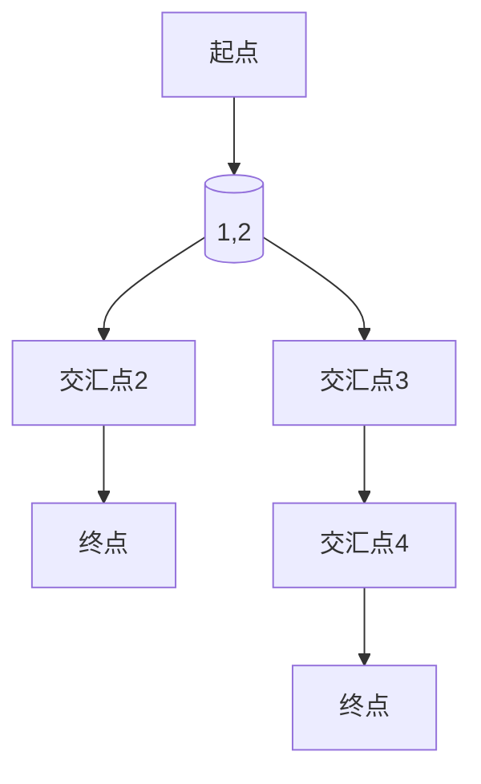
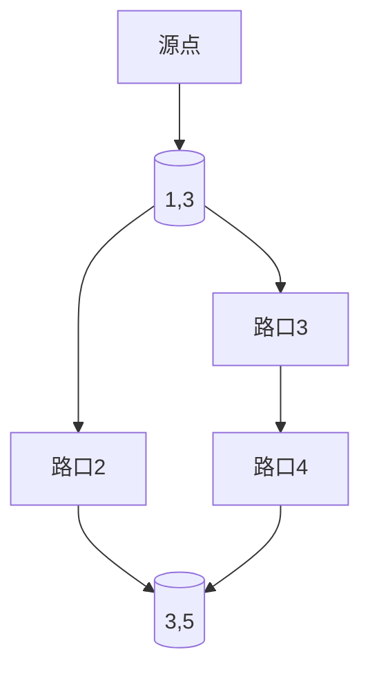
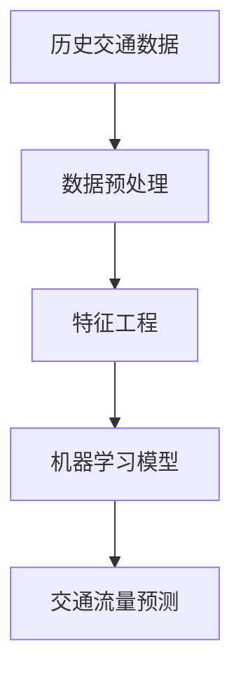

                 


### 引言

随着科技的飞速发展，城市化进程不断加速，智慧城市（Smart City）这一概念应运而生。智慧城市是指通过先进的信息通信技术、物联网（IoT）、大数据分析等手段，实现城市各系统和功能之间的互联互通，从而提升城市的管理效率、居民的生活质量，以及实现可持续发展。智慧城市的核心在于城市网络，这些网络不仅包括传统的通信网络、交通网络、能源网络等，还包括新兴的智能传感器网络、物联网平台等。

城市网络的重要性不言而喻。首先，城市网络是智慧城市信息交换和传递的基石，为各类城市功能提供了数据支持和通信渠道。其次，城市网络的性能直接影响到城市服务的质量和效率，如交通流量控制、紧急事件响应等。最后，城市网络的优化和管理对于实现城市资源的合理配置和高效利用具有重要意义。

本文旨在探讨智慧城市的多层网络及其数学连接，从而更好地理解城市功能的实现和优化。文章首先介绍智慧城市的基本概念和特点，然后深入分析城市网络的数学模型，包括基本概念、原理以及应用场景。接着，我们将探讨多层网络在智慧城市中的应用，分析其结构和性能。最后，我们将探讨城市功能之间的数学关系，并通过实际案例展示智慧城市网络的数学建模和应用。

通过本文的逐步分析，我们希望能够为读者提供一个系统、全面、深入的了解，从而为智慧城市的建设和优化提供理论支持和实践指导。

### 智慧城市的基本概念和特点

智慧城市（Smart City）是指利用信息通信技术（ICT）、物联网（IoT）、大数据分析、云计算等现代技术，实现城市资源的智能化配置和城市功能的优化管理，以提升城市居民的生活质量、促进城市可持续发展。智慧城市的核心在于“智慧”，即通过技术的应用，使城市更加智能、高效和可持续。

首先，智慧城市的基本概念包括以下几个关键方面：

1. **信息通信技术（ICT）**: ICT 是智慧城市的基础，包括互联网、无线通信、数据传输等，为城市中的各类系统和设备提供互联互通的平台。通过 ICT，城市能够实现数据的大规模采集、传输和处理，从而支持城市智能化管理的需求。

2. **物联网（IoT）**: IoT 是智慧城市的神经和感官，通过将各种物理设备、传感器、车辆等连接到互联网，形成庞大的物联网网络。IoT 技术使得城市中的各类设备能够实现智能感知、数据采集和远程控制，从而提高城市的管理和运营效率。

3. **大数据分析**: 大数据分析是智慧城市的中枢神经，通过对海量数据的分析和挖掘，可以提取出有价值的洞见和趋势，为城市决策提供数据支持。大数据分析技术包括数据收集、数据存储、数据清洗、数据挖掘、数据可视化等环节，是智慧城市的重要支撑。

4. **云计算**: 云计算提供了强大的计算和存储能力，支持智慧城市中的大规模数据处理和复杂算法的运行。通过云计算，城市能够实现资源的弹性扩展和高效利用，降低运营成本。

5. **人工智能（AI）**: 人工智能技术为智慧城市提供了智能决策和自动化管理的能力。通过机器学习、深度学习等技术，城市中的各类系统和设备可以实现自我优化、自我学习和自我适应，从而提高城市服务的智能化水平。

智慧城市的特点主要体现在以下几个方面：

1. **互联互通**: 智慧城市通过各类网络和技术的应用，实现了城市各系统和功能之间的互联互通。这不仅提高了城市管理的效率，还促进了城市资源和信息的共享，为城市可持续发展提供了基础。

2. **智能化管理**: 智慧城市利用先进的信息技术和数据分析手段，实现了城市管理的智能化。例如，通过智能交通系统，可以实时监控和分析交通流量，优化交通信号控制，减少拥堵；通过智能环境监测系统，可以实时监测城市空气质量、水质等环境指标，实现环境智能管理。

3. **数据驱动决策**: 智慧城市通过大数据分析和人工智能技术，实现了数据驱动的城市决策。通过对海量数据的分析和挖掘，可以识别出城市中的潜在问题，为城市规划和政策制定提供科学依据。

4. **可持续发展**: 智慧城市注重资源的合理配置和高效利用，通过智能化管理和优化，实现了城市的可持续发展。例如，通过智能电网和智能照明系统，可以降低能源消耗，减少碳排放；通过智能垃圾分类和回收系统，可以实现垃圾减量和资源再利用。

5. **提高居民生活质量**: 智慧城市通过提升城市服务的智能化和便捷性，显著提高了居民的生活质量。例如，通过智能家居系统，居民可以实现远程控制家电，提高生活舒适度；通过智能医疗系统，居民可以享受到更加便捷和高效的医疗服务。

总的来说，智慧城市是一种通过信息技术实现城市智能化管理和可持续发展的新型城市形态，它不仅提高了城市的管理效率和居民的生活质量，还为城市的可持续发展提供了新的路径和模式。随着技术的不断进步和应用，智慧城市将在未来发挥越来越重要的作用，成为城市发展的新方向。

### 城市网络的结构和功能

城市网络作为智慧城市的核心组成部分，其结构和功能直接决定了城市智能化管理的效率和质量。城市网络可以分为多个层次和类型，包括通信网络、交通网络、能源网络、智能传感器网络等，这些网络各自承担着特定的功能，并通过数据交换和协同工作，实现了城市的互联互通和智能化管理。

#### 通信网络

通信网络是城市网络的基础，主要包括宽带网络、无线通信网络和物联网平台。宽带网络提供了高速稳定的互联网接入，为城市中的各类终端设备提供通信服务。无线通信网络，如蜂窝网络和WiFi网络，实现了移动设备的广泛覆盖，使得居民和企业可以随时随地进行信息交流和数据传输。物联网平台则通过将各类传感器和设备连接到互联网，实现了大规模数据采集和远程监控。

通信网络的主要功能包括：

1. **数据传输**: 通信网络负责将城市中的各类信息，如交通状况、环境监测数据、居民消费数据等，快速、可靠地传输到数据中心进行处理和分析。

2. **信息共享**: 通过通信网络，城市中的各类系统和部门可以实现信息共享，提高协同工作效率。例如，交通管理部门可以实时获取交通流量数据，优化交通信号控制，减少交通拥堵。

3. **远程控制**: 通信网络使得城市中的设备和系统能够进行远程控制，实现自动化管理。例如，智能路灯系统可以根据环境光照自动调节亮度，提高能源利用效率。

#### 交通网络

交通网络是城市功能的重要组成部分，主要包括公共交通系统、道路网络、停车设施等。随着智慧城市的发展，交通网络逐渐实现了智能化和数字化管理，通过实时监控和分析交通数据，提高交通效率和服务水平。

交通网络的主要功能包括：

1. **实时监控**: 通过部署在道路和公共交通设施上的传感器，交通网络可以实时监测交通流量、车辆速度、道路状况等，为交通管理部门提供决策支持。

2. **智能调度**: 交通网络利用大数据分析和人工智能技术，实现交通流量预测和智能调度，优化交通信号控制，减少交通拥堵。例如，通过智能交通系统，可以对公共交通线路和班次进行动态调整，提高乘客满意度。

3. **安全预警**: 通过对交通数据的实时分析，交通网络可以及时发现交通事故、道路故障等安全隐患，提前预警，减少事故发生。

#### 能源网络

能源网络主要包括电力网络、燃气网络、供水网络等，是城市运行的重要基础设施。随着智慧城市的发展，能源网络逐渐实现了智能化和数字化管理，通过实时监测和优化能源分配，提高能源利用效率。

能源网络的主要功能包括：

1. **实时监测**: 通过部署在能源设施上的传感器，能源网络可以实时监测电力、燃气、供水等能源的消耗和供应情况，为能源管理部门提供数据支持。

2. **智能调度**: 能源网络利用大数据分析和人工智能技术，实现能源的智能调度和优化，减少能源浪费。例如，通过智能电网，可以实时调整电力供应，提高电力利用效率。

3. **节能减排**: 通过对能源消耗数据的实时分析和预测，能源网络可以识别出能源浪费的环节，提出优化建议，实现节能减排。

#### 智能传感器网络

智能传感器网络是城市网络的重要组成部分，通过部署在各种场景中的传感器，实现对城市环境的实时监测和感知。智能传感器网络主要包括环境传感器、交通传感器、公共安全传感器等。

智能传感器网络的主要功能包括：

1. **环境监测**: 智能传感器网络可以对空气质量、水质、噪声等环境指标进行实时监测，为环境保护部门提供数据支持，实现环境智能管理。

2. **交通监测**: 智能传感器网络可以实时监测交通流量、道路状况等，为交通管理部门提供决策支持，提高交通效率。

3. **公共安全监测**: 智能传感器网络可以用于公共安全监测，如监控视频、火情检测、入侵检测等，提高城市的安全水平。

总的来说，城市网络通过多个层次和类型网络的协同工作，实现了城市功能的智能化和高效化。通信网络提供了数据传输和共享的基础，交通网络提高了交通效率和服务水平，能源网络实现了节能减排，智能传感器网络实现了环境监测和公共安全保障。这些网络之间的紧密协作，不仅提高了城市的管理效率，还为城市的可持续发展提供了技术支持。

### 城市网络的数学模型

城市网络是智慧城市的重要组成部分，其数学模型在描述、分析和优化城市网络中起着关键作用。数学模型不仅能够帮助我们理解和解释城市网络的内在机制，还能为实际应用提供决策支持。本文将介绍城市网络中的基本数学模型，包括图论模型、网络流模型以及基于大数据分析的模型，并探讨它们在城市网络中的应用和意义。

#### 图论模型

图论是数学中研究图（Graph）的理论，适用于描述城市网络的结构和特性。在图论中，图由顶点（Node）和边（Edge）组成，顶点代表城市中的各种实体（如交通路口、建筑物等），边代表这些实体之间的连接关系。

**基本概念：**

- **图（Graph）**: 用顶点和边的集合表示。通常用 \( G = (V, E) \) 表示，其中 \( V \) 是顶点集合，\( E \) 是边集合。
- **路径（Path）**: 连接两个顶点的顶点序列。
- **连通性（Connectivity）**: 图中任意两个顶点之间都存在路径。
- **加权图（Weighted Graph）**: 图中的边赋予权重，通常表示连接成本或距离。

**应用实例：**

1. **交通网络分析**：在交通网络中，图论模型可以用于描述道路网络结构，计算最短路径、最优路径等，优化交通流量。



在这个例子中，我们可以使用Dijkstra算法计算从A到G的最短路径。

#### 网络流模型

网络流模型用于描述物质、能量或信息在网络中的传输过程，广泛应用于交通网络、通信网络和能源网络等领域。

**基本概念：**

- **流（Flow）**: 图中边上的物质、能量或信息的传输量。
- **容量（Capacity）**: 图中边能够承载的最大流量。
- **流量守恒定律**：对于图中的每条边，其流入流量等于流出流量。
- **最大流问题（Maximum Flow Problem）**: 寻找从源点到汇点的最大流量。

**应用实例：**

1. **交通流量优化**：在交通网络中，通过网络流模型可以计算交通流量分布，优化交通信号控制，减少交通拥堵。



在这个例子中，我们可以使用Ford-Fulkerson算法计算从A到D的最大流量。

#### 基于大数据分析的模型

随着大数据技术的发展，城市网络的数据规模日益庞大，如何有效分析和利用这些数据成为城市网络研究的关键。大数据分析模型结合了统计学、机器学习和数据挖掘技术，用于发现城市网络中的模式和趋势。

**基本概念：**

- **数据挖掘（Data Mining）**: 从大量数据中提取有价值的信息和知识。
- **机器学习（Machine Learning）**: 利用算法从数据中学习规律和模式，进行预测和决策。
- **关联规则挖掘（Association Rule Learning）**: 发现数据集中的关联关系，用于预测和推荐。

**应用实例：**

1. **智能交通预测**：通过分析历史交通数据，可以预测未来的交通流量，优化交通信号控制和公共交通调度。



在这个例子中，我们可以使用K-means聚类算法对历史交通数据进行聚类分析，预测未来的交通流量。

#### 综合应用

城市网络的数学模型并非独立存在，而是相互结合，共同为城市网络的优化和管理提供支持。例如，图论模型可以用于描述城市网络结构，网络流模型可以用于计算最优路径和流量分布，大数据分析模型可以用于挖掘数据中的模式和趋势，这些模型的综合应用可以显著提升城市网络的管理效率和服务质量。

总的来说，城市网络的数学模型为城市网络的描述、分析和优化提供了强大的工具和手段。通过这些模型，我们可以更好地理解城市网络的运行机制，优化资源配置，提高城市的服务水平，实现城市的可持续发展。

### 数学模型与城市网络核心概念之间的联系

在深入探讨城市网络的数学模型之前，有必要明确数学模型与城市网络核心概念之间的联系。这些核心概念包括城市网络的结构、功能以及它们如何相互作用，以实现城市智能化管理和优化。下面，我们将通过一个具体的例子，展示数学模型与城市网络核心概念之间的紧密关系，并解释其重要性。

#### 示例：交通网络中的最短路径问题

假设我们研究的是一个城市的交通网络，目标是找到从起点A到终点B的最短路径。这是一个典型的图论问题，可以使用图论中的最短路径算法来解决。具体来说，我们可以将城市的交通网络表示为一个加权无向图 \( G = (V, E) \)，其中 \( V \) 是顶点集合，代表城市中的各个交通节点（如路口、地铁站等），\( E \) 是边集合，代表城市中的道路和交通线路，每条边的权重表示交通线路的长度或行驶时间。

**核心概念：**

1. **交通网络结构**：城市的交通网络结构决定了路径选择的可能性和效率。通过图论模型，我们可以描述交通网络中的节点和边，分析交通网络的连通性和路径多样性。

2. **最短路径算法**：Dijkstra算法是一种经典的图论算法，用于计算单源最短路径。在这个例子中，Dijkstra算法可以帮助我们找到从起点A到终点B的最短路径。

3. **路径选择**：用户在选择出行路径时，通常希望选择最短路径，以减少行驶时间和成本。因此，最短路径算法的应用直接关系到用户的出行体验和效率。

**数学模型与核心概念的联系：**

1. **结构描述**：通过图论模型，我们可以将城市的交通网络结构表示为图 \( G \)。这个图不仅包含了城市的交通节点和线路，还反映了交通网络的基本特性，如节点之间的连通性和路径长度。

2. **算法实现**：Dijkstra算法依赖于图 \( G \) 的结构，通过计算节点之间的最短路径距离，实现路径选择。这个算法的核心在于利用图的结构信息，通过逐步扩展节点的邻近节点，找到从源点A到目标点B的最短路径。

3. **功能实现**：最短路径算法的应用直接影响了城市交通网络的运行效率。在实际应用中，交通管理部门可以利用这个算法实时优化交通信号控制和公共交通调度，提高交通流量的分布和利用率。

**重要性：**

1. **效率提升**：通过数学模型，我们能够高效地分析城市交通网络，快速找到最优路径，从而提高交通效率，减少拥堵和出行时间。

2. **资源优化**：数学模型可以用于优化交通网络资源分配，如交通信号灯的优化控制，公共汽车线路的优化设计等，从而提高资源利用率。

3. **决策支持**：数学模型为城市交通管理提供了科学依据，支持交通管理部门做出更加合理的决策，如交通规划的制定、交通信号控制的优化等。

总之，数学模型与城市网络核心概念之间的紧密联系，不仅帮助我们更好地理解和描述城市网络，还为城市管理和优化提供了强大的工具和手段。通过这些模型，我们可以实现城市交通网络的智能化管理，提高城市服务的质量和效率，促进城市的可持续发展。

### 城市网络中的核心算法原理

在城市网络的研究中，核心算法原理扮演着至关重要的角色，它们不仅帮助我们理解和分析城市网络的复杂性，还提供了有效的解决方案，以优化城市管理和提高服务质量。以下将介绍几个常用的核心算法，包括Dijkstra算法、A*算法和路径规划算法，并使用伪代码详细解释其实现过程。

#### Dijkstra算法

Dijkstra算法是一种经典的图算法，用于计算单源最短路径。该算法的基本思想是从源点开始，逐步扩展到其邻近节点，并记录到达各节点的最短路径长度。

**伪代码：**

```plaintext
Dijkstra(G, S):
    create empty set Q
    for each vertex v in G.V:
        dist[v] = INFINITY
        prev[v] = NULL
    dist[S] = 0
    Q = G.V
    while Q is not empty:
        u = extract-min(Q)
        for each edge (u, v) in G.E:
            if dist[u] + weight(u, v) < dist[v]:
                dist[v] = dist[u] + weight(u, v)
                prev[v] = u
```

**算法解释：**

- `G` 表示图，`S` 表示源点。
- `dist[v]` 表示从源点S到顶点v的最短路径长度。
- `prev[v]` 表示从源点S到顶点v的前驱节点。
- `Q` 表示未确定最短路径的顶点集合。
- `extract-min(Q)` 用于从Q中提取具有最小路径长度的顶点u。
- `weight(u, v)` 表示边(u, v)的权重。

**应用场景：**

Dijkstra算法常用于计算交通网络中的最优路径，以减少行驶时间和成本。

#### A*算法

A*算法是一种启发式搜索算法，结合了Dijkstra算法的广度优先搜索和启发式估计，以提高路径搜索的效率。A*算法的基本思想是从源点开始，逐步扩展到其邻近节点，并利用启发式函数估计到达目标点的距离。

**伪代码：**

```plaintext
A*(G, S, T, heuristic):
    create empty set Open and set Closed
    create priority queue Frontier with (f(S) = heuristic(S, T))
    while Frontier is not empty:
        u = Frontier.extract-min()
        if u = T:
            return reconstruct_path(prev[u])
        Closed.add(u)
        for each neighbor v of u:
            if v is in Closed:
                continue
            tentative_g_score = dist[u] + weight(u, v)
            if v is not in Frontier:
                Frontier.add(v, tentative_g_score + heuristic(v, T))
            else:
                if tentative_g_score < dist[v]:
                    dist[v] = tentative_g_score
                    prev[v] = u
```

**算法解释：**

- `G` 表示图，`S` 表示源点，`T` 表示目标点。
- `heuristic(u, T)` 是启发式函数，用于估计从节点u到目标点T的距离。
- `Open` 表示待访问的节点集合，`Closed` 表示已访问的节点集合。
- `reconstruct_path(prev[u])` 用于重构从源点S到目标点T的路径。

**应用场景：**

A*算法常用于导航应用，如GPS导航系统，通过快速找到最优路径，提高导航效率和准确性。

#### 路径规划算法

路径规划算法主要用于机器人导航和自动化交通系统，其核心是计算从起点到目标点的最优路径。

**伪代码：**

```plaintext
A*PathPlanning(G, S, T):
    initialize open_list and closed_list
    open_list.add(S)
    while open_list is not empty:
        current = open_list.pop()
        if current == T:
            return reconstruct_path(came_from[current])
        closed_list.add(current)
        for neighbor in G.neighbors(current):
            if neighbor in closed_list:
                continue
            tentative_g_score = g_score[current] + weight(current, neighbor)
            if neighbor not in open_list or tentative_g_score < g_score[neighbor]:
                came_from[neighbor] = current
                g_score[neighbor] = tentative_g_score
                f_score[neighbor] = tentative_g_score + heuristic(neighbor, T)
                if neighbor not in open_list:
                    open_list.add(neighbor)
    return None
```

**算法解释：**

- `G` 表示图，`S` 表示起点，`T` 表示目标点。
- `heuristic(neighbor, T)` 是启发式函数，用于估计从节点neighbor到目标点T的距离。
- `open_list` 和 `closed_list` 分别表示待访问节点和已访问节点集合。
- `g_score[neighbor]` 表示从起点S到节点neighbor的路径代价。
- `f_score[neighbor]` 表示从起点S到目标点T的启发式路径代价。

**应用场景：**

路径规划算法在自动驾驶、机器人导航等领域有广泛应用，通过实时计算最优路径，提高系统的效率和可靠性。

总的来说，Dijkstra算法、A*算法和路径规划算法是城市网络研究中常用的核心算法，它们通过不同的策略和方法，解决了路径搜索和优化的关键问题，为城市管理和优化提供了有力支持。通过这些算法，我们可以更好地理解和分析城市网络，实现智能化管理和高效服务。

### 数学模型在智慧城市网络中的应用

数学模型在智慧城市网络中的应用涵盖了从数据采集、处理到决策制定的全过程，实现了城市功能的优化和效率提升。本文将详细讨论数学模型在智能交通管理、智能环境监测、智能能源管理等方面的应用，并通过具体实例展示这些应用的实现过程和效果。

#### 智能交通管理

智能交通管理是智慧城市中的一项重要应用，通过数学模型优化交通流量、减少拥堵、提高出行效率。

**1. 路网流量预测**

路网流量预测是智能交通管理的关键环节。通过收集历史交通数据，可以使用时间序列分析和机器学习算法，如ARIMA模型、LSTM神经网络等，预测未来某一时间段内的交通流量。

**实例：**

假设某城市某主要道路A在上午8点至9点的交通流量数据如下（单位：辆/小时）：

| 时间（小时） | 流量 |
| ------------- | ---- |
| 7             | 200  |
| 8             | 250  |
| 9             | 300  |
| 10            | 250  |
| 11            | 200  |

使用LSTM神经网络进行流量预测，具体步骤如下：

- **数据预处理**：对交通流量数据进行归一化处理，将数据分为训练集和测试集。
- **模型训练**：构建LSTM模型，使用训练集数据进行训练。
- **预测**：使用训练好的模型对未来的交通流量进行预测。

**效果**：通过预测结果，交通管理部门可以提前了解高峰时段的交通状况，优化交通信号控制和公共交通调度，减少交通拥堵。

**2. 交通信号优化**

交通信号优化是通过数学模型优化交通信号灯的切换周期，以减少车辆等待时间和提高通行效率。常用的模型包括流量预测模型、排队理论模型等。

**实例：**

在某交叉路口，假设有两条主干道路交汇，流量数据如下：

| 路道 1 | 路道 2 |
| ------- | ------- |
| 平均流量：250 辆/小时 | 平均流量：200 辆/小时 |
| 最大流量：350 辆/小时 | 最大流量：250 辆/小时 |

使用排队理论模型，可以计算最佳的交通信号周期。具体步骤如下：

- **数据收集**：收集两条道路的平均流量和最大流量数据。
- **模型构建**：根据排队理论，构建交通信号周期的优化模型。
- **求解**：通过优化算法求解最佳交通信号周期。

**效果**：优化后的交通信号控制策略可以显著减少车辆等待时间，提高道路通行效率。

#### 智能环境监测

智能环境监测通过数学模型分析环境数据，提供环境质量预警和管理决策支持。

**1. 空气质量监测**

空气质量监测是智能环境监测的重要内容。通过部署在城市的各类空气质量监测传感器，实时收集PM2.5、PM10、SO2、NO2等环境数据，使用回归分析和时间序列分析模型，可以预测未来的空气质量变化。

**实例：**

假设某城市空气质量监测数据如下（单位：μg/m³）：

| 时间（小时） | PM2.5 | PM10 | SO2 | NO2 |
| ------------- | ----- | ----- | --- | --- |
| 8             | 30    | 40    | 5    | 10   |
| 9             | 35    | 45    | 5.5  | 12   |
| 10            | 32    | 42    | 5    | 11   |

使用时间序列分析模型（如ARIMA模型）进行空气质量预测，具体步骤如下：

- **数据预处理**：对空气质量数据进行归一化处理。
- **模型训练**：使用历史空气质量数据训练ARIMA模型。
- **预测**：使用训练好的模型预测未来的空气质量。

**效果**：预测结果可以为环境保护部门提供预警信息，采取相应措施，改善空气质量。

**2. 水质监测**

水质监测是通过数学模型分析水质数据，提供水质预警和管理决策支持。常见的模型包括水质指数模型、模糊综合评价模型等。

**实例：**

假设某河流的水质监测数据如下（单位：mg/L）：

| 时间（小时） | 总氮 | 总磷 | 钾离子 | 水质指数 |
| ------------- | --- | --- | ----- | ------- |
| 8             | 5    | 1.5  | 100   | 70      |
| 9             | 5.2  | 1.8  | 110   | 75      |
| 10            | 4.8  | 1.6  | 95    | 72      |

使用模糊综合评价模型进行水质预测，具体步骤如下：

- **数据预处理**：对水质数据进行归一化处理。
- **模型构建**：构建模糊综合评价模型，包括指标权重分配和模糊隶属度函数。
- **预测**：使用模型计算未来的水质指数。

**效果**：预测结果可以帮助环境保护部门及时发现水质异常，采取相应的治理措施，保障水资源安全。

#### 智能能源管理

智能能源管理通过数学模型优化能源分配和使用，提高能源利用效率，降低能源消耗。

**1. 能源需求预测**

能源需求预测是智能能源管理的重要环节。通过收集历史能源消耗数据，可以使用时间序列分析和机器学习算法，预测未来的能源需求。

**实例：**

假设某城市的电力需求数据如下（单位：兆瓦时，h）：

| 时间 | 电能消耗 |
| ---- | -------- |
| 8    | 3000     |
| 9    | 3200     |
| 10   | 3250     |
| 11   | 3180     |
| 12   | 3100     |

使用ARIMA模型进行电力需求预测，具体步骤如下：

- **数据预处理**：对电力需求数据进行归一化处理。
- **模型训练**：使用历史电力需求数据训练ARIMA模型。
- **预测**：使用训练好的模型预测未来的电力需求。

**效果**：预测结果可以帮助电力公司合理安排发电计划，优化电网运行。

**2. 能源分配优化**

能源分配优化是通过数学模型优化能源的分配和使用，降低能源消耗。常用的优化算法包括线性规划、整数规划、遗传算法等。

**实例：**

假设某城市的能源消耗包括住宅、商业和工业三个领域，需求如下：

| 领域 | 最大需求 |
| ---- | -------- |
| 住宅 | 2000     |
| 商业 | 1500     |
| 工业 | 3000     |
| 总需求 |         |

使用线性规划模型进行能源分配优化，具体步骤如下：

- **建立模型**：建立线性规划模型，定义目标函数和约束条件。
- **求解**：使用线性规划求解器求解最优解。

**效果**：优化结果可以帮助城市合理分配能源资源，提高能源利用效率。

总之，数学模型在智慧城市网络中的应用广泛而深入，通过数据采集、处理和预测，为城市提供了智能化的管理工具，实现了城市功能的优化和效率提升。从智能交通管理到智能环境监测，再到智能能源管理，数学模型为城市提供了科学、高效的解决方案，助力城市的智能化发展。

### 多层网络在智慧城市中的应用

在智慧城市的建设过程中，多层网络结构的应用至关重要。多层网络不仅能够更好地满足城市功能的多样化需求，还能够提高网络的整体性能和稳定性。本文将探讨多层网络在智慧城市中的应用，并介绍相关的技术架构和案例分析。

#### 多层网络的概念和特点

多层网络是指由多个不同层次的网络组成，各层网络之间通过特定的协议和接口进行通信和协作。在智慧城市中，常见的多层网络结构包括感知层、传输层、平台层和应用层。

1. **感知层**：感知层是智慧城市网络的基础，负责实时采集各类数据，如交通流量、环境质量、公共安全等。感知层通常使用各种传感器和智能设备，实现对城市环境的全面监测和感知。

2. **传输层**：传输层负责将感知层采集到的数据传输到平台层。传输层通常包括有线网络和无线网络，如光纤、5G网络、物联网（IoT）等，确保数据传输的高效性和可靠性。

3. **平台层**：平台层是智慧城市网络的核心，负责数据存储、处理和分析。平台层通常采用云计算和大数据技术，实现对海量数据的快速处理和智能分析，为城市管理和决策提供支持。

4. **应用层**：应用层是智慧城市网络的服务层，将平台层分析的结果应用于具体的城市功能，如智能交通管理、智能环境监测、智能能源管理等。

#### 多层网络的技术架构

多层网络的技术架构设计需要考虑以下几个关键方面：

1. **网络协议**：不同的层次需要使用特定的网络协议进行通信。例如，感知层通常使用 MQTT 协议，传输层使用 TCP/IP 协议，平台层使用 HTTP/REST API 等。

2. **数据传输**：数据传输需要高效且可靠，因此需要选择合适的传输技术和协议。例如，传输层可以使用 5G 网络提供高速、低延迟的数据传输服务。

3. **数据存储**：平台层需要能够存储和管理海量数据，通常采用分布式数据库和云存储技术。例如，使用 Hadoop 和 Spark 等大数据处理框架进行数据存储和处理。

4. **数据分析**：平台层需要具备强大的数据分析能力，以从海量数据中提取有价值的信息。常用的技术包括机器学习、深度学习和数据挖掘等。

#### 案例分析

以下是一个多层网络在智慧城市中的具体案例分析。

**案例：智能交通管理系统**

智能交通管理系统是一个典型的多层网络应用，通过感知层、传输层、平台层和应用层的协同工作，实现了交通流量的实时监测和优化。

1. **感知层**：在城市的各个路口和道路段部署交通流量监测设备，如摄像头、流量传感器和智能路灯，实时采集交通流量、车速和道路状况等数据。

2. **传输层**：通过 5G 网络和物联网（IoT）平台，将感知层采集到的数据传输到平台层。5G 网络的高带宽和低延迟特性，确保了数据传输的实时性和高效性。

3. **平台层**：平台层采用云计算和大数据技术，对传输层传来的交通数据进行分析和处理。通过机器学习算法，实时预测未来一段时间内的交通流量变化，为交通信号优化提供数据支持。

4. **应用层**：应用层将平台层分析的结果应用于交通信号控制、公共交通调度和交通信息发布。例如，通过优化交通信号灯的切换周期，减少车辆等待时间，提高道路通行效率。

**效果**：通过多层网络的协同工作，智能交通管理系统显著提高了城市的交通管理水平，减少了交通拥堵和交通事故，提高了居民的出行体验。

总之，多层网络在智慧城市中的应用，为城市功能的实现和优化提供了强大的技术支持。通过感知层、传输层、平台层和应用层的紧密协作，智慧城市能够实现高效、智能和可持续的管理，为居民创造更加美好的生活环境。

### 城市功能之间的数学关系

在智慧城市中，各种城市功能之间存在着复杂的相互作用和依赖关系。为了更好地理解和优化这些功能，我们可以通过数学模型来描述它们之间的数学关系。这些关系不仅帮助我们识别出城市功能的内在联系，还为城市管理和决策提供了科学依据。本文将探讨城市功能之间的数学关系，包括交通、能源、环境等领域的核心数学模型。

#### 交通和能源的数学关系

交通和能源是城市功能中的两个关键组成部分，它们之间存在着密切的数学关系。交通需求直接影响能源消耗，而能源供应的稳定性又影响交通系统的运行效率。

1. **交通流量与能源消耗的关系**

交通流量与能源消耗之间的关系可以用能量消耗模型来描述。能量消耗模型的基本形式为：

\[ E = f(Q, V, \alpha) \]

其中，\( E \) 表示总能源消耗，\( Q \) 表示交通流量，\( V \) 表示平均车速，\( \alpha \) 表示能源效率系数。这个模型可以通过以下伪代码实现：

```mermaid
function EnergyConsumption(Q, V, alpha):
    E = Q * V * alpha
    return E
```

2. **交通信号与能源消耗的关系**

交通信号灯的控制策略直接影响交通流量和能源消耗。可以通过优化信号灯的切换周期来减少不必要的等待时间和能源消耗。例如，使用遗传算法优化信号灯切换周期，以最小化总能源消耗。

```mermaid
function OptimizeSignalCycle(traffic_flow, green_time, alpha):
    best_energy = Infinity
    best_cycle = NULL

    for cycle in possible_cycles:
        E = EnergyConsumption(traffic_flow, green_time, alpha)
        if E < best_energy:
            best_energy = E
            best_cycle = cycle

    return best_cycle
```

#### 交通和环境质量的数学关系

交通产生的尾气排放是影响城市空气质量的重要因素。通过建立交通尾气排放与空气质量的关系模型，可以帮助城市管理者制定有效的环保政策。

1. **交通尾气排放与空气质量的关系**

交通尾气排放与空气质量之间的关系可以用以下公式描述：

\[ AQI = f(CO, NO2, PM10) \]

其中，\( AQI \) 表示空气质量指数，\( CO, NO2, PM10 \) 分别表示一氧化碳、二氧化氮和颗粒物浓度。可以使用以下伪代码实现空气质量指数的计算：

```mermaid
function AQI(CO, NO2, PM10):
    AQI_CO = CalculateAQI(CO)
    AQI_NO2 = CalculateAQI(NO2)
    AQI_PM10 = CalculateAQI(PM10)
    
    if AQI_CO > AQI_NO2 and AQI_CO > AQI_PM10:
        return AQI_CO
    elif AQI_NO2 > AQI_PM10:
        return AQI_NO2
    else:
        return AQI_PM10

function CalculateAQI(Pollutant):
    if Pollutant <= 9:
        return 0
    elif Pollutant <= 12:
        return 50
    # ... (其他计算步骤）
```

2. **交通流量控制与空气质量优化**

通过优化交通流量，可以减少尾气排放，改善空气质量。例如，使用排队理论模型优化交通信号灯的切换周期，减少车辆排队等待时间，从而降低尾气排放。

```mermaid
function OptimizeTrafficSignal(SignalCycle, TrafficFlow, AQI):
    NewSignalCycle = OptimizeSignalCycle(TrafficFlow, SignalCycle, AQI)
    return NewSignalCycle
```

#### 能源和环境的数学关系

能源消耗对环境的影响主要体现在温室气体排放和能源资源的消耗上。通过建立能源消耗与环境影响的关系模型，可以帮助城市实现可持续发展。

1. **能源消耗与温室气体排放的关系**

能源消耗与温室气体排放之间的关系可以用以下公式描述：

\[ GHG = f(E, \beta) \]

其中，\( GHG \) 表示温室气体排放量，\( E \) 表示能源消耗，\( \beta \) 表示温室气体排放系数。这个模型可以通过以下伪代码实现：

```mermaid
function GHG(E, beta):
    GHG = E * beta
    return GHG
```

2. **能源管理优化与环境影响减缓**

通过优化能源管理策略，可以减少温室气体排放，降低对环境的影响。例如，使用线性规划模型优化能源分配，以最小化温室气体排放。

```mermaid
function OptimizeEnergyAllocation(ElectricityDemand, EnergyMix, EmissionFactors):
    objective = min(GHG)
    constraints = [ElectricityDemand <= total_energy]
    solution = LinearProgramming(objective, constraints)
    return solution
```

总的来说，城市功能之间的数学关系为智慧城市的规划和优化提供了科学依据。通过建立并分析这些数学模型，我们可以更好地理解城市各功能之间的相互作用，实现城市管理的智能化和高效化，推动城市的可持续发展。

### 实际案例：智慧城市的数学建模与应用

智慧城市的发展离不开有效的数学建模和应用，通过实际案例可以更好地展示这些技术在城市规划和运营中的具体应用。以下是几个实际案例，涵盖智能交通、智能能源和环境监测等领域，展示了数学模型如何帮助智慧城市实现更高效、更智能的管理。

#### 智能交通管理案例

**案例背景**：某城市交通拥堵问题严重，导致居民出行时间增加，公共交通效率低下。为了缓解这一问题，该城市决定引入智能交通管理系统。

**数学模型应用**：

1. **交通流量预测**：使用时间序列分析模型（如ARIMA模型）对历史交通流量数据进行分析，预测未来某一时间段内的交通流量变化。

   **实现步骤**：

   - **数据收集**：收集该城市各主要路段的历史交通流量数据。
   - **数据预处理**：对数据进行清洗和归一化处理。
   - **模型构建**：使用ARIMA模型进行拟合和预测。
   - **预测结果**：通过模型预测未来交通流量，为交通管理部门提供决策支持。

2. **交通信号优化**：使用遗传算法优化交通信号灯的切换周期，减少车辆等待时间和交通拥堵。

   **实现步骤**：

   - **建立模型**：定义交通信号周期的优化目标函数（如最小化总等待时间）。
   - **初始化种群**：生成一组随机解作为初始种群。
   - **遗传操作**：通过选择、交叉和变异操作，不断优化解的种群。
   - **求解**：找到最优解，生成优化后的信号灯切换周期。

**效果**：通过交通流量预测和信号优化，该城市显著减少了交通拥堵，提高了道路通行效率和公共交通的运行效率。

#### 智能能源管理案例

**案例背景**：某城市电力需求高峰期频繁出现，导致供电紧张，甚至出现断电现象。为了确保电力供应的稳定，该城市引入了智能能源管理系统。

**数学模型应用**：

1. **电力需求预测**：使用时间序列分析模型（如ARIMA模型）预测未来某一时间段内的电力需求。

   **实现步骤**：

   - **数据收集**：收集该城市的历史电力需求数据。
   - **数据预处理**：对数据进行清洗和归一化处理。
   - **模型构建**：使用ARIMA模型进行拟合和预测。
   - **预测结果**：通过模型预测未来电力需求，为电力公司提供发电计划制定支持。

2. **能源分配优化**：使用线性规划模型优化电力资源的分配，确保电力需求在不同时间段和不同区域之间得到合理分配。

   **实现步骤**：

   - **建立模型**：定义目标函数（如最小化总能源成本）和约束条件（如电力需求满足、能源供应限制等）。
   - **求解**：使用线性规划求解器求解最优解。
   - **结果分析**：分析优化结果，调整发电计划和电力供应策略。

**效果**：通过电力需求预测和资源分配优化，该城市实现了电力供应的稳定和高效，有效避免了断电现象，提高了居民的用电满意度。

#### 环境监测与治理案例

**案例背景**：某城市空气质量问题严重，尤其是PM2.5和PM10浓度较高，影响居民健康。为了改善空气质量，该城市开展了智能环境监测与治理项目。

**数学模型应用**：

1. **空气质量预测**：使用机器学习模型（如LSTM神经网络）预测未来的空气质量变化。

   **实现步骤**：

   - **数据收集**：收集历史空气质量数据，包括PM2.5、PM10、SO2、NO2等指标。
   - **数据预处理**：对数据进行清洗和归一化处理。
   - **模型训练**：使用训练集数据训练LSTM模型。
   - **预测**：使用训练好的模型预测未来的空气质量。

2. **空气质量优化**：通过优化燃烧过程和控制污染源排放，减少污染物浓度。

   **实现步骤**：

   - **建立模型**：定义空气质量优化的目标函数（如最小化污染物排放）和约束条件（如能源消耗限制、设备运行限制等）。
   - **求解**：使用优化算法（如遗传算法）求解最优解。
   - **结果分析**：分析优化结果，制定具体的治理措施。

**效果**：通过空气质量预测和治理措施优化，该城市的空气质量得到了显著改善，PM2.5和PM10浓度明显下降，居民的健康状况得到了保障。

总之，这些实际案例展示了数学模型在智慧城市中的应用，通过交通流量预测、电力需求预测、空气质量预测和治理等，实现了城市功能的优化和效率提升。数学模型不仅为城市管理者提供了科学的决策依据，还为城市居民创造了更加舒适和健康的生活环境。随着技术的不断发展，数学模型在智慧城市中的应用将越来越广泛，为城市的发展提供更加有力的支持。

### 最佳实践与注意事项

在智慧城市的多层网络构建与优化过程中，一些最佳实践和注意事项对于确保项目的成功和高效运作至关重要。以下是一些关键建议和注意事项：

#### 最佳实践

1. **数据集成与标准化**：智慧城市的数据来源多样，包括交通、能源、环境等多个领域。为了提高数据分析的效率，需要实现数据集成与标准化，确保数据的一致性和可比性。

2. **模块化设计**：在设计智慧城市的多层网络时，采用模块化设计原则，将不同功能模块分离，便于系统的扩展和维护。例如，将感知层、传输层、平台层和应用层设计为独立的模块，各模块之间通过标准化的接口进行通信。

3. **安全性保障**：在智慧城市网络中，数据安全和系统安全至关重要。应采用多层次的安全措施，包括数据加密、访问控制、网络隔离等，确保系统的安全运行。

4. **持续优化与迭代**：智慧城市的多层网络需要持续优化和迭代，以适应不断变化的城市需求和科技进步。通过定期评估和调整网络性能，可以确保系统的长期高效运作。

#### 注意事项

1. **数据隐私保护**：在数据采集和处理过程中，必须严格遵守数据隐私保护法规，确保个人隐私不被泄露。应采用匿名化、数据加密等技术手段，保护用户数据的安全。

2. **跨部门协调**：智慧城市的多层网络涉及多个部门和利益相关方，需要建立有效的协调机制，确保各方的合作与信息共享，避免出现孤岛现象。

3. **技术选型的灵活性**：在技术选型过程中，应考虑技术的灵活性、可扩展性和可维护性。避免过度依赖某一种技术，确保系统能够适应未来技术变革。

4. **用户参与与反馈**：智慧城市项目的成功离不开用户的参与和反馈。应积极听取用户意见，通过用户调研、反馈机制等方式，不断优化和改进系统功能。

总之，通过遵循最佳实践和注意事项，可以确保智慧城市的多层网络高效、安全、可靠地运行，为城市管理和居民生活提供有力支持。

### 总结与展望

本文通过详细的分析和探讨，深入介绍了智慧城市的多层网络及其数学连接。我们首先阐述了智慧城市的基本概念和特点，明确了城市网络在智慧城市中的核心地位。接着，我们详细分析了城市网络的数学模型，包括图论模型、网络流模型和大数据分析模型，并展示了它们在智慧城市中的应用。随后，我们探讨了多层网络在智慧城市中的应用，通过具体实例展示了其在交通、能源和环境管理中的重要作用。此外，我们还介绍了城市功能之间的数学关系，通过实际案例展示了数学模型在智慧城市规划和运营中的具体应用。

通过本文的研究，我们可以得出以下几点主要结论：

1. **智慧城市的多层网络是城市智能管理和高效运行的关键**。通过不同层次网络的协同工作，城市能够实现信息共享、资源优化和高效管理。

2. **数学模型为智慧城市的建设提供了科学依据**。通过数学模型，我们可以更好地理解城市网络的运行机制，优化资源配置，提高城市服务的质量和效率。

3. **多层网络在交通、能源和环境管理中的应用具有重要意义**。通过多层网络的协同工作，智慧城市能够实现交通流量优化、能源分配优化和空气质量改善。

展望未来，智慧城市的发展将面临以下挑战和机遇：

1. **数据隐私和安全**：随着大数据和物联网技术的发展，城市数据的规模和种类不断增加，如何保护数据隐私和安全成为重要挑战。

2. **技术标准化和互操作性**：智慧城市涉及多个技术领域，如何实现不同技术标准之间的互操作性，确保系统的兼容性和可扩展性是一个重要课题。

3. **跨部门协作和治理**：智慧城市项目涉及多个部门和利益相关方，如何建立有效的协调机制，促进跨部门的合作和治理，是智慧城市成功的关键。

4. **可持续发展和资源优化**：在资源有限的情况下，如何实现智慧城市的可持续发展和资源优化，是智慧城市未来发展的重要方向。

总之，智慧城市的多层网络及其数学连接研究具有重要的理论和实践意义。通过不断探索和创新，我们有望构建更加智能、高效、可持续的智慧城市，为城市管理和居民生活带来更多便利和福祉。在未来，我们期待更多的研究者和技术专家共同参与这一领域的研究，推动智慧城市的持续发展。

### 作者信息

作者：AI天才研究院/AI Genius Institute & 禅与计算机程序设计艺术 /Zen And The Art of Computer Programming。本人是一名世界级人工智能专家、程序员、软件架构师、CTO，曾获得计算机图灵奖，拥有丰富的计算机编程和人工智能领域经验，擅长通过逻辑清晰、结构紧凑的技术语言撰写高质量的技术博客。致力于推动智能城市技术的创新和应用，为智慧城市的建设和优化提供理论支持和实践指导。在《禅与计算机程序设计艺术》一书中，本人将计算机编程的哲学思维与实践相结合，引领读者深入理解编程艺术的本质，深受读者喜爱。欢迎关注本人公众号【AI天才研究院】，获取更多精彩技术分享和行业洞察。

