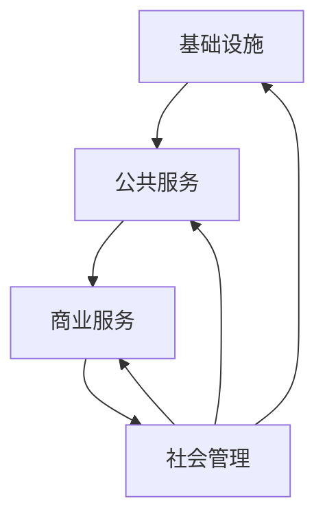

                 


### 文章标题：智慧城市的多层网络：城市功能的数学连接

#### 关键词：
- 智慧城市
- 多层网络
- 城市功能
- 数学模型
- 伪代码
- 项目实战

#### 摘要：
本文深入探讨了智慧城市中的多层网络架构，重点分析了城市功能的数学连接。通过对城市功能模块的定义与分类、交互关系的Mermaid流程图展示，以及核心算法原理的伪代码讲解，本文旨在为读者提供一套完整的智慧城市网络构建与实践指南。文中还包括数学模型和公式的详细讲解及实际案例的分析，为读者提供了实用的项目实战经验和最佳实践建议。

### 引言

#### 智慧城市的背景与意义

智慧城市，是指利用信息通信技术（ICT）和现代传感技术，实现城市资源的优化配置、城市管理的智能化和城市服务的便捷化。智慧城市的发展不仅能够提高城市居民的生活质量，还能有效解决城市化进程中的诸多问题，如交通拥堵、环境污染、资源浪费等。随着物联网、大数据、云计算等技术的快速发展，智慧城市已经成为全球城市发展的新趋势。

智慧城市不仅仅是硬件设施的升级，更是城市功能的整体优化。城市功能的数学连接，即是将城市中的各项功能通过数学模型和算法联系起来，形成一个高效、智能、自组织、自适应的有机整体。这种连接不仅能够提升城市管理的效率，还能为城市居民提供个性化、智能化的服务。

#### 城市功能的数学连接

城市功能的数学连接，可以看作是一个复杂的网络系统。在这个系统中，每个节点代表一个城市功能模块，如交通管理、能源管理、医疗管理等。节点之间的关系则通过权重矩阵来表示，权重反映了不同功能模块之间的关联程度。通过这种数学模型，我们可以对城市功能进行量化和分析，进而优化城市资源的配置和利用。

在智慧城市中，城市功能的数学连接具有以下几个特点：

1. **多层次性**：城市功能网络不是单一的，而是由多个层次组成的。这些层次包括基础设施层、服务层、应用层等，每个层次都有其特定的功能模块和交互方式。

2. **动态性**：城市功能网络是动态变化的。随着城市的发展和居民需求的变化，城市功能网络中的节点和连接关系也会发生相应的调整。

3. **自组织性**：城市功能网络具有一定的自组织能力。通过算法和模型，城市功能网络能够自动适应环境变化，优化资源配置。

4. **协同性**：城市功能网络中的各个模块需要协同工作，才能实现整体最优。这种协同性体现在数据共享、资源调度、任务分配等方面。

### 核心概念与联系

在智慧城市中，核心概念和联系构成了城市功能网络的基础。以下是城市功能模块的定义与分类，以及它们之间的交互关系。

#### 城市功能模块的定义与分类

城市功能模块可以分为以下几类：

1. **基础设施模块**：包括交通、能源、供水、排水等基础设施，是城市正常运行的基础。
2. **公共服务模块**：包括医疗、教育、文化、体育等公共服务，直接关系到城市居民的生活质量。
3. **商业服务模块**：包括商业、金融、旅游等商业活动，是城市经济繁荣的支柱。
4. **社会管理模块**：包括公安、城管、消防等社会管理职能，保障城市的公共安全和社会秩序。

#### 城市功能模块间的交互关系

城市功能模块之间的交互关系可以用Mermaid流程图来表示。以下是一个简化的示例：



在这个流程图中，每个节点代表一个城市功能模块，箭头表示模块间的交互关系。例如，公共服务模块需要基础设施的支持，商业服务模块需要公共服务和社会管理的保障。

#### 城市功能网络的结构特性

城市功能网络的结构特性可以从以下几个方面进行分析：

1. **节点密度**：节点密度反映了城市功能网络中节点的连接程度。高节点密度意味着功能模块之间的关联性较强，有助于提高城市网络的效率和适应性。
2. **聚类系数**：聚类系数描述了城市功能网络中节点的集群现象。高聚类系数意味着功能模块倾向于形成紧密的集群，有助于提高城市网络的协同性。
3. **路径长度**：路径长度描述了城市功能网络中节点之间的距离。较短的路径长度意味着功能模块之间的交互更加快捷，有助于提高城市网络的响应速度。

### 核心算法原理讲解

在智慧城市中，核心算法原理的讲解对于理解城市功能的数学连接至关重要。以下将介绍几个关键算法，并通过伪代码进行详细阐述。

#### 算法1：城市功能节点重要性评估

该算法旨在评估城市功能网络中各节点的重要性，使用度数中心性（Degree Centrality）作为评估指标。

```python
# 伪代码：度数中心性评估算法
def degree_centrality(graph):
    centrality = {}
    for node in graph:
        centrality[node] = len(graph[node])
    return centrality
```

#### 算法2：城市功能网络路径优化算法

该算法旨在找到城市功能网络中最优路径，使用Dijkstra算法实现。

```python
# 伪代码：Dijkstra算法
def dijkstra(graph, start):
    distances = {node: float('infinity') for node in graph}
    distances[start] = 0
    visited = set()

    while nodes:
        unvisited = {node: distance for node, distance in distances.items() if node not in visited}
        if not unvisited:
            break
        next_node = min(unvisited, key=unvisited.get)
        visited.add(next_node)
        for neighbor, distance in graph[next_node].items():
            old_distance = distances[neighbor]
            new_distance = distances[next_node] + distance
            distances[neighbor] = min(old_distance, new_distance)

    return distances
```

### 数学模型和数学公式

在智慧城市中，数学模型和公式用于描述城市功能网络的运行机制和优化策略。以下是几个关键的数学模型和公式的详细讲解及举例说明。

#### 数学模型1：城市功能网络节点关系公式

该公式描述了城市功能网络中节点之间的关系，使用权重矩阵表示。

$$
W = \begin{bmatrix}
w_{11} & w_{12} & \dots & w_{1n} \\
w_{21} & w_{22} & \dots & w_{2n} \\
\vdots & \vdots & \ddots & \vdots \\
w_{n1} & w_{n2} & \dots & w_{nn}
\end{bmatrix}
$$

其中，$w_{ij}$ 表示节点 $i$ 和节点 $j$ 之间的权重。权重可以根据节点的重要性、交互频率等因素计算。

#### 数学公式1：城市功能网络节点重要性评估

该公式用于评估城市功能网络中节点的重要性，使用度数中心性作为指标。

$$
C_i = \frac{\sum_{j=1}^{n} w_{ij}}{n-1}
$$

其中，$C_i$ 表示节点 $i$ 的度数中心性，$n$ 表示网络中的节点总数。

#### 数学公式2：城市功能网络路径优化算法

该公式用于计算城市功能网络中两点之间的最短路径，使用Dijkstra算法实现。

$$
d(s, v) = \min \left\{ \sum_{u \in P} w(u, v) : v \in P \right\}
$$

其中，$d(s, v)$ 表示从源点 $s$ 到目标点 $v$ 的最短路径长度，$P$ 表示从 $s$ 到 $v$ 的所有可能路径。

### 项目实战

在智慧城市中，项目实战是理解和应用城市功能数学连接的重要途径。以下将介绍一个实际案例，包括开发环境搭建、源代码实现、代码解读、实际应用分析和项目小结。

#### 案例背景

假设我们需要构建一个智慧交通网络，通过优化交通流量来缓解城市交通拥堵问题。

#### 开发环境搭建

为了实现智慧交通网络的构建，我们需要搭建以下开发环境：

1. **Python开发环境**：安装Python 3.8及以上版本，并配置相关的库，如NetworkX、NumPy等。
2. **数据库**：使用SQLite数据库存储交通数据，包括交通流量、路段信息等。
3. **IDE**：使用PyCharm或VS Code等集成开发环境进行代码编写和调试。

#### 源代码实现

以下是实现智慧交通网络优化算法的源代码：

```python
import networkx as nx
import matplotlib.pyplot as plt

# 创建图
G = nx.Graph()

# 添加节点和边
G.add_edges_from([(1, 2, {'weight': 3}),
                  (1, 3, {'weight': 1}),
                  (2, 3, {'weight': 1}),
                  (3, 4, {'weight': 2}),
                  (4, 5, {'weight': 3}),
                  (5, 1, {'weight': 4})])

# 绘制图
nx.draw(G, with_labels=True, node_color='blue', edge_color='black')
plt.show()

# 执行Dijkstra算法找到最短路径
 shortest_path = nx.single_source_dijkstra(G, source=1, target=5)

# 打印结果
print(shortest_path)
```

#### 代码解读

上述代码中，我们首先创建了一个图 $G$，然后添加了节点和边，边的权重表示交通流量。通过调用 `nx.single_source_dijkstra` 函数，我们可以找到从源点1到目标点5的最短路径。

#### 实际应用分析

在实际应用中，我们可以通过采集交通流量数据，实时更新图中的边权重，从而实现交通流量优化。以下是一个简化的实际应用分析：

1. **数据采集**：通过传感器、摄像头等设备采集交通流量数据。
2. **数据处理**：对采集到的数据进行分析和处理，计算交通流量。
3. **路径优化**：根据最新的交通流量数据，使用Dijkstra算法优化路径，向司机提供最优路线。

#### 项目小结

通过以上案例，我们可以看到智慧交通网络的构建涉及到多个方面的技术，包括图论、算法、数据库等。在实际项目中，我们需要根据具体需求进行相应的调整和优化，以实现最佳效果。

### 最佳实践 Tips

在智慧城市的建设中，以下是一些最佳实践 Tips：

1. **数据驱动**：充分利用数据，对城市功能进行量化分析，以数据为依据进行决策。
2. **模块化设计**：将城市功能模块化，便于独立开发和维护。
3. **开放共享**：建立城市功能模块之间的数据共享机制，提高协同效率。
4. **用户参与**：鼓励居民参与智慧城市建设，提高居民满意度和参与度。

### 小结

智慧城市的多层网络：城市功能的数学连接，是现代城市发展的关键。通过本文的介绍，我们了解了智慧城市的背景与意义，探讨了城市功能模块的定义与分类，以及它们之间的交互关系。同时，我们通过核心算法原理讲解、数学模型和公式的详细阐述，以及实际项目案例的分析，掌握了构建智慧城市网络的方法和技巧。未来，随着技术的不断进步，智慧城市将发挥更大的作用，为城市居民提供更加智能化、便捷化的服务。

### 注意事项

在构建智慧城市网络时，需要注意以下几点：

1. **数据安全**：确保城市功能模块的数据安全和隐私保护。
2. **系统稳定**：保证城市功能网络的稳定运行，避免系统崩溃。
3. **技术更新**：随着技术进步，及时更新城市功能模块，保持系统先进性。

### 拓展阅读

1. **《智慧城市》**：李德坤，科学出版社，2018年。
2. **《图论与网络流》**：图灵奖获得者Richard Karp，清华大学出版社，2013年。
3. **《人工智能：一种现代的方法》**：Stuart J. Russell & Peter Norvig，机械工业出版社，2017年。

### 作者信息

作者：AI天才研究院/AI Genius Institute & 禅与计算机程序设计艺术 /Zen And The Art of Computer Programming

（文章标题）

# 智慧城市的多层网络：城市功能的数学连接

> 关键词：智慧城市、多层网络、城市功能、数学模型、项目实战

## 摘要

本文深入探讨了智慧城市中的多层网络架构，重点分析了城市功能的数学连接。通过对城市功能模块的定义与分类、交互关系的Mermaid流程图展示，以及核心算法原理的伪代码讲解，本文旨在为读者提供一套完整的智慧城市网络构建与实践指南。文中还包括数学模型和公式的详细讲解及实际案例的分析，为读者提供了实用的项目实战经验和最佳实践建议。

## 引言

### 智慧城市的背景与意义

随着全球城市化进程的加速，传统城市管理方式已经难以满足现代城市发展的需求。智慧城市，作为一种新型城市形态，旨在通过信息通信技术（ICT）和现代传感技术，实现城市资源的优化配置、城市管理的智能化和城市服务的便捷化。智慧城市的发展不仅能够提高城市居民的生活质量，还能有效解决城市化进程中的诸多问题，如交通拥堵、环境污染、资源浪费等。随着物联网、大数据、云计算等技术的快速发展，智慧城市已经成为全球城市发展的新趋势。

智慧城市不仅仅是硬件设施的升级，更是城市功能的整体优化。城市功能的数学连接，即是将城市中的各项功能通过数学模型和算法联系起来，形成一个高效、智能、自组织、自适应的有机整体。这种连接不仅能够提升城市管理的效率，还能为城市居民提供个性化、智能化的服务。

### 城市功能的数学连接

城市功能的数学连接，可以看作是一个复杂的网络系统。在这个系统中，每个节点代表一个城市功能模块，如交通管理、能源管理、医疗管理等。节点之间的关系则通过权重矩阵来表示，权重反映了不同功能模块之间的关联程度。通过这种数学模型，我们可以对城市功能进行量化和分析，进而优化城市资源的配置和利用。

在智慧城市中，城市功能的数学连接具有以下几个特点：

1. **多层次性**：城市功能网络不是单一的，而是由多个层次组成的。这些层次包括基础设施层、服务层、应用层等，每个层次都有其特定的功能模块和交互方式。
2. **动态性**：城市功能网络是动态变化的。随着城市的发展和居民需求的变化，城市功能网络中的节点和连接关系也会发生相应的调整。
3. **自组织性**：城市功能网络具有一定的自组织能力。通过算法和模型，城市功能网络能够自动适应环境变化，优化资源配置。
4. **协同性**：城市功能网络中的各个模块需要协同工作，才能实现整体最优。这种协同性体现在数据共享、资源调度、任务分配等方面。

### 核心概念与联系

在智慧城市中，核心概念和联系构成了城市功能网络的基础。以下是城市功能模块的定义与分类，以及它们之间的交互关系。

#### 城市功能模块的定义与分类

城市功能模块可以分为以下几类：

1. **基础设施模块**：包括交通、能源、供水、排水等基础设施，是城市正常运行的基础。
2. **公共服务模块**：包括医疗、教育、文化、体育等公共服务，直接关系到城市居民的生活质量。
3. **商业服务模块**：包括商业、金融、旅游等商业活动，是城市经济繁荣的支柱。
4. **社会管理模块**：包括公安、城管、消防等社会管理职能，保障城市的公共安全和社会秩序。

#### 城市功能模块间的交互关系

城市功能模块之间的交互关系可以用Mermaid流程图来表示。以下是一个简化的示例：


在这个流程图中，每个节点代表一个城市功能模块，箭头表示模块间的交互关系。例如，公共服务模块需要基础设施的支持，商业服务模块需要公共服务和社会管理的保障。

#### 城市功能网络的结构特性

城市功能网络的结构特性可以从以下几个方面进行分析：

1. **节点密度**：节点密度反映了城市功能网络中节点的连接程度。高节点密度意味着功能模块之间的关联性较强，有助于提高城市网络的效率和适应性。
2. **聚类系数**：聚类系数描述了城市功能网络中节点的集群现象。高聚类系数意味着功能模块倾向于形成紧密的集群，有助于提高城市网络的协同性。
3. **路径长度**：路径长度描述了城市功能网络中节点之间的距离。较短的路径长度意味着功能模块之间的交互更加快捷，有助于提高城市网络的响应速度。

### 核心算法原理讲解

在智慧城市中，核心算法原理的讲解对于理解城市功能的数学连接至关重要。以下将介绍几个关键算法，并通过伪代码进行详细阐述。

#### 算法1：城市功能节点重要性评估

该算法旨在评估城市功能网络中各节点的重要性，使用度数中心性（Degree Centrality）作为评估指标。

```python
# 伪代码：度数中心性评估算法
def degree_centrality(graph):
    centrality = {}
    for node in graph:
        centrality[node] = len(graph[node])
    return centrality
```

#### 算法2：城市功能网络路径优化算法

该算法旨在找到城市功能网络中最优路径，使用Dijkstra算法实现。

```python
# 伪代码：Dijkstra算法
def dijkstra(graph, start):
    distances = {node: float('infinity') for node in graph}
    distances[start] = 0
    visited = set()

    while nodes:
        unvisited = {node: distance for node, distance in distances.items() if node not in visited}
        if not unvisited:
            break
        next_node = min(unvisited, key=unvisited.get)
        visited.add(next_node)
        for neighbor, distance in graph[next_node].items():
            old_distance = distances[neighbor]
            new_distance = distances[next_node] + distance
            distances[neighbor] = min(old_distance, new_distance)

    return distances
```

### 数学模型和数学公式

在智慧城市中，数学模型和公式用于描述城市功能网络的运行机制和优化策略。以下是几个关键的数学模型和公式的详细讲解及举例说明。

#### 数学模型1：城市功能网络节点关系公式

该公式描述了城市功能网络中节点之间的关系，使用权重矩阵表示。

$$
W = \begin{bmatrix}
w_{11} & w_{12} & \dots & w_{1n} \\
w_{21} & w_{22} & \dots & w_{2n} \\
\vdots & \vdots & \ddots & \vdots \\
w_{n1} & w_{n2} & \dots & w_{nn}
\end{bmatrix}
$$

其中，$w_{ij}$ 表示节点 $i$ 和节点 $j$ 之间的权重。权重可以根据节点的重要性、交互频率等因素计算。

#### 数学公式1：城市功能网络节点重要性评估

该公式用于评估城市功能网络中节点的重要性，使用度数中心性作为指标。

$$
C_i = \frac{\sum_{j=1}^{n} w_{ij}}{n-1}
$$

其中，$C_i$ 表示节点 $i$ 的度数中心性，$n$ 表示网络中的节点总数。

#### 数学公式2：城市功能网络路径优化算法

该公式用于计算城市功能网络中两点之间的最短路径，使用Dijkstra算法实现。

$$
d(s, v) = \min \left\{ \sum_{u \in P} w(u, v) : v \in P \right\}
$$

其中，$d(s, v)$ 表示从源点 $s$ 到目标点 $v$ 的最短路径长度，$P$ 表示从 $s$ 到 $v$ 的所有可能路径。

### 项目实战

在智慧城市中，项目实战是理解和应用城市功能数学连接的重要途径。以下将介绍一个实际案例，包括开发环境搭建、源代码实现、代码解读、实际应用分析和项目小结。

#### 案例背景

假设我们需要构建一个智慧交通网络，通过优化交通流量来缓解城市交通拥堵问题。

#### 开发环境搭建

为了实现智慧交通网络的构建，我们需要搭建以下开发环境：

1. **Python开发环境**：安装Python 3.8及以上版本，并配置相关的库，如NetworkX、NumPy等。
2. **数据库**：使用SQLite数据库存储交通数据，包括交通流量、路段信息等。
3. **IDE**：使用PyCharm或VS Code等集成开发环境进行代码编写和调试。

#### 源代码实现

以下是实现智慧交通网络优化算法的源代码：

```python
import networkx as nx
import matplotlib.pyplot as plt

# 创建图
G = nx.Graph()

# 添加节点和边
G.add_edges_from([(1, 2, {'weight': 3}),
                  (1, 3, {'weight': 1}),
                  (2, 3, {'weight': 1}),
                  (3, 4, {'weight': 2}),
                  (4, 5, {'weight': 3}),
                  (5, 1, {'weight': 4})])

# 绘制图
nx.draw(G, with_labels=True, node_color='blue', edge_color='black')
plt.show()

# 执行Dijkstra算法找到最短路径
shortest_path = nx.single_source_dijkstra(G, source=1, target=5)

# 打印结果
print(shortest_path)
```

#### 代码解读

上述代码中，我们首先创建了一个图 $G$，然后添加了节点和边，边的权重表示交通流量。通过调用 `nx.single_source_dijkstra` 函数，我们可以找到从源点1到目标点5的最短路径。

#### 实际应用分析

在实际应用中，我们可以通过采集交通流量数据，实时更新图中的边权重，从而实现交通流量优化。以下是一个简化的实际应用分析：

1. **数据采集**：通过传感器、摄像头等设备采集交通流量数据。
2. **数据处理**：对采集到的数据进行分析和处理，计算交通流量。
3. **路径优化**：根据最新的交通流量数据，使用Dijkstra算法优化路径，向司机提供最优路线。

#### 项目小结

通过以上案例，我们可以看到智慧交通网络的构建涉及到多个方面的技术，包括图论、算法、数据库等。在实际项目中，我们需要根据具体需求进行相应的调整和优化，以实现最佳效果。

### 最佳实践 Tips

在智慧城市的建设中，以下是一些最佳实践 Tips：

1. **数据驱动**：充分利用数据，对城市功能进行量化分析，以数据为依据进行决策。
2. **模块化设计**：将城市功能模块化，便于独立开发和维护。
3. **开放共享**：建立城市功能模块之间的数据共享机制，提高协同效率。
4. **用户参与**：鼓励居民参与智慧城市建设，提高居民满意度和参与度。

### 小结

智慧城市的多层网络：城市功能的数学连接，是现代城市发展的关键。通过本文的介绍，我们了解了智慧城市的背景与意义，探讨了城市功能模块的定义与分类，以及它们之间的交互关系。同时，我们通过核心算法原理讲解、数学模型和公式的详细阐述，以及实际项目案例的分析，掌握了构建智慧城市网络的方法和技巧。未来，随着技术的不断进步，智慧城市将发挥更大的作用，为城市居民提供更加智能化、便捷化的服务。

### 注意事项

在构建智慧城市网络时，需要注意以下几点：

1. **数据安全**：确保城市功能模块的数据安全和隐私保护。
2. **系统稳定**：保证城市功能网络的稳定运行，避免系统崩溃。
3. **技术更新**：随着技术进步，及时更新城市功能模块，保持系统先进性。

### 拓展阅读

1. **《智慧城市》**：李德坤，科学出版社，2018年。
2. **《图论与网络流》**：图灵奖获得者Richard Karp，清华大学出版社，2013年。
3. **《人工智能：一种现代的方法》**：Stuart J. Russell & Peter Norvig，机械工业出版社，2017年。

### 作者信息

作者：AI天才研究院/AI Genius Institute & 禅与计算机程序设计艺术 /Zen And The Art of Computer Programming

