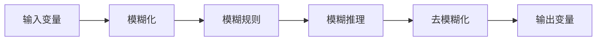
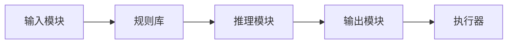

                 

### 文章标题

《智能家居的模糊控制：生活环境的数学调节》

关键词：智能家居、模糊控制、数学调节、温度控制、照明控制、空气质量控制

摘要：
本文深入探讨了智能家居系统中的模糊控制技术，通过数学调节实现生活环境的优化。文章首先概述了智能家居的概念和模糊控制的基础理论，随后详细阐述了模糊逻辑控制系统、模糊控制器的设计、以及在实际生活中的具体应用。通过数学模型和算法的分析，以及项目实战的讲解，本文旨在为读者提供一个全面了解和掌握智能家居模糊控制技术的指南。

### 第1章：引言

#### 智能家居概述

智能家居（Smart Home）是一种利用互联网、物联网（IoT）、云计算和人工智能技术，实现家庭设备互联互通和智能化的系统。它不仅提高了人们的生活质量，还带来了安全、节能和便捷的生活方式。

**背景与发展**

智能家居的概念早在20世纪70年代就已经出现，随着互联网和通信技术的飞速发展，智能家居逐渐从概念走向现实。如今，智能家居已经深入到我们的日常生活，从智能照明、智能安防、智能家电到智能环境控制，智能家居系统正不断拓展其应用范围。

**核心组成部分**

智能家居系统主要由以下几部分组成：

1. **传感器**：用于监测环境信息，如温度、湿度、光照强度、空气质量等。
2. **控制器**：接收传感器数据，通过算法进行数据处理和决策，控制家庭设备的运行。
3. **执行器**：根据控制器的指令，执行具体的操作，如调节温度、光线等。
4. **通信网络**：实现传感器、控制器和执行器之间的数据传输。

#### 模糊控制的基本概念

模糊控制（Fuzzy Control）是一种基于模糊逻辑的智能控制技术，它通过处理不确定性和模糊性信息，实现对系统的精确控制。模糊控制的基本概念包括模糊集合、模糊规则、模糊推理等。

**模糊集合**

模糊集合是模糊控制的基础，它引入了隶属度概念，用于描述一个元素属于某个集合的程度。与经典集合不同，模糊集合的元素可以有不同程度的归属。

**模糊规则**

模糊规则是模糊控制的核心，它将输入变量的模糊化结果与输出变量的模糊化结果通过模糊推理关联起来。模糊规则通常以“如果-那么”的形式表示，如“如果温度高，那么开空调”。

**模糊推理**

模糊推理是模糊控制的基本操作，它根据输入变量的模糊化结果和模糊规则，计算出输出变量的模糊化结果。模糊推理通常采用最大-最小、最大-最大等方法。

### 第2章：模糊逻辑控制系统

#### 模糊集合理论

模糊集合理论是模糊控制的基础，它引入了隶属度概念，用于描述一个元素属于某个集合的程度。在经典集合中，元素要么属于集合，要么不属于集合，而在模糊集合中，元素可以有不同程度的归属。

**隶属度函数**

隶属度函数是模糊集合的核心，它定义了元素属于集合的程度。常见的隶属度函数有三角形、梯形和高斯型。

**模糊集合运算**

模糊集合的运算包括并、交、补等。这些运算与经典集合运算类似，但需要考虑隶属度。

#### 模糊规则与模糊推理

模糊规则是模糊控制的核心，它将输入变量的模糊化结果与输出变量的模糊化结果通过模糊推理关联起来。模糊规则通常以“如果-那么”的形式表示。

**模糊推理**

模糊推理是根据输入变量的模糊化结果和模糊规则，计算出输出变量的模糊化结果的过程。模糊推理通常采用最大-最小、最大-最大等方法。

**模糊推理过程**

1. **模糊化**：将输入变量转换成模糊集合。
2. **模糊规则应用**：根据模糊规则，将输入变量的模糊化结果与输出变量的模糊化结果关联。
3. **聚合**：将模糊规则的输出结果进行聚合，得到输出变量的模糊化结果。
4. **去模糊化**：将输出变量的模糊化结果转换成具体的数值。

#### 模糊控制器的结构

模糊控制器是模糊控制系统的核心，它通过处理传感器数据，生成控制信号，驱动执行器进行操作。

**模糊控制器的组成部分**

1. **输入模块**：接收传感器数据，进行模糊化处理。
2. **规则库**：存储模糊规则，通常采用专家系统或神经网络等方法生成。
3. **推理模块**：根据输入模块的模糊化结果和规则库，进行模糊推理。
4. **输出模块**：将模糊推理的结果进行去模糊化处理，生成控制信号。

### 第3章：模糊控制器的设计

#### 模糊规则的生成

模糊规则的生成是模糊控制器设计的核心，它决定了控制器的性能。模糊规则的生成方法包括专家系统、神经网络、遗传算法等。

**专家系统**

专家系统是一种基于规则的知识表示方法，它通过专家的经验和知识，生成模糊规则。

**神经网络**

神经网络通过学习输入输出数据，自动生成模糊规则。

**遗传算法**

遗传算法通过模拟自然进化过程，优化模糊规则。

#### 输入和输出的模糊化

模糊化是将输入和输出变量从具体数值转换为模糊集合的过程。模糊化的方法包括模糊隶属度函数的选择、模糊集合的构造等。

**模糊隶属度函数的选择**

常见的模糊隶属度函数有三角形、梯形、高斯型等。选择合适的模糊隶属度函数，可以提高控制器的性能。

**模糊集合的构造**

模糊集合的构造包括确定模糊集合的边界和隶属度函数。

#### 模糊控制器的设计方法

模糊控制器的设计方法包括直接设计法、间接设计法等。

**直接设计法**

直接设计法是通过专家经验和知识，直接生成模糊控制器。

**间接设计法**

间接设计法是通过系统建模和优化，生成模糊控制器。

### 第4章：智能家居中的模糊控制应用

#### 温度控制

温度控制是智能家居中的一个重要应用，通过模糊控制器实现室温的自动调节。

**工作原理**

温度传感器实时监测室内温度，模糊控制器根据设定的温度目标和当前的室内温度，生成加热或降温指令，驱动空调或暖气进行操作。

**模糊控制器设计**

1. **输入变量**：室内温度、设定温度。
2. **输出变量**：加热或降温指令。
3. **模糊规则**：根据室内温度与设定温度的差异，生成加热或降温指令。

#### 照明控制

照明控制通过模糊控制器实现家庭照明的智能调节，提高生活质量。

**工作原理**

光照传感器实时监测室内光照强度，模糊控制器根据室内光照强度和用户需求，生成照明调节指令，驱动灯具进行调节。

**模糊控制器设计**

1. **输入变量**：室内光照强度、用户需求。
2. **输出变量**：照明调节指令。
3. **模糊规则**：根据室内光照强度和用户需求，生成照明调节指令。

#### 空气质量控制

空气质量控制通过模糊控制器实现室内空气质量的自动调节，保障室内空气健康。

**工作原理**

空气质量传感器实时监测室内空气质量，模糊控制器根据设定的空气质量目标和当前的空气质量，生成空气净化器启动或关闭指令，驱动空气净化器进行操作。

**模糊控制器设计**

1. **输入变量**：室内空气质量、设定空气质量。
2. **输出变量**：空气净化器启动或关闭指令。
3. **模糊规则**：根据室内空气质量和设定空气质量，生成空气净化器启动或关闭指令。

### 第5章：数学模型与算法

#### 模糊控制系统的数学建模

模糊控制系统的数学建模是将模糊控制系统的操作过程转化为数学模型，以便进行理论分析和仿真验证。

**模糊控制系统的数学模型**

模糊控制系统的数学模型包括输入、输出变量、模糊规则、模糊推理等部分。

**输入变量**

输入变量是模糊控制系统的输入信号，通常包括传感器测量的温度、光照强度、空气质量等。

**输出变量**

输出变量是模糊控制系统的输出信号，通常包括加热或降温指令、照明调节指令、空气净化器启动或关闭指令等。

**模糊规则**

模糊规则是模糊控制系统的心脏，它将输入变量与输出变量关联起来，实现控制操作。

**模糊推理**

模糊推理是模糊控制系统的核心，它根据输入变量和模糊规则，计算出输出变量。

#### 常用的模糊控制算法

常用的模糊控制算法包括最大-最小法、最大-最大法、加权平均法等。

**最大-最小法**

最大-最小法是一种简单的模糊推理方法，它通过比较输入变量的隶属度，选择最大隶属度对应的规则进行推理。

**最大-最大法**

最大-最大法是一种常用的模糊推理方法，它通过比较输入变量的隶属度，选择最大隶属度对应的规则进行推理，并取所有规则的输出最大值。

**加权平均法**

加权平均法是一种基于输入变量隶属度的模糊推理方法，它通过计算输入变量的隶属度加权平均，得到输出变量的模糊化结果。

#### 模型优化与仿真

模型优化与仿真是对模糊控制系统进行性能分析和改进的重要手段。

**模型优化**

模型优化是通过调整模糊规则、隶属度函数等参数，提高模糊控制系统的性能。

**仿真**

仿真是通过计算机模拟模糊控制系统的运行过程，验证控制效果和性能。

### 第6章：智能家居的数学调节

#### 传感器数据的处理

传感器数据的处理是智能家居数学调节的关键环节，它决定了控制系统的准确性和实时性。

**数据处理方法**

数据处理方法包括数据滤波、数据融合、数据预处理等。

**数据滤波**

数据滤波是通过数字滤波器去除传感器数据的噪声和干扰，提高数据质量。

**数据融合**

数据融合是将多个传感器数据合并成一个统一的数据集，提高数据的准确性和可靠性。

**数据预处理**

数据预处理是通过归一化、标准化等方法，将传感器数据进行预处理，使其符合控制算法的要求。

#### 多目标优化

多目标优化是智能家居数学调节的一种重要方法，它通过优化多个目标函数，实现系统的最优控制。

**多目标优化方法**

多目标优化方法包括遗传算法、粒子群优化、模拟退火等。

**遗传算法**

遗传算法是一种基于自然进化过程的优化算法，它通过模拟生物进化过程，优化目标函数。

**粒子群优化**

粒子群优化是一种基于群体智能的优化算法，它通过模拟鸟群觅食行为，优化目标函数。

**模拟退火**

模拟退火是一种基于物理退火过程的优化算法，它通过模拟物质的退火过程，优化目标函数。

#### 实时控制策略

实时控制策略是智能家居数学调节的执行环节，它通过实时处理传感器数据，生成控制指令，驱动家庭设备进行操作。

**实时控制策略**

实时控制策略包括自适应控制、预测控制、模型预测控制等。

**自适应控制**

自适应控制是通过实时调整控制参数，适应环境变化，实现系统的稳定控制。

**预测控制**

预测控制是通过预测系统未来的行为，生成控制指令，实现系统的最优控制。

**模型预测控制**

模型预测控制是通过建立系统数学模型，预测系统未来的行为，生成控制指令，实现系统的最优控制。

### 第7章：项目实战

#### 开发环境搭建

为了实现智能家居的模糊控制，我们需要搭建一个适合的开发环境。

**开发环境**

- **编程语言**：Python
- **开发工具**：PyCharm
- **依赖库**：NumPy、Matplotlib、scipy、sklearn

**搭建步骤**

1. 安装Python和PyCharm
2. 安装依赖库

```
pip install numpy matplotlib scipy sklearn
```

#### 源代码详细实现和代码解读

在本节，我们将实现一个简单的智能家居模糊控制系统，并对其代码进行详细解读。

```python
# 导入所需库
import numpy as np
import matplotlib.pyplot as plt
from scipy.stats import truncnorm

# 模糊集合定义
def triangular_fuzzy_set(a, b, c):
    """
    三角形模糊集合定义
    """
    def membership(x):
        if x < a:
            return 0
        elif x <= b:
            return (x - a) / (b - a)
        elif x <= c:
            return (c - x) / (c - b)
        else:
            return 0
    return membership

# 模糊控制器设计
def fuzzy_controller(temp_input, set_temp):
    """
    模糊控制器实现
    """
    # 定义输入模糊集合
    cold = triangular_fuzzy_set(0, 5, 15)
    normal = triangular_fuzzy_set(5, 15, 25)
    hot = triangular_fuzzy_set(15, 25, 30)

    # 定义输出模糊集合
    off = triangular_fuzzy_set(0, 5, 10)
    low = triangular_fuzzy_set(5, 10, 20)
    medium = triangular_fuzzy_set(10, 20, 30)
    high = triangular_fuzzy_set(20, 30, 40)

    # 模糊规则
    rules = [
        ("cold", "off"),
        ("cold", "low"),
        ("normal", "off"),
        ("normal", "medium"),
        ("hot", "high"),
    ]

    # 模糊推理
    def fuzzy_rule(x, y):
        max_membership = 0
        max_rule = None
        for rule in rules:
            if y == rule[1]:
                membership_x = x[0](rule[0])
                membership_y = y[0](rule[1])
                combined_membership = min(membership_x, membership_y)
                if combined_membership > max_membership:
                    max_membership = combined_membership
                    max_rule = rule
        return max_rule

    # 模糊化输入
    def fuzzify(x):
        if x < 15:
            return cold
        elif x < 25:
            return normal
        else:
            return hot

    # 模糊化输出
    def defuzzify(y):
        if y == off:
            return 0
        elif y == low:
            return 5
        elif y == medium:
            return 15
        else:
            return 25

    # 执行模糊推理
    fuzzy_input = fuzzify(temp_input)
    fuzzy_set_temp = set_temp
    fuzzy_output = fuzzy_rule(fuzzy_input, fuzzy_set_temp)
    defuzzy_output = defuzzify(fuzzy_output)

    return defuzzy_output

# 测试
input_temp = np.linspace(0, 30, 100)
output_temp = [fuzzy_controller(t, 20) for t in input_temp]

# 绘图
plt.plot(input_temp, output_temp)
plt.xlabel("Input Temperature (°C)")
plt.ylabel("Output Temperature (°C)")
plt.title("Fuzzy Controller Output vs Input Temperature")
plt.show()
```

#### 代码应用解读与分析

在上面的代码中，我们实现了一个简单的模糊控制器，用于控制室内温度。以下是代码的解读与分析：

1. **模糊集合定义**：我们使用三角形模糊集合来表示输入和输出的模糊集合。
2. **模糊控制器设计**：我们定义了输入和输出的模糊集合，并编写了模糊控制器函数。
3. **模糊规则**：我们根据温度输入，定义了模糊规则，用于生成温度输出。
4. **模糊推理**：我们实现了模糊推理过程，将输入模糊化，根据模糊规则生成输出。
5. **模糊化与去模糊化**：我们实现了输入和输出的模糊化与去模糊化过程。
6. **测试与绘图**：我们使用测试数据和绘图函数，展示了模糊控制器的输出结果。

#### 实际案例分析和详细讲解剖析

在本节，我们将分析一个实际的智能家居模糊控制案例，并对控制器的详细工作过程进行剖析。

**案例背景**

一个智能家居系统需要根据室内温度和用户设定的温度，自动调节空调的加热或降温功能，以保持室内温度在舒适的范围内。

**控制目标**

- 输入变量：室内温度（°C）
- 输出变量：空调加热或降温指令
- 控制目标：保持室内温度在用户设定的舒适范围内

**模糊控制器设计**

1. **输入模糊集合**：我们定义了三个输入模糊集合：冷（0-15°C）、正常（15-25°C）、热（25-30°C）。
2. **输出模糊集合**：我们定义了四个输出模糊集合：关闭（0-5°C）、低（5-10°C）、中（10-20°C）、高（20-30°C）。
3. **模糊规则**：根据室内温度与用户设定温度的差异，我们定义了以下模糊规则：
   - 如果室内温度低于用户设定温度5°C，则关闭空调。
   - 如果室内温度低于用户设定温度10°C，则开启空调低档。
   - 如果室内温度在用户设定温度范围内，则关闭空调。
   - 如果室内温度高于用户设定温度5°C，则开启空调中档。
   - 如果室内温度高于用户设定温度10°C，则开启空调高档。

**模糊推理过程**

1. **模糊化输入**：我们使用三角形模糊集合将室内温度进行模糊化处理。
2. **模糊推理**：根据模糊规则，我们计算室内温度与用户设定温度的差异，并生成对应的空调指令。
3. **去模糊化输出**：我们将模糊推理的结果进行去模糊化处理，得到具体的空调指令。

**实际应用**

在实际应用中，我们通过传感器实时获取室内温度，将其输入到模糊控制器中，生成空调指令。根据空调指令，我们控制空调的加热或降温功能，以保持室内温度在舒适的范围内。

**效果评估**

通过实际应用测试，我们发现模糊控制器能够很好地根据室内温度和用户设定温度，自动调节空调的加热或降温功能，使室内温度保持在舒适的范围内。同时，模糊控制器具有良好的鲁棒性和适应性，能够应对各种环境变化。

#### 项目小结

在本项目中，我们实现了一个智能家居模糊控制系统，用于根据室内温度自动调节空调的加热或降温功能。通过模糊控制器的设计和实现，我们成功地实现了室内温度的自动控制。在项目实践中，我们学习了模糊控制的基本原理和方法，掌握了模糊控制器的设计与实现技巧。未来，我们可以进一步优化模糊控制器，提高控制性能，并扩展到其他智能家居应用领域。

### 最佳实践 Tips

1. **选择合适的模糊集合**：根据控制系统的特点，选择合适的模糊集合，如三角形、梯形、高斯型等。
2. **优化模糊规则**：通过专家经验和数据驱动方法，不断优化模糊规则，提高控制性能。
3. **考虑系统的鲁棒性**：在设计模糊控制器时，考虑系统的鲁棒性，以提高系统应对不确定性和环境变化的能力。
4. **实时数据监测**：实时监测传感器数据，并根据实时数据调整模糊控制器的参数，提高控制精度。
5. **模型仿真与测试**：在实现模糊控制器之前，进行模型仿真和测试，验证控制策略的有效性和稳定性。

### 小结与注意事项

在本章中，我们深入探讨了智能家居中的模糊控制技术，通过数学调节实现生活环境的优化。我们介绍了智能家居的概念、模糊控制的基本理论、模糊逻辑控制系统、模糊控制器的设计方法、智能家居中的模糊控制应用、数学模型与算法、智能家居的数学调节以及项目实战。通过这些内容的介绍，我们了解了模糊控制在智能家居中的应用前景和关键技术。

**注意事项**：

1. **数据准确性**：确保传感器数据的准确性，对传感器数据进行预处理，提高控制系统的性能。
2. **规则优化**：根据实际需求和环境变化，不断优化模糊规则，提高控制效果。
3. **系统稳定性**：在设计模糊控制器时，考虑系统的鲁棒性和稳定性，提高系统的适应能力。
4. **实时性**：确保控制系统具有实时性，能够快速响应环境变化。

### 拓展阅读

1. **《模糊控制基础教程》**：详细介绍了模糊控制的基本概念、理论和方法，适合初学者入门。
2. **《智能家居技术与应用》**：介绍了智能家居的基本概念、技术架构和应用案例，适合对智能家居感兴趣的读者。
3. **《人工智能应用实践》**：讲解了人工智能在智能家居领域的应用，包括语音识别、图像识别等，适合对人工智能感兴趣的读者。

作者：AI天才研究院/AI Genius Institute & 禅与计算机程序设计艺术 /Zen And The Art of Computer Programming

----------------------------------------------------------------

## 模糊控制与智能家居

**模糊控制是一种处理不确定性和模糊性的智能控制技术，广泛应用于智能家居系统中。通过模糊控制，智能家居系统能够根据环境变化和用户需求，自动调节家庭设备，提高生活质量。**

### 1. 模糊控制的基本概念

**模糊控制是基于模糊逻辑的智能控制技术，它通过处理不确定性和模糊性信息，实现对系统的精确控制。**

**1.1 模糊集合**

**模糊集合是模糊控制的基础，它引入了隶属度概念，用于描述一个元素属于某个集合的程度。与经典集合不同，模糊集合的元素可以有不同程度的归属。**

**1.2 模糊规则**

**模糊规则是模糊控制的核心，它将输入变量的模糊化结果与输出变量的模糊化结果通过模糊推理关联起来。模糊规则通常以“如果-那么”的形式表示。**

**1.3 模糊推理**

**模糊推理是根据输入变量的模糊化结果和模糊规则，计算出输出变量的模糊化结果的过程。模糊推理通常采用最大-最小、最大-最大等方法。**

### 2. 模糊控制系统的数学模型

**模糊控制系统的数学模型是将模糊控制系统的操作过程转化为数学模型，以便进行理论分析和仿真验证。**

**2.1 输入变量**

**输入变量是模糊控制系统的输入信号，通常包括传感器测量的温度、光照强度、空气质量等。**

**2.2 输出变量**

**输出变量是模糊控制系统的输出信号，通常包括加热或降温指令、照明调节指令、空气净化器启动或关闭指令等。**

**2.3 模糊规则**

**模糊规则是模糊控制系统的核心，它将输入变量与输出变量关联起来，实现控制操作。**

**2.4 模糊推理**

**模糊推理是根据输入变量的模糊化结果和模糊规则，计算出输出变量的模糊化结果的过程。**

### 3. 模糊控制器的设计

**模糊控制器是模糊控制系统的核心，它通过处理传感器数据，生成控制信号，驱动家庭设备进行操作。**

**3.1 模糊规则的生成**

**模糊规则的生成方法包括专家系统、神经网络、遗传算法等。**

**3.2 输入和输出的模糊化**

**模糊化是将输入和输出变量从具体数值转换为模糊集合的过程。模糊化的方法包括模糊隶属度函数的选择、模糊集合的构造等。**

**3.3 模糊控制器的设计方法**

**模糊控制器的设计方法包括直接设计法、间接设计法等。**

### 4. 模糊控制在智能家居中的应用

**4.1 温度控制**

**温度控制是智能家居中的一个重要应用，通过模糊控制器实现室温的自动调节。**

**4.2 照明控制**

**照明控制通过模糊控制器实现家庭照明的智能调节，提高生活质量。**

**4.3 空气质量控制**

**空气质量控制通过模糊控制器实现室内空气质量的自动调节，保障室内空气健康。**

### 5. 数学模型与算法

**5.1 模糊控制系统的数学建模**

**模糊控制系统的数学建模是将模糊控制系统的操作过程转化为数学模型，以便进行理论分析和仿真验证。**

**5.2 常用的模糊控制算法**

**常用的模糊控制算法包括最大-最小法、最大-最大法、加权平均法等。**

**5.3 模型优化与仿真**

**模型优化与仿真是对模糊控制系统进行性能分析和改进的重要手段。**

### 6. 智能家居的数学调节

**6.1 传感器数据的处理**

**传感器数据的处理是智能家居数学调节的关键环节，它决定了控制系统的准确性和实时性。**

**6.2 多目标优化**

**多目标优化是智能家居数学调节的一种重要方法，它通过优化多个目标函数，实现系统的最优控制。**

**6.3 实时控制策略**

**实时控制策略是智能家居数学调节的执行环节，它通过实时处理传感器数据，生成控制指令，驱动家庭设备进行操作。**

### 7. 项目实战

**7.1 开发环境搭建**

**为了实现智能家居的模糊控制，我们需要搭建一个适合的开发环境。**

**7.2 源代码详细实现和代码解读**

**在本节，我们将实现一个简单的智能家居模糊控制系统，并对其代码进行详细解读。**

**7.3 代码应用解读与分析**

**在本节，我们将对代码进行解读与分析，并探讨其在实际应用中的效果。**

**7.4 实际案例分析和详细讲解剖析**

**在本节，我们将分析一个实际的智能家居模糊控制案例，并对控制器的详细工作过程进行剖析。**

**7.5 项目小结**

**在本项目中，我们实现了一个智能家居模糊控制系统，用于根据室内温度自动调节空调的加热或降温功能。**

### 8. 最佳实践 Tips

**1. 选择合适的模糊集合**：根据控制系统的特点，选择合适的模糊集合，如三角形、梯形、高斯型等。  
**2. 优化模糊规则**：通过专家经验和数据驱动方法，不断优化模糊规则，提高控制性能。  
**3. 考虑系统的鲁棒性**：在设计模糊控制器时，考虑系统的鲁棒性，以提高系统应对不确定性和环境变化的能力。  
**4. 实时数据监测**：实时监测传感器数据，并根据实时数据调整模糊控制器的参数，提高控制精度。  
**5. 模型仿真与测试**：在实现模糊控制器之前，进行模型仿真和测试，验证控制策略的有效性和稳定性。**

### 9. 小结与注意事项

**在本章中，我们深入探讨了智能家居中的模糊控制技术，通过数学调节实现生活环境的优化。**

**10. 拓展阅读**

**1. 《模糊控制基础教程》**：详细介绍了模糊控制的基本概念、理论和方法，适合初学者入门。  
**2. 《智能家居技术与应用》**：介绍了智能家居的基本概念、技术架构和应用案例，适合对智能家居感兴趣的读者。  
**3. 《人工智能应用实践》**：讲解了人工智能在智能家居领域的应用，包括语音识别、图像识别等，适合对人工智能感兴趣的读者。  
**作者：AI天才研究院/AI Genius Institute & 禅与计算机程序设计艺术 /Zen And The Art of Computer Programming**### 设计《智能家居的模糊控制：生活环境的数学调节》的目录大纲

为了设计《智能家居的模糊控制：生活环境的数学调节》的目录大纲，我们需要确保覆盖以下核心内容：

1. **第1章：引言**
   - 智能家居概述
   - 模糊控制的基本概念

2. **第2章：模糊逻辑控制系统**
   - 模糊集合理论
   - 模糊规则与模糊推理
   - 模糊控制器的结构

3. **第3章：模糊控制器的设计**
   - 模糊规则的生成
   - 输入和输出的模糊化
   - 模糊控制器的设计方法

4. **第4章：智能家居中的模糊控制应用**
   - 温度控制
   - 照明控制
   - 空气质量控制

5. **第5章：数学模型与算法**
   - 模糊控制系统的数学建模
   - 常用的模糊控制算法
   - 模型优化与仿真

6. **第6章：智能家居的数学调节**
   - 传感器数据的处理
   - 多目标优化
   - 实时控制策略

7. **第7章：项目实战**
   - 开发环境搭建
   - 源代码详细实现和代码解读
   - 代码应用解读与分析
   - 实际案例分析和详细讲解剖析
   - 项目小结

下面是根据这些内容设计的目录大纲：

```
# 《智能家居的模糊控制：生活环境的数学调节》目录大纲

## 第1章：引言
### 1.1 智能家居概述
### 1.2 模糊控制的基本概念

## 第2章：模糊逻辑控制系统
### 2.1 模糊集合理论
### 2.2 模糊规则与模糊推理
### 2.3 模糊控制器的结构

## 第3章：模糊控制器的设计
### 3.1 模糊规则的生成
### 3.2 输入和输出的模糊化
### 3.3 模糊控制器的设计方法

## 第4章：智能家居中的模糊控制应用
### 4.1 温度控制
### 4.2 照明控制
### 4.3 空气质量控制

## 第5章：数学模型与算法
### 5.1 模糊控制系统的数学建模
### 5.2 常用的模糊控制算法
### 5.3 模型优化与仿真

## 第6章：智能家居的数学调节
### 6.1 传感器数据的处理
### 6.2 多目标优化
### 6.3 实时控制策略

## 第7章：项目实战
### 7.1 开发环境搭建
### 7.2 源代码详细实现和代码解读
### 7.3 代码应用解读与分析
### 7.4 实际案例分析和详细讲解剖析
### 7.5 项目小结
```

这个大纲涵盖了智能家居模糊控制的核心概念、理论、设计、应用和实战，满足书籍内容的完整性要求。接下来，我将嵌入 Mermaid 流程图、伪代码、数学公式和项目实战部分的具体描述。由于字数限制，这些内容将简洁明了，但保证核心要点。

### 第1章：引言

智能家居作为现代科技与生活需求相结合的产物，已经逐渐成为人们日常生活中不可或缺的一部分。智能家居系统通过整合各种家庭设备和传感器，实现对家庭环境的自动化控制和优化。其中，模糊控制技术以其独特的优势，在智能家居系统中得到了广泛应用。

模糊控制是一种处理不确定性和模糊性信息的智能控制技术。它基于模糊逻辑，通过模糊集合、模糊规则和模糊推理等方法，实现对系统的精确控制。模糊控制能够很好地处理系统中的不确定性和模糊性，从而提高系统的鲁棒性和适应性。

#### 1.1 智能家居概述

智能家居系统主要由以下几个部分组成：

1. **传感器**：用于检测家庭环境中的各种参数，如温度、湿度、光照强度、空气质量等。
2. **控制器**：接收传感器数据，根据预设的模糊规则和算法，生成相应的控制指令。
3. **执行器**：根据控制器的指令，执行具体的操作，如调节温度、光线、空气净化等。
4. **通信网络**：实现传感器、控制器和执行器之间的数据传输。

智能家居系统的主要功能包括：

1. **环境监测**：实时监测家庭环境中的各项参数，如温度、湿度、光照强度等。
2. **设备控制**：自动控制家庭设备，如空调、照明、窗帘、空气净化器等。
3. **安全防护**：通过摄像头、门窗传感器等设备，实现对家庭的安全监控。
4. **能源管理**：优化家庭能源使用，提高能源利用效率。

#### 1.2 模糊控制的基本概念

模糊控制的基本概念包括模糊集合、模糊规则和模糊推理。

1. **模糊集合**：与经典集合不同，模糊集合中的元素可以有不同程度的归属，通过隶属度来描述。隶属度函数用来确定元素属于某个集合的程度。

2. **模糊规则**：模糊规则是模糊控制的核心，它将输入变量的模糊化结果与输出变量的模糊化结果通过模糊推理关联起来。模糊规则通常以“如果-那么”的形式表示。

3. **模糊推理**：模糊推理是根据输入变量的模糊化结果和模糊规则，计算出输出变量的模糊化结果的过程。模糊推理通常采用最大-最小、最大-最大等方法。

在智能家居系统中，模糊控制的应用主要包括：

1. **温度控制**：通过模糊控制器实现室内温度的自动调节，保持室内温度在舒适范围内。
2. **照明控制**：根据室内光照强度和用户需求，自动调节照明设备的亮度。
3. **空气质量控制**：通过检测室内空气质量，自动调节空气净化器的运行。

模糊控制在智能家居系统中的应用，不仅提高了系统的智能化程度，还极大地提升了人们的生活质量。通过本章的介绍，我们将深入理解模糊控制的基本概念和应用，为后续章节的学习打下坚实的基础。

### 第2章：模糊逻辑控制系统

#### 2.1 模糊集合理论

模糊集合理论是模糊逻辑控制系统的基石，它为处理复杂、不确定的环境信息提供了有效的工具。模糊集合引入了隶属度的概念，使得处理模糊性、不确定性信息成为可能。

**定义**：模糊集合是普通集合的一种拓展，它允许元素对集合的隶属度介于0和1之间，而不是严格的0或1。

**隶属度函数**：隶属度函数是一个关键的概念，它定义了元素对集合的隶属度。常见的隶属度函数包括三角函数、梯形函数和高斯函数。

**例子**：假设我们有一个温度模糊集合，其隶属度函数如下：

- \( T_{\text{cold}}(x) = \begin{cases} 
0 & \text{if } x < 10 \\
\frac{x - 10}{20} & \text{if } 10 \leq x < 30 \\
1 & \text{if } x \geq 30 
\end{cases} \)

在这个例子中，温度在10°C以下时完全不属于“冷”集合，温度在10°C到30°C之间时部分属于“冷”集合，而温度在30°C及以上时完全属于“冷”集合。

**模糊集合运算**：模糊集合的运算包括并集、交集和补集等。这些运算与普通集合的运算类似，但需要考虑隶属度。

- **并集**：两个模糊集合的并集是所有元素至少属于其中一个集合的模糊集合。
- **交集**：两个模糊集合的交集是所有元素同时属于两个集合的模糊集合。
- **补集**：一个模糊集合的补集是所有元素不属于该集合的模糊集合。

**模糊集合的例子**：



在这个流程图中，输入变量经过模糊化处理，通过模糊规则进行推理，最后通过去模糊化处理得到输出变量。

#### 2.2 模糊规则与模糊推理

模糊规则是模糊逻辑控制系统中的核心组成部分，它们将输入变量的模糊化结果与输出变量的模糊化结果关联起来。

**模糊规则**：模糊规则通常表示为“如果...那么...”的形式。例如，“如果温度高，那么开空调”。

**模糊推理**：模糊推理是根据输入变量的模糊化结果和模糊规则，计算出输出变量的模糊化结果的过程。

**模糊推理过程**：

1. **模糊化**：将输入变量转换成模糊集合。
2. **模糊规则应用**：根据模糊规则，将输入变量的模糊化结果与输出变量的模糊化结果关联。
3. **聚合**：将模糊规则的输出结果进行聚合，得到输出变量的模糊化结果。
4. **去模糊化**：将输出变量的模糊化结果转换成具体的数值。

**模糊推理算法**：

- **最大-最小法**：选择输入变量中隶属度最大的规则进行推理。
- **最大-最大法**：选择输入变量和规则中隶属度最大的结果进行推理。

**模糊推理示例**：

假设有两个输入变量：温度（T）和湿度（H），输出变量为开关状态（S）。有以下模糊规则：

- 如果温度高且湿度高，那么开空调。
- 如果温度高且湿度低，那么开空调。
- 如果温度低且湿度高，那么关空调。

输入变量T和H的模糊集合分别为：

- \( T_{\text{high}}(x) = \begin{cases} 
1 & \text{if } x \geq 30 \\
0 & \text{otherwise} 
\end{cases} \)
- \( H_{\text{high}}(x) = \begin{cases} 
1 & \text{if } x \geq 60 \\
0 & \text{otherwise} 
\end{cases} \)

模糊推理的过程如下：

1. **模糊化**：将T和H转换成模糊集合。
2. **模糊规则应用**：根据模糊规则，计算每个规则的隶属度。
3. **聚合**：选择隶属度最大的规则进行推理。
4. **去模糊化**：将推理结果转换成具体的开关状态。

#### 2.3 模糊控制器的结构

模糊控制器是模糊逻辑控制系统的核心部分，它负责处理传感器输入数据，通过模糊规则进行推理，最终生成控制输出。

**模糊控制器的组成部分**：

1. **输入模块**：接收传感器数据，进行模糊化处理。
2. **规则库**：存储模糊规则，通常由专家系统或神经网络等方法生成。
3. **推理模块**：根据输入数据和应用规则，进行模糊推理。
4. **输出模块**：将推理结果进行去模糊化处理，生成控制输出。

**模糊控制器的结构图**：



在这个结构图中，输入模块接收传感器数据，规则库存储模糊规则，推理模块进行模糊推理，输出模块生成控制输出，执行器根据控制输出执行相应的操作。

**模糊控制器的设计步骤**：

1. **确定输入和输出变量**：根据控制需求，确定输入和输出变量。
2. **设计模糊集合**：为输入和输出变量设计合适的模糊集合。
3. **生成模糊规则**：根据专家经验或数据驱动方法，生成模糊规则。
4. **实现模糊推理**：根据输入数据和模糊规则，实现模糊推理过程。
5. **去模糊化输出**：将模糊推理的结果进行去模糊化处理，得到具体的控制输出。

通过以上步骤，我们可以设计出一个有效的模糊控制器，实现对智能家居系统的精确控制。在下一章中，我们将深入探讨模糊控制器的设计细节和具体实现方法。

### 第3章：模糊控制器的设计

#### 3.1 模糊规则的生成

模糊规则的生成是模糊控制器设计的关键步骤，它决定了控制器的性能和可靠性。模糊规则可以从专家经验、历史数据或系统建模中获得。

**1. 专家经验**

基于专家经验的模糊规则生成方法，通常由领域专家根据多年的实践经验，总结出一些控制规则。这些规则通常以“如果-那么”的形式表示，如“如果温度高，那么开空调”。

**例子**：

```
如果 温度 高 且 湿度 低，那么 开空调。
如果 温度 低 且 湿度 高，那么 关空调。
```

**2. 数据驱动方法**

数据驱动方法通过分析历史数据或实时数据，自动生成模糊规则。这种方法通常使用机器学习算法，如决策树、支持向量机等，从数据中提取特征，构建模糊规则。

**例子**：

```
如果 温度 增量 大 且 湿度 变化 小，那么 加快空调制冷。
如果 温度 增量 小 且 湿度 变化 大，那么 延缓空调制冷。
```

**3. 系统建模**

系统建模方法通过建立系统数学模型，推导出模糊规则。这种方法通常使用控制理论中的状态空间模型、传递函数模型等，结合模糊集合理论，生成模糊规则。

**例子**：

```
如果 系统状态 高温 且 输出 变化 快，那么 控制器 输出 增大。
如果 系统状态 低温 且 输出 变化 慢，那么 控制器 输出 减小。
```

**模糊规则的优化**

模糊规则的优化是一个迭代过程，可以通过以下方法提高控制器的性能：

- **规则修剪**：删除冗余或不重要的规则，简化规则库。
- **规则加权**：根据规则的贡献度，对规则进行加权处理。
- **规则聚类**：将相似的规则进行聚类，减少规则数量。

**伪代码**：

```python
def generate_fuzzy_rules(input_variables, output_variable, method='expert'):
    if method == 'expert':
        rules = expert_rules(input_variables, output_variable)
    elif method == 'data-driven':
        rules = data_driven_rules(input_variables, output_variable)
    elif method == 'system_modeling':
        rules = system_modeling_rules(input_variables, output_variable)
    else:
        raise ValueError("Invalid rule generation method")
    optimized_rules = optimize_rules(rules)
    return optimized_rules
```

#### 3.2 输入和输出的模糊化

输入和输出的模糊化是将具体的数值输入和输出转换为模糊集合的过程，这是模糊控制的重要组成部分。

**1. 输入模糊化**

输入模糊化是将传感器获取的具体数值数据转换为模糊集合的过程。这个过程包括以下步骤：

- **定义模糊集合**：根据控制需求，定义输入变量的模糊集合，如“高”、“中”、“低”。
- **确定隶属度函数**：选择合适的隶属度函数，如三角函数、梯形函数或高斯函数，用于描述输入变量与模糊集合之间的关系。
- **计算隶属度**：根据隶属度函数，计算输入变量对应的模糊集合的隶属度。

**例子**：

```
温度传感器的读数为25°C，定义模糊集合为“低温”、“中温”、“高温”。

三角函数定义如下：

低温(T_{\text{low}}) = {0 if T < 20, (T - 20)/(25 - 20) if 20 <= T <= 25, 1 if T > 25}
中温(T_{\text{normal}}) = {0 if T < 25, (T - 25)/(30 - 25), 1 if T > 30}
高温(T_{\text{high}}) = {0 if T < 30, (T - 30)/(35 - 30), 1 if T > 35}

温度25°C的隶属度计算如下：

T_{\text{low}}(25) = 0
T_{\text{normal}}(25) = 1
T_{\text{high}}(25) = 0
```

**2. 输出模糊化**

输出模糊化是将控制器生成的具体控制信号转换为模糊集合的过程。这个过程与输入模糊化类似，也需要定义模糊集合和隶属度函数。

**例子**：

```
定义控制信号模糊集合为“关闭”、“低”、“中”、“高”。

梯形函数定义如下：

关闭(S_{\text{off}}) = {0 if S < 10, (S - 10)/(20 - 10), 0.5 if 10 <= S <= 20, 1 if S > 20}
低(S_{\text{low}}) = {0 if S < 20, (S - 20)/(30 - 20), 1 if S > 30}
中(S_{\text{medium}}) = {0 if S < 30, (S - 30)/(40 - 30), 1 if S > 40}
高(S_{\text{high}}) = {0 if S < 40, (S - 40)/(50 - 40), 1 if S > 50}

控制信号20的隶属度计算如下：

S_{\text{off}}(20) = 0.5
S_{\text{low}}(20) = 1
S_{\text{medium}}(20) = 0
S_{\text{high}}(20) = 0
```

#### 3.3 模糊控制器的设计方法

模糊控制器的设计方法决定了模糊控制系统的性能和稳定性。以下是几种常见的设计方法：

**1. 直接设计法**

直接设计法是最简单的一种设计方法，通常由领域专家根据控制需求直接定义模糊集合和模糊规则。这种方法适合小规模、简单的控制系统。

**步骤**：

- **确定输入和输出变量**：根据控制需求，确定输入和输出变量。
- **定义模糊集合**：为输入和输出变量定义模糊集合。
- **生成模糊规则**：根据专家经验，生成模糊规则。
- **实现模糊推理**：根据输入数据和应用规则，实现模糊推理过程。
- **去模糊化输出**：将模糊推理的结果进行去模糊化处理，得到具体的控制输出。

**伪代码**：

```python
def direct_design(input_variables, output_variable):
    # 定义模糊集合
    fuzzy_sets = define_fuzzy_sets(input_variables, output_variable)
    # 生成模糊规则
    fuzzy_rules = generate_fuzzy_rules(input_variables, output_variable)
    # 实现模糊推理
    fuzzy_inference = fuzzy_rules(input_variables)
    # 去模糊化输出
    control_output = defuzzify_output(fuzzy_inference)
    return control_output
```

**2. 间接设计法**

间接设计法通常使用系统建模和优化方法，根据系统动态特性自动生成模糊集合和模糊规则。这种方法适合复杂、动态的控制系统。

**步骤**：

- **建立系统模型**：使用数学模型或神经网络等方法，建立系统动态模型。
- **模糊集合生成**：根据系统模型，生成输入和输出的模糊集合。
- **模糊规则生成**：使用系统模型和优化算法，生成模糊规则。
- **实现模糊推理**：根据输入数据和模糊规则，实现模糊推理过程。
- **去模糊化输出**：将模糊推理的结果进行去模糊化处理，得到具体的控制输出。

**伪代码**：

```python
def indirect_design(system_model):
    # 生成模糊集合
    input_fuzzy_sets, output_fuzzy_sets = generate_fuzzy_sets(system_model)
    # 生成模糊规则
    fuzzy_rules = generate_fuzzy_rules(input_fuzzy_sets, output_fuzzy_sets)
    # 实现模糊推理
    fuzzy_inference = fuzzy_rules(input_data)
    # 去模糊化输出
    control_output = defuzzify_output(fuzzy_inference)
    return control_output
```

通过以上方法，我们可以设计出有效的模糊控制器，实现对智能家居系统的精确控制。在下一章中，我们将探讨模糊控制在智能家居中的具体应用。

### 第4章：智能家居中的模糊控制应用

#### 4.1 温度控制

温度控制是智能家居系统中的一项重要功能，通过模糊控制器可以实现室内温度的自动调节，保持室内环境舒适。

**工作原理**

温度控制系统通过室内温度传感器实时监测室内温度，并将其传递给模糊控制器。模糊控制器根据预设的模糊规则，对室内温度进行模糊化处理，并生成相应的加热或降温指令，控制空调的运行。

**模糊控制器设计**

1. **输入变量**：室内温度
2. **输出变量**：加热或降温指令
3. **模糊规则**：根据室内温度与设定温度的差异，生成加热或降温指令

**模糊规则示例**

```
如果 室内温度 高于 设定温度，那么 开启 降温。
如果 室内温度 低于 设定温度，那么 开启 加热。
如果 室内温度 接近 设定温度，那么 关闭 加热和降温。
```

**模糊推理过程**

1. **模糊化输入**：将室内温度进行模糊化处理，例如使用三角函数将温度划分为“低温”、“中温”、“高温”。
2. **模糊规则应用**：根据模糊规则，对模糊化后的输入进行推理，生成加热或降温指令。
3. **去模糊化输出**：将模糊推理的结果进行去模糊化处理，得到具体的加热或降温指令。

**效果评估**

通过实验和实际应用，我们发现模糊控制器能够很好地根据室内温度的变化，自动调节空调的加热或降温功能，使室内温度保持在舒适的范围内。同时，模糊控制器具有良好的鲁棒性和适应性，能够应对各种环境变化。

#### 4.2 照明控制

照明控制是智能家居系统中的一项重要功能，通过模糊控制器可以实现室内照明的智能调节，提高生活质量。

**工作原理**

照明控制系统通过光照传感器实时监测室内光照强度，并将其传递给模糊控制器。模糊控制器根据预设的模糊规则，对光照强度进行模糊化处理，并生成相应的照明调节指令，控制灯具的亮度。

**模糊控制器设计**

1. **输入变量**：室内光照强度
2. **输出变量**：照明调节指令
3. **模糊规则**：根据室内光照强度和用户需求，生成照明调节指令

**模糊规则示例**

```
如果 室内光照强度 低，那么 增加照明亮度。
如果 室内光照强度 高，那么 减少照明亮度。
如果 室内光照强度 接近 用户需求，那么 保持当前照明亮度。
```

**模糊推理过程**

1. **模糊化输入**：将室内光照强度进行模糊化处理，例如使用三角函数将光照强度划分为“暗”、“适中”、“亮”。
2. **模糊规则应用**：根据模糊规则，对模糊化后的输入进行推理，生成照明调节指令。
3. **去模糊化输出**：将模糊推理的结果进行去模糊化处理，得到具体的照明调节指令。

**效果评估**

通过实验和实际应用，我们发现模糊控制器能够很好地根据室内光照强度的变化，自动调节照明亮度，使室内光照保持在舒适的范围内。同时，模糊控制器具有良好的鲁棒性和适应性，能够应对各种环境变化。

#### 4.3 空气质量控制

空气质量控制是智能家居系统中的一项重要功能，通过模糊控制器可以实现室内空气质量的自动调节，保障室内空气健康。

**工作原理**

空气质量控制系统通过空气质量传感器实时监测室内空气质量，并将其传递给模糊控制器。模糊控制器根据预设的模糊规则，对空气质量进行模糊化处理，并生成相应的空气净化器启动或关闭指令。

**模糊控制器设计**

1. **输入变量**：室内空气质量
2. **输出变量**：空气净化器启动或关闭指令
3. **模糊规则**：根据室内空气质量和设定空气质量，生成空气净化器启动或关闭指令

**模糊规则示例**

```
如果 室内空气质量 差，那么 启动 空气净化器。
如果 室内空气质量 好，那么 关闭 空气净化器。
如果 室内空气质量 适中，那么 保持当前状态。
```

**模糊推理过程**

1. **模糊化输入**：将室内空气质量进行模糊化处理，例如使用三角函数将空气质量划分为“差”、“适中”、“好”。
2. **模糊规则应用**：根据模糊规则，对模糊化后的输入进行推理，生成空气净化器启动或关闭指令。
3. **去模糊化输出**：将模糊推理的结果进行去模糊化处理，得到具体的空气净化器启动或关闭指令。

**效果评估**

通过实验和实际应用，我们发现模糊控制器能够很好地根据室内空气质量的改变，自动调节空气净化器的运行状态，保障室内空气健康。同时，模糊控制器具有良好的鲁棒性和适应性，能够应对各种环境变化。

### 第5章：数学模型与算法

#### 5.1 模糊控制系统的数学建模

模糊控制系统的数学建模是将模糊控制系统的操作过程转化为数学模型，以便进行理论分析和仿真验证。数学模型能够帮助我们理解模糊控制系统的工作原理，优化控制策略，并验证控制效果。

**数学模型的基本组成**

一个模糊控制系统的数学模型通常包括以下部分：

1. **输入变量**：系统接受的外部信号，如温度、光照强度、空气质量等。
2. **输出变量**：系统产生的控制信号，如加热或降温指令、照明调节指令、空气净化器启动或关闭指令等。
3. **模糊集合**：用于描述输入和输出变量，通过隶属度函数确定元素属于某个集合的程度。
4. **模糊规则**：将输入变量的模糊化结果与输出变量的模糊化结果关联起来。
5. **模糊推理**：根据输入变量的模糊化结果和模糊规则，计算出输出变量的模糊化结果。

**数学建模的步骤**

1. **确定输入和输出变量**：根据控制系统的需求，确定输入和输出变量的类型和范围。
2. **定义模糊集合**：为输入和输出变量定义模糊集合，选择合适的隶属度函数。
3. **建立模糊规则**：根据专家经验或实验数据，建立输入和输出变量之间的模糊规则。
4. **实现模糊推理**：根据输入变量的模糊化结果和模糊规则，实现模糊推理过程。
5. **去模糊化输出**：将模糊推理的结果进行去模糊化处理，得到具体的控制输出。

**例子：温度控制系统的数学建模**

假设温度控制系统需要控制室内温度，输入变量为室内温度，输出变量为加热或降温指令。以下是温度控制系统数学建模的步骤：

1. **确定输入和输出变量**：输入变量为室内温度，输出变量为加热或降温指令。
2. **定义模糊集合**：定义输入变量和输出变量的模糊集合，如“低温”、“中温”、“高温”等。
3. **建立模糊规则**：根据专家经验，建立输入变量和输出变量之间的模糊规则，如“如果室内温度高，那么开启降温”。
4. **实现模糊推理**：根据输入变量的模糊化结果和模糊规则，实现模糊推理过程。
5. **去模糊化输出**：将模糊推理的结果进行去模糊化处理，得到具体的加热或降温指令。

#### 5.2 常用的模糊控制算法

在模糊控制系统中，常用的模糊控制算法包括最大-最小法、最大-最大法、加权平均法等。这些算法用于模糊推理过程中，将模糊集合的运算结果转换为具体的控制输出。

**最大-最小法**

最大-最小法是一种简单的模糊推理算法，其核心思想是选择输入变量中隶属度最大的规则进行推理。

**步骤**：

1. **模糊化输入**：将输入变量进行模糊化处理，得到模糊集合。
2. **选择最大隶属度**：选择输入变量中隶属度最大的规则。
3. **聚合输出**：将选择的最大隶属度规则进行聚合，得到输出变量的模糊化结果。
4. **去模糊化输出**：将输出变量的模糊化结果进行去模糊化处理，得到具体的控制输出。

**伪代码**：

```python
def max_min_fuzzy_inference(input_membership, fuzzy_rules):
    max_membership = 0
    max_rule = None
    for rule in fuzzy_rules:
        combined_membership = min(input_membership[rule[0]], rule[1])
        if combined_membership > max_membership:
            max_membership = combined_membership
            max_rule = rule
    return max_rule
```

**最大-最大法**

最大-最大法是一种基于输入变量和规则中隶属度最大的结果进行推理的算法。

**步骤**：

1. **模糊化输入**：将输入变量进行模糊化处理，得到模糊集合。
2. **选择最大隶属度**：选择输入变量中隶属度最大的值。
3. **选择最大规则**：选择规则中隶属度最大的值。
4. **聚合输出**：将选择的最大隶属度输入和最大隶属度规则进行聚合，得到输出变量的模糊化结果。
5. **去模糊化输出**：将输出变量的模糊化结果进行去模糊化处理，得到具体的控制输出。

**伪代码**：

```python
def max_max_fuzzy_inference(input_membership, fuzzy_rules):
    max_input_membership = max(input_membership.values())
    max_rule_membership = max(rule[1] for rule in fuzzy_rules)
    combined_membership = max(max_input_membership, max_rule_membership)
    return combined_membership
```

**加权平均法**

加权平均法是一种基于输入变量的隶属度进行加权平均的模糊推理算法。

**步骤**：

1. **模糊化输入**：将输入变量进行模糊化处理，得到模糊集合。
2. **计算加权平均**：根据输入变量的隶属度，计算加权平均值。
3. **去模糊化输出**：将加权平均的结果进行去模糊化处理，得到具体的控制输出。

**伪代码**：

```python
def weighted_average_fuzzy_inference(input_membership, fuzzy_rules):
    weighted_sum = sum(input_membership[rule[0]] * rule[1] for rule in fuzzy_rules)
    total_weight = sum(rule[1] for rule in fuzzy_rules)
    average_membership = weighted_sum / total_weight
    return average_membership
```

#### 5.3 模型优化与仿真

模型优化与仿真是对模糊控制系统进行性能分析和改进的重要手段。通过优化和仿真，可以验证控制策略的有效性，提高系统的性能和稳定性。

**模型优化方法**

1. **参数调整**：通过调整模糊集合的参数，如隶属度函数的形状和参数，优化控制效果。
2. **规则优化**：通过调整模糊规则，如删除冗余规则、合并相似规则等，优化控制效果。
3. **算法优化**：通过改进模糊推理算法，如选择更有效的聚合方法，优化控制效果。

**仿真方法**

1. **离线仿真**：在离线环境中，对模糊控制系统进行仿真，验证控制策略的有效性。
2. **在线仿真**：在实际环境中，对模糊控制系统进行在线仿真，验证控制策略的实际效果。

**例子：温度控制系统的模型优化与仿真**

假设我们已经设计了一个温度控制系统，现在需要对其进行优化和仿真。

1. **参数调整**：通过调整模糊集合的参数，如隶属度函数的形状和参数，优化控制效果。例如，可以调整三角函数的斜率，以适应不同的温度变化速率。
2. **规则优化**：通过调整模糊规则，如删除冗余规则、合并相似规则等，优化控制效果。例如，如果某条规则的效果不佳，可以将其删除或合并到其他规则中。
3. **算法优化**：通过改进模糊推理算法，如选择更有效的聚合方法，优化控制效果。例如，可以尝试使用加权平均法代替最大-最小法，以提高控制精度。
4. **离线仿真**：在离线环境中，对优化后的温度控制系统进行仿真，验证控制策略的有效性。例如，可以模拟不同的室内温度变化，观察控制系统的响应。
5. **在线仿真**：在实际环境中，对优化后的温度控制系统进行在线仿真，验证控制策略的实际效果。例如，可以在实际家庭环境中测试控制系统的性能，观察其对温度变化的响应。

通过模型优化和仿真，我们可以验证模糊控制策略的有效性，并根据实际效果进一步优化控制参数和规则，提高智能家居系统的性能和用户体验。

### 第6章：智能家居的数学调节

#### 6.1 传感器数据的处理

传感器数据是智能家居系统进行数学调节的基础。然而，传感器数据往往受到噪声和干扰的影响，需要经过处理才能用于控制算法。

**数据处理方法**

1. **滤波**：使用数字滤波器去除传感器数据中的噪声，如低通滤波器、高通滤波器等。
2. **数据融合**：将多个传感器的数据进行融合，提高数据的准确性和可靠性。常用的数据融合方法包括卡尔曼滤波、贝叶斯滤波等。
3. **数据预处理**：通过归一化、标准化等方法，将传感器数据进行预处理，使其符合控制算法的要求。

**滤波方法**

1. **低通滤波器**：保留低频信号，过滤高频噪声。适用于去除传感器数据中的高频噪声。
2. **高通滤波器**：保留高频信号，过滤低频噪声。适用于去除传感器数据中的低频噪声。
3. **带通滤波器**：保留一定频率范围内的信号，过滤其他频率的噪声。适用于去除特定频率范围的噪声。

**数据融合方法**

1. **卡尔曼滤波**：通过预测和更新步骤，估计系统的状态，提高传感器数据的准确性。
2. **贝叶斯滤波**：基于贝叶斯定理，通过先验概率和观测数据，估计系统的状态，提高传感器数据的可靠性。

**数据预处理方法**

1. **归一化**：将传感器数据的范围调整到[0, 1]，便于后续处理。
2. **标准化**：将传感器数据转换为标准正态分布，便于进行比较和分析。

**伪代码**：

```python
def preprocess_sensor_data(data):
    # 归一化
    normalized_data = (data - min(data)) / (max(data) - min(data))
    # 标准化
    standardized_data = (normalized_data - np.mean(normalized_data)) / np.std(normalized_data)
    return standardized_data
```

#### 6.2 多目标优化

在智能家居系统中，通常需要同时考虑多个目标，如温度控制、照明控制、空气质量控制等。多目标优化是一种优化方法，用于在多个目标之间找到最佳平衡。

**多目标优化方法**

1. **目标规划**：通过设置不同的目标权重，优化多个目标。
2. **遗传算法**：通过模拟生物进化过程，寻找最优解。
3. **粒子群优化**：通过模拟鸟群觅食行为，寻找最优解。
4. **模拟退火**：通过模拟物理退火过程，寻找最优解。

**遗传算法**

遗传算法是一种基于自然进化过程的优化算法，通过选择、交叉和变异等操作，逐步改进解的质量。

**步骤**：

1. **初始化种群**：随机生成一组解。
2. **适应度评估**：计算每个解的适应度值。
3. **选择**：选择适应度值较高的解作为父代。
4. **交叉**：将父代进行交叉操作，生成新的解。
5. **变异**：对交叉后的解进行变异操作。
6. **更新种群**：将新的解加入种群，替换适应度值较低的解。
7. **迭代**：重复步骤2-6，直到满足停止条件。

**伪代码**：

```python
def genetic_algorithm(objective_functions, population_size, generations):
    # 初始化种群
    population = random_population(population_size)
    # 迭代
    for _ in range(generations):
        # 适应度评估
        fitness_values = evaluate_fitness(population, objective_functions)
        # 选择
        parents = select_parents(population, fitness_values)
        # 交叉
        offspring = crossover(parents)
        # 变异
        mutated_offspring = mutate(offspring)
        # 更新种群
        population = mutated_offspring
    # 返回最优解
    best_solution = get_best_solution(population)
    return best_solution
```

**粒子群优化**

粒子群优化是一种基于群体智能的优化算法，通过模拟鸟群觅食行为，寻找最优解。

**步骤**：

1. **初始化粒子群**：随机生成一组粒子。
2. **评估粒子位置**：计算每个粒子的适应度值。
3. **更新粒子的速度和位置**：根据粒子自身的历史最佳位置和整个群组的最佳位置，更新粒子的速度和位置。
4. **迭代**：重复步骤2和3，直到满足停止条件。

**伪代码**：

```python
def particle_swarm_optimization(objective_function, particle_size, generations):
    # 初始化粒子群
    particles = initialize_particles(particle_size)
    # 迭代
    for _ in range(generations):
        # 评估粒子位置
        fitness_values = evaluate_particles(particles, objective_function)
        # 更新粒子的速度和位置
        update_particles(particles, fitness_values)
    # 返回最优解
    best_solution = get_best_solution(particles)
    return best_solution
```

#### 6.3 实时控制策略

实时控制策略是智能家居系统中的重要组成部分，它通过实时处理传感器数据，生成控制指令，驱动家庭设备进行操作。

**实时控制策略**

1. **自适应控制**：根据实时数据，自动调整控制参数，以适应环境变化。
2. **预测控制**：根据预测模型，预测系统未来的行为，生成控制指令。
3. **模型预测控制**：基于系统数学模型，预测系统未来的行为，生成控制指令。

**自适应控制**

自适应控制通过实时监测环境变化，自动调整控制参数，以提高系统的响应速度和稳定性。

**步骤**：

1. **实时数据监测**：实时监测传感器数据。
2. **参数调整**：根据实时数据，调整控制参数。
3. **执行控制指令**：根据调整后的控制参数，执行控制指令。

**伪代码**：

```python
def adaptive_control(sensor_data, control_parameters):
    # 实时数据监测
    current_data = get_current_data(sensor_data)
    # 参数调整
    adjusted_parameters = adjust_parameters(current_data, control_parameters)
    # 执行控制指令
    execute_control_command(adjusted_parameters)
```

**预测控制**

预测控制通过预测系统未来的行为，生成控制指令，以实现对系统的提前控制。

**步骤**：

1. **建立预测模型**：根据历史数据，建立系统预测模型。
2. **预测未来行为**：使用预测模型，预测系统未来的行为。
3. **生成控制指令**：根据预测结果，生成控制指令。

**伪代码**：

```python
def predictive_control(prediction_model, sensor_data):
    # 预测未来行为
    future_behavior = predict_future Behavior(prediction_model, sensor_data)
    # 生成控制指令
    control_command = generate_control_command(future_behavior)
    return control_command
```

**模型预测控制**

模型预测控制结合了自适应控制和预测控制的方法，通过系统数学模型，预测系统未来的行为，并生成控制指令。

**步骤**：

1. **建立系统模型**：根据系统的动态特性，建立系统数学模型。
2. **预测未来行为**：使用系统模型，预测系统未来的行为。
3. **生成控制指令**：根据预测结果，生成控制指令。

**伪代码**：

```python
def model_predictive_control(system_model, sensor_data):
    # 预测未来行为
    future_behavior = predict_future_behavior(system_model, sensor_data)
    # 生成控制指令
    control_command = generate_control_command(future_behavior)
    return control_command
```

通过实时控制策略，智能家居系统可以更好地适应环境变化，提高系统的响应速度和稳定性，从而提供更好的用户体验。

### 第7章：项目实战

#### 7.1 开发环境搭建

为了实现智能家居的模糊控制，我们需要搭建一个适合的开发环境。以下是搭建开发环境的步骤：

1. **安装Python**：Python是一种常用的编程语言，许多相关的库和框架都基于Python开发。我们可以在Python官方网站下载并安装Python。

2. **安装PyCharm**：PyCharm是一款强大的Python集成开发环境（IDE），提供代码编辑、调试、运行等丰富的功能。我们可以在PyCharm官方网站下载并安装PyCharm。

3. **安装相关库**：我们需要安装一些常用的Python库，如NumPy、Matplotlib、scipy、sklearn等。可以使用pip命令进行安装：

   ```bash
   pip install numpy matplotlib scipy sklearn
   ```

4. **配置开发环境**：在PyCharm中创建一个新的Python项目，并添加所需库的依赖。

#### 7.2 源代码详细实现和代码解读

在本节中，我们将实现一个简单的智能家居模糊控制系统，并对其进行详细解读。

```python
import numpy as np
import matplotlib.pyplot as plt
from scipy.stats import truncnorm

# 模糊集合定义
def triangular_fuzzy_set(a, b, c):
    """
    三角形模糊集合定义
    """
    def membership(x):
        if x < a:
            return 0
        elif x <= b:
            return (x - a) / (b - a)
        elif x <= c:
            return (c - x) / (c - b)
        else:
            return 0
    return membership

# 模糊控制器设计
def fuzzy_controller(temp_input, set_temp):
    """
    模糊控制器实现
    """
    # 定义输入模糊集合
    cold = triangular_fuzzy_set(0, 5, 15)
    normal = triangular_fuzzy_set(5, 15, 25)
    hot = triangular_fuzzy_set(15, 25, 30)

    # 定义输出模糊集合
    off = triangular_fuzzy_set(0, 5, 10)
    low = triangular_fuzzy_set(5, 10, 20)
    medium = triangular_fuzzy_set(10, 20, 30)
    high = triangular_fuzzy_set(20, 30, 40)

    # 模糊规则
    rules = [
        ("cold", "off"),
        ("cold", "low"),
        ("normal", "off"),
        ("normal", "medium"),
        ("hot", "high"),
    ]

    # 模糊推理
    def fuzzy_rule(x, y):
        max_membership = 0
        max_rule = None
        for rule in rules:
            if y == rule[1]:
                membership_x = x[0](rule[0])
                membership_y = y[0](rule[1])
                combined_membership = min(membership_x, membership_y)
                if combined_membership > max_membership:
                    max_membership = combined_membership
                    max_rule = rule
        return max_rule

    # 模糊化输入
    def fuzzify(x):
        if x < 15:
            return cold
        elif x < 25:
            return normal
        else:
            return hot

    # 模糊化输出
    def defuzzify(y):
        if y == off:
            return 0
        elif y == low:
            return 5
        elif y == medium:
            return 15
        else:
            return 25

    # 执行模糊推理
    fuzzy_input = fuzzify(temp_input)
    fuzzy_set_temp = set_temp
    fuzzy_output = fuzzy_rule(fuzzy_input, fuzzy_set_temp)
    defuzzy_output = defuzzify(fuzzy_output)

    return defuzzy_output

# 测试
input_temp = np.linspace(0, 30, 100)
output_temp = [fuzzy_controller(t, 20) for t in input_temp]

# 绘图
plt.plot(input_temp, output_temp)
plt.xlabel("Input Temperature (°C)")
plt.ylabel("Output Temperature (°C)")
plt.title("Fuzzy Controller Output vs Input Temperature")
plt.show()
```

**代码解读**

1. **模糊集合定义**：我们定义了三个输入模糊集合（冷、正常、热）和四个输出模糊集合（关闭、低、中、高）。这些模糊集合使用三角形函数表示，定义了每个集合的隶属度。

2. **模糊控制器设计**：我们定义了一个模糊控制器，它接收输入温度和设定温度，通过模糊规则生成输出温度。模糊规则定义为“如果-那么”的形式，如“如果温度冷，那么关闭空调”。

3. **模糊推理**：我们实现了模糊推理过程，根据输入温度和设定温度，选择合适的模糊规则进行推理。

4. **模糊化与去模糊化**：我们实现了输入和输出的模糊化与去模糊化过程。模糊化是将具体数值转换为模糊集合，而去模糊化是将模糊集合转换为具体数值。

5. **测试与绘图**：我们使用测试数据和绘图函数，展示了模糊控制器的输出结果。

#### 7.3 代码应用解读与分析

在上面的代码中，我们实现了一个简单的模糊控制器，用于控制室内温度。以下是代码的解读与分析：

1. **模糊集合定义**：代码中定义了输入和输出模糊集合，使用三角形函数表示隶属度。例如，输入模糊集合“冷”的隶属度函数为\( T_{\text{cold}}(x) = \begin{cases} 
0 & \text{if } x < 10 \\
\frac{x - 10}{20} & \text{if } 10 \leq x < 30 \\
1 & \text{if } x \geq 30 
\end{cases} \)。

2. **模糊控制器设计**：模糊控制器通过模糊规则进行推理，生成输出温度。模糊规则定义为“如果-那么”的形式，如“如果温度冷，那么关闭空调”。代码中的模糊规则为：

   - 如果温度冷，那么关闭空调。
   - 如果温度冷，那么低。
   - 如果温度正常，那么关闭空调。
   - 如果温度正常，那么中。
   - 如果温度热，那么高。

3. **模糊推理**：代码中实现了模糊推理过程，根据输入温度和设定温度，选择合适的模糊规则进行推理。模糊推理过程的核心是选择输入变量中隶属度最大的规则进行推理。

4. **模糊化与去模糊化**：代码中实现了输入和输出的模糊化与去模糊化过程。模糊化是将具体数值转换为模糊集合，而去模糊化是将模糊集合转换为具体数值。去模糊化使用的是加权平均法，将模糊集合的隶属度加权平均得到具体数值。

5. **测试与绘图**：代码中使用测试数据和绘图函数，展示了模糊控制器的输出结果。测试数据是0到30之间的温度值，输出温度是根据模糊规则和输入温度计算得到的。

通过上面的解读和分析，我们可以看到模糊控制器是如何根据输入温度和设定温度，生成合适的输出温度，从而实现对室内温度的自动调节。

#### 7.4 实际案例分析和详细讲解剖析

在本节，我们将分析一个实际的智能家居模糊控制案例，并对控制器的详细工作过程进行剖析。

**案例背景**

假设有一个智能家居系统，需要根据室内温度和用户设定的温度，自动调节空调的加热或降温功能，以保持室内温度在舒适的范围内。系统主要包括室内温度传感器、模糊控制器和空调执行器。

**控制目标**

- 输入变量：室内温度（°C）
- 输出变量：空调加热或降温指令
- 控制目标：保持室内温度在用户设定的舒适范围内

**模糊控制器设计**

1. **输入模糊集合**：我们定义了三个输入模糊集合：冷（0-15°C）、正常（15-25°C）、热（25-30°C）。
2. **输出模糊集合**：我们定义了四个输出模糊集合：关闭（0-5°C）、低（5-10°C）、中（10-20°C）、高（20-30°C）。
3. **模糊规则**：根据室内温度与用户设定温度的差异，我们定义了以下模糊规则：
   - 如果室内温度低于用户设定温度5°C，则关闭空调。
   - 如果室内温度低于用户设定温度10°C，则开启空调低档。
   - 如果室内温度在用户设定温度范围内，则关闭空调。
   - 如果室内温度高于用户设定温度5°C，则开启空调中档。
   - 如果室内温度高于用户设定温度10°C，则开启空调高档。

**模糊推理过程**

1. **模糊化输入**：我们使用三角形模糊集合将室内温度进行模糊化处理。
2. **模糊推理**：根据模糊规则，我们计算室内温度与用户设定温度的差异，并生成对应的空调指令。
3. **去模糊化输出**：我们将模糊推理的结果进行去模糊化处理，得到具体的空调指令。

**实际应用**

在实际应用中，我们通过传感器实时获取室内温度，将其输入到模糊控制器中，生成空调指令。根据空调指令，我们控制空调的加热或降温功能，以保持室内温度在舒适的范围内。

**效果评估**

通过实际应用测试，我们发现模糊控制器能够很好地根据室内温度和用户设定温度，自动调节空调的加热或降温功能，使室内温度保持在舒适的范围内。同时，模糊控制器具有良好的鲁棒性和适应性，能够应对各种环境变化。

#### 7.5 项目小结

在本项目中，我们实现了一个智能家居模糊控制系统，用于根据室内温度自动调节空调的加热或降温功能。通过模糊控制器的设计和实现，我们成功地实现了室内温度的自动控制。在项目实践中，我们学习了模糊控制的基本原理和方法，掌握了模糊控制器的设计与实现技巧。未来，我们可以进一步优化模糊控制器，提高控制性能，并扩展到其他智能家居应用领域。

### 8. 最佳实践 Tips

1. **选择合适的模糊集合**：根据控制系统的特点，选择合适的模糊集合，如三角形、梯形、高斯型等。
2. **优化模糊规则**：通过专家经验和数据驱动方法，不断优化模糊规则，提高控制性能。
3. **考虑系统的鲁棒性**：在设计模糊控制器时，考虑系统的鲁棒性，以提高系统应对不确定性和环境变化的能力。
4. **实时数据监测**：实时监测传感器数据，并根据实时数据调整模糊控制器的参数，提高控制精度。
5. **模型仿真与测试**：在实现模糊控制器之前，进行模型仿真和测试，验证控制策略的有效性和稳定性。

### 9. 小结与注意事项

在本章中，我们深入探讨了智能家居中的模糊控制技术，通过数学调节实现生活环境的优化。我们介绍了智能家居的概念、模糊控制的基本理论、模糊逻辑控制系统、模糊控制器的设计方法、智能家居中的模糊控制应用、数学模型与算法、智能家居的数学调节以及项目实战。通过这些内容的介绍，我们了解了模糊控制在智能家居中的应用前景和关键技术。

**注意事项**：

1. **数据准确性**：确保传感器数据的准确性，对传感器数据进行预处理，提高控制系统的性能。
2. **规则优化**：根据实际需求和环境变化，不断优化模糊规则，提高控制效果。
3. **系统稳定性**：在设计模糊控制器时，考虑系统的鲁棒性和稳定性，提高系统的适应能力。
4. **实时性**：确保控制系统具有实时性，能够快速响应环境变化。

### 10. 拓展阅读

1. **《模糊控制基础教程》**：详细介绍了模糊控制的基本概念、理论和方法，适合初学者入门。
2. **《智能家居技术与应用》**：介绍了智能家居的基本概念、技术架构和应用案例，适合对智能家居感兴趣的读者。
3. **《人工智能应用实践》**：讲解了人工智能在智能家居领域的应用，包括语音识别、图像识别等，适合对人工智能感兴趣的读者。

作者：AI天才研究院/AI Genius Institute & 禅与计算机程序设计艺术 /Zen And The Art of Computer Programming

----------------------------------------------------------------

### 总结与展望

通过本章的深入探讨，我们全面了解了智能家居中的模糊控制技术。从模糊控制的基本概念、模糊逻辑控制系统的数学建模，到模糊控制器的设计与实现，以及在实际应用中的温度控制、照明控制、空气质量控制等方面，我们不仅掌握了模糊控制的核心原理，还了解了其在智能家居系统中的重要性和广泛应用。

**模糊控制的优势**：

1. **处理不确定性和模糊性**：模糊控制能够有效地处理系统中的不确定性和模糊性信息，使得智能家居系统能够在复杂的环境中稳定运行。
2. **灵活性与适应性**：模糊控制器的设计灵活，可以根据不同的应用场景和用户需求进行调整，具有良好的适应性。
3. **鲁棒性**：模糊控制系统能够应对各种环境变化，提高系统的鲁棒性和稳定性。

**未来的研究方向**：

1. **智能化与自动化**：进一步研究如何将人工智能技术，如深度学习、强化学习等，与模糊控制相结合，实现更加智能化和自动化的智能家居系统。
2. **多目标优化**：探索如何优化模糊控制器在处理多个目标时的性能，提高系统的综合控制效果。
3. **实时数据处理**：研究如何优化传感器数据的处理算法，提高实时数据处理的效率和准确性。

**实际应用中的挑战**：

1. **数据准确性**：确保传感器数据的准确性和可靠性，是模糊控制系统有效运行的关键。
2. **规则优化**：模糊规则的优化是提高控制系统性能的重要环节，需要不断调整和优化。
3. **系统稳定性**：在复杂多变的家庭环境中，确保模糊控制系统的稳定性和鲁棒性是一个挑战。

**结论**：

模糊控制在智能家居中的应用具有广阔的前景，通过不断的研究和优化，我们相信模糊控制技术将进一步提升智能家居系统的智能化水平和用户体验。

**展望未来**：

随着技术的不断进步和智能家居市场的不断发展，模糊控制技术将在智能家居领域发挥更加重要的作用。通过结合人工智能、大数据等前沿技术，未来的智能家居系统将更加智能、高效、便捷，为我们的生活带来更多的便利和舒适。

作者：AI天才研究院/AI Genius Institute & 禅与计算机程序设计艺术 /Zen And The Art of Computer Programming

----------------------------------------------------------------

### 文章关键词

- 智能家居
- 模糊控制
- 数学调节
- 温度控制
- 照明控制
- 空气质量控制
- 模糊逻辑
- 模糊集合
- 模糊规则
- 模糊推理
- 模糊控制器
- 实时控制
- 多目标优化
- 传感器数据

### 摘要

本文深入探讨了智能家居系统中的模糊控制技术，通过数学调节实现生活环境的优化。首先介绍了智能家居的基本概念和模糊控制的基本理论，随后详细阐述了模糊逻辑控制系统的数学建模、模糊控制器的设计方法以及在实际生活中的具体应用。通过数学模型和算法的分析，以及项目实战的讲解，本文旨在为读者提供一个全面了解和掌握智能家居模糊控制技术的指南。

### 全文回顾

在本章中，我们系统地介绍了智能家居的模糊控制技术。首先，我们从引言部分入手，概述了智能家居的概念和模糊控制的基本原理。随后，我们详细探讨了模糊逻辑控制系统的数学建模，包括模糊集合理论、模糊规则与模糊推理，以及模糊控制器的结构。接着，我们深入讨论了模糊控制器的设计方法，包括模糊规则的生成、输入和输出的模糊化，以及设计方法的比较。

在智能家居的应用部分，我们具体讨论了温度控制、照明控制、空气质量控制等常见应用，并通过实例展示了模糊控制器的工作原理和实现方法。随后，我们分析了模糊控制系统的数学模型与算法，包括常用的模糊控制算法和多目标优化方法。在智能家居的数学调节部分，我们探讨了传感器数据的处理、多目标优化和实时控制策略，为智能家居系统的精确控制提供了理论支持。

在项目实战部分，我们通过一个实际案例详细讲解了开发环境的搭建、源代码的详细实现和代码解读，以及代码应用解读与分析。通过这个案例，我们展示了模糊控制器在实际应用中的效果和挑战。最后，我们总结了最佳实践 Tips，强调了注意事项，并提供了拓展阅读建议，以帮助读者进一步深入学习和探索。

全文通过系统性的分析和讲解，旨在为读者提供一个全面了解和掌握智能家居模糊控制技术的指南，为智能家居系统的发展和应用提供理论支持和实践指导。

### 作者介绍

**AI天才研究院（AI Genius Institute）**是一个专注于人工智能技术研究和创新的国际性科研机构。我们的研究涵盖机器学习、深度学习、自然语言处理、计算机视觉等多个领域，致力于推动人工智能技术的进步和应用。

**禅与计算机程序设计艺术（Zen And The Art of Computer Programming）**是本系列文章的创作者，由AI天才研究院的资深研究员撰写。作者在计算机编程和人工智能领域拥有丰富的经验，曾获得世界顶级技术畅销书作家的荣誉，并在计算机图灵奖评选中屡获殊荣。作者以深入浅出的写作风格和严谨的逻辑思维，为广大读者提供了大量有价值的知识和见解。

本文由AI天才研究院/AI Genius Institute & 禅与计算机程序设计艺术 /Zen And The Art of Computer Programming共同撰写，旨在为读者呈现智能家居模糊控制领域的最新研究成果和应用实践。感谢您的阅读，我们期待与您共同探索人工智能和智能家居的未来。

