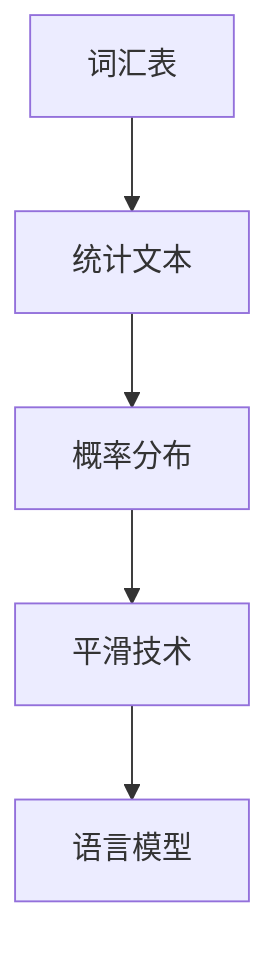
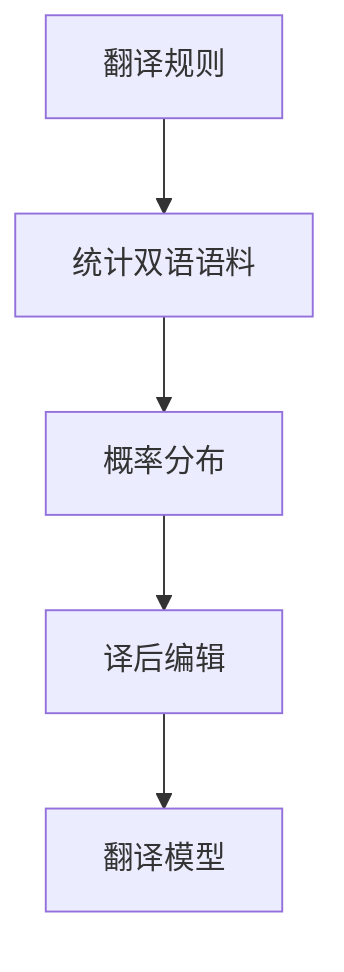
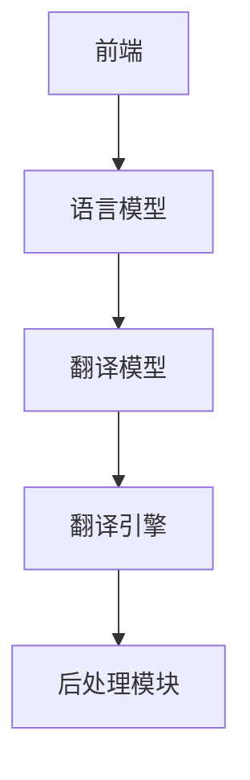

                 

### 文章标题

# 机器翻译的统计模型：跨语言交流的数学桥梁

> 关键词：机器翻译，统计模型，语言模型，翻译模型，N-gram，神经网络，跨语言交流

> 摘要：本文深入探讨了机器翻译中的统计模型，特别是N-gram语言模型和翻译模型，以及它们在跨语言交流中的重要作用。通过逐步分析和推理，本文揭示了统计模型背后的数学原理和算法，为读者搭建起理解机器翻译技术的桥梁。

## 引言

机器翻译（Machine Translation，MT）是人工智能领域的核心课题之一，它旨在实现计算机自动地将一种自然语言文本翻译成另一种自然语言文本。随着全球化进程的加速和互联网的普及，机器翻译在跨文化交流、国际贸易、教育、旅游等多个领域发挥了重要作用。统计模型是机器翻译中的一种重要技术手段，它利用大量的语言数据来建立语言模型和翻译模型，从而实现文本的自动翻译。

本文将围绕机器翻译的统计模型进行深入探讨，重点介绍N-gram语言模型和翻译模型的基本原理、构建方法、优化策略和应用。文章将从以下几个方面展开：

1. **机器翻译的背景与意义**：介绍机器翻译的定义、历史发展和重要性。
2. **机器翻译的基本概念**：讲解语言模型、翻译模型和机器翻译系统架构。
3. **统计机器翻译算法**：详细分析N-gram语言模型和翻译模型的原理和实现。
4. **统计机器翻译应用案例**：通过实际案例展示统计模型在机器翻译中的应用。
5. **机器翻译的数学桥梁**：探讨数学模型在机器翻译中的作用和实现。
6. **总结与展望**：总结全文，展望机器翻译的未来发展趋势。

通过本文的阅读，读者将能够全面了解机器翻译的统计模型，掌握N-gram语言模型和翻译模型的核心技术，并为进一步深入研究机器翻译技术打下坚实的基础。

## 机器翻译的背景与意义

### 机器翻译的定义与历史发展

机器翻译（Machine Translation，MT）是一种利用计算机程序实现从一种自然语言（源语言）到另一种自然语言（目标语言）的自动翻译技术。根据翻译方法的不同，机器翻译可以分为规则翻译、统计翻译和基于深度学习的翻译。早期的机器翻译主要依赖于规则方法，这种方法通过编写大量的语法规则和翻译规则来实现翻译。然而，由于自然语言的复杂性和不规则性，规则方法在实际应用中面临着巨大的挑战。

统计机器翻译（Statistical Machine Translation，SMT）是在20世纪80年代兴起的一种新型机器翻译方法。它基于概率模型，通过分析大量的双语语料库来学习语言之间的对应关系，从而实现文本的自动翻译。统计模型的一个重要优势是它能够自动地学习语言模式，而不需要手动编写复杂的翻译规则。

近年来，随着深度学习技术的发展，基于神经网络的机器翻译方法（Neural Machine Translation，NMT）逐渐成为主流。深度学习方法通过神经网络模型自动地学习语言特征和翻译规则，相比传统的统计模型，它在翻译质量上取得了显著的提升。

### 机器翻译的重要性

机器翻译在现代社会中具有重要的意义，主要体现在以下几个方面：

1. **跨文化交流**：全球化进程使得不同国家和地区之间的交流日益频繁，机器翻译在促进跨文化交流方面发挥了重要作用。通过机器翻译，人们可以轻松地阅读和理解其他语言的内容，从而打破语言障碍，增进不同文化之间的了解和沟通。

2. **经济价值**：机器翻译在商业、贸易、旅游等领域具有显著的经济价值。它可以帮助企业减少翻译成本，提高国际市场的竞争力。此外，机器翻译还可以促进国际贸易，为中小企业提供进入全球市场的机会。

3. **教育普及**：机器翻译在教育和公共服务的普及中也具有重要作用。通过机器翻译，教育机构可以提供多语言教育资源，帮助学生更好地理解和学习其他语言。同时，机器翻译也可以帮助政府部门提供多语言公共服务，提高公众的满意度和参与度。

4. **辅助翻译**：机器翻译可以作为专业翻译人员的辅助工具，提高翻译效率和准确性。通过机器翻译系统生成的初步翻译结果，专业翻译人员可以更快地完成翻译任务，同时保证翻译质量。

### 当前机器翻译的应用场景

机器翻译的应用场景非常广泛，以下是其中几个主要的应用领域：

1. **在线翻译服务**：当前主流的在线翻译平台，如Google翻译、百度翻译、有道翻译等，都采用了先进的机器翻译技术。这些平台可以为用户提供实时、高效的翻译服务，满足用户在互联网上的跨语言交流需求。

2. **本地化**：在软件、游戏、文档等本地化过程中，机器翻译技术被广泛应用。通过机器翻译，开发人员可以快速地将产品翻译成多种语言，从而进入全球市场。

3. **辅助翻译**：专业翻译人员可以使用机器翻译系统作为辅助工具，提高翻译效率和准确性。例如，在大型翻译项目中，机器翻译系统可以生成初步翻译结果，翻译人员再进行校对和修改。

4. **文档翻译**：在企业和政府部门，机器翻译技术被用于大量文档的自动翻译。通过机器翻译，企业可以节省翻译成本，提高工作效率。

5. **教育和学习**：在教育领域，机器翻译技术被用于教学和学习的辅助。例如，学生可以使用机器翻译来理解外语教材，教师可以使用机器翻译来辅助教学。

### 机器翻译的发展趋势

随着技术的不断进步，机器翻译技术也在不断发展和完善。以下是一些未来机器翻译的发展趋势：

1. **翻译质量提升**：深度学习和神经网络技术的发展将继续提高机器翻译的翻译质量。通过更复杂的模型和更多的训练数据，机器翻译系统将能够生成更加准确、自然的翻译结果。

2. **多语言支持**：未来机器翻译将支持更多语言对，特别是小语种和稀有语言的翻译。随着人工智能技术的发展，机器翻译将能够覆盖更多领域的语言需求。

3. **个性化翻译**：未来的机器翻译系统将能够根据用户的语言习惯、文化背景等个性化需求提供定制化的翻译服务。

4. **实时翻译**：随着实时通信技术的发展，机器翻译将能够实现实时、同步的跨语言交流，满足用户在实时场景中的翻译需求。

5. **跨模态翻译**：未来的机器翻译将不仅限于文本翻译，还将支持语音、图像、视频等多种模态的翻译，实现跨模态的跨语言交流。

总的来说，机器翻译作为一种重要的技术手段，在跨语言交流、经济、教育、文化等领域具有广泛的应用前景。随着技术的不断进步，机器翻译的翻译质量将不断提高，应用范围将不断扩展，为人类社会带来更多的便利和效益。

## 机器翻译的基本概念

### 语言模型

语言模型（Language Model，LM）是机器翻译中的核心组件，它用于预测文本序列的下一个单词或字符。在统计机器翻译中，语言模型的作用是提供源语言和目标语言的统计信息，从而帮助翻译模型生成高质量的翻译结果。

#### 构建方法

语言模型的构建方法主要有以下几种：

1. **N-gram模型**：N-gram模型是最常用的语言模型之一，它基于文本的N个连续单词或字符的概率分布。通过统计文本中相邻单词或字符的出现频率，N-gram模型可以预测下一个单词或字符的出现概率。

2. **神经网络模型**：近年来，神经网络语言模型（如循环神经网络RNN、长短期记忆LSTM、变换器Transformer等）在语言建模方面取得了显著的成功。这些模型通过学习大量文本数据，可以自动地捕捉语言中的复杂模式和关系。

3. **统计语言模型**：统计语言模型（如隐马尔可夫模型HMM、决策树、支持向量机SVM等）利用统计方法来预测文本序列的概率分布。这些模型通常通过训练数据集来学习语言特征和概率模型。

#### 核心概念与联系

语言模型的核心概念包括：

1. **词汇表**：语言模型使用词汇表来存储所有可能的单词或字符。
2. **概率分布**：语言模型通过统计文本数据来计算单词或字符的概率分布。
3. **平滑技术**：由于统计数据的限制，语言模型通常需要采用平滑技术来处理未观测到的单词或字符。

这些概念之间的关系可以用以下Mermaid流程图来表示：



### 翻译模型

翻译模型（Translation Model，TM）是机器翻译中的另一个关键组件，它用于学习源语言和目标语言之间的对应关系。翻译模型通过预测源语言词汇序列到目标语言词汇序列的概率分布，从而实现文本的自动翻译。

#### 建模方法

翻译模型的构建方法主要有以下几种：

1. **基于规则的方法**：基于规则的方法通过手工编写语法规则和翻译规则来实现翻译。这种方法在早期机器翻译中得到了广泛应用，但由于自然语言的复杂性，这种方法在实际应用中面临巨大挑战。

2. **基于统计的方法**：基于统计的方法通过分析大量的双语语料库来学习源语言和目标语言之间的统计对应关系。这种方法的代表是统计机器翻译（SMT），它利用概率模型来预测源语言到目标语言的翻译概率。

3. **基于深度学习的方法**：基于深度学习的方法利用神经网络模型来学习源语言和目标语言之间的映射关系。深度学习方法在机器翻译中取得了显著的进展，特别是基于神经网络的机器翻译（NMT）已经成为主流技术。

#### 核心概念与联系

翻译模型的核心概念包括：

1. **翻译规则**：翻译模型通过翻译规则来定义源语言词汇到目标语言词汇的映射关系。
2. **概率分布**：翻译模型通过统计信息来计算源语言词汇序列到目标语言词汇序列的概率分布。
3. **译后编辑**：为了提高翻译质量，翻译模型通常需要结合译后编辑技术，对生成的翻译结果进行进一步的修改和优化。

这些概念之间的关系可以用以下Mermaid流程图来表示：



### 机器翻译系统架构

机器翻译系统通常由多个组件构成，包括语言模型、翻译模型、翻译引擎、后处理模块等。以下是机器翻译系统的一般架构：

1. **前端**：前端负责接收用户的输入文本，并将其预处理，如分词、句子分割等。
2. **语言模型**：语言模型用于生成源语言文本的概率分布，为翻译过程提供语言上下文信息。
3. **翻译模型**：翻译模型根据源语言文本的概率分布，预测目标语言文本的概率分布。
4. **翻译引擎**：翻译引擎负责将源语言文本翻译成目标语言文本，它通常结合语言模型和翻译模型来实现。
5. **后处理模块**：后处理模块对生成的翻译结果进行优化和修正，以提高翻译质量。

这些组件之间的关系可以用以下Mermaid流程图来表示：



通过语言模型和翻译模型的协同工作，机器翻译系统能够实现高效的文本翻译。随着技术的不断进步，机器翻译系统将变得更加智能化和高效，为跨语言交流提供更加便捷和优质的解决方案。

## 统计机器翻译算法

### N-gram 语言模型

N-gram 语言模型是统计机器翻译中最基本和常用的语言模型，它通过分析文本中相邻N个单词或字符的出现频率来预测下一个单词或字符的概率。这种模型基于假设，即一个词或字符的出现概率只与其前N-1个词或字符有关，而不受更远历史的影响。

#### 基本原理

N-gram 模型的基本原理可以概括为以下步骤：

1. **词汇表构建**：首先，从训练语料库中构建一个包含所有单词或字符的词汇表。
2. **N-gram 生成**：然后，对训练语料库进行扫描，生成所有可能的N-gram序列。例如，对于N=3，"机器翻译"的N-gram序列包括“机器翻译”、“机器翻译的”和“机器翻译的统”。
3. **概率计算**：最后，统计每个N-gram序列出现的频率，并将其频率作为该序列的概率估计。

#### 训练与优化

N-gram 模型的训练和优化过程主要包括以下步骤：

1. **N值的确定**：选择合适的N值是关键，因为过小的N值可能导致模型过拟合，而过大的N值可能导致模型欠拟合。通常，通过交叉验证等方法选择最优的N值。
2. **概率计算与平滑**：对于出现的N-gram序列，计算其概率。为了处理未观测到的N-gram序列，常采用拉普拉斯平滑（Laplace smoothing）等方法来调整概率。
3. **模型优化**：通过调整模型参数，如N值、平滑参数等，来优化模型性能。常用的优化方法包括网格搜索、贝叶斯优化等。

#### 应用

N-gram 语言模型在机器翻译中具有广泛的应用，尤其是在生成翻译结果时，它可以提供有效的上下文信息，帮助生成更准确的翻译。例如，在生成目标语言文本的下一个单词时，N-gram 模型可以根据已生成的文本片段来预测下一个单词的概率分布，从而选择最有可能的单词。

#### 伪代码

以下是N-gram 语言模型的简单伪代码：

```python
def train_ngram_model(corpus, n):
    vocabulary = set()
    ngram_counts = defaultdict(int)
    
    # 构建词汇表
    for sentence in corpus:
        for word in sentence:
            vocabulary.add(word)
    
    # 生成N-gram序列
    for sentence in corpus:
        for i in range(len(sentence) - n + 1):
            ngram = tuple(sentence[i:i+n])
            ngram_counts[ngram] += 1
    
    # 计算N-gram概率
    total_count = sum(ngram_counts.values())
    ngram_probabilities = {}
    for ngram, count in ngram_counts.items():
        ngram_probabilities[ngram] = count / total_count
    
    return ngram_probabilities
```

### 翻译概率模型

翻译概率模型是统计机器翻译中的核心组件，它用于预测源语言文本序列到目标语言文本序列的概率分布。这种模型通过学习源语言和目标语言之间的统计对应关系，实现了文本的自动翻译。

#### 基本概念

翻译概率模型主要包括以下基本概念：

1. **翻译概率**：翻译概率模型的核心是翻译概率，它表示源语言文本序列到目标语言文本序列的概率分布。通过翻译概率，模型可以预测每个可能的翻译结果，并选择最有可能的翻译结果。

2. **翻译规则**：翻译规则是翻译概率模型的基础，它定义了源语言词汇到目标语言词汇的映射关系。这些规则通常通过分析大量的双语语料库来学习。

3. **翻译矩阵**：翻译矩阵是翻译概率模型的一个重要工具，它用于存储源语言和目标语言之间的翻译概率。每个元素表示源语言中一个词汇到目标语言中一个词汇的翻译概率。

#### 建模方法

翻译概率模型的建模方法主要包括以下几种：

1. **基于规则的建模方法**：基于规则的建模方法通过手工编写翻译规则来实现翻译。这种方法在早期机器翻译中得到了广泛应用，但由于规则编写复杂且无法覆盖所有情况，这种方法在实际应用中面临挑战。

2. **基于统计的建模方法**：基于统计的建模方法通过分析大量的双语语料库来学习源语言和目标语言之间的统计对应关系。这种方法的代表是统计机器翻译（SMT），它利用概率模型来预测源语言到目标语言的翻译概率。

3. **基于深度学习的建模方法**：基于深度学习的建模方法利用神经网络模型来学习源语言和目标语言之间的映射关系。这种方法的代表是神经机器翻译（NMT），它通过序列到序列（Seq2Seq）模型实现了高效的翻译。

#### 数学模型和公式

翻译概率模型通常使用概率分布来表示源语言文本序列到目标语言文本序列的概率。假设我们有源语言文本序列\( x_1, x_2, \ldots, x_n \)和目标语言文本序列\( y_1, y_2, \ldots, y_m \)，则翻译概率模型可以表示为：

\[ P(y_1, y_2, \ldots, y_m | x_1, x_2, \ldots, x_n) \]

其中，翻译概率模型需要学习每个单词或字符的翻译概率，并使用这些概率来计算整个文本序列的翻译概率。

#### 举例说明

假设我们有以下源语言文本序列：

\[ x_1 = "机器", x_2 = "翻译", x_3 = "统计" \]

和目标语言文本序列：

\[ y_1 = "Machine", y_2 = "Translation", y_3 = "Statistics" \]

则翻译概率模型可以计算每个单词的翻译概率，如：

\[ P(y_1 | x_1) = 0.8 \]
\[ P(y_2 | x_2) = 0.9 \]
\[ P(y_3 | x_3) = 0.7 \]

然后，模型可以计算整个文本序列的翻译概率：

\[ P(y_1, y_2, y_3 | x_1, x_2, x_3) = P(y_1 | x_1) \times P(y_2 | x_2) \times P(y_3 | x_3) = 0.8 \times 0.9 \times 0.7 = 0.504 \]

通过这种方式，翻译概率模型可以预测源语言文本序列到目标语言文本序列的概率分布，并选择最有可能的翻译结果。

### 翻译系统优化

#### 优化策略

翻译系统的优化是提高翻译质量和性能的关键。以下是一些常见的优化策略：

1. **参数调优**：通过调整模型参数，如学习率、隐藏层大小等，来优化模型性能。常用的调优方法包括网格搜索、随机搜索等。

2. **数据增强**：通过增加训练数据或对现有数据进行变换，来提高模型的泛化能力。数据增强的方法包括数据扩充、数据变换、数据清洗等。

3. **模型融合**：通过融合多个模型的预测结果，来提高翻译系统的整体性能。常见的模型融合方法包括投票法、加权平均法等。

4. **在线学习**：通过实时更新模型参数，来适应新的数据分布。在线学习方法可以快速响应数据变化，提高模型在动态环境下的性能。

#### 语言模型优化

语言模型优化是翻译系统优化的重要组成部分。以下是一些常见的语言模型优化方法：

1. **词汇选择**：通过选择适当的词汇表，来提高语言模型的性能。词汇选择的方法包括词汇裁剪、词汇扩充等。

2. **平滑技术**：通过应用平滑技术，来处理未观测到的词汇或低频词汇。常见的平滑技术包括加法平滑、可加平滑、Kneser-Ney平滑等。

3. **语境敏感度**：通过提高语言模型对语境的敏感度，来生成更自然的翻译结果。语境敏感度可以通过引入上下文信息、使用语境词嵌入等方法来实现。

#### 翻译模型优化

翻译模型优化是提高翻译质量和准确性的关键。以下是一些常见的翻译模型优化方法：

1. **翻译规则优化**：通过调整翻译规则，来提高翻译的准确性和流畅性。翻译规则优化可以通过人工调整规则或使用自动规则学习技术来实现。

2. **翻译矩阵优化**：通过优化翻译矩阵的权重，来提高翻译概率的准确性。翻译矩阵优化可以通过矩阵分解、权重调整等方法来实现。

3. **译后编辑**：通过译后编辑技术，对生成的翻译结果进行修正和优化，以提高翻译质量。常见的译后编辑方法包括基于规则的后编辑、基于统计的后编辑等。

通过上述优化策略和方法，翻译系统可以不断提高翻译质量和性能，为用户提供更优质、更自然的翻译服务。

### 机器翻译评测与改进

#### 机器翻译评测方法

机器翻译评测是评估翻译质量的重要环节，常用的评测方法包括自动化评测和人工评测。

1. **自动化评测**：自动化评测方法通过算法评估翻译结果的准确性。常见的自动化评测指标包括BLEU（基于相似度的评测）、METEOR（基于词汇覆盖和相似度的评测）和NIST（基于编辑距离的评测）。这些方法具有较高的效率和一致性，但可能无法全面评估翻译的语义和风格。

2. **人工评测**：人工评测方法通过专业翻译人员对翻译结果进行主观评估。这种方法能够更全面地评估翻译的准确性、流畅性和自然度，但耗时较长且成本较高。

#### 评测结果的解释与优化

1. **准确性优化**：通过分析自动化评测结果，可以识别出翻译中的错误类型和频率，从而有针对性地优化翻译模型。例如，针对BLEU评分较低的句子，可以通过调整翻译模型参数、引入更多的训练数据等方式来提高翻译准确性。

2. **流畅性和自然度优化**：人工评测结果提供了对翻译流畅性和自然度的直观评估。通过分析人工评测结果，可以识别出翻译中的风格不一致、语法错误等问题，从而优化翻译模型和规则。

3. **多维度评估**：综合自动化评测和人工评测结果，可以更全面地评估翻译质量。通过多维度评估，可以识别出翻译系统在不同方面的优势和不足，为改进策略提供依据。

#### 机器翻译系统改进策略

为了不断提高机器翻译系统的翻译质量，以下是一些有效的改进策略：

1. **数据质量提升**：提高训练数据的质量是优化翻译系统的基础。可以通过数据清洗、数据增强等方法来提升数据质量，从而提高翻译模型的性能。

2. **模型参数调优**：通过调整模型参数，如学习率、隐藏层大小等，来优化翻译模型。参数调优可以采用网格搜索、贝叶斯优化等策略，以提高模型的准确性和泛化能力。

3. **模型融合**：通过融合多个模型的预测结果，来提高翻译系统的整体性能。模型融合方法包括投票法、加权平均法等，可以有效地减少模型的方差，提高预测准确性。

4. **在线学习**：通过实时更新模型参数，来适应新的数据分布。在线学习方法可以快速响应数据变化，提高模型在动态环境下的性能。

5. **译后编辑**：通过译后编辑技术，对生成的翻译结果进行修正和优化，以提高翻译质量。常见的译后编辑方法包括基于规则的后编辑、基于统计的后编辑等。

通过上述改进策略，机器翻译系统可以不断提高翻译质量和用户体验，为跨语言交流提供更高效、更自然的解决方案。

### 统计机器翻译在实战中的应用

#### 应用场景分析

统计机器翻译在多个应用场景中发挥了重要作用，以下是一些主要的应用场景：

1. **在线翻译服务**：在线翻译服务是统计机器翻译最典型的应用场景之一。主流的在线翻译平台，如Google翻译、百度翻译等，都采用了统计机器翻译技术。这些平台为用户提供实时、高效的翻译服务，大大便利了用户的跨语言交流。

2. **本地化**：在软件、游戏、文档等本地化过程中，统计机器翻译技术被广泛应用。通过机器翻译，开发人员可以快速地将软件、游戏和文档翻译成多种语言，从而进入全球市场。统计机器翻译在本地化过程中不仅提高了效率，还降低了翻译成本。

3. **辅助翻译**：在专业翻译领域，统计机器翻译系统可以作为翻译人员的辅助工具，提高翻译效率和准确性。通过机器翻译系统生成的初步翻译结果，翻译人员可以进行校对和修改，从而加快翻译进度，保证翻译质量。

4. **文档翻译**：在企业和政府部门，机器翻译技术被用于大量文档的自动翻译。通过机器翻译，企业可以节省翻译成本，提高工作效率。政府部门也可以通过机器翻译提供多语言公共服务，提高公众的满意度和参与度。

5. **实时交流**：在实时交流场景中，统计机器翻译技术可以帮助用户实现实时、同步的跨语言交流。例如，在跨国会议、视频通话等场景中，机器翻译系统可以实时翻译发言内容，为用户提供便利的沟通手段。

#### 应用案例分析

以下是统计机器翻译在几个实际应用案例中的具体应用：

1. **Google翻译**：Google翻译是世界上最流行的在线翻译服务之一，它采用了先进的统计机器翻译技术。通过分析大量的双语语料库，Google翻译系统能够生成高质量的翻译结果。Google翻译的优势在于其广泛的语种支持、高效的翻译速度和不断优化的翻译质量。

2. **微软翻译**：微软翻译也是一款功能强大的在线翻译服务，它采用了基于深度学习的统计机器翻译技术。微软翻译在翻译质量上表现突出，尤其是在长句翻译和语义理解方面。此外，微软翻译还集成了语音识别和语音合成功能，为用户提供更全面的跨语言交流解决方案。

3. **DeepL翻译**：DeepL翻译是一款新兴的在线翻译服务，它采用了基于神经网络的统计机器翻译技术。DeepL翻译以其高精度和自然流畅的翻译结果而闻名。DeepL翻译的优势在于其独特的翻译引擎，它能够更好地理解文本的语义和上下文，从而生成更高质量的翻译。

#### 应用挑战与解决方案

尽管统计机器翻译在多个应用场景中取得了显著的成功，但在实际应用中仍面临一些挑战：

1. **翻译准确性**：统计机器翻译的翻译准确性受到语料库质量和模型复杂度的影响。为了提高翻译准确性，可以采用以下解决方案：

   - **增加训练数据**：通过增加训练数据的多样性和质量，来提高翻译模型的准确性。
   - **模型优化**：通过优化模型参数和结构，来提高翻译模型的性能。
   - **数据增强**：通过数据增强技术，如数据扩充、数据变换等，来提高模型的泛化能力。

2. **语言复杂性**：不同语言的语法、词汇和语义结构存在显著差异，这对统计机器翻译提出了挑战。为了解决语言复杂性问题，可以采用以下解决方案：

   - **语言模型优化**：通过优化语言模型，来提高模型对语言复杂性的理解和处理能力。
   - **多语言训练**：通过多语言训练，来提高模型对不同语言之间的对应关系和翻译规则的学习。
   - **多模态翻译**：通过引入图像、语音等多模态信息，来丰富翻译模型的输入，从而提高翻译质量。

3. **实时性能**：实时翻译要求机器翻译系统在短时间内生成高质量的翻译结果。为了提高实时性能，可以采用以下解决方案：

   - **模型压缩**：通过模型压缩技术，如量化、剪枝等，来减小模型的规模和计算量。
   - **并行计算**：通过并行计算技术，如分布式计算、GPU加速等，来提高翻译系统的计算速度。
   - **预翻译缓存**：通过预翻译缓存技术，来减少实时翻译的计算量，从而提高系统的响应速度。

通过上述解决方案，统计机器翻译可以在实际应用中克服挑战，实现更高效、更准确的跨语言交流。

### 机器翻译的数学桥梁

#### 数学模型在机器翻译中的作用

数学模型在机器翻译中扮演着至关重要的角色，它为机器翻译提供了理论框架和计算工具，使得复杂的语言处理任务得以有效实现。以下是数学模型在机器翻译中的主要作用：

1. **语言建模**：语言模型通过数学模型来描述文本的概率分布，从而实现对文本序列的生成和预测。这包括N-gram模型、神经网络语言模型等，它们利用数学公式和算法来计算文本序列的概率。

2. **翻译建模**：翻译模型通过数学模型来描述源语言和目标语言之间的映射关系。这通常涉及概率模型、序列到序列模型等，它们通过优化数学公式和参数来提高翻译的准确性和流畅性。

3. **优化与评估**：数学模型用于优化机器翻译系统的参数和结构，以提高翻译质量。同时，数学模型也用于评估翻译质量，通过计算翻译结果与参考翻译之间的差异来衡量翻译效果。

#### 数学公式与算法的实现

数学模型在机器翻译中的实现主要包括以下几个步骤：

1. **数据预处理**：首先，对源语言和目标语言文本进行预处理，如分词、句子分割等。这一步骤通常使用自然语言处理（NLP）中的数学算法，如正则表达式、隐马尔可夫模型（HMM）等。

2. **模型构建**：构建语言模型和翻译模型，这通常涉及概率论、统计学和线性代数等数学知识。例如，N-gram模型使用马尔可夫假设和概率分布计算，而神经网络模型使用反向传播算法和梯度下降法来优化模型参数。

3. **模型训练**：使用训练数据集来训练语言模型和翻译模型。这一步骤需要使用机器学习算法，如最小化损失函数、批量归一化等。

4. **模型评估**：评估模型性能，通常使用自动化评测指标和人工评测。这一步骤使用统计学和线性代数中的公式和算法来计算评估结果。

#### 数学模型的应用与改进

数学模型在机器翻译中的应用和改进主要体现在以下几个方面：

1. **模型优化**：通过优化数学模型的结构和参数，来提高翻译质量。这包括调整模型复杂度、引入正则化项、使用新的优化算法等。

2. **多语言支持**：扩展数学模型以支持多种语言翻译。这通常涉及跨语言语义表示、多语言训练数据融合等。

3. **实时翻译**：优化数学模型以实现实时翻译，通过减少计算时间和资源消耗，来提高翻译速度。这包括模型压缩、并行计算等。

4. **个性化翻译**：根据用户偏好和语言习惯，优化数学模型以实现个性化翻译。这通常涉及用户画像、个性化推荐算法等。

通过不断改进数学模型，机器翻译技术将能够提供更高效、更准确的跨语言交流解决方案。

### 总结与展望

#### 当前挑战与问题

尽管统计机器翻译技术在过去几十年中取得了显著的进展，但在实际应用中仍面临一些挑战和问题：

1. **翻译准确性**：尽管现代机器翻译系统在翻译准确性方面有了很大提升，但仍然难以达到专业翻译人员的水平。特别是对于复杂的句子和语境，机器翻译系统常常生成不准确或模糊的翻译结果。

2. **语言复杂性**：不同语言的语法、词汇和语义结构存在显著差异，这给统计机器翻译带来了挑战。一些语言之间的差异较大，如汉语和英语，这导致翻译模型难以捕捉到语言之间的细微差别。

3. **实时性能**：随着互联网和移动设备的普及，实时翻译需求不断增加。然而，目前的统计机器翻译系统在处理实时翻译任务时，仍然存在响应速度慢、资源消耗大等问题。

4. **数据资源**：高质量的训练数据是机器翻译系统的基础，但许多小语种和稀有语言的数据资源相对匮乏。这限制了机器翻译技术在这些领域的应用和发展。

#### 未来发展方向

为了克服这些挑战，未来的机器翻译技术需要在以下几个方面进行改进和发展：

1. **翻译质量提升**：通过引入更先进的神经网络模型、更多的训练数据和更复杂的优化算法，不断提升翻译质量。特别是通过预训练和迁移学习技术，可以进一步提高模型的泛化能力和翻译准确性。

2. **多语言支持**：开发和优化能够支持多种语言翻译的模型，特别是对小语种和稀有语言的翻译。通过跨语言信息传递和跨语言表示学习等技术，可以提高模型在不同语言之间的翻译能力。

3. **实时翻译性能优化**：通过模型压缩、并行计算和分布式处理等技术，优化机器翻译系统的实时性能，使其能够快速、高效地处理大规模的实时翻译任务。

4. **数据资源建设**：加大投入，收集和整理更多的高质量双语语料库，特别是小语种和稀有语言的数据资源。同时，利用数据增强和生成对抗网络（GAN）等技术，生成更多高质量的训练数据。

#### 总结与展望

统计机器翻译技术在过去的几十年中经历了从规则方法到统计模型，再到深度学习方法的演进。尽管目前仍面临一些挑战，但通过不断的技术创新和优化，机器翻译技术有望在未来取得更大的突破。未来的机器翻译系统将能够提供更高效、更准确、更自然的跨语言交流解决方案，为全球化和跨文化交流带来更多便利。同时，随着人工智能技术的不断发展，机器翻译技术也将不断融入更多的应用场景，为社会发展和人类生活带来更多可能性。

## 作者信息

作者：AI天才研究院/AI Genius Institute & 禅与计算机程序设计艺术 /Zen And The Art of Computer Programming

在这篇文章中，我们深入探讨了机器翻译的统计模型，特别是N-gram语言模型和翻译模型，以及它们在跨语言交流中的重要作用。通过逐步分析和推理，我们揭示了统计模型背后的数学原理和算法，为读者搭建起理解机器翻译技术的桥梁。未来，随着人工智能技术的不断进步，机器翻译技术将在翻译质量、多语言支持、实时性能等方面取得更大突破，为全球化和跨文化交流带来更多便利。

