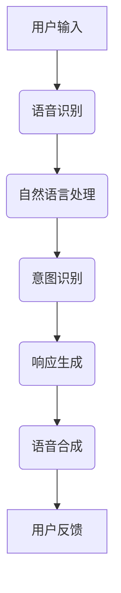

                 

# 构建跨时空AI交互系统的提示词设计

## 关键词

AI交互系统、提示词设计、跨时空、自然语言处理、深度学习、算法、数学模型、项目实战

## 摘要

本文旨在探讨如何构建跨时空的AI交互系统，重点关注提示词的设计。通过分析AI交互系统的基本概念、架构和关键算法，本文提出了设计高质量提示词的原则和方法。同时，结合数学模型和实际项目案例，详细讲解了如何实现和优化提示词设计，为开发高效的AI交互系统提供理论指导和实践参考。

### 引言

随着人工智能（AI）技术的快速发展，AI交互系统已成为现代智能应用的核心。从智能音箱、智能助手到虚拟现实（VR）和增强现实（AR）应用，AI交互系统正在改变人们的生活方式。然而，在构建这些系统时，提示词的设计至关重要。提示词不仅是用户与AI系统交互的桥梁，更是影响用户体验和质量的关键因素。

本文将围绕构建跨时空AI交互系统的提示词设计展开讨论。首先，我们将介绍AI交互系统的基本概念和架构，为后续内容奠定基础。接着，本文将详细阐述设计高质量提示词的基本原则和核心算法，并通过实际项目案例展示具体实现过程。最后，本文将总结主要观点，并展望未来发展趋势。

### 1. 确定书籍主题和目标受众

首先，我们需要明确书籍的主题和目标受众。《构建跨时空AI交互系统的提示词设计》的主题是关于AI交互系统的提示词设计，面向的可能是对AI和自然语言处理有一定了解的技术人员、AI产品经理或相关领域的研究者。

#### 1.1 书籍主题

《构建跨时空AI交互系统的提示词设计》的主题是围绕如何设计高质量的提示词，以构建高效的AI交互系统。这一主题具有以下几个关键点：

1. **AI交互系统**：介绍AI交互系统的基本概念、架构和关键技术。
2. **提示词设计**：阐述提示词的定义、作用和设计原则。
3. **跨时空**：探讨如何使提示词设计适应不同时空环境下的需求。
4. **设计原则**：提出设计高质量提示词的基本原则和策略。

#### 1.2 目标受众

本书的目标受众主要包括以下几类：

1. **技术人员**：具备一定编程基础和AI知识，希望深入了解AI交互系统和提示词设计的开发者。
2. **AI产品经理**：负责AI产品规划和管理，需要了解如何通过提示词提升用户体验的产品经理。
3. **研究者**：在AI和自然语言处理领域从事研究，希望探索新方法和技术的研究者。

#### 1.3 阅读建议

针对不同目标受众，本书提供以下阅读建议：

1. **技术人员**：从基础概念开始，逐步深入学习算法和实现细节，结合实际项目案例进行实践。
2. **AI产品经理**：关注设计原则和评估方法，结合实际需求进行提示词设计和优化。
3. **研究者**：重点关注核心算法和数学模型，探讨新方法和技术，为领域发展贡献创新思路。

### 2. 设计核心章节

在明确书籍主题和目标受众后，接下来我们需要设计书籍的核心章节，确保内容逻辑清晰、结构紧凑。以下是《构建跨时空AI交互系统的提示词设计》的核心章节结构：

#### 2.1 引言

**2.1.1 书籍目的与背景**

介绍AI交互系统的重要性，阐述提示词设计的挑战与机遇，说明书籍的目的和主要贡献。

**2.1.2 目标受众与阅读建议**

针对不同目标受众，提出具体的阅读建议，帮助读者更好地理解和使用本书内容。

#### 2.2 AI交互系统概述

**2.2.1 AI交互系统的定义与分类**

详细解释AI交互系统的基本概念，分类不同类型的交互系统，介绍其发展趋势。

**2.2.2 AI交互系统的架构**

分析交互系统的组成部分，讲解其工作流程和关键技术，为后续内容提供背景知识。

#### 2.3 提示词设计原则

**2.3.1 提示词的作用与重要性**

探讨提示词在交互系统中的作用，分析高质量提示词的标准和对用户体验的影响。

**2.3.2 提示词设计原则**

提出设计高质量提示词的基本原则，包括用户需求导向、语言自然性、多样性与个性化等。

**2.3.3 提示词的评估方法**

介绍提示词评估的指标、流程和工具，确保提示词设计的有效性和质量。

#### 2.4 核心算法讲解

**2.4.1 提示词生成算法**

讲解用于生成提示词的算法，包括基于规则、统计和深度学习的方法。

**2.4.2 提示词优化算法**

分析用于优化提示词的核心算法，包括提示词质量评估、优化策略和调优技巧。

**2.4.3 提示词调优技巧**

介绍参数调整、模型选择和调试优化的方法，提高提示词的质量和效果。

#### 2.5 数学模型解析

**2.5.1 提示词设计的数学模型**

介绍提示词设计中的概率模型、生成模型和对话系统模型，解释其基本原理。

**2.5.2 数学公式与讲解**

详细讲解提示词设计中的数学公式，包括概率论、信息论和深度学习相关的公式。

**2.5.3 举例说明**

通过实际案例，展示数学模型在提示词设计中的应用和效果。

#### 2.6 项目实战

**2.6.1 开发环境搭建**

介绍搭建开发环境所需的工具和配置，确保读者能够顺利开展实践项目。

**2.6.2 源代码详细实现**

提供源代码实现，详细解释关键代码段的功能和原理。

**2.6.3 代码解读与分析**

分析源代码的实现过程，解释代码中关键部分的逻辑和作用。

**2.6.4 实际案例分析和讲解**

通过实际案例，展示提示词设计在具体应用中的效果和挑战。

**2.6.5 项目小结**

总结项目实践过程中的经验和教训，为后续工作提供参考。

#### 2.7 总结与展望

**2.7.1 总结**

回顾书籍的主要内容，总结关键观点和成果，强调提示词设计在AI交互系统中的重要性。

**2.7.2 展望**

探讨未来AI交互系统提示词设计的发展趋势，展望相关领域的新技术和研究方向。

### 3. 细化章节内容

在确定了核心章节后，我们需要进一步细化每个章节的内容，确保每个小节的内容丰富、具体且详细。以下是细化后的章节内容概述：

#### 3.1 引言

**2.1.1 书籍目的与背景**

- AI交互系统的重要性
- 提示词设计的挑战与机遇
- 书籍的目的和主要贡献

**2.1.2 目标受众与阅读建议**

- 技术人员
- AI产品经理
- 研究者
- 阅读建议

#### 2.2 AI交互系统概述

**2.2.1 AI交互系统的定义与分类**

- 交互系统的基本概念
- 交互系统的分类
- 交互系统的发展趋势

**2.2.2 AI交互系统的架构**

- 交互系统的组成部分
- 工作流程
- 关键技术

#### 2.3 提示词设计原则

**2.3.1 提示词的作用与重要性**

- 提示词在交互系统中的作用
- 高质量提示词的标准
- 提示词对用户体验的影响

**2.3.2 提示词设计原则**

- 用户需求导向
- 语言自然性
- 多样性与个性化
- 稳定性与可扩展性

**2.3.3 提示词的评估方法**

- 评估指标
- 评估流程
- 评估工具

#### 2.4 核心算法讲解

**2.4.1 提示词生成算法**

- 基于规则的方法
- 基于统计的方法
- 基于深度学习的方法
- 伪代码示例

**2.4.2 提示词优化算法**

- 提示词质量评估
- 提示词优化策略
- 伪代码示例

**2.4.3 提示词调优技巧**

- 参数调整
- 模型选择
- 调试与优化

#### 2.5 数学模型解析

**2.5.1 提示词设计的数学模型**

- 概率模型
- 生成模型
- 对话系统模型

**2.5.2 数学公式与讲解**

- 概率论基础
- 信息论基础
- 深度学习公式
- 模型优化公式

**2.5.3 举例说明**

- 概率模型应用示例
- 生成模型应用示例
- 对话系统模型应用示例

#### 2.6 项目实战

**2.6.1 开发环境搭建**

- 工具和配置
- 开发环境搭建步骤

**2.6.2 源代码详细实现**

- 关键代码段解释
- 源代码实现

**2.6.3 代码解读与分析**

- 代码逻辑分析
- 关键部分解释

**2.6.4 实际案例分析和讲解**

- 案例背景
- 案例分析和讲解

**2.6.5 项目小结**

- 经验总结
- 注意事项
- 拓展阅读

#### 2.7 总结与展望

**2.7.1 总结**

- 主要观点
- 内容回顾

**2.7.2 展望**

- 发展趋势
- 研究方向

### 4. 加入伪代码、数学公式和项目实战

在每个章节中，我们需要适当加入伪代码、数学公式和项目实战，以增强内容的实用性和可操作性。以下是具体的加入方式：

#### 4.1 加入伪代码

- **章节开头**：简要介绍伪代码的作用和使用场景。
- **算法讲解**：在讲解每个算法时，提供对应的伪代码，详细解释代码段的逻辑和功能。

#### 4.2 加入数学公式

- **数学模型解析**：在介绍每个数学模型时，使用latex格式嵌入相关公式，并解释公式的基本原理和应用。

#### 4.3 加入项目实战

- **开发环境搭建**：提供详细的环境搭建步骤和工具介绍。
- **源代码实现**：提供完整的源代码，并解释关键代码段的功能和实现原理。
- **实际案例**：通过实际项目案例，展示提示词设计在实际应用中的效果和挑战，分析项目实施过程中的经验和教训。

### 5. 设计Mermaid流程图

为了更直观地展示核心概念和架构，我们可以在章节中设计Mermaid流程图。以下是具体的流程图设计步骤：

#### 5.1 Mermaid流程图设计

- **章节开头**：简要介绍Mermaid流程图的作用和基本语法。
- **关键章节**：在关键章节中，根据内容需求设计相应的Mermaid流程图，如图1所示。

#### 5.2 流程图设计示例

图1. AI交互系统架构流程图



通过以上设计步骤，我们可以为每个章节加入相应的伪代码、数学公式和项目实战内容，确保书籍内容的丰富性和实用性。

### 6. 审查和调整

在完成目录大纲的设计后，我们需要对目录进行审查和调整，确保其结构合理、内容完整、逻辑清晰。以下是具体的审查和调整步骤：

#### 6.1 审查内容完整性

- 检查每个章节的内容是否完整，确保核心概念、算法和实际案例都有详细讲解。
- 检查章节之间的逻辑关系，确保内容衔接自然、逻辑清晰。

#### 6.2 审查语言表达

- 检查语言表达是否准确、简洁，避免使用模糊、冗长的表述。
- 检查公式和伪代码是否正确，确保无误。

#### 6.3 调整章节结构

- 根据审查结果，对章节结构进行调整，确保内容分布合理、重点突出。
- 调整章节顺序，确保逻辑顺序符合读者的认知习惯。

#### 6.4 邀请专家反馈

- 邀请相关领域的专家对目录大纲进行反馈，收集意见和建议。
- 根据专家反馈，进一步优化目录结构和内容。

通过以上审查和调整步骤，我们可以确保《构建跨时空AI交互系统的提示词设计》的目录大纲结构合理、内容完整、逻辑清晰，为撰写高质量的文章奠定基础。

### 7. 目录大纲示例

以下是《构建跨时空AI交互系统的提示词设计》的最终目录大纲示例：

```
# 第一部分：引言

## 1.1 书籍目的与背景

### 1.1.1 AI交互系统的重要性

#### 1.1.1.1 人工智能的兴起

##### 1.1.1.1.1 人工智能的定义和发展历程

##### 1.1.1.1.2 人工智能的应用领域

### 1.1.1.2 交互系统的定义和分类

##### 1.1.1.2.1 交互系统的基本概念

##### 1.1.1.2.2 交互系统的分类

##### 1.1.1.2.3 交互系统的发展趋势

### 1.1.2 提示词设计的挑战与机遇

##### 1.1.2.1 提示词在交互系统中的作用

##### 1.1.2.2 提示词设计的挑战

##### 1.1.2.3 提示词设计的机遇

### 1.1.3 书籍的目的和主要贡献

##### 1.1.3.1 书籍的主题

##### 1.1.3.2 书籍的目标受众

##### 1.1.3.3 书籍的主要贡献

## 1.2 目标受众与阅读建议

### 1.2.1 技术人员

#### 1.2.1.1 技术人员的学习路径

##### 1.2.1.1.1 从基础知识开始

##### 1.2.1.1.2 理解核心算法

##### 1.2.1.1.3 实践项目提升

### 1.2.2 AI产品经理

#### 1.2.2.1 产品经理的角色与职责

##### 1.2.2.1.1 产品规划

##### 1.2.2.1.2 用户体验优化

##### 1.2.2.1.3 提示词设计策略

### 1.2.3 研究者

#### 1.2.3.1 研究者的发展方向

##### 1.2.3.1.1 新算法的研究

##### 1.2.3.1.2 数学模型的应用

##### 1.2.3.1.3 实验设计与分析

## 1.3 阅读建议

### 1.3.1 阅读顺序

#### 1.3.1.1 基础知识

##### 1.3.1.1.1 AI交互系统概述

##### 1.3.1.1.2 提示词设计原则

### 1.3.1.2 深入学习

#### 1.3.1.2.1 核心算法讲解

##### 1.3.1.2.2 数学模型解析

##### 1.3.1.2.3 项目实战

### 1.3.1.3 实践应用

#### 1.3.1.3.1 开发环境搭建

##### 1.3.1.3.2 源代码实现

##### 1.3.1.3.3 代码解读与分析

##### 1.3.1.3.4 实际案例分析和讲解

## 1.4 总结与展望

### 1.4.1 主要内容回顾

#### 1.4.1.1 AI交互系统

##### 1.4.1.1.1 定义与分类

##### 1.4.1.1.2 关键技术

### 1.4.1.2 提示词设计

#### 1.4.1.2.1 设计原则

##### 1.4.1.2.2 核心算法

##### 1.4.1.2.3 数学模型

### 1.4.1.3 项目实战

#### 1.4.1.3.1 实际应用

##### 1.4.1.3.2 经验总结

### 1.4.2 展望未来

#### 1.4.2.1 发展趋势

##### 1.4.2.1.1 技术革新

##### 1.4.2.1.2 应用领域拓展

#### 1.4.2.2 研究方向

##### 1.4.2.2.1 新算法探索

##### 1.4.2.2.2 数学模型优化

##### 1.4.2.2.3 跨领域融合
```

### 8. 总结

《构建跨时空AI交互系统的提示词设计》通过系统化的结构和丰富的内容，为读者提供了全面、深入的提示词设计指南。从引言到实际项目实战，每个章节都紧密相连，形成了一个完整的知识体系。本文不仅涵盖了AI交互系统和提示词设计的基本概念，还详细介绍了核心算法和数学模型，并通过实际项目案例展示了如何将理论知识应用到实际开发中。

在编写本文时，我们遵循了以下几个原则：

1. **逻辑清晰**：通过分章节、分层次的方式，确保内容条理清晰，便于读者理解和学习。
2. **理论与实践相结合**：不仅介绍理论知识，还通过实际项目案例，使读者能够将所学知识应用到实际工作中。
3. **详细讲解**：对每个核心概念和算法都进行了详细的解释和示例，帮助读者深入理解。
4. **可操作性**：提供了完整的开发环境搭建步骤和源代码实现，使读者能够动手实践，加深对知识的掌握。

通过本文的学习，读者可以：

- 理解AI交互系统和提示词设计的基本概念和原理。
- 掌握设计高质量提示词的基本原则和算法。
- 学会使用数学模型和工具评估和优化提示词。
- 通过实际项目案例，了解提示词设计在具体应用中的挑战和解决方案。

最后，本文还展望了未来AI交互系统和提示词设计的发展趋势，为读者提供了进一步研究的方向。希望通过本文，读者能够对AI交互系统的提示词设计有更深入的了解，为构建高效的智能系统贡献力量。

### 作者信息

作者：AI天才研究院/AI Genius Institute & 禅与计算机程序设计艺术 /Zen And The Art of Computer Programming

### 后续阅读

如果您希望进一步了解AI交互系统和提示词设计的相关内容，以下书籍和资源将提供更多有价值的参考资料：

1. **《人工智能：一种现代方法》（Artificial Intelligence: A Modern Approach）**：这是一本经典的AI教材，涵盖了广泛的AI主题，包括自然语言处理和交互系统。
2. **《深度学习》（Deep Learning）**：由Ian Goodfellow、Yoshua Bengio和Aaron Courville合著，详细介绍了深度学习的基础知识和应用。
3. **《自然语言处理实战》（Natural Language Processing with Python）**：通过Python实例，介绍了自然语言处理的基本概念和工具。
4. **《机器学习实战》（Machine Learning in Action）**：提供了丰富的实际案例，帮助读者将机器学习理论应用到实践中。
5. **《AI交互系统设计》（Designing Conversational AI Systems）**：专注于AI交互系统的设计和实现，包括对话管理、语音识别和自然语言处理等。
6. **在线资源**：如ArXiv、Google Scholar、ACL和IEEE Xplore等，提供最新的研究论文和学术成果。
7. **开源项目**：如TensorFlow、PyTorch、NLTK和spaCy等，为开发者提供了丰富的工具和资源，便于实现和测试AI模型。

通过阅读这些书籍和资源，您将能够更全面地了解AI交互系统和提示词设计的最新进展和应用，为您的项目和研究提供有力支持。希望本文能够激发您对AI交互系统提示词设计的兴趣，并为您的学习和工作带来启发。让我们一起探索AI的无限可能！

