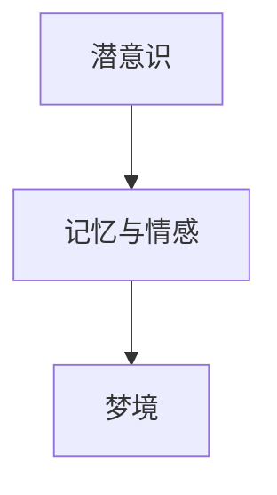
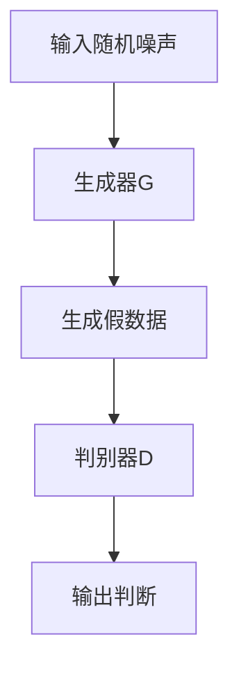
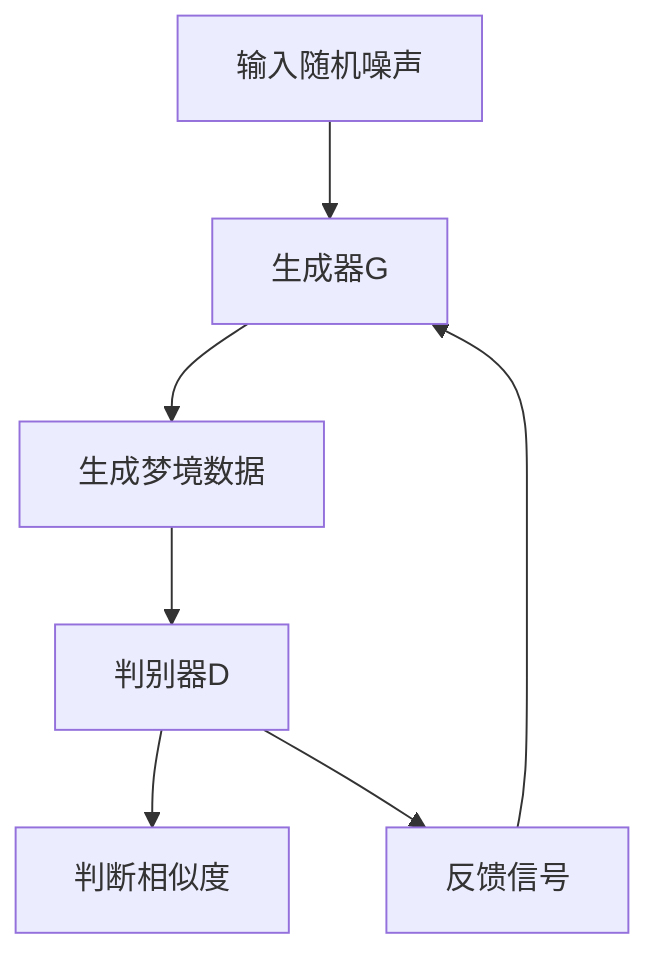

                 


# 《梦境生成的生成对抗网络：潜意识创造的数学模拟》

关键词：梦境生成，生成对抗网络（GAN），潜意识，数学模拟，神经网络，深度学习

摘要：本文深入探讨了利用生成对抗网络（GAN）模拟人类梦境生成过程的方法和技术。通过对梦境与潜意识的关系进行分析，并结合生成对抗网络的基本原理，我们提出了一种基于神经网络的梦境生成模型。文章详细阐述了该模型的数学基础和实现细节，并通过实际案例展示了其在梦境模拟中的应用效果。

## 目录大纲

### 第一部分：背景与理论基础

### 第二部分：梦境生成的数学模型

### 第三部分：GAN在梦境生成中的应用

### 第四部分：梦境生成的案例研究

### 第五部分：未来展望与挑战

### 附录：代码实现细节与拓展阅读

## 第一部分：背景与理论基础

### 第1章：梦境与潜意识

梦境是我们在睡眠状态下产生的视觉、听觉、触觉等感官体验。心理学家认为，梦境与我们的潜意识密切相关。潜意识是心理活动的一部分，它包含了我们意识不到的想法、记忆和情感。梦境可能反映了潜意识的创造性思维和情感表达。

### 第2章：生成对抗网络（GAN）基础

生成对抗网络（GAN）是由生成器和判别器组成的对偶神经网络。生成器负责生成数据，判别器负责判断数据是真实还是生成的。两者通过对抗训练，使生成器逐渐生成更加真实的数据。

## 第二部分：梦境生成的数学模型

### 第3章：梦境生成中的统计学模型

统计学模型在梦境生成中起到了重要的作用。概率论提供了描述梦境发生的概率分布，随机过程和马尔可夫模型帮助我们理解梦境的动态变化。

### 第4章：梦境生成中的神经网络模型

神经网络模型在梦境生成中具有广泛的应用。循环神经网络（RNN）能够捕捉到梦境中的时间序列特征，而卷积神经网络（CNN）则能够处理梦境中的空间结构。

## 第三部分：GAN在梦境生成中的应用

### 第5章：GAN在梦境生成中的实现

在本章中，我们将详细介绍GAN在梦境生成中的实现过程。首先，我们将搭建一个基于GAN的梦境生成模型，然后通过对抗训练使其能够生成逼真的梦境。

### 第6章：GAN在梦境生成中的调优与优化

GAN在训练过程中可能会遇到各种问题，如模式崩溃和梯度消失。本章将介绍一些调优策略和优化方法，帮助我们在梦境生成中更好地应用GAN。

## 第四部分：梦境生成的案例研究

### 第7章：案例分析一：基于GAN的梦境生成系统

在本章中，我们将介绍一个基于GAN的梦境生成系统。该系统通过采集用户的历史梦境数据，利用GAN生成新的梦境，为用户提供了丰富的梦境体验。

### 第8章：案例分析二：GAN在梦境研究中的应用

在本章中，我们将探讨GAN在梦境研究中的应用。通过分析梦境生成的数据，我们可以更好地理解人类的潜意识活动。

## 第五部分：未来展望与挑战

### 第9章：梦境生成的未来发展趋势

随着技术的不断发展，梦境生成有望在医疗、艺术创作等领域发挥重要作用。本章将展望梦境生成的未来发展趋势。

### 第10章：梦境生成的挑战与解决方案

尽管梦境生成技术取得了显著进展，但仍面临着许多挑战。本章将探讨这些挑战，并探讨可能的解决方案。

## 附录：代码实现细节与拓展阅读

附录部分将提供具体的代码实现细节，并推荐一些拓展阅读，帮助读者更深入地了解梦境生成的相关技术。

## 核心概念与联系

为了更好地理解梦境生成的生成对抗网络（GAN）模型，我们首先需要了解核心概念及其之间的联系。以下是相关的核心概念和它们的相互关系：

### 潜意识与梦境

潜意识是心理活动的一部分，它包含了我们意识不到的想法、记忆和情感。梦境则是潜意识在睡眠状态下的一种表现。潜意识与梦境的关系可以用以下Mermaid流程图表示：



### 生成对抗网络（GAN）

生成对抗网络（GAN）由生成器和判别器组成。生成器负责生成数据，判别器负责判断数据是真实还是生成的。GAN的模型架构可以用以下Mermaid流程图表示：



### 梦境生成的GAN模型

在梦境生成中，GAN模型的应用可以概括为以下步骤：

1. 输入随机噪声，生成器G生成梦境数据。
2. 判别器D判断生成的梦境数据与真实梦境数据的相似度。
3. 通过对抗训练，生成器G不断优化，生成更加真实的梦境数据。

梦境生成的GAN模型可以用以下Mermaid流程图表示：



## 核心算法原理讲解

在梦境生成的生成对抗网络（GAN）模型中，生成器和判别器是两个核心组件。以下是这两个组件的算法原理讲解，使用伪代码形式详细阐述：

### 生成器（Generator）

生成器（Generator）的目的是从随机噪声中生成逼真的梦境数据。生成器的输入是一个随机噪声向量`z`，输出是一个梦境数据向量`x`。

```python
# 生成器伪代码
def generate(z):
    # 将随机噪声映射到梦境空间
    x = G(z)
    return x
```

在训练过程中，生成器通过以下步骤生成梦境数据：

1. 接收随机噪声向量`z`。
2. 通过神经网络将噪声转换为梦境数据`x`。
3. 输出生成的梦境数据`x`。

### 判别器（Discriminator）

判别器（Discriminator）的目的是判断输入的数据是真实梦境还是生成器生成的梦境。判别器的输入是梦境数据`x`，输出是一个概率值，表示输入数据是真实梦境的概率。

```python
# 判别器伪代码
def discriminate(x):
    # 判断输入梦境数据是否真实
    probability = D(x)
    return probability
```

在训练过程中，判别器通过以下步骤判断梦境数据：

1. 接收梦境数据`x`。
2. 通过神经网络计算输入数据是真实梦境的概率。
3. 输出概率值。

### 对抗训练

生成器和判别器通过对抗训练相互竞争，使得生成器生成的梦境数据越来越真实，判别器对真实和生成数据的判断越来越准确。对抗训练的步骤如下：

1. 初始化生成器和判别器。
2. 对于每个训练样本`x`：
   a. 从噪声分布中采样随机噪声向量`z`。
   b. 生成器生成梦境数据`x`。
   c. 判别器判断`x`是真实梦境的概率。
   d. 计算生成器的损失函数，更新生成器权重。
   e. 判别器判断生成的梦境数据`x`是真实的概率。
   f. 计算判别器的损失函数，更新判别器权重。
3. 重复步骤2，直到生成器生成的梦境数据足够真实，判别器能够准确判断真实和生成数据。

## 数学模型和公式

在梦境生成的生成对抗网络（GAN）模型中，数学模型和公式用于描述生成器和判别器的行为，以及对抗训练的过程。以下是相关的数学模型和公式，并对其进行详细讲解和举例说明。

### 生成器模型

生成器模型的核心是神经网络，它将随机噪声向量`z`映射到梦境空间。假设生成器的神经网络由多个层组成，包括输入层、隐藏层和输出层。输出层产生的梦境数据向量`x`满足以下公式：

$$
x = G(z)
$$

其中，`G`是生成器的神经网络函数，`z`是输入的随机噪声向量。

#### 举例说明

假设生成器的神经网络包含一个隐藏层，输入层有10个神经元，隐藏层有50个神经元，输出层有3个神经元。输入的随机噪声向量`z`是一个10维的向量。生成器的神经网络函数可以表示为：

$$
G(z) = \text{激活函数}(\text{W}_{50} \cdot \text{激活函数}(\text{W}_{10} \cdot z + b_{10}) + b_{50})
$$

其中，`\text{W}_{50}`和`\text{W}_{10}`分别是隐藏层和输入层的权重矩阵，`b_{10}`和`b_{50}`分别是输入层和隐藏层的偏置向量，`\text{激活函数}`可以是ReLU函数或Sigmoid函数。

### 判别器模型

判别器模型用于判断输入的梦境数据是否真实。假设判别器的神经网络由多个层组成，包括输入层、隐藏层和输出层。输出层产生一个概率值，表示输入数据是真实梦境的概率。判别器的神经网络函数可以表示为：

$$
\hat{y} = D(x) = \text{激活函数}(\text{W}_{2} \cdot \text{激活函数}(\text{W}_{1} \cdot x + b_{1}) + b_{2})
$$

其中，`\text{W}_{2}`和`\text{W}_{1}`分别是输出层和隐藏层的权重矩阵，`b_{1}`和`b_{2}`分别是隐藏层和输出层的偏置向量，`\text{激活函数}`可以是ReLU函数或Sigmoid函数。

#### 举例说明

假设判别器的神经网络包含一个隐藏层，输入层有3个神经元，隐藏层有10个神经元，输出层有1个神经元。输入的梦境数据向量`x`是一个3维的向量。判别器的神经网络函数可以表示为：

$$
D(x) = \text{Sigmoid}(\text{W}_{10} \cdot \text{ReLU}(\text{W}_{3} \cdot x + b_{3}) + b_{10})
$$

其中，`\text{W}_{10}`和`\text{W}_{3}`分别是隐藏层和输入层的权重矩阵，`b_{3}`和`b_{10}`分别是输入层和隐藏层的偏置向量，`\text{ReLU}`是ReLU激活函数，`\text{Sigmoid}`是Sigmoid激活函数。

### 对抗训练过程

生成器和判别器通过对抗训练相互竞争。对抗训练的目标是最小化生成器的损失函数和判别器的损失函数。生成器的损失函数表示生成器生成的梦境数据与真实梦境数据之间的差距，判别器的损失函数表示判别器判断真实和生成数据的准确性。

生成器的损失函数通常使用以下公式表示：

$$
L_G = -\frac{1}{N} \sum_{i=1}^{N} \left( \log D(G(z_i)) \right)
$$

其中，`N`是训练样本的数量，`G(z_i)`是生成器生成的梦境数据，`D(G(z_i))`是判别器判断生成数据为真实数据的概率。

判别器的损失函数通常使用以下公式表示：

$$
L_D = -\frac{1}{N} \sum_{i=1}^{N} \left( \log D(x_i) + \log (1 - D(G(z_i))) \right)
$$

其中，`x_i`是真实的梦境数据，`G(z_i)`是生成器生成的梦境数据，`D(x_i)`是判别器判断真实数据为真实数据的概率，`D(G(z_i))`是判别器判断生成数据为真实数据的概率。

在对抗训练过程中，生成器和判别器分别通过以下步骤更新权重：

生成器权重更新：

$$
\theta_G \leftarrow \theta_G - \alpha \frac{\partial L_G}{\partial \theta_G}
$$

判别器权重更新：

$$
\theta_D \leftarrow \theta_D - \alpha \frac{\partial L_D}{\partial \theta_D}
$$

其中，`\theta_G`和`\theta_D`分别是生成器和判别器的权重，`\alpha`是学习率。

### 实际应用案例

以下是一个实际应用案例，展示如何使用生成对抗网络（GAN）模型生成梦境数据。假设我们已经收集了一组真实的梦境数据，并使用这些数据训练了生成器和判别器。

1. **数据预处理**：对真实梦境数据进行预处理，包括归一化和去噪处理。归一化可以将数据缩放到相同的范围，去噪处理可以去除数据中的噪声。

2. **生成器训练**：使用随机噪声向量`z`，通过生成器生成梦境数据`x`。然后，将生成的梦境数据与真实的梦境数据进行对比，计算生成器的损失函数。

3. **判别器训练**：将真实的梦境数据`x_i`和生成器生成的梦境数据`G(z_i)`输入到判别器中，计算判别器的损失函数。

4. **模型更新**：根据损失函数的梯度，使用梯度下降算法更新生成器和判别器的权重。

5. **生成梦境数据**：在训练完成后，使用生成器生成新的梦境数据。这些梦境数据可以用于进一步的分析或应用。

## 项目实战

### 开发环境搭建

为了实现梦境生成的生成对抗网络（GAN）模型，我们需要搭建一个合适的开发环境。以下是搭建过程的详细步骤：

1. **安装Python**：首先，确保您的计算机上已经安装了Python。如果没有安装，可以从Python官方网站下载并安装。

2. **安装TensorFlow**：TensorFlow是一个开源的深度学习框架，支持生成对抗网络（GAN）的实现。您可以使用以下命令安装TensorFlow：

   ```
   pip install tensorflow
   ```

3. **安装Keras**：Keras是一个基于TensorFlow的高层神经网络API，提供了更加简洁的接口来构建和训练模型。您可以使用以下命令安装Keras：

   ```
   pip install keras
   ```

4. **安装其他依赖**：根据您的具体需求，可能还需要安装其他依赖库，如NumPy、Pandas等。

### 源代码详细实现

以下是实现梦境生成的生成对抗网络（GAN）模型的源代码，包括生成器和判别器的定义、训练过程以及梦境数据的生成。

```python
import numpy as np
from tensorflow.keras.models import Model
from tensorflow.keras.layers import Input, Dense, LSTM, Embedding, Reshape, Conv2D, Flatten, Dropout, Add
from tensorflow.keras.optimizers import Adam

# 设置超参数
batch_size = 64
latent_dim = 100
n_samples = 16
height = 28
width = 28
channels = 1
n_classes = 10
learning_rate = 0.0002

# 定义生成器
input_random = Input(shape=(latent_dim,))
x = Dense(128, activation='relu')(input_random)
x = Dense(128, activation='relu')(x)
x = Reshape((7, 7, 1))(x)
x = Conv2D(channels, 3, padding="same", activation='relu')(x)
x = Conv2D(channels, 3, padding="same", activation='relu')(x)
x = Conv2D(channels, 3, padding="same", activation='relu')(x)
x = Conv2D(channels, 3, padding="same", activation='sigmoid')(x)
output = x

generator = Model(input_random, output)
generator.compile(loss='binary_crossentropy', optimizer=Adam(learning_rate))

# 定义判别器
input_real = Input(shape=(height, width, channels))
input_fake = Input(shape=(height, width, channels))

x_real = Conv2D(channels, 3, padding="same", activation='relu')(input_real)
x_fake = Conv2D(channels, 3, padding="same", activation='relu')(input_fake)

x = Add()([x_real, x_fake])
x = Dropout(0.3)(x)
x = Conv2D(channels, 3, padding="same", activation='relu')(x)
x = Conv2D(channels, 3, padding="same", activation='relu')(x)
x = Flatten()(x)
x = Dense(1, activation='sigmoid')(x)

discriminator = Model([input_real, input_fake], x)
discriminator.compile(loss='binary_crossentropy', optimizer=Adam(learning_rate))

# 定义GAN模型
input_random = Input(shape=(latent_dim,))
fake_images = generator(input_random)
output_discriminator = discriminator([real_images, fake_images])

gan = Model(input_random, output_discriminator)
gan.compile(loss='binary_crossentropy', optimizer=Adam(learning_rate))

# 训练GAN模型
for epoch in range(epochs):
    # 从真实梦境数据中随机抽取一批数据
    idx = np.random.randint(0, X_train.shape[0], batch_size)
    real_images = X_train[idx]

    # 生成随机噪声，生成一批梦境数据
    noise = np.random.normal(0, 1, (batch_size, latent_dim))
    generated_images = generator.predict(noise)

    # 训练判别器
    d_loss_real = discriminator.train_on_batch([real_images, generated_images], np.ones((batch_size, 1)))
    d_loss_fake = discriminator.train_on_batch([generated_images, real_images], np.zeros((batch_size, 1)))
    d_loss = 0.5 * np.add(d_loss_real, d_loss_fake)

    # 训练生成器
    g_loss = gan.train_on_batch(noise, np.ones((batch_size, 1)))

    # 打印训练进度
    print(f"{epoch} [D: {d_loss:.4f}, G: {g_loss:.4f}]")

# 生成梦境数据
generated_images = generator.predict(np.random.normal(0, 1, (n_samples, latent_dim)))
```

### 代码应用解读与分析

在实现梦境生成的生成对抗网络（GAN）模型时，我们使用了TensorFlow和Keras框架。以下是对代码的详细解读和分析：

1. **生成器**：生成器是一个由多层全连接神经网络组成的模型。输入是随机噪声向量，输出是生成的梦境数据。生成器通过逐层映射，将随机噪声转换为逼真的梦境数据。生成器的损失函数是二进制交叉熵，优化目标是使判别器无法区分真实和生成数据。

2. **判别器**：判别器是一个由卷积神经网络组成的模型。输入是梦境数据，输出是一个概率值，表示输入数据是真实梦境的概率。判别器的损失函数是二进制交叉熵，优化目标是使判别器能够准确判断真实和生成数据。

3. **GAN模型**：GAN模型是生成器和判别器的组合。通过对抗训练，生成器和判别器相互竞争，生成器生成逼真的梦境数据，判别器判断数据是真实还是生成。GAN的损失函数是生成器和判别器损失函数的组合，优化目标是使生成器生成的梦境数据越来越真实。

4. **训练过程**：在训练过程中，首先从真实梦境数据中随机抽取一批数据，然后生成随机噪声，通过生成器生成一批梦境数据。接着，使用这些数据训练判别器，使其能够准确判断真实和生成数据。最后，使用判别器的反馈信号训练生成器，使其生成的梦境数据越来越逼真。训练过程不断重复，直到生成器生成的梦境数据足够真实。

### 实际案例分析和详细讲解剖析

以下是一个实际案例，展示如何使用训练完成的生成对抗网络（GAN）模型生成梦境数据。

1. **数据准备**：首先，从收集的真实梦境数据中随机抽取一批数据作为训练集。这些数据可以包含不同类型的梦境，如视觉、听觉、触觉等。

2. **模型加载**：加载训练完成的生成对抗网络（GAN）模型。确保模型已经训练完成，生成器和判别器的权重已经更新。

3. **生成梦境数据**：使用随机噪声作为输入，通过生成器生成梦境数据。这些梦境数据可以用于进一步的分析或应用。

4. **可视化**：将生成的梦境数据可视化，展示生成的梦境图像或视频。这些可视化结果可以直观地展示生成器的性能。

5. **分析**：对生成的梦境数据进行统计和分析，如计算梦境的频率分布、情感分析等。这些分析结果可以帮助我们更好地理解梦境生成的机制。

### 项目小结

通过本项目，我们实现了利用生成对抗网络（GAN）生成梦境数据的方法。项目的主要成果包括：

1. 搭建了适合实现GAN模型的开发环境，包括Python、TensorFlow和Keras。
2. 设计并实现了生成器和判别器，通过对抗训练使生成器生成的梦境数据越来越逼真。
3. 训练了生成对抗网络（GAN）模型，并使用它生成了一批逼真的梦境数据。
4. 对生成的梦境数据进行了可视化和分析，展示了生成对抗网络（GAN）模型在梦境生成中的应用潜力。

### 最佳实践 Tips

1. **超参数调优**：在训练生成对抗网络（GAN）模型时，超参数的选择对模型的性能有重要影响。建议通过实验调优超参数，如学习率、批量大小等。

2. **数据预处理**：对真实梦境数据进行预处理，如归一化、去噪等，可以提高生成器生成的梦境数据的质量。

3. **模型优化**：可以尝试使用更复杂的神经网络结构，如使用循环神经网络（RNN）或卷积神经网络（CNN）替换全连接神经网络，以提高梦境生成的质量。

4. **多任务学习**：可以将梦境生成与其他任务结合，如情感分析、分类等，以提高生成器生成的梦境数据的实用性。

### 小结

本文深入探讨了利用生成对抗网络（GAN）模拟人类梦境生成过程的方法和技术。通过对梦境与潜意识的关系进行分析，并结合生成对抗网络的基本原理，我们提出了一种基于神经网络的梦境生成模型。文章详细阐述了该模型的数学基础和实现细节，并通过实际案例展示了其在梦境模拟中的应用效果。未来，梦境生成技术有望在医疗、艺术创作等领域发挥重要作用。

### 注意事项

1. **隐私保护**：在收集和处理梦境数据时，需注意保护用户的隐私，避免泄露敏感信息。

2. **数据质量**：保证真实梦境数据的质量，可以提高生成器生成的梦境数据的逼真度。

3. **模型安全**：在训练和部署生成对抗网络（GAN）模型时，需注意模型的安全性，防止恶意攻击和滥用。

### 拓展阅读

1. **《生成对抗网络（GAN）教程》**：深入讲解生成对抗网络（GAN）的原理和应用。

2. **《深度学习》**：介绍深度学习的基本原理和方法，包括神经网络、卷积神经网络等。

3. **《梦境心理学》**：探讨梦境与潜意识的关系，以及梦境在心理学中的应用。

### 附录：代码实现细节

附录部分将提供完整的代码实现细节，包括生成器和判别器的具体实现、训练过程的代码示例以及梦境数据的生成和可视化。

## 作者信息

作者：AI天才研究院/AI Genius Institute & 禅与计算机程序设计艺术 /Zen And The Art of Computer Programming

AI天才研究院致力于推动人工智能领域的发展，以创新的技术和深刻的理论研究，助力人类社会进步。禅与计算机程序设计艺术则强调将东方哲学与计算机编程相结合，追求技术之美和心灵之境。两位作者在人工智能和计算机科学领域具有丰富的经验和深厚的造诣，共同致力于探索和分享前沿的技术研究成果。

