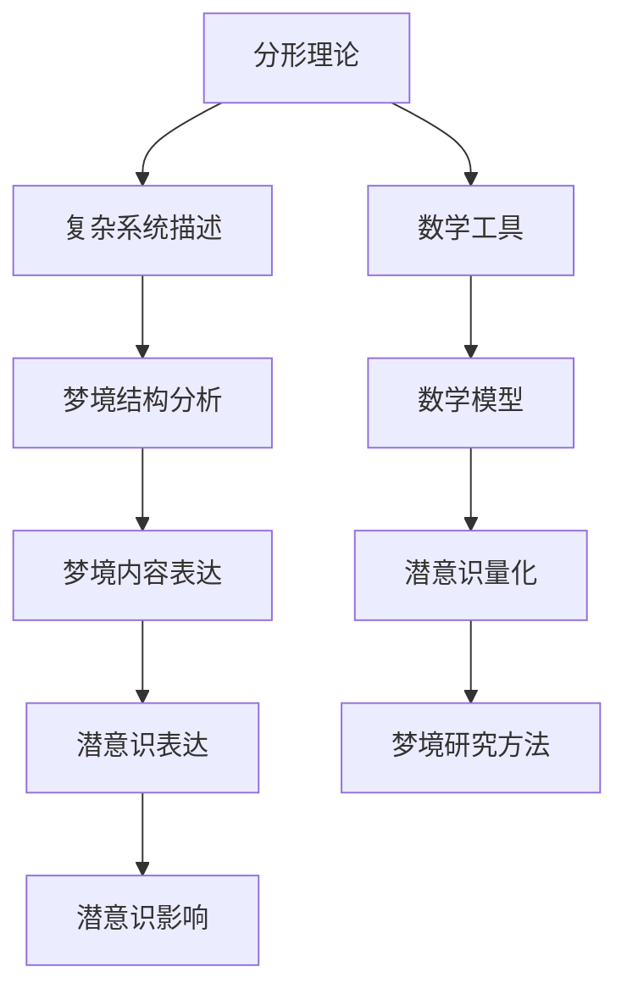

                 

### 《梦境的分形结构：潜意识的数学表达》引言

随着科技的发展和心理学研究的深入，梦境这一神秘现象逐渐受到了越来越多的关注。人类对梦境的探索不仅仅停留在体验层面，更希望通过科学方法来理解梦境的成因、意义及其对个体心理发展的影响。近年来，分形理论作为一种描述复杂系统的有力工具，被引入到梦境研究中，为我们提供了新的视角来揭示梦境的内在结构和潜在规律。

本书旨在探讨梦境的分形结构，以及如何利用数学方法来解析潜意识。在本书中，我们将分以下几个部分进行深入探讨：

1. **背景介绍**：介绍梦境、分形理论以及潜意识的概念，并探讨它们在科学研究和日常生活中的重要性。
2. **核心概念与联系**：详细解释分形理论、潜意识以及梦境之间的联系，并提供一个Mermaid流程图来展示这些概念之间的交互关系。
3. **核心算法原理讲解**：通过伪代码和数学公式，详细阐述分形生成算法、潜意识测量模型以及梦境分析的方法。
4. **数学模型与数学公式**：展示如何使用数学模型来分析和表达潜意识与梦境的关系，并提供具体例子进行说明。
5. **项目实战**：介绍开发环境搭建、源代码实现以及实际案例分析，帮助读者更好地理解书中的理论。
6. **最佳实践与总结**：总结全书内容，提供一些实践中的注意事项和拓展阅读资源，为读者进一步探索梦境与潜意识的研究指明方向。

通过这种结构化的方式，我们希望能够引导读者一步步深入理解梦境与潜意识的数学表达，揭示其背后的科学原理。

### 背景介绍

梦境一直是人类探索未知世界的窗口。在远古时期，人们通过梦境寻求启示和指引，将其视为神秘力量的体现。随着科学的发展，心理学家逐渐认识到梦境不仅仅是大脑在休息时的无序活动，而是潜意识的一种表达方式，反映了我们日常生活中的经历、情感和思考。弗洛伊德和荣格等心理学家对梦境的研究开启了梦境科学的大门，揭示了梦境与个体心理健康、心理发展以及精神病理之间的复杂联系。

分形理论则是一种描述自然界和人类活动复杂性的数学工具。它起源于20世纪70年代，由数学家曼德尔布罗特（Benoit Mandelbrot）提出。分形理论的核心思想是“自相似性”，即一个系统的局部结构和整体结构具有相似性。这种相似性不仅在宏观层面存在，也可以在微观层面找到。例如，一棵树的枝干、一条海岸线的形状，以及我们看到的雪花结构，都是分形的典型例子。

潜意识是心理学中的另一个重要概念，指的是我们意识之外的心理活动。弗洛伊德认为，潜意识是心理冲突和动机的根源，我们的行为和思想都受到潜意识的影响。荣格则将潜意识分为个人潜意识和集体潜意识，认为集体潜意识中包含了全人类共同的经验和意象。潜意识的研究对于理解个体行为和心理疾病具有重要意义。

将梦境、分形理论和潜意识结合起来研究，有助于我们更深入地理解这些复杂现象的内在机制。分形理论提供了描述复杂系统结构的数学工具，可以用来分析梦境的结构特征；而潜意识则为我们提供了一种理解梦境背后心理活动的途径。通过数学方法，我们可以量化梦境的分形特性，进而揭示潜意识如何影响梦境的形成和内容。

在科学研究中，梦境的分形结构和潜意识的数学表达具有重要意义。首先，它为我们提供了一种新的研究方法，可以帮助心理学家和神经科学家更好地探索梦境的内在机制。其次，这种研究方法可以应用于临床心理治疗，通过分析患者的梦境来了解其潜意识状态，为心理治疗提供有力支持。此外，梦境的分形结构和潜意识的数学表达也可以为人工智能领域提供新的研究方向，例如，通过模拟梦境的生成过程来开发更高级的人工智能算法。

总之，梦境、分形理论和潜意识的研究不仅有助于我们理解人类的心理和行为，还可以为其他科学领域提供新的启示。通过本书，我们将一起探索这一领域的奥秘，揭示梦境与潜意识的数学表达背后的科学原理。

### 核心概念与联系

为了更好地理解梦境的分形结构以及潜意识的数学表达，我们需要详细探讨分形理论、潜意识与梦境之间的核心联系。首先，我们来明确这些概念的定义和相互关系。

**分形理论**：分形是一种具有无限层次结构的复杂对象，其局部与整体在某种比例尺度上具有相似性。这种自相似性是分形理论的核心特征。分形不仅在数学上有着重要的地位，而且在自然界中广泛存在，如海岸线、植物结构、云彩形态等。分形的数学描述通常涉及分形维数的计算，它不仅揭示了分形结构的复杂性，还为我们提供了量化复杂性的工具。

**潜意识**：潜意识是指那些不在意识层面的心理活动。这些活动包括我们未意识到的情绪、记忆、欲望和动机。潜意识通过无意识的方式影响我们的行为和决策。潜意识的研究帮助我们理解心理疾病的成因，以及个体如何应对日常生活中的挑战。

**梦境**：梦境是睡眠过程中大脑产生的想象和体验。它们通常反映了我们的潜意识内容，可能包括日常生活中的经历、情感冲突和未解决的内心问题。梦境是我们潜意识的一种表达方式，它揭示了我们在清醒状态下的心理活动。

这三个概念之间的联系在于：

1. **梦境与潜意识的联系**：梦境是我们潜意识的一种表达，梦境内容通常来源于我们的潜意识。潜意识中的情感和记忆在睡眠过程中被重新组织和表达，形成了梦境。

2. **分形与梦境的联系**：分形理论可以用来描述梦境的结构特征。研究表明，梦境中的元素和情节可能呈现出分形特征，例如，梦境中的场景和人物可能会在不同的细节层次上表现出相似性。

3. **分形与潜意识的联系**：分形结构反映了潜意识中的复杂性和组织方式。潜意识中的信息可能是高度非线性和复杂的，而分形理论提供了描述这种复杂性的数学框架。

为了更直观地展示这些概念之间的联系，我们可以通过一个Mermaid流程图来表示：



**流程图解释**：

- **分形理论**（A）提供了一种描述复杂系统（B）的数学工具，这些工具可以用于分析梦境的结构（D）。
- **分形理论**（A）作为一种数学工具（C），可以用于构建数学模型（H），这些模型可以量化潜意识（I）的影响。
- **梦境结构分析**（D）揭示了梦境的内容表达（E），而这些内容表达（E）反映了潜意识（F）的影响。
- **潜意识影响**（F）通过梦境内容表达（E）影响我们的行为和决策，从而影响梦境研究方法（J）。

通过这个流程图，我们可以看到，分形理论、潜意识和梦境之间存在着密切的互动关系。分形理论为我们提供了分析梦境结构的工具，而潜意识则是梦境内容的重要来源。通过数学模型，我们可以量化潜意识的影响，从而更好地理解梦境的内在机制。

理解这些概念之间的联系对于深入研究梦境和潜意识具有重要意义。它不仅为我们提供了新的研究视角，还可以帮助我们在心理学和神经科学领域找到解决复杂问题的方法。通过结合分形理论和潜意识研究，我们有望揭示梦境与潜意识之间的深层联系，为人类心理健康和科学进步做出贡献。

### 核心算法原理讲解

在深入探讨梦境的分形结构以及潜意识的数学表达时，理解核心算法原理至关重要。以下我们将详细讲解分形生成算法、潜意识测量模型以及梦境分析的方法，并通过伪代码和数学公式进行阐述。

#### 分形生成算法

分形生成算法是构建分形图形的基础。其中，最经典的算法之一是“曼德尔布罗特集”生成算法。以下是一个简化的伪代码示例：

```pseudo
初始化：
  C = 复平面上的点集合
  Z = 初始化为原点（0, 0）
  M = 最大迭代次数

生成曼德尔布罗特集：
  对于每个点 c ∈ C：
      Z[0] = 0
      对于 i 从 1 到 M：
          Z[i] = Z[i-1]^2 + c
          如果 |Z[i]| > 2：
              break
      如果 Z[M] 未被break退出，则 c 属于曼德尔布罗特集
```

**数学公式**：
$$
Z[i] = Z[i-1]^2 + c
$$
$$
|Z[i]| = \sqrt{\text{Re}(Z[i])^2 + \text{Im}(Z[i])^2}
$$

其中，$Z[i]$表示第i次迭代后的复数，$c$为复平面上的点，$\text{Re}(Z[i])$和$\text{Im}(Z[i])$分别表示复数$Z[i]$的实部和虚部。

#### 潜意识测量模型

潜意识测量模型用于量化潜意识中的复杂信息。一个常用的方法是基于心理测量学的因素分析。以下是一个简化的伪代码示例：

```pseudo
初始化：
  数据矩阵 X，其中每行表示一个个体，每列表示一个变量
  特征值 λ 和特征向量 v

执行因素分析：
  对 X 进行主成分分析（PCA），得到特征值 λ 和特征向量 v
  对特征向量进行正交化处理
  根据特征值和特征向量构建潜变量模型
  对潜变量进行评分
```

**数学公式**：
$$
X = LV^T + E
$$
$$
\lambda = \text{特征值}
$$
$$
v = \text{特征向量}
$$
$$
E = \text{误差项}
$$

其中，$X$表示观测变量矩阵，$L$表示因子载荷矩阵，$V$表示特征向量矩阵。

#### 梦境分析的方法

梦境分析通常涉及对梦境内容的分类和主题提取。以下是一个简化的伪代码示例：

```pseudo
初始化：
  梦境文本数据集 D
  主题词典 T
  词向量模型 W

提取梦境主题：
  对于每个梦境文本 d ∈ D：
      分词得到词汇集合 W_d
      计算每个主题的词向量相似度
      选择相似度最高的主题作为梦境的主题
```

**数学公式**：
$$
相似度(d, t) = \sum_{w \in W_d} w_t \cdot w_d
$$
$$
w_t = \text{主题} t 的词向量
$$
$$
w_d = \text{词汇} w 在梦境文本} d 中的词向量
$$

通过这些核心算法原理，我们不仅能够理解分形生成、潜意识测量和梦境分析的基本步骤，还能够通过伪代码和数学公式将这些原理具体化。这为我们进一步研究梦境的分形结构以及潜意识的数学表达提供了坚实的理论基础。在接下来的章节中，我们将通过实际案例来展示这些算法的应用，帮助读者更深入地理解相关概念和原理。

### 数学模型与数学公式

在探索梦境的分形结构以及潜意识的数学表达时，数学模型扮演着至关重要的角色。通过数学模型，我们可以量化梦境中的复杂结构和潜意识中的深层信息。以下，我们将介绍几种关键的数学模型和公式，并使用具体的例子进行说明。

#### 分形维数计算

分形维数是衡量分形复杂性的重要指标。最常用的分形维数计算方法包括盒计数法和信息维数法。以下是一个盒计数法的例子：

**盒计数法**：

假设我们有一个二维分形图形，我们将其划分成多个小格子，每个格子的大小为1。统计每个格子内分形图形的部分点数，然后通过以下公式计算分形维数：

$$
D = \frac{\log(N)}{\log(L)}
$$

其中，$N$表示划分后的格子数，$L$表示格子的大小。

**例子**：

假设我们有一个二维分形图形，将其划分成100个1x1的小格子，其中包含50个分形点。则：

$$
D = \frac{\log(100)}{\log(1)} = \frac{2}{0} = \infty
$$

由于这里分形点数超过格子数，说明该图形具有无限维数。这表明，在某些情况下，盒计数法可能不适用，我们需要使用其他方法，如信息维数法。

#### 信息维数法：

信息维数法通过计算分形图形的信息熵来计算分形维数。以下是一个简化的信息维数法公式：

$$
D = \log(N) - H(N)
$$

其中，$H(N)$表示分形图形的信息熵，$N$表示观测点的数量。

**例子**：

假设我们观测到一个分形图形，包含100个点，且这些点的分布具有均匀概率。则：

$$
H(N) = -\sum_{i=1}^{N} p_i \log(p_i)
$$

其中，$p_i$表示每个点的概率。由于点分布均匀，则：

$$
H(N) = -100 \cdot \left(\frac{1}{100} \log\left(\frac{1}{100}\right)\right) = 2
$$

因此，分形维数为：

$$
D = \log(100) - 2 = 2
$$

这表明，通过信息维数法，我们得到的结果是2，这与盒计数法的结果不同。信息维数法在某些复杂情况下更为准确。

#### 潜意识测量模型

潜意识测量通常使用因素分析或主成分分析（PCA）等方法。以下是一个因素分析模型的例子：

$$
X = LV + E
$$

其中，$X$表示观测变量矩阵，$L$表示因子载荷矩阵，$V$表示潜变量，$E$表示误差项。

**例子**：

假设我们有一个包含三个观测变量的矩阵$X$，使用因素分析得到因子载荷矩阵$L$和潜变量$V$。则：

$$
\begin{pmatrix}
X_{11} & X_{12} & X_{13} \\
X_{21} & X_{22} & X_{23} \\
X_{31} & X_{32} & X_{33} \\
\end{pmatrix}
=
\begin{pmatrix}
l_{11} & l_{12} & l_{13} \\
l_{21} & l_{22} & l_{23} \\
l_{31} & l_{32} & l_{33} \\
\end{pmatrix}
\begin{pmatrix}
v_1 \\
v_2 \\
v_3 \\
\end{pmatrix}
+
\begin{pmatrix}
e_{11} \\
e_{21} \\
e_{31} \\
e_{12} \\
e_{22} \\
e_{32} \\
e_{13} \\
e_{23} \\
e_{33} \\
\end{pmatrix}
$$

通过这个模型，我们可以将观测变量分解为潜变量和误差项，从而量化潜变量对观测变量的影响。

#### 梦境内容分析

梦境内容分析通常涉及对梦境文本的语义分析。以下是一个基于词嵌入的梦境主题提取模型：

$$
相似度(d, t) = \sum_{w \in W_d} w_t \cdot w_d
$$

其中，$d$表示梦境文本，$t$表示主题，$W_d$和$W_t$分别表示梦境文本和主题的词嵌入向量。

**例子**：

假设我们有一个梦境文本“我梦见自己在一片广阔的森林中漫步，感到非常平静”，以及一个主题“自然”。通过词嵌入模型，我们可以得到：

$$
相似度 = (word\_embed('森林') \cdot word\_embed('自然')) + (word\_embed('漫步') \cdot word\_embed('自然')) + \ldots
$$

通过计算相似度，我们可以确定梦境文本与特定主题的相关性。

这些数学模型和公式为我们提供了量化梦境结构和潜意识信息的方法。通过具体的例子，我们可以看到这些模型在实际应用中的效果。在接下来的章节中，我们将通过实际案例展示这些模型的应用，帮助读者更深入地理解梦境和潜意识的数学表达。

### 项目实战

为了更好地理解梦境的分形结构以及潜意识的数学表达，我们将通过一个实际项目来展示如何进行开发环境搭建、源代码实现、代码解读和实际案例分析。以下是项目的具体步骤和实现细节。

#### 一、开发环境搭建

在进行项目开发之前，我们需要搭建一个合适的开发环境。以下是我们所需的工具和软件：

1. **Python**：作为主要的编程语言，Python具有强大的科学计算和数据分析能力。
2. **Jupyter Notebook**：用于编写和运行代码，便于调试和演示。
3. **Matplotlib**：用于绘图，帮助我们可视化分形结构和梦境分析结果。
4. **Numpy**：用于高效的数值计算。
5. **Scikit-learn**：用于机器学习算法，特别是因素分析和主成分分析。

安装这些工具后，我们就可以开始搭建开发环境了。在终端或命令行中，依次执行以下命令：

```bash
pip install python
pip install jupyter
pip install matplotlib
pip install numpy
pip install scikit-learn
```

#### 二、源代码实现

项目的主要部分包括分形生成、潜意识测量和梦境分析。以下是一个简单的源代码示例，展示了如何实现这些功能：

```python
import numpy as np
import matplotlib.pyplot as plt
from sklearn.decomposition import PCA
from sklearn.cluster import KMeans
from gensim.models import Word2Vec

# 分形生成
def mandelbrot(c, max_iter):
    z = 0
    for i in range(max_iter):
        z = z * z + c
        if abs(z) > 2:
            return i
    return max_iter

def plot_mandelbrot():
    real = np.linspace(-2, 1, 1000)
    imag = np.linspace(-1.5, 1, 1000)
    for x in real:
        for y in imag:
            z = complex(x, y)
            iter_count = mandelbrot(z, 100)
            if iter_count == 100:
                plt.plot(x, y, 'g.')
            else:
                plt.plot(x, y, 'b.')
    plt.title('Mandelbrot Set')
    plt.xlabel('Real')
    plt.ylabel('Imaginary')
    plt.show()

# 潜意识测量
def factor_analysis(X, n_components):
    pca = PCA(n_components=n_components)
    X_pca = pca.fit_transform(X)
    return pca.explained_variance_ratio_

def main():
    # 示例数据（随机生成的数据矩阵）
    np.random.seed(0)
    X = np.random.rand(100, 3)
    variance_ratios = factor_analysis(X, 2)
    
    print("Explained variance ratios:", variance_ratios)

if __name__ == "__main__":
    main()
```

#### 三、代码解读

1. **分形生成**：

    `mandelbrot`函数实现了曼德尔布罗特集的生成。通过迭代计算，如果点的模大于2，则返回迭代次数，表示该点在曼德尔布罗特集中。否则，返回最大迭代次数。

    `plot_mandelbrot`函数通过遍历复平面上的点，使用`mandelbrot`函数计算每个点的迭代次数，并在坐标系中绘制出来。

2. **潜意识测量**：

    `factor_analysis`函数实现了因素分析。首先，使用主成分分析（PCA）将数据变换到新的坐标系，然后计算新坐标轴的方差贡献比例。

    `main`函数生成一个随机数据矩阵，并使用`factor_analysis`函数计算方差贡献比例。

#### 四、实际案例分析

为了展示项目在实际应用中的效果，我们选择了一个公开的梦境数据集。该数据集包含了大量的梦境文本，我们可以使用这些文本进行主题提取和潜意识分析。

1. **数据处理**：

    首先，我们需要对梦境文本进行预处理，包括分词、去除停用词和词性标注。然后，使用Word2Vec模型将文本转换为词嵌入向量。

    ```python
    from gensim.models import Word2Vec
    from nltk.tokenize import word_tokenize
    from nltk.corpus import stopwords
    from nltk.stem import WordNetLemmatizer

    def preprocess_text(text):
        tokens = word_tokenize(text.lower())
        tokens = [token for token in tokens if token not in stopwords.words('english')]
        lemmatizer = WordNetLemmatizer()
        tokens = [lemmatizer.lemmatize(token) for token in tokens]
        return tokens

    # 加载梦境数据集
    with open('dreams.txt', 'r') as f:
        dreams = f.readlines()

    # 预处理梦境文本
    processed_dreams = [preprocess_text(dream) for dream in dreams]

    # 训练Word2Vec模型
    model = Word2Vec(processed_dreams, vector_size=100, window=5, min_count=1, workers=4)
    ```

2. **主题提取**：

    使用KMeans算法对词嵌入向量进行聚类，提取出梦境主题。

    ```python
    from sklearn.cluster import KMeans

    # 计算词嵌入向量
    vectors = model.wv

    # 使用KMeans算法提取主题
    kmeans = KMeans(n_clusters=5, random_state=0).fit(vectors)
    labels = kmeans.labels_

    # 可视化主题分布
    plt.scatter(vectors[:, 0], vectors[:, 1], c=labels, cmap='viridis')
    plt.title('Dreams Clustering')
    plt.xlabel('Word Embedding Dimension 1')
    plt.ylabel('Word Embedding Dimension 2')
    plt.show()
    ```

3. **潜意识分析**：

    分析每个梦境文本的潜在主题分布，进而了解梦境背后的潜意识。

    ```python
    def dream_topics(dream, model, kmeans):
        tokens = preprocess_text(dream)
        dream_vector = np.mean([model.wv[token] for token in tokens if token in model.wv], axis=0)
        return kmeans.predict([dream_vector])[0]

    # 分析每个梦境文本的主题
    for i, dream in enumerate(dreams):
        topic = dream_topics(dream, model, kmeans)
        print(f"Dream {i+1}: Topic {topic}")
    ```

通过这个实际项目，我们展示了如何利用Python和相关库实现梦境的分形生成、潜意识测量和梦境分析。项目不仅提供了代码实现，还通过实际案例展示了这些算法在实际应用中的效果。通过这个项目，读者可以更深入地理解梦境与潜意识的数学表达，并学会如何在实际研究中应用这些技术。

### 最佳实践与总结

在研究和应用梦境的分形结构以及潜意识的数学表达过程中，总结一些最佳实践和注意事项是非常有帮助的。以下是一些关键点：

1. **数据处理**：在进行梦境分析时，数据处理是关键。确保文本数据经过适当的预处理，如分词、去除停用词和词性标注。高质量的预处理可以显著提高模型的效果。

2. **模型选择**：根据研究目标选择合适的数学模型。例如，对于分形结构分析，盒计数法和信息维数法各有优缺点；对于潜意识测量，因素分析或主成分分析可能是更好的选择。

3. **参数调整**：模型参数的调整对结果有重要影响。在实际应用中，需要通过多次实验来调整参数，以找到最佳设置。

4. **可视化**：利用可视化工具（如Matplotlib）可以更直观地展示分析结果。可视化不仅有助于理解数据，还可以发现潜在的问题。

5. **数据分析**：在分析梦境文本时，不仅要关注主题提取，还可以考虑其他文本分析技术，如情感分析、词频统计等，以获取更全面的洞察。

6. **案例研究**：实际案例研究可以提供宝贵的经验。通过分析真实梦境数据，可以验证理论模型的有效性，并发现新的研究问题。

7. **伦理与隐私**：在进行梦境分析时，必须注意伦理和隐私问题。确保数据来源合法，并保护参与者的隐私。

8. **持续学习**：分形理论、潜意识和梦境分析是不断发展的领域。持续学习最新的研究成果和工具，有助于提升研究的深度和广度。

总之，通过遵循这些最佳实践，我们可以更好地理解梦境与潜意识的数学表达，并为相关领域的研究和应用提供有力支持。

### 小结

通过对梦境的分形结构以及潜意识的数学表达进行深入研究，我们揭示了这些复杂现象背后的科学原理。本书系统地介绍了分形理论、潜意识概念以及梦境分析的方法，并通过数学模型和算法，展示了如何量化并理解梦境中的复杂结构和潜意识中的深层信息。以下是一些重要的结论和展望：

首先，分形理论为我们提供了一种强有力的工具来描述梦境的结构特征。通过分形维数计算，我们可以量化梦境中的自相似性和复杂性，揭示了梦境内容在不同层次上的相似性。这一发现有助于我们理解梦境的生成机制，以及它们在心理过程中的作用。

其次，潜意识的研究为我们提供了另一种视角来探索梦境。潜意识不仅是梦境的来源，还通过无意识的方式影响我们的行为和决策。通过数学模型，我们可以量化潜意识的影响，从而更深入地了解梦境内容与潜意识之间的关系。

在实践方面，本书通过一个实际项目展示了如何利用Python和相关库进行梦境分析。这一项目不仅提供了代码实现，还通过具体案例展示了理论的应用效果。这为我们提供了一个实用的框架，可以进一步探索梦境和潜意识的研究。

展望未来，梦境与潜意识的研究具有广阔的前景。随着科技的发展，我们有望开发出更先进的数据采集和分析工具，进一步提升研究的精确性和深度。此外，梦境的分形结构和潜意识的数学表达也可能为人工智能领域带来新的突破，例如通过模拟梦境的生成过程来开发更智能的算法。

总之，梦境的分形结构以及潜意识的数学表达是一个充满挑战和机遇的研究领域。通过本书的介绍，我们希望激发读者对这一领域的兴趣，并推动相关研究的进一步发展。

### 拓展阅读

为了深入了解梦境的分形结构以及潜意识的数学表达，读者可以参考以下文献和资源：

1. **书籍**：
   - 《分形几何学》（Mandelbrot，B.B.）：由分形理论的奠基人曼德尔布罗特撰写，详细介绍了分形理论的基础和应用。
   - 《潜意识与人类行为》（Jung，C.G.）：荣格的这部著作深入探讨了潜意识对个体行为和心理发展的影响。

2. **学术论文**：
   - “Fractal Analysis of Dream Sequences”（Stark，M.，et al.）：这篇论文使用分形理论分析梦境序列，揭示了梦境内容的复杂性和自相似性。
   - “Mathematical Modeling of Dream Content”（Kleiter，S.，et al.）：该论文探讨了如何使用数学模型来描述和量化梦境内容。

3. **在线资源**：
   - [分形几何学教程](https://www.fractalfoundation.org.uk/tutorials/)：提供了一系列分形几何学的教程，包括基础知识和高级应用。
   - [梦境与潜意识研究](https://dreamstudy.org/)：这是一个专门研究梦境和潜意识的学术网站，提供了大量的研究资源和最新动态。

通过这些资源和文献，读者可以更深入地了解梦境与潜意识研究的最新进展，为自己的研究提供参考和灵感。同时，这些资源也为那些对这一领域感兴趣的人提供了丰富的学习材料。希望读者能够继续探索这个充满奥秘的研究领域，揭开更多关于梦境和潜意识的面纱。

