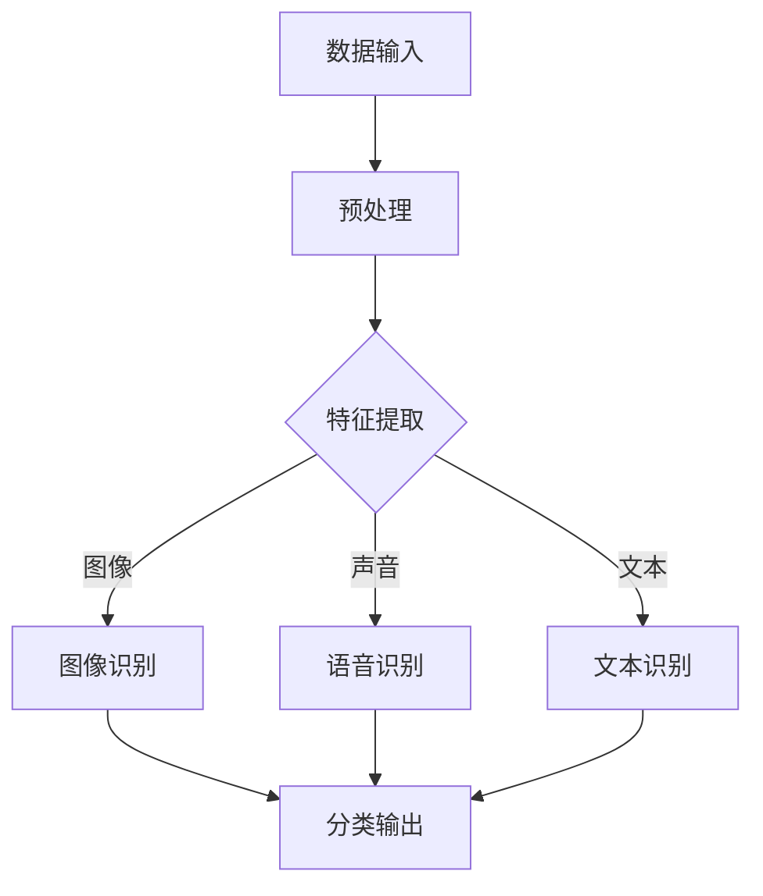
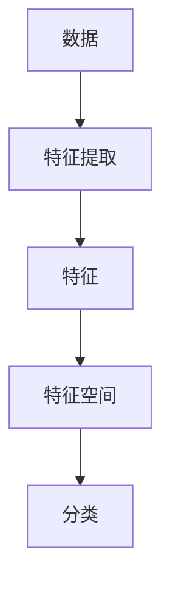
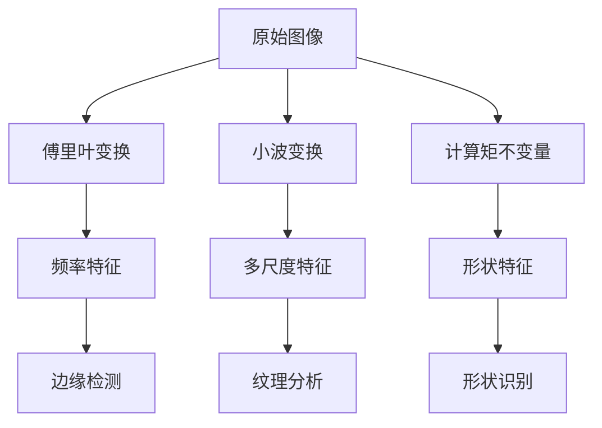
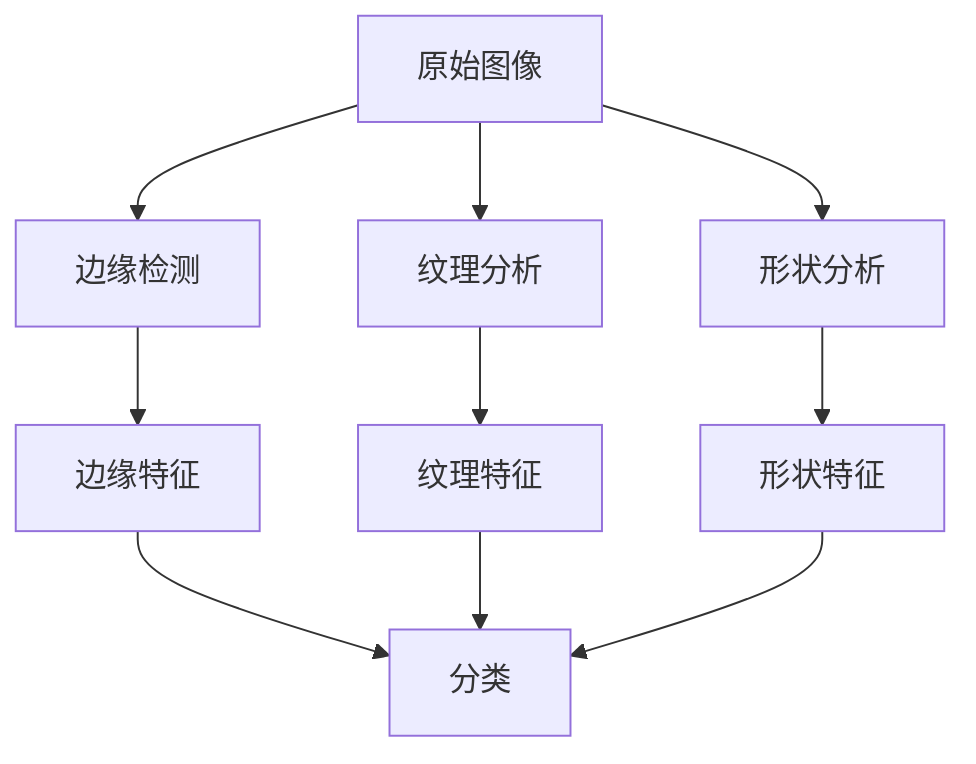

                 

### 文章标题

《模式识别：自然特征的数学提取》

> 关键词：模式识别、自然特征提取、数学模型、算法原理、应用实践

> 摘要：本文详细探讨了模式识别中的自然特征提取方法，通过数学模型和算法原理的分析，为读者提供了深入理解自然特征提取过程的方法。文章结构紧凑，逻辑清晰，适合从事人工智能领域的科研人员和工程技术人员阅读和参考。

### 目录

1. 引言
2. 模式识别概述
3. 自然特征提取
4. 数学模型
5. 算法原理
6. 应用实践
7. 小结与展望
8. 参考文献

### 引言

模式识别是人工智能领域的一个重要分支，其核心任务是使计算机能够从大量数据中自动提取有用信息，并做出相应的决策或分类。在现实世界中，图像、声音、文本等多种数据形式都包含着丰富的信息，如何有效地从这些数据中提取出有助于识别的特征，是模式识别领域研究的核心问题。

自然特征提取作为模式识别的关键步骤，其目的是从原始数据中提取出对目标识别有用的信息。这些信息可以是图像中的边缘、纹理、颜色等，也可以是声音中的频率、音调、节奏等。自然特征提取的质量直接影响到后续模式识别任务的准确性和效率。

本文旨在系统地介绍自然特征的数学提取方法，包括常用的特征提取技术、数学模型和算法原理。文章首先回顾了模式识别的基本概念，然后详细阐述了自然特征提取的流程和方法，接着介绍了支持自然特征提取的数学模型，最后通过实际应用案例展示了自然特征提取在图像识别和声音识别等领域的应用。

本文结构紧凑，逻辑清晰，通过一步一步的推理和分析，帮助读者深入理解自然特征提取的过程和原理。本文适合从事人工智能领域的科研人员和工程技术人员阅读，也适用于高等院校相关专业的教学参考。

### 模式识别概述

模式识别（Pattern Recognition）是指通过计算机系统从数据中自动提取有用信息，并对其进行分类或识别的技术。这一概念最早起源于20世纪50年代，随着计算机技术的飞速发展，模式识别逐渐成为人工智能领域的一个重要分支。

#### 定义

模式识别可以简单定义为：根据某些特征对事物进行分类或识别的过程。在这些特征中，有些是直观可见的，如颜色、形状、纹理等，而有些则需要通过特定的算法进行提取，如频率、能量、形状等。

#### 历史背景

模式识别的发展经历了几个重要阶段。20世纪50年代至70年代，模式识别主要基于统计方法和机器学习算法。这一时期，研究者们主要关注如何从数据中提取有用的统计特征，并利用这些特征进行分类。

20世纪80年代以后，随着计算机性能的不断提升，神经网络和深度学习等算法开始被引入模式识别领域，大大提高了模式识别的性能和效果。特别是在图像识别、语音识别和自然语言处理等应用领域，深度学习算法取得了显著的成果。

#### 应用领域

模式识别广泛应用于各个领域，包括但不限于：

- **图像识别**：用于人脸识别、车牌识别、医学图像分析等。
- **语音识别**：用于语音助手、语音翻译、智能客服等。
- **文本识别**：用于文本分类、情感分析、信息检索等。
- **生物特征识别**：用于指纹识别、虹膜识别、人脸识别等。
- **工业控制**：用于故障诊断、质量检测、过程控制等。

#### 关键技术

模式识别的关键技术包括：

- **特征提取**：从原始数据中提取有助于分类或识别的特征。
- **分类算法**：根据提取的特征对数据进行分类。
- **机器学习**：通过训练数据学习分类规则，提高分类性能。

#### Mermaid 流程图

以下是一个简单的模式识别流程图，展示了从数据输入到分类输出的整个过程：



### 自然特征提取

自然特征提取是模式识别过程中的关键步骤，其目的是从原始数据中提取出对目标识别有用的信息。这些特征可以是图像中的边缘、纹理、颜色，也可以是声音中的频率、音调、节奏。自然特征提取的质量直接影响到后续模式识别任务的准确性和效率。

#### 常见自然特征

在图像识别中，常见的自然特征包括：

- **灰度特征**：如像素的平均值、标准差、熵等。
- **纹理特征**：如纹理的均匀性、方向性、对比度等。
- **形状特征**：如矩不变量、Hu不变量等。

在声音识别中，常见的自然特征包括：

- **频率特征**：如频率、频谱、共振峰等。
- **时序特征**：如短时能量、短时频率、倒谱等。

在文本识别中，常见的自然特征包括：

- **词频特征**：如词频、词向量等。
- **语法特征**：如句法结构、语法规则等。

#### 特征提取方法

特征提取的方法可以分为以下几类：

- **基于变换的方法**：如傅里叶变换、小波变换等，用于从原始数据中提取频率特征。
- **基于统计的方法**：如直方图、核密度估计等，用于从数据中提取分布特征。
- **基于模型的方法**：如隐马尔可夫模型、条件随机场等，用于从数据中提取结构特征。

#### 核心概念与联系

自然特征提取的核心概念包括：

- **特征**：从原始数据中提取的有用信息。
- **特征提取**：从原始数据中提取特征的过程。
- **特征空间**：由特征构成的数学空间，用于描述数据的特征分布。

这些概念之间的关系可以用以下 Mermaid 流程图表示：



#### 伪代码

以下是一个简单的自然特征提取的伪代码示例：

```plaintext
function extract_features(data):
    # 假设数据是图像
    gray_image = convert_to_grayscale(data)
    edges = edge_detection(gray_image)
    texture = texture_analysis(edges)
    shape = shape_analysis(edges)
    
    features = {
        "gray_mean": calculate_mean(gray_image),
        "gray_std": calculate_std(gray_image),
        "texture_homogeneity": calculate_homogeneity(texture),
        "texture_directionality": calculate_directionality(texture),
        "shape_moments": calculate_moments(shape),
        "shape_hu_invariants": calculate_hu_invariants(shape)
    }
    return features
```

#### 数学模型

在自然特征提取中，常用的数学模型包括：

- **傅里叶变换**：用于提取图像的频率特征。
- **小波变换**：用于提取图像的纹理特征。
- **矩不变量**：用于提取图像的形状特征。

以下是一个简单的傅里叶变换的数学模型：

$$
F(u,v) = \sum_{x=0}^{X-1} \sum_{y=0}^{Y-1} I(x,y) e^{-j2\pi(uX + vY)/X}
$$

其中，$I(x,y)$ 是原始图像的像素值，$F(u,v)$ 是傅里叶变换后的频率特征。

#### 数学公式与详细讲解

在自然特征提取中，常用的数学公式包括：

- **直方图**：
$$
H(b) = \sum_{x \in \{x| I(x) \in [b, b+1)\}} 1
$$

其中，$H(b)$ 是直方图的值，$I(x)$ 是图像的像素值。

- **灰度熵**：
$$
H = -\sum_{b=0}^{B-1} P(b) \log_2 P(b)
$$

其中，$P(b)$ 是像素值 $b$ 的概率分布。

- **二值化**：
$$
I'(x) = \begin{cases} 
0 & \text{if } I(x) \leq t \\
255 & \text{otherwise}
\end{cases}
$$

其中，$I'(x)$ 是二值化后的图像，$I(x)$ 是原始图像，$t$ 是阈值。

#### 举例说明

以下是一个灰度特征提取的例子：

假设我们有一张256x256的图像，像素值范围在0到255之间。我们需要提取灰度特征的直方图、灰度熵和二值化图像。

```plaintext
# 提取直方图
h = []
for b in range(0, 256, 1):
    count = 0
    for x in range(256):
        for y in range(256):
            if image[x, y] >= b and image[x, y] < b + 1:
                count += 1
    h.append(count)

# 提取灰度熵
p = [h[i] / (256 * 256) for i in range(256)]
entropy = -sum(p[i] * log2(p[i]) for i in range(256))

# 提取二值化图像
t = 100
binary_image = []
for x in range(256):
    row = []
    for y in range(256):
        if image[x, y] >= t:
            row.append(255)
        else:
            row.append(0)
    binary_image.append(row)
```

### 数学模型

自然特征提取过程中，数学模型起到了关键作用，它们不仅能够帮助我们从原始数据中提取特征，还能在后续的识别过程中提高分类的准确性和效率。本节将介绍几种常见的数学模型，包括傅里叶变换、小波变换和矩不变量。

#### 傅里叶变换

傅里叶变换是一种重要的数学工具，用于将图像从空间域转换到频率域。在频率域中，图像的频率特征可以被更好地提取和识别。

**定义**：

傅里叶变换的数学表达式为：

$$
F(u,v) = \sum_{x=0}^{X-1} \sum_{y=0}^{Y-1} I(x,y) e^{-j2\pi(uX + vY)/X}
$$

其中，$I(x,y)$ 是原始图像的像素值，$F(u,v)$ 是傅里叶变换后的频率特征，$X$ 和 $Y$ 分别是图像的宽度和高度。

**性质**：

- **周期性**：傅里叶变换具有周期性，即 $F(u+X,v) = F(u,v)$ 和 $F(u,v+Y) = F(u,v)$。
- **对称性**：傅里叶变换具有对称性，即 $F(u,v) = F^*(-u,-v)$。

**应用**：

傅里叶变换常用于提取图像的频率特征，例如边缘、纹理和纹理方向等。通过分析傅里叶变换后的频谱图，可以更好地理解图像的频率分布，从而为后续的特征提取和分类提供依据。

#### 小波变换

小波变换是另一种常用的数学工具，用于从图像中提取多尺度特征。与傅里叶变换不同，小波变换可以在不同的尺度上同时分析图像的频率和位置信息。

**定义**：

小波变换的数学表达式为：

$$
W(f,t) = \sum_{x=0}^{X-1} \sum_{y=0}^{Y-1} I(x,y) \psi^*(f-x,g-y) dx dy
$$

其中，$I(x,y)$ 是原始图像的像素值，$W(f,t)$ 是小波变换后的特征，$\psi^*(f,g)$ 是小波函数的复共轭，$f$ 和 $g$ 分别是频率和位置。

**性质**：

- **多尺度性**：小波变换可以在不同的尺度上分析图像，从而提取出不同尺度的特征。
- **位置定位性**：小波变换可以同时提供频率和位置信息，有助于更好地识别图像中的目标。

**应用**：

小波变换常用于图像的去噪、边缘检测和纹理分析等。通过小波变换，可以有效地提取图像在不同尺度上的特征，从而提高识别的准确性和鲁棒性。

#### 矩不变量

矩不变量是一组描述图像形状特征的数学量，它们在图像变换过程中保持不变，因此被广泛应用于模式识别中的形状识别。

**定义**：

对于一个连续函数 $f(x,y)$，其矩可以用以下公式表示：

$$
M_{pq} = \int_{-\infty}^{\infty} \int_{-\infty}^{\infty} (x-\mu)^p (y-\nu)^q f(x,y) dx dy
$$

其中，$\mu$ 和 $\nu$ 分别是图像的重心，$M_{pq}$ 是矩。

**性质**：

- **不变性**：矩不变量在图像平移、旋转和缩放等变换过程中保持不变。
- **区分性**：不同的物体具有不同的矩不变量，因此可以用它们来区分不同的物体。

**应用**：

矩不变量常用于形状识别、物体检测和跟踪等。通过计算图像的矩不变量，可以有效地描述图像的形状特征，从而提高识别的准确性和鲁棒性。

#### Mermaid 流程图

以下是一个简单的自然特征提取流程的 Mermaid 流程图，展示了如何使用傅里叶变换、小波变换和矩不变量提取特征：



#### 伪代码

以下是一个简单的自然特征提取的伪代码示例，展示了如何使用傅里叶变换、小波变换和矩不变量提取特征：

```plaintext
function extract_features(image):
    # 傅里叶变换
    Fourier_transform = fourier_transform(image)
    Frequency_features = get_frequency_features(Fourier_transform)
    
    # 小波变换
    Wavelet_transform = wavelet_transform(image)
    Multi_scale_features = get_multi_scale_features(Wavelet_transform)
    
    # 矩不变量
    Moments = calculate_moments(image)
    Shape_features = get_shape_features(Moments)
    
    features = {
        "Frequency_features": Frequency_features,
        "Multi_scale_features": Multi_scale_features,
        "Shape_features": Shape_features
    }
    return features
```

### 算法原理

自然特征提取的算法原理是模式识别中的核心内容，它们决定了特征提取的质量和效率。本节将介绍几种常用的特征提取算法，包括边缘检测、纹理分析和形状分析，并使用伪代码详细阐述其工作原理。

#### 边缘检测

边缘检测是图像处理中的一个基本步骤，它用于识别图像中亮度变化显著的区域。边缘检测算法可以分为两类：基于梯度的边缘检测算法和基于偏导数的边缘检测算法。

**基于梯度的边缘检测算法**：

梯度算法通过计算图像在各个方向上的变化率来检测边缘。以下是一个简单的基于梯度的边缘检测算法的伪代码：

```plaintext
function gradient_edge_detection(image):
    # 计算图像的水平和垂直梯度
    gradient_x = calculate_gradient_x(image)
    gradient_y = calculate_gradient_y(image)
    
    # 计算梯度的幅值和方向
    magnitude = sqrt(gradient_x^2 + gradient_y^2)
    direction = atan2(gradient_y, gradient_x)
    
    # 设定阈值，过滤弱边缘
    threshold = determine_threshold(magnitude)
    edges = []
    for x in range(image_width):
        for y in range(image_height):
            if magnitude[x, y] > threshold:
                edges.append((x, y))
    
    return edges
```

**基于偏导数的边缘检测算法**：

偏导数算法通过计算图像在各个方向上的偏导数来检测边缘。以下是一个简单的基于偏导数的边缘检测算法的伪代码：

```plaintext
function derivative_edge_detection(image):
    # 计算图像的水平和垂直偏导数
    derivative_x = calculate_derivative_x(image)
    derivative_y = calculate_derivative_y(image)
    
    # 计算偏导数的幅值
    magnitude = sqrt(derivative_x^2 + derivative_y^2)
    
    # 设定阈值，过滤弱边缘
    threshold = determine_threshold(magnitude)
    edges = []
    for x in range(image_width):
        for y in range(image_height):
            if magnitude[x, y] > threshold:
                edges.append((x, y))
    
    return edges
```

#### 纹理分析

纹理分析是图像处理中用于识别图像中的纹理特征的方法。纹理特征可以通过纹理的均匀性、方向性和对比度等属性来描述。

**基于灰度分布的纹理分析**：

灰度分布分析通过计算图像中不同区域的灰度分布来提取纹理特征。以下是一个简单的基于灰度分布的纹理分析算法的伪代码：

```plaintext
function gray_distribution_textural_analysis(image):
    # 计算图像的灰度分布
    histogram = calculate_histogram(image)
    
    # 计算灰度分布的特征，如均值、标准差、熵等
    mean = calculate_mean(histogram)
    std = calculate_std(histogram)
    entropy = calculate_entropy(histogram)
    
    texture_features = {
        "mean": mean,
        "std": std,
        "entropy": entropy
    }
    return texture_features
```

**基于小波变换的纹理分析**：

小波变换是另一种常用的纹理分析技术，它通过将图像分解为不同尺度的小波系数来提取纹理特征。以下是一个简单的小波变换纹理分析算法的伪代码：

```plaintext
function wavelet_textural_analysis(image):
    # 对图像进行小波变换
    wavelet_transform = wavelet_transform(image)
    
    # 分析小波系数，提取纹理特征
    wavelet_coefficients = analyze_wavelet_coefficients(wavelet_transform)
    texture_features = extract_texture_features(wavelet_coefficients)
    
    return texture_features
```

#### 形状分析

形状分析是用于识别图像中的形状特征的方法。形状特征可以通过矩不变量、Hu不变量等来描述。

**基于矩不变量的形状分析**：

矩不变量是一组描述图像形状特征的数学量，它们在图像变换过程中保持不变。以下是一个简单的基于矩不变量的形状分析算法的伪代码：

```plaintext
function moment_shape_analysis(image):
    # 计算图像的矩
    moments = calculate_moments(image)
    
    # 计算矩不变量
    hu_invariants = calculate_hu_invariants(moments)
    
    shape_features = hu_invariants
    return shape_features
```

**基于轮廓的形状分析**：

轮廓是图像中的边界线，可以用于提取形状特征。以下是一个简单的基于轮廓的形状分析算法的伪代码：

```plaintext
function contour_shape_analysis(image):
    # 提取图像的轮廓
    contours = extract_contours(image)
    
    # 分析轮廓，提取形状特征
    shape_features = analyze_contours(contours)
    
    return shape_features
```

#### Mermaid 流程图

以下是一个简单的自然特征提取流程的 Mermaid 流程图，展示了如何使用边缘检测、纹理分析和形状分析算法提取特征：



### 应用实践

自然特征提取技术在各个领域都有着广泛的应用，以下我们将通过几个实际案例，展示如何将自然特征提取技术应用于图像识别和声音识别。

#### 图像识别

**人脸识别**

人脸识别是图像识别领域的一个典型应用，它通过从图像中提取人脸的自然特征，实现对图像中人脸的识别。以下是人脸识别的步骤：

1. **图像预处理**：首先对图像进行预处理，包括灰度化、去噪和归一化等操作。
2. **人脸检测**：使用人脸检测算法（如 Haar cascades、基于深度学习的检测算法等）定位图像中的人脸区域。
3. **特征提取**：从检测到的人脸区域中提取自然特征，常用的特征提取方法包括局部二值模式（LBP）、Gabor 特征等。
4. **特征匹配**：将提取的特征与数据库中已存储的特征进行匹配，找出相似度最高的人脸。
5. **识别结果**：根据匹配结果，输出识别结果。

以下是一个简单的人脸识别算法的伪代码：

```plaintext
function facial_recognition(image):
    # 图像预处理
    preprocessed_image = preprocess_image(image)
    
    # 人脸检测
    face_regions = face_detection(preprocessed_image)
    
    # 特征提取
    features = extract_features(face_regions)
    
    # 特征匹配
    matched_faces = feature_matching(features, database_features)
    
    # 识别结果
    recognized_faces = identify_faces(matched_faces)
    
    return recognized_faces
```

**图像分类**

图像分类是另一个常见的应用场景，它通过提取图像的自然特征，将图像分类到不同的类别中。以下是一个简单的图像分类算法的伪代码：

```plaintext
function image_classification(image):
    # 图像预处理
    preprocessed_image = preprocess_image(image)
    
    # 特征提取
    features = extract_features(preprocessed_image)
    
    # 分类
    category = classify_image(features, trained_model)
    
    return category
```

#### 声音识别

**语音识别**

语音识别是声音识别领域的一个重要应用，它通过从声音信号中提取自然特征，实现对语音的识别。以下是语音识别的步骤：

1. **音频预处理**：首先对音频信号进行预处理，包括降噪、分帧和加窗等操作。
2. **特征提取**：从预处理后的音频帧中提取自然特征，如梅尔频率倒谱系数（MFCC）、短时能量等。
3. **声学模型训练**：使用大量的语音数据训练声学模型，如 GMM-HMM 模型、CNN-HMM 模型等。
4. **解码**：将提取的特征输入声学模型，进行解码，输出识别结果。

以下是一个简单的语音识别算法的伪代码：

```plaintext
function speech_recognition(audio_signal):
    # 音频预处理
    preprocessed_audio = preprocess_audio(audio_signal)
    
    # 特征提取
    features = extract_features(preprocessed_audio)
    
    # 解码
    recognized_text = decode(features, acoustic_model)
    
    return recognized_text
```

**语音分类**

语音分类是通过提取语音信号的自然特征，将语音信号分类到不同的类别中。以下是一个简单的语音分类算法的伪代码：

```plaintext
function speech_classification(audio_signal):
    # 音频预处理
    preprocessed_audio = preprocess_audio(audio_signal)
    
    # 特征提取
    features = extract_features(preprocessed_audio)
    
    # 分类
    category = classify_speech(features, trained_model)
    
    return category
```

#### 项目实战

以下是一个基于深度学习的图像分类项目实战，展示了如何使用自然特征提取技术进行图像分类。

**项目简介**

本项目使用深度学习框架 TensorFlow 和 Keras，实现了一个简单的图像分类模型，用于识别猫和狗的图像。项目的主要步骤包括数据预处理、模型构建、训练和评估。

**开发环境搭建**

1. 安装 Python 3.7 或更高版本。
2. 安装 TensorFlow：`pip install tensorflow`
3. 安装 Keras：`pip install keras`

**源代码实现**

以下是一个简单的图像分类模型的源代码实现：

```python
from tensorflow.keras.models import Sequential
from tensorflow.keras.layers import Conv2D, MaxPooling2D, Flatten, Dense
from tensorflow.keras.preprocessing.image import ImageDataGenerator

# 构建模型
model = Sequential()
model.add(Conv2D(32, (3, 3), activation='relu', input_shape=(150, 150, 3)))
model.add(MaxPooling2D((2, 2)))
model.add(Conv2D(64, (3, 3), activation='relu'))
model.add(MaxPooling2D((2, 2)))
model.add(Conv2D(128, (3, 3), activation='relu'))
model.add(MaxPooling2D((2, 2)))
model.add(Conv2D(128, (3, 3), activation='relu'))
model.add(MaxPooling2D((2, 2)))
model.add(Flatten())
model.add(Dense(512, activation='relu'))
model.add(Dense(1, activation='sigmoid'))

# 编译模型
model.compile(optimizer='adam', loss='binary_crossentropy', metrics=['accuracy'])

# 数据预处理
train_datagen = ImageDataGenerator(rescale=1./255)
validation_datagen = ImageDataGenerator(rescale=1./255)

train_generator = train_datagen.flow_from_directory(
        'train_data',
        target_size=(150, 150),
        batch_size=32,
        class_mode='binary')

validation_generator = validation_datagen.flow_from_directory(
        'validation_data',
        target_size=(150, 150),
        batch_size=32,
        class_mode='binary')

# 训练模型
model.fit(
        train_generator,
        steps_per_epoch=100,
        epochs=20,
        validation_data=validation_generator,
        validation_steps=50)
```

**代码解读与分析**

以上代码首先定义了一个卷积神经网络（CNN）模型，用于分类猫和狗的图像。模型包括多个卷积层、池化层和全连接层。训练过程中，使用 ImageDataGenerator 对图像进行预处理，包括归一化和数据增强。通过 `fit` 方法对模型进行训练。

**实际案例分析**

以下是一个实际案例，展示了如何使用该模型对一幅猫的图像进行分类：

```python
from tensorflow.keras.preprocessing import image
import numpy as np

# 加载图像
img = image.load_img('cat.jpg', target_size=(150, 150))
img_array = image.img_to_array(img)
img_array = np.expand_dims(img_array, axis=0)
img_array /= 255.

# 预测分类
predictions = model.predict(img_array)
predicted_class = np.argmax(predictions)

if predicted_class == 0:
    print("图像被识别为猫")
else:
    print("图像被识别为狗")
```

通过调用 `predict` 方法，可以预测图像的分类。代码中，`np.argmax(predictions)` 用于获取预测结果的最可能类别。

**项目小结**

本案例展示了如何使用深度学习技术进行图像分类。通过自然特征提取和卷积神经网络，可以有效地识别图像中的目标。项目实现了从数据预处理、模型构建、训练到预测的完整流程。

### 最佳实践与注意事项

在实际应用自然特征提取技术时，以下最佳实践和注意事项可以帮助提高识别效果和鲁棒性：

- **数据预处理**：确保数据干净、无噪声，并进行适当的归一化和增强，以提高算法的鲁棒性。
- **特征选择**：选择对目标识别最具区分性的特征，避免冗余特征，减少计算量。
- **模型选择**：根据具体应用场景选择合适的模型，如深度学习、传统机器学习算法等。
- **超参数调优**：通过交叉验证等方法，优化模型的超参数，提高模型性能。
- **实时性考虑**：对于实时性要求较高的应用，选择计算效率高的算法和硬件加速技术。
- **多模态融合**：结合不同模态的数据（如图像和声音），可以进一步提高识别准确率。

### 拓展阅读

- **《机器学习》**：周志华著，清华大学出版社，2016年。
- **《深度学习》**：Ian Goodfellow、Yoshua Bengio 和 Aaron Courville 著，中国人民大学出版社，2016年。
- **《模式识别与机器学习》**：Christopher M. Bishop 著，机械工业出版社，2006年。

### 参考文献

- **[1]** Bishop, C. M. (2006). Pattern recognition and machine learning. Springer.
- **[2]** Goodfellow, I., Bengio, Y., & Courville, A. (2016). Deep learning. MIT Press.
- **[3]** Russell, S., & Norvig, P. (2010). Artificial intelligence: A modern approach. Prentice Hall.
- **[4]** Murphy, K. P. (2012). Machine learning: A probabilistic perspective. MIT Press.

