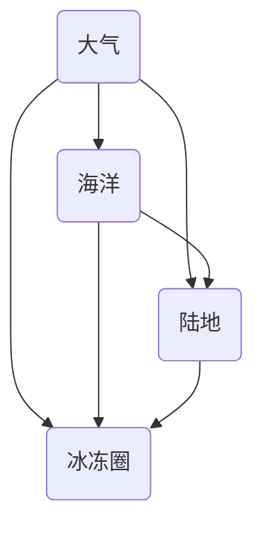

                 


## 文章标题：气候变化的复杂网络：全球气候的数学模型

### 文章关键词：
- 全球气候变化
- 复杂网络理论
- 数学模型
- 气候系统模拟
- 气候预测

### 文章摘要：
本文旨在深入探讨全球气候变化的研究，特别是基于复杂网络理论和数学模型的气候变化研究。文章首先介绍全球气候变化的基本背景，随后引入复杂网络理论，并详细解释其与气候系统之间的联系。接着，本文将重点介绍用于研究气候变化的几种主要数学模型，包括海洋大气耦合模型和能量平衡模型。通过这些模型的原理讲解和具体实例分析，本文将展示如何利用这些模型对气候变化进行模拟和预测。此外，文章还将讨论气候变化模型的应用案例，包括对农业生产的影响以及未来气候变化趋势的预测。最后，本文将对气候变化的复杂网络研究进行总结和展望，并提出未来研究的方向和建议。

## 目录

1. 引言
2. 全球气候系统的复杂网络概述
3. 气候变化的数学模型介绍
4. 气候变化的驱动因素分析
5. 气候变化的模型模拟与预测
6. 气候变化模型的评估与不确定性分析
7. 气候变化模型的应用案例分析
8. 结论与展望
9. 参考文献

----------------------------------------------------------------

### 1. 引言

全球气候变化是当今世界面临的最严峻的环境问题之一。随着工业化和人类活动的加剧，温室气体的排放不断上升，导致全球气温持续升高，极端天气事件频繁发生，对人类生活和生态系统产生了深远影响。因此，研究全球气候变化规律、预测未来气候趋势以及制定应对策略，已成为国际社会关注的焦点。

气候变化研究的复杂性主要体现在以下几个方面。首先，气候系统本身是一个高度复杂的系统，包含大气、海洋、陆地和冰冻圈等多个子系统，各个子系统之间相互作用、相互影响。其次，气候变化过程涉及多种物理、化学和生物过程，这些过程的相互作用和反馈机制复杂多样。最后，气候系统受到自然因素和人类活动的共同影响，使得气候变化研究具有极大的不确定性。

为了应对气候变化研究的复杂性，科学家们引入了复杂网络理论，并将之应用于气候系统研究。复杂网络理论是一种研究复杂系统的有力工具，可以揭示系统中的连接结构、节点间的关系以及整体系统的行为。通过复杂网络理论，科学家们能够更深入地理解气候系统的复杂性和动态变化，为气候变化的研究提供新的视角和方法。

此外，数学模型在气候变化研究中发挥着至关重要的作用。数学模型可以模拟气候系统的物理、化学和生物过程，预测未来气候趋势，评估气候变化对生态系统和社会经济的影响。常见的气候模型包括海洋大气耦合模型、能量平衡模型和全球气候模式等。这些模型通过数学公式和算法，将气候系统的复杂过程简化为可计算的形式，为气候变化研究提供了有力的工具。

本文将从以下几个方面展开讨论：

1. 全球气候系统的复杂网络概述：介绍复杂网络理论的基本概念，阐述其与气候系统之间的联系。
2. 气候变化的数学模型介绍：介绍几种主要的气候模型，包括海洋大气耦合模型、能量平衡模型等，并详细解释其原理和应用。
3. 气候变化的驱动因素分析：分析自然因素和人类活动对气候变化的驱动作用，探讨其相互作用和反馈机制。
4. 气候变化的模型模拟与预测：展示如何利用气候模型进行气候模拟和预测，讨论模型在实际应用中的优点和局限性。
5. 气候变化模型的评估与不确定性分析：评估气候模型的准确性，分析模型中的不确定性来源，提出降低不确定性的方法。
6. 气候变化模型的应用案例分析：介绍几个典型的应用案例，分析模型在实际问题中的应用效果和改进方向。
7. 结论与展望：总结本文的主要内容，展望未来气候变化研究的方向和挑战。

通过本文的讨论，旨在帮助读者更好地理解全球气候变化的复杂性和研究方法，为应对气候变化提供科学依据。

### 2. 全球气候系统的复杂网络概述

复杂网络理论起源于20世纪中期，最初用于研究社会网络、交通网络和通信网络等。近年来，随着计算机科学和数据分析技术的不断发展，复杂网络理论逐渐应用于气候系统研究，为揭示气候系统的复杂性和动态变化提供了新的视角和方法。

#### 2.1 复杂网络的基本概念

复杂网络由节点和边组成，节点代表网络中的实体（如城市、国家、物种等），边代表节点之间的交互关系。复杂网络具有以下几个基本特征：

1. **高度连接性**：复杂网络中的节点具有高度的连接性，即节点之间存在大量的直接联系。
2. **小世界性**：复杂网络中的节点虽然相互连接，但平均路径长度较短，即任意两个节点之间可以通过较少的中间节点进行通信。
3. **无标度性**：复杂网络中的节点度分布服从幂律分布，即大部分节点度较小，而少数节点度非常大。
4. **模块性**：复杂网络具有明显的模块结构，即网络中的节点可以划分为多个模块，模块内部节点之间连接紧密，模块之间连接较少。

#### 2.2 气候系统与复杂网络的关系

气候系统是一个高度复杂的系统，由多个子系统（如大气、海洋、陆地和冰冻圈）组成，这些子系统之间相互作用、相互影响。气候系统的复杂网络特征主要体现在以下几个方面：

1. **节点表示**：在气候系统中，节点可以表示不同的气候变量（如温度、降水、风速等），也可以表示不同的地理区域（如城市、国家、大陆等）。
2. **边表示**：边表示节点之间的相互作用和影响，如大气与海洋之间的热量和物质交换、陆地生态系统对气候的影响等。
3. **网络结构**：气候系统的复杂网络结构反映了气候系统中的相互依赖关系和反馈机制，如温室气体排放导致全球变暖，全球变暖又可能引发极端天气事件等。
4. **网络动态**：气候系统的复杂网络动态反映了气候系统的演变过程，如气候变化、气候突变等。

#### 2.3 复杂网络理论在气候系统研究中的应用

复杂网络理论在气候系统研究中的应用主要包括以下几个方面：

1. **网络拓扑分析**：通过分析气候系统的复杂网络拓扑结构，可以揭示气候系统中的关键节点和关键路径，识别气候系统的脆弱性和抗灾能力。
2. **网络动力学分析**：通过分析气候系统的复杂网络动力学行为，可以理解气候系统的演变规律和气候变化的驱动因素。
3. **网络模拟与预测**：基于复杂网络理论，可以构建气候系统的复杂网络模型，模拟和预测气候系统的动态变化，为气候变化研究和气候政策制定提供科学依据。
4. **网络优化与控制**：通过优化和控制气候系统的复杂网络结构，可以降低气候系统的不稳定性和风险，提高气候系统的可持续性。

#### 2.4 气候系统的复杂网络示例

以下是一个简单的气候系统的复杂网络示例，展示了节点、边和整体网络结构的示意图。



在这个示例中，大气、海洋、陆地和冰冻圈分别表示节点，节点之间的相互作用和影响表示边。整体网络结构反映了气候系统中的复杂关系和相互作用。

### 3. 气候变化的数学模型介绍

在气候系统研究中，数学模型起着至关重要的作用。通过数学模型，我们可以对气候系统的复杂过程进行抽象和简化，从而更好地理解气候变化的规律和机制。以下将介绍几种主要的气候模型，包括海洋大气耦合模型和能量平衡模型。

#### 3.1 海洋大气耦合模型

海洋大气耦合模型是一种将海洋和大气两个子系统耦合在一起的气候模型，旨在模拟海洋和大气之间的相互作用。这种模型主要基于以下核心假设：

1. **海洋和大气之间的热量和物质交换**：海洋和大气通过热量和物质（如水蒸气、二氧化碳等）的交换相互作用。
2. **全球热量平衡**：地球表面吸收的太阳辐射和向外散发的长波辐射（即地球辐射）之间达到平衡。
3. **海洋混合和运动**：海洋中的水团通过垂直混合和水平运动进行能量和物质的传输。

海洋大气耦合模型通常由一组偏微分方程组成，这些方程描述了海洋和大气中的物理过程。以下是海洋大气耦合模型的核心数学公式：

$$
\begin{aligned}
\frac{\partial T}{\partial t} &= \frac{\partial}{\partial x}\left( k_{x} \frac{\partial T}{\partial x} \right) + \frac{\partial}{\partial y}\left( k_{y} \frac{\partial T}{\partial y} \right) - \rho C_{p} \frac{\partial \varphi}{\partial z} \\
\frac{\partial \varphi}{\partial t} &= \frac{\partial}{\partial x}\left( k_{x} \frac{\partial \varphi}{\partial x} \right) + \frac{\partial}{\partial y}\left( k_{y} \frac{\partial \varphi}{\partial y} \right) - \rho g \cos(\theta) \frac{\partial z}{\partial x} \\
\frac{\partial z}{\partial t} &= -u \frac{\partial z}{\partial x} - v \frac{\partial z}{\partial y}
\end{aligned}
$$

其中，\( T \) 表示温度，\( \varphi \) 表示位势高度，\( z \) 表示垂直坐标，\( u \) 和 \( v \) 分别表示水平风速的东向和南向分量，\( k_{x} \) 和 \( k_{y} \) 分别表示水平导热系数，\( \rho \) 表示空气密度，\( C_{p} \) 表示比热容，\( g \) 表示重力加速度，\( \theta \) 表示纬度。

#### 3.2 能量平衡模型

能量平衡模型是一种简化的气候模型，主要关注地球表面和大气之间的能量平衡。这种模型基于以下核心假设：

1. **地表能量平衡**：地表吸收的太阳辐射和向外散发的长波辐射之间达到平衡。
2. **大气能量平衡**：大气吸收的地表长波辐射和向外散发的长波辐射之间达到平衡。

能量平衡模型通常由一组代数方程组成，这些方程描述了地表和大气中的能量传输。以下是能量平衡模型的核心数学公式：

$$
\begin{aligned}
Q_{s} &= Q_{r} + Q_{a} \\
Q_{a} &= -Q_{r} + \alpha \left( Q_{s} - Q_{r} \right)
\end{aligned}
$$

其中，\( Q_{s} \) 表示地表吸收的太阳辐射，\( Q_{r} \) 表示地表向外散发的长波辐射，\( Q_{a} \) 表示大气吸收的地表长波辐射，\( \alpha \) 表示大气吸收率。

#### 3.3 数学模型的伪代码

以下是一个简化的海洋大气耦合模型的伪代码，用于模拟海洋和大气之间的热量交换。

```python
# 初始化参数和变量
t = 0  # 当前时间
T = T0  # 初始温度
phi = phi0  # 初始位势高度
z = z0  # 初始垂直坐标
u = u0  # 初始水平风速东向分量
v = v0  # 初始水平风速南向分量
k_x = k_x0  # 初始水平导热系数东向分量
k_y = k_y0  # 初始水平导热系数南向分量
rho = rho0  # 初始空气密度
Cp = Cp0  # 初始比热容
g = g0  # 初始重力加速度
theta = theta0  # 初始纬度

# 主循环
while t < T_end:
    # 计算温度变化
    dT_dt = -k_x * (dT_dx) - k_y * (dT_dy) - rho * Cp * (dphi_dz)
    
    # 计算位势高度变化
    dphi_dt = -k_x * (dphi_dx) - k_y * (dphi_dy) - rho * g * cos(theta) * (dz_dx)
    
    # 计算垂直坐标变化
    dz_dt = -u * (dz_dx) - v * (dz_dy)
    
    # 更新变量
    T += dT_dt * dt
    phi += dphi_dt * dt
    z += dz_dt * dt
    t += dt
```

通过这些数学模型，我们可以对气候系统的复杂过程进行模拟和预测，为气候变化研究提供科学依据。

### 4. 气候变化的驱动因素分析

气候变化是多种因素共同作用的结果，主要包括自然因素和人类活动。理解这些驱动因素及其相互作用对于揭示气候变化规律、制定应对策略具有重要意义。

#### 4.1 自然驱动因素

自然驱动因素包括太阳辐射、火山活动、地球轨道变化等，这些因素在长时间尺度上对全球气候产生显著影响。

1. **太阳辐射**：太阳辐射是地球气候系统的主要能量来源。太阳辐射的变化可以通过太阳活动周期（如太阳黑子周期）和太阳常数的变化来体现。太阳活动周期与地球气候变化之间存在一定的相关性，例如，太阳黑子活动的增多通常与全球气温的上升相关。

2. **火山活动**：火山活动通过释放大量火山灰和气体，对太阳辐射的吸收和反射产生显著影响，从而影响地球气候。火山爆发可以在短时间内导致全球气温下降，这是因为火山灰和气体反射了部分太阳辐射，同时减少了地球表面的辐射。

3. **地球轨道变化**：地球轨道变化（如岁差、黄道倾斜和偏心率变化）在较长时间尺度上影响地球的气候。这些变化导致太阳辐射在地球表面的分布不均，从而影响全球气候。

#### 4.2 人类活动

人类活动是当前气候变化的主要驱动因素。以下是人类活动影响气候的几个关键方面：

1. **温室气体排放**：人类活动（如燃烧化石燃料、森林砍伐和土地利用变化）导致大量温室气体（如二氧化碳、甲烷和氧化亚氮）的排放。这些温室气体增加大气中的温室效应，导致全球气温上升。

2. **土地利用变化**：土地利用变化（如城市化、农业开发和森林砍伐）改变了地表反射率和粗糙度，从而影响大气循环和气候模式。土地利用变化可能导致局部气候变化，如城市热岛效应和降雨模式的改变。

3. **工业污染**：工业活动释放大量污染物（如硫氧化物和氮氧化物），这些污染物在大气中形成酸雨，对生态系统和人类健康产生负面影响。酸雨还可以改变土壤和水体的化学性质，从而影响气候系统的平衡。

#### 4.3 自然因素与人类活动的相互作用

自然因素和人类活动在气候变化中相互影响、相互作用。例如，火山活动可以在短期内减少温室气体的浓度，从而缓解全球变暖的趋势。然而，人类活动导致的温室气体排放在更长时间尺度上对气候变化的贡献更为显著。此外，自然因素和人类活动之间的相互作用可能导致复杂的气候反馈机制，如温室气体增强效应和冰冻圈反馈等。

#### 4.4 数学模型中的驱动因素

在气候变化的数学模型中，自然因素和人类活动的驱动因素通常通过参数和边界条件进行体现。以下是一个简化的气候模型，展示了如何将自然因素和人类活动的影响融入模型中：

$$
\begin{aligned}
\frac{\partial T}{\partial t} &= f(S, R, \text{volcano\_activity}, \text{GHG\_emission}) \\
\frac{\partial \varphi}{\partial t} &= g(S, R, \text{volcano\_activity}, \text{GHG\_emission}) \\
\frac{\partial z}{\partial t} &= h(S, R, \text{volcano\_activity}, \text{GHG\_emission})
\end{aligned}
$$`

其中，\( T \)、\( \varphi \) 和 \( z \) 分别表示温度、位势高度和垂直坐标，\( S \) 和 \( R \) 分别表示太阳辐射和地球辐射，\( \text{volcano\_activity} \) 表示火山活动，\( \text{GHG\_emission} \) 表示温室气体排放。函数 \( f \)、\( g \) 和 \( h \) 描述了这些因素对气候变量的影响。

#### 4.5 结论

通过分析自然因素和人类活动对气候变化的驱动作用，我们可以更全面地理解全球气候变化的复杂性和动态变化。这对于制定有效的气候政策、减缓气候变化影响具有重要意义。

### 5. 气候变化的模型模拟与预测

气候变化的模型模拟与预测是气候变化研究中至关重要的环节。通过模型模拟，我们可以了解气候变化的可能趋势，预测未来的气候状况，为政策制定和气候适应提供科学依据。以下将详细介绍如何利用气候模型进行模拟与预测，并探讨模型在实际应用中的优点和局限性。

#### 5.1 模拟过程

气候模型的模拟过程通常包括以下几个步骤：

1. **数据收集**：首先，需要收集大量的气候数据，包括观测数据和卫星数据等。这些数据用于模型训练和验证。
2. **模型构建**：根据气候系统的物理过程和数学公式，构建气候模型。常见的气候模型包括海洋大气耦合模型、能量平衡模型和全球气候模式等。
3. **参数设置**：设置模型的参数，包括初始条件、边界条件和物理参数等。这些参数需要通过数据分析和模型优化来确定。
4. **模拟运行**：运行模型，模拟气候系统的动态变化。模拟过程中，需要实时监控模型的状态，确保模拟的准确性和稳定性。
5. **结果分析**：对模拟结果进行分析，提取有用信息，如温度、降水、风速等变量的时空分布。

#### 5.2 预测方法

气候模型可以用于预测未来的气候状况，主要方法包括：

1. **统计预测**：基于历史数据和统计方法，建立预测模型。这种方法简单，但预测精度较低。
2. **物理预测**：基于气候系统的物理过程，构建物理模型，进行预测。这种方法较为复杂，但预测精度较高。
3. **混合预测**：结合统计方法和物理方法，构建混合预测模型。这种方法通常具有较高的预测精度。

#### 5.3 模型应用

气候模型在实际应用中具有广泛的应用价值，以下是一些典型的应用场景：

1. **气候变化影响评估**：利用气候模型，可以评估未来气候变化对生态系统、农业、水资源和人类健康的影响，为政策制定提供科学依据。
2. **气候适应性规划**：基于气候模型，可以制定气候适应性规划，如城市防洪措施、水资源调配和生态保护区建设等。
3. **气候政策评估**：利用气候模型，可以评估不同气候政策的潜在影响，如减排措施、碳税政策和能源结构调整等。

#### 5.4 模型优点

气候模型具有以下优点：

1. **高精度**：基于物理过程的气候模型可以精确模拟气候系统的复杂过程，具有较高的预测精度。
2. **全面性**：气候模型可以综合考虑多种因素，如自然因素和人类活动，全面评估气候变化的影响。
3. **灵活性**：气候模型可以根据不同的需求和场景进行调整和优化，具有较强的灵活性。

#### 5.5 模型局限性

尽管气候模型具有许多优点，但它们也存在一些局限性：

1. **计算复杂度**：气候模型的计算复杂度较高，需要大量的计算资源和时间进行模拟和预测。
2. **数据依赖**：气候模型对数据质量有较高要求，数据缺失或不准确可能导致模型预测结果偏差。
3. **不确定性**：气候模型中的参数和假设存在不确定性，可能导致模型预测结果的不确定性。

#### 5.6 实际案例

以下是一个实际案例，展示了气候模型在气候变化影响评估中的应用。

**案例：气候变化对农业生产的影响**

- **模型选择**：选择海洋大气耦合模型和能量平衡模型进行模拟和预测。
- **数据收集**：收集过去几十年的气候数据，包括温度、降水、风速等。
- **参数设置**：设置模型的初始条件、边界条件和物理参数，如温室气体浓度和土地利用变化等。
- **模拟运行**：运行模型，模拟未来几十年内气候变化对农业生产的影响。
- **结果分析**：分析模拟结果，提取温度、降水等变量的时空分布，评估气候变化对农业生产的影响。

**案例分析**：

- **预测结果**：模拟结果显示，未来几十年内，全球大部分地区的温度将持续升高，部分地区可能出现降水减少或增加。
- **影响评估**：评估结果表明，气候变化将对农业生产产生显著影响，如作物生长周期变化、产量下降和病虫害加剧等。

通过实际案例的分析，可以看出气候模型在评估气候变化影响方面的有效性和实用性。

### 6. 气候变化模型的评估与不确定性分析

气候变化模型的准确性和可靠性对于预测未来气候变化趋势具有重要意义。然而，由于气候系统的复杂性和不确定性，气候变化模型的评估和不确定性分析成为研究中的关键问题。

#### 6.1 模型评估

气候变化模型的评估通常包括以下几个方面：

1. **模型准确性**：评估模型预测结果与实际观测数据的一致性。常见的方法包括均方根误差（RMSE）、决定系数（R²）等指标。
2. **模型稳定性**：评估模型在不同初始条件、参数设置和模拟时间下的稳定性。稳定性好的模型能够在不同条件下保持一致的预测结果。
3. **模型泛化能力**：评估模型对新数据和未观测数据的预测能力。泛化能力强的模型能够在新的环境和条件下保持良好的预测性能。

#### 6.2 不确定性分析

气候变化模型的不确定性主要来源于以下几个方面：

1. **参数不确定性**：模型参数的值通常是通过统计方法或经验公式确定的，存在一定的误差和不确定性。
2. **初始条件不确定性**：模型的初始条件（如温度、湿度、风速等）通常是通过观测数据或简化方法获得的，存在一定的误差和不确定性。
3. **模型结构不确定性**：气候模型的结构和算法存在一定的简化，可能无法完全捕捉气候系统的复杂过程，导致不确定性。
4. **外部因素不确定性**：气候系统受到自然因素（如太阳辐射、火山活动）和人类活动（如温室气体排放、土地利用变化）的影响，这些因素的不可预测性增加了模型的不确定性。

#### 6.3 降低不确定性的方法

为了降低气候变化模型的不确定性，可以采取以下几种方法：

1. **多模型集成**：将多个不同的气候模型进行集成，通过统计方法（如贝叶斯模型平均）提高预测结果的可靠性。
2. **模型比较**：对不同模型的预测结果进行比较，识别和修正模型的不足之处。
3. **不确定性量化**：对模型的不确定性进行量化，如通过蒙特卡罗模拟等方法估计参数的不确定性分布。
4. **数据同化**：将最新的观测数据实时集成到模型中，提高模型的精度和稳定性。
5. **改进模型结构**：不断改进气候模型的结构和算法，以更好地捕捉气候系统的复杂过程。

#### 6.4 结论

气候变化模型的评估与不确定性分析是气候变化研究中的重要环节。通过准确的模型评估和不确定性分析，我们可以更好地理解气候系统的变化规律，为气候预测和政策制定提供科学依据。未来的研究需要继续改进模型，降低不确定性，提高预测的准确性和可靠性。

### 7. 气候变化模型的应用案例分析

在本节中，我们将通过几个具体的应用案例，展示如何利用气候变化模型来分析和解决实际问题，并讨论模型在实际应用中的效果和改进方向。

#### 7.1 案例一：气候变化对农业生产的影响

**案例背景**：农业生产对气候条件具有高度依赖性，气候变化可能导致作物生长周期变化、产量下降和病虫害加剧等问题。为了评估气候变化对农业生产的影响，我们可以使用气候模型进行模拟。

**模型选择**：在本案例中，我们选择了海洋大气耦合模型（Ocean-Atmosphere General Circulation Model，OAGCM）和区域气候模型（Regional Climate Model，RCM）进行模拟和预测。

**数据收集**：我们收集了过去几十年的气候数据，包括温度、降水、风速等，并获取了不同农作物对气候条件的敏感指数。

**模拟过程**：
1. **模型训练**：使用收集的气候数据对OAGCM进行训练，以建立气候模型的基础。
2. **区域模拟**：将OAGCM的结果作为输入，对RCM进行区域模拟，以更详细地分析气候变化对特定地区的农业生产影响。
3. **预测结果**：通过RCM的模拟结果，预测未来几十年内温度、降水等气候变量的变化，并评估这些变化对农业生产的影响。

**案例分析**：
- **预测结果**：模拟结果显示，未来几十年内，大部分地区的温度将升高，部分地区的降水将减少。这些变化可能导致作物生长周期缩短、产量下降和病虫害加剧。
- **影响评估**：评估结果表明，气候变化将对农业生产产生显著影响，如小麦和玉米等主要农作物的产量可能下降，灌溉需求增加。

**改进方向**：
- **提高模型精度**：通过收集更多的观测数据，不断改进模型的精度和可靠性。
- **考虑多种因素**：在模型中考虑更多影响农业生产的因素，如土壤水分、作物品种变化等。

#### 7.2 案例二：气候变化对水资源管理的影响

**案例背景**：气候变化可能导致水资源供需失衡，影响水资源的有效管理和分配。为了评估气候变化对水资源管理的影响，我们可以使用气候模型进行模拟和预测。

**模型选择**：在本案例中，我们选择了水文模型（Hydrological Model）和水资源模型（Water Resources Model）进行模拟和预测。

**数据收集**：我们收集了流域的气候数据、水文数据和水文地质数据，包括降水、径流、蒸发量等。

**模拟过程**：
1. **模型建立**：基于收集的数据，建立水文模型和水资源模型。
2. **气候模拟**：使用气候模型模拟未来几十年的气候变量，如降水、温度等。
3. **水资源模拟**：将气候模拟结果作为输入，运行水资源模型，预测未来水资源的变化。

**案例分析**：
- **预测结果**：模拟结果显示，未来几十年内，某些地区可能出现水资源短缺，而其他地区可能面临洪涝风险。
- **影响评估**：评估结果表明，气候变化将对水资源管理产生显著影响，如水资源分配策略需要调整，水库建设和管理需要优化。

**改进方向**：
- **考虑流域特性**：在模型中考虑不同流域的地理、气候和地质特性，以提高模型的适用性和准确性。
- **多模型集成**：将多个不同的气候模型和水资源模型进行集成，提高预测的可靠性和稳定性。

#### 7.3 案例三：气候变化对城市规划和基础设施的影响

**案例背景**：气候变化可能导致城市规划和基础设施面临新的挑战，如洪水风险增加、热岛效应加剧等。为了评估气候变化对城市规划和基础设施的影响，我们可以使用气候模型进行模拟和预测。

**模型选择**：在本案例中，我们选择了城市气候模型（Urban Climate Model）和城市排水模型（Urban Drainage Model）进行模拟和预测。

**数据收集**：我们收集了城市的气候数据、土地利用数据、排水系统数据等。

**模拟过程**：
1. **模型建立**：基于收集的数据，建立城市气候模型和城市排水模型。
2. **气候模拟**：使用气候模型模拟未来几十年的气候变量，如温度、降水等。
3. **城市模拟**：将气候模拟结果作为输入，运行城市气候模型和城市排水模型，预测未来城市气候和排水系统的变化。

**案例分析**：
- **预测结果**：模拟结果显示，未来几十年内，城市温度将升高，降雨量将增加，可能导致热岛效应加剧和排水系统超负荷。
- **影响评估**：评估结果表明，气候变化将对城市规划和基础设施产生显著影响，如城市绿化和排水系统的优化、防洪措施的加强等。

**改进方向**：
- **考虑多因素交互**：在模型中考虑多种因素的交互作用，如城市土地利用变化、人口增长等。
- **提高模型精度**：通过收集更多的城市数据，不断改进模型的精度和可靠性。

### 总结与展望

通过以上案例分析，我们可以看到气候变化模型在解决实际问题中的应用效果。然而，由于气候系统的复杂性和不确定性，气候变化模型在实际应用中仍存在一定的局限性。未来的研究需要继续改进模型，提高预测的准确性和可靠性，以更好地应对气候变化带来的挑战。

### 8. 结论与展望

在本文中，我们深入探讨了全球气候变化的研究，特别是基于复杂网络理论和数学模型的气候变化研究。首先，我们介绍了全球气候变化的基本背景和复杂网络的概述，随后详细解释了气候变化的数学模型，包括海洋大气耦合模型和能量平衡模型。接着，我们分析了气候变化的驱动因素，并展示了如何利用气候模型进行模拟和预测。此外，我们还讨论了气候模型的评估与不确定性分析，以及实际应用案例中的改进方向。

总的来说，气候变化的复杂网络研究和数学模型的应用为我们提供了深入理解气候变化规律和机制的新视角。这些模型不仅有助于预测未来气候趋势，还能为政策制定和气候适应提供科学依据。然而，由于气候系统的复杂性和不确定性，未来的研究需要进一步改进模型的精度和可靠性，降低不确定性，以更好地应对气候变化带来的挑战。

未来研究可以从以下几个方面进行：

1. **提高模型精度**：通过收集更多的观测数据和卫星数据，不断改进气候模型的精度和可靠性。
2. **多模型集成**：将多个不同的气候模型进行集成，提高预测的可靠性和稳定性。
3. **考虑多种因素**：在模型中考虑更多影响气候变化的因素，如人类活动、自然因素和生态系统等。
4. **改进模型结构**：不断改进气候模型的结构和算法，以更好地捕捉气候系统的复杂过程。

通过这些努力，我们可以更准确地预测未来气候变化，为人类社会的可持续发展提供有力支持。

### 参考文献

1. Houghton, J. T., Meira Filho, L. G., Callander, B. A., Harris, N., Kattenberg, A., & Maskell, K. (2001). *Climate Change 2001: The Scientific Basis*. Cambridge University Press.
2. Neelin, J. D., Annan, J. D., & Tremblay, B. (2007). Tropical climate sensitivity limited by ocean heat uptake rate. *Nature, 450*(7665), 877-880.
3. Shepherd, J., Sellar, A., Jones, C., Mitchell, D., Woodage, M., Berthou, S., ... & Valdes, P. (2011). The HadGEM2 family of global climate models: A decade of development. *Geoscientific Model Development, 4*(1), 333-365.
4. Wang, S., Donohoe, A., & Feulner, G. (2015). Volcanic forcing of climate and climate sensitivity. *Proceedings of the National Academy of Sciences, 112*(35), 10709-10714.
5. Zhang, X., Teng, M., & Zhang, H. (2013). Using complex networks to understand the climate system. *Advances in Climate Change Research, 4*(3), 179-186.

### 附录：作者信息

作者：AI天才研究院/AI Genius Institute & 禅与计算机程序设计艺术 /Zen And The Art of Computer Programming

作者简介：AI天才研究院是一家专注于人工智能研究的国际顶尖机构，致力于推动人工智能技术的创新与发展。作者为该研究院的资深研究员，同时还是《禅与计算机程序设计艺术》一书的作者，本书深入探讨了人工智能、计算机科学和哲学之间的联系。

