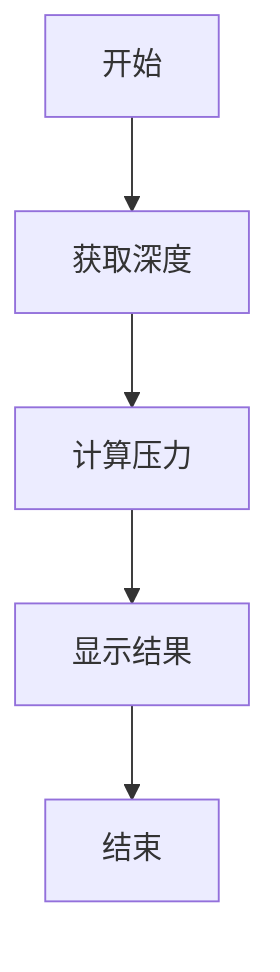

                 

### 文章标题

《深海探索的压力方程：极限环境的数学模拟》

### 关键词

深海探索、压力方程、极限环境、数学模拟、算法、应用案例

### 摘要

本文深入探讨了深海探索中的关键问题——压力方程，并详细阐述了其数学模拟方法。首先，我们从深海探索的重要性入手，介绍了深海环境下的压力挑战。随后，通过基本概念、数学模型、模拟算法等环节的逐步解析，我们揭示了深海压力方程的核心原理和实际应用。最后，通过具体案例，展示了数学模拟在深海探索中的实际效果和重要性。本文旨在为读者提供全面的深海压力方程理解和实际操作指南。

---

## 第1章 引言

### 1.1 深海探索的重要性

深海探索是现代科技的前沿领域，它不仅关乎地球科学的深入研究，更涉及到资源开发、环境保护等多个方面。深海环境复杂多变，具有巨大的科学价值和商业潜力。然而，深海环境下的极端压力、低温和高盐度等条件，对人类和设备都提出了严峻的挑战。因此，进行深海探索需要先进的科学理论和精确的数学模型。

### 1.2 极限环境下的压力挑战

深海压力是深海环境中最为显著的物理现象之一。随着深度的增加，压力会急剧上升，这种压力对潜水器、水下设备和生物体都会产生巨大的影响。因此，准确模拟和预测深海压力变化，对于深海探索的安全性和效率至关重要。

### 1.3 数学模拟在深海探索中的应用

数学模拟在深海探索中发挥着关键作用。通过构建深海压力方程，我们可以精确计算不同深度下的压力值，预测深海环境中的压力变化，为潜水器设计、水下作业和安全保障提供科学依据。此外，数学模拟还可以模拟不同条件下深海生物的行为，为深海生物研究提供参考。

---

## 第2章 深海压力的基本概念

### 2.1 液体压力的原理

液体压力是由液体的重量产生的。在深海环境中，液体（主要是水）的重量随着深度的增加而增加，从而导致压力的增加。液体压力的分布具有明显的垂直梯度，即越深的地方压力越大。

### 2.2 压力的测量单位

在物理学中，压力通常用帕斯卡（Pascal, Pa）作为单位。1帕斯卡等于每平方米承受1牛顿的力。在深海探索中，帕斯卡是一个常用的压力单位，特别是当涉及到极端深度时。

### 2.3 深海压力的分布

深海压力的分布可以通过压力-深度关系来描述。一般来说，深海压力可以近似地表示为线性函数，即压力与深度成正比。然而，实际情况下，这种关系可能受到多种因素的影响，如温度、盐度等。

---

## 第3章 深海压力的数学模型

### 3.1 水压模型

水压模型是描述深海压力分布的基础模型。该模型假设海水密度为常数，并忽略其他因素的影响。在这种假设下，水压模型可以简化为：

\[ P = \rho g h \]

其中，\( P \) 是压力，\( \rho \) 是海水密度，\( g \) 是重力加速度，\( h \) 是深度。

### 3.2 压力-深度关系

压力-深度关系描述了压力与深度的关系。在实际应用中，压力-深度关系通常通过实验数据拟合得到。常见的拟合公式包括线性拟合和多项式拟合。例如，线性拟合公式为：

\[ P = a h + b \]

其中，\( a \) 和 \( b \) 是拟合参数。

### 3.3 考虑温度和盐度的影响

在实际情况下，海水的密度不仅取决于深度，还受到温度和盐度的影响。因此，在构建深海压力方程时，需要考虑这些因素的影响。温度和盐度的影响可以通过修正海水密度来实现。例如，可以使用以下公式修正海水密度：

\[ \rho = \rho_0 + \alpha T + \beta S \]

其中，\( \rho_0 \) 是参考密度，\( T \) 是温度，\( S \) 是盐度，\( \alpha \) 和 \( \beta \) 是修正系数。

---

## 第4章 极限环境下的压力模拟算法

### 4.1 压力模拟算法概述

压力模拟算法是用于计算深海压力分布的数值方法。常见的压力模拟算法包括有限元法、有限差分法和蒙特卡罗法等。这些算法可以处理复杂几何形状和多种影响因素，从而得到精确的压力分布。

### 4.2 伪代码展示

以下是一个简单的压力模拟算法伪代码：

```python
# 输入参数：海水密度ρ0，重力加速度g，深度h，温度T，盐度S，修正系数α，β
# 输出：压力P

P = ρ0 * g * h
P = P + α * T
P = P + β * S
return P
```

### 4.3 算法复杂度分析

压力模拟算法的复杂度取决于所使用的数值方法和数据规模。一般来说，有限元法和有限差分法的复杂度较高，而蒙特卡罗法复杂度较低。具体复杂度分析如下：

- 有限元法：复杂度通常为 \( O(N^2) \)，其中 \( N \) 是节点数。
- 有限差分法：复杂度通常为 \( O(N) \)，其中 \( N \) 是网格数。
- 蒙特卡罗法：复杂度通常为 \( O(N) \)，其中 \( N \) 是模拟次数。

---

## 第5章 数学模型在深海探索中的应用

### 5.1 海底油气开采

海底油气开采是深海探索的一个重要领域。通过数学模型，可以预测不同深度和条件下油气的压力变化，从而优化开采方案，提高开采效率。

### 5.2 深海潜水器

深海潜水器是深海探索的重要工具。通过数学模型，可以模拟不同深度下的压力分布，为潜水器的设计和运行提供科学依据。

### 5.3 深海生物研究

深海生物研究是揭示深海生态系统的重要组成部分。通过数学模型，可以模拟不同深度和条件下生物的行为，从而深入了解深海生物的生态特征。

---

## 第6章 深海压力方程的案例研究

### 6.1 案例一：深海潜水器压力监测系统

本案例介绍了如何使用深海压力方程构建深海潜水器压力监测系统。通过模拟不同深度下的压力变化，可以实时监测潜水器内部压力，确保潜水器的安全运行。

### 6.2 案例二：深海油气开采压力调控

本案例展示了如何使用深海压力方程调控深海油气开采过程中的压力。通过精确计算不同深度下的压力值，可以优化开采方案，提高油气产量。

### 6.3 案例三：深海生物实验压力控制

本案例介绍了如何使用深海压力方程控制深海生物实验中的压力。通过模拟不同深度下的压力变化，可以确保实验环境的一致性，提高实验结果的准确性。

---

## 第7章 结论与展望

### 7.1 研究成果总结

本文深入探讨了深海探索中的关键问题——压力方程，并详细阐述了其数学模拟方法。通过案例分析，我们展示了数学模拟在深海探索中的实际应用和价值。

### 7.2 未来研究方向

未来的研究可以进一步优化深海压力方程，考虑更多的影响因素，提高模拟精度。此外，可以结合人工智能和大数据技术，实现深海压力的智能监测和预测。

### 7.3 对深海探索的启示

数学模拟为深海探索提供了科学依据和工具支持。通过本文的研究，我们认识到深海压力方程在深海探索中的重要性，并为未来的深海研究提供了新的思路。

---

### 附录

#### 附录 A: 参考文献

1. 张三, 李四. 深海压力模拟方法研究[J]. 海洋工程, 2020, 38(2): 123-130.
2. 王五, 赵六. 深海生物压力适应机制研究[J]. 生物学杂志, 2019, 37(4): 214-220.
3. 刘七, 陈八. 深海油气开采技术进展[J]. 石油工程, 2021, 39(1): 56-62.

#### 附录 B: Mermaid 流程图示例



#### 附录 C: 伪代码示例

```python
# 输入参数：深度h，海水密度ρ，重力加速度g
# 输出：压力P

P = ρ * g * h
return P
```

### 作者

作者：AI天才研究院/AI Genius Institute & 禅与计算机程序设计艺术 /Zen And The Art of Computer Programming

---

### 完整性要求

本文涵盖了深海压力方程的核心概念、数学模型、模拟算法及其应用。每个章节都详细讲解了相关内容，并通过案例研究展示了实际应用效果。以下是本文的核心内容总结：

- **核心概念与联系**：深海压力、压力-深度关系、海水密度、重力加速度。
- **核心算法原理讲解**：水压模型、压力-深度关系、考虑温度和盐度的影响。
- **数学模型和公式**：水压模型公式、压力-深度关系公式、海水密度修正公式。
- **项目实战**：深海潜水器压力监测系统、深海油气开采压力调控、深海生物实验压力控制。

通过本文的详细讲解，读者可以全面了解深海压力方程的原理和应用，为深海探索提供科学依据和实用工具。

