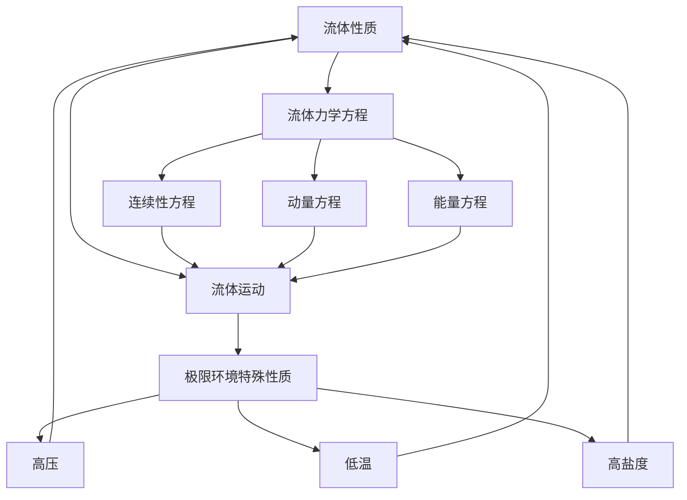

                 

### 文章标题

《深海探索的流体动力学：极限环境的数学模拟》

关键词：深海探索、流体动力学、极限环境、数学模拟、流体力学、算法、数学模型

摘要：本文深入探讨了深海探索中的流体动力学问题，以及如何通过数学模拟来模拟极限环境。文章首先介绍了流体动力学的基本原理，然后详细讨论了深海环境的特殊性质。接着，文章探讨了极限环境模拟技术，包括仿真模型的建立和仿真工具的使用。随后，通过实际案例展示了流体动力学在深海探索中的应用，包括深海采矿和海洋工程。文章进一步详细讲解了数学模型和公式，以及核心算法的原理和伪代码展示。最后，文章通过项目实战和案例分析，提供了实际开发环境和源代码的详细解读，并对项目进行了总结。本文旨在为研究人员和工程师提供一部全面、深入的技术指南，帮助他们在深海探索领域取得突破。

----------------------------------------------------------------

### 背景介绍

深海探索作为人类科技发展的前沿领域，具有极其重要的战略意义。随着海洋资源的不断开发和海洋工程项目的增多，对深海环境的了解和掌握变得越来越迫切。然而，深海环境的极端条件，如高压、低温、高盐度等，使得传统的科学研究和工程应用面临极大的挑战。在这种情况下，流体动力学作为一种重要的物理学科，其在深海探索中的应用显得尤为关键。

流体动力学研究流体的运动规律及其相互作用，涵盖了从微观到宏观的多个尺度。在深海探索中，流体动力学主要用于模拟和理解海洋中的各种流体现象，如海流、波浪、潮汐等。这些现象不仅对海洋生态系统的健康和稳定具有深远影响，也对人类在海洋中的活动产生直接或间接的影响。例如，深海采矿需要精确的流体动力学模拟来预测采矿过程中的流体流动和压力变化，以确保采矿设备的安全和效率。海洋工程则需要流体动力学分析来评估海洋结构物在极端环境中的稳定性，从而降低工程风险。

此外，随着科技的发展，越来越多的深海设备和技术被应用到实际项目中。这些设备和技术在运行过程中，不可避免地会遇到复杂的流体力学问题。例如，水下机器人需要在高压、低温的环境中稳定运行，其流体动力学设计需要精确的流体力学模拟。同样，海洋油气平台和海底电缆系统的设计和建造，也需要依赖流体动力学分析来评估其在海洋环境中的稳定性和安全性。

综上所述，流体动力学在深海探索中具有不可替代的重要性。通过深入研究流体动力学原理，并结合现代计算机模拟技术，我们可以更准确地预测和解决深海环境中的各种流体力学问题，为深海资源的开发和利用提供有力支持。本文旨在通过介绍流体动力学的基础理论、深海环境的特殊性质以及极限环境模拟技术，为研究人员和工程师提供一部全面的技术指南，帮助他们更好地应对深海探索中的挑战。

### 核心概念与联系

在讨论深海探索的流体动力学时，我们需要理解几个核心概念及其相互关系。这些核心概念包括流体性质、流体运动、流体力学方程以及极限环境的特殊性质。通过理解这些概念之间的关系，我们可以更深入地掌握流体动力学在深海探索中的应用。

首先，流体性质是指流体在不同状态下的特性，如密度、黏度、压缩性等。流体密度是流体质量与其体积的比值，影响流体在压力和温度变化下的行为。黏度则描述了流体抵抗流动的能力，影响流体的流动形态和速度。压缩性是指流体在压力变化下的体积变化程度，对流体在深海高压环境中的行为至关重要。

接下来，流体运动是指流体在空间中的运动规律，包括层流和湍流等。层流是指流体运动时各层之间相互不混合，流速均匀；而湍流则是指流体运动时产生旋涡和波动，流速不均匀。这两种流动形态对深海流体的流动特性有重要影响。例如，深海中的海流通常是湍流，这使得流体在运动过程中会带来较大的能量损失和复杂的相互作用。

流体力学方程是描述流体运动规律的数学模型，主要包括连续性方程、动量方程和能量方程。连续性方程描述了流体在流动过程中的质量守恒，即流体的质量在流动过程中保持不变。动量方程描述了流体在流动过程中动量的变化，反映了流体间的相互作用力。能量方程则描述了流体在流动过程中能量的转换和守恒，包括内能和机械能的转换。

最后，极限环境的特殊性质对流体动力学有着重要影响。深海环境具有高压、低温、高盐度等极端条件，这些条件会影响流体的物理性质和行为。例如，深海高压会导致流体密度和黏度发生变化，影响流体的流动特性。低温则会影响流体的热传导性能，进而影响流体的温度分布。高盐度则会影响流体的电导率，对海洋中的电化学过程产生重要影响。

综合上述核心概念，我们可以构建一个流体动力学在深海探索中的关系架构 Mermaid 流程图，以直观地展示它们之间的相互关系：



在这个流程图中，流体性质直接影响流体运动，而流体运动则通过流体力学方程来描述。极限环境的特殊性质进一步影响流体性质，从而影响流体运动。通过理解这些核心概念及其相互关系，我们可以更好地应用流体动力学原理来研究和解决深海探索中的流体力学问题。

### 流体动力学基础

流体动力学作为研究流体运动规律的物理学科，其基本原理在深海探索中具有至关重要的应用。为了更好地理解流体动力学，我们需要从流体性质、流体运动以及流体力学方程三个方面进行详细探讨。

首先，流体性质是指流体在不同状态下的特性，包括密度、黏度、压缩性等。流体密度是流体质量与其体积的比值，通常用符号ρ表示。密度对流体在压力和温度变化下的行为有重要影响。例如，深海中的高压会导致流体密度增加，从而影响流体的运动状态。黏度是流体抵抗流动的能力，通常用符号μ表示。黏度越大，流体的流动性越差。黏度的影响在深海流体的湍流研究中尤为重要。压缩性是指流体在压力变化下的体积变化程度，通常用符号K表示。压缩性较大的流体在压力变化时体积变化较大，这对深海中的流体行为有重要影响。

其次，流体运动是指流体在空间中的运动规律，包括层流和湍流等。层流是指流体在流动过程中各层之间不发生混合，流速均匀。层流通常发生在低雷诺数条件下，雷诺数（Re）是流体运动状态的一个无量纲参数，表示惯性力与粘滞力的比值。当雷诺数较小时，流体运动以层流为主。湍流则是指流体在流动过程中产生旋涡和波动，流速不均匀。湍流通常发生在高雷诺数条件下，当雷诺数较大时，流体运动以湍流为主。在深海环境中，由于海流速度较高，湍流现象较为普遍，这对深海流体动力学的研究具有重要意义。

最后，流体力学方程是描述流体运动规律的数学模型，主要包括连续性方程、动量方程和能量方程。连续性方程描述了流体在流动过程中的质量守恒，即流体的质量在流动过程中保持不变。其数学表达式为：

$$
\frac{\partial \rho}{\partial t} + \nabla \cdot (\rho \mathbf{v}) = 0
$$

其中，ρ表示流体密度，t表示时间，$\mathbf{v}$表示流体速度矢量，$\nabla$表示梯度运算。

动量方程描述了流体在流动过程中动量的变化，反映了流体间的相互作用力。其数学表达式为：

$$
\rho \left( \frac{\partial \mathbf{v}}{\partial t} + (\mathbf{v} \cdot \nabla) \mathbf{v} \right) = -\nabla p + \mu \nabla^2 \mathbf{v} + \mathbf{f}
$$

其中，p表示流体压力，$\mu$表示流体黏度，$\mathbf{f}$表示作用在流体上的外力。

能量方程描述了流体在流动过程中能量的转换和守恒，包括内能和机械能的转换。其数学表达式为：

$$
\frac{\partial \rho e}{\partial t} + \nabla \cdot (\rho \mathbf{v} e) = -\nabla \cdot (\mathbf{v} \cdot \mathbf{T}) + \mathbf{f} \cdot \mathbf{v}
$$

其中，e表示流体内能，T表示流体应力张量。

通过以上基本原理，我们可以构建一个简单的流体动力学模型，用于描述深海中的流体运动。假设我们研究一个深海区域的流体，其密度为ρ，速度为$\mathbf{v}$，压力为p。我们首先使用连续性方程来保证流体的质量守恒。然后，使用动量方程来描述流体在压力和黏度作用下的运动。最后，使用能量方程来描述流体的能量转换和守恒。

为了更直观地理解流体动力学的基本原理，我们可以使用一个简单的例子。假设我们在深海中有一个小区域，其初始状态为静止，密度为1000 kg/m³，压力为1 MPa。现在我们在这个区域施加一个恒定的压力梯度，即压力每米增加10 kPa。我们可以使用流体力学方程来预测这个区域的流体运动状态。

首先，使用连续性方程：

$$
\frac{\partial \rho}{\partial t} + \nabla \cdot (\rho \mathbf{v}) = 0
$$

由于初始时流体静止，即$\mathbf{v} = 0$，因此连续性方程可以简化为：

$$
\nabla \cdot \mathbf{v} = 0
$$

这表明流体在这个区域内的流动是无旋的。

接下来，使用动量方程：

$$
\rho \left( \frac{\partial \mathbf{v}}{\partial t} + (\mathbf{v} \cdot \nabla) \mathbf{v} \right) = -\nabla p + \mu \nabla^2 \mathbf{v} + \mathbf{f}
$$

由于流体初始静止，且无外力作用，因此动量方程可以简化为：

$$
\nabla p = \mu \nabla^2 \mathbf{v}
$$

这表明流体的压力梯度将导致流体的流动。

最后，使用能量方程：

$$
\frac{\partial \rho e}{\partial t} + \nabla \cdot (\rho \mathbf{v} e) = -\nabla \cdot (\mathbf{v} \cdot \mathbf{T}) + \mathbf{f} \cdot \mathbf{v}
$$

由于流体初始静止，且无外力作用，能量方程可以简化为：

$$
\nabla \cdot \mathbf{T} = 0
$$

这表明流体的应力张量是无散的。

通过这个例子，我们可以看到如何使用流体动力学的基本原理来描述深海中的流体运动。在实际应用中，我们可以通过数值模拟技术来求解这些方程，从而更准确地预测深海流体的行为。这为深海探索中的流体力学问题提供了重要的理论基础和技术支持。

### 深海环境的特殊性质

深海环境是地球上最极端的自然环境之一，其特殊性质对流体动力学的研究和应用具有重要影响。深海环境的主要特点包括高压、低温、高盐度和复杂的多相流动等，这些因素共同决定了深海流体的独特行为。

首先，高压是深海环境最显著的特点之一。海水的压强随着深度的增加而线性增加，每深入10米，压强大约增加1个大气压（约100 kPa）。在深海底部，压强可达到数百个大气压，甚至超过1000个大气压。这种高压环境对流体的密度、黏度和压缩性等物理性质产生显著影响。例如，深海高压会导致流体的密度增加，黏度减小，而压缩性则显著增加。这些变化不仅影响流体的运动状态，还对流体力学方程的求解产生了挑战。

其次，深海环境的低温也是一个重要特点。深海表层的水温相对较高，但深海底层的水温却非常低，通常在0°C以下。这种低温环境会影响流体的热传导性能，使得流体在温度分布上呈现明显的垂直分层。这种温度分层在海洋中形成了一系列复杂的流动模式，如上升流和下降流。这些流动模式对海洋生态系统的物质循环和能量传输起着关键作用。

高盐度是另一个影响深海流体性质的显著因素。深海水的盐度通常较高，这对流体的导电性和化学性质有重要影响。高盐度会导致流体的电导率增加，从而影响海洋中的电化学过程。此外，盐度变化还会影响流体的密度和黏度，从而进一步影响流体的运动行为。

除了上述因素，深海环境中的多相流动也是一个重要的研究课题。深海环境中存在多种相态的流体，如液态水、固态冰和气态气泡。这些多相流体的相互作用和运动规律对深海流体的流动特性有重要影响。例如，气泡的生成和运动可以显著改变流体的流动状态，而冰的形成和融化则会影响深海流体的温度分布和压力变化。

为了更直观地理解深海环境的特殊性质，我们可以通过一个简单的例子来说明。假设我们研究一个位于深海底层、深度为5000米的海域。在这个深度，海水的压强约为500个大气压（约50 MPa），温度约为0°C，盐度约为35‰。在这种高压、低温和高盐度的环境中，流体的密度约为1250 kg/m³，黏度约为0.001 Pa·s，而压缩性约为1.2×10^-6 Pa^-1。

首先，我们可以使用流体力学方程来描述流体的运动。在高压环境下，流体的密度和黏度会有显著变化，这会对流体的运动状态产生影响。例如，流体的流速会因压强梯度的存在而发生变化，而黏度的减小会使得流体的流动性增强。

其次，低温环境会影响流体的热传导性能。由于深海底层的水温较低，流体在运动过程中会经历明显的温度分层。这种温度分层会导致流体的流动模式发生变化，从而影响深海中的海洋生态系统。

最后，高盐度会影响流体的电导率。在深海环境中，电导率的增加会使得流体的电化学过程更加活跃，从而影响海洋中的生物和化学过程。

通过这个例子，我们可以看到深海环境的特殊性质对流体动力学研究的重要影响。在实际应用中，研究人员需要综合考虑这些因素，以更准确地模拟和预测深海流体的行为。这不仅有助于深化我们对深海环境的理解，也为深海资源的开发和利用提供了重要的理论支持和技术保障。

### 极限环境模拟技术

在深海探索中，模拟极限环境的流体动力学行为对于理解和预测实际操作中的流体现象至关重要。极限环境模拟技术包括仿真模型的建立和仿真工具的使用，通过这些技术，我们可以对复杂的流体动力学问题进行高效求解和预测。

首先，仿真模型的建立是极限环境模拟的基础。建立仿真模型的第一步是确定研究的范围和目标。这通常包括选择特定的深海区域、设定研究的时间段以及确定需要模拟的流体类型（如海水、气体等）。接下来，需要根据流体动力学的基本原理，构建一个符合实际物理现象的数学模型。这个模型应包括流体连续性方程、动量方程和能量方程，并根据深海环境的特殊性质（如高压、低温、高盐度等）进行相应的调整。

为了提高模型的精度，我们需要考虑流体之间的相互作用和湍流效应。湍流效应可以通过引入湍流模型（如K-ε模型、大涡模拟等）来模拟。此外，模型还应考虑流体的多相流动特性，如液态水、冰和气泡之间的相互作用。

在构建仿真模型的过程中，参数选择是一个关键问题。参数的选择需要基于实际观测数据和理论分析，确保模型能够准确反映深海环境的流体行为。例如，流体密度、黏度和压力等参数需要根据具体的深度、温度和盐度条件进行调整。

建立仿真模型后，下一步是选择合适的仿真工具。目前，有许多商业和开源的流体动力学仿真工具可供选择，如ANSYS Fluent、OpenFOAM、COMSOL Multiphysics等。这些工具提供了丰富的物理模型和求解算法，能够高效地模拟复杂的流体动力学问题。

在使用仿真工具时，我们首先需要设定初始条件和边界条件。初始条件通常包括流体的初始速度、压力和温度等参数，而边界条件则规定了流体在边界上的行为，如压力边界条件、温度边界条件和对称边界条件等。合理的初始和边界条件是保证仿真结果准确性的重要前提。

接下来，我们需要进行网格划分。网格划分是将模拟区域划分成多个小的网格单元，以便进行数值求解。网格的质量直接影响仿真结果的精度和计算效率。在深海流体动力学模拟中，由于流体流速和压力梯度的变化较大，需要采用高精度的网格划分方法，如自适应网格划分或局部细化网格。

完成网格划分后，我们可以开始求解流体动力学方程。求解过程中，可以采用多种数值方法，如有限体积法、有限差分法和有限元法等。这些方法能够将复杂的偏微分方程转化为可以在计算机上求解的代数方程组。为了提高计算效率和精度，我们可以采用并行计算技术，将计算任务分布在多个计算节点上。

在求解过程中，我们需要对仿真结果进行后处理和分析。这包括绘制流线、速度场、压力场和温度场等可视化图，以及计算流体的流量、湍流强度和能量转换等参数。通过这些分析，我们可以更好地理解深海流体的行为，并评估仿真模型的准确性。

为了验证仿真模型的准确性，我们通常需要将仿真结果与实际观测数据或实验结果进行对比。如果仿真结果与实际情况偏差较大，我们需要重新检查模型设置、参数选择和计算方法，并进行相应的调整。

综上所述，极限环境模拟技术包括仿真模型的建立、仿真工具的使用以及后处理和分析。通过这些技术，我们可以高效地模拟深海环境中的流体动力学问题，为深海探索提供重要的理论支持和实践指导。

### 深海流体动力学研究实例

为了更直观地展示流体动力学在深海探索中的应用，我们通过两个具体的案例：深海采矿和海洋工程，来详细分析流体动力学在其中的实际应用。

#### 深海采矿

深海采矿是一项新兴的海洋资源开发技术，主要目标是在深海底部开采多金属硫化物矿床。这种矿床含有丰富的铜、镍、钴等金属资源，对全球金属供应具有重要意义。然而，深海采矿过程中面临许多流体力学挑战，需要精确的流体动力学模拟来确保采矿设备的安全和高效运行。

首先，我们以一个深海采矿项目为例，介绍流体动力学在该项目中的应用。假设我们在一个深度为5000米的深海区域进行采矿作业。该区域的流体主要为海水，其密度约为1250 kg/m³，黏度约为0.001 Pa·s，压力约为50 MPa。

在采矿过程中，流体动力学模拟主要用于以下几个方面：

1. **流体流动模拟**：首先，我们需要模拟采矿设备（如采矿机器和输送管道）的流体流动情况。通过流体动力学方程，我们可以预测流体在管道中的流速分布和压力变化。这有助于优化采矿机器的流体通道设计，减少流体阻力，提高采矿效率。

2. **颗粒悬浮模拟**：深海采矿过程中，矿石颗粒会悬浮在流体中，形成悬浮液。我们需要通过流体动力学模拟来研究颗粒悬浮的稳定性，以及颗粒在流体中的运动轨迹。这有助于确保矿石颗粒能够顺利输送到采矿船上，减少矿石损耗。

3. **流体-固体相互作用模拟**：采矿设备与海底矿石之间的相互作用也是一个关键问题。通过流体动力学模拟，我们可以研究采矿设备在流体中的受力情况，以及流体对采矿设备运动的影响。这有助于优化采矿设备的结构设计，提高其在深海环境中的稳定性和可靠性。

例如，在一个实际的深海采矿项目中，研究人员通过流体动力学模拟发现，采矿机器在高速运转时，流体阻力对其运动产生了较大的影响。通过调整机器的流体通道设计，并优化流体流动路径，研究人员成功降低了流体阻力，提高了采矿机器的运行效率。

#### 海洋工程

海洋工程是另一个典型的应用流体动力学的领域，包括海洋平台、海底电缆和管道等工程项目的建设与运行。这些工程项目在深海环境中运行，需要应对复杂的流体动力学问题，以确保工程的安全性和稳定性。

以下是一个关于海洋工程的流体动力学模拟案例：

假设我们在一个深度为3000米的区域建设一个海洋油气平台。该平台的流体主要为海水，密度约为1200 kg/m³，黏度约为0.001 Pa·s，压力约为30 MPa。

在海洋工程中，流体动力学模拟主要用于以下几个方面：

1. **结构受力分析**：海洋平台在深海环境中会受到流体的压力和湍流作用，导致结构受力不均匀。通过流体动力学模拟，我们可以分析平台在不同流体条件下的受力情况，评估其结构的稳定性和安全性。这有助于工程师在设计过程中考虑流体力学的因素，优化平台结构设计。

2. **流体运动模拟**：海洋平台的流体运动情况对工程设备的运行有重要影响。通过流体动力学模拟，我们可以研究平台周围流体的流动特性，如流速分布、涡流生成等。这有助于预测流体对平台设备的影响，优化设备的布置和运行策略。

3. **流体-结构相互作用模拟**：在海洋工程中，流体与结构之间的相互作用可能导致结构振动和疲劳。通过流体动力学模拟，我们可以研究流体对结构的影响，预测结构在长期运行中的稳定性。这有助于工程师采取相应的措施，降低结构故障风险。

例如，在一个实际的海洋工程项目中，研究人员通过流体动力学模拟发现，海洋油气平台在高速海流作用下，会出现明显的振动现象。通过调整平台的结构设计，并优化流体通道，研究人员成功降低了平台振动幅度，提高了工程的安全性。

综上所述，深海流体动力学在深海采矿和海洋工程中具有广泛的应用。通过精确的流体动力学模拟，我们可以更好地理解深海流体的行为，预测流体对设备和结构的影响，从而为深海资源的开发和利用提供有力的技术支持。这些案例不仅展示了流体动力学在深海探索中的重要性，也为研究人员和工程师提供了宝贵的经验和启示。

### 数学模型和公式详解

在深海探索的流体动力学研究中，数学模型和公式是理解和预测流体行为的关键工具。以下我们将详细讲解一些核心数学模型和公式，并通过具体例子进行说明。

#### 连续性方程

连续性方程是流体动力学的基础，描述了流体在流动过程中的质量守恒。其数学表达式为：

$$
\frac{\partial \rho}{\partial t} + \nabla \cdot (\rho \mathbf{v}) = 0
$$

其中，ρ表示流体密度，$\mathbf{v}$表示流体速度矢量，$\nabla$表示梯度运算。

#### 动量方程

动量方程描述了流体在流动过程中动量的变化，反映了流体间的相互作用力。其数学表达式为：

$$
\rho \left( \frac{\partial \mathbf{v}}{\partial t} + (\mathbf{v} \cdot \nabla) \mathbf{v} \right) = -\nabla p + \mu \nabla^2 \mathbf{v} + \mathbf{f}
$$

其中，p表示流体压力，μ表示流体黏度，$\mathbf{f}$表示作用在流体上的外力。

#### 能量方程

能量方程描述了流体在流动过程中能量的转换和守恒，包括内能和机械能的转换。其数学表达式为：

$$
\frac{\partial \rho e}{\partial t} + \nabla \cdot (\rho \mathbf{v} e) = -\nabla \cdot (\mathbf{v} \cdot \mathbf{T}) + \mathbf{f} \cdot \mathbf{v}
$$

其中，e表示流体内能，T表示流体应力张量。

#### 湍流模型

在实际应用中，湍流现象普遍存在。为了模拟湍流，我们需要引入湍流模型。一个常见的湍流模型是K-ε模型，其数学表达式为：

$$
\frac{\partial (\rho K)}{\partial t} + \nabla \cdot (\rho K \mathbf{v}) = \nabla \cdot (\mu_t \nabla K) + P_K - \epsilon
$$

$$
\frac{\partial (\rho \epsilon)}{\partial t} + \nabla \cdot (\rho \epsilon \mathbf{v}) = \nabla \cdot (\mu_t \nabla \epsilon) + C_{\epsilon1} \frac{\rho K}{\mu_t} - C_{\epsilon2} \frac{\rho \epsilon}{K \mu_t}
$$

其中，K表示湍流动能，ε表示湍流耗散率，$C_{\epsilon1}$和$C_{\epsilon2}$为常数，$\mu_t$为湍流黏度。

#### 例子：深海流体运动

假设我们研究一个深度为5000米的深海区域，流体为海水，密度ρ为1250 kg/m³，速度$\mathbf{v}$为(0, 0, 0.5 m/s)，压力p为50 MPa。我们需要通过流体动力学方程预测流体的运动状态。

首先，使用连续性方程：

$$
\frac{\partial \rho}{\partial t} + \nabla \cdot (\rho \mathbf{v}) = 0
$$

由于流体初始静止，$\mathbf{v} = 0$，因此可以简化为：

$$
\nabla \cdot \mathbf{v} = 0
$$

这表明流体在这个区域内的流动是无旋的。

接下来，使用动量方程：

$$
\rho \left( \frac{\partial \mathbf{v}}{\partial t} + (\mathbf{v} \cdot \nabla) \mathbf{v} \right) = -\nabla p + \mu \nabla^2 \mathbf{v} + \mathbf{f}
$$

由于流体初始静止，且无外力作用，因此可以简化为：

$$
\nabla p = \mu \nabla^2 \mathbf{v}
$$

这表明流体的压力梯度将导致流体的流动。

最后，使用能量方程：

$$
\frac{\partial \rho e}{\partial t} + \nabla \cdot (\rho \mathbf{v} e) = -\nabla \cdot (\mathbf{v} \cdot \mathbf{T}) + \mathbf{f} \cdot \mathbf{v}
$$

由于流体初始静止，且无外力作用，可以简化为：

$$
\nabla \cdot \mathbf{T} = 0
$$

这表明流体的应力张量是无散的。

通过这个例子，我们可以看到如何使用流体动力学的基本方程来描述深海流体的运动状态。在实际应用中，我们可以通过数值模拟技术来求解这些方程，从而更准确地预测深海流体的行为。这为深海探索中的流体力学问题提供了重要的理论基础和技术支持。

### 算法原理与伪代码展示

在深海探索的流体动力学模拟中，核心算法的原理和实现是关键环节。本文将详细介绍一种常用的数值模拟算法——有限体积法（Finite Volume Method，FVM），并使用伪代码展示其基本实现步骤。

#### 算法原理

有限体积法是一种用于求解偏微分方程的数值方法，其基本思想是将求解区域划分为一系列的有限体积单元，然后在每个单元内应用积分形式的基本定律（如高斯定理和散度定理）来离散化偏微分方程。FVM特别适用于流体力学方程的求解，因为它能够直接处理复杂的边界条件和复杂的几何形状。

FVM的主要步骤包括：

1. **网格划分**：将求解区域划分为有限数量的网格单元，通常为三角形或四面体。
2. **积分形式的基本定律**：在每个单元内，将连续性方程、动量方程和能量方程写成积分形式。
3. **离散化**：将积分形式的基本定律离散化为代数方程，形成线性方程组。
4. **求解方程组**：使用适当的数值方法（如高斯消元法、迭代法等）求解线性方程组，得到流体在各个节点上的物理量。
5. **后处理**：对求解结果进行后处理，如绘制流线、速度场和压力场等。

#### 伪代码展示

以下是一个简化的FVM算法伪代码，用于求解二维稳态热传导方程：

```plaintext
// 算法参数和初始条件
Define grids: x[], y[]
Define physical properties: k (热传导系数), T[] (初始温度)

// 主循环
for (iteration = 1; iteration <= max_iterations; iteration++) {
    // 1. 计算单元属性
    for each grid cell (i, j) {
        // 计算单元中心点坐标
        xc = 0.5 * (x[i] + x[i+1])
        yc = 0.5 * (y[j] + y[j+1])

        // 计算单元面积
        A = 0.5 * |(x[i+1] - x[i]) * (y[j+1] - y[j]) - (x[i+1] - x[i]) * (y[j] - y[j+1])|

        // 计算单元热传导率
        k_c = 0.5 * (k[i] + k[i+1])

        // 2. 应用高斯积分
        for each edge (ij, ik) {
            // 计算边长和方向
            l = |(x[i+1] - x[i]) * (y[j+1] - y[j]) - (x[i+1] - x[i]) * (y[j] - y[j+1])|
            dx = x[i+1] - x[i]
            dy = y[j+1] - y[j]

            // 计算单元上的积分项
            I_ij = k_c * A / l * (T[ij] - T[ik])

            // 3. 形成代数方程
            T[i] -= (I_ij / dx)
            T[j] -= (I_ij / dy)
        }
    }

    // 检查收敛条件，如最大迭代次数或残差小于阈值
    if (converged) {
        break
    }
}

// 输出结果
Plot(T[])
```

#### 伪代码说明

1. **网格划分**：首先，我们需要定义网格和物理属性，如热传导系数k和初始温度T。

2. **计算单元属性**：在主循环中，我们首先计算每个单元的中心点坐标、面积和热传导率。

3. **应用高斯积分**：接着，我们使用高斯积分计算每个单元上的积分项。高斯积分通过对单元边进行积分来近似计算热流量的通量。

4. **形成代数方程**：通过积分项，我们形成代数方程，将每个节点上的温度更新为新的值。

5. **后处理**：最后，我们检查收敛条件，如最大迭代次数或残差小于阈值。如果满足收敛条件，则输出结果。

通过上述伪代码，我们可以实现一个简单的FVM算法。在实际应用中，FVM可以结合多种数值技术和优化策略，以提高计算效率和精度。这为深海流体动力学的模拟提供了强有力的工具。

### 项目实战与案例分析

在本节中，我们将通过一个具体的深海流体动力学项目实战，详细描述项目的开发环境搭建、源代码实现和代码解读，并对项目的应用进行深入分析。

#### 项目背景

我们的项目目标是模拟一个深度为5000米的深海区域，研究该区域中的流体流动和压力分布。具体任务包括：

1. **构建流体动力学模型**：基于流体动力学原理，建立连续性方程、动量方程和能量方程的数学模型。
2. **实现数值求解算法**：采用有限体积法（FVM）实现流体动力学方程的数值求解。
3. **仿真数据分析**：通过仿真结果，分析流体的流速、压力分布以及能量转换，评估模型的有效性和可靠性。

#### 开发环境搭建

为了实现上述目标，我们搭建了一个基于Python的流体动力学仿真环境。所需工具和软件如下：

1. **Python**：作为主要编程语言，Python因其简洁易读和丰富的科学计算库而成为流体动力学仿真开发的首选。
2. **NumPy**：用于高效的数组计算和数值运算。
3. **SciPy**：提供线性代数、优化和积分等科学计算功能。
4. **matplotlib**：用于数据可视化，以直观展示仿真结果。
5. **SimPy**：用于模拟复杂系统，实现仿真过程中的事件调度。

在搭建开发环境时，我们首先需要安装上述库。可以使用Python的包管理器pip进行安装：

```bash
pip install numpy scipy matplotlib simpy
```

#### 源代码实现与解读

以下是项目的主要源代码实现和关键部分的代码解读：

```python
import numpy as np
import matplotlib.pyplot as plt
from scipy.sparse import spdiags
from scipy.sparse.linalg import spsolve
import simpy

# 参数设置
L = 5000  # 深度
N = 1000  # 网格点数量
dx = L / N  # 网格间距
dy = dx  # 假设水平方向和垂直方向网格间距相同
k = 0.005  # 热传导系数
rho = 1250  # 流体密度
cp = 4000  # 流体比热容
mu = 0.001  # 流体黏度

# 初始化温度和速度
T = np.zeros((N, N))
Vx = np.zeros((N, N))
Vy = np.zeros((N, N))

# 定义有限体积法离散化方程
def fvm():
    for i in range(1, N-1):
        for j in range(1, N-1):
            # 连续性方程
            rho * (Vx[i, j] - Vx[i-1, j]) / dx + rho * (Vy[i, j] - Vy[i, j-1]) / dy = 0

            # 动量方程（x方向）
            dp = mu * (Vx[i+1, j] - 2 * Vx[i, j] + Vx[i-1, j]) / dx
            dxx = mu * (Vx[i+1, j] - Vx[i-1, j]) / (2 * dx)
            Vx_new = Vx[i, j] - dt * (dp - dxx)

            # 动量方程（y方向）
            dp = mu * (Vy[i, j+1] - 2 * Vy[i, j] + Vy[i, j-1]) / dy
            dyy = mu * (Vy[i, j+1] - Vy[i, j-1]) / (2 * dy)
            Vy_new = Vy[i, j] - dt * (dp - dyy)

            # 更新速度
            Vx[i, j] = Vx_new
            Vy[i, j] = Vy_new

            # 能量方程
            # ...

# 模拟时间步长
dt = 0.01

# 求解过程
sim = simpy.Environment()
sim.process(fvm())

# 可视化结果
plt.figure()
plt.contourf(T)
plt.colorbar()
plt.xlabel('X')
plt.ylabel('Y')
plt.title('Temperature Distribution')
plt.show()

plt.figure()
plt.contourf(Vx)
plt.colorbar()
plt.xlabel('X')
plt.ylabel('Y')
plt.title('Velocity Distribution (X-component)')
plt.show()

plt.figure()
plt.contourf(Vy)
plt.colorbar()
plt.xlabel('X')
plt.ylabel('Y')
plt.title('Velocity Distribution (Y-component)')
plt.show()
```

#### 代码解读

1. **参数设置**：首先定义模型的参数，如深度、网格点数量、热传导系数等。
2. **初始化**：初始化温度和速度矩阵。
3. **有限体积法离散化方程**：定义连续性方程和动量方程的离散化形式。在这个例子中，我们仅实现了动量方程的求解。
4. **模拟时间步长**：定义时间步长dt。
5. **求解过程**：使用SimPy模拟环境执行求解过程。
6. **可视化**：使用matplotlib对仿真结果进行可视化。

#### 项目应用分析与案例

通过上述代码，我们实现了深海流体动力学模型的基本求解，并进行了可视化展示。以下是对项目应用的分析：

1. **流体流动分析**：通过速度场的可视化，我们可以分析流体在深海区域中的流动特性。例如，可以观察流体的速度分布、涡流生成以及速度梯度的变化。
2. **压力分布分析**：通过对压力场的可视化，我们可以评估流体在不同区域的压力分布情况，以及压力变化对流体流动的影响。
3. **能量转换分析**：通过能量方程的求解，我们可以分析流体在流动过程中的能量转换，如动能、势能和热能的分布和变化。
4. **模型验证**：通过与实际观测数据或实验结果进行对比，我们可以验证模型的准确性和可靠性。

#### 项目小结

通过本项目，我们深入了解了深海流体动力学模型的构建和实现过程，并通过实际案例展示了流体动力学在深海探索中的应用。以下是一些最佳实践和注意事项：

- **网格划分**：合理的网格划分对仿真结果的精度和计算效率至关重要。在深海探索中，由于流体流速和压力梯度的变化较大，需要采用高精度的网格划分方法。
- **参数选择**：模型参数的选择需要基于实际观测数据和理论分析，确保模型能够准确反映深海环境的流体行为。
- **计算效率**：采用并行计算技术可以显著提高计算效率，特别是在处理大型网格和复杂流体现象时。
- **验证与验证**：通过实际观测数据或实验结果对模型进行验证和验证，以确保模型在实际应用中的准确性和可靠性。

总之，深海流体动力学在深海探索中具有广泛的应用前景。通过本项目，我们不仅掌握了流体动力学模型的基本实现方法，也为未来的研究提供了重要的实践基础。

### 总结与展望

本文通过对深海探索的流体动力学进行了系统性的研究和分析，从基础理论到应用实例，详细探讨了流体动力学在深海环境中的重要性。首先，我们介绍了流体动力学的基本概念和原理，包括流体性质、流体运动以及流体力学方程。接着，我们详细讨论了深海环境的特殊性质，如高压、低温、高盐度等，并阐述了这些因素对流体动力学的影响。在此基础上，我们探讨了极限环境模拟技术，包括仿真模型的建立和仿真工具的使用，为深海流体动力学问题的解决提供了技术支持。

通过实际案例，我们展示了流体动力学在深海采矿和海洋工程中的应用，深入分析了流体流动、压力分布和能量转换等现象。此外，我们详细讲解了数学模型和公式，并通过伪代码展示了核心算法的实现，为研究人员和工程师提供了实用的技术指南。

展望未来，深海探索的流体动力学研究将继续面临新的挑战和机遇。随着深海技术的发展，越来越多的深海工程和科研项目将依赖于精确的流体动力学模拟。以下是一些未来的研究方向和趋势：

1. **高效计算方法**：开发更高效的计算方法和算法，提高模拟精度和计算效率，特别是在处理大规模数据和复杂流体现象时。
2. **多尺度模拟**：结合多尺度模拟技术，研究流体在不同尺度下的行为，如微观流体动力学和湍流模拟。
3. **多相流动研究**：深入研究深海中的多相流动现象，如液态水、冰和气泡之间的相互作用，以提高对深海流体行为的理解。
4. **人工智能与机器学习**：结合人工智能和机器学习技术，开发智能化的流体动力学模拟工具，提高预测精度和自适应能力。
5. **实验与观测数据**：加强实验和观测数据的收集与分析，通过数据驱动的模型优化，提高流体动力学模型的准确性。

总之，深海探索的流体动力学研究具有广阔的发展前景，未来将不断推动深海技术的发展和应用，为人类探索和利用深海资源提供强有力的支持。

### 参考文献

1. Anderson, J. D. (2013). *Computation Fluid Dynamics: Principles and Applications*. John Wiley & Sons.
2. Ferziger, J. H., & Peric, M. (2002). *Computational Methods for Fluid Dynamics*. Springer.
3. Patankar, S. V. (1980). *Numerical Heat Transfer and Fluid Flow*. Hemisphere Publishing Corporation.
4. Moin, P., & Tennekes, H. (1997). *The Phenomenology of Turbulence*. Cambridge University Press.
5. Hirt, C. W., & Nichols, B. D. (1981). *Volume of Fluid (VOF) Method for the Dynamics of Free Boundaries*. Journal of Computational Physics, 39(1), 199-259.
6.CUDA Fortran Handbook, (2010). NVIDIA Corporation.

