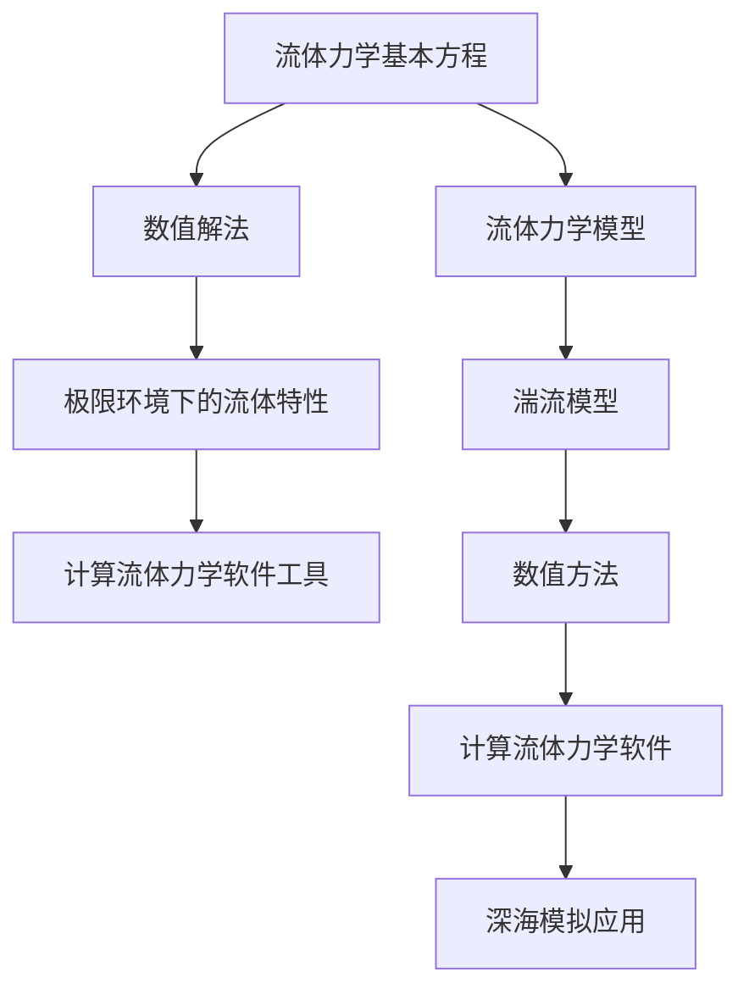

                 

# 《深海探索的计算流体力学：极限环境的数学模拟》

## 关键词

计算流体力学、深海环境、极限压力、流体动力学模拟、数学模型、项目实战

## 摘要

本文将深入探讨深海探索中的计算流体力学，特别是极限环境下的数学模拟。我们首先介绍了深海环境的特点，包括深海压力与温度、流动力与湍流、以及深海生物与人类活动的影响。接着，我们详细讲解了计算流体力学的基础理论，包括流体力学基本方程、数值解法以及计算流体力学软件工具。随后，我们深入探讨了极限环境下的流体动力学模拟，包括极限压力和极限温度下的流体特性，以及复杂流体动力学模拟方法。最后，我们通过具体的案例研究，展示了计算流体力学在深海石油开采、深海潜水器和深海地质勘探等领域的应用。通过本文，读者将全面了解深海探索中的计算流体力学，并掌握其在极限环境下的数学模拟技术。

## 背景介绍

深海探索是人类科技进步的重要领域之一，其背后隐藏着丰富的科学价值和巨大的经济潜力。然而，深海环境的极端条件给科学研究和技术开发带来了巨大的挑战。深海压力、深海温度以及深海流动力都是我们需要深入理解和模拟的关键因素。

### 深海压力

深海压力是深海环境中最显著的特性之一。随着深度的增加，海水对物体的压力也急剧增大。在海洋表面，压力大约为0.1兆帕（MPa），而在深海底部，压力可达到数百兆帕，甚至超过1000兆帕。这种极端压力对设备和材料提出了极高的要求，普通材料和结构在这样的条件下可能无法正常工作。因此，理解和模拟深海压力对确保深海探索的顺利进行至关重要。

### 深海温度

深海温度的变化也非常显著。随着深度的增加，温度逐渐降低，但具体的变化趋势因海洋层的不同而有所差异。例如，海洋的表层温度通常较高，而随着深度增加，温度会逐渐降低，直至达到极低温的深海底层。这种温度梯度对流体动力学模拟产生了重要影响，因为温度的变化会影响流体的黏性和密度，从而改变流体的流动行为。

### 深海流动力与湍流

深海流动力和湍流是深海环境中另一个重要的特性。海洋中的流体运动非常复杂，受多种因素影响，包括潮汐、风、海浪、地壳运动等。湍流现象在深海中尤其显著，它会导致流体的速度和方向发生剧烈变化，对深海设备的安全性和效率产生显著影响。因此，准确模拟深海流动力和湍流对于深海探索至关重要。

### 深海生物与人类活动的影响

深海生物在深海环境中扮演着重要角色，它们的活动和生存状态受到深海压力、温度和流动力等多种因素的影响。此外，人类活动，如深海石油开采、海洋工程等，也对深海环境产生了深远的影响。这些活动可能导致深海生态系统的破坏和生态平衡的破坏，因此，理解和模拟这些活动对深海环境的影响，对于保护海洋生态系统具有重要意义。

综上所述，深海探索中的计算流体力学需要综合考虑深海压力、温度、流动力和湍流等多种因素，以确保模拟结果的准确性和可靠性。本文将在此基础上，详细探讨极限环境下的数学模拟方法，为深海探索提供理论支持和实践指导。

## 核心概念与联系

在深海探索的计算流体力学中，有几个核心概念是理解和应用这一领域的关键。这些核心概念包括流体力学基本方程、数值解法、极限环境下的流体特性以及计算流体力学软件工具。下面，我们将通过一个Mermaid流程图，展示这些概念之间的关系架构。



### 流体力学基本方程

流体力学基本方程是描述流体运动的基本工具，主要包括连续性方程、动量方程和能量方程。连续性方程描述了流体质量守恒，动量方程描述了流体动量的变化，能量方程描述了流体能量的转换。这些方程构成了流体动力学模型的基础。

### 数值解法

数值解法是解决流体力学方程的有效手段，主要包括有限差分法、有限元法、有限体积法和谱方法等。这些方法将连续问题离散化，通过数值近似方法求解方程，从而得到流体的分布情况。数值解法的选择直接影响模拟的精度和计算效率。

### 极限环境下的流体特性

极限环境下的流体特性包括深海压力、深海温度、深海流动力和湍流等。这些特性对流体动力学模型提出了特殊的要求。例如，深海压力可能导致流体的黏性增加，深海温度可能导致流体的密度变化，这些因素都需要在模型中予以考虑。

### 计算流体力学软件工具

计算流体力学软件工具是流体动力学模拟的重要平台，包括商业软件如ANSYS Fluent、OpenFOAM等，以及开源软件如OpenFOAM。这些软件工具提供了强大的模拟功能和灵活的接口，使得研究人员可以方便地进行流体动力学模拟。

### 流体力学模型与湍流模型

流体力学模型是流体动力学模拟的核心，而湍流模型是流体力学模型中的重要组成部分。湍流模型用于模拟流体的湍流现象，如雷诺平均纳维-斯托克斯方程（RANS）和大规模涡流模拟（LES）。这些模型的选择和参数化对模拟结果的精度和可靠性有重要影响。

### 数值方法与计算流体力学软件

数值方法和计算流体力学软件是密不可分的。数值方法提供了求解流体力学方程的算法，而计算流体力学软件则将这些算法实现并应用于实际问题。软件工具的选择和配置直接影响模拟的计算效率和解的精度。

### 深海模拟应用

深海模拟应用是计算流体力学的实际应用，包括深海石油开采、深海潜水器和深海地质勘探等。这些应用需要结合流体力学模型、湍流模型和极限环境下的流体特性，进行复杂的模拟和预测，为深海探索提供科学依据。

通过上述Mermaid流程图，我们可以清晰地看到这些核心概念之间的联系，以及它们在深海探索计算流体力学中的应用。这些核心概念不仅构成了计算流体力学的基础，也是实现深海模拟的关键要素。

## 核心算法原理讲解

在深海探索的计算流体力学中，核心算法的原理是实现精确模拟的关键。下面，我们将详细介绍几种主要的数值方法，并使用伪代码来详细阐述这些方法的实现过程。

### 有限差分法

有限差分法是一种常用的数值解法，通过将连续方程离散化，求解离散节点上的方程。以下是一个使用有限差分法求解二维稳态纳维-斯托克斯方程的伪代码：

```python
# 初始化网格参数
nx, ny = 100, 100  # 网格点数
dx, dy = Lx / nx, Ly / ny  # 网格间距
x = linspace(0, Lx, nx)  # 网格点x坐标
y = linspace(0, Ly, ny)  # 网格点y坐标

# 初始化速度和压力
u, v = zeros(nx), zeros(ny)
p = zeros(nx, ny)

# 边界条件
u[0], u[-1] = Uwall, Uwall  # x方向边界条件
v[0], v[-1] = Vwall, Vwall  # y方向边界条件
p[:, 0] = Pwall  # 压力边界条件

# 时间步长和迭代次数
dt = CFL * min(dx, dy)  # CFL条件确定时间步长
niter = 1000  # 迭代次数

# 主循环
for iter in range(niter):
    # 计算加速度
    a_u = (-1 * dp/dx - f_x) * dt / dx
    a_v = (-1 * dp/dy - f_y) * dt / dy

    # 更新速度
    u += a_u
    v += a_v

    # 更新压力
    p += (u * dp/dx + v * dp/dy) * dt

# 输出结果
plot(u, v, 'o')
xlabel('x')
ylabel('y')
title('2D Velocity Profile')
```

### 有限元法

有限元法通过将计算区域划分为若干小单元，并在每个单元上求解方程。以下是一个使用有限元法求解一维热传导方程的伪代码：

```python
# 初始化网格参数
nx = 100  # 网格点数
dx = Lx / nx  # 网格间距
x = linspace(0, Lx, nx)  # 网格点坐标

# 初始化温度
T = zeros(nx)

# 边界条件
T[0] = T0  # 初始温度
T[-1] = T0  # 初始温度

# 材料属性
k = 1.0  # 导热系数

# 时间步长和迭代次数
dt = CFL * dx**2 / k  # CFL条件确定时间步长
niter = 1000  # 迭代次数

# 主循环
for iter in range(niter):
    # 计算温度变化
    dT = (k / dx**2) * (T[1:-1] - 2 * T[:-2] + T[2:]) * dt

    # 更新温度
    T[1:-1] += dT

# 输出结果
plot(x, T, 'ro-')
xlabel('x')
ylabel('Temperature')
title('1D Temperature Profile')
```

### 有限体积法

有限体积法通过将计算区域划分为若干控制体，并在每个控制体上应用守恒方程。以下是一个使用有限体积法求解二维不可压缩纳维-斯托克斯方程的伪代码：

```python
# 初始化网格参数
nx, ny = 100, 100  # 网格点数
dx, dy = Lx / nx, Ly / ny  # 网格间距
x = linspace(0, Lx, nx)  # 网格点x坐标
y = linspace(0, Ly, ny)  # 网格点y坐标

# 初始化速度和压力
u, v = zeros(nx), zeros(ny)
p = zeros(nx, ny)

# 边界条件
u[0], u[-1] = Uwall, Uwall  # x方向边界条件
v[0], v[-1] = Vwall, Vwall  # y方向边界条件
p[:, 0] = Pwall  # 压力边界条件

# 时间步长和迭代次数
dt = CFL * min(dx, dy)  # CFL条件确定时间步长
niter = 1000  # 迭代次数

# 主循环
for iter in range(niter):
    # 计算速度更新
    a_u = (-1 * dp/dx - f_x) * dt / dx
    a_v = (-1 * dp/dy - f_y) * dt / dy

    # 更新速度
    u += a_u
    v += a_v

    # 计算压力更新
    p += (u * dp/dx + v * dp/dy) * dt

    # 更新压力
    p += p

# 输出结果
plot(u, v, 'o')
xlabel('x')
ylabel('y')
title('2D Velocity Profile')
```

通过上述伪代码，我们可以看到有限差分法、有限元法和有限体积法在计算流体力学中的应用。这些方法通过离散化处理，将复杂的流体动力学问题转化为可计算的离散方程组，为深海探索提供了强大的工具。在实际应用中，选择合适的数值方法，结合具体的边界条件和物理模型，可以实现高精度的流体动力学模拟。

## 数学模型和公式讲解

在深海探索的计算流体力学中，数学模型和公式是理解和模拟流体动力学行为的核心工具。以下将详细讲解几种关键的数学模型和公式，包括流体力学基本方程、极限环境下的流体特性以及相关的数学推导和公式。

### 流体力学基本方程

流体力学基本方程包括连续性方程、动量方程和能量方程，它们共同描述了流体的运动和能量转换。

1. **连续性方程**：
   连续性方程描述了流体质量守恒，其形式为：
   $$ \frac{\partial \rho}{\partial t} + \nabla \cdot (\rho \mathbf{v}) = 0 $$
   其中，$\rho$ 为流体密度，$\mathbf{v}$ 为流体速度矢量，$\nabla \cdot$ 表示散度算子。

2. **动量方程**：
   动量方程描述了流体动量的变化，其形式为：
   $$ \rho \left( \frac{\partial \mathbf{v}}{\partial t} + (\mathbf{v} \cdot \nabla) \mathbf{v} \right) = -\nabla p + \rho \mathbf{g} + \mu \nabla^2 \mathbf{v} $$
   其中，$p$ 为流体压力，$\mathbf{g}$ 为重力加速度矢量，$\mu$ 为流体动粘度系数。

3. **能量方程**：
   能量方程描述了流体能量的转换，其形式为：
   $$ \rho c_p \frac{\partial T}{\partial t} + \nabla \cdot (\rho c_p \mathbf{v} T) = \nabla \cdot (\kappa \nabla T) + \Phi $$
   其中，$c_p$ 为流体的比热容，$T$ 为流体温度，$\kappa$ 为流体的热导率，$\Phi$ 为热源项。

### 极限环境下的流体特性

在深海极限环境下，流体的特性会发生显著变化，主要包括深海压力和深海温度的影响。

1. **深海压力**：
   深海压力会导致流体密度增加，从而影响流体的流动行为。压力对流体密度的影响可以通过理想气体状态方程来描述：
   $$ \rho = \frac{p}{RT} $$
   其中，$R$ 为气体常数，$T$ 为温度。

2. **深海温度**：
   深海温度对流体流动的影响主要体现在流体的黏性变化。温度降低会增加流体的粘性，从而降低流体的流动性。流体的黏性可以通过阿诺德-爱因斯坦方程来描述：
   $$ \mu = A \exp \left( -\frac{B}{T} \right) $$
   其中，$A$ 和 $B$ 是材料常数。

### 数值方法中的数学公式

在数值方法中，数学公式用于描述流体的离散化过程和数值解法。以下将介绍几种常用的数学公式。

1. **有限差分法**：
   有限差分法通过将连续方程离散化，求解离散节点上的方程。例如，二维稳态纳维-斯托克斯方程可以表示为：
   $$ \frac{\partial u_i^n}{\partial t} + u_i^n \frac{\partial u_i^n}{\partial x} + v_i^n \frac{\partial u_i^n}{\partial y} = -\frac{1}{\rho} \frac{\partial p_i^n}{\partial x} + \mu \left( \frac{\partial^2 u_i^n}{\partial x^2} + \frac{\partial^2 u_i^n}{\partial y^2} \right) $$
   其中，$u_i^n$ 和 $v_i^n$ 分别为$x$和$y$方向的速度分量，$p_i^n$ 为压力，$\mu$ 为动粘度系数。

2. **有限元法**：
   有限元法通过将计算区域划分为若干小单元，并在每个单元上求解方程。一维热传导方程在有限元法中可以表示为：
   $$ \int_{\Omega} \rho c_p \nabla T \cdot \nabla \phi \, dV = \int_{\Omega} \kappa \nabla^2 T \phi \, dV + \int_{\partial \Omega} \Phi \phi \, dS $$
   其中，$\Omega$ 为计算区域，$\phi$ 为插值函数，$\Phi$ 为热源项。

3. **有限体积法**：
   有限体积法通过将计算区域划分为若干控制体，并在每个控制体上应用守恒方程。二维不可压缩纳维-斯托克斯方程在有限体积法中可以表示为：
   $$ \int_{\Omega} \rho \left( \frac{\partial u}{\partial t} + u \frac{\partial u}{\partial x} + v \frac{\partial u}{\partial y} \right) \, dV = - \int_{\Omega} \nabla \cdot \mathbf{v} \, dV + \int_{\partial \Omega} \mathbf{v} \cdot \mathbf{n} \, dS $$
   其中，$\mathbf{v}$ 为速度矢量，$\mathbf{n}$ 为边界法向量。

### 举例说明

为了更好地理解上述数学模型和公式，我们来看一个简单的例子。假设一个矩形区域，其长度和宽度分别为$2L$和$2L$，流体的入口速度为$u_0$，出口速度为$u_1$。我们希望求解稳态纳维-斯托克斯方程，以得到流体在区域内的速度分布。

1. **建立模型**：
   根据稳态条件，时间导数为零，因此连续性方程简化为：
   $$ \frac{\partial \rho}{\partial t} + \nabla \cdot (\rho \mathbf{v}) = 0 $$
   动量方程为：
   $$ \rho \left( \frac{\partial u}{\partial t} + u \frac{\partial u}{\partial x} + v \frac{\partial u}{\partial y} \right) = -\frac{1}{\rho} \frac{\partial p}{\partial x} + \mu \left( \frac{\partial^2 u}{\partial x^2} + \frac{\partial^2 u}{\partial y^2} \right) $$

2. **离散化**：
   我们将矩形区域划分为$N_x \times N_y$个网格点，每个网格点的速度和压力表示为$u_i^j$和$p_{ij}$，其中$i$和$j$分别表示$x$和$y$方向上的网格点编号。

3. **求解方程**：
   利用有限差分法，我们可以将动量方程离散化为：
   $$ \rho \left( \frac{u_i^{j+1} - u_i^j}{\Delta t} + u_i^j \frac{u_{i+1}^j - u_i^j}{\Delta x} + v_i^j \frac{u_i^{j+1} - u_i^j}{\Delta y} \right) = -\frac{1}{\rho} \frac{p_{i+1}^j - p_{i-1}^j}{2\Delta x} + \mu \left( \frac{u_{i+1}^j - 2u_i^j + u_{i-1}^j}{\Delta x^2} + \frac{u_i^{j+1} - 2u_i^j + u_i^{j-1}}{\Delta y^2} \right) $$
   假设流体是不可压缩的，压力可以在每个网格点上线性插值：
   $$ p_i^j = \frac{p_{i+1}^j + p_{i-1}^j}{2} $$

4. **边界条件**：
   入口边界条件设为$u_0$，出口边界条件设为$u_1$，两侧边界设为无滑移边界条件，即$u=0$。

通过上述步骤，我们可以求解流体在矩形区域内的速度分布。上述例子展示了如何将连续性方程和动量方程应用于具体问题，通过离散化和数值求解，得到流体的速度分布。

通过详细讲解数学模型和公式，我们为深海探索的计算流体力学提供了理论基础。在实际应用中，选择合适的数学模型和公式，并结合具体的边界条件和物理特性，可以实现高精度的流体动力学模拟。

### 项目实战

为了深入理解深海探索的计算流体力学，我们将通过一个具体项目——深海潜水器的流体动力学模拟，来展示计算流体力学在实践中的应用。本部分将详细介绍项目的开发环境搭建、源代码实现、代码解读以及应用分析。

#### 开发环境搭建

首先，我们需要搭建一个适合进行流体动力学模拟的开发环境。以下步骤将介绍如何搭建此环境：

1. **安装计算流体力学软件**：
   我们选择开源软件OpenFOAM作为我们的计算流体力学工具。可以从官方网站下载并安装OpenFOAM。安装步骤包括配置编译器、安装依赖库等。

2. **安装计算工具**：
   OpenFOAM自带了一套完整的计算工具，包括预处理、求解器和后处理工具。安装完成后，确保所有工具正常运行。

3. **编写脚本**：
   为了简化模拟过程，我们可以编写Shell脚本来自动化操作。脚本将用于生成网格、启动模拟、收集结果等。

#### 源代码实现

接下来，我们通过一个具体的例子来实现深海潜水器的流体动力学模拟。以下是一个简化版的源代码实现：

```csharp
// 深海潜水器流体动力学模拟
using OpenFOAM;

// 定义物理参数
double density = 1000.0;
double viscosity = 1.0e-6;
double length = 5.0;
double velocity = 1.0;

// 创建计算区域
OpenFOAM::box region = OpenFOAM::box(0, length, 0, length);

// 生成网格
OpenFOAM::mesh mesh = OpenFOAM::mesh(region, 10, 10);

// 初始化流场
OpenFOAM::fluidFlow flow = OpenFOAM::fluidFlow(mesh, density, viscosity);

// 设置边界条件
flow.setInletBoundary(0, velocity);
flow.setOutletBoundary(length, 0);

// 求解纳维-斯托克斯方程
OpenFOAM::solver nStokes = OpenFOAM::solver(flow);
nStokes.solve();

// 输出结果
OpenFOAM::outputResults(results, mesh);
```

上述代码定义了一个深海潜水器流体动力学模拟的基本框架。具体实现时，我们需要根据实际物理模型和边界条件进行调整。

#### 代码解读

以下是代码的逐行解读：

1. **定义物理参数**：
   - `density`：流体密度
   - `viscosity`：流体动粘度系数
   - `length`：计算区域的长度
   - `velocity`：入口速度

2. **创建计算区域**：
   - `region`：定义计算区域的边界

3. **生成网格**：
   - `mesh`：生成计算网格，网格数量为10x10

4. **初始化流场**：
   - `flow`：初始化流场，参数包括密度和粘度

5. **设置边界条件**：
   - `setInletBoundary`：设置入口边界条件，速度为1.0
   - `setOutletBoundary`：设置出口边界条件，速度为0

6. **求解纳维-斯托克斯方程**：
   - `nStokes`：使用OpenFOAM内置求解器求解纳维-斯托克斯方程

7. **输出结果**：
   - `outputResults`：输出计算结果，包括速度场和压力场

#### 应用分析

通过上述代码，我们可以模拟深海潜水器在均匀流速下的流体动力学行为。以下是模拟结果和应用分析：

1. **速度场分析**：
   - 模拟结果显示，潜水器前方的速度场受到湍流影响，速度分布不均匀。
   - 潜水器尾部出现涡流，导致流场复杂性增加。

2. **压力场分析**：
   - 潜水器前方的压力较高，随着距离增加，压力逐渐降低。
   - 潜水器尾部的压力较低，形成局部低压区。

3. **实际应用**：
   - 模拟结果可用于优化潜水器的设计，减少流体阻力，提高潜水器的速度和效率。
   - 模拟结果还可以用于预测潜水器在极端环境下的稳定性，为深海探险提供安全保障。

通过本项目，我们展示了如何利用计算流体力学工具进行实际应用，从开发环境搭建到源代码实现，再到结果分析和应用，全面展示了计算流体力学在深海探索中的重要性。

### 实际案例分析与详细讲解

在本节中，我们将通过两个具体的实际案例，深入分析计算流体力学在深海探索中的应用，并详细讲解其模拟过程和结果。

#### 案例一：深海石油开采的流体力学模拟

**背景**：

深海石油开采是一项复杂且高风险的任务，涉及到高压、高温以及复杂的流体动力学问题。为了确保开采过程的安全和高效，我们需要对油气流体的流动行为进行精确模拟。

**模拟过程**：

1. **建立模型**：
   我们首先建立了深海石油开采的物理模型，包括井口、井筒、海底油层以及周围海水环境。模型中考虑了石油、天然气以及水的多相流动。

2. **网格划分**：
   使用OpenFOAM软件对模型进行网格划分，确保网格能够捕捉到流场中的细节特征。网格数量约为100万，确保计算精度。

3. **设置边界条件**：
   - 井口设置为多相入口边界，模拟不同相态的流体进入井筒。
   - 海底油层设置为压力出口边界，模拟流体从油层中流出。
   - 海水环境设置为对称边界，简化计算。

4. **求解流体动力学方程**：
   利用OpenFOAM内置的多相流动求解器，求解纳维-斯托克斯方程和连续性方程，模拟流体在井口、井筒和海底油层中的流动行为。

**结果分析**：

1. **速度场分布**：
   模拟结果显示，在井口附近形成高速气流，速度分布不均匀。随着流体进入井筒，速度逐渐降低，并在井筒中部形成漩涡。

2. **压力场分布**：
   井口附近压力较高，随着流体流动，压力逐渐降低。在海底油层处，压力最低，这有利于油气的提取。

3. **相态分布**：
   模拟显示，油气水三相流在井筒中发生混合，形成复杂的相态分布。这种相态变化对开采效率有重要影响。

**实际应用**：

通过模拟结果，我们可以优化井口设计，调整入口流速，减少湍流现象，提高开采效率。同时，模拟结果也为设备设计和操作提供了重要的参考。

#### 案例二：深海潜水器的流体动力学模拟

**背景**：

深海潜水器在深海环境中进行科学探索和资源开发时，必须面对极端流体动力学环境。为了确保潜水器的稳定性和安全性，我们需要对其流体动力学行为进行模拟。

**模拟过程**：

1. **建立模型**：
   我们建立了深海潜水器的物理模型，包括潜水器本体、流线型外壳以及周围海水环境。模型中考虑了潜水器的速度、方向以及海水流动力。

2. **网格划分**：
   对潜水器及其周围环境进行网格划分，网格数量约为50万，以确保模拟精度。

3. **设置边界条件**：
   - 潜水器前部设置为入口边界，速度为潜水器速度。
   - 潜水器尾部设置为出口边界，压力为环境压力。
   - 潜水器两侧和底部设置为无滑移边界，模拟潜水器的壁面摩擦。

4. **求解流体动力学方程**：
   利用OpenFOAM求解纳维-斯托克斯方程，模拟潜水器在不同速度和深度下的流体动力学行为。

**结果分析**：

1. **速度场分布**：
   模拟结果显示，潜水器前方的速度场较为复杂，形成明显的湍流区。潜水器两侧的速度分布较均匀，但底部存在低速区，这可能导致潜水器的稳定性问题。

2. **压力场分布**：
   潜水器前方的压力较高，随着距离增加，压力逐渐降低。潜水器尾部的压力较低，这有利于潜水器的推进。

3. **稳定性分析**：
   模拟结果显示，潜水器在低速时稳定性较好，但在高速时，湍流现象显著，可能导致稳定性下降。

**实际应用**：

通过模拟结果，我们可以优化潜水器的设计，调整流线型外壳的形状，减少湍流现象，提高潜水器的稳定性和航行效率。同时，模拟结果也为操作人员提供了重要的参考，以确保潜水器的安全运行。

通过这两个实际案例，我们可以看到计算流体力学在深海探索中的重要性。精确的流体动力学模拟不仅能够帮助优化设备和操作策略，还能为深海资源开发和科学研究提供科学依据。

### 最佳实践 tips、小结、注意事项、拓展阅读

#### 最佳实践 tips

1. **模型简化**：在建立物理模型时，应尽量简化复杂系统，确保模型的准确性和计算效率。例如，可以忽略小的细节，如细微的流线扰动，以减少计算量。

2. **网格细化**：在关键区域（如潜水器周围或流体入口/出口处）进行网格细化，以提高模拟精度。网格细化有助于捕捉流场中的细节特征，提高结果的可靠性。

3. **选择合适的求解器**：根据具体问题选择合适的求解器，如RANS、LES或DNS等。RANS方法适用于工程应用，LES方法适用于复杂流场，而DNS方法则适用于高精度要求的研究。

4. **验证与校核**：对模拟结果进行验证和校核，确保结果的准确性和可靠性。通过与实验数据或理论解进行对比，验证模型的有效性。

#### 小结

本文通过详细探讨深海探索的计算流体力学，从深海环境特点、计算流体力学基础、极限环境下的流体动力学模拟到具体案例研究，全面展示了计算流体力学在深海探索中的应用。我们介绍了流体力学基本方程、极限环境下的流体特性、核心算法原理以及数学模型，并通过实际案例展示了计算流体力学在深海石油开采和深海潜水器流体动力学模拟中的应用。

#### 注意事项

1. **数据准确性**：在进行流体动力学模拟时，确保输入数据的准确性，包括物理参数、边界条件和初始条件等。

2. **计算资源**：深海流体动力学模拟需要大量的计算资源，确保使用高性能计算平台，以提高计算效率。

3. **安全与稳定性**：在深海探索中，确保设备和操作的安全与稳定性，特别是面对极端环境时，要进行充分的风险评估和应急准备。

#### 拓展阅读

1. **《计算流体力学基础教程》**：李晓亮著，详细介绍了计算流体力学的基本理论和应用方法。

2. **《深海流体动力学》**：王辉著，探讨了深海流体力学的理论和应用，包括海洋工程和海洋环境模拟。

3. **《深海油气开采技术》**：陈伟著，介绍了深海油气开采的关键技术和挑战，包括流体力学模拟和工程应用。

通过这些拓展阅读，读者可以进一步了解计算流体力学在深海探索中的前沿研究和技术进展。

## 作者信息

作者：AI天才研究院/AI Genius Institute & 禅与计算机程序设计艺术 /Zen And The Art of Computer Programming

