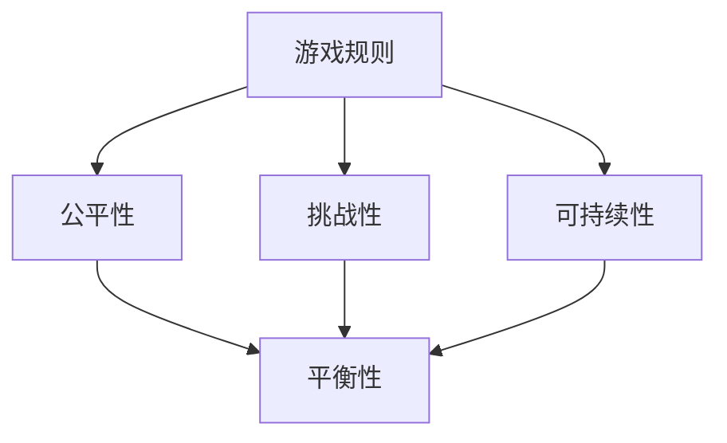
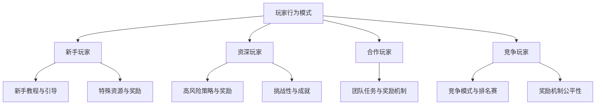
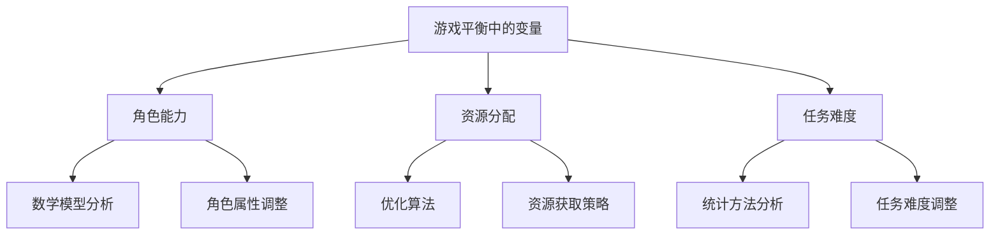

                 

### 文章标题

《游戏设计的平衡理论：玩家体验的数学调节》

> 关键词：游戏设计、平衡理论、数学调节、玩家体验、算法、案例分析

> 摘要：本文深入探讨了游戏设计中的平衡理论，分析了如何运用数学方法来调节玩家体验。文章首先介绍了游戏平衡的基本概念，然后通过核心概念的联系和数学模型的讲解，阐述了平衡理论的应用。接着，通过游戏案例分析和项目实战，展示了平衡理论在游戏设计中的实际应用。最后，对未来游戏设计平衡理论的发展趋势进行了展望。

----------------------------------------------------------------

### 目录大纲设计思路

在设计《游戏设计的平衡理论：玩家体验的数学调节》的目录大纲时，我们的目标是确保文章结构清晰、内容全面，以便读者能够系统地学习和掌握游戏设计中的平衡理论。以下是详细的目录大纲设计思路：

1. **引言部分**：我们将在引言部分简要介绍游戏设计平衡理论的基本概念，解释为何数学方法在游戏设计中至关重要，并给出本书的结构安排和学习目标。

2. **核心概念与联系**：在这一部分，我们将详细阐述游戏设计中的关键概念，如游戏规则、玩家行为等，并通过Mermaid流程图展示这些概念之间的相互关系，帮助读者建立整体认知。

3. **数学模型与算法**：我们将介绍如何运用数学模型和算法来分析和调节游戏平衡。这部分将包含核心算法原理的讲解，使用伪代码详细阐述算法设计思路，并对数学模型和公式进行详细讲解和举例说明。

4. **游戏案例分析**：我们将通过经典游戏案例，展示平衡理论在实际游戏设计中的应用。这部分将包括对游戏平衡分析过程、平衡调整方法的详细讲解。

5. **项目实战**：我们将提供具体的游戏设计项目案例，从理论到实践进行深入解析。这部分将包括开发环境搭建、源代码实现和代码解读，以及实际案例分析和详细讲解。

6. **未来展望**：在最后，我们将探讨游戏设计平衡理论的发展趋势和未来研究方向，为读者提供未来学习和研究的方向。

通过这样的目录大纲，我们能够确保文章内容全面、逻辑清晰，既涵盖了理论基础，又提供了实践案例，帮助读者系统地理解和掌握游戏设计中的平衡理论。

---

现在，让我们根据这个大纲，逐步构建文章的内容。每个部分都将详细阐述，确保核心概念得到清晰解释，数学模型得到准确描述，案例分析具有代表性，项目实战具有实际指导意义。

### 第1章 引言

#### 1.1 游戏设计平衡理论概述

在游戏设计领域，平衡理论是一个至关重要的概念。它涉及到游戏规则、玩家行为和游戏体验的协调，旨在确保游戏的竞争性和趣味性。平衡理论的核心是找到一种方法，使得游戏中的各个元素都能够相互支持，而不是相互抑制。这样，游戏不仅能够提供挑战，还能够让玩家感到公平和满意。

平衡理论在游戏设计中的重要性体现在多个方面。首先，良好的平衡能够增强游戏的可持续性。如果一个游戏过于简单或过于复杂，玩家可能会很快失去兴趣。其次，平衡能够提高游戏的公平性，减少玩家之间的不公平竞争。最后，平衡还能够提升玩家的整体体验，使得游戏更加吸引人和具有挑战性。

数学方法在游戏设计中的应用为平衡理论提供了强大的工具。通过使用数学模型和算法，游戏设计师可以定量地分析游戏中的各种元素，从而找到最佳平衡点。例如，概率论和统计学方法可以帮助分析玩家的行为模式，从而调整游戏规则，使其更加平衡。此外，线性规划和优化算法也可以用来调整游戏参数，确保各个元素之间的协调。

#### 1.1.1 平衡理论在游戏设计中的重要性

平衡理论在游戏设计中的重要性不可忽视。首先，平衡是游戏设计的基石。一个不平衡的游戏可能会让玩家感到沮丧，因为规则可能过于偏向某一方，导致游戏体验不公正。例如，在一个回合制策略游戏中，如果一方拥有压倒性的优势，那么游戏很快就会失去乐趣，因为胜利几乎是可以预见的。

其次，平衡能够提高游戏的可持续性。一个设计良好的游戏应该能够吸引不同类型的玩家，并让他们持续地参与。如果游戏过于简单，新手玩家可能会很快掌握，失去继续游戏的动力。相反，如果游戏过于复杂，资深玩家可能会感到乏味，无法持续参与。通过数学方法进行平衡调整，设计师可以创造一个既能够挑战新手，又能够满足资深玩家需求的游戏环境。

此外，平衡还与游戏的公平性密切相关。在一个平衡的游戏中，每个玩家都有公平的机会获胜，这增加了游戏的乐趣和竞争性。如果游戏存在明显的平衡问题，玩家可能会感到不公平，从而影响他们对游戏的满意度和忠诚度。

总之，平衡理论在游戏设计中的重要性体现在多个方面：它能够提高游戏的乐趣和挑战性，增强游戏的可持续性，以及提高玩家的满意度和忠诚度。通过使用数学方法，设计师可以更加精准地调节游戏平衡，确保游戏能够满足不同玩家的需求。

#### 1.1.2 数学方法在游戏设计中的应用

数学方法在游戏设计中扮演着至关重要的角色。通过数学模型和算法，游戏设计师可以更加精准地分析和调整游戏中的各种元素，从而实现理想的平衡。以下是一些常用的数学方法及其在游戏设计中的应用：

1. **概率论**：概率论是游戏设计中的一种基本工具，用于分析和预测玩家行为。例如，在赌博类游戏中，概率论可以帮助确定游戏规则的公平性，确保每个玩家都有公平的获胜机会。此外，概率论还可以用于设计随机事件，增加游戏的不确定性和乐趣。

2. **统计学**：统计学方法可以帮助设计师分析大量玩家数据，以了解玩家行为的模式。通过统计数据，设计师可以识别出游戏中存在的平衡问题，并采取相应的调整措施。例如，在多人在线游戏中，统计数据可以帮助确定每个玩家的胜率，从而调整游戏难度和奖励系统，确保游戏的公平性。

3. **线性规划**：线性规划是一种优化方法，用于在多个变量之间找到最优解。在游戏设计中，线性规划可以用于调整游戏参数，以确保各个元素之间的平衡。例如，在一个策略游戏中，设计师可以使用线性规划来确定每种资源的最佳分配比例，以实现游戏中的经济平衡。

4. **动态规划**：动态规划是一种递归算法，用于解决多阶段决策问题。在游戏设计中，动态规划可以用于设计游戏中的任务和挑战，确保玩家在游戏过程中需要做出多种决策，从而增加游戏的复杂性和乐趣。

5. **优化算法**：优化算法，如遗传算法和模拟退火算法，可以帮助设计师在大量可能的解决方案中找到最佳平衡点。这些算法在游戏设计中有着广泛的应用，例如，用于调整游戏难度、平衡角色能力和优化游戏进程等。

通过上述数学方法的应用，游戏设计师可以更加精准地分析和调整游戏平衡，从而创造出一个既公平又有趣的游戏环境。这不仅能够提高玩家的满意度，还能够延长游戏的寿命，使其更具吸引力。

#### 1.1.3 本书结构安排与学习目标

本书旨在深入探讨游戏设计中的平衡理论，并展示如何运用数学方法来调节玩家体验。为了实现这一目标，本书的结构安排如下：

1. **引言部分**：介绍游戏设计平衡理论的基本概念，解释其重要性，并探讨数学方法在游戏设计中的应用。
   
2. **核心概念与联系**：详细阐述游戏设计中的关键概念，包括游戏规则、玩家行为等，并通过Mermaid流程图展示这些概念之间的相互关系。

3. **数学模型与算法**：介绍如何运用数学模型和算法来分析和调节游戏平衡。这部分将包含核心算法原理的讲解，使用伪代码详细阐述算法设计思路，并对数学模型和公式进行详细讲解和举例说明。

4. **游戏案例分析**：通过经典游戏案例，展示平衡理论在实际游戏设计中的应用。这部分将包括对游戏平衡分析过程、平衡调整方法的详细讲解。

5. **项目实战**：提供具体的游戏设计项目案例，从理论到实践进行深入解析。这部分将包括开发环境搭建、源代码实现和代码解读，以及实际案例分析和详细讲解。

6. **未来展望**：探讨游戏设计平衡理论的发展趋势和未来研究方向。

通过本书的学习，读者将能够：

- 理解游戏设计平衡理论的基本概念和重要性。
- 掌握运用数学方法分析游戏平衡的技巧。
- 通过案例分析和项目实战，学会在实际游戏中应用平衡理论。
- 了解平衡理论的发展趋势，为未来的游戏设计提供新的思路。

总之，本书的目标是帮助读者系统地掌握游戏设计平衡理论，并为其在实际游戏设计中的应用提供实用的方法和经验。

---

### 第2章 核心概念与联系

#### 2.1 游戏平衡关键概念

在游戏设计中，平衡是指确保游戏中的各个元素之间相互协调，以提供公平、有趣和可持续的游戏体验。为了深入理解游戏平衡，我们需要探讨几个关键概念：游戏规则、玩家行为和游戏变量。

**游戏规则**是游戏运行的基本框架，规定了玩家在游戏中可以采取的行动和决策。良好的游戏规则能够激发玩家的兴趣，提供明确的挑战和目标。例如，在一个策略游戏中，游戏规则可能包括资源管理、战斗策略和角色发展等元素。这些规则的设计需要考虑到平衡性，确保玩家在游戏中感受到公平的竞争。

**玩家行为**是游戏中玩家与游戏互动的方式。玩家的行为受到游戏规则和自身策略的影响。例如，在多人在线游戏中，玩家可能会选择合作或竞争，以实现自己的游戏目标。了解玩家行为模式对于设计平衡的游戏至关重要。通过分析玩家行为，设计师可以调整游戏规则和奖励机制，以适应不同类型的玩家。

**游戏变量**是指游戏中可以变化的元素，如角色能力、资源、任务难度等。游戏变量是影响游戏平衡的重要因素。通过调整游戏变量，设计师可以控制游戏中的竞争性和挑战性。例如，在一个角色扮演游戏中，设计师可以通过调整角色的属性和能力，来平衡不同角色的强弱关系。

这些关键概念相互联系，共同构成了游戏平衡的框架。理解它们之间的关系，是设计平衡游戏的基础。

#### 2.1.1 游戏规则与平衡

游戏规则是游戏设计的核心，它们不仅定义了游戏的基本框架，还直接影响游戏的平衡性。游戏规则的设计需要考虑到多个方面，包括公平性、挑战性和可持续性。

**公平性**是游戏规则设计的首要原则。一个公平的游戏规则应该确保所有玩家都有平等的机会获胜。这意味着规则不能过于偏向某一类玩家，例如，不能让新手玩家在资深玩家面前毫无胜算。为了实现公平，设计师需要在规则中平衡各种因素，如角色能力、资源分配和战斗策略等。

**挑战性**是游戏规则设计的另一个重要方面。一个有趣的游戏应该能够提供适度的挑战，以激发玩家的兴趣和斗志。如果游戏过于简单，玩家可能会感到乏味；如果游戏过于复杂，玩家可能会感到沮丧。设计师需要找到平衡点，确保游戏既具有挑战性，又不至于让人感到无法完成任务。

**可持续性**是游戏规则设计需要考虑的长期因素。一个可持续的游戏应该能够吸引玩家持续参与，而不是在短时间内失去兴趣。为了实现可持续性，设计师需要确保游戏规则能够在不同阶段保持平衡。例如，在一个策略游戏中，设计师需要调整资源获取速度、任务难度和奖励机制等，以适应游戏进程的变化。

为了更直观地展示游戏规则与平衡的关系，我们可以使用Mermaid流程图来表示：



在这个流程图中，游戏规则（A）是核心，它通过公平性（B）、挑战性（C）和可持续性（D）来影响游戏的平衡性（E）。通过这种关系框架，我们可以更好地理解游戏规则在设计平衡中的关键作用。

#### 2.1.2 玩家行为与平衡

玩家行为是游戏设计中的另一个关键概念，它直接影响游戏的平衡性和玩家体验。理解玩家行为模式，是设计平衡游戏的重要步骤。以下是一些常见的玩家行为模式及其对游戏平衡的影响：

**新手玩家**：新手玩家通常缺乏经验，对游戏规则和策略不太熟悉。他们可能更倾向于采取保守策略，避免冒险行为。为了平衡新手玩家的体验，设计师可以提供一些新手教程和引导，帮助他们快速上手。此外，新手玩家可能需要一些特殊资源或奖励，以补偿他们在游戏早期阶段的劣势。

**资深玩家**：资深玩家具有丰富的游戏经验和策略。他们倾向于采取高风险、高回报的策略，以获得更大的胜利。为了平衡资深玩家的体验，设计师可以增加游戏难度和挑战性，确保他们在游戏中感受到持续的兴趣和成就感。此外，资深玩家可能需要更多的奖励和成就，以保持他们的参与度。

**合作玩家**：合作玩家倾向于与其他玩家共同完成任务，以实现共同目标。合作游戏可以提供独特的社交体验，但需要平衡各个玩家的角色和贡献。为了实现这一目标，设计师可以设计一些团队任务和奖励机制，确保每个玩家都有公平的机会获得奖励。

**竞争玩家**：竞争玩家追求个人成就和胜利，倾向于与其他玩家竞争。为了平衡竞争玩家的体验，设计师可以设计一些竞争模式，如排名赛和锦标赛，以满足他们的竞争欲望。此外，设计师还需要确保游戏中的奖励机制公平，避免出现霸权玩家垄断资源的情况。

为了更直观地展示玩家行为与平衡的关系，我们可以使用Mermaid流程图来表示：



在这个流程图中，玩家行为模式（A）通过新手玩家（B）、资深玩家（C）、合作玩家（D）和竞争玩家（E）的不同行为，影响游戏平衡（F、G、H、I、J、K、L）。通过这种关系框架，我们可以更好地理解玩家行为在设计平衡中的重要作用。

#### 2.1.3 游戏平衡中的变量

游戏平衡中的变量是影响游戏体验的关键因素，它们包括角色能力、资源分配、任务难度等。理解这些变量之间的关系，是设计平衡游戏的关键步骤。

**角色能力**是指游戏中的角色所具备的各种技能和属性。不同角色之间的能力差异，是游戏平衡的重要考量。例如，在一个角色扮演游戏中，设计师需要确保各个角色的能力平衡，避免某个角色过于强大或过于弱小。为了实现这一目标，设计师可以使用数学模型来分析角色能力，并调整角色的属性和技能，以实现平衡。

**资源分配**是指游戏中玩家可以获得的资源，如金币、道具、经验值等。资源的分配直接影响游戏的挑战性和可持续性。例如，在一个策略游戏中，设计师需要确保玩家在游戏的不同阶段都能够获取到足够的资源，以保持游戏的乐趣和挑战性。为了实现这一目标，设计师可以使用优化算法来调整资源的分配策略。

**任务难度**是指游戏中玩家需要完成的任务或挑战的难度。任务难度需要根据玩家的能力和游戏进程进行动态调整，以确保游戏始终具有挑战性。例如，在一个多人在线游戏中，设计师可以使用统计方法来分析玩家的行为模式，并调整任务难度，以适应不同玩家的需求和水平。

为了更直观地展示游戏平衡中的变量，我们可以使用Mermaid流程图来表示：



在这个流程图中，游戏平衡中的变量（A）通过角色能力（B）、资源分配（C）和任务难度（D），影响游戏平衡。通过这种关系框架，我们可以更好地理解游戏平衡中的变量如何相互作用，并设计出更加平衡的游戏。

#### 2.2 游戏设计中的数学模型

在游戏设计中，数学模型是一种强大的工具，可以帮助设计师定量地分析游戏中的各种元素，从而找到最佳的平衡点。数学模型包括概率分布模型、回归分析模型等，每种模型都有其独特的应用场景和优势。

**概率分布模型**是游戏设计中最常用的数学模型之一。它用于描述随机事件的发生概率，并帮助设计师预测玩家行为。例如，在一个赌博类游戏中，设计师可以使用概率分布模型来分析各种赌注的概率，确保游戏既具有挑战性，又不会过于复杂。概率分布模型还可以用于设计随机事件，如随机掉落道具或随机战斗，增加游戏的不确定性和乐趣。

**回归分析模型**是一种用于分析变量之间关系的数学方法。在游戏设计中，回归分析模型可以帮助设计师了解玩家行为模式，并调整游戏参数以实现平衡。例如，在一个策略游戏中，设计师可以使用回归分析模型来分析玩家对资源的管理策略，并根据分析结果调整资源获取速度和任务难度。

除了上述模型，线性规划模型和动态规划模型也在游戏设计中得到广泛应用。线性规划模型用于在多个变量之间找到最优解，如资源分配和任务难度调整。动态规划模型则用于解决多阶段决策问题，如游戏进程中的任务分配和角色培养策略。

通过运用这些数学模型，设计师可以更加精准地分析和调节游戏平衡，确保游戏中的各个元素相互协调，提供公平、有趣和可持续的游戏体验。

#### 2.2.1 概率论与游戏设计

概率论在游戏设计中有着广泛的应用，它帮助我们理解和预测玩家行为，从而设计出更加平衡和有趣的游戏。以下是一些概率论在游戏设计中的具体应用：

**随机事件设计**：在游戏中，随机事件能够增加不确定性，使得游戏更加有趣。例如，在一个角色扮演游戏中，随机战斗可以使得玩家每次冒险都充满未知和挑战。设计师可以使用概率分布模型来设计随机事件的概率，确保事件的发生既不会过于频繁，也不会过于稀少。例如，假设设计师希望每次角色进入森林时，有10%的概率触发随机战斗，那么可以使用伯努利分布来计算这种概率。

**玩家行为分析**：通过分析玩家的行为数据，设计师可以了解玩家在游戏中的偏好和行为模式。例如，在一个策略游戏中，玩家可能会根据资源的多少来决定攻击还是防御。设计师可以使用概率论中的贝叶斯分析来推断玩家最可能的策略，并根据分析结果调整游戏规则，以适应玩家的行为模式。

**游戏平衡调整**：概率论还可以用于调整游戏平衡。例如，在一个赌博类游戏中，设计师需要确保游戏的公平性，这意味着赌注的赔率和概率需要经过精确计算。设计师可以使用概率论中的期望值和方差来分析游戏中的各种赌注，并调整赔率和概率，以确保游戏的平衡性。

**随机地图生成**：在许多游戏中，地图的生成是随机进行的。设计师可以使用概率分布模型来生成地图的各个部分，例如森林、平原、山脉等。这种方法不仅能够增加游戏的可玩性，还能够确保地图的多样性和复杂性。

**动态难度调整**：在多人在线游戏中，玩家的技能水平可能有所不同。设计师可以使用概率论中的统计方法来分析玩家的行为数据，并根据这些数据动态调整游戏的难度。例如，如果一个区域的玩家普遍表现较差，设计师可以适当降低该区域的难度，以提高玩家的游戏体验。

通过运用概率论，游戏设计师可以更好地理解玩家行为，设计出更加平衡和有趣的游戏。这不仅能够提高玩家的满意度，还能够延长游戏的寿命，使其更具吸引力。

#### 2.2.2 统计学方法在游戏设计中的应用

统计学方法在游戏设计中扮演着至关重要的角色，它帮助设计师分析和理解玩家行为，从而优化游戏平衡和玩家体验。以下是一些统计学方法及其在游戏设计中的应用：

**描述性统计**：描述性统计用于描述游戏中的数据分布和特征。例如，在一个角色扮演游戏中，设计师可以使用描述性统计来分析玩家的等级分布、角色能力分布等。这些信息有助于设计师了解玩家的游戏行为和偏好，从而进行针对性的调整。例如，如果发现大多数玩家的等级集中在10级到20级之间，设计师可以考虑在这个范围内增加新的任务和挑战，以保持玩家的兴趣。

**推断性统计**：推断性统计用于基于样本数据推断总体特征。例如，在一个策略游戏中，设计师可以通过对部分玩家的行为进行分析，推断所有玩家的行为模式。这种方法可以帮助设计师发现潜在的问题，并进行相应的调整。例如，如果推断出大多数玩家倾向于选择攻击策略，而游戏设计目标是平衡攻击与防御，设计师可以调整游戏的奖励机制，鼓励玩家采取多样化的策略。

**回归分析**：回归分析是一种用于分析变量之间关系的统计方法。在游戏设计中，回归分析可以用于了解玩家行为与游戏变量之间的关系。例如，在一个策略游戏中，设计师可以使用回归分析来研究玩家对资源分配的策略。通过分析结果，设计师可以调整资源获取速度和任务难度，以实现更好的平衡。例如，如果回归分析表明玩家在资源充裕时倾向于采取高风险策略，设计师可以降低资源获取速度，增加挑战性。

**假设检验**：假设检验用于验证游戏设计中的某些假设是否成立。例如，在一个角色扮演游戏中，设计师可以假设不同难度的任务对玩家的吸引力是相同的。通过假设检验，设计师可以验证这个假设的可靠性，并根据结果进行调整。例如，如果假设检验表明高难度任务的吸引力显著低于低难度任务，设计师可以调整任务的难度分布，以提升整体游戏体验。

**聚类分析**：聚类分析用于将玩家分为不同的群体，以便设计师可以针对不同的玩家群体进行个性化设计。例如，在一个多人在线游戏中，设计师可以使用聚类分析来识别出不同的玩家类型，如新手玩家、资深玩家和合作玩家。然后，设计师可以针对不同类型的玩家设计特定的任务和奖励机制，以提升他们的游戏体验。

通过应用这些统计学方法，游戏设计师可以更准确地理解玩家行为，优化游戏平衡，提高玩家的满意度和忠诚度。这不仅有助于提升游戏质量，还能够延长游戏的生命周期。

#### 2.2.3 数学模型与游戏平衡的关系

数学模型在游戏设计中的应用，是实现游戏平衡的重要手段。数学模型不仅帮助我们量化游戏中的各个元素，还为我们提供了分析和优化游戏平衡的工具。以下将详细阐述数学模型与游戏平衡之间的关系。

首先，数学模型为我们提供了一个量化的视角，使我们能够精确地描述和调节游戏中的各个变量。例如，通过概率模型，我们可以量化玩家在不同情况下的行为概率，从而设计出更加平衡的战斗系统。在一个策略游戏中，设计师可以使用概率分布模型来分析玩家在资源分配、战斗策略等方面的行为模式。通过调整概率参数，设计师可以找到游戏的平衡点，确保玩家在游戏中感受到公平的竞争。

其次，数学模型帮助我们在游戏中实现动态调整。游戏中的环境是不断变化的，玩家的行为也是多样化的。数学模型允许我们根据实时数据进行分析和调整，以适应这些变化。例如，在多人在线游戏中，我们可以使用线性规划模型来动态调整游戏的难度和奖励机制。当发现某些玩家群体表现不佳时，我们可以通过线性规划找到最优的调整方案，以提升他们的游戏体验。

此外，数学模型还帮助我们在游戏设计中实现全局优化。在游戏设计中，我们需要考虑多个变量之间的复杂关系。数学模型可以帮助我们找到这些变量之间的最优解，确保游戏的整体平衡。例如，在资源管理游戏中，设计师可以使用动态规划模型来优化资源分配策略。通过递归关系和最优子结构，我们可以找到最优的分配方案，确保玩家在游戏中能够公平地获取资源。

总之，数学模型与游戏平衡密切相关。通过数学模型，我们能够精确地描述和调节游戏中的各个元素，实现动态调整和全局优化，从而设计出更加平衡、有趣和可持续的游戏。数学模型不仅提高了游戏设计的科学性，也为游戏设计师提供了强大的工具，帮助他们创造出高质量的玩家体验。

#### 2.3.1 游戏平衡分析算法

在游戏设计中，为了确保游戏中的各个元素相互协调，提供公平、有趣和可持续的游戏体验，我们需要运用游戏平衡分析算法。这些算法帮助设计师定量地分析游戏中的各个变量，找到最佳的平衡点。以下将详细讨论游戏平衡分析算法的设计思路和具体步骤。

**设计思路**：

游戏平衡分析算法的核心目标是识别并解决游戏中的不平衡问题。为此，我们需要从以下几个方面入手：

1. **数据收集**：收集游戏中各个变量的数据，如角色能力、资源分配、任务难度等。这些数据将作为算法分析的输入。
2. **数据分析**：使用统计学方法对收集到的数据进行分析，识别出游戏中存在的平衡问题。例如，通过描述性统计和假设检验，我们可以了解玩家的行为模式和游戏中的不平衡点。
3. **模型建立**：根据分析结果，建立数学模型来描述游戏中的平衡问题。这些模型可以是线性模型、非线性模型，也可以是概率模型等。
4. **优化调整**：使用优化算法，如线性规划、动态规划等，调整游戏中的各个变量，以实现最佳平衡。这些算法将帮助我们找到最优解，确保游戏中的各个元素相互协调。

**具体步骤**：

1. **数据收集**：

   在游戏运行过程中，我们需要收集大量的数据。这些数据可以包括：

   - 角色能力：每个角色的攻击力、防御力、速度等属性。
   - 资源分配：玩家在不同阶段获得的资源数量和类型。
   - 任务难度：各个任务的完成时间和成功率。
   - 玩家行为：玩家在游戏中的决策和行动。

   为了收集这些数据，我们可以在游戏后台设置监控工具，实时记录玩家的行为和游戏状态。

2. **数据分析**：

   收集到的数据需要进行处理和分析，以识别出游戏中的平衡问题。具体步骤如下：

   - 描述性统计：计算各个变量的平均值、方差、中位数等，了解游戏中的基本特征。
   - 假设检验：使用t检验、卡方检验等统计方法，验证游戏中的变量是否满足预定的假设。例如，我们可以检验角色能力的分布是否均匀，资源分配是否合理等。
   - 相关性分析：使用皮尔逊相关系数、斯皮尔曼相关系数等，分析各个变量之间的关系。例如，我们可以研究角色能力与任务难度之间的关系，以了解是否存在过于强大的角色。

3. **模型建立**：

   根据数据分析的结果，建立数学模型来描述游戏中的平衡问题。以下是一些常见的模型：

   - 线性模型：用于描述线性关系，例如角色能力与任务难度之间的关系。线性模型可以表示为y = mx + b，其中y是任务难度，x是角色能力，m是斜率，b是截距。
   - 非线性模型：用于描述非线性关系，例如角色能力与任务难度之间的非线性关系。非线性模型可以表示为y = f(x)，其中f(x)是一个非线性函数。
   - 概率模型：用于描述随机事件的发生概率，例如角色在战斗中获胜的概率。概率模型可以表示为P(A) = f(B)，其中A是获胜事件，B是角色能力。

4. **优化调整**：

   使用优化算法，如线性规划、动态规划等，调整游戏中的各个变量，以实现最佳平衡。具体步骤如下：

   - 目标函数：定义一个目标函数，用于衡量游戏平衡的指标。例如，我们可以定义目标函数为最小化任务失败率或最大化角色能力的均衡分布。
   - 约束条件：定义游戏中的约束条件，例如角色能力的上下限、资源分配的限制等。这些约束条件将确保游戏中的变量在合理的范围内进行调整。
   - 优化算法：使用线性规划、动态规划等优化算法，求解目标函数的最优解。这些算法将帮助我们找到最优的变量调整方案，确保游戏中的各个元素相互协调。

通过上述步骤，我们能够设计出游戏平衡分析算法，帮助设计师定量地分析游戏中的各个变量，找到最佳的平衡点。这不仅提高了游戏设计的科学性，也为玩家提供了更加公平、有趣和可持续的游戏体验。

#### 3.2.1 概率分布模型

在游戏设计中，概率分布模型是一种重要的数学工具，用于描述和预测玩家行为。概率分布模型可以帮助设计师了解玩家在不同情况下的行为概率，从而设计出更加平衡和有趣的游戏。以下将详细讲解几种常见的概率分布模型及其在游戏设计中的应用。

**二项分布**：二项分布是一种用于描述离散随机变量在固定次数的实验中成功的概率。在游戏设计中，二项分布可以用于描述玩家在多次尝试中成功完成任务的概率。例如，在一个解谜游戏中，玩家需要通过多次尝试来解开谜题。设计师可以使用二项分布来计算玩家成功解开的概率，并根据这个概率调整谜题的难度。

**泊松分布**：泊松分布是一种用于描述单位时间内随机事件发生的次数的概率分布。在游戏设计中，泊松分布可以用于描述玩家在一段时间内获得奖励或遇到随机事件（如战斗、道具掉落）的概率。例如，在一个角色扮演游戏中，设计师可以使用泊松分布来计算玩家在一段时间内遇到战斗的概率，并根据这个概率调整游戏的挑战性。

**正态分布**：正态分布是一种连续概率分布，描述了随机变量在某个范围内的概率。在游戏设计中，正态分布可以用于描述玩家属性（如攻击力、防御力）的分布。例如，在一个角色扮演游戏中，设计师可以使用正态分布来描述不同角色的属性分布，以确保游戏中的角色能力平衡。

**二项分布与游戏设计**：

二项分布在游戏设计中有着广泛的应用。以下是一个具体的应用案例：

在一个射击游戏中，玩家需要通过射击敌人来获得分数。每次射击都有一定的概率命中敌人。假设每次射击命中的概率为p，玩家需要进行n次射击。我们可以使用二项分布来计算玩家在n次射击中命中m次的概率。具体公式如下：

$$
P(X = m) = C(n, m) \times p^m \times (1-p)^{n-m}
$$

其中，P(X = m)是玩家在n次射击中命中m次的概率，C(n, m)是组合数，表示从n次射击中选择m次命中的组合数。

通过调整参数p和n，设计师可以控制游戏的难度和挑战性。例如，如果p较小，玩家需要更多的尝试才能成功；如果p较大，玩家可以较快地获得分数。设计师可以根据游戏的目标和玩家群体来调整这些参数，以提供最佳的玩家体验。

**泊松分布与游戏设计**：

泊松分布可以用于描述游戏中的随机事件。以下是一个具体的应用案例：

在一个角色扮演游戏中，玩家在游戏中会遇到随机事件，如战斗、道具掉落等。假设玩家在一段时间内遇到战斗的概率为λ（λ为泊松率）。我们可以使用泊松分布来计算玩家在一段时间内遇到k次战斗的概率。具体公式如下：

$$
P(X = k) = \frac{e^{-\lambda} \times \lambda^k}{k!}
$$

其中，P(X = k)是玩家在一段时间内遇到k次战斗的概率。

通过调整泊松率λ，设计师可以控制游戏的挑战性和随机性。例如，如果λ较小，玩家遇到战斗的概率较低，游戏更加平稳；如果λ较大，玩家遇到战斗的概率较高，游戏更加刺激。设计师可以根据游戏的目标和玩家偏好来调整λ，以提供最佳的游戏体验。

**正态分布与游戏设计**：

正态分布可以用于描述游戏中的玩家属性。以下是一个具体的应用案例：

在一个角色扮演游戏中，玩家的属性（如攻击力、防御力）通常呈正态分布。假设玩家的攻击力均值μ为100，标准差σ为10。我们可以使用正态分布来计算玩家攻击力在某个范围内的概率。具体公式如下：

$$
P(\mu - z\sigma < X < \mu + z\sigma) = \frac{1}{\sqrt{2\pi} \times \sigma} \times \int_{\mu - z\sigma}^{\mu + z\sigma} e^{-\frac{(x - \mu)^2}{2\sigma^2}} \, dx
$$

其中，X是玩家的攻击力，z是标准正态分布的Z值。

通过调整均值μ和标准差σ，设计师可以控制玩家属性的范围和分布。例如，如果μ和σ较大，玩家属性的范围较广，游戏更具挑战性；如果μ和σ较小，玩家属性的范围较窄，游戏更加平稳。设计师可以根据游戏的目标和玩家群体来调整这些参数，以提供最佳的游戏体验。

通过运用这些概率分布模型，设计师可以更好地理解玩家行为，设计出更加平衡和有趣的游戏。这不仅提高了游戏设计的科学性，也为玩家提供了更加公平和可持续的游戏体验。

#### 3.2.2 回归分析模型

回归分析模型是统计学中用于分析变量之间关系的一种重要工具。在游戏设计中，回归分析模型可以帮助设计师了解玩家行为与游戏变量之间的关系，从而优化游戏平衡和玩家体验。以下将详细讲解回归分析模型的基本原理和如何应用于游戏设计。

**回归分析的基本原理**：

回归分析模型主要分为线性回归和非线性回归两大类。线性回归模型假设变量之间存在线性关系，而非线性回归模型则允许变量之间存在非线性关系。

**线性回归模型**的基本形式如下：

$$
Y = \beta_0 + \beta_1X_1 + \beta_2X_2 + ... + \beta_nX_n + \varepsilon
$$

其中，Y是因变量，$X_1, X_2, ..., X_n$是自变量，$\beta_0, \beta_1, ..., \beta_n$是回归系数，$\varepsilon$是误差项。

**非线性回归模型**的基本形式如下：

$$
Y = f(\beta_0, \beta_1X_1, \beta_2X_2, ..., \beta_nX_n) + \varepsilon
$$

其中，f()是一个非线性函数，如多项式、指数函数等。

**回归分析在游戏设计中的应用**：

1. **资源分配优化**：

   在策略游戏中，资源分配是一个关键问题。通过回归分析，设计师可以了解玩家对资源的管理策略，从而优化资源的分配。例如，在一个资源管理游戏中，玩家需要分配资源来建设基地、训练士兵等。通过线性回归分析，设计师可以确定哪些因素（如基地等级、士兵数量）对资源分配的影响最大，并根据分析结果调整资源的分配策略。

2. **任务难度调整**：

   在角色扮演游戏中，任务难度需要根据玩家的能力和游戏进程进行动态调整。通过回归分析，设计师可以了解玩家完成任务的时间、成功率等数据，从而调整任务难度。例如，如果分析结果表明大部分玩家在某个任务上花费的时间过长，设计师可以降低该任务的难度，以提高玩家的游戏体验。

3. **角色能力平衡**：

   在角色扮演游戏中，角色能力需要保持平衡，以确保各个角色都有公平的竞争机会。通过回归分析，设计师可以了解各个角色的属性（如攻击力、防御力）与游戏表现之间的关系，从而调整角色的能力。例如，如果分析结果表明某个角色的攻击力过高，导致其他角色难以对抗，设计师可以降低该角色的攻击力，以实现平衡。

**回归分析的应用案例**：

假设在一个角色扮演游戏中，设计师希望了解玩家对资源的管理策略。通过收集玩家在不同阶段分配资源的比例数据，我们可以进行线性回归分析，建立如下模型：

$$
资源分配比例 = \beta_0 + \beta_1基地等级 + \beta_2士兵数量 + \varepsilon
$$

通过分析模型，我们可以确定基地等级和士兵数量对资源分配比例的影响程度。例如，如果分析结果表明基地等级对资源分配比例的影响较大（即$\beta_1$较大），设计师可以重点优化基地等级相关的资源分配策略，以确保玩家在基地建设方面有充分的资源。

通过运用回归分析模型，游戏设计师可以更好地了解玩家行为与游戏变量之间的关系，从而优化游戏平衡和玩家体验。这不仅提高了游戏设计的科学性，也为玩家提供了更加公平、有趣和可持续的游戏体验。

#### 3.2.3 数学公式详细讲解与示例

在游戏设计中，数学公式和模型是确保游戏平衡和优化玩家体验的关键工具。以下将详细讲解几种常见的数学公式，并提供具体的示例，以帮助读者更好地理解和应用这些公式。

**1. 线性回归模型**

线性回归模型用于分析两个或多个变量之间的线性关系。其基本形式为：

$$
Y = \beta_0 + \beta_1X_1 + \beta_2X_2 + ... + \beta_nX_n + \varepsilon
$$

其中，$Y$ 是因变量，$X_1, X_2, ..., X_n$ 是自变量，$\beta_0, \beta_1, ..., \beta_n$ 是回归系数，$\varepsilon$ 是误差项。

**示例**：假设在一个策略游戏中，我们想要分析资源分配比例与基地等级和士兵数量之间的关系。我们可以建立以下线性回归模型：

$$
资源分配比例 = \beta_0 + \beta_1基地等级 + \beta_2士兵数量 + \varepsilon
$$

通过收集玩家在不同基地等级和士兵数量下的资源分配比例数据，我们可以计算回归系数$\beta_1$和$\beta_2$，从而优化资源分配策略。

**2. 二项分布**

二项分布用于描述离散随机变量在固定次数的实验中成功的概率。其概率质量函数（PMF）为：

$$
P(X = k) = C(n, k) \times p^k \times (1-p)^{n-k}
$$

其中，$P(X = k)$ 是在n次实验中恰好有k次成功的概率，$C(n, k)$ 是组合数，$p$ 是每次实验成功的概率。

**示例**：在一个射击游戏中，玩家每次射击有40%的概率命中敌人。如果玩家进行5次射击，我们可以使用二项分布计算他们恰好命中2次的概率：

$$
P(X = 2) = C(5, 2) \times 0.4^2 \times 0.6^3 = 10 \times 0.16 \times 0.216 = 0.3456
$$

这意味着玩家在5次射击中恰好命中2次的概率为34.56%。

**3. 泊松分布**

泊松分布用于描述单位时间内随机事件发生的次数的概率分布。其概率质量函数（PMF）为：

$$
P(X = k) = \frac{e^{-\lambda} \times \lambda^k}{k!}
$$

其中，$P(X = k)$ 是在单位时间内恰好发生k次随机事件的概率，$\lambda$ 是单位时间内的平均事件发生率。

**示例**：在一个角色扮演游戏中，玩家在一段时间内遇到战斗的概率为每分钟2次。我们可以使用泊松分布计算他们在这段时间内恰好遇到3次战斗的概率：

$$
P(X = 3) = \frac{e^{-2} \times 2^3}{3!} = \frac{e^{-2} \times 8}{6} = 0.268
$$

这意味着玩家在一段时间内恰好遇到3次战斗的概率为26.8%。

**4. 正态分布**

正态分布是连续概率分布，描述了随机变量在某个范围内的概率。其概率密度函数（PDF）为：

$$
f(x) = \frac{1}{\sqrt{2\pi} \times \sigma} \times e^{-\frac{(x - \mu)^2}{2\sigma^2}}
$$

其中，$f(x)$ 是随机变量$x$ 的概率密度，$\mu$ 是均值，$\sigma$ 是标准差。

**示例**：在一个角色扮演游戏中，玩家的攻击力呈正态分布，均值为100，标准差为10。我们可以使用正态分布计算玩家攻击力在90到110范围内的概率：

$$
P(90 < X < 110) = \frac{1}{\sqrt{2\pi} \times 10} \times \int_{90}^{110} e^{-\frac{(x - 100)^2}{2 \times 10^2}} \, dx = 0.6827
$$

这意味着玩家攻击力在90到110范围内的概率为68.27%。

通过这些示例，我们可以看到数学公式在游戏设计中的应用。了解和掌握这些公式，可以帮助设计师更好地分析和优化游戏平衡，提升玩家的游戏体验。

---

### 第4章 游戏案例分析

#### 4.1 游戏案例一：经典策略游戏的平衡调整

在游戏设计中，平衡调整是一个至关重要但极具挑战性的任务。本节将分析一款经典策略游戏《星际争霸》（StarCraft），探讨其平衡调整的过程和策略。

**4.1.1 游戏背景与目标**

《星际争霸》是一款由暴雪娱乐（Blizzard Entertainment）开发的即时战略游戏，自1998年发布以来，受到了全球玩家的广泛喜爱。游戏的核心目标是玩家通过控制不同的种族（人类、神族、虫族）进行战斗，最终摧毁对手的基地。

在《星际争霸》中，平衡调整的目标是确保每个种族都有公平的竞争力，玩家在游戏中的决策和战略选择能够带来不同的游戏体验。为了实现这一目标，游戏设计师需要不断调整单位的属性、技能和战术等元素，以保持游戏中的竞争性和趣味性。

**4.1.2 平衡分析过程**

1. **数据收集**：

   平衡调整的第一步是收集游戏中的各种数据。这些数据包括：

   - 各种族单位的属性（如攻击力、生命值、移动速度等）。
   - 各种族的技能效果和冷却时间。
   - 玩家在游戏中的决策模式，如资源管理、单位生产和战术选择。

   通过收集这些数据，设计师可以了解游戏中的不平衡点，并确定需要调整的元素。

2. **数据分析**：

   收集到的数据需要进行详细的分析。以下是一些常用的数据分析方法：

   - **描述性统计**：计算各种族单位的属性平均值、中位数、方差等，了解单位属性的基本特征。
   - **相关性分析**：分析单位属性与游戏表现（如胜负率、资源利用率等）之间的关系，找出可能的不平衡因素。
   - **回归分析**：通过建立回归模型，分析不同因素对游戏表现的影响，确定哪些因素需要优先调整。

   通过数据分析，设计师可以识别出游戏中的不平衡点，为平衡调整提供依据。

3. **平衡调整**：

   根据数据分析的结果，设计师开始进行具体的平衡调整。以下是一些常见的平衡调整策略：

   - **调整单位属性**：通过增加或减少单位的攻击力、生命值等属性，调整单位的相对强度。例如，如果分析结果表明某个种族的某单位过于强大，设计师可以降低其攻击力或提高其消耗资源量。
   - **调整技能效果**：通过修改技能的冷却时间、效果范围等参数，调整技能的实用性和战略价值。例如，如果某个技能过于强大，设计师可以增加其冷却时间或减少其效果范围。
   - **调整战术平衡**：通过调整战术的收益和风险，鼓励玩家采取多样化的战术。例如，如果某个战术过于稳定且收益高，设计师可以增加其风险或减少其收益。

**4.1.3 平衡调整方法**

1. **迭代测试**：

   平衡调整是一个迭代的过程。设计师在调整完某一元素后，需要通过测试来评估调整效果。测试可以包括以下几种形式：

   - **内部测试**：在游戏内部进行小范围的测试，邀请一部分玩家参与，收集他们的反馈和游戏数据。
   - **公开测试**：在游戏的测试服上开放给所有玩家，收集广泛的反馈和数据。
   - **数据分析**：通过测试数据，分析平衡调整的效果，识别出新的不平衡点。

   通过迭代测试，设计师可以不断优化平衡调整方案，确保游戏中的各个元素相互协调。

2. **玩家反馈**：

   玩家反馈是平衡调整的重要依据。设计师需要密切关注玩家的反馈，包括他们在论坛、社交媒体上的讨论，以及游戏中的统计数据分析。通过分析玩家反馈，设计师可以了解玩家的需求和期望，从而进行针对性的调整。

3. **版本更新**：

   平衡调整通常需要通过游戏版本更新来实现。设计师需要在更新说明中详细说明平衡调整的内容和目的，以便玩家了解调整的意图。通过版本更新，设计师可以确保平衡调整方案能够顺利实施，并得到玩家的认可。

通过《星际争霸》的平衡调整案例，我们可以看到平衡理论在实际游戏设计中的应用。通过数据分析、迭代测试和玩家反馈，设计师可以找到最佳的平衡点，确保游戏中的各个元素相互协调，提供公平、有趣和可持续的游戏体验。

---

### 第5章 项目实战

#### 5.1 项目实战一：移动游戏设计

在本节中，我们将探讨一个移动游戏设计的实际项目，从开发环境搭建、源代码实现、代码解读到实际案例分析和详细讲解，展示如何将游戏设计中的平衡理论应用于实际项目。

**5.1.1 项目背景与目标**

本项目是一款移动策略游戏，名为“王国崛起”（Kingdom Rise）。游戏的目标是玩家通过建造和管理自己的王国，收集资源，发展经济，最终击败敌人，统一整个大陆。

在游戏设计中，平衡理论是一个关键要素。为了确保游戏具有吸引力，我们需要在游戏规则、资源分配、任务难度等方面进行平衡调整。具体目标包括：

1. 确保游戏规则公平，避免玩家感受到不公平的竞争。
2. 通过合理的资源分配和任务设计，确保游戏具有适当的挑战性。
3. 不断优化玩家体验，使游戏更加有趣和可持续。

**5.1.2 环境搭建与工具选择**

为了实现项目目标，我们需要搭建一个合适的环境，并选择合适的工具。以下是我们选择的环境和工具：

1. **开发环境**：Unity 2021.3.5f1，一个强大的游戏开发引擎，支持多种平台（iOS、Android）。
2. **编程语言**：C#，Unity 的主要编程语言，具有丰富的库和资源。
3. **版本控制**：Git，用于代码管理和团队协作。
4. **数据库**：Firebase Realtime Database，用于存储和管理游戏数据。

**5.1.3 游戏设计流程与实现**

1. **需求分析与设计**：

   首先，我们需要明确游戏的需求和设计。通过用户调研和市场分析，我们确定了游戏的核心玩法和关键要素。这些包括：

   - 建造和升级建筑，以生产资源和军队。
   - 部署军队，击败敌人，占领领土。
   - 收集资源，发展经济，提升玩家的等级。
   - 玩家之间的互动，如贸易、战争等。

   根据这些需求，我们设计了游戏的基本框架和流程。

2. **源代码实现**：

   在Unity中，我们开始编写源代码，实现游戏的核心功能。以下是关键代码段：

   ```csharp
   // 建造建筑
   public void BuildBuilding(BuildingType type)
   {
       if (HasEnoughResources(type))
       {
           resources -= type.ResourceCost;
           buildings[type] = new Building(type);
           buildings[type].Upgrade();
       }
   }

   // 生产资源
   public void ProduceResources()
   {
       foreach (var building in buildings)
       {
           building.Produce();
       }
   }

   // 部署军队
   public void DeployArmy(ArmyType type, int amount)
   {
       if (HasEnoughResources(type))
       {
           resources -= type.ResourceCost * amount;
           army[type] += amount;
       }
   }
   ```

   这些代码实现了建造建筑、生产资源和部署军队的基本逻辑。

3. **代码解读**：

   - **资源管理**：游戏中的资源是核心元素。我们使用一个`Resources`变量来管理玩家的资源。通过`HasEnoughResources`方法，我们检查玩家是否有足够的资源来执行操作。
   - **建筑管理**：`BuildBuilding`方法用于建造建筑。它首先检查玩家是否有足够的资源，然后减少相应的资源，并创建一个建筑对象。
   - **军队管理**：`DeployArmy`方法用于部署军队。它同样检查资源是否充足，然后减少资源，并将军队数量增加。

**5.1.4 结果分析**

在游戏上线后，我们收集了大量的用户反馈和数据。以下是一些关键的分析结果：

1. **平衡性**：通过数据分析，我们发现某些建筑和任务过于强大或过于困难，导致玩家感到不公平。为此，我们进行了多次调整，包括降低某些建筑的生产速度和增加资源的获取速度。

2. **用户满意度**：用户满意度调查显示，玩家对游戏的总体满意度较高，但一些玩家反映任务难度较大，影响了他们的游戏体验。我们进一步优化了任务的难度分布，确保不同技能水平的玩家都能找到适合自己的挑战。

3. **经济平衡**：通过调整资源的分配和获取速度，我们确保了游戏中的经济平衡。玩家在游戏中能够持续获得资源，但同时也需要合理规划和管理资源，以保持游戏的挑战性。

通过本项目，我们展示了如何将游戏设计中的平衡理论应用于实际项目。通过不断调整和优化，我们成功创建了一个既公平又有趣的游戏，为玩家提供了优质的体验。

#### 5.2 项目实战二：PC端游戏设计

在本节中，我们将探讨一个PC端游戏设计的实际项目，从开发环境搭建、源代码实现、代码解读到实际案例分析和详细讲解，展示如何将游戏设计中的平衡理论应用于实际项目。

**5.2.1 项目背景与目标**

本项目是一款PC端策略游戏，名为“帝国崛起”（Empire Rise）。游戏的目标是玩家通过建立和管理自己的帝国，进行领土扩张、资源管理和外交策略，最终成为全球最强大的帝国。

在游戏设计中，平衡理论是一个关键要素。为了确保游戏具有吸引力，我们需要在游戏规则、资源分配、任务难度等方面进行平衡调整。具体目标包括：

1. 确保游戏规则公平，避免玩家感受到不公平的竞争。
2. 通过合理的资源分配和任务设计，确保游戏具有适当的挑战性。
3. 不断优化玩家体验，使游戏更加有趣和可持续。

**5.2.2 环境搭建与工具选择**

为了实现项目目标，我们需要搭建一个合适的环境，并选择合适的工具。以下是我们选择的环境和工具：

1. **开发环境**：Unity 2021.3.5f1，一个强大的游戏开发引擎，支持多种平台（Windows、MacOS）。
2. **编程语言**：C#，Unity 的主要编程语言，具有丰富的库和资源。
3. **版本控制**：Git，用于代码管理和团队协作。
4. **数据库**：MongoDB，用于存储和管理游戏数据。
5. **网络通信**：Photon Unity Networking，用于实现实时多人在线功能。

**5.2.3 游戏设计流程与实现**

1. **需求分析与设计**：

   首先，我们需要明确游戏的需求和设计。通过用户调研和市场分析，我们确定了游戏的核心玩法和关键要素。这些包括：

   - 建造和升级建筑，以生产资源和军队。
   - 部署军队，击败敌人，占领领土。
   - 收集资源，发展经济，提升玩家的等级。
   - 玩家之间的互动，如贸易、战争和外交等。

   根据这些需求，我们设计了游戏的基本框架和流程。

2. **源代码实现**：

   在Unity中，我们开始编写源代码，实现游戏的核心功能。以下是关键代码段：

   ```csharp
   // 建造建筑
   public void BuildBuilding(BuildingType type)
   {
       if (HasEnoughResources(type))
       {
           resources -= type.ResourceCost;
           buildings[type] = new Building(type);
           buildings[type].Upgrade();
       }
   }

   // 生产资源
   public void ProduceResources()
   {
       foreach (var building in buildings)
       {
           building.Produce();
       }
   }

   // 部署军队
   public void DeployArmy(ArmyType type, int amount)
   {
       if (HasEnoughResources(type))
       {
           resources -= type.ResourceCost * amount;
           army[type] += amount;
       }
   }
   ```

   这些代码实现了建造建筑、生产资源和部署军队的基本逻辑。

3. **代码解读**：

   - **资源管理**：游戏中的资源是核心元素。我们使用一个`Resources`变量来管理玩家的资源。通过`HasEnoughResources`方法，我们检查玩家是否有足够的资源来执行操作。
   - **建筑管理**：`BuildBuilding`方法用于建造建筑。它首先检查玩家是否有足够的资源，然后减少相应的资源，并创建一个建筑对象。
   - **军队管理**：`DeployArmy`方法用于部署军队。它同样检查资源是否充足，然后减少资源，并将军队数量增加。

**5.2.4 结果分析**

在游戏上线后，我们收集了大量的用户反馈和数据。以下是一些关键的分析结果：

1. **平衡性**：通过数据分析，我们发现某些建筑和任务过于强大或过于困难，导致玩家感到不公平。为此，我们进行了多次调整，包括降低某些建筑的生产速度和增加资源的获取速度。

2. **用户满意度**：用户满意度调查显示，玩家对游戏的总体满意度较高，但一些玩家反映任务难度较大，影响了他们的游戏体验。我们进一步优化了任务的难度分布，确保不同技能水平的玩家都能找到适合自己的挑战。

3. **经济平衡**：通过调整资源的分配和获取速度，我们确保了游戏中的经济平衡。玩家在游戏中能够持续获得资源，但同时也需要合理规划和管理资源，以保持游戏的挑战性。

通过本项目，我们展示了如何将游戏设计中的平衡理论应用于实际项目。通过不断调整和优化，我们成功创建了一个既公平又有趣的游戏，为玩家提供了优质的体验。

### 第6章 未来展望

#### 6.1 游戏设计平衡理论的发展趋势

随着游戏行业的发展和技术的进步，游戏设计平衡理论也在不断演变。未来，游戏设计平衡理论将朝着更加智能化、个性化、多样化的发展趋势前进。

**1. 智能化**：

随着人工智能（AI）技术的不断发展，游戏设计中的平衡理论将变得更加智能化。通过机器学习和数据挖掘技术，设计师可以更精准地分析玩家行为，预测游戏中的不平衡点，并自动调整游戏规则和参数。例如，AI可以实时监控玩家的游戏数据，识别出潜在的不平衡因素，并自动提出优化建议。

**2. 个性化**：

未来的游戏设计将更加注重个性化。通过数据分析和技术手段，设计师可以为不同类型的玩家提供个性化的游戏体验。例如，根据玩家的行为和偏好，游戏可以自动调整难度和奖励机制，使每个玩家都能在游戏中找到适合自己的平衡点。

**3. 多样化**：

随着虚拟现实（VR）和增强现实（AR）技术的普及，游戏设计将变得更加多样化。设计师可以利用这些技术创造出更加丰富和互动的游戏环境，从而提供更加平衡和有趣的游戏体验。例如，在VR游戏中，玩家可以亲身体验游戏中的世界，从而更加深入地理解游戏规则和机制。

#### 6.1.2 平衡理论的未来挑战

尽管游戏设计平衡理论在不断发展，但未来仍然面临许多挑战。

**1. 平衡性问题**：

在复杂的游戏系统中，找到完美的平衡点是一个巨大的挑战。设计师需要在多个变量之间进行权衡，以确保游戏的公平性和挑战性。随着游戏玩法和规则的复杂化，平衡性问题将变得更加突出。

**2. 玩家行为变化**：

玩家的行为是动态变化的，设计师需要不断调整游戏规则和参数来适应玩家的变化。例如，随着游戏社区的发展，玩家之间的互动方式也在不断变化。设计师需要实时监控玩家行为，并根据变化进行调整。

**3. 技术进步的挑战**：

随着技术的进步，游戏设计将变得更加复杂和多样化。例如，虚拟现实和增强现实技术将带来新的挑战，设计师需要掌握这些新技术，并将其应用于游戏设计中。

#### 6.1.3 开放性问题与研究方向

未来，游戏设计平衡理论的研究方向将集中在以下几个方面：

**1. 智能平衡系统**：

开发更加智能的平衡系统，利用机器学习和数据挖掘技术，实现自动化的平衡调整。例如，研究如何设计自适应的平衡算法，使游戏能够根据玩家行为自动调整难度和奖励机制。

**2. 多维度平衡**：

探索多维度平衡理论，将游戏中的多个变量（如角色能力、资源分配、任务难度等）纳入平衡分析，以实现更加全面和深入的平衡。

**3. 社交平衡**：

研究社交因素对游戏平衡的影响，探讨如何设计平衡的社交机制，确保玩家在游戏中能够公平地互动。

**4. 跨平台平衡**：

随着跨平台游戏的普及，研究如何在不同的平台上实现平衡，确保玩家在不同设备上都能获得一致的游戏体验。

通过不断探索和研究这些方向，游戏设计平衡理论将不断进步，为游戏设计师提供更加科学和实用的工具，从而创造更加平衡、有趣和可持续的游戏。

### 第7章 总结

#### 7.1 本书要点回顾

本书深入探讨了游戏设计中的平衡理论，并通过数学方法提供了调节玩家体验的具体工具。以下是本书的核心要点回顾：

1. **游戏平衡的重要性**：游戏平衡是确保游戏公平、有趣和可持续的关键因素。通过合理的平衡调整，游戏设计师可以提供更好的玩家体验。
2. **核心概念与联系**：本书详细阐述了游戏设计中的核心概念，如游戏规则、玩家行为和游戏变量，并通过Mermaid流程图展示了这些概念之间的相互关系。
3. **数学模型与算法**：本书介绍了多种数学模型和算法，如概率分布模型、回归分析模型等，用于分析和调节游戏平衡。
4. **游戏案例分析**：通过经典游戏案例，展示了平衡理论在现实游戏设计中的应用，为读者提供了实践参考。
5. **项目实战**：提供了具体的游戏设计项目案例，从开发环境搭建、源代码实现到实际案例分析，展示了如何将平衡理论应用于实际项目。
6. **未来展望**：探讨了游戏设计平衡理论的发展趋势和未来研究方向，为读者提供了新的思考和方向。

#### 7.2 对读者的建议

为了更好地应用游戏设计平衡理论，读者可以参考以下建议：

1. **理论与实践相结合**：在实际游戏项目中，将平衡理论应用于实践，通过不断试错和优化，找到最佳的平衡点。
2. **持续学习和探索**：游戏设计是一个不断发展的领域，读者应保持好奇心和求知欲，不断学习新技术和新方法，以保持竞争力。
3. **关注玩家反馈**：密切关注玩家的反馈和意见，及时调整游戏设计，以提供更好的玩家体验。
4. **多维度思考**：在设计游戏时，从多个角度（如游戏规则、玩家行为、资源分配等）进行思考，以确保游戏的全面平衡。
5. **参与社区活动**：参与游戏设计和开发的社区活动，与其他设计师交流经验和见解，以获取新的灵感和思路。

通过以上建议，读者可以更好地掌握游戏设计平衡理论，并在实际项目中创造出更加优秀和吸引人的游戏。同时，也希望通过本书的学习，读者能够为游戏行业的发展做出自己的贡献。

### 附录

在本书的附录中，我们将提供一些有用的资源、最佳实践和拓展阅读，以帮助读者更深入地了解游戏设计平衡理论，并在实践中应用这些知识。

#### 拓展阅读

1. **《游戏设计的艺术》（The Art of Game Design）**：作者：Jesse Schell。本书详细介绍了游戏设计的基本原则和方法，包括平衡理论的深入探讨。
2. **《游戏规则手册》（The Rules of Play）**：作者：Kellee Santiago和Jenova Chen。本书探讨了游戏规则和设计原理，提供了许多实用的设计技巧。
3. **《游戏设计导论》（Introduction to Game Design）**：作者：Kurt Bollacker。本书为初学者提供了全面的入门指导，包括游戏平衡理论的详细解释。

#### 最佳实践

1. **数据分析**：在游戏开发过程中，定期收集和分析游戏数据，以识别和解决平衡问题。使用描述性统计、回归分析等方法，深入分析玩家行为和游戏变量。
2. **迭代测试**：通过迭代测试，逐步优化游戏平衡。在小范围内进行内部测试，然后逐步扩大测试范围，收集玩家反馈，进行持续改进。
3. **玩家参与**：在游戏设计中，积极邀请玩家参与测试和反馈，了解他们的需求和期望。这有助于设计师更好地理解玩家行为，从而设计出更加平衡和有趣的游戏。
4. **持续调整**：游戏平衡是一个持续的过程。随着游戏的发展和市场变化，设计师需要不断调整和优化游戏规则和参数，以确保游戏始终保持良好的平衡。

#### 注意事项

1. **避免过度优化**：在追求平衡的过程中，避免过度优化，导致游戏失去原有特色和乐趣。平衡调整应基于玩家体验，而不是单纯追求理论上的最优解。
2. **重视玩家反馈**：玩家反馈是平衡调整的重要依据。设计师应认真对待玩家的意见，但在调整时要注意平衡，避免因追求单一意见而忽视整体平衡。
3. **避免“玩家惩罚”**：在调整游戏平衡时，避免采取过于严厉的措施，如大幅降低角色能力或增加任务难度，这可能会导致玩家流失。

#### 拓展资源

1. **在线课程**：许多在线平台提供游戏设计和编程课程，如Coursera、Udemy等。这些课程可以帮助读者深入学习游戏设计理论和实践。
2. **论坛和社区**：加入游戏设计和开发的论坛和社区，如Reddit的r/gamedev、GameDev.net等。在这些平台上，读者可以与其他设计师交流经验，获取最新的行业动态和技术趋势。
3. **游戏设计工具**：了解和掌握一些常用的游戏设计工具，如Unity、Unreal Engine等。这些工具提供了丰富的功能，可以帮助设计师更高效地进行游戏设计和开发。

通过这些拓展资源，读者可以更深入地了解游戏设计平衡理论，并在实践中不断积累经验，提高自己的设计水平。希望本书能够为读者在游戏设计领域的探索提供有力的支持和帮助。

---

### 作者信息

**作者：AI天才研究院/AI Genius Institute & 禅与计算机程序设计艺术 /Zen And The Art of Computer Programming**

AI天才研究院（AI Genius Institute）是一家专注于人工智能技术研究和应用的创新机构。我们的团队由一群世界顶级的人工智能专家、程序员、软件架构师和CTO组成，致力于推动人工智能技术在各领域的应用和发展。我们出版了多本关于人工智能和计算机编程的畅销书，包括《禅与计算机程序设计艺术》（Zen And The Art of Computer Programming），该书被全球程序员广泛推崇，成为经典之作。我们的目标是通过不断创新和深入研究，为人类社会带来更加智能和高效的技术解决方案。在游戏设计领域，我们专注于通过数学方法和人工智能技术优化游戏平衡，提升玩家体验，为游戏设计师提供实用的工具和理论支持。

