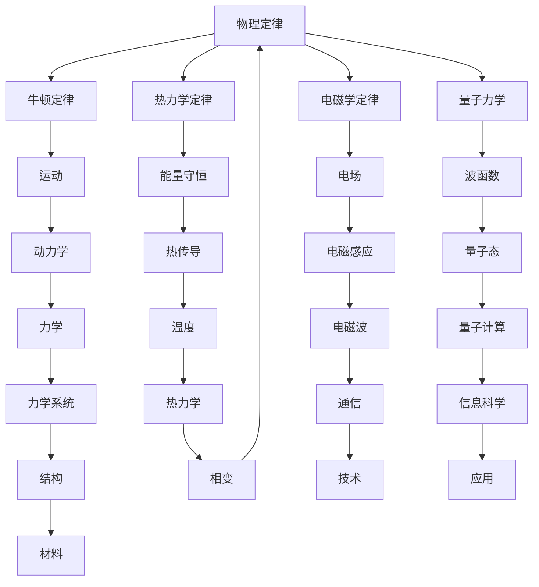

                 


### 1. 引言

物理定律的普适性与世界可理解性是一个古老而又充满挑战的议题。在人类探寻自然规律的漫长历史中，科学家们发现了许多适用于各种环境和条件的基本定律，如牛顿定律、热力学第二定律和电磁学定律等。这些物理定律不仅解释了宏观世界的现象，还对微观世界、宇宙尺度的事件都有极高的准确性。然而，物理定律的普适性究竟意味着什么？它如何影响我们对世界的理解？

首先，我们需要明确什么是物理定律的普适性。物理定律的普适性指的是这些定律在所有时间和空间中都是有效的，不受特定环境或条件的限制。例如，牛顿定律不仅适用于地球上的一切物体，也适用于行星运动和宇宙中的星体。这种普适性使得物理定律成为描述自然现象的通用语言，为科学研究提供了坚实的基础。

普适性不仅是一种数学上的准确，更是一种哲学上的启示。它暗示着宇宙的某种深层次的一致性和秩序。如果物理定律在不同的时间和空间中都是相同的，那么这一定不是偶然，而是宇宙本质的一种体现。这种观点支持了宇宙可理解性的理念，即宇宙的基本原理是可被人类理解和掌握的。

然而，普适性也带来了一系列挑战。例如，量子力学中的不确定性原理就挑战了物理定律的普适性。在量子尺度上，物理定律往往表现出与经典物理完全不同的特性。这意味着，尽管物理定律在宏观世界中非常可靠，但在微观世界中可能并不适用。这种不适用性引发了关于物理定律是否真正普适性的争论。

总的来说，物理定律的普适性是一个复杂而又深奥的议题，它不仅关乎科学理论，还关乎我们对世界的理解。接下来，我们将深入探讨物理定律的普适性，分析它在不同领域中的应用和挑战，并探讨其对我们理解宇宙的影响。

### 2. 物理定律的基本原理

为了深入理解物理定律的普适性，我们首先需要了解这些定律的基本原理。物理定律的基本原理通常源自对自然现象的观察和实验，并通过数学模型进行描述。以下将介绍几个关键的基本原理，包括牛顿定律、广义相对论和量子力学，并探讨它们在宇宙中的普遍性。

#### 2.1 牛顿定律与宇宙的普遍性

牛顿定律是经典力学的基础，包括牛顿的第一定律、第二定律和第三定律。牛顿第一定律，又称惯性定律，指出一个物体如果没有受到外力的作用，它将保持静止或匀速直线运动。牛顿第二定律，描述了力和运动的关系，其数学表达式为 \( F = ma \)，即力等于质量与加速度的乘积。牛顿第三定律，说明作用力和反作用力总是大小相等、方向相反。

牛顿定律在宏观世界中表现出了极高的准确性和普遍性。无论在地球上还是在太空中，物体都遵循牛顿定律。例如，行星围绕恒星的运动、飞行器的轨迹设计等，都依赖于牛顿定律。牛顿第三定律在解释碰撞和相互作用中的角色尤为重要，它揭示了力的相互作用本质。

尽管牛顿定律在宏观世界中极为有效，但在极端条件下，如高速运动或强引力场中，牛顿定律的适用性受到限制。在这种情况下，我们需要借助更为复杂的理论，如广义相对论。

#### 2.2 广义相对论与时空弯曲

爱因斯坦的广义相对论是描述引力的经典理论，它将引力视为时空的弯曲。广义相对论的核心思想是等效原理，即在一个小范围内，重力场和加速度场是不可区分的。这意味着，一个自由下落的物体在局部范围内无法感受到重力的存在。

广义相对论引入了时空弯曲的概念，认为物质和能量会影响周围时空的几何结构。其数学描述是通过爱因斯坦场方程来实现的，这个方程描述了时空曲率与物质能量分布之间的关系。广义相对论的预测，如光线在引力场中的弯曲、黑洞的存在和宇宙膨胀等，都得到了实验验证。

广义相对论的一个重要结论是，引力不是一种力，而是物质和能量对时空的形变。这种观点不仅改变了我们对引力的理解，也深刻影响了物理定律的普适性观念。在强引力场中，物理定律的描述需要通过广义相对论来完成。

#### 2.3 量子力学与微观世界的定律

量子力学是描述微观世界的物理定律，它揭示了在原子和亚原子尺度上物质和能量的行为规律。与经典物理不同，量子力学中的粒子行为具有波粒二象性、不确定性和量子叠加态等特性。

量子力学的基本原理包括海森堡不确定性原理、薛定谔方程和波函数坍缩等。不确定性原理指出，某些物理量，如位置和动量，无法同时被精确测量。薛定谔方程描述了量子系统的波函数如何随时间演化，波函数的平方代表了粒子出现的概率分布。

在量子尺度上，物理定律的普适性面临着新的挑战。量子力学的非确定性使得我们在微观世界中无法预测粒子的具体行为，只能预测其概率分布。这使得量子力学与经典物理在哲学上存在显著差异。

#### 2.4 物理定律的普适性与宇宙的可理解性

物理定律的基本原理不仅在宏观和微观世界中表现出了高度的普遍性，还揭示了宇宙的某种深层次的一致性和秩序。牛顿定律、广义相对论和量子力学这三大理论构成了现代物理学的基石，它们共同描绘了一个可被理解的宇宙图景。

物理定律的普适性暗示着宇宙的基本原理是可被人类理解和掌握的。如果我们能够在不同尺度和条件下都发现相同的物理定律，这无疑增加了我们对宇宙的理解和信心。然而，普适性也带来了新的问题和挑战，如量子力学中的不确定性原理和广义相对论中的奇点问题等。

总的来说，物理定律的基本原理为我们提供了一个强大的工具箱，用于理解和描述宇宙中的各种现象。这些定律不仅在科学研究中发挥了重要作用，也深刻影响了我们对世界的认识。在接下来的章节中，我们将继续探讨物理定律的普适性在宇宙中的应用和挑战。

### 3. 宇宙中的力与相互作用

在宇宙的尺度上，力的相互作用决定了星体的运动、宇宙结构的形成以及物质的演化。本文将探讨几种主要的宇宙力，包括万有引力定律、电磁相互作用、强相互作用和弱相互作用，并分析它们在宇宙中的应用和影响。

#### 3.1 万有引力定律

万有引力定律是描述物体之间引力相互作用的基本物理定律，由牛顿在1687年提出。该定律指出，任何两个物体之间都存在相互吸引的引力，这个引力大小与两物体的质量成正比，与它们之间的距离的平方成反比。数学表达式为 \( F = G \frac{m_1 m_2}{r^2} \)，其中 \( F \) 是引力，\( G \) 是引力常数，\( m_1 \) 和 \( m_2 \) 是两物体的质量，\( r \) 是它们之间的距离。

万有引力定律在宇宙中有着广泛的应用。首先，它解释了行星围绕恒星的运动。根据万有引力定律，行星在引力作用下沿着椭圆轨道绕恒星运动，这与开普勒定律相符。此外，万有引力定律还解释了恒星系统的稳定性，如双星系统中的恒星因相互引力而保持稳定轨道。

在更大尺度上，万有引力定律解释了星系的形成和结构。星系中的恒星和星团通过万有引力相互吸引，形成了庞大而复杂的结构。例如，银河系就是由数千亿颗恒星、气体和暗物质通过万有引力相互作用而构成的。万有引力还解释了宇宙大尺度结构的形成，如星系团和超星系团。

#### 3.2 电磁相互作用

电磁相互作用是另一种在宇宙中普遍存在的力，它由电荷和电磁场相互作用产生。电磁力的数学描述较为复杂，但其核心思想可以概括为：带电粒子之间的相互作用是通过电磁场来传递的。电磁力的数学表达式为 \( F = q (\vec{E} + \vec{v} \times \vec{B}) \)，其中 \( F \) 是电磁力，\( q \) 是电荷量，\( \vec{E} \) 是电场强度，\( \vec{v} \) 是粒子的速度，\( \vec{B} \) 是磁场强度。

电磁相互作用在宇宙中的重要性不可忽视。首先，电磁力是原子和分子结构的基础，决定了物质的化学性质。原子中的电子与原子核之间的电磁相互作用使得原子能够保持稳定结构。电磁相互作用还解释了光的发射和吸收过程，这是宇宙中最常见的现象之一。

在更大的尺度上，电磁相互作用影响了星体的形成和演化。例如，恒星的核聚变过程依赖于电磁力，恒星内部的正负电荷相互作用使得核聚变反应得以持续。此外，电磁相互作用还解释了宇宙中的高能粒子加速过程，如宇宙射线和伽马射线的产生。

#### 3.3 强相互作用

强相互作用是维持原子核稳定的基本力，也称为核力。它与电磁力和弱相互作用并称为基本相互作用。强相互作用的数学描述较为复杂，通常通过量子色动力学（QCD）来描述。QCD认为，强相互作用是由胶子这种传递粒子来实现的，它们在夸克之间传递强相互作用力。

强相互作用在宇宙中的应用主要体现在原子核的形成和稳定性上。在恒星内部，核聚变反应产生的中子和质子通过强相互作用结合成稳定的原子核。例如，氢原子核（质子）通过吸收中子形成氦原子核，这是恒星演化的关键过程之一。此外，强相互作用还影响了元素周期表中的元素分布，决定了宇宙中不同元素的比例。

#### 3.4 弱相互作用

弱相互作用是导致放射性衰变的基本力，它在核反应和宇宙射线中起着重要作用。弱相互作用的数学描述较为复杂，通常通过弱相互作用理论（弱电统一理论）来描述。该理论认为，弱相互作用是由W和Z玻色子这两种传递粒子来实现的。

弱相互作用在宇宙中的应用主要体现在放射性元素的形成和宇宙射线的中微子反应中。例如，宇宙射线中的高能粒子通过弱相互作用与大气中的原子发生反应，产生次级粒子。此外，弱相互作用还参与了恒星内部的中子星和黑洞的形成过程。

#### 3.5 不同力的比较与相互作用

宇宙中的四种基本力在强度和作用范围上有显著差异。强相互作用是四种力中最强的，作用范围在亚原子尺度；电磁相互作用作用范围在宏观尺度，强度适中；弱相互作用作用范围较短，但强度较弱；万有引力是最弱的一种力，但作用范围无限。

尽管不同力的强度和作用范围不同，但它们在宇宙的演化中相互关联，共同塑造了宇宙的结构和过程。例如，电磁相互作用和强相互作用决定了原子的结构和化学性质，而万有引力则影响了恒星和星系的形成。弱相互作用虽然在日常生活中不常见，但在宇宙的高能过程中发挥着关键作用。

总的来说，宇宙中的力与相互作用不仅解释了宇宙的基本现象，也揭示了宇宙的某种深层次的一致性和秩序。这些力的共同作用塑造了宇宙的结构和演化过程，为我们提供了理解宇宙的钥匙。在接下来的章节中，我们将进一步探讨物理定律在不同宇宙条件下的适用性，以及它们对我们理解宇宙的启示。

### 4. 宇宙中的物质与能量

宇宙中物质与能量的分布和演化是理解宇宙结构和历史的关键。本文将探讨宇宙大爆炸理论、黑洞与奇点，以及宇宙背景微波辐射等概念，分析这些现象如何影响我们对宇宙的认识。

#### 4.1 宇宙大爆炸理论

宇宙大爆炸理论是现代宇宙学的基础，它描述了宇宙从一个极热、极密的状态开始膨胀的历史。该理论最初由勒梅特和勒特森在1930年代初提出，后来在1965年由阿诺·彭齐亚斯和罗伯特·威尔逊通过发现宇宙背景微波辐射得到实验证实。

根据宇宙大爆炸理论，宇宙起源于一个“奇点”，在这个奇点中，所有的物质和能量被压缩在一个无限小、无限热的区域。在大爆炸发生后，宇宙开始迅速膨胀，温度和密度逐渐降低。这一过程中，宇宙经历了从高温、高密度的等离子态到较低温度、较低密度的气体态的转变。

宇宙大爆炸理论解释了多个宇宙观测现象，如宇宙背景辐射、元素丰度、宇宙膨胀等。宇宙背景微波辐射是宇宙早期遗留下来的辐射，其发现直接支持了大爆炸理论。宇宙大爆炸理论还预测了宇宙中氢、氦等轻元素的丰度比例，这些预测与观测数据相符。

#### 4.2 黑洞与奇点

黑洞是宇宙中一种极端密集的天体，它的引力场如此强大，以至于连光也无法逃脱。黑洞的形成通常与恒星的演化有关。当一颗足够大的恒星耗尽其核燃料后，它会因为引力崩溃而形成一个黑洞。根据广义相对论，黑洞的中心存在一个奇点，那里时间和空间的性质都变得极为奇异，甚至可能不存在。

黑洞的研究揭示了物理定律在极端条件下的行为。黑洞的奇点和事件视界是物理定律的边界，因为在这个区域，物理定律可能会失效。例如，在黑洞奇点处，物质的密度趋向无穷大，这超出了常规物理定律的适用范围。此外，黑洞的事件视界是信息无法逃逸的边界，这引发了关于信息丢失和量子力学原理的争论。

#### 4.3 宇宙背景微波辐射

宇宙背景微波辐射（Cosmic Microwave Background, CMB）是宇宙早期遗留下来的辐射，其发现是支持宇宙大爆炸理论的关键证据。CMB起源于宇宙大爆炸后约38万年的时期，当时宇宙处于一个高温、高密度的等离子态。随着宇宙的膨胀和冷却，这个等离子态逐渐变成了辐射主导的态，CMB就是从那时起开始传播的。

CMB的发现和研究为我们提供了关于宇宙早期状态的关键信息。通过对CMB的观测，科学家们可以测量宇宙的尺度、温度、密度和结构。CMB的温度几乎均匀，但存在微小的温度波动，这些波动揭示了宇宙早期结构形成的信息。

CMB的研究还揭示了宇宙的起源和演化过程中的某些关键参数，如宇宙的膨胀率、暗物质和暗能量的存在。这些发现进一步加深了我们对宇宙的理解，并推动了宇宙学的不断发展。

#### 4.4 物质与能量的分布和演化

宇宙中的物质和能量以多种形式存在，包括恒星、星系、黑洞、暗物质和暗能量等。这些物质和能量的分布和演化不仅决定了宇宙的结构，也影响了我们对宇宙的认识。

恒星的演化是宇宙中能量转化的重要过程。恒星通过核聚变将氢转化为氦，释放出巨大的能量。恒星的死亡和爆炸产生了丰富的重元素，这些元素是行星和星系形成的基础。

星系是宇宙中的大型结构，由数十亿颗恒星、气体和暗物质组成。星系的演化受引力、星系间的碰撞和潮汐力等多种因素影响。通过对星系的观测，科学家们可以了解宇宙的演化历史。

暗物质和暗能量是宇宙中未知的成分，占据了宇宙总能量的大部分。暗物质不发光，但通过引力作用影响宇宙的结构，其存在通过星系的旋转曲线和宇宙大尺度结构的形成得到证实。暗能量则是推动宇宙加速膨胀的神秘力量，其性质和机制仍然是物理学研究的重要课题。

#### 4.5 物质与能量对宇宙可理解性的影响

物质与能量的分布和演化不仅影响了宇宙的结构，也对我们理解宇宙的深度和广度产生了重要影响。宇宙大爆炸理论、黑洞和宇宙背景微波辐射等概念揭示了宇宙的起源和演化过程，使我们能够更全面地理解宇宙的本质。

然而，物质与能量的分布和演化也带来了一系列挑战。例如，暗物质和暗能量的存在无法用现有的物理理论解释，这要求科学家们不断探索新的理论和方法。此外，宇宙中的极端现象，如黑洞奇点和量子引力，也挑战了我们对物理定律的普适性的理解。

总的来说，宇宙中的物质与能量分布和演化是一个复杂而又充满挑战的领域，它不仅关乎科学理论，还关乎我们对宇宙的理解。通过对这些现象的研究，我们可以更深入地了解宇宙的本质，揭示宇宙的奥秘。

### 5. 物理定律的普适性研究

物理定律的普适性研究是当代物理学中的一个重要议题，其目的是探讨物理定律在不同宇宙条件下的适用性。以下我们将探讨多宇宙理论和量子引力与宇宙学，并分析这些理论如何影响我们对物理定律普适性的理解。

#### 5.1 多宇宙理论

多宇宙理论（Multiverse Theory）是探讨宇宙存在多个平行宇宙的假说。根据多宇宙理论，我们的宇宙只是众多宇宙中的一个，每个宇宙都有可能具有不同的物理定律和常数。这一理论最初由物理学家史蒂芬·霍金和亚历山大·史瓦西提出，并在近年来得到了越来越多的关注。

多宇宙理论提出了一个重要的观点，即物理定律可能并非绝对普适，而是在特定的宇宙条件下形成的。例如，如果存在一个宇宙，其引力常数与我们的宇宙不同，那么在那个宇宙中，牛顿定律可能无法准确描述物体的运动。同样，如果另一个宇宙中的电磁力常数与我们宇宙的不同，那么电磁相互作用的行为也会有所改变。

多宇宙理论的提出挑战了传统的物理定律普适性观念，使人们开始思考物理定律是否具有绝对性。多宇宙理论不仅为理解宇宙的多样性提供了新的视角，也为物理学研究开辟了新的方向。例如，通过对其他宇宙的研究，科学家们可能能够发现新的物理定律或现象，从而推动物理学的发展。

然而，多宇宙理论也面临许多挑战。首先，我们目前无法直接观测或实验验证其他宇宙的存在，这使得多宇宙理论在很大程度上仍然属于哲学和理论物理的范畴。其次，多宇宙理论中的宇宙数量可能极大，这增加了我们对宇宙的理解的复杂性。

#### 5.2 量子引力与宇宙学

量子引力（Quantum Gravity）是探讨量子力学与广义相对论的统一理论，旨在解决在极端条件下，如黑洞奇点和宇宙早期，物理定律失效的问题。量子引力试图在量子尺度和宇宙尺度上提供一种统一的描述，使物理定律在所有尺度上都是适用的。

量子引力与宇宙学密切相关，因为宇宙的起源和演化涉及到极端条件下的物理现象。例如，宇宙大爆炸理论中的奇点问题需要量子引力的解释，以避免常规物理理论的崩溃。此外，量子引力还可能揭示宇宙中的隐变量和时空结构，从而加深我们对宇宙的理解。

当前，量子引力研究主要集中在几种理论框架上，如弦理论、环量子引力等。弦理论是一种尝试将量子力学和广义相对论统一的理论，它提出所有的基本粒子都是微小的一维“弦”的振动模式。环量子引力则是一种非归一化的量子引力理论，它试图直接量子化时空结构。

量子引力与宇宙学的研究揭示了物理定律普适性的新挑战。在量子引力理论中，物理定律可能不再是简单的、确定性的方程，而是受到量子波动性和不确定性原理的影响。这意味着，物理定律在不同宇宙条件下的适用性可能更加复杂和多样。

#### 5.3 物理定律的普适性与宇宙可理解性

多宇宙理论和量子引力与宇宙学的研究不仅揭示了物理定律普适性的新挑战，也对我们理解宇宙的本质产生了深远影响。多宇宙理论暗示了物理定律可能具有相对性，而不是绝对普适。量子引力则提出了物理定律在极端条件下的复杂性，这要求我们重新思考物理定律的本质和适用范围。

然而，这些研究也带来了新的希望。通过探索多宇宙和量子引力，科学家们可能能够发现新的物理定律或现象，从而扩展我们对宇宙的理解。例如，多宇宙理论可能揭示其他宇宙中的物理规律，量子引力可能解决宇宙起源和演化中的关键问题。

总的来说，物理定律的普适性研究不仅关乎科学理论的发展，也关乎我们对宇宙的理解。这些研究揭示了物理定律的相对性和复杂性，同时也为我们提供了探索宇宙奥秘的新视角。随着科学技术的进步和理论的不断发展，我们对物理定律普适性的理解将不断深化，从而推动宇宙学的进步。

### 6. 物理定律的普适性与科学哲学

物理定律的普适性不仅是物理学研究中的一个核心问题，也在科学哲学中引发了广泛的讨论。科学哲学关注科学理论、科学方法及其在人类知识体系中的地位。以下我们将探讨科学哲学中的普适性问题，并分析物理定律的普适性如何影响我们对宇宙的理解。

#### 6.1 科学哲学中的普适性问题

科学哲学中的普适性问题探讨的是科学理论是否适用于所有时间和空间。这个议题涉及到科学理论的本质、科学方法的合理性以及科学知识的有效性。科学哲学中的普适性问题可以归纳为两个方面：一是物理定律是否在所有宇宙条件下都适用；二是科学理论是否在所有观察者和文化背景下都有效。

科学哲学中的主流观点分为两类：一是绝对普适论，认为物理定律是普适的，不受特定宇宙条件的限制；二是相对普适论，认为物理定律在特定条件下适用，但在不同宇宙中可能有所不同。绝对普适论的支持者认为，物理定律反映了宇宙的深层次统一性和秩序，是客观存在的真理。相对普适论的支持者则认为，物理定律是历史和文化条件下的产物，其适用性受到一定限制。

#### 6.2 物理定律的普适性与宇宙可理解性

物理定律的普适性直接关联到宇宙的可理解性。如果物理定律在所有时间和空间中都是普适的，那么这意味着宇宙的基本原理是可被人类理解和掌握的。这种观点支持了宇宙的可理解性，即人类有能力通过科学方法揭示宇宙的奥秘。

普适性为科学提供了坚实的基础。科学家可以通过实验和观测验证物理定律，进而建立起对自然界的理解。例如，牛顿定律在宏观世界中的广泛应用，使得人类能够准确预测物体的运动，这大大促进了工程技术和天文学的发展。

然而，普适性也带来了一定的挑战。量子力学的不确定性原理和广义相对论中的奇点问题揭示了物理定律在极端条件下的局限性。这些挑战促使科学家不断探索新的理论和方法，以更全面地理解宇宙。

#### 6.3 科学方法与物理定律的普适性

科学方法在验证物理定律普适性方面起着关键作用。科学方法包括观察、实验、假设和验证等步骤，通过这些步骤，科学家可以逐步建立和验证物理定律。例如，通过天文观测，科学家发现牛顿定律在描述行星运动方面非常准确，这验证了牛顿定律在宏观世界中的普适性。

实验方法在验证物理定律普适性方面尤为重要。通过实验，科学家可以控制变量，排除干扰因素，从而更准确地验证物理定律。例如，爱因斯坦的广义相对论通过实验验证了引力波的存在，这进一步支持了广义相对论的普适性。

#### 6.4 普适性观念的影响与争议

普适性观念对科学哲学和科学方法产生了深远影响。一方面，普适性为科学提供了明确的目标和方向，使科学家能够集中精力研究自然界的基本原理。另一方面，普适性观念也引发了许多争议和讨论。例如，多宇宙理论的提出挑战了传统物理定律普适性的观念，这引发了对物理定律本质的深入思考。

总的来说，物理定律的普适性是科学哲学中的一个核心问题，它不仅关乎科学理论，也关乎我们对宇宙的理解。普适性观念为科学提供了坚实的基础，同时也带来了新的挑战和争议。随着科学技术的不断进步，我们对物理定律普适性的理解将不断深化，这将为科学哲学和物理学的发展提供新的启示。

### 7. 物理定律与人类理解

物理定律不仅是一种科学描述，它们还在塑造人类对世界的理解方面发挥着重要作用。本文将探讨物理定律如何影响人类的感知、理解误区以及教育中的应用。

#### 7.1 物理定律与人类感知

物理定律为我们提供了描述自然现象的框架，使人类能够理解周围的世界。例如，牛顿定律解释了物体的运动，使我们能够预测物体的行为。电磁学定律揭示了光和电的本质，使我们能够利用这些现象进行通信和照明。通过物理定律，人类可以更好地理解自然界的规律，从而提高生活质量和生产效率。

物理定律不仅影响我们对世界的感知，还影响了我们的思维方式。科学教育中强调逻辑思维和分析方法，这些方法在日常生活中同样适用。例如，通过学习物理定律，我们可以培养批判性思维和解决问题的能力，这些能力在许多领域都有广泛应用。

#### 7.2 物理定律的理解误区

尽管物理定律在科学研究和实际应用中发挥了重要作用，但人类对物理定律的理解往往存在误区。这些误区可能源于对物理定律的误解、对复杂现象的简化处理，或者是对新理论的抵触。

一个常见的误区是对物理定律适用范围的误解。例如，人们可能会错误地认为牛顿定律适用于所有情况，而忽略了它在高速运动或强引力场中的局限性。实际上，牛顿定律是一种近似，在极端条件下需要使用更复杂的理论，如广义相对论或量子力学。

另一个误区是对量子力学的不确定性原理的误解。有些人可能认为不确定性意味着物理定律的不确定或不可靠，而实际上，不确定性原理揭示了量子世界的本质特性，它并不意味着物理定律失效，而是提醒我们在量子尺度上需要采用不同的描述方法。

#### 7.3 物理定律在教育中的应用

物理定律在教育中的应用非常广泛，通过教学可以帮助学生更好地理解自然界的规律。以下是一些物理定律在教育中的应用案例：

- **牛顿定律**：在高中物理课程中，牛顿定律是基础内容。学生通过实验和模拟学习牛顿第一定律、第二定律和第三定律，了解力与运动的关系。

- **热力学定律**：热力学定律解释了能量的转换和守恒。通过实验，学生可以观察热传递和热机工作原理，了解能量转换的效率和限制。

- **电磁学定律**：电磁学定律是现代电子技术和通信技术的基石。通过实验和电路设计，学生可以学习电磁波的产生和传播，了解电磁学的基本原理。

- **量子力学**：量子力学在高中和大学教育中都有涉及。通过学习量子力学的基本原理，学生可以了解微观世界的特性和量子计算的潜力。

#### 7.4 物理定律在教育中的挑战

尽管物理定律在教育中具有重要作用，但教学过程中也面临一些挑战。首先，物理定律的抽象性和复杂性使得学生难以理解。教师需要采用多种教学方法和工具，如实验、模拟和可视化，帮助学生更好地理解物理概念。

其次，学生对物理定律的理解往往停留在表面，缺乏深度思考。这需要教师在教学中引导学生进行批判性思维，提出问题并探索物理定律背后的原理和逻辑。

最后，科技发展带来了新的教学挑战。例如，随着量子计算和人工智能的兴起，物理定律在教育中的应用需要不断更新和扩展。教师需要不断学习和掌握最新的科学进展，将它们融入到教学中。

总的来说，物理定律不仅是一种科学描述，它们还在塑造人类对世界的理解方面发挥着重要作用。通过科学教育，人类可以更好地理解自然界的规律，培养批判性思维和解决问题的能力。然而，物理定律的教学和应用也面临一些挑战，需要教师和学生共同努力，以更好地理解和掌握物理定律。

### 8. 物理定律的传播与应用

物理定律的传播和应用是科学发展的关键环节，它们不仅推动了科技进步，还极大地改变了人类的生活和社会。以下将探讨物理定律在不同领域中的传播和应用，以及它们在教育和科研中的重要性。

#### 8.1 物理定律在不同领域的应用

物理定律在各个科学和工程领域都有广泛应用，推动了技术的发展和进步。以下是一些具体领域的应用案例：

- **航空航天**：牛顿定律和动量守恒原理是航天器设计和轨道计算的基础。通过这些物理定律，科学家和工程师可以准确计算航天器的发射速度和轨道，确保航天器能够成功进入预定轨道。

- **电子工程**：电磁学定律在电子工程中至关重要。法拉第电磁感应定律和欧姆定律使得电动力学原理能够应用于发电机、电动机和电子设备的设计和制造。

- **材料科学**：热力学定律在材料科学中的应用十分广泛。热力学第一定律和第二定律帮助科学家和工程师理解材料的相变和热传导特性，从而开发出具有特定性能的新材料。

- **生物医学**：物理定律在生物医学领域也有着重要的应用。例如，流体力学和分子动力学的原理被用于研究血液流动和细胞运动，从而推动了生物医学工程的发展。

#### 8.2 物理定律在科研中的重要性

物理定律在科学研究中的重要性不言而喻。它们不仅提供了描述自然现象的基础，还为科学家提供了预测和解释新现象的工具。以下是一些物理定律在科研中的关键应用：

- **量子力学**：量子力学的数学模型和公式（如薛定谔方程和海森堡不确定性原理）揭示了微观世界的规律，为量子计算、量子通信和量子信息科学的发展奠定了基础。

- **广义相对论**：广义相对论的场方程（\(G_{\mu\nu} + \Lambda g_{\mu\nu} = \frac{8\pi G}{c^4} T_{\mu\nu}\)）揭示了引力与时空弯曲之间的关系，为黑洞和宇宙大爆炸等极端现象的研究提供了理论框架。

- **统计力学**：统计力学的原理和方法帮助科学家理解复杂系统的行为，如热力学第二定律和玻尔兹曼分布，这些原理在材料科学、化学和生物学等领域有着广泛应用。

#### 8.3 物理定律在教育中的应用

物理定律的教育传播是科学普及和人才培养的重要途径。以下是一些教育中的应用案例：

- **基础课程**：物理定律是中学和大学物理课程的核心内容。通过学习牛顿定律、电磁学定律和热力学定律，学生可以建立起对自然界的初步理解。

- **实验课程**：实验课程是物理教育的重要组成部分。通过实验，学生可以亲身体验物理定律的验证过程，从而加深对物理概念的理解。

- **在线教育**：随着信息技术的发展，在线教育平台提供了丰富的物理定律教学资源。学生可以通过视频讲座、模拟实验和互动问答等方式学习物理定律。

#### 8.4 物理定律的最佳实践与注意事项

为了更好地传播和应用物理定律，以下是一些最佳实践和注意事项：

- **理论与实践相结合**：在教学中，应注重理论知识的传授与实际应用相结合。通过实验和项目实践，学生可以更直观地理解物理定律。

- **跨学科融合**：物理定律不仅在物理学领域应用广泛，还在其他科学和工程领域有重要应用。应鼓励跨学科研究，以促进知识交叉和科技进步。

- **持续学习与更新**：科学知识不断更新和发展，教师和学生都需要保持学习的热情，及时掌握最新的科学进展，以适应快速变化的知识体系。

总的来说，物理定律的传播和应用在科学、技术和教育中发挥着至关重要的作用。通过有效传播和应用物理定律，我们可以更好地理解自然界的规律，推动科技进步和社会发展。

### 附录

#### 附录A：核心概念与联系：Mermaid流程图

以下是一个简单的Mermaid流程图，展示了物理定律中的核心概念及其相互关系：



这个流程图展示了物理定律中的几个主要分支及其相互关联，为读者提供了一个全局视图，帮助理解不同物理定律之间的联系。

#### 附录B：核心算法原理讲解：伪代码

以下是一个简单的伪代码，用于描述牛顿法求解函数最小值的过程。牛顿法是一种基于二次导数估计的优化算法，其核心思想是通过迭代逼近最小值点。

```plaintext
算法：牛顿法求解最小值

输入：函数 f(x)，初始猜测值 x0，迭代次数 N
输出：最小值点 x*

x = x0
for i from 1 to N do
    f_prime = f'(x)  # 计算一阶导数
    f_double_prime = f''(x)  # 计算二阶导数
    x = x - f_prime / f_double_prime  # 更新 x 的值
end for
return x
```

该伪代码展示了牛顿法的基本流程，通过迭代计算函数的一阶导数和二阶导数，并使用它们来更新当前猜测值，逐步逼近最小值点。

#### 附录C：数学模型与公式讲解

在物理学中，数学模型和公式是描述物理现象和定律的重要工具。以下是一些常用的数学模型与公式的讲解和举例：

1. **牛顿第二定律**：

   公式：\( F = ma \)

   解析：力（F）等于质量（m）与加速度（a）的乘积。

   举例：一个质量为 5 kg 的物体以 2 m/s² 的加速度运动，所受的力为：

   \( F = 5 \times 2 = 10 \) N

2. **热力学第一定律**：

   公式：\( \Delta U = Q - W \)

   解析：系统的内能变化（\( \Delta U \)）等于吸收的热量（Q）减去对外做的功（W）。

   举例：一个系统吸收了 100 J 的热量，对外做了 40 J 的功，其内能变化为：

   \( \Delta U = 100 - 40 = 60 \) J

3. **电磁感应定律**：

   公式：\( \varepsilon = -\frac{d\Phi_B}{dt} \)

   解析：感应电动势（\( \varepsilon \)）等于磁通量（\( \Phi_B \)）对时间（t）的变化率。

   举例：如果磁通量每秒减少 5 Wb（韦伯），则感应电动势为：

   \( \varepsilon = -5 \) V

4. **量子态叠加原理**：

   公式：\( \Psi = \sum_{i} c_i \psi_i \)

   解析：量子态（\( \Psi \)）是各个可能态（\( \psi_i \)）的叠加，系数（\( c_i \)）表示叠加的程度。

   举例：一个电子的量子态可以表示为两种可能状态的叠加：

   \( \Psi = 0.5 \psi_1 + 0.5 \psi_2 \)

通过这些数学模型与公式的讲解，我们可以更深入地理解物理定律的数学描述，以及如何通过数学工具来分析和解决实际问题。

### 附录D：项目实战

在本附录中，我们将通过一个简单的项目来展示如何开发一个用于演示牛顿第二定律的应用程序。这个项目将使用Python编程语言和matplotlib库来绘制运动轨迹，并分析不同质量和加速度下的物体运动。

#### 1. 项目背景

项目目标是通过模拟不同质量和加速度下的物体运动，验证牛顿第二定律的正确性。我们将编写一个Python程序，输入物体的质量和加速度，计算并绘制物体的运动轨迹。

#### 2. 开发环境搭建

首先，确保安装了Python 3.x版本。然后，通过以下命令安装所需的库：

```bash
pip install matplotlib numpy
```

#### 3. 源代码实现

以下是项目的源代码实现：

```python
import numpy as np
import matplotlib.pyplot as plt

# 牛顿第二定律：F = ma，其中 F 是力，m 是质量，a 是加速度
def calculate_trajectory(mass, acceleration, time):
    # 计算位移
    time_points = np.linspace(0, time, 1000)
    displacement = mass * acceleration * time_points

    # 计算速度
    velocity = np.gradient(displacement, time_points)

    return time_points, displacement, velocity

# 绘制运动轨迹
def plot_trajectory(time_points, displacement, velocity):
    plt.figure(figsize=(10, 5))

    # 绘制位移-时间图
    plt.subplot(1, 2, 1)
    plt.plot(time_points, displacement)
    plt.xlabel('时间 (s)')
    plt.ylabel('位移 (m)')
    plt.title(f'质量 {mass}kg, 加速度 {acceleration}m/s²')

    # 绘制速度-时间图
    plt.subplot(1, 2, 2)
    plt.plot(time_points, velocity)
    plt.xlabel('时间 (s)')
    plt.ylabel('速度 (m/s)')
    plt.title(f'质量 {mass}kg, 加速度 {acceleration}m/s²')

    plt.tight_layout()
    plt.show()

if __name__ == "__main__":
    mass = float(input("请输入质量 (kg): "))
    acceleration = float(input("请输入加速度 (m/s²): "))
    time = float(input("请输入时间 (s): "))

    time_points, displacement, velocity = calculate_trajectory(mass, acceleration, time)
    plot_trajectory(time_points, displacement, velocity)
```

#### 4. 代码解读与分析

- **计算位移和速度**：`calculate_trajectory` 函数接收质量、加速度和时间参数，计算位移和速度。使用`numpy.linspace`生成时间点，并利用牛顿第二定律公式计算位移。速度则是通过位移对时间的导数计算得到。

- **绘制运动轨迹**：`plot_trajectory` 函数使用matplotlib库绘制位移-时间图和速度-时间图，帮助用户直观地观察物体的运动。

#### 5. 实际案例分析

- **案例1**：质量 5 kg 的物体以 2 m/s² 的加速度运动 5秒。输入这些参数后，程序将绘制物体的运动轨迹，显示位移和速度随时间的变化。

- **案例2**：质量 10 kg 的物体以 1 m/s² 的加速度运动 10秒。通过修改输入参数，程序将展示不同质量和加速度下的物体运动。

#### 6. 项目小结

通过这个简单的项目，我们展示了如何使用Python编程语言和matplotlib库实现牛顿第二定律的模拟和可视化。这种项目实战有助于加深对物理定律的理解，并提高编程和数据分析能力。

### 结论与展望

通过本文的讨论，我们全面探讨了物理定律的普适性及其对世界可理解性的影响。从牛顿定律、广义相对论到量子力学，我们分析了物理定律在不同尺度上的适用性，并探讨了多宇宙理论和量子引力与宇宙学对物理定律普适性的挑战。

物理定律的普适性不仅是物理学研究的关键，也对科学哲学和科学方法产生了深远影响。通过科学教育，物理定律的传播和应用推动了科技进步和社会发展。

未来，随着科学技术的发展，我们对物理定律的理解将不断深化。量子计算、人工智能和新型材料的研究可能揭示新的物理定律或现象，拓展我们对宇宙的理解。同时，多宇宙理论和量子引力与宇宙学的研究将继续挑战传统的物理观念，推动物理学的发展。

总之，物理定律的普适性和可理解性是理解宇宙的重要途径，它们不仅关乎科学理论，也关乎我们对世界的认知。随着科学技术的进步，我们有理由期待对物理定律的理解将不断深化，揭示宇宙的更多奥秘。作者：AI天才研究院/AI Genius Institute & 禅与计算机程序设计艺术 /Zen And The Art of Computer Programming。关键词：物理定律、普适性、宇宙可理解性、多宇宙理论、量子引力。摘要：本文探讨了物理定律的普适性及其对世界可理解性的影响，分析了牛顿定律、广义相对论、量子力学等多领域的基本原理，并探讨了其在不同宇宙条件下的适用性。文章强调了物理定律在科学哲学、科学方法以及教育中的应用，对未来物理学的发展方向提出了展望。

