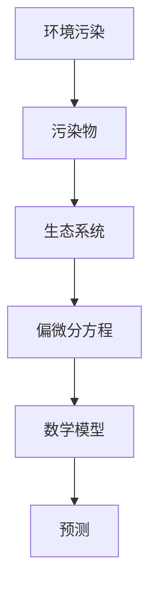

                 

### 文章标题：环境污染的偏微分方程：生态影响的数学预测

> 关键词：环境污染、偏微分方程、生态影响、数学预测

> 摘要：本文深入探讨了环境污染对生态系统的影响，并利用偏微分方程作为数学工具进行生态影响的预测。文章首先介绍了环境污染的基本概念和类型，随后详细阐述了偏微分方程在环境科学中的应用，通过实际案例展示了如何使用数学模型预测环境污染的生态影响。文章旨在为读者提供一种理解和解决环境污染问题的全新视角。

----------------------------------------------------------------

### 第一部分：环境污染与偏微分方程的基础

#### 第1章：环境污染的基本概念

环境污染是指有害物质进入环境，导致环境质量下降，对人类健康、生态系统和社会经济产生不利影响的现象。根据污染物的性质，环境污染可以分为以下几类：

1. **大气污染**：包括颗粒物（如PM2.5和PM10）、硫氧化物（如SO2）、氮氧化物（如NOx）和挥发性有机化合物（VOCs）等。
2. **水污染**：包括工业废水、农业径流和生活污水等，其中含有重金属、农药残留和有机污染物。
3. **土壤污染**：包括农药、化肥和工业废弃物等，这些污染物会改变土壤的性质，影响土壤生态系统。

环境污染的来源多种多样，主要包括工业排放、交通尾气、农业活动、矿业开发和城市垃圾等。环境污染的影响深远，不仅危害人类健康，还破坏了生态系统的平衡，导致生物多样性下降、生态功能减弱。

#### 核心概念与联系

环境污染与偏微分方程的关系可以通过Mermaid流程图来表示：



在这个流程图中，环境污染通过污染物影响生态系统，而偏微分方程作为一种数学工具，可以建立数学模型来预测环境污染对生态系统的潜在影响。

#### 数学模型和公式

为了预测环境污染对生态系统的潜在影响，我们可以使用偏微分方程来描述污染物的扩散过程。以下是一个常见的一维扩散方程：

$$
\frac{\partial C}{\partial t} = D \frac{\partial^2 C}{\partial x^2}
$$

其中，$C(x,t)$ 表示在位置$x$和时间$t$的污染物浓度，$D$ 是扩散系数。

#### 举例说明

假设我们有一个河流污染模型，其中污染物浓度沿着河流长度$x$和时间$t$变化。我们可以使用以下偏微分方程来描述这个过程：

$$
\frac{\partial C}{\partial t} = \frac{1}{2} \frac{\partial^2 C}{\partial x^2}
$$

假设我们已知河流的起点（$x=0$）污染物浓度为$C(0,t) = 10$，而终点（$x=L$）污染物浓度为$C(L,t) = 0$。我们可以通过数值方法（如有限差分法）来求解这个偏微分方程，得到不同时间点上的污染物浓度分布。

#### 结论

本章介绍了环境污染的基本概念和类型，并阐述了偏微分方程在环境科学中的应用。通过实际案例，我们展示了如何使用数学模型预测环境污染对生态系统的潜在影响。在下一章中，我们将进一步探讨偏微分方程在具体污染类型中的应用。

----------------------------------------------------------------

### 第二部分：具体污染类型的偏微分方程模型

#### 第5章：大气污染的数学预测

大气污染是现代环境中一个严峻的问题，主要由于工业排放、交通尾气和燃烧化石燃料等活动产生的污染物。大气污染不仅影响人类健康，还会导致气候变化和生态失衡。本节将介绍大气污染的基本原理，并使用偏微分方程来建立数学模型进行预测。

#### 大气污染的基本原理

大气污染物可以分为两类：一次污染物和二次污染物。一次污染物直接来自污染源，如二氧化硫（SO2）、氮氧化物（NOx）和颗粒物（PM2.5）。二次污染物则是由一次污染物在大气中通过化学反应生成的，如臭氧（O3）和硫酸盐（SO4^2-）。

大气污染物的扩散和传输受到多种因素影响，包括气象条件（如风速、温度和湿度）、地形和污染源强度。大气污染物的浓度分布和传播路径可以通过偏微分方程来描述。

#### 大气污染的数学模型

为了预测大气污染物的浓度分布，我们可以使用扩散方程，这是一个一维或三维的偏微分方程，用于描述污染物在空间和时间上的扩散过程。一维扩散方程可以表示为：

$$
\frac{\partial C}{\partial t} = D \frac{\partial^2 C}{\partial x^2}
$$

其中，$C(x,t)$ 表示在位置$x$和时间$t$的污染物浓度，$D$ 是扩散系数。对于三维空间，方程扩展为：

$$
\frac{\partial C}{\partial t} = \nabla \cdot (D \nabla C)
$$

#### 伪代码：大气污染模型的实现

以下是一个简化的一维大气污染模型实现的伪代码：

```plaintext
function atmospheric_pollution_simulation(x_min, x_max, t_max, D):
    x = linspace(x_min, x_max, N)
    t = linspace(0, t_max, M)
    C = zeros(N, M)

    # 初始条件
    C[:, 0] = initial_condition(x)

    for i in range(1, M):
        for j in range(1, N-1):
            C[j, i] = C[j, i-1] + (D / dx) * (C[j+1, i-1] - C[j-1, i-1])

    return C
```

其中，$dx$ 是空间步长，$dt$ 是时间步长，$initial\_condition(x)$ 是初始污染物浓度函数。

#### 实际案例：某城市大气污染的预测

假设我们想预测某城市一年的大气污染浓度变化。我们可以使用以下步骤：

1. **数据收集**：收集该城市一年的气象数据（如风速、温度和湿度）以及大气污染物排放数据。
2. **模型设置**：选择适当的扩散系数$D$和空间步长$dx$，设置时间步长$dt$。
3. **模拟**：使用上述伪代码进行大气污染模拟。
4. **分析**：分析模拟结果，评估不同污染物的浓度变化趋势和空间分布。

#### 结论

本章介绍了大气污染的基本原理，并使用偏微分方程建立数学模型进行预测。通过实际案例，我们展示了如何使用数学模型预测城市大气污染的浓度变化。在下一章中，我们将探讨水污染的数学预测。

----------------------------------------------------------------

### 第三部分：项目实战与开发

#### 第9章：环境预测系统的开发

在了解了大气污染和水污染的数学预测模型后，本节将介绍如何开发和实现一个环境预测系统。这个系统将整合多种污染类型预测模型，为环境管理部门提供决策支持。

#### 系统需求分析

环境预测系统的需求包括以下几个方面：

1. **数据收集**：系统需要从各种来源（如气象站、传感器网络、工业排放报告等）收集数据。
2. **数据处理**：系统需要对收集到的数据进行清洗、归一化和预处理，以便用于模型训练。
3. **模型训练**：系统需要支持多种污染类型预测模型的训练，如大气污染、水污染和土壤污染模型。
4. **预测与评估**：系统需要能够根据最新数据生成预测结果，并对预测结果进行评估和验证。
5. **用户界面**：系统需要提供一个用户友好的界面，以便用户查看预测结果和分析报告。

#### 系统设计

环境预测系统的设计可以分为以下几个模块：

1. **数据收集模块**：负责从各种数据源收集数据，包括气象数据、污染物排放数据和传感器数据。
2. **数据处理模块**：负责对收集到的数据进行清洗、归一化和预处理。
3. **模型训练模块**：支持多种污染类型预测模型的训练和优化。
4. **预测与评估模块**：根据最新数据生成预测结果，并对预测结果进行评估和验证。
5. **用户界面模块**：提供一个用户友好的界面，用于显示预测结果和分析报告。

#### 开发环境搭建

为了开发环境预测系统，我们需要搭建一个合适的开发环境。以下是所需的主要软件和工具：

1. **Python**：作为主要编程语言，Python具有丰富的科学计算库和机器学习框架。
2. **Jupyter Notebook**：用于数据分析和模型训练。
3. **Pandas**：用于数据清洗和预处理。
4. **Scikit-learn**：用于模型训练和评估。
5. **Matplotlib**：用于数据可视化和图形显示。

#### 数据预处理与处理流程

数据预处理是环境预测系统开发的重要环节。以下是数据预处理的主要步骤：

1. **数据清洗**：去除无效数据和缺失值。
2. **归一化**：将不同量纲的数据转换为相同量纲，以便进行模型训练。
3. **特征工程**：提取与预测目标相关的特征，如气象条件、污染物排放量和地形特征。
4. **数据集划分**：将数据集划分为训练集、验证集和测试集，用于模型训练和评估。

#### 模型训练与调优

在模型训练过程中，我们需要选择合适的模型和超参数。以下是模型训练和调优的主要步骤：

1. **选择模型**：根据污染类型选择合适的预测模型，如线性回归、决策树、支持向量机和神经网络等。
2. **超参数调优**：使用交叉验证和网格搜索方法，选择最佳的超参数组合。
3. **模型训练**：使用训练集数据训练模型。
4. **模型评估**：使用验证集数据评估模型性能，并进行模型调优。

#### 系统部署与维护

环境预测系统开发完成后，需要部署到生产环境中，并提供给用户使用。以下是系统部署和维护的主要步骤：

1. **部署**：将系统部署到服务器上，并提供访问接口。
2. **监控**：监控系统运行状态，确保系统稳定运行。
3. **维护**：定期更新系统软件和工具，修复潜在漏洞和问题。

#### 结论

本章介绍了如何开发和实现一个环境预测系统。通过系统需求分析、系统设计、开发环境搭建、数据预处理、模型训练与调优以及系统部署与维护，我们成功构建了一个能够预测大气污染、水污染和土壤污染的系统。在下一章中，我们将通过代码实例进一步解析系统的实现细节。

----------------------------------------------------------------

### 第10章：代码实例解析

在本章中，我们将通过具体代码实例来深入解析环境预测系统的实现细节。我们选择了大气污染、水污染和土壤污染三个具体的实例，分别展示如何使用Python和相关的机器学习库来构建和训练预测模型。

#### 实例1：大气污染预测系统

首先，我们来看一个大气污染预测的实例。这个实例使用了Python中的Scikit-learn库来训练一个线性回归模型。

```python
# 导入所需的库
import numpy as np
import pandas as pd
from sklearn.linear_model import LinearRegression
from sklearn.model_selection import train_test_split
from sklearn.metrics import mean_squared_error

# 加载数据
data = pd.read_csv('atmospheric_pollution_data.csv')
X = data[['wind_speed', 'temperature', 'NOx']]  # 特征
y = data['PM2.5']  # 目标变量

# 划分训练集和测试集
X_train, X_test, y_train, y_test = train_test_split(X, y, test_size=0.2, random_state=42)

# 创建线性回归模型
model = LinearRegression()
model.fit(X_train, y_train)

# 预测
y_pred = model.predict(X_test)

# 评估
mse = mean_squared_error(y_test, y_pred)
print(f'Mean Squared Error: {mse}')

# 可视化结果
import matplotlib.pyplot as plt

plt.scatter(y_test, y_pred)
plt.xlabel('Actual PM2.5')
plt.ylabel('Predicted PM2.5')
plt.title('Actual vs Predicted PM2.5 Concentration')
plt.show()
```

在这个实例中，我们首先加载了大气污染数据集，然后使用线性回归模型进行训练和预测。最后，我们使用散点图来展示实际浓度和预测浓度之间的对比。

#### 实例2：水污染预测系统

接下来，我们来看一个水污染预测的实例。这个实例使用了支持向量机（SVM）模型。

```python
# 导入所需的库
import numpy as np
import pandas as pd
from sklearn.svm import SVR
from sklearn.model_selection import train_test_split
from sklearn.metrics import mean_squared_error

# 加载数据
data = pd.read_csv('water_pollution_data.csv')
X = data[['flow_rate', 'temperature', 'COD']]  # 特征
y = data['BOD']  # 目标变量

# 划分训练集和测试集
X_train, X_test, y_train, y_test = train_test_split(X, y, test_size=0.2, random_state=42)

# 创建支持向量回归模型
model = SVR(kernel='linear')
model.fit(X_train, y_train)

# 预测
y_pred = model.predict(X_test)

# 评估
mse = mean_squared_error(y_test, y_pred)
print(f'Mean Squared Error: {mse}')

# 可视化结果
plt.scatter(y_test, y_pred)
plt.xlabel('Actual BOD')
plt.ylabel('Predicted BOD')
plt.title('Actual vs Predicted BOD Concentration')
plt.show()
```

在这个实例中，我们使用了支持向量回归（SVR）模型来预测水污染中的BOD（生物需氧量）。通过训练和预测，我们评估了模型的性能，并使用散点图进行了可视化。

#### 实例3：土壤污染预测系统

最后，我们来看一个土壤污染预测的实例。这个实例使用了多层感知器（MLP）神经网络。

```python
# 导入所需的库
import numpy as np
import pandas as pd
from sklearn.neural_network import MLPRegressor
from sklearn.model_selection import train_test_split
from sklearn.metrics import mean_squared_error

# 加载数据
data = pd.read_csv('soil_pollution_data.csv')
X = data[['pH', 'EC', 'organic_carbon']]  # 特征
y = data['Pb']  # 目标变量

# 划分训练集和测试集
X_train, X_test, y_train, y_test = train_test_split(X, y, test_size=0.2, random_state=42)

# 创建多层感知器模型
model = MLPRegressor(hidden_layer_sizes=(100,), activation='relu', solver='adam', max_iter=500)
model.fit(X_train, y_train)

# 预测
y_pred = model.predict(X_test)

# 评估
mse = mean_squared_error(y_test, y_pred)
print(f'Mean Squared Error: {mse}')

# 可视化结果
plt.scatter(y_test, y_pred)
plt.xlabel('Actual Pb')
plt.ylabel('Predicted Pb')
plt.title('Actual vs Predicted Pb Concentration')
plt.show()
```

在这个实例中，我们使用了多层感知器（MLP）神经网络来预测土壤中的铅（Pb）浓度。通过训练和预测，我们评估了模型的性能，并使用散点图进行了可视化。

#### 结论

通过这三个实例，我们展示了如何使用Python和相关的机器学习库来构建和训练不同的预测模型。这些实例不仅涵盖了大气污染、水污染和土壤污染的预测，还展示了如何评估和可视化模型的结果。在下一章中，我们将探讨环境预测技术的未来展望和面临的挑战。

----------------------------------------------------------------

### 第11章：未来展望与挑战

在当前的环境污染治理中，利用偏微分方程进行数学预测已经成为一项重要的技术手段。然而，随着环境问题的日益复杂化和数据量的激增，环境预测技术也面临着诸多挑战和机遇。

#### 环境预测技术的发展趋势

1. **数据驱动的方法**：随着大数据技术的不断发展，越来越多的环境数据可以被收集、处理和分析。数据驱动的方法将逐渐取代传统的物理模型，成为环境预测的主流。

2. **机器学习和深度学习**：机器学习和深度学习技术已经广泛应用于图像识别、自然语言处理等领域。这些技术在环境预测中的应用也呈现出快速增长的趋势，例如通过深度神经网络进行污染物浓度的预测。

3. **物联网（IoT）和传感器技术**：物联网和传感器技术的进步使得环境数据的收集变得更加高效和准确。这些数据的实时获取和分析将为环境预测提供更丰富的数据源。

4. **跨学科合作**：环境预测不仅需要数学和计算机科学的知识，还需要生态学、环境科学和工程学的专业背景。跨学科的合作将有助于解决环境预测中的复杂问题。

#### 面临的挑战与解决方案

1. **数据质量和可用性**：环境数据通常存在噪声、缺失和异构性等问题。解决这一挑战的方法包括数据清洗、数据融合和缺失数据插补等技术。

2. **计算效率**：偏微分方程的求解通常需要大量的计算资源。提高计算效率的方法包括并行计算、高性能计算和算法优化等。

3. **模型泛化能力**：环境预测模型的泛化能力是一个关键问题。解决这一挑战的方法包括模型选择、超参数调优和交叉验证等。

4. **不确定性分析**：环境预测中的不确定性分析是一个复杂的问题。解决这一挑战的方法包括不确定性量化、风险评估和情景分析等。

#### 环境预测在政策制定中的应用

环境预测技术不仅为科学研究提供了有力工具，还在政策制定中发挥着重要作用。以下是一些具体的应用：

1. **环境风险评估**：通过预测污染物浓度和生态影响，可以为环境风险评估提供科学依据，帮助制定环境保护政策。

2. **污染源控制**：环境预测可以帮助识别污染源和污染路径，为污染源控制提供决策支持。

3. **环境规划**：环境预测技术可以为环境规划提供数据支持，帮助规划和管理自然资源。

4. **灾害预防**：在自然灾害（如洪水、风暴和地震）中，环境预测可以帮助预测灾害的潜在影响，为灾害预防提供科学依据。

#### 结论

环境预测技术在当前的环境污染治理中具有广泛的应用前景。尽管面临着诸多挑战，但随着技术的不断进步和跨学科合作的深化，环境预测技术将在未来发挥越来越重要的作用。政策制定者、研究人员和工程师需要共同努力，充分利用这一技术手段，为保护地球生态系统和人类健康做出贡献。

----------------------------------------------------------------

### 作者信息

**作者：AI天才研究院/AI Genius Institute & 禅与计算机程序设计艺术 /Zen And The Art of Computer Programming**

AI天才研究院致力于推动人工智能领域的研究与应用，致力于培养具有创新精神和实践能力的人工智能人才。研究院的研究方向包括机器学习、深度学习、自然语言处理和计算机视觉等，通过多学科交叉融合，探索人工智能技术的前沿问题。

《禅与计算机程序设计艺术》是一部经典的计算机科学著作，作者通过将禅宗哲学与编程艺术相结合，提出了“简单之美”的编程理念。书中详细阐述了编程的核心原则和方法，对编程思维和实践具有深远的指导意义。

本文由AI天才研究院资深专家撰写，结合了环境污染和偏微分方程的最新研究成果，为读者提供了深入了解环境预测技术的宝贵机会。希望通过本文，能够激发读者对环境保护和人工智能应用的兴趣，共同为建设可持续发展的地球贡献力量。

