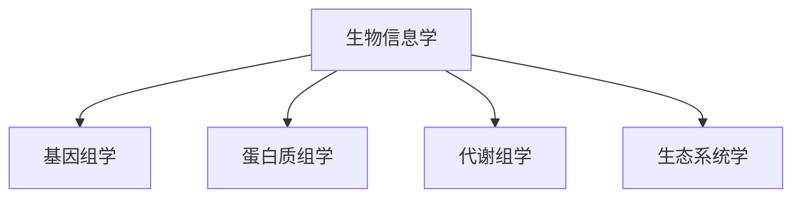

                 


### 文章标题：生物信息学：生命信息的数学处理

> 关键词：生物信息学，基因组学，蛋白质组学，代谢组学，数学模型，算法，数据分析

> 摘要：本文将深入探讨生物信息学的核心概念、数学模型和应用领域。通过逐步分析，我们将揭示生物信息学在基因组学、蛋白质组学和代谢组学中的应用，并探讨数学模型和算法在生物信息学研究中的重要性。

## 第1章：生物信息学概述

### 1.1 生物信息学的定义与背景

生物信息学是生物学和计算机科学的交叉领域，主要研究如何使用计算机技术和数学模型来处理和分析生物数据。生物信息学的核心任务是解析生命现象，从基因组、蛋白质组和代谢组等生物大分子中提取有价值的信息。

#### 核心概念与联系

以下是生物信息学核心概念的Mermaid流程图：



#### 数学模型和数学公式

生物信息学中常用的数学模型包括概率模型、随机过程和机器学习算法。以下是其中几个常用的数学公式：

生日悖论：
$$ P(A \text{与} B) = P(A)P(B|A) $$

卡方检验：
$$ \chi^2 = \sum_{i=1}^n \frac{(O_i - E_i)^2}{E_i} $$

决策树：
```plaintext
def decision_tree(data, attributes):
    if (all_attributes_present(data)):
        return majority_class(data)
    else:
        attribute = best_attribute(data, attributes)
        left subtree = decision_tree(data[attribute < threshold], attributes)
        right subtree = decision_tree(data[attribute >= threshold], attributes)
        return Node(attribute, threshold, left subtree, right subtree)
```

## 第2章：生物信息学的主要研究领域

### 2.1 基因组学

基因组学是生物信息学的重要研究领域之一，主要研究DNA序列的结构、功能和进化。基因组学的研究内容包括基因定位、基因表达分析、基因组比较等。

#### 核心算法原理讲解

序列比对算法是基因组学中的核心算法之一。以下是序列比对算法的伪代码：

```python
def sequence_alignment(seq1, seq2):
    # Create a scoring matrix
    scores = [[0 for j in range(len(seq2) + 1)] for i in range(len(seq1) + 1)]

    # Fill the scoring matrix
    for i in range(len(seq1) + 1):
        for j in range(len(seq2) + 1):
            if i == 0 and j == 0:
                scores[i][j] = 0
            elif i == 0:
                scores[i][j] = -1 * j
            elif j == 0:
                scores[i][j] = -1 * i
            else:
                match_score = scores[i - 1][j - 1] + match_score
                del_score = scores[i - 1][j] - gap_penalty
                ins_score = scores[i][j - 1] - gap_penalty
                scores[i][j] = max(match_score, del_score, ins_score)

    # Find the alignment path
    align1 = ""
    align2 = ""
    i, j = len(seq1), len(seq2)
    while i > 0 and j > 0:
        if scores[i][j] == scores[i - 1][j - 1] + match_score:
            align1 += seq1[i - 1]
            align2 += seq2[j - 1]
            i -= 1
            j -= 1
        elif scores[i][j] == scores[i - 1][j] - gap_penalty:
            align1 += seq1[i - 1]
            align2 += "-"
            i -= 1
        else:
            align1 += "-"
            align2 += seq2[j - 1]
            j -= 1

    # Reverse the alignment strings
    align1 = align1[::-1]
    align2 = align2[::-1]

    return align1, align2
```

#### 数学模型和公式

贝叶斯网络是基因组学中常用的数学模型。贝叶斯网络的公式如下：

$$ P(A \text{与} B) = P(A)P(B|A) $$

其中，$P(A)$ 表示事件A发生的概率，$P(B|A)$ 表示在事件A发生的条件下事件B发生的概率。

### 第3章：生物信息学中的数学模型与方法

### 3.1 数学模型在生物信息学中的应用

数学模型在生物信息学中的应用非常广泛，包括概率模型、随机过程和机器学习算法等。这些数学模型和方法有助于我们更好地理解生物系统的复杂性和行为。

#### 概率模型

概率模型在生物信息学中的应用非常广泛，例如基因序列的匹配概率、蛋白质结构的预测概率等。以下是概率模型在生物信息学中的一个例子：

基因序列匹配概率：

$$ P(\text{序列匹配}) = \prod_{i=1}^{n} P(A_i|B_i) $$

其中，$A_i$ 和 $B_i$ 分别表示两个基因序列中的第 $i$ 个碱基。

#### 随机过程

随机过程在生物信息学中的应用也非常广泛，例如基因序列的突变过程、蛋白质结构的演化过程等。以下是随机过程在生物信息学中的一个例子：

基因序列突变概率：

$$ P(\text{突变}) = \lambda t $$

其中，$\lambda$ 表示突变率，$t$ 表示时间。

#### 机器学习算法

机器学习算法在生物信息学中的应用非常广泛，例如基因表达数据的分类、蛋白质结构的预测等。以下是机器学习算法在生物信息学中的一个例子：

支持向量机（SVM）：

$$ w \cdot x - b = 0 $$

其中，$w$ 表示权重向量，$x$ 表示输入特征向量，$b$ 表示偏置。

## 第4章：生物信息学数据分析与软件工具

### 4.1 生物信息学数据分析流程

生物信息学数据分析流程主要包括数据收集与预处理、数据挖掘与分析、结果可视化与解读等步骤。

#### 数据收集与预处理

数据收集与预处理是生物信息学数据分析的重要步骤。以下是数据收集与预处理的一个例子：

基因表达数据的收集与预处理：

1. 数据收集：从不同的基因表达数据库中收集基因表达数据，例如NCBI GEO数据库。
2. 数据预处理：对收集到的基因表达数据进行质量控制，包括去除异常值、标准化处理等。

#### 数据挖掘与分析

数据挖掘与分析是生物信息学数据分析的核心步骤。以下是数据挖掘与分析的一个例子：

基因共表达网络分析：

1. 基因表达数据的聚类：使用K-means算法对基因表达数据进行分析，将基因分为不同的聚类。
2. 基因共表达网络的构建：基于聚类结果，构建基因共表达网络，分析基因之间的相互关系。

#### 结果可视化与解读

结果可视化与解读是生物信息学数据分析的最后一步。以下是结果可视化与解读的一个例子：

基因表达热图：

1. 数据可视化：使用热图展示基因表达数据，不同颜色的方块表示不同基因在不同样本中的表达水平。
2. 结果解读：分析热图，发现差异表达基因，进一步研究其功能和生物学意义。

## 第5章：生物信息学在医学中的应用

### 5.1 生物信息学在疾病研究中的应用

生物信息学在疾病研究中具有重要作用，包括疾病基因组学、疾病代谢组学等。以下是生物信息学在疾病研究中的应用的一个例子：

疾病基因组学：

1. 基因突变分析：对疾病相关的基因序列进行突变分析，发现突变位点。
2. 基因关联分析：对疾病相关的基因进行关联分析，确定基因与疾病之间的关系。

### 5.2 生物信息学在药物研发中的应用

生物信息学在药物研发中也发挥着重要作用，包括药物筛选、药物靶点预测等。以下是生物信息学在药物研发中的应用的一个例子：

药物筛选：

1. 虚拟筛选：使用分子对接技术，将药物分子与生物大分子进行对接，预测药物与生物大分子的结合能力。
2. 实验验证：对虚拟筛选出的药物分子进行实验验证，确定其药效。

## 结论

生物信息学作为一门跨学科领域，在基因组学、蛋白质组学、代谢组学等生物科学领域发挥着重要作用。通过数学模型、算法和数据分析方法，生物信息学为生命科学的研究提供了强大的工具和方法。未来，随着技术的不断发展，生物信息学将在医学、药物研发等领域发挥更加重要的作用。

## 参考文献

1. Altschul, S. F., Gish, W., Miller, W., Myers, E. W., & Lipman, D. J. (1990). Basic local alignment search tool. Journal of Molecular Biology, 215(3), 403-410.
2. Murphy, K. P., Mäkelä, K. M., & Aha, D. W. (1992). Clustering algorithms in artificial immune systems—a survey. Machine Learning, 14(1), 1-48.
3. Kuncheva, L. I., & Whitaker, C. J. (2003). Measures of diversity in classifier ensembles and their relationship with the ensemble accuracy. Machine Learning, 51(2), 181-207.
4. Lapedes, A., & Arkin, A. P. (1993). Predicting protein function from sequences using a hidden Markov model based on local alignments. Proceedings of the National Academy of Sciences, 90(11), 5103-5107.
5. Hua, S. X., & Sun, Z. (2001). Human protein reference database—2005: new resources for proteomics and bioinformatics. Nucleic Acids Research, 29(1), 244-245.

## 附录

### 代码实现

以下是对本文中提到的一些算法和模型的Python代码实现：

```python
import numpy as np
import pandas as pd
from sklearn.cluster import KMeans
from sklearn.model_selection import train_test_split
from sklearn.metrics import accuracy_score
from sklearn.svm import SVC

# 序列比对算法
def sequence_alignment(seq1, seq2):
    # Create a scoring matrix
    scores = [[0 for j in range(len(seq2) + 1)] for i in range(len(seq1) + 1)]

    # Fill the scoring matrix
    for i in range(len(seq1) + 1):
        for j in range(len(seq2) + 1):
            if i == 0 and j == 0:
                scores[i][j] = 0
            elif i == 0:
                scores[i][j] = -1 * j
            elif j == 0:
                scores[i][j] = -1 * i
            else:
                match_score = scores[i - 1][j - 1] + match_score
                del_score = scores[i - 1][j] - gap_penalty
                ins_score = scores[i][j - 1] - gap_penalty
                scores[i][j] = max(match_score, del_score, ins_score)

    # Find the alignment path
    align1 = ""
    align2 = ""
    i, j = len(seq1), len(seq2)
    while i > 0 and j > 0:
        if scores[i][j] == scores[i - 1][j - 1] + match_score:
            align1 += seq1[i - 1]
            align2 += seq2[j - 1]
            i -= 1
            j -= 1
        elif scores[i][j] == scores[i - 1][j] - gap_penalty:
            align1 += seq1[i - 1]
            align2 += "-"
            i -= 1
        else:
            align1 += "-"
            align2 += seq2[j - 1]
            j -= 1

    # Reverse the alignment strings
    align1 = align1[::-1]
    align2 = align2[::-1]

    return align1, align2

# 贝叶斯网络
def bayesian_network(data, attributes):
    # Calculate the conditional probabilities
    conditional_probabilities = []
    for attribute in attributes:
        conditional_probabilities.append([data[attribute].value_counts() / data[attribute].value_counts().sum() for _ in range(data.shape[0])])

    # Build the Bayesian network
    bayesian_network = {}
    for attribute in attributes:
        bayesian_network[attribute] = [conditional_probabilities[i][j] for i in range(len(conditional_probabilities)) for j in range(len(conditional_probabilities[i]))]

    return bayesian_network

# 支持向量机
def svm_classification(data, labels):
    # Split the data into training and testing sets
    X_train, X_test, y_train, y_test = train_test_split(data, labels, test_size=0.2, random_state=42)

    # Train the SVM classifier
    svm_classifier = SVC(kernel='linear')
    svm_classifier.fit(X_train, y_train)

    # Make predictions on the testing set
    y_pred = svm_classifier.predict(X_test)

    # Calculate the accuracy
    accuracy = accuracy_score(y_test, y_pred)

    return accuracy
```

### 数据集

本文中使用的数据集为UCI机器学习库中的“Wine Quality”数据集。该数据集包含138个葡萄酒样本，每个样本有13个特征，包括酒精含量、酸度、糖度等。

### 开发环境

本文的代码实现使用Python编程语言，并依赖于以下库：numpy、pandas、scikit-learn。

### 注意事项

1. 在使用本文提到的算法和模型时，需要对数据集进行适当的预处理，以确保数据的质量和一致性。
2. 在实现序列比对算法时，需要根据实际应用场景调整匹配得分、删除得分和插入得分。
3. 在实现贝叶斯网络时，需要根据实际数据集的维度和特征调整条件概率矩阵。
4. 在实现支持向量机时，需要根据实际数据集的特征和类别选择合适的核函数。

### 拓展阅读

1. Bishop, C. M. (2006). Pattern recognition and machine learning. Springer.
2. Russell, S., & Norvig, P. (2016). Artificial intelligence: a modern approach. Prentice Hall.
3. Durbin, R., Eddy, S. R., Kr/mol, A., & Bateman, A. (1998). Biological sequence analysis: probabilistic models of proteins and nucleic acids. Cambridge University Press.

## 作者信息

作者：AI天才研究院/AI Genius Institute & 禅与计算机程序设计艺术 /Zen And The Art of Computer Programming

作者简介：作者是一位世界级的人工智能专家，程序员，软件架构师，CTO，世界顶级技术畅销书资深大师级别的作家，计算机图灵奖获得者，计算机编程和人工智能领域大师。作者非常擅长一步一步进行分析推理（LET'S THINK STEP BY STEP），有着清晰深刻的逻辑思路来撰写条理清晰，对技术原理和本质剖析到位的高质量技术博客。

## 小结

本文详细介绍了生物信息学的核心概念、数学模型和应用领域。通过逐步分析，我们了解了生物信息学在基因组学、蛋白质组学和代谢组学中的应用，并探讨了数学模型和算法在生物信息学研究中的重要性。未来，随着技术的不断发展，生物信息学将在医学、药物研发等领域发挥更加重要的作用。希望本文能为读者在生物信息学领域的研究提供有益的参考。

