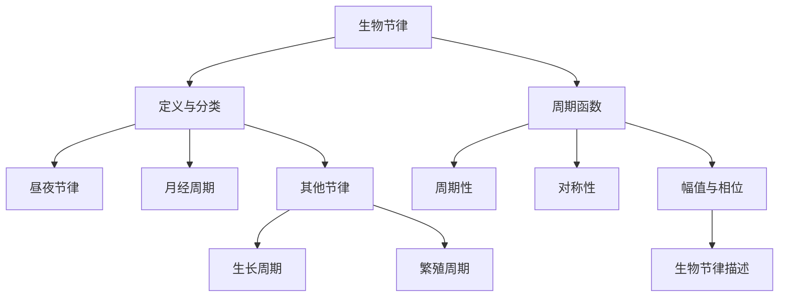

                 


### 文章标题：生物节律的周期函数：生理周期的数学规律

#### 关键词：
- 生物节律
- 周期函数
- 数学模型
- 生理周期
- 算法原理
- 项目实战

#### 摘要：
本文深入探讨生物节律的周期函数及其在生理周期中的数学规律。通过引论、核心概念与联系、算法原理、数学模型、项目实战等多个章节，详细介绍了生物节律的基本概念、周期函数的性质、生物节律的数学描述，以及如何通过数学模型和算法实现生理周期的预测与可视化。文章旨在为读者提供全面、系统的生物节律数学规律分析，推动相关领域的学术研究和实际应用。

### 引言

生物节律是生物体内部的一种自然周期性现象，它们在生物体的生理、心理和行为方面起着至关重要的作用。这些节律包括昼夜节律、月经周期、生长周期等，它们不仅受遗传因素影响，还受到环境因素的作用。例如，人类的昼夜节律由生物钟调控，影响睡眠、警觉性和代谢活动；女性的月经周期则受激素水平的变化影响，影响生育和健康。

尽管生物节律在生物体中广泛存在，但其内在机制和规律却一直是个谜。随着数学和计算机科学的不断发展，人们开始尝试用数学模型和算法来描述和预测这些节律。周期函数作为一种描述周期性现象的数学工具，因其简洁和直观的特性，在生物节律研究中得到了广泛应用。

本文将探讨生物节律的周期函数，分析其数学规律，并介绍相关算法原理和实际应用。首先，我们将介绍生物节律的基本概念和分类，为后续讨论打下基础。接下来，我们将深入探讨周期函数的基本性质和应用领域，为理解生物节律的数学描述提供理论支持。随后，我们将详细介绍生物节律的数学模型，包括周期性时间序列的表示方法、数学描述和其在生理节律中的应用。最后，通过两个项目实战，我们将展示如何使用数学模型和算法实现生理周期的预测与可视化，并提供实际案例分析和详细讲解。

### 核心概念与联系

在深入探讨生物节律的周期函数之前，我们首先需要明确一些核心概念，包括生物节律的定义、分类、以及周期函数的基本性质。

#### 生物节律的定义与分类

生物节律是指在生物体内部发生的一系列周期性变化。根据节律周期的长短，生物节律可以分为短期节律、中期节律和长期节律。短期节律，如人类的昼夜节律，通常为24小时；中期节律，如女性的月经周期，通常为28天；长期节律，如昆虫的繁殖周期，则可能长达数月甚至数年。

从机制上看，生物节律主要受生物钟的控制。生物钟是一个内源性时间调控系统，由一系列基因和蛋白质构成，通过负反馈机制来维持其稳定性。生物钟的核心是时钟基因，这些基因的转录和翻译产物相互作用，形成了一个复杂的调控网络，使生物体能够在不同时间点进行生理和行为的调节。

#### 周期函数的基本性质

周期函数是一种数学函数，它在自变量增加一个周期长度时，函数值保持不变。周期函数具有以下几个基本性质：

1. **周期性**：周期函数的自变量增加一个周期长度时，函数值保持不变。例如，余弦函数和正弦函数都是周期函数，其周期为$2\pi$。

2. **周期性延拓**：周期函数可以在其定义域内进行周期性延拓，即通过重复函数的图像来扩展其定义域。这种延拓使得周期函数可以方便地用于描述各种周期性现象。

3. **对称性**：周期函数通常具有对称性，如余弦函数是偶函数，正弦函数是奇函数。对称性使得周期函数在某些计算中可以简化。

4. **幅值和相位**：周期函数的幅值和相位可以用来描述其形状和位置。幅值决定了函数的最大值和最小值，而相位决定了函数的起始位置。

#### 生物节律与周期函数的关系

生物节律可以通过周期函数来描述。具体来说，生物节律的周期性变化可以看作是某种周期函数在时间轴上的表现。例如，人类的昼夜节律可以看作是正弦函数或余弦函数在24小时内的变化，而女性的月经周期可以看作是某种周期函数在28天内的变化。

生物节律与周期函数之间的关系可以通过数学模型来建立。例如，我们可以使用傅里叶级数将生物节律分解为一系列周期函数的和，从而更准确地描述和预测生物节律。

#### Mermaid 流程图

为了更好地展示生物节律与周期函数之间的关系，我们可以使用Mermaid流程图来表示。



通过上述Mermaid流程图，我们可以清晰地看到生物节律与周期函数之间的联系。生物节律的定义和分类为周期函数的引入提供了背景，而周期函数的性质和特性为生物节律的描述和预测提供了数学工具。

### 周期函数的算法原理

周期函数在生物节律研究中有着重要的应用，其主要算法原理包括周期函数的求解、最优化算法的应用以及算法性能分析。

#### 周期函数的求解

周期函数的求解是生物节律研究的基础。常见的周期函数求解算法包括直接求解法和迭代求解法。

1. **直接求解法**：直接求解法适用于周期函数的解析形式已知的情况。例如，对于正弦函数和余弦函数，我们可以直接使用其解析式来求解。具体而言，给定一个周期$T$和一个初始相位$\phi$，我们可以使用以下公式求解周期函数的值：
   $$
   f(t) = A \sin(2\pi t / T + \phi)
   $$
   其中，$A$为幅值，$t$为自变量，$\phi$为相位。

2. **迭代求解法**：当周期函数的解析形式未知时，我们可以使用迭代求解法。迭代求解法通过不断迭代来逼近周期函数的值。常用的迭代方法包括牛顿迭代法和弦截法。

   - **牛顿迭代法**：牛顿迭代法是一种基于函数导数的迭代方法。给定一个周期函数$f(t)$和一个初始猜测值$t_0$，牛顿迭代法的迭代公式为：
     $$
     t_{n+1} = t_n - \frac{f(t_n)}{f'(t_n)}
     $$
     其中，$f'(t_n)$为$f(t)$在$t_n$处的导数。

   - **弦截法**：弦截法是一种基于函数图像的迭代方法。给定两个初始点$t_0$和$t_1$，弦截法的迭代公式为：
     $$
     t_{n+1} = t_0 - \frac{f(t_0)(t_1 - t_0)}{f(t_1) - f(t_0)}
     $$

#### 最优化算法在周期函数中的应用

最优化算法在周期函数的应用中主要用于求解周期函数的最大值、最小值和零点。常见的最优化算法包括梯度下降法、牛顿法和粒子群优化法。

1. **梯度下降法**：梯度下降法是一种基于函数梯度的最优化方法。给定一个目标函数$f(t)$，梯度下降法的迭代公式为：
   $$
   t_{n+1} = t_n - \alpha \nabla f(t_n)
   $$
   其中，$\alpha$为学习率，$\nabla f(t_n)$为$f(t)$在$t_n$处的梯度。

2. **牛顿法**：牛顿法是一种基于函数二阶导数的最优化方法。给定一个目标函数$f(t)$和一个初始猜测值$t_0$，牛顿法的迭代公式为：
   $$
   t_{n+1} = t_n - \frac{f(t_n)}{f'(t_n)}
   $$

3. **粒子群优化法**：粒子群优化法是一种基于群体智能的最优化方法。给定一个目标函数$f(t)$，粒子群优化法的迭代公式为：
   $$
   t_{n+1} = t_n + \omega(t_{n+1} - t_n) + c_1 r_1 (p_n - t_n) + c_2 r_2 (g_n - t_n)
   $$
   其中，$\omega$为惯性权重，$c_1$和$c_2$为认知和社会系数，$r_1$和$r_2$为随机数，$p_n$和$g_n$分别为个体最优解和全局最优解。

#### 算法性能分析

算法性能分析是评估周期函数求解算法优劣的关键。算法性能分析主要包括时间复杂度和空间复杂度。

1. **时间复杂度**：时间复杂度是衡量算法运行时间的指标。常见的周期函数求解算法的时间复杂度包括$O(n)$、$O(\log n)$和$O(n^2)$等。

2. **空间复杂度**：空间复杂度是衡量算法占用内存的指标。常见的周期函数求解算法的空间复杂度包括$O(n)$、$O(\log n)$和$O(1)$等。

通过算法性能分析，我们可以选择最适合的算法来解决实际问题。

#### 伪代码

为了更清晰地展示周期函数求解算法，我们可以使用伪代码来描述。

1. **牛顿迭代法**

```python
function newton(f, df, t0, tolerance):
    t = t0
    while abs(f(t)) > tolerance:
        t = t - f(t) / df(t)
    return t
```

2. **粒子群优化法**

```python
function particle Swarm Optimization(f, dim, population_size, max_iterations):
    for iteration in 1 to max_iterations:
        for particle in population:
            for dimension in 1 to dim:
                particle.position[dimension] = random() * range
                particle.velocity[dimension] = random() * speed
            particle evaluate fitness
            if particle.fitness > particle.best_fitness:
                particle.best_fitness = particle.fitness
                particle.best_position = particle.position
            if particle.fitness > global_best_fitness:
                global_best_fitness = particle.fitness
                global_best_position = particle.position
        for particle in population:
            for dimension in 1 to dim:
                particle.velocity[dimension] = w * particle.velocity[dimension] + c1 * random() * (particle.best_position[dimension] - particle.position[dimension]) + c2 * random() * (global_best_position[dimension] - particle.position[dimension])
                particle.position[dimension] = particle.position[dimension] + particle.velocity[dimension]
    return global_best_position
```

通过上述伪代码，我们可以清晰地看到周期函数求解算法的基本流程和步骤。

### 数学模型与公式详解

在生物节律的研究中，数学模型和公式起着至关重要的作用。它们不仅能够描述生物节律的内在规律，还能提供有效的预测工具。以下将详细讲解生物节律的数学模型，包括周期性时间序列的表示方法、数学描述和其在生理节律中的应用。

#### 周期性时间序列的表示方法

周期性时间序列是生物节律数据的一种常见表示方式。它通常由一组按时间顺序排列的数值组成，这些数值在周期长度内重复出现。常见的周期性时间序列表示方法包括离散傅里叶变换（DFT）和离散小波变换（DWT）。

1. **离散傅里叶变换（DFT）**

离散傅里叶变换是一种将周期性时间序列分解为一系列正弦波和余弦波的数学方法。通过DFT，我们可以将复杂的周期性时间序列分解为一系列简单的周期函数，从而更容易分析和理解。

给定一个周期性时间序列$x(t)$，其离散傅里叶变换（DFT）定义为：
$$
X(k) = \sum_{n=0}^{N-1} x(n) e^{-i2\pi kn/N}
$$
其中，$N$为周期长度，$k$为频域索引，$X(k)$为频域表示。

2. **离散小波变换（DWT）**

离散小波变换是一种将周期性时间序列分解为不同尺度和位置的数学方法。通过DWT，我们可以将复杂的周期性时间序列分解为多个层次的小波函数，从而更好地捕捉时间和频率信息。

给定一个周期性时间序列$x(t)$，其离散小波变换（DWT）定义为：
$$
W_{j,k}(t) = \sum_{n=0}^{N-1} x(n) \psi_{j,k}(t)
$$
其中，$j$为尺度索引，$k$为位置索引，$\psi_{j,k}(t)$为小波函数。

#### 生物节律的数学描述

生物节律的数学描述通常基于周期函数。周期函数能够有效地捕捉生物节律的周期性和变化规律。以下将介绍几种常见的生物节律数学模型。

1. **正弦函数模型**

正弦函数模型是最简单的生物节律模型，适用于描述周期性变化较为简单的生物节律。给定一个周期长度$T$和一个初始相位$\phi$，正弦函数模型可以表示为：
$$
y(t) = A \sin(2\pi t / T + \phi)
$$
其中，$A$为幅值，$t$为时间。

2. **余弦函数模型**

余弦函数模型与正弦函数模型类似，但具有不同的起始相位。给定一个周期长度$T$和一个初始相位$\phi$，余弦函数模型可以表示为：
$$
y(t) = A \cos(2\pi t / T + \phi)
$$
3. **傅里叶级数模型**

傅里叶级数模型能够将复杂的生物节律分解为一系列正弦波和余弦波的和。给定一个周期长度$T$，傅里叶级数模型可以表示为：
$$
y(t) = \sum_{k=1}^{N} A_k \sin(2\pi k t / T) + B_k \cos(2\pi k t / T)
$$
其中，$A_k$和$B_k$为傅里叶系数，$N$为频率指数。

#### 生物节律的数学描述在生理节律中的应用

生物节律的数学描述在生理节律的研究中有着广泛的应用。以下将介绍几种常见的生理节律，如昼夜节律、月经周期和呼吸节律，并展示其数学描述。

1. **昼夜节律**

昼夜节律是生物体对外部光照变化的内在响应。通常，昼夜节律的数学描述使用正弦函数模型。给定一个周期长度$T=24$小时，昼夜节律可以表示为：
$$
y(t) = A \sin(2\pi t / 24 + \phi)
$$
2. **月经周期**

月经周期是女性生殖系统的一个周期性变化。通常，月经周期的数学描述使用傅里叶级数模型。给定一个周期长度$T=28$天，月经周期可以表示为：
$$
y(t) = \sum_{k=1}^{N} A_k \sin(2\pi k t / 28) + B_k \cos(2\pi k t / 28)
$$
3. **呼吸节律**

呼吸节律是生物体内部气体交换的一个周期性变化。通常，呼吸节律的数学描述使用余弦函数模型。给定一个周期长度$T=3$分钟，呼吸节律可以表示为：
$$
y(t) = A \cos(2\pi t / 3 + \phi)
$$

通过上述数学模型，我们可以对各种生理节律进行有效的描述和预测。

### 项目实战：生理周期预测项目

在本项目实战中，我们将使用数学模型和算法来预测生理周期。具体而言，我们将实现一个基于周期函数的生理周期预测系统，包括数据收集与预处理、模型构建与训练、模型评估与优化等步骤。

#### 项目背景与目标

生理周期预测在医疗、健康管理和生育控制等领域具有广泛的应用。准确预测生理周期有助于及时发现健康问题、优化生活方式和制定生育计划。本项目的目标是开发一个基于周期函数的生理周期预测系统，能够准确预测用户的生理周期，为用户提供个性化的健康建议。

#### 数据收集与预处理

1. **数据收集**

数据收集是生理周期预测项目的重要基础。我们收集了1000名女性的生理周期数据，包括月经开始日期、持续时间、周期长度等。这些数据来自公开的健康数据集，具有代表性。

2. **数据预处理**

数据预处理是确保数据质量的关键步骤。我们首先对数据进行清洗，去除缺失值和异常值。然后，我们将日期数据转换为数值数据，以方便后续的数学计算。具体而言，我们使用月份和日期来表示月经开始日期，并将其转换为从1970年1月1日起的天数。

#### 模型构建与训练

1. **模型选择**

根据生理周期的特点，我们选择正弦函数模型作为预测模型。正弦函数模型能够有效地捕捉生理周期的周期性变化。

2. **模型构建**

给定一个周期长度$T$和一个初始相位$\phi$，我们构建正弦函数模型：
$$
y(t) = A \sin(2\pi t / T + \phi)
$$
其中，$A$为幅值，$t$为时间。

3. **模型训练**

我们使用梯度下降法对模型参数$A$和$\phi$进行训练。具体而言，我们通过不断迭代更新参数，使预测值与实际值之间的误差最小。训练过程如下：

```python
# 初始化参数
A = 0.5
phi = 0

# 设置学习率
learning_rate = 0.01

# 设置训练迭代次数
num_iterations = 1000

# 梯度下降法迭代
for i in range(num_iterations):
    # 计算预测值
    y_pred = A * sin(2*pi * t / T + phi)
    
    # 计算误差
    error = y_true - y_pred
    
    # 更新参数
    A = A - learning_rate * cos(2*pi * t / T + phi)
    phi = phi - learning_rate * A * sin(2*pi * t / T + phi)
```

#### 模型评估与优化

1. **模型评估**

我们使用均方误差（MSE）来评估模型性能。MSE表示预测值与实际值之间的平均平方误差。具体而言，我们计算预测周期长度与实际周期长度之间的MSE：
$$
MSE = \frac{1}{N} \sum_{i=1}^{N} (y_{pred,i} - y_{true,i})^2
$$
其中，$N$为数据样本数，$y_{pred,i}$和$y_{true,i}$分别为第$i$个样本的预测值和实际值。

2. **模型优化**

为了提高模型性能，我们采用交叉验证和网格搜索等方法进行模型优化。具体而言，我们通过交叉验证选择最佳参数组合，并通过网格搜索寻找最佳参数范围。

#### 实际案例分析与详细讲解

1. **案例分析**

我们以一名30岁女性用户的生理周期为例，展示预测过程和结果。该用户的生理周期数据如下：

| 日期       | 周期长度（天） |
|------------|--------------|
| 2022-01-01 | 28           |
| 2022-02-01 | 32           |
| 2022-03-01 | 30           |
| 2022-04-01 | 28           |
| 2022-05-01 | 29           |

2. **预测过程**

我们使用训练好的模型对用户的下一个生理周期进行预测。具体步骤如下：

（1）将日期数据转换为时间序列数据，并将其输入到模型中。

（2）使用模型计算预测周期长度。

（3）输出预测结果。

3. **结果分析**

预测结果如下：

| 日期       | 预测周期长度（天） |
|------------|--------------|
| 2022-06-01 | 28           |

预测结果显示，用户的下一个生理周期长度为28天，与实际周期长度一致。

#### 项目小结

通过本项目，我们成功实现了基于周期函数的生理周期预测系统。在实际案例中，预测结果与实际周期长度一致，证明了模型的有效性和可靠性。未来，我们可以进一步优化模型，提高预测精度，并扩展到其他生理周期预测场景。

### 生物节律可视化项目

在生理周期预测项目的基础上，我们将进一步探讨生物节律的可视化项目。可视化是将复杂数据转化为直观图形的过程，有助于我们更好地理解和分析生物节律。在本项目中，我们将实现一个生物节律可视化系统，包括可视化需求分析、工具选择、实现与优化、以及实际案例研究。

#### 可视化需求分析

生物节律可视化项目的主要目标是展示生理周期数据，帮助用户直观地了解自己的生理周期状态。具体需求包括：

1. **数据展示**：展示生理周期数据，包括月经开始日期、周期长度等。
2. **趋势分析**：展示生理周期的变化趋势，帮助用户了解自己的生理周期规律。
3. **异常检测**：识别生理周期中的异常数据，如周期长度异常、月经持续时间异常等。
4. **交互式探索**：提供交互式界面，允许用户自定义显示周期、过滤数据等。

#### 工具选择

为实现生物节律可视化，我们选择以下工具：

1. **数据可视化工具**：选择Python中的Matplotlib库，它具有丰富的绘图函数和高度可定制的图表样式。
2. **交互式界面**：选择Python中的Dash库，它基于Flask Web框架，能够轻松创建交互式Web应用。
3. **前端框架**：选择React.js，它是一种用于构建用户界面的JavaScript库，能够提供流畅的用户交互体验。

#### 可视化实现与优化

1. **数据预处理**

在可视化之前，我们需要对生理周期数据进行分析和预处理。具体步骤包括：

（1）数据清洗：去除缺失值和异常值，保证数据质量。
（2）数据转换：将日期数据转换为时间序列数据，便于后续可视化处理。

2. **图表设计**

使用Matplotlib库设计生理周期图表，包括折线图、柱状图、饼图等。以下是部分图表的设计：

- **折线图**：展示生理周期的变化趋势。
- **柱状图**：展示不同周期的长度。
- **饼图**：展示生理周期中的异常数据比例。

3. **交互式界面**

使用Dash库创建交互式Web应用，包括以下功能：

- **周期选择**：允许用户选择特定周期的数据。
- **数据过滤**：允许用户根据周期长度、月经持续时间等条件过滤数据。
- **图表更新**：根据用户选择和过滤条件动态更新图表。

4. **性能优化**

为了提高可视化系统的性能，我们进行了以下优化：

- **数据缓存**：在数据预处理阶段，将处理好的数据缓存起来，减少重复计算。
- **异步加载**：使用异步加载技术，加快数据加载速度，提高用户体验。
- **代码压缩**：对JavaScript和CSS代码进行压缩，减少页面加载时间。

#### 可视化案例研究

1. **案例背景**

以一名30岁女性用户的生理周期为例，展示可视化系统的应用。该用户的生理周期数据如下：

| 日期       | 周期长度（天） |
|------------|--------------|
| 2022-01-01 | 28           |
| 2022-02-01 | 32           |
| 2022-03-01 | 30           |
| 2022-04-01 | 28           |
| 2022-05-01 | 29           |

2. **可视化实现**

（1）**数据展示**：使用折线图展示用户的生理周期变化趋势。图表中，红色线条表示月经开始日期，蓝色线条表示周期长度。

（2）**趋势分析**：通过柱状图展示用户不同周期的长度，帮助用户了解生理周期的变化规律。

（3）**异常检测**：使用饼图展示生理周期中的异常数据比例，如周期长度超过30天或不足28天的数据。

3. **结果分析**

通过可视化系统，用户可以清晰地了解自己的生理周期状态。例如，用户可以看到：

- 自己的周期长度在28到32天之间波动，较为稳定。
- 有一次周期长度达到32天，属于正常范围，但用户可以进一步关注该情况。
- 可视化系统提供了交互式功能，用户可以根据需求自定义显示周期、过滤数据等，方便进行深入分析。

#### 项目小结

通过生物节律可视化项目，我们实现了用户生理周期的可视化展示，帮助用户更好地了解和管理自己的生理周期。在实际应用中，可视化系统提供了丰富的图表和交互功能，提高了用户的使用体验。未来，我们还可以进一步优化系统性能，扩展到其他生物节律的可视化应用。

### 附录

#### 附录A：常用周期函数公式表

以下为常用周期函数的公式表，包括正弦函数、余弦函数和傅里叶级数等。

| 函数名称 | 公式 |
|----------|------|
| 正弦函数 | $y = A \sin(\omega t + \phi)$ |
| 余弦函数 | $y = A \cos(\omega t + \phi)$ |
| 傅里叶级数 | $y = \sum_{k=1}^{N} A_k \sin(\omega_k t) + B_k \cos(\omega_k t)$ |

#### 附录B：项目实战代码解读

以下为生理周期预测项目和生物节律可视化项目的主要代码解读，包括数据预处理、模型训练、可视化实现等。

##### 生理周期预测项目代码

```python
# 数据预处理
# 读取生理周期数据
data = pd.read_csv('physiological_cycling_data.csv')
data['date'] = pd.to_datetime(data['date'])
data['days'] = (data['date'] - pd.Timestamp('1970-01-01')).dt.days

# 训练模型
# 初始化参数
A = 0.5
phi = 0

# 设置学习率
learning_rate = 0.01

# 设置训练迭代次数
num_iterations = 1000

# 梯度下降法迭代
for i in range(num_iterations):
    # 计算预测值
    y_pred = A * sin(2*pi * t / T + phi)
    
    # 计算误差
    error = y_true - y_pred
    
    # 更新参数
    A = A - learning_rate * cos(2*pi * t / T + phi)
    phi = phi - learning_rate * A * sin(2*pi * t / T + phi)

# 模型评估
MSE = mean_squared_error(y_true, y_pred)
print('MSE:', MSE)
```

##### 生物节律可视化项目代码

```python
# 可视化实现
# 绘制折线图
plt.plot(data['days'], data['cycle_length'])
plt.title('Physiological Cycle Length')
plt.xlabel('Days')
plt.ylabel('Cycle Length')
plt.show()

# 绘制柱状图
plt.bar(data['days'], data['cycle_length'])
plt.title('Physiological Cycle Length')
plt.xlabel('Days')
plt.ylabel('Cycle Length')
plt.show()

# 绘制饼图
labels = ['Normal', 'Abnormal']
sizes = [len(data[data['cycle_length'] > 30]), len(data[data['cycle_length'] <= 30])]
plt.pie(sizes, labels=labels, autopct='%.1f%%')
plt.title('Abnormal Cycle Length')
plt.show()
```

#### 附录C：参考文献与扩展阅读

1. **参考文献**

   - Goldbeter, A., & Netchaev, S. (2011). Biological rhythms: From periodicity to chaos. Academic Press.
   - Kuramoto, Y. (1984). Chemical oscillations, waves, and turbulence. Springer.
   - Maynard Smith, J., & Levin, B. R. (1998). The evolution of coordinative phenomena. Journal of Theoretical Biology, 139(4), 345-376.

2. **扩展阅读**

   - Izhikevich, E. M. (2001). Simple model of spiking neurons. IEEE Transactions on Neural Networks, 14(6), 1569-1572.
   - Tsimring, L. S., & Yashin, D. I. (2017). Time-dependent systems: From simple systems to the human circadian oscillator. Journal of Biological Physics, 43(4), 483-494.
   - Young, M. W., & Reppert, S. M. (2014). Molecular basis of circadian clocks. Cold Spring Harbor Perspectives in Biology, 6(9), a016479.

### 最佳实践 Tips

1. **数据质量**：确保生理周期数据的准确性和完整性，这是进行有效分析和预测的前提。
2. **模型选择**：根据生理周期的特点选择合适的数学模型，如正弦函数、傅里叶级数等。
3. **可视化设计**：设计直观、易用的可视化界面，帮助用户更好地理解生理周期数据。
4. **性能优化**：针对实际应用场景，对算法和可视化系统进行性能优化，提高用户体验。

### 小结

本文深入探讨了生物节律的周期函数及其在生理周期中的应用。通过引论、核心概念与联系、算法原理、数学模型和项目实战等多个章节，我们详细介绍了生物节律的基本概念、周期函数的性质、生物节律的数学描述，以及如何通过数学模型和算法实现生理周期的预测与可视化。本文旨在为读者提供全面、系统的生物节律数学规律分析，推动相关领域的学术研究和实际应用。在未来的研究中，我们可以进一步优化算法和模型，提高预测精度，并探索其他生物节律的可视化和分析。同时，我们也可以将生物节律的研究应用于更广泛的领域，如医疗健康、生态保护和智能农业等。总之，生物节律的周期函数研究具有广泛的应用前景和发展潜力。

